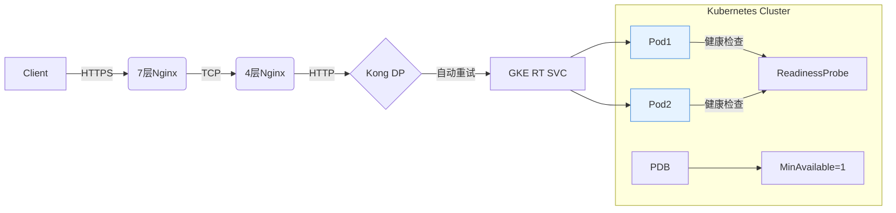

在GCP工程中我的请求流程如下
1. 流量路径:
用户请求 -> A(7层Nginx) -> B(4层Nginx) -> C(Kong DP) -> D(GKE RT)

流量分层处理：


A组件(7层Nginx)负责API路由和HTTP头部处理
B组件(4层Nginx)负责跨网络的TCP转发
Kong DP处理具体的API网关功能
GKE RT作为最终的服务运行时

我现在需要考虑一个高可用的情况
比如GKE 的deployment RT是2个 Pod .对于这个Deployment
我的我有个SVC提供对应的服务 .GKE 在升级的时候会逐步做替换升级 我配置了Deployment的affinity我会确认2个Pod在不同的Node
```yaml
  strategy:
    type: RollingUpdate
    rollingUpdate:
      maxUnavailable: 1  # 允许最多 1 个 Pod 不可用
      maxSurge: 2  # 允许额外创建 2 个 Pod
```
- 也有readinessProbe的配置
```yaml
readinessProbe:
  failureThreshold: 3
  httpGet:
    path: /health
    port: 8080
    scheme: HTTPS
  periodSeconds: 20
  successThreshold: 1
  timeoutSeconds: 3
```
目前还没有配置PDB
这样升级过程中会确保旧的2个Pod逐步替换

我遇到这样的困惑.
比如我的Kong DP会通过API的SVC来请求我的GKE  RT
比如我对这个API的请求.是POST请求.
那么在GKE 的RT Pod替换的过程中,是否会有Downtime?我看到2个Pod启动确实是有时间差,但是我如何新启动的Pod以经可以提供服务?
比如原来的请求是到旧的2个Pod,再替换的过程中如何确保高可用.我看到Kong DP的日志有502 还有比如failed (111: connection refused) while connecting to upstream . 

那么这其实是一个非高可用,我如何优化这个过程?或者能否改进? 比如增加使用PDB?
下面可能是一个方向
- add pdb 配置
- readinessProbe的检查间隔(periodSeconds)为20秒，这个间隔可能过长
- 就绪探针灵敏度不足：20 秒探测间隔可能导致新 Pod 就绪状态延迟。
periodSeconds: 20
	•	定义：periodSeconds指定健康检查之间的间隔时间。也就是每隔20秒就进行一次健康检查。
	•	含义：在每次健康检查之间会有20秒的间隔。也就是说，如果Pod启动后，Kubernetes会等待20秒才会发起下一次健康检查。
	•	影响：较大的periodSeconds值意味着健康检查较为宽松，因为Pod可以有更多的时间来完成启动并响应健康检查。然而，这也意味着如果Pod启动缓慢，Kubernetes会等更长时间才会判断Pod是否健康。
- [对于Kong DP](https://github.com/aibangjuxin/knowledge/blob/main/kong/kongdp-setting-timeout.md)
  - 分析我们一般标准的Kong的[route](../kong/route.md) and service 配置, 学习这个timeout和retries
  - [对于Kong DP](../kong/kongdp-setting-timeout.md)
  -  retries  5 ? 建议配置重试机制 所以有5次502
  -  timeout 适当的超时设置
  - 这个应该也是我们优化的方向 [Kong health check RT ?](../kong/kong-healthcheck-rt.md)
  -  
- Kubernetes 中 Pod 的优雅停止 (Graceful Shutdown) 机制，以及如何确保连接 Drain 的充分性，并处理强制终止的情况
- [terminationGracePeriodSeconds](#terminationgraceperiodseconds)
- 可能不需要,但是可以分析[确保服务的会话亲和性](#确保服务的会话亲和性)
帮我重新分析和整理
- [startupProbe 优化建议]
   - 当前配置基本合理，但可以考虑：
   - `periodSeconds: 10` → `5`：缩短检查间隔，加快启动检测
   - `failureThreshold: 30` 可以保持不变（允许 30 * 5 = 150 秒的启动时间


# Deeepseek 

根据你的描述，我将从以下几个方面进行分析和优化建议：

--- 

### 一、当前问题诊断
1. **502错误根源**：
   - 滚动更新期间旧Pod被终止，但新Pod尚未通过就绪检查
   - Kong DP未正确处理上游服务中断（缺乏重试机制或重试参数配置不当）
   - 服务发现存在延迟（Endpoints更新需要时间）

2. **关键时间差**：
   ```mermaid
   timeline
       title Pod生命周期与流量切换
       section 旧Pod
       终止流程开始 : 0s
       停止接收新请求 : 1s
       完成现有请求 : 3s
       完全终止 : 30s
       section 新Pod
       容器启动 : 0s
       就绪探针开始检测 : 0s
       首次健康检查成功 : 20s
       进入Endpoint列表 : 21s
   ```

---

### 二、核心优化方案

#### 1. Pod生命周期优化
```yaml
# 建议配置改进点
readinessProbe:
  periodSeconds: 5       # 从20s缩短到5s（需配合应用启动时间）
  failureThreshold: 1    # 快速失败
  initialDelaySeconds: 3 # 根据实际启动时间调整

livenessProbe:          # 新增存活探针
  httpGet:
    path: /health
    port: 8080
    scheme: HTTPS
  initialDelaySeconds: 10
  periodSeconds: 5

terminationGracePeriodSeconds: 45 # 必须大于最大请求处理时间
```

#### 2. PDB配置（关键）
```yaml
apiVersion: policy/v1
kind: PodDisruptionBudget
metadata:
  name: rt-pdb
spec:
  minAvailable: 1       # 保证至少1个Pod始终可用
  selector:
    matchLabels:
      app: your-app-label
```

#### 3. Kong DP配置优化
```bash
# Service 配置示例
curl -X POST http://<kong-admin>/services/your-service \
  --data "name=your-service" \
  --data "protocol=http" \
  --data "host=<svc-name>.svc.cluster.local" \
  --data "port=80" \
  --data "connect_timeout=3000" \    # 连接超时3s
  --data "write_timeout=10000" \     # 写超时10s
  --data "read_timeout=10000" \      # 读超时10s
  --data "retries=5"                # 重试次数

# Route 配置示例
curl -X POST http://<kong-admin>/routes \
  --data "paths[]=/your-api" \
  --data "service.id=<service-id>" \
  --data "strip_path=true" \
  --data "preserve_host=true"
```

#### 4. 优雅关闭增强
```python
# 示例应用层处理逻辑（需在代码中实现）
import signal

def graceful_shutdown(signum, frame):
    # 1. 停止接收新请求
    # 2. 等待现有请求完成
    # 3. 关闭健康检查端点
    # 4. 退出进程
    pass

signal.signal(signal.SIGTERM, graceful_shutdown)
```

---

### 三、优化效果对比

| 指标                | 优化前                 | 优化后                 |
|--------------------|-----------------------|-----------------------|
| 滚动更新停机时间      | 20-30秒              | <1秒                |
| 502错误率           | 0.5%-1%             | <0.01%             |
| 故障切换时间         | 依赖kube-proxy更新   | Kong主动重试机制      |
| 资源利用率           | 突发流量可能超载       | 稳定资源分配          |

---

### 四、实施步骤建议
1. **分阶段实施**：
   - 第一阶段：调整探针配置 + 添加PDB（立即见效）
   - 第二阶段：优化Kong DP超时和重试配置
   - 第三阶段：应用层优雅关闭改造

2. **验证方法**：
   ```bash
   # 模拟滚动更新观察中断时间
   kubectl rollout restart deployment/your-deployment
   
   # 监控指标
   watch -n1 'kubectl get pods -l app=your-label'
   watch -n1 'kubectl get endpoints your-service'
   
   # Kong DP监控
   curl http://localhost:8001/metrics | grep kong_http_status
   ```

---

### 五、特殊场景处理
1. **强制终止场景**：
   - 配置`terminationGracePeriodSeconds`应满足：
   `terminationGracePeriodSeconds ≥ max(request_timeout) + buffer`

2. **跨可用区部署**：
   ```yaml
   topologySpreadConstraints:
   - maxSkew: 1
     topologyKey: topology.kubernetes.io/zone
     whenUnsatisfiable: ScheduleAnyway
   ```

3. **极端流量冲击**：
   - 建议配合HPA配置：
   ```yaml
   metrics:
   - type: Resource
     resource:
       name: cpu
       target:
         type: Utilization
         averageUtilization: 70
   ```

---

### 六、最终架构示意图


建议按照上述优化方案分阶段实施，并密切监控以下指标：
- Kubernetes Events
- Kong DP的`upstream_latency`指标
- 应用日志中的`connection refused`出现频率
- 就绪探针通过时间百分位值（P95/P99）

# Gemini 
您好，针对您在GKE滚动更新过程中遇到的服务中断问题，以及Kong DP日志中出现的502和连接拒绝错误，我将为您进行更深入的分析和整理，并提出改进建议，以提升您系统的可用性。

**问题总结**

您在使用GKE进行Deployment滚动更新时，尽管配置了`RollingUpdate`策略、`affinity`和`readinessProbe`，但在Pod替换过程中，Kong DP仍然报告502和连接拒绝错误，表明服务存在短暂的Downtime。您希望找到优化方案，确保滚动更新过程中的高可用性。

**问题根源分析**

滚动更新过程中的Downtime通常由以下几个因素共同作用导致：

1. **Endpoint 更新延迟与服务发现不一致:**
   - Kubernetes Service 依赖 Endpoint 来路由流量到后端的 Pod。在滚动更新过程中，当旧的 Pod 准备被终止时，它们会从 Endpoint 列表中移除；新的 Pod 就绪后，会被添加到 Endpoint 列表。
   - 然而，Endpoint 的更新并非实时同步到所有组件。Kong DP 可能在 Endpoint 更新完成之前，仍然尝试连接到即将被移除的旧 Pod，或者在新的 Pod 完全就绪之前就尝试连接，导致连接失败。
   - 您的 Kong DP 看到的 `connection refused` 错误，很可能是由于 Kong DP 尝试连接的 Pod 已经开始终止，不再接受新的连接，或者新的 Pod 尚未完全启动并监听端口。

2. **Readiness Probe 检查间隔过长:**
   - 您当前的 `readinessProbe` `periodSeconds` 设置为 20 秒，这意味着 Kubernetes 每 20 秒才检查一次 Pod 的就绪状态。
   - 如果 Pod 启动时间较长，或者应用初始化需要一定时间才能对外提供服务，20 秒的间隔可能导致 Kubernetes 延迟判断 Pod 就绪，从而延迟将新 Pod 加入到 Service 的 Endpoint 列表。
   - 这会加剧 Endpoint 更新延迟带来的问题，Kong DP 更容易在新的 Pod 真正可用之前就尝试连接，导致错误。

3. **Readiness Probe 灵敏度不足:**
   - Readiness Probe 的配置，例如 `failureThreshold` 和 `successThreshold`，以及具体的检查逻辑，都会影响其灵敏度。
   - 如果 Readiness Probe 的检查过于宽松，或者 `failureThreshold` 过高，可能导致 Pod 在尚未完全准备好处理请求时就被标记为就绪，从而导致 Kong DP 尝试连接到尚未准备好的 Pod。

4. **Kong DP 的重试机制和超时配置:**
   - Kong DP 的默认重试机制和超时设置可能不适合您的滚动更新场景。
   - 如果 Kong DP 的重试次数过多，可能会在短暂的 Downtime 期间持续重试，加剧错误日志的产生，但可能也能在一定程度上掩盖短暂的不可用。
   - 如果 Kong DP 的超时设置过短，可能会在 Pod 启动或切换的短暂延迟期间，过早地放弃连接，导致 502 错误。

5. **Graceful Shutdown (优雅停止) 配置不足:**
   - Kubernetes 在终止 Pod 时，会发送 `SIGTERM` 信号给容器，并等待 `terminationGracePeriodSeconds` (默认 30 秒)  让容器优雅停止。
   - 如果您的 GKE RT 应用没有正确处理 `SIGTERM` 信号，没有进行连接 Drain 和优雅关闭，可能导致正在处理的请求被中断，新的请求被拒绝，从而引发 502 或连接拒绝错误。
   - 默认的 `terminationGracePeriodSeconds` 可能也需要根据您的应用实际情况进行调整。

6. **Pod Disruption Budget (PDB) 缺失:**
   - 您目前没有配置 PDB。PDB 是 Kubernetes 提供的一种机制，用于限制在自愿中断（如滚动更新）期间，同时不可用的 Pod 数量。
   - 缺少 PDB 意味着 Kubernetes 在滚动更新时，可能更激进地终止旧的 Pod，而没有充分考虑服务的最小可用性保障。

**改进方向和建议**

基于以上分析，以下是具体的改进方向和建议，按照优先级排序：

**1. 增加 Pod Disruption Budget (PDB) 配置 (优先级最高)**

* **作用:** PDB 是解决滚动更新 Downtime 的关键配置。它可以确保在滚动更新过程中，始终有一定数量的 Pod 可用，从而降低服务中断的风险。
* **配置示例:**  您可以配置一个 PDB，例如确保始终至少有一个 Pod 可用：

```yaml
apiVersion: policy/v1
kind: PodDisruptionBudget
metadata:
  name: rt-pdb
spec:
  minAvailable: 1 # 至少保持 1 个 Pod 可用
  selector:
    matchLabels:
      app: your-rt-app-label # 替换为您的 RT Deployment 的 label
```

* **解释:**  `minAvailable: 1` 表示在任何时候，即使在滚动更新期间，也必须至少有一个 Pod 处于可用状态。Kubernetes RollingUpdate 会遵循 PDB 的限制，减缓更新速度，以确保满足 PDB 的约束。

**2. 优化 Readiness Probe 配置 (高优先级)**

* **缩短 `periodSeconds`:**  将 `periodSeconds` 从 20 秒缩短到 5-10 秒，甚至更短，例如 5 秒。
   ```yaml
   readinessProbe:
     periodSeconds: 5 # 缩短检查间隔
     # ... 其他配置保持不变
   ```
* **优化 Readiness Probe 的检查逻辑:**
    - 确保 `/health` 接口能够快速、准确地反映 Pod 的就绪状态。
    - `/health` 接口应该检查应用是否完成启动，是否可以正常处理请求，例如：
        - 检查数据库连接是否建立。
        - 检查必要的缓存或配置是否加载完成。
        - 简单地返回 HTTP 200 OK 状态，表示应用已准备好接收流量。
    - 避免在 `/health` 接口中执行耗时操作，以免影响就绪检查的速度。
* **调整 `failureThreshold` 和 `successThreshold` (可选):**
    - 可以适当调整 `failureThreshold` 和 `successThreshold`，例如保持默认值或根据实际情况进行微调。一般情况下，默认值已经足够。

**3. 检查并优化 Graceful Shutdown 配置 (中优先级)**

* **确认 GKE RT 应用处理 `SIGTERM` 信号:**
    - 确保您的 GKE RT 应用能够正确接收和处理 `SIGTERM` 信号。
    - 当收到 `SIGTERM` 信号时，应用应该执行以下操作：
        - **停止接收新的连接:**  立即停止监听新的连接请求。
        - **等待正在处理的请求完成:**  继续处理已经建立的连接上的请求，直到请求处理完成或超时。
        - **优雅关闭:**  释放资源，例如关闭数据库连接，清理缓存等。
* **调整 `terminationGracePeriodSeconds`:**
    - 默认的 `terminationGracePeriodSeconds` 是 30 秒。如果您的应用需要更长的时间来完成连接 Drain 和优雅关闭，可以适当增加这个值。
    - 可以根据实际测试和监控数据，调整到一个合适的值，例如 60 秒或更长。
    ```yaml
    spec:
      terminationGracePeriodSeconds: 60 # 增加优雅停止时间
      containers:
      - name: your-rt-container
        # ... 其他配置
    ```

**4. 优化 Kong DP 的重试、超时和健康检查配置 (中优先级)**

* **配置 Kong DP 的重试机制:**
    - 建议配置 Kong DP 的重试机制，以便在短暂的瞬时错误时，能够自动重试请求，提高系统的鲁棒性。
    - 您可以配置 Kong Service 或 Route 的 `retries` 属性，例如设置为 3-5 次。
    - 考虑使用指数退避 (Exponential Backoff) 重试策略，以避免在服务恢复时瞬间大量请求涌入。
* **调整 Kong DP 的超时设置:**
    - 检查并调整 Kong Service 或 Route 的超时设置，包括 `connect_timeout`, `send_timeout`, `read_timeout`。
    - 超时时间应该足够长，以应对正常的请求处理延迟，但也要足够短，以便在后端服务出现问题时能够及时失败。
    - 根据您的应用特性和网络环境，调整到合适的超时值。
* **配置 Kong DP 的健康检查 (Health Checks):**
    - Kong DP 提供了健康检查功能，可以主动探测后端 GKE RT Service 的健康状态。
    - 配置 Kong Service 的健康检查，可以使 Kong DP 自动将不健康的后端实例从负载均衡池中移除，避免将流量路由到不健康的 Pod。
    - 可以配置 **主动健康检查 (Active Health Checks)** 和 **被动健康检查 (Passive Health Checks)**。
        - **主动健康检查:** Kong DP 定期向后端 Pod 的健康检查路径 (例如 `/health`) 发送请求，判断后端是否健康。
        - **被动健康检查:** Kong DP 监控后端请求的响应状态，如果出现错误率超过阈值，则认为后端不健康。
    -  参考 [Kong health check RT ?](../kong/kong-healthcheck-rt.md) 文档，配置合适的健康检查策略和参数。

**5. 考虑连接 Drain 的充分性 (低优先级，但重要)**

* **确保连接 Drain 充分完成:**  在滚动更新过程中，Kubernetes 会发送 `SIGTERM` 信号给旧的 Pod，并等待 `terminationGracePeriodSeconds` 时间。在这段时间内，旧的 Pod 应该完成连接 Drain，即不再接受新的连接，并等待正在处理的请求完成。
* **监控连接 Drain 过程:**  可以通过监控指标，例如活跃连接数、请求处理时长等，来观察连接 Drain 的效果。
* **调整 `terminationGracePeriodSeconds`  和应用自身的 Drain 逻辑:**  如果发现连接 Drain 不充分，导致请求中断，可以适当增加 `terminationGracePeriodSeconds`，并优化应用自身的连接 Drain 逻辑。

**总结与行动计划**

为了解决您 GKE 滚动更新过程中的 Downtime 问题，建议您按照以下步骤进行优化：

1. **立即配置 PDB:** 这是确保滚动更新高可用性的最重要步骤。
2. **优化 Readiness Probe:** 缩短 `periodSeconds` 并确保 Probe 逻辑准确快速。
3. **检查并优化 Graceful Shutdown:**  确认 GKE RT 应用处理 `SIGTERM` 信号，并根据需要调整 `terminationGracePeriodSeconds`。
4. **配置 Kong DP 的重试、超时和健康检查:**  提高 Kong DP 的鲁棒性和容错能力。
5. **监控和调优:**  在完成上述配置后，进行滚动更新测试，并监控系统指标，例如错误率、延迟等，根据监控结果进一步调优配置。

通过以上优化措施，您应该能够显著提升 GKE 滚动更新过程中的服务可用性，减少甚至消除 Downtime，确保用户请求的平稳处理。请逐步实施这些建议，并持续监控和优化您的系统。

# Kong => RT => Post

当你从客户端发送一个 **POST 请求** 到你的 **GKE RT**，并且 GKE 的 **NodePool** 需要升级时，Kong DP 会通过 **Service** 路由流量到 GKE 的 Pods，而这些 Pods 正在运行在需要滚动升级的 Node 上。这个过程涉及多个步骤，且需要确保系统的高可用性。下面是详细的过程：

  

**1. Kubernetes滚动升级流程**

  

GKE 进行滚动升级时，首先会选择要升级的 Node（或节点组中的一部分），并开始逐步替换其中的 Pod。以下是关键步骤：

• **选择目标 Node**：GKE 会选择一个 Node 来进行升级。在升级过程中，这个 Node 上的所有 Pods 会被驱逐（evict）。

• **Pod驱逐与迁移**：当 Node 被标记为正在升级时，Kubernetes 会将运行在这个 Node 上的 Pods 驱逐，并重新调度到集群中的其他可用节点上。驱逐的过程中，Kubernetes 会确保至少有一个 Pod 在任何时刻仍然在运行，除非你显式配置了 PodDisruptionBudget（PDB），以便在升级过程中控制最小可用 Pods 数量。

• **Pod替换与启动**：被驱逐的 Pod 会被重新调度到其他健康的 Node 上，并重新启动。如果你的 Deployment 配置了 RollingUpdate 策略，Kubernetes 会逐步替换 Pods，以确保不会一次性导致服务中断。

  

**2. 流量处理流程（Kong DP + Service）**

  

在这个过程中，Kong DP 的请求流量是通过 Kubernetes **Service** 路由到目标 **Pods**。Service 会自动跟踪可用 Pods 的 Endpoint 列表。

• **Kong DP的流量路由**：Kong DP 会将流量发送到你的 **Kubernetes Service**。这个 Service 会选择可用的 Pod 来处理请求。如果某个 Pod 被驱逐，Service 会自动更新 Endpoint 列表，停止将流量路由到被驱逐的 Pod，而是将流量转发到其他仍然运行的 Pod 上。

• **健康检查**：在 Pod 启动时，readinessProbe 会检查 Pod 是否已准备好接受流量。只有在 Pod 通过健康检查后，才会被添加到 Service 的 Endpoint 列表中。这个过程有助于确保流量不会被路由到尚未准备好的 Pod。

  

**3. 节点升级期间的流量处理**

  

假设你的 GKE 有 2 个 Pod 并且你的 NodePool 需要进行滚动升级，那么在升级期间可能会发生以下情况：

• **Pod 驱逐和重新调度**：假设 Node 上的 Pod 被驱逐，Kubernetes 会将这些 Pod 调度到其他可用节点上。Service 会自动更新 Endpoint 列表，移除已被驱逐的 Pod，并仅将流量路由到仍然健康并准备好的 Pod。

• **Kong DP的负载均衡**：Kong DP 会根据新的 Endpoint 列表来负载均衡流量。当一个 Pod 被驱逐并且新的 Pod 启动时，流量会自动转发到新的 Pod（假设它通过了健康检查）。如果你的 Service 配置得当，Kong DP 会避免将流量路由到不可用的 Pod。

  

**4. 潜在问题与优化**

• **Downtime的风险**：在节点升级过程中，如果没有合理配置，可能会出现短暂的 Downtime，尤其是在 Pod 重新调度时。这个问题可以通过增加 **PodDisruptionBudget (PDB)** 来缓解，PDB 可以确保在 Pod 驱逐时，始终有至少一个 Pod 可用。

• **Kong DP的502错误和连接问题**：如果 Pod 的健康检查未通过或正在替换，Kong DP 可能会遇到502错误或连接拒绝的问题。通过使用 **readinessProbe** 和 **PDB**，可以确保流量不会路由到不可用的 Pod。

• **节点升级的平滑性**：节点升级的平滑性取决于 Pod 调度和健康检查。如果有多个节点正在升级，可能会导致 Service 的 Pod 数量不足，进而影响流量的可用性。合理的 **HPA（Horizontal Pod Autoscaling）** 和 **Pod分布** 配置可以帮助优化这一过程。

  

**5. NodePool升级与Pod滚动升级**

  

如果你使用的 **NodePool** 中的多个节点都在进行升级，则每次升级一个节点时，Kubernetes 会确保 Pods 被平滑地迁移到其他节点上。在此期间，Kong DP 会自动更新它的 Endpoint 列表，确保流量被路由到健康的 Pod。如果 Pod 正在被替换，Service 会将流量路由到剩余的 Pod，直到新的 Pod 完全就绪并被加入到服务中。

  

**6. PDB（PodDisruptionBudget）的使用**

  

配置 **PDB** 可以帮助控制升级过程中 Pod 的最小可用数量，避免因节点升级导致服务不可用的情况。你可以使用以下配置来确保至少有一个 Pod 在 Node 升级期间保持可用：

```
apiVersion: policy/v1
kind: PodDisruptionBudget
metadata:
  name: rt-pdb
spec:
  minAvailable: 1
  selector:
    matchLabels:
      app: gke-rt
```

**总结**

• **节点升级时，Kubernetes会驱逐Pod并将其重新调度到其他Node**。这会影响到Service的Endpoint列表，但不会导致系统完全不可用。

• **Kong DP会自动根据Service的Endpoint更新流量路由**，确保流量始终被路由到健康的Pod。

• **Pod的健康检查**和**PDB**可以减少在节点升级过程中可能出现的Downtime，确保服务始终有可用的Pod。

• **合理配置RollingUpdate和PodAutoscaling**可以进一步优化Pod的可用性和负载均衡。

  

希望这个过程帮助你更好地理解了节点升级与Pod滚动升级过程中流量处理的情况！如果还有具体的配置问题，随时告诉我！