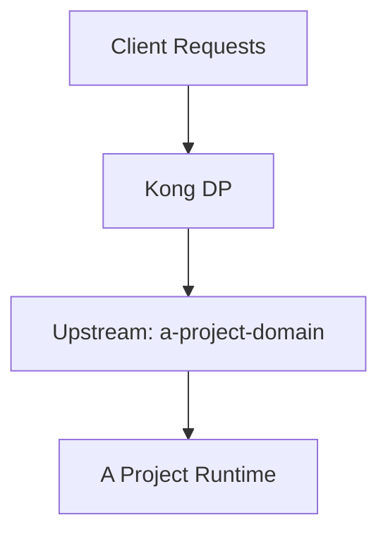
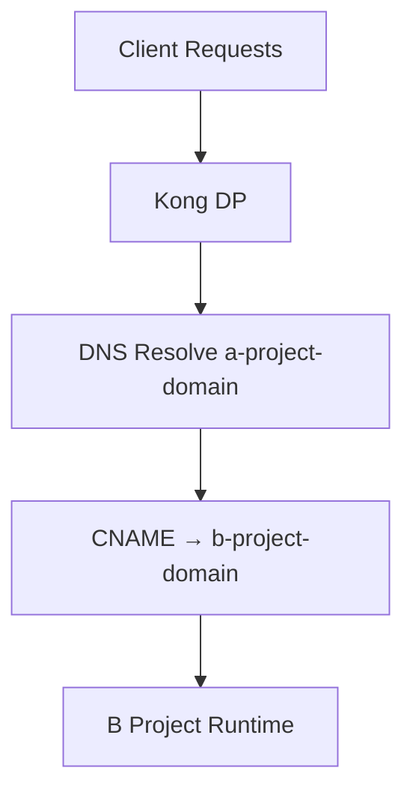
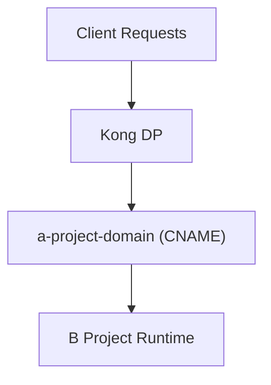
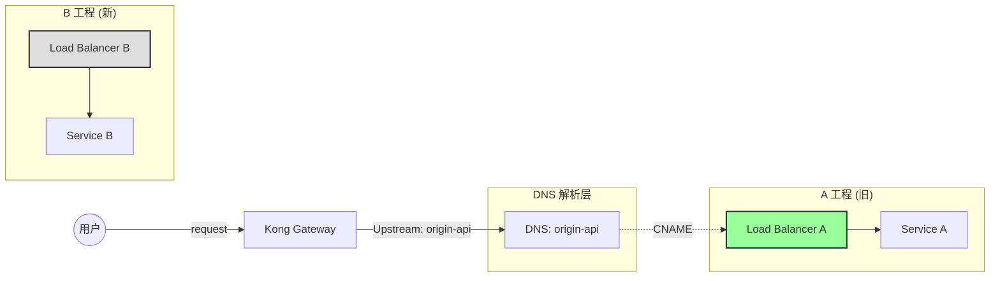
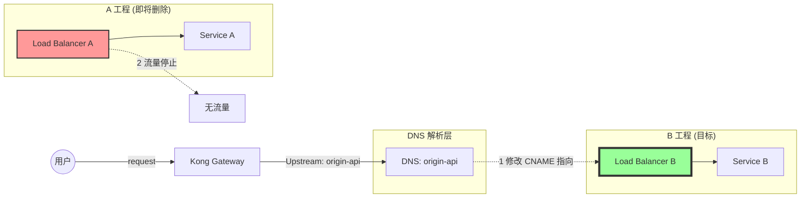

下面给你一份 **完全符合你当前架构（Kong DP + 上游 Runtime 迁移 + DNS 切换）** 的技术分析与迁移方案。

内容包含：

- **问题分析**
    
- **迁移解决方案（Kong 如何保持不变 + DNS 如何切换）**
    
- **完整操作步骤**
    
- **Kong 配置示例**
    
- **Mermaid 流程图（迁移前 / 切换中 / 迁移后）**
    
- **注意事项（避免 502、避免连接拒绝、避免缓存问题）**
    

---

# **1. 问题分析**

  

你的访问链路如下：

```
Client → Kong Domain → Kong DP Route → Upstream Target → Runtime (A Project)
```

你现在希望：

- **删除 A 工程**
    
- Runtime 已迁移到 **B 工程**
    
- **Kong DP 不修改或尽量少修改**
    
- 希望 **用 DNS 切换** 来完成迁移
    

  

核心问题：

- Kong DP 指向的 upstream 目标 **原本是 A 工程的域名**
    
- 如果 A 工程被删除，此域名将不可达 → Kong 会报 **502 / connection refused**
    
- 所以需要确保：
    
    1. Kong 的 upstream **仍然能解析到新目标**（B 工程）
        
    2. 保留旧域名的入口（CNAME 或 A 记录切换）
        
    

---

# **2. 完整迁移解决方案（推荐）**

  

以下是最佳做法，可 **确保你删除 A 工程后仍能正常服务**。

---

## **✔️** 

## **方案核心：通过 DNS 重定向旧域名 → B 工程**

  

因为你可以控制 DNS，最简单方式是：

  

### **(1) 不改 Kong Upstream**

- Kong 上游依然指向：
    

```
https://a-project-domain
```

### **(2) 修改 DNS 配置**

  

把 a-project-domain 的 DNS 指向新的 Runtime：

```
a-project-domain  CNAME  b-project-domain
```

这样：

- Kong 仍请求原始域名 a-project-domain
    
- DNS 自动把解析送到 b-project-domain
    
- B 工程开始承接所有流量
    
- A 工程可安全删除
    

  

🎯 **这个方案的特点：**

- 不需要修改 Kong 配置
    
- 对客户端完全透明
    
- 只用简单 DNS 切换
    
- Kong 不会因为 upstream 改动导致中断
    
- 删除 A 工程后，用户仍经由旧入口访问 B 工程
    

---

# **3. 操作步骤（可直接执行）**

  

## **Step 1. 保证 B 工程的服务已完全上线**

```
https://b-project-domain/api-name
```

确保：

- readiness OK
    
- 健康检查通过
    
- 后端响应正常
    

---

## **Step 2. 在 B 工程准备 Host Header 支持（必要）**

  

因为 Kong upstream 仍然发送 Host: a-project-domain

你需要确保 B 工程接受这个 Host。

  

如果是 GKE Ingress / Cloud Run / Nginx：

  

### **方式1：允许多个 Host（推荐）**

```
spec:
  rules:
  - host: a-project-domain
  - host: b-project-domain
```

---

## **Step 3. 修改 DNS 记录（关键）**

```
a-project-domain → CNAME → b-project-domain
```

TTL 示例：

```
TTL = 60 秒
```

这样能快速回滚。

---

## **Step 4. 观察 Kong DP Access Log**

  

确认请求已命中 B 工程：

```
kubectl logs kong-dp -n kong | grep api-name
```

---

## **Step 5. 删除 A 工程**

  

当以下确认后再删除：

- B 工程完全正常
    
- 流量已经转移
    
- 没有任何请求进入 A 工程
    

---

# **4. 可选方案：若你愿意修改 Kong Upstream（更彻底）**

```
kong upstreams patch api-name-upstream \
  --target b-project-domain:443
```

但你现在要求 **希望仅用 DNS 切换** → 推荐上一方案。

---

# **5. Flow 流程图（Mermaid）**

  

## **迁移前（旧架构：A 工程）**



---

## **DNS 切换中（a-domain → CNAME → b-domain）**



---

## **迁移后（A 删除，全部走 B）**



---

# **6. 注意事项与最佳实践**

  

### **✔ 避免 502 / Connection Refused**

- **绝对不要先删除 A 域名或服务**
    
- 必须先完成 DNS 指向 B 工程
    

---

### **✔ Host Header 问题（最常见问题）**

  

Kong 默认发送 **旧域名作为 Host**

B 工程必须接受这个 Host，否则会返回 404。

---

### **✔ 如果使用 HTTPS**

  

DNS 切换后，B 工程必须满足：

- 提供证书覆盖 a-project-domain
    
- 或使用 SNI proxy（如 GCLB）
    

  

否则 SSL 会报错。

---

### **✔ TTL 设置**

  

保持 TTL 在 30-60 秒可快速回滚。

---

# **总结（最关键一句）**

  

> **你不需要修改 Kong，只需把 a-project-domain 做 CNAME 至 b-project-domain，并确保 B 工程接受旧 Host，即可安全删除 A 工程。**

---

如果你愿意，我可以为你生成：

- **完整的迁移 Runbook（含回滚方案）**
    
- **Kong upstream + route 检查清单**
    
- **DNS 切换前后的验证脚本**
    
- **Ingress / NGINX 配置示例**
    

  

告诉我你需要哪一个。


# Gemini 
这是一个非常经典的**Blue/Green 部署**或**无缝迁移**场景。既然你明确希望通过**DNS切换**来实现目标，这通常是为了实现“解耦”和“快速回滚”。

要实现这一目标，核心思路是引入一个**中间层域名（Stable CNAME）**或者利用**Kong的Upstream抽象能力**配合DNS。

### 核心解决思路：CNAME 映射切换法

不要让 Kong 直接去解析 `a-project-domain` 或 `b-project-domain` 作为最终的服务地址，而是引入一个**逻辑域名**（例如 `api-upstream.internal`），让 Kong 指向这个逻辑域名，然后通过控制这个逻辑域名的 DNS 指向来实现流量切换。

#### 方案步骤

1.  **准备阶段 (Setup B)**：
    *   确保 B 工程已经部署完毕，并且能够正常响应请求。
    *   **关键点**：B 工程必须配置为能够处理 `api-name/v1/` 这样的路径请求（或者在 Kong 层面做 strip_path，但在 DNS 切换方案中，保持路径一致最稳妥）。

2.  **引入中间域名 (Abstaction)**：
    *   在你的 DNS 服务商处，创建一个 CNAME 记录（我们称之为 `origin-api`）。
    *   初始状态：`origin-api` **CNAME** 指向 `a-project-domain`。

3.  **调整 Kong 配置 (一次性)**：
    *   修改 Kong 的 Service 配置，将 `Host` (Upstream URL) 从 `a-project-domain` 改为 `origin-api`。
    *   此时，Kong 的流量流向：`Kong` -> `origin-api` -> DNS解析为 `A工程 IP` -> `A工程`。
    *   *注意：如果你的后端服务校验 Host Header，你需要确保 Kong 发送的 Host Header 是后端允许的，或者后端配置了允许 `origin-api` 这个 Host。*

4.  **验证 B 工程的连通性**：
    *   在正式切换前，你可以通过本地 hosts 文件或者测试环境 Kong，验证 B 工程是否能正确处理业务。

5.  **执行切换 (DNS Switch)**：
    *   在 DNS 管理后台，修改 `origin-api` 的记录，将其 **CNAME** 指向 `b-project-domain`（或者 B 的负载均衡 IP）。
    *   **等待 TTL 过期**：DNS 记录生效需要时间（取决于 TTL 设置）。

6.  **下线 A 工程 (Decommission)**：
    *   观察一段时间，确认所有流量都已流向 B 且无异常。
    *   安全下线 A 工程。

---

### 关键风险点与解决方案

在执行 DNS 切换方案时，有两个必须注意的技术细节：

#### 1. Host Header 问题 (最容易踩的坑)
*   **问题**：当 Kong 请求 `origin-api` 时，它默认可能会把 `Host` 头设置为 `origin-api`。如果 B 工程的 Ingress 或 Nginx 只配置了监听 `b-project-domain`，它会拒绝请求（404 Not Found）。
*   **解决**：
    *   **方法一（推荐）**：在 Kong 的 Service 配置中，设置 `host_header` 为 `b-project-domain` (如果你确定要切到 B)。但在动态切换 DNS 场景下，这会导致矛盾。
    *   **方法二（通用）**：配置 B 工程（以及 A 工程）的网关/负载均衡，允许接收 `origin-api` 作为 Host 头。或者让 Kong 开启 `preserve_host: true`，让客户端访问 Kong 的原始域名透传给后端（前提是后端支持）。

#### 2. Kong 的 DNS 缓存 (TTL)
*   **问题**：Kong 内部有 DNS 缓存机制。即使你修改了公网 DNS，Kong 可能在几分钟内仍然使用旧的 IP。
*   **解决**：
    *   在切换前，将 `origin-api` 的 DNS TTL 设置得非常短（例如 60秒）。
    *   检查 Kong 配置中的 `dns_valid_ttl`，确保它不是过长。

---

### 流程图 (Flow Chart)

以下是基于 Mermaid 语法的流程图，展示了切换前后的状态。

#### 阶段 1：现状 (Before Migration)

Kong 直接指向 A，或者通过中间域名指向 A。



#### 阶段 2：DNS 切换 (Migration Action)

你修改了 DNS 指向。Kong 无需重启，只需等待缓存过期。



---

### 详细操作清单 (Checklist)

如果你决定采用此方案，请按以下清单执行：

1.  **DNS 准备**:
    *   创建一个新的内部域名（如 `api-switch.yourdomain.com`）。
    *   设置 TTL 为 **60s** (非常重要，为了快速生效/回滚)。
    *   将其指向 A 工程域名。

2.  **Kong 修改**:
    *   更新 Kong Service 的 `host` 字段为 `api-switch.yourdomain.com`。
    *   确保 `protocol` 是 `https`。
    *   **测试访问**：确保此时访问 Kong，流量依然正常走到 A。

3.  **B 工程适配**:
    *   确认 B 工程的服务器/Ingress 接受 `Host: api-switch.yourdomain.com` 的请求。如果不接受，你需要配置 B 工程的 Nginx/Ingress `server_name` 添加该域名。

4.  **执行切换**:
    *   修改 DNS，将 `api-switch.yourdomain.com` 指向 B 工程域名（或 IP）。
    *   **监控 Kong 日志**：观察 `upstream_status`，确认是否有 5xx 错误。

5.  **清理**:
    *   确认 A 工程无流量（可能需要等待 Kong 所有 Worker 刷新 DNS 缓存）。
    *   删除 A 工程。
    *   (可选) 将 DNS TTL 调回正常值（如 300s 或 3600s）。