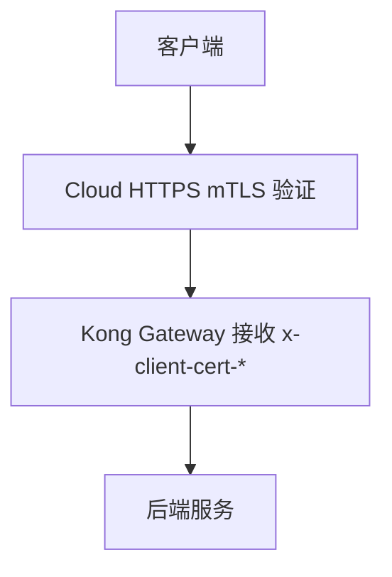

# Q

The user is asking about the x-client-cert-leaf in GCP’s Kong logs. This header holds the client’s certificate in base64 format. To decode, you can use openssl for a more readable certificate output. The x-client-cert-leaf represents the leaf certificate, part of a certificate chain, and differs from the root certificate in that it’s the last in the chain before it reaches the root. I’ll also describe how certificates travel through GCP’s load balancer to Kong. The flow might look like client -> GLB -> Kong, capturing the x-client-cert-\* headers as they go.

# A

下面是一张简化的请求流程图，展示了 GCP HTTPS Load Balancer 在 mTLS 验证后如何将客户端证书信息通过 x-client-cert-\* 头部传给 Kong 处理：



x-client-cert-leaf

头部是什么

- 含义

- 它是客户端证书（leaf certificate，也就是终端实体证书）的 Base64 编码表示（通常是 DER 格式的二进制流）。
- 配合其他头部一起使用时，可让后端应用或插件获得完整的证书链和指纹信息，以便做访问控制、审计或日志记录。

-
- 常见相关头部

|                           |                                           |
| ------------------------- | ----------------------------------------- |
| Header                    | 含义                                      |
| x-client-cert-leaf        | Base64(客户端终端证书 DER)                |
| x-client-cert-chain       | Base64(中间证书链 DER，按顺序拼接)        |
| x-client-cert-serial      | 客户端证书序列号                          |
| x-client-cert-fingerprint | 客户端证书指纹（通常是 SHA-256 或 SHA-1） |

如何查看/解析

x-client-cert-leaf

1. 提取并解码

# 将 header 的值复制到 CLIENT_B64 变量

CLIENT_B64="MIICeDCCAhGgAwIBAgI..."

# 解码为 DER，然后转成 PEM 格式

echo "$CLIENT_B64" | base64 -d > client.der

openssl x509 -inform der -in client.der -out client.pem

1.

2.  查看证书内容

openssl x509 -in client.pem -noout -text

2. 你会看到类似：
```bash
Certificate:
    Data:
        Version: 3 (0x2)
        Serial Number: 04:5a:...
        Signature Algorithm: sha256WithRSAEncryption
        Issuer: CN = My_Intermediate_CA, O = Example Org
        Validity
            Not Before: Jun 24 00:00:00 2025 GMT
            Not After : Jun 24 23:59:59 2026 GMT
        Subject: CN = client.example.com, O = Client Org
        Subject Public Key Info:
            Public Key Algorithm: rsaEncryption
                Public-Key: (2048 bit)
        X509v3 extensions:
            X509v3 Subject Alternative Name:
                DNS:client.example.com
            ...
```


...

在 Kong 中如何使用

如果你在 Kong 上启用了 mTLS（例如通过 [Kong TLS 插件](https://docs.konghq.com/hub/kong-inc/tls-auth/)），可在 config.shared_certificate_headers 中开启这些头部，然后在 access_by_lua 或者日志插件里引用：

```yaml
plugins:
  - name: tls-auth
    config:
      trusted_ca_certificates: /path/to/ca.crt
      client_certificate_header: x-client-cert-leaf
      client_certificate_chain_header: x-client-cert-chain
      client_certificate_fingerprint_header: x-client-cert-fingerprint
```


接着，你的自定义插件或 log_by_lua 就可以这样拿到原始值并解析：

local leaf_b64 = kong.request.get_header("x-client-cert-leaf")

-- 可以解 base64 或直接把它记录到日志系统

kong.log.inspect(leaf_b64)

小结

- x-client-cert-leaf 是 Base64(DER) 的客户端终端证书。
- 通过 base64 -d → openssl x509 -text 可查看详细字段。
- 在 Kong 中，可配合 TLS/mTLS 插件将其作为请求头透传给后端或日志系统。
