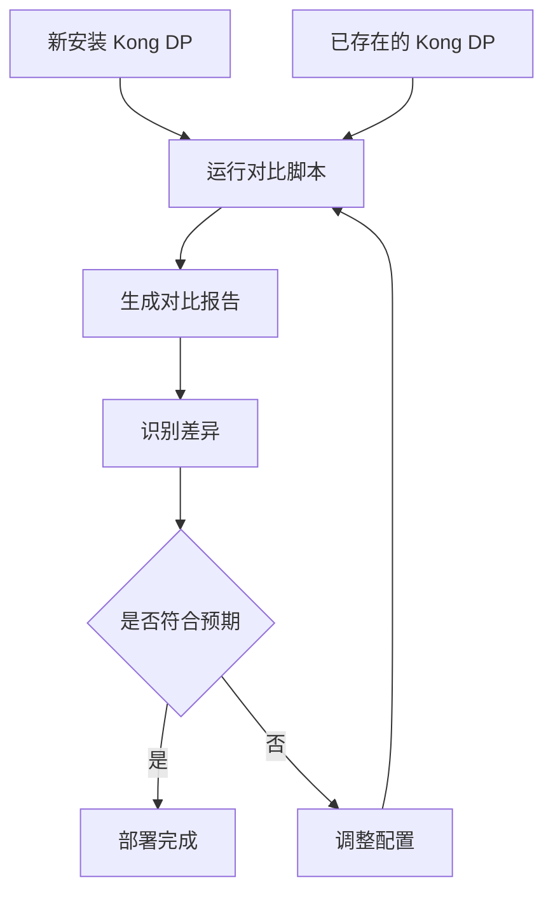
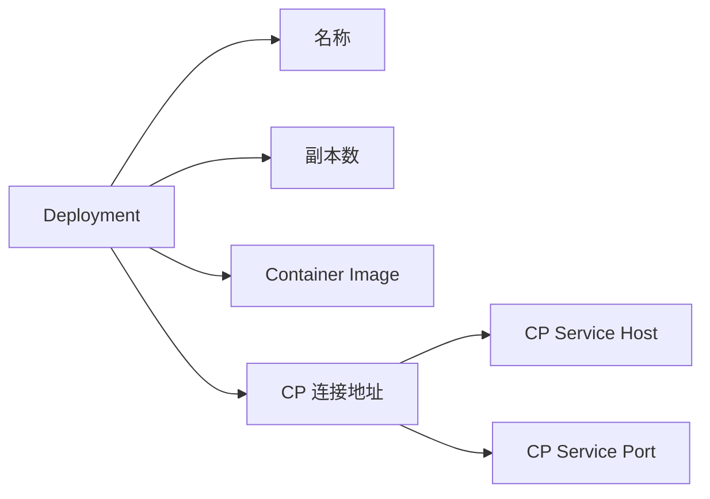
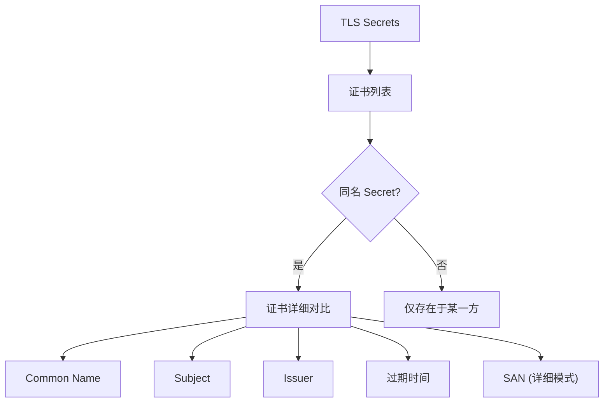
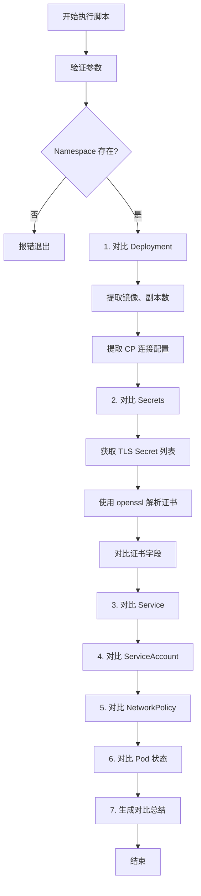

# Kong Data Plane 资源对比工具

## 概述

`compare-dp.sh` 是一个强大的 Shell 脚本工具，用于对比两个不同 Kubernetes Namespace 中安装的 Kong Data Plane (DP) 资源的差异。该工具可以帮助你快速识别两个 Kong DP 安装之间的配置差异、证书差异和资源配置不同之处。

## 使用场景



### 典型应用场景

1. **新环境验证**: 刚完成新的 Kong DP 安装后，需要与已有的稳定环境进行对比验证
2. **迁移验证**: 从一个环境迁移到另一个环境时，确保配置一致性
3. **故障排查**: 当某个 Kong DP 出现问题时，与正常工作的环境进行对比，快速定位差异
4. **版本升级**: 升级后验证配置是否正确迁移
5. **多环境管理**: 维护 internal 和 external Kong DP 时，确保它们的基础配置一致

## 安装

```bash
# 克隆或下载脚本
cd /path/to/your/scripts/
chmod +x compare-dp.sh

# 验证依赖工具
which kubectl jq openssl
```

### 依赖要求

| 工具 | 版本要求 | 用途 |
|------|---------|------|
| kubectl | >= 1.20 | Kubernetes 资源查询 |
| jq | >= 1.6 | JSON 数据处理 |
| openssl | >= 1.1 | 证书解析 |
| bash | >= 4.0 | Shell 脚本执行 |

## 使用方法

### 基本语法

```bash
./compare-dp.sh -s <source-namespace> -t <target-namespace> [选项]
```

### 参数说明

#### 必选参数

| 参数 | 说明 | 示例 |
|------|------|------|
| `-s <namespace>` | 源 Namespace (通常是已有的稳定环境) | `-s aibang-int-kdp` |
| `-t <namespace>` | 目标 Namespace (通常是新安装的环境) | `-t aibang-ext-kdp` |

#### 可选参数

| 参数 | 默认值 | 说明 | 可选值 |
|------|--------|------|--------|
| `-l <label>` | `app=busybox-app` | Pod 标签选择器 | 任何有效的 Kubernetes 标签 |
| `-o <format>` | `table` | 输出格式 | `table`, `json` |
| `-d <level>` | `summary` | 详细级别 | `summary`, `detailed` |
| `-h` | - | 显示帮助信息 | - |

### 使用示例

#### 示例 1: 基本对比

```bash
./compare-dp.sh -s aibang-int-kdp -t aibang-ext-kdp
```

这将对比 `aibang-int-kdp` 和 `aibang-ext-kdp` 两个 Namespace 中的 Kong DP 资源，并以表格形式输出摘要信息。

#### 示例 2: 详细对比（包含证书 SAN）

```bash
./compare-dp.sh -s aibang-int-kdp -t aibang-ext-kdp -d detailed
```

详细模式会额外显示：
- 证书的 Subject Alternative Names (SAN)
- 更详细的证书链信息
- 更多的环境变量对比

#### 示例 3: 使用自定义标签选择器

```bash
./compare-dp.sh -s ns1 -t ns2 -l app=kong-dp
```

如果你的 Kong DP Deployment 使用不同的标签，可以通过 `-l` 参数指定。

#### 示例 4: JSON 输出（便于脚本处理）

```bash
./compare-dp.sh -s aibang-int-kdp -t aibang-ext-kdp -o json > comparison.json
```

> **注意**: JSON 输出格式目前处于预留状态，当前版本主要支持 table 格式。

## 对比维度

脚本会对以下资源进行全面对比：

### 1. Deployment 对比



对比内容：
- **Deployment 名称**: 检查 Deployment 名称是否一致
- **副本数 (Replicas)**: 对比实例数量配置
- **Container Image**: 验证镜像版本是否相同
- **CP 连接配置**: 
  - `KONG_CLUSTER_CONTROL_PLANE` 环境变量
  - CP Service Host (如 `kong-cp`)
  - CP Service Port (如 `8005`)

### 2. Secrets 对比



对比内容：
- **Secret 名称列表**: 列出所有 TLS 类型的 Secrets
- **证书 Common Name (CN)**: 证书的主题公用名
- **证书 Subject**: 完整的证书主题信息
- **证书 Issuer**: 证书颁发机构信息
- **过期时间**: 证书有效期截止日期
- **SAN (详细模式)**: Subject Alternative Names，证书支持的其他域名

**特殊处理**：
- 使用 `openssl x509` 解析证书内容
- 从 Kubernetes Secret 的 `data.tls.crt` 字段提取并 base64 解码
- 对比证书的关键字段，快速识别证书差异

### 3. Service 对比

对比内容：
- **Service 名称列表**: 列出所有 Service
- **Service 类型**: ClusterIP, NodePort, LoadBalancer 等
- **端口配置**: 对比暴露的端口

输出示例：
```
源 Namespace (aibang-int-kdp):
  - kong-cp (Type: ClusterIP, Ports: 8005 8001)
  - kong-proxy (Type: LoadBalancer, Ports: 80 443)

目标 Namespace (aibang-ext-kdp):
  - kong-cp (Type: ClusterIP, Ports: 8005 8001)
  - kong-proxy (Type: LoadBalancer, Ports: 80 443)
```

### 4. ServiceAccount 对比

对比内容：
- **共同的 ServiceAccounts**: 两个 Namespace 都存在的 SA
- **仅存在于源**: 只在源 Namespace 中的 SA
- **仅存在于目标**: 只在目标 Namespace 中的 SA

> **注意**: 脚本会自动过滤掉默认的 `default` ServiceAccount

### 5. NetworkPolicy 对比

对比内容：
- **NetworkPolicy 数量**: 统计每个 Namespace 的网络策略数量
- **策略名称列表**: 列出所有 NetworkPolicy
- **差异识别**: 标识仅存在于某一方的策略

### 6. Pod 状态对比

对比内容：
- **Pod 数量**: 运行中的 Pod 数量
- **Pod Status**: Running, Pending, Failed 等状态
- **Pod Ready**: 容器就绪状态 (true/false)
- **Restart Count**: 容器重启次数

## 输出格式

### 表格输出示例

```
========================================
1. Deployment 对比
========================================

--- Deployment 基本信息 ---

+--------------------------------+-------------------------------------+-------------------------------------+------------+
| 属性                           | 源 (aibang-int-kdp)                 | 目标 (aibang-ext-kdp)               | 状态       |
+--------------------------------+-------------------------------------+-------------------------------------+------------+
| Deployment 名称                | busybox-app                         | busybox-app                         | 相同       |
| 副本数 (Replicas)              | 2                                   | 2                                   | 相同       |
| Container Image                | kong/kong-gateway:3.4.1.1           | kong/kong-gateway:3.4.1.1           | 相同       |
| CP 连接地址                     | kong-cp:8005                        | kong-cp:8005                        | 相同       |
| CP Service Host                | kong-cp                             | kong-cp                             | 相同       |
| CP Service Port                | 8005                                | 8005                                | 相同       |
+--------------------------------+-------------------------------------+-------------------------------------+------------+
```

### 颜色说明

脚本使用颜色编码来快速识别状态：

| 颜色 | 符号 | 含义 |
|------|------|------|
| 🟢 绿色 | ✅ | 相同或正常状态 |
| 🟡 黄色 | ⚠️ | 不同或需要注意 |
| 🔴 红色 | ❌ | 错误或严重差异 |
| 🔵 蓝色 | ℹ️ | 信息提示 |
| 🟣 紫色 | 🔍 | 差异标识 |

## 工作流程



## 证书解析详解

脚本使用 `openssl` 工具解析证书信息，核心函数 `extract_cert_info` 的工作流程：

```bash
# 1. 从 Secret 提取证书数据
kubectl get secret <secret-name> -n <namespace> \
  -o jsonpath='{.data.tls\.crt}' | base64 -d

# 2. 使用 openssl 解析
openssl x509 -noout -subject -issuer -enddate -text

# 3. 提取特定字段
# - CN: grep -oP 'CN\s*=\s*\K[^,/]+'
# - SAN: grep -A1 "Subject Alternative Name"
```

### 支持的证书字段

| 字段 | OpenSSL 参数 | 说明 |
|------|-------------|------|
| Subject | `-subject` | 证书主题 |
| Issuer | `-issuer` | 证书颁发者 |
| CN | `-subject` + grep | Common Name |
| Start Date | `-startdate` | 证书生效时间 |
| End Date | `-enddate` | 证书过期时间 |
| SAN | `-text` + grep | Subject Alternative Names |

## 常见问题

### 1. 找不到 Deployment

**问题**: 脚本提示"未找到 Deployment"

**解决方案**:
```bash
# 检查 Namespace 中的 Deployment
kubectl get deployment -n <namespace>

# 检查标签
kubectl get deployment -n <namespace> --show-labels

# 使用正确的标签选择器
./compare-dp.sh -s ns1 -t ns2 -l app=your-label
```

### 2. 证书解析失败

**问题**: 证书信息显示为 "N/A"

**可能原因**:
- Secret 不存在
- Secret 不是 TLS 类型
- 证书格式损坏
- 缺少 openssl 工具

**解决方案**:
```bash
# 验证 Secret 存在且为 TLS 类型
kubectl get secret <secret-name> -n <namespace> -o yaml

# 手动测试证书解析
kubectl get secret <secret-name> -n <namespace> \
  -o jsonpath='{.data.tls\.crt}' | base64 -d | openssl x509 -noout -text

# 确保安装了 openssl
which openssl
```

### 3. 权限不足

**问题**: "Error from server (Forbidden)"

**解决方案**:
```bash
# 检查当前用户权限
kubectl auth can-i get deployments -n <namespace>
kubectl auth can-i get secrets -n <namespace>

# 如需要，申请相应的 RBAC 权限
# 或使用有足够权限的 kubeconfig
```

### 4. 输出表格格式错乱

**问题**: 表格列对齐不正确

**原因**: 某些字段内容过长（如证书 Subject）

**解决方案**: 脚本已自动截断过长字段到 35 字符，如需查看完整内容：
```bash
# 使用详细模式
./compare-dp.sh -s ns1 -t ns2 -d detailed

# 或直接查询对应资源
kubectl get secret <secret-name> -n <namespace> \
  -o jsonpath='{.data.tls\.crt}' | base64 -d | openssl x509 -noout -text
```

## 最佳实践

### 1. 对比前准备

```bash
# 1. 确认 kubectl 上下文正确
kubectl config current-context

# 2. 验证两个 Namespace 都存在
kubectl get namespace aibang-int-kdp aibang-ext-kdp

# 3. 测试连接性
kubectl get pods -n aibang-int-kdp
kubectl get pods -n aibang-ext-kdp
```

### 2. 保存对比结果

```bash
# 将输出保存到文件以便后续分析
./compare-dp.sh -s aibang-int-kdp -t aibang-ext-kdp | tee comparison-$(date +%Y%m%d).txt

# 或使用详细模式并保存
./compare-dp.sh -s aibang-int-kdp -t aibang-ext-kdp -d detailed > comparison-detailed.txt 2>&1
```

### 3. 定期对比

建议在以下时机运行对比：
- ✅ 新环境部署完成后
- ✅ 配置变更后
- ✅ 证书更新后
- ✅ 版本升级后
- ✅ 故障排查时

### 4. 结合其他验证脚本

```bash
# 1. 先运行对比脚本
./compare-dp.sh -s aibang-int-kdp -t aibang-ext-kdp

# 2. 再对每个环境运行状态验证
./verify-dp-status.sh -n aibang-int-kdp
./verify-dp-status.sh -n aibang-ext-kdp

# 3. 如有问题，查看详细日志
kubectl logs -n <namespace> <pod-name> --tail=200
```

## 扩展与定制

### 添加新的对比维度

如需添加其他资源类型的对比（如 ConfigMap、PersistentVolumeClaim），可以参考现有代码结构：

```bash
# ==============================================================================
# X. 新资源类型对比
# ==============================================================================
print_header "X. <资源类型> 对比"

SOURCE_RESOURCES=$(kubectl get <resource-type> -n "$SOURCE_NS" -o jsonpath='{.items[*].metadata.name}' 2>/dev/null || echo "")
TARGET_RESOURCES=$(kubectl get <resource-type> -n "$TARGET_NS" -o jsonpath='{.items[*].metadata.name}' 2>/dev/null || echo "")

# ... 对比逻辑 ...
```

### 自定义输出格式

修改表格宽度：

```bash
# 在脚本中找到 print_table_row 函数
print_table_row() {
    local col1="$1"
    local col2="$2"
    local col3="$3"
    local col4="$4"
    # 调整这里的宽度参数 (%-30s, %-35s, ...)
    printf "| %-30s | %-35s | %-35s | %-10s |\n" "$col1" "$col2" "$col3" "$col4"
}
```

## 相关脚本

| 脚本名称 | 用途 | 关联关系 |
|---------|------|---------|
| `verify-dp-status.sh` | 验证单个 Kong DP 的健康状态 | 对比后可用此脚本分别验证 |
| `verify-dp.sh` | Kong DP 综合验证 | 包含日志分析、CP 连接验证 |
| `verify-dp-summary.sh` | Kong DP 状态摘要 | 快速查看单个环境状态 |

## 输出示例 (完整流程)

```
╔════════════════════════════════════════════════════════════╗
║        Kong Data Plane 资源对比工具                       ║
╚════════════════════════════════════════════════════════════╝

源 Namespace: aibang-int-kdp
目标 Namespace: aibang-ext-kdp
标签选择器: app=busybox-app

ℹ️  验证 Namespace 存在性...
✅ 两个 Namespace 均存在

========================================
1. Deployment 对比
========================================

--- Deployment 基本信息 ---

+--------------------------------+-------------------------------------+-------------------------------------+------------+
| 属性                           | 源 (aibang-int-kdp)                 | 目标 (aibang-ext-kdp)               | 状态       |
+--------------------------------+-------------------------------------+-------------------------------------+------------+
| Deployment 名称                | busybox-app                         | busybox-app                         | 相同       |
| 副本数 (Replicas)              | 2                                   | 1                                   | 不同       |
| Container Image                | kong/kong-gateway:3.4.1.1           | kong/kong-gateway:3.4.1.0           | 不同       |
| CP 连接地址                     | kong-cp:8005                        | kong-cp-ext:8005                    | 不同       |
| CP Service Host                | kong-cp                             | kong-cp-ext                         | 不同       |
| CP Service Port                | 8005                                | 8005                                | 相同       |
+--------------------------------+-------------------------------------+-------------------------------------+------------+

========================================
2. Secrets 对比
========================================

--- TLS Secrets 列表 ---

源 Namespace (aibang-int-kdp) 的 TLS Secrets:
  - lex-tls-secret
  - kong-cluster-cert

目标 Namespace (aibang-ext-kdp) 的 TLS Secrets:
  - lex-tls-secret
  - kong-cluster-cert

--- 证书详细对比 ---

找到同名的 Secrets，进行证书对比:

ℹ️  对比 Secret: lex-tls-secret
+--------------------------------+-------------------------------------+-------------------------------------+------------+
| 证书属性                       | 源 (aibang-int-kdp)                 | 目标 (aibang-ext-kdp)               | 状态       |
+--------------------------------+-------------------------------------+-------------------------------------+------------+
| Common Name (CN)               | kong-cluster.aibang.local           | kong-cluster.aibang.local           | 相同       |
| 证书 Subject                   | CN=kong-cluster.aibang.local,O=A...| CN=kong-cluster.aibang.local,O=A... | 相同       |
| 证书 Issuer                    | CN=Kong Cluster CA,O=Kong Inc...   | CN=Kong Cluster CA,O=Kong Inc...    | 相同       |
| 过期时间                        | Dec 31 23:59:59 2025 GMT           | Dec 31 23:59:59 2025 GMT            | 相同       |
+--------------------------------+-------------------------------------+-------------------------------------+------------+

...

========================================
7. 对比总结
========================================

对比维度:
  ✓ Deployment (名称、副本数、镜像、CP 连接配置)
  ✓ Secrets (TLS 证书、Subject、Issuer、过期时间)
  ✓ Service (类型、端口)
  ✓ ServiceAccount
  ✓ NetworkPolicy
  ✓ Pod (数量、状态、就绪状态、重启次数)

ℹ️  提示: 使用 -d detailed 参数查看更详细的证书信息 (如 SAN)
ℹ️  提示: 所有标记为 不同 的项目需要进一步检查

━━━━━━━━━━━━━━━━━━━━━━━━━━━━━━━━━━━━━━━━━━━━━━━━━━━━━━━━━━
对比完成!
━━━━━━━━━━━━━━━━━━━━━━━━━━━━━━━━━━━━━━━━━━━━━━━━━━━━━━━━━━
```

## 技术细节

### CP 连接信息提取

脚本从 Deployment 的环境变量中提取 Control Plane 连接信息：

```bash
# 查询环境变量
kubectl get deployment <name> -n <namespace> \
  -o jsonpath='{.spec.template.spec.containers[0].env[?(@.name=="KONG_CLUSTER_CONTROL_PLANE")].value}'

# 解析结果 (支持多种格式)
# - kong-cp:8005
# - https://kong-cp:8005
# - kong-cp (默认端口 8005)
```

### 证书字段提取

```bash
# 提取 Common Name
openssl x509 -noout -subject | grep -oP 'CN\s*=\s*\K[^,/]+'

# 提取 SAN
openssl x509 -noout -text | grep -A1 "Subject Alternative Name" | tail -1
```

### Base64 解码

```bash
# Kubernetes Secret 中的证书是 base64 编码的
kubectl get secret <name> -n <namespace> -o jsonpath='{.data.tls\.crt}' | base64 -d
```

## 版本历史

| 版本 | 日期 | 变更内容 |
|------|------|---------|
| 1.0 | 2026-02-02 | 初始版本，支持 Deployment、Secrets、Service、SA、NetworkPolicy、Pod 对比 |

## 许可与贡献

本脚本基于开源精神开发，欢迎贡献改进建议和代码优化。

## 相关文档

- [Kong Gateway 官方文档](https://docs.konghq.com/)
- [Kubernetes Secret 管理](https://kubernetes.io/docs/concepts/configuration/secret/)
- [OpenSSL 证书工具](https://www.openssl.org/docs/man1.1.1/man1/x509.html)
- [verify-dp-status.sh 使用指南](./verify-dp-status.sh)

---

**最后更新**: 2026-02-02  
**维护者**: Lex (AI Bangjuxin Knowledge Base)
