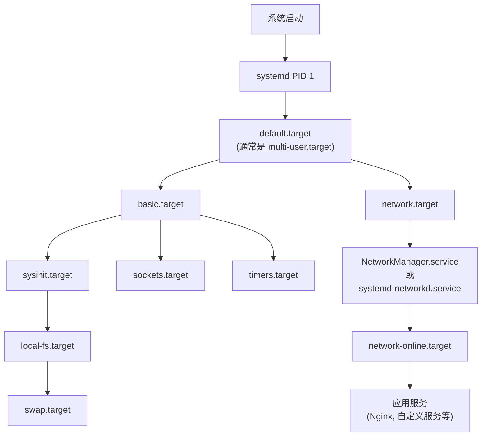
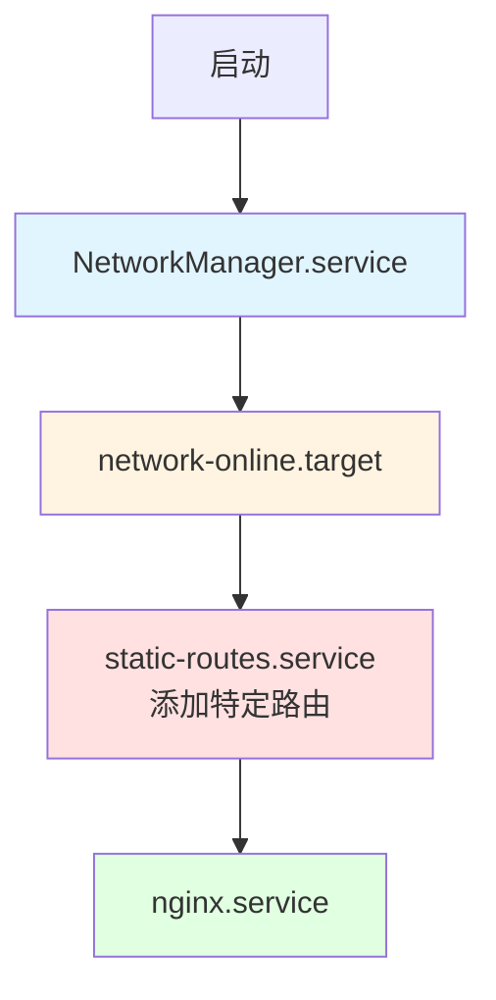
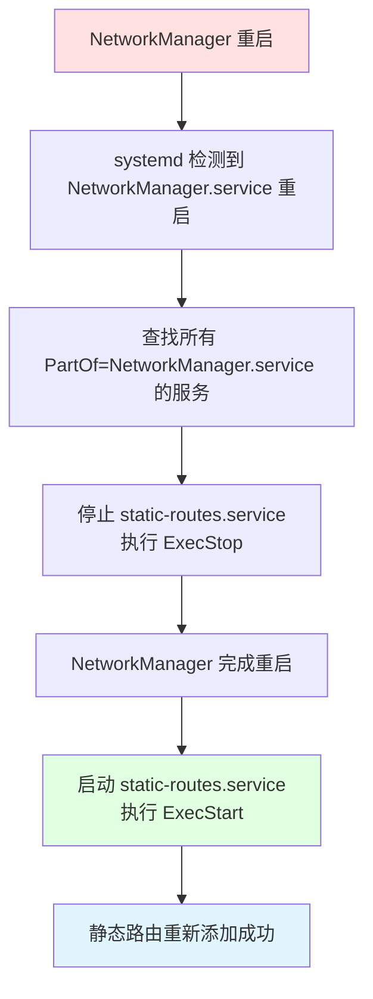

# Linux 服务启动顺序与依赖管理最佳实践

本文档详细介绍 Linux systemd 服务管理中的启动顺序、依赖关系配置和最佳实践，重点关注 Nginx、网络服务和静态路由的配置。

## 目录

- [Systemd 服务管理基础](#systemd-服务管理基础)
- [依赖关系指令详解](#依赖关系指令详解)
- [网络服务管理](#网络服务管理)
- [实践示例](#实践示例)
- [最佳实践与故障排查](#最佳实践与故障排查)

---

## Systemd 服务管理基础

### 服务单元文件结构

systemd 使用单元文件（unit files）来定义服务。典型的服务单元文件结构如下：

```ini
[Unit]
Description=服务描述
Documentation=文档链接
After=依赖服务列表
Before=被依赖服务列表
Requires=强依赖列表
Wants=弱依赖列表

[Service]
Type=simple|forking|oneshot|notify|dbus
ExecStart=启动命令
ExecReload=重载命令
ExecStop=停止命令
Restart=always|on-failure|no
RestartSec=3

[Install]
WantedBy=multi-user.target
RequiredBy=其他服务
```

**单元文件位置：**
- `/etc/systemd/system/` - 系统管理员自定义的服务（优先级最高）
- `/run/systemd/system/` - 运行时生成的服务
- `/lib/systemd/system/` 或 `/usr/lib/systemd/system/` - 系统包安装的服务

### Systemd 启动流程



### 关键 Target 说明

| Target | 说明 | 用途 |
|--------|------|------|
| `sysinit.target` | 系统初始化 | 基础系统服务 |
| `basic.target` | 基础系统准备完成 | 最小运行环境 |
| `network.target` | 网络栈已启动 | 网络接口配置完成（不保证网络完全可用） |
| `network-online.target` | 网络完全可用 | 需要网络连接的服务应该依赖此 target |
| `multi-user.target` | 多用户模式 | 等同于传统的 runlevel 3 |

---

## 依赖关系指令详解

### 重要概念：依赖 vs 顺序

systemd 中**依赖关系**和**启动顺序**是两个独立的概念：

- **依赖关系**：决定是否启动其他服务
- **启动顺序**：决定启动的先后顺序

> [!IMPORTANT]
> 这两个概念是正交的（独立的）。仅使用 `Wants=` 或 `Requires=` 不会控制启动顺序；同样，仅使用 `After=` 或 `Before=` 不会自动启动依赖服务。

### 依赖关系指令（Requirement Dependencies）

#### `Wants=` - 弱依赖（推荐）

- **行为**：尝试启动列出的服务，但即使失败也不影响当前服务
- **使用场景**：大多数依赖场景的推荐选择
- **优势**：提高系统鲁棒性，避免级联失败

```ini
[Unit]
Wants=network.target
```

#### `Requires=` - 强依赖

- **行为**：必须成功启动列出的服务，否则当前服务也会失败
- **使用场景**：关键依赖，依赖服务失败时当前服务也应该停止
- **风险**：可能导致级联失败

```ini
[Unit]
Requires=postgresql.service
```

#### 其他依赖指令

| 指令 | 说明 |
|------|------|
| `Requisite=` | 类似 `Requires=`，但如果依赖未启动，立即失败（不尝试启动） |
| `BindsTo=` | 比 `Requires=` 更强，依赖停止时当前服务也会停止 |
| `PartOf=` | 当依赖服务停止或重启时，当前服务也停止或重启 |
| `Conflicts=` | 与指定服务冲突，不能同时运行 |

### 启动顺序指令（Ordering Dependencies）

#### `After=` - 在...之后启动

- **行为**：等待列出的服务启动完成后，再启动当前服务
- **注意**：不会自动启动列出的服务
- **最常用组合**：`Wants=` + `After=` 或 `Requires=` + `After=`

```ini
[Unit]
Wants=network-online.target
After=network-online.target
```

#### `Before=` - 在...之前启动

- **行为**：当前服务必须在列出的服务之前完成启动
- **注意**：这是 `After=` 的反向操作

```ini
[Unit]
Before=nginx.service
```

### 依赖与顺序组合最佳实践

| 场景 | 配置 | 说明 |
|------|------|------|
| **服务需要网络** | `Wants=network-online.target`<br/>`After=network-online.target` | 等待网络完全可用 |
| **服务需要数据库** | `Requires=postgresql.service`<br/>`After=postgresql.service` | 强依赖数据库且必须在其之后启动 |
| **服务可选依赖** | `Wants=redis.service`<br/>`After=redis.service` | 优先启动 Redis，但失败不影响主服务 |
| **关闭时同步停止** | `BindsTo=parent.service`<br/>`After=parent.service` | 父服务停止时子服务也停止 |

---

## 网络服务管理

### NetworkManager vs systemd-networkd

Linux 系统中有两种主要的网络管理工具：

| 特性 | NetworkManager | systemd-networkd |
|------|----------------|------------------|
| **使用场景** | 桌面系统、笔记本 | 服务器、容器 |
| **配置方式** | GUI + CLI (`nmcli`) | 配置文件 |
| **动态性** | 支持动态切换网络 | 静态配置为主 |
| **依赖** | 独立服务 | systemd 内置 |
| **配置文件** | `/etc/NetworkManager/` | `/etc/systemd/network/` |

> [!WARNING]
> 不要在同一个网络接口上同时使用 NetworkManager 和 systemd-networkd，会导致冲突。

### 网络相关的 systemd Target


**关键区别：**
- `network.target` - 网络接口已启动，但不保证 IP 地址已分配
- `network-online.target` - 网络完全可用，IP 已配置，DNS 可解析

### 静态路由配置

#### 方法 1: 使用 systemd-networkd

**配置文件**: `/etc/systemd/network/10-eth0.network`

```ini
[Match]
Name=eth0

[Network]
Address=192.168.1.100/24
Gateway=192.168.1.1
DNS=8.8.8.8

[Route]
Destination=10.0.0.0/8
Gateway=192.168.1.254
Metric=100

[Route]
Destination=172.16.0.0/12
Gateway=192.168.1.253
```

**启用服务：**
```bash
systemctl enable systemd-networkd
systemctl start systemd-networkd
```

#### 方法 2: 使用 NetworkManager

**命令行配置：**
```bash
# 添加静态路由
nmcli connection modify eth0 +ipv4.routes "10.0.0.0/8 192.168.1.254 100"

# 重启连接使配置生效
nmcli connection up eth0
```

**配置文件**: `/etc/NetworkManager/system-connections/eth0.nmconnection`

```ini
[ipv4]
method=manual
address1=192.168.1.100/24,192.168.1.1
dns=8.8.8.8;
route1=10.0.0.0/8,192.168.1.254,100
route2=172.16.0.0/12,192.168.1.253,100
```

#### 方法 3: 创建自定义服务配置静态路由

适用于需要在 NetworkManager 之后添加特定路由的场景。

**服务文件**: `/etc/systemd/system/static-routes.service`

```ini
[Unit]
Description=Configure Static Routes
After=network-online.target
Wants=network-online.target

[Service]
Type=oneshot
RemainAfterExit=yes
ExecStart=/usr/local/bin/setup-static-routes.sh
ExecStop=/usr/local/bin/cleanup-static-routes.sh

[Install]
WantedBy=multi-user.target
```

**脚本文件**: `/usr/local/bin/setup-static-routes.sh`

```bash
#!/bin/bash
set -e

# 添加到特定网段的静态路由
ip route add 10.0.0.0/8 via 192.168.1.254 dev eth0 metric 100 || true
ip route add 172.16.0.0/12 via 192.168.1.253 dev eth1 metric 100 || true

echo "Static routes configured successfully"
```

**清理脚本**: `/usr/local/bin/cleanup-static-routes.sh`

```bash
#!/bin/bash

# 删除静态路由
ip route del 10.0.0.0/8 via 192.168.1.254 dev eth0 2>/dev/null || true
ip route del 172.16.0.0/12 via 192.168.1.253 dev eth1 2>/dev/null || true

echo "Static routes cleaned up"
```

**配置权限和启用：**
```bash
chmod +x /usr/local/bin/setup-static-routes.sh
chmod +x /usr/local/bin/cleanup-static-routes.sh
systemctl daemon-reload
systemctl enable static-routes.service
systemctl start static-routes.service
```

---

## 实践示例

### 示例 1: Nginx 服务正确配置网络依赖

Nginx 需要网络完全可用后才能启动，以确保能够绑定到正确的 IP 地址。

**文件**: `/etc/systemd/system/nginx.service.d/override.conf`

```ini
[Unit]
# 确保在网络完全可用后启动
After=network-online.target
Wants=network-online.target

# 如果依赖静态路由，添加
After=static-routes.service
Wants=static-routes.service

[Service]
# 网络故障时自动重启
Restart=on-failure
RestartSec=5s
```

**查看生效的配置：**
```bash
systemctl cat nginx.service
```

### 示例 2: 双网络路由启动顺序

假设场景：
- `eth0` 连接内网，通过 NetworkManager 管理
- `eth1` 连接外网，需要添加特定静态路由
- Nginx 需要两个网络都配置完成后才能启动

**架构图：**



**1. 静态路由服务**: `/etc/systemd/system/static-routes.service`

```ini
[Unit]
Description=Configure Dual Network Static Routes
Documentation=man:ip-route(8)
# 必须在 NetworkManager 完成后
After=NetworkManager.service network-online.target
Wants=network-online.target
# 在应用服务之前
Before=nginx.service

[Service]
Type=oneshot
RemainAfterExit=yes
# 添加路由
ExecStart=/bin/bash -c 'ip route add 10.0.0.0/8 via 192.168.1.1 dev eth0 || true'
ExecStart=/bin/bash -c 'ip route add default via 203.0.113.1 dev eth1 metric 200 || true'
# 删除路由
ExecStop=/bin/bash -c 'ip route del 10.0.0.0/8 via 192.168.1.1 dev eth0 2>/dev/null || true'
ExecStop=/bin/bash -c 'ip route del default via 203.0.113.1 dev eth1 2>/dev/null || true'

[Install]
WantedBy=multi-user.target
```

**2. Nginx 服务依赖**: `/etc/systemd/system/nginx.service.d/network-deps.conf`

```ini
[Unit]
# 依赖静态路由配置完成
After=static-routes.service
Wants=static-routes.service

# 也依赖网络在线
After=network-online.target
Wants=network-online.target
```

**3. 启用和验证：**

```bash
# 重新加载 systemd 配置
systemctl daemon-reload

# 启用静态路由服务
systemctl enable static-routes.service

# 查看服务依赖关系
systemctl list-dependencies nginx.service

# 查看启动顺序
systemd-analyze critical-chain nginx.service

# 启动服务
systemctl start static-routes.service
systemctl start nginx.service

# 验证路由
ip route show
```

### 示例 3: 自定义应用服务依赖网络和数据库

假设你有一个 Web 应用需要：
1. 网络完全可用
2. PostgreSQL 数据库运行
3. Redis 缓存（可选）

**文件**: `/etc/systemd/system/myapp.service`

```ini
[Unit]
Description=My Web Application
Documentation=https://example.com/docs
# 强依赖数据库
Requires=postgresql.service
After=postgresql.service

# 弱依赖 Redis（可选）
Wants=redis.service
After=redis.service

# 依赖网络
After=network-online.target
Wants=network-online.target

# 如果有静态路由需求
After=static-routes.service
Wants=static-routes.service

[Service]
Type=simple
User=myapp
Group=myapp
WorkingDirectory=/opt/myapp
Environment="NODE_ENV=production"
ExecStart=/usr/bin/node /opt/myapp/server.js

# 自动重启策略
Restart=on-failure
RestartSec=10s
StartLimitInterval=5min
StartLimitBurst=3

# 资源限制
LimitNOFILE=65536
MemoryLimit=2G

[Install]
WantedBy=multi-user.target
```

### 示例 4: network-online.target 的正确启用

某些系统默认不启用 `network-online.target`，需要额外配置。

**检查是否启用：**
```bash
systemctl is-enabled NetworkManager-wait-online.service
```

**启用网络等待服务（NetworkManager）：**
```bash
systemctl enable NetworkManager-wait-online.service
```

**启用网络等待服务（systemd-networkd）：**
```bash
systemctl enable systemd-networkd-wait-online.service
```

---

## 最佳实践与故障排查

### 服务依赖最佳实践

#### 1. 优先使用 `Wants=` 而非 `Requires=`

```ini
# ✅ 推荐：系统更鲁棒
[Unit]
Wants=redis.service
After=redis.service

# ❌ 避免：级联失败
[Unit]
Requires=redis.service
After=redis.service
```

#### 2. 网络依赖使用 `network-online.target`

```ini
# ✅ 推荐：确保网络真正可用
[Unit]
After=network-online.target
Wants=network-online.target

# ❌ 避免：网络可能未完全配置
[Unit]
After=network.target
```

#### 3. 静态路由应该在 NetworkManager 之后

```ini
# ✅ 正确顺序
[Unit]
After=NetworkManager.service network-online.target
Wants=network-online.target
```

#### 4. 使用 `RemainAfterExit=yes` 用于 oneshot 服务

对于配置型服务（如静态路由），应该保持"已启动"状态：

```ini
[Service]
Type=oneshot
RemainAfterExit=yes
```

### 调试和故障排查工具

#### 1. 查看服务依赖树

```bash
# 列出服务的所有依赖
systemctl list-dependencies nginx.service

# 反向依赖（哪些服务依赖 nginx）
systemctl list-dependencies --reverse nginx.service

# 所有依赖（包括递归）
systemctl list-dependencies --all nginx.service
```

#### 2. 分析启动时间和关键路径

```bash
# 分析整体启动时间
systemd-analyze

# 查看每个服务的启动时间
systemd-analyze blame

# 查看服务的关键路径（critical chain）
systemd-analyze critical-chain nginx.service

# 生成启动流程图（SVG）
systemd-analyze plot > boot-plot.svg
```

#### 3. 查看服务状态和日志

```bash
# 详细状态
systemctl status nginx.service

# 查看服务日志
journalctl -u nginx.service

# 实时跟踪日志
journalctl -u nginx.service -f

# 查看特定时间段日志
journalctl -u nginx.service --since "2025-12-08 10:00:00"

# 查看启动失败的服务
systemctl --failed
```

#### 4. 验证配置文件语法

```bash
# 检查服务文件语法
systemd-analyze verify /etc/systemd/system/myapp.service

# 重新加载 systemd 配置
systemctl daemon-reload
```

#### 5. 查看网络和路由状态

```bash
# 查看网络服务状态
systemctl status NetworkManager.service
systemctl status systemd-networkd.service

# 查看路由表
ip route show

# 查看网络接口
ip addr show

# 测试网络连接
ping -c 3 8.8.8.8
```

### 常见问题和解决方案

#### 问题 1: 服务启动失败，提示网络不可用

**症状：**
```
Failed to start myapp.service: network is not available
```

**解决方案：**

1. 确保启用了网络等待服务：
```bash
# NetworkManager 环境
systemctl enable NetworkManager-wait-online.service

# systemd-networkd 环境
systemctl enable systemd-networkd-wait-online.service
```

2. 在服务文件中添加正确依赖：
```ini
[Unit]
After=network-online.target
Wants=network-online.target
```

#### 问题 2: 静态路由在重启后丢失

**症状：**
静态路由在手动添加后工作正常，但重启后消失。

**解决方案：**

创建持久化静态路由服务（参见[示例 2](#示例-2-双网络路由启动顺序)）。

#### 问题 3: 服务启动顺序不符合预期

**诊断步骤：**

```bash
# 查看实际启动顺序
systemd-analyze critical-chain myapp.service

# 检查依赖配置
systemctl show myapp.service | grep -E "(After|Before|Wants|Requires)"
```

**常见原因：**
- 只配置了 `Wants=` 没有配置 `After=`
- 依赖的服务本身启动失败
- 循环依赖

#### 问题 4: NetworkManager 和静态路由冲突

**症状：**
手动添加的静态路由被 NetworkManager 删除。

**解决方案：**

方法 1: 使用 NetworkManager 管理路由（推荐）
```bash
nmcli connection modify eth0 +ipv4.routes "10.0.0.0/8 192.168.1.254"
```

方法 2: 创建在 NetworkManager 之后执行的服务
```ini
[Unit]
After=NetworkManager.service network-online.target
```

#### 问题 5: NetworkManager 重启后静态路由丢失

**症状：**
当 NetworkManager 服务重启时（例如：`systemctl restart NetworkManager`），通过自定义服务添加的静态路由会丢失，需要手动重新添加。

**场景说明：**
这是一个常见的运维场景。当你需要在 NetworkManager 之后添加特定的静态路由，而不想将这些路由配置在 NetworkManager 的连接配置文件中时（可能是因为需要动态计算路由、特殊的网络拓扑或临时测试需求），就需要确保 NetworkManager 重启后能够自动重新添加这些路由。

> [!IMPORTANT]
> NetworkManager 重启会导致网络接口重新初始化，所有不在 NetworkManager 配置中的路由都会丢失。因此需要让自定义路由服务在 NetworkManager 重启时也能自动重新运行。

**解决方案：**

##### 方法 1: 使用 `PartOf=` 指令（推荐）

这是最简洁的方法。使用 `PartOf=` 将静态路由服务绑定到 NetworkManager，当 NetworkManager 重启时，静态路由服务也会自动重启。

**服务文件**: `/etc/systemd/system/static-routes.service`

```ini
[Unit]
Description=Configure Static Routes
Documentation=man:ip-route(8)
# 关键：绑定到 NetworkManager 的生命周期
PartOf=NetworkManager.service
# 确保在网络完全可用后执行
After=NetworkManager.service network-online.target
Wants=network-online.target

[Service]
Type=oneshot
RemainAfterExit=yes
# 添加路由（使用 || true 避免路由已存在时报错）
ExecStart=/bin/bash -c 'ip route add 10.0.0.0/8 via 192.168.1.254 dev eth0 || true'
ExecStart=/bin/bash -c 'ip route add 172.16.0.0/12 via 192.168.1.253 dev eth1 || true'
# 删除路由
ExecStop=/bin/bash -c 'ip route del 10.0.0.0/8 via 192.168.1.254 dev eth0 2>/dev/null || true'
ExecStop=/bin/bash -c 'ip route del 172.16.0.0/12 via 192.168.1.253 dev eth1 2>/dev/null || true'

[Install]
WantedBy=multi-user.target
```

**工作原理：**



**验证配置：**

```bash
# 重新加载配置
systemctl daemon-reload

# 启用并启动服务
systemctl enable static-routes.service
systemctl start static-routes.service

# 查看路由是否添加成功
ip route show

# 测试：重启 NetworkManager
systemctl restart NetworkManager

# 等待几秒后再次查看路由（应该自动恢复）
sleep 3
ip route show

# 查看服务状态
systemctl status static-routes.service
```

**`PartOf=` vs `BindsTo=` 的区别：**

| 指令 | 重启行为 | 启动依赖 | 适用场景 |
|------|---------|---------|---------|
| `PartOf=` | 父服务重启时子服务也重启 | 不创建启动依赖 | **推荐用于静态路由** |
| `BindsTo=` | 父服务重启时子服务也重启 | 创建强启动依赖 | 父服务失败时子服务也应失败 |

对于静态路由场景，`PartOf=` 更合适，因为：
- NetworkManager 重启时路由服务会自动重启
- NetworkManager 启动时不会强制启动路由服务（避免循环依赖）
- 配置更简洁

##### 方法 2: 使用 NetworkManager Dispatcher 脚本

NetworkManager 提供了 dispatcher 机制，可在网络状态变化时自动执行脚本。

**脚本文件**: `/etc/NetworkManager/dispatcher.d/90-static-routes`

```bash
#!/bin/bash
# NetworkManager dispatcher script to add static routes

INTERFACE=$1
ACTION=$2

# 记录日志
logger -t nm-dispatcher "Interface: $INTERFACE, Action: $ACTION"

# 当接口启动时添加路由
case "$ACTION" in
    up|dhcp4-change|dhcp6-change)
        # 添加静态路由
        # 只在特定接口上添加路由（可选）
        if [ "$INTERFACE" = "eth0" ]; then
            ip route add 10.0.0.0/8 via 192.168.1.254 dev eth0 2>/dev/null || true
            logger -t nm-dispatcher "Added route 10.0.0.0/8 via eth0"
        fi
        
        if [ "$INTERFACE" = "eth1" ]; then
            ip route add 172.16.0.0/12 via 192.168.1.253 dev eth1 2>/dev/null || true
            logger -t nm-dispatcher "Added route 172.16.0.0/12 via eth1"
        fi
        ;;
    down)
        # 可选：接口关闭时删除路由
        logger -t nm-dispatcher "Interface $INTERFACE is down"
        ;;
esac

exit 0
```

**配置权限：**

```bash
# 设置可执行权限
chmod +x /etc/NetworkManager/dispatcher.d/90-static-routes

# 确保 NetworkManager dispatcher 服务运行
systemctl status NetworkManager-dispatcher.service
systemctl enable NetworkManager-dispatcher.service
```

**环境变量说明：**

Dispatcher 脚本接收两个参数和多个环境变量：

| 参数/变量 | 说明 | 示例值 |
|-----------|------|--------|
| `$1` | 接口名称 | `eth0`, `wlan0` |
| `$2` | 动作类型 | `up`, `down`, `dhcp4-change` |
| `$IP4_GATEWAY` | IPv4 网关 | `192.168.1.1` |
| `$CONNECTION_UUID` | 连接 UUID | `uuid-string` |

**验证：**

```bash
# 查看 dispatcher 日志
journalctl -t nm-dispatcher

# 重启 NetworkManager 测试
systemctl restart NetworkManager

# 检查路由
ip route show

# 手动触发特定连接（测试）
nmcli connection down eth0
nmcli connection up eth0
```

**优缺点：**

✅ **优点：**
- 与 NetworkManager 深度集成
- 可以针对特定接口和状态
- 自动处理接口的上下线

❌ **缺点：**
- 只在使用 NetworkManager 时有效
- 调试相对复杂（需要查看 dispatcher 日志）
- 不适用于 systemd-networkd

##### 方法 3: 监控路由表变化（高级）

对于更复杂的场景，可以创建一个持续运行的服务，监控路由表变化并自动修复。

**服务文件**: `/etc/systemd/system/route-monitor.service`

```ini
[Unit]
Description=Monitor and Maintain Static Routes
After=network-online.target
Wants=network-online.target

[Service]
Type=simple
Restart=always
RestartSec=10
ExecStart=/usr/local/bin/route-monitor.sh

[Install]
WantedBy=multi-user.target
```

**监控脚本**: `/usr/local/bin/route-monitor.sh`

```bash
#!/bin/bash

# 定义需要维护的路由
declare -A ROUTES=(
    ["10.0.0.0/8"]="192.168.1.254 dev eth0"
    ["172.16.0.0/12"]="192.168.1.253 dev eth1"
)

# 检查并添加路由的函数
check_and_add_route() {
    local destination=$1
    local via_gateway=$2
    
    # 检查路由是否存在
    if ! ip route show | grep -q "^${destination}"; then
        echo "Route ${destination} is missing, adding..."
        ip route add ${destination} via ${via_gateway} || echo "Failed to add route ${destination}"
        logger -t route-monitor "Added missing route: ${destination} via ${via_gateway}"
    fi
}

# 主循环
echo "Starting route monitor..."
logger -t route-monitor "Route monitor started"

while true; do
    # 等待 30 秒
    sleep 30
    
    # 检查所有路由
    for destination in "${!ROUTES[@]}"; do
        check_and_add_route "${destination}" "${ROUTES[$destination]}"
    done
done
```

**配置和启动：**

```bash
chmod +x /usr/local/bin/route-monitor.sh
systemctl daemon-reload
systemctl enable route-monitor.service
systemctl start route-monitor.service

# 查看监控日志
journalctl -u route-monitor.service -f
```

##### 三种方法对比

| 方法 | 复杂度 | 可靠性 | 适用场景 | 推荐度 |
|------|--------|--------|----------|--------|
| **方法 1: PartOf 指令** | ⭐ 简单 | ⭐⭐⭐ 高 | NetworkManager 环境，简单路由需求 | ⭐⭐⭐⭐⭐ |
| **方法 2: Dispatcher 脚本** | ⭐⭐ 中等 | ⭐⭐⭐ 高 | 需要针对特定接口或状态的路由 | ⭐⭐⭐⭐ |
| **方法 3: 路由监控** | ⭐⭐⭐ 复杂 | ⭐⭐⭐⭐ 很高 | 路由经常被意外删除的环境 | ⭐⭐⭐ |

**推荐选择：**

1. **一般场景**：使用方法 1（`PartOf=` 指令），最简单有效
2. **需要接口级控制**：使用方法 2（Dispatcher 脚本）
3. **高可靠性要求**：使用方法 3（路由监控）或结合方法 1 和方法 3

**完整示例（方法 1 + 日志）：**

```ini
[Unit]
Description=Configure Static Routes with Logging
Documentation=man:ip-route(8)
PartOf=NetworkManager.service
After=NetworkManager.service network-online.target
Wants=network-online.target

[Service]
Type=oneshot
RemainAfterExit=yes

# 添加路由并记录日志
ExecStartPre=/usr/bin/logger -t static-routes "Starting to configure static routes"
ExecStart=/bin/bash -c 'ip route add 10.0.0.0/8 via 192.168.1.254 dev eth0 && logger -t static-routes "Added route 10.0.0.0/8" || logger -t static-routes "Route 10.0.0.0/8 already exists"'
ExecStart=/bin/bash -c 'ip route add 172.16.0.0/12 via 192.168.1.253 dev eth1 && logger -t static-routes "Added route 172.16.0.0/12" || logger -t static-routes "Route 172.16.0.0/12 already exists"'
ExecStartPost=/usr/bin/logger -t static-routes "Static routes configuration completed"

# 删除路由并记录日志
ExecStopPost=/usr/bin/logger -t static-routes "Cleaning up static routes"
ExecStop=/bin/bash -c 'ip route del 10.0.0.0/8 via 192.168.1.254 dev eth0 2>/dev/null || true'
ExecStop=/bin/bash -c 'ip route del 172.16.0.0/12 via 192.168.1.253 dev eth1 2>/dev/null || true'

[Install]
WantedBy=multi-user.target
```

**查看日志：**

```bash
# 查看路由配置日志
journalctl -t static-routes

# 实时监控
journalctl -t static-routes -f
```

### 服务文件模板

#### 模板 1: 网络依赖的应用服务

```ini
[Unit]
Description=Your Application Name
Documentation=https://your-docs-url
After=network-online.target
Wants=network-online.target

[Service]
Type=simple
User=appuser
Group=appuser
WorkingDirectory=/opt/app
ExecStart=/usr/bin/your-app
Restart=on-failure
RestartSec=5s

[Install]
WantedBy=multi-user.target
```

#### 模板 2: 静态路由配置服务

```ini
[Unit]
Description=Static Network Routes
After=network-online.target NetworkManager.service
Wants=network-online.target
Before=YOUR-APP.service

[Service]
Type=oneshot
RemainAfterExit=yes
ExecStart=/usr/local/bin/add-routes.sh
ExecStop=/usr/local/bin/del-routes.sh

[Install]
WantedBy=multi-user.target
```

#### 模板 3: 数据库依赖的服务

```ini
[Unit]
Description=Application with Database Dependency
After=network-online.target postgresql.service
Wants=network-online.target
Requires=postgresql.service

[Service]
Type=simple
ExecStart=/usr/bin/your-app
Restart=on-failure
RestartSec=10s

[Install]
WantedBy=multi-user.target
```

---

## 总结

### 关键要点

1. **依赖与顺序分离**
   - `Wants=`/`Requires=` 控制依赖关系
   - `After=`/`Before=` 控制启动顺序
   - 通常需要组合使用

2. **网络服务推荐配置**
   - 使用 `network-online.target` 而非 `network.target`
   - 启用 `NetworkManager-wait-online.service` 或 `systemd-networkd-wait-online.service`

3. **静态路由最佳实践**
   - 优先使用 NetworkManager 或 systemd-networkd 原生支持
   - 如需自定义服务，确保在 `network-online.target` 之后
   - 使用 `Type=oneshot` 和 `RemainAfterExit=yes`

4. **推荐启动顺序**
   ```
   NetworkManager/systemd-networkd
     ↓
   network-online.target
     ↓
   static-routes.service (如有需要)
     ↓
   应用服务 (Nginx, 自定义应用等)
   ```

5. **调试工具**
   - `systemctl list-dependencies` - 查看依赖
   - `systemd-analyze critical-chain` - 分析启动链
   - `journalctl -u service-name` - 查看日志

### 快速检查清单

- [ ] 服务文件是否同时配置了依赖和顺序？
- [ ] 网络依赖是否使用 `network-online.target`？  
- [ ] 是否启用了 `*-wait-online.service`？
- [ ] 静态路由是否在网络服务之后？
- [ ] 是否使用 `Wants=` 而非 `Requires=`（除非真正需要强依赖）？
- [ ] oneshot 服务是否设置了 `RemainAfterExit=yes`？
- [ ] 是否验证了配置文件语法 (`systemd-analyze verify`)?
- [ ] 是否测试了服务的启动顺序和依赖？

---

## 参考资源

- [systemd.unit(5) - Unit Configuration](https://www.freedesktop.org/software/systemd/man/systemd.unit.html)
- [systemd.service(5) - Service Unit Configuration](https://www.freedesktop.org/software/systemd/man/systemd.service.html)
- [systemd-networkd(8)](https://www.freedesktop.org/software/systemd/man/systemd-networkd.html)
- [NetworkManager Documentation](https://networkmanager.dev/)
- [Arch Linux systemd Wiki](https://wiki.archlinux.org/title/Systemd)
