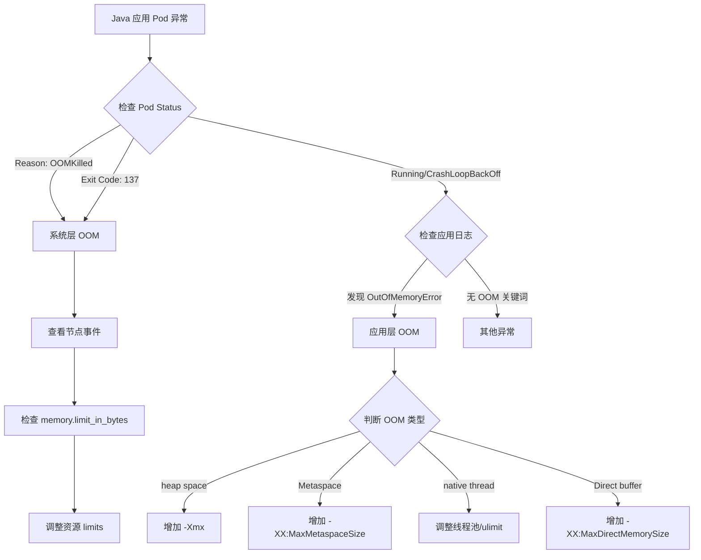

# GKE Node cgroup v2 检测与 Java OOM 日志分析

## 问题分析

1. 如何在无法直接登录 GKE Node 的情况下确认 cgroup v2 支持
1. 如何区分 Java 应用的系统层 OOM 与应用层 OOM

-----

## 解决方案 1：GKE Node cgroup v2 检测

### 方法一：通过 DaemonSet 检测

创建临时 DaemonSet 在每个节点上执行检测命令：

```yaml
apiVersion: apps/v1
kind: DaemonSet
metadata:
  name: cgroup-checker
  namespace: default
spec:
  selector:
    matchLabels:
      app: cgroup-checker
  template:
    metadata:
      labels:
        app: cgroup-checker
    spec:
      hostPID: true
      hostNetwork: true
      containers:
      - name: checker
        image: busybox
        command:
        - /bin/sh
        - -c
        - |
          echo "=== Node: $(hostname) ==="
          if [ -f /host/sys/fs/cgroup/cgroup.controllers ]; then
            echo "✓ cgroup v2 detected"
            cat /host/sys/fs/cgroup/cgroup.controllers
          elif [ -d /host/sys/fs/cgroup/cpu ]; then
            echo "✗ cgroup v1 detected"
          fi
          sleep 3600
        volumeMounts:
        - name: sys
          mountPath: /host/sys
          readOnly: true
      volumes:
      - name: sys
        hostPath:
          path: /sys
```

**执行检测：**

```bash
# 部署 DaemonSet
kubectl apply -f cgroup-checker.yaml

# 查看所有节点的检测结果
kubectl logs -l app=cgroup-checker --all-containers=true

# 清理
kubectl delete daemonset cgroup-checker
```

### 方法二：通过 Pod 特权模式检测

```yaml
apiVersion: v1
kind: Pod
metadata:
  name: cgroup-debug
spec:
  nodeName: <target-node-name>  # 指定目标节点
  hostPID: true
  hostNetwork: true
  containers:
  - name: debugger
    image: ubuntu:22.04
    command: ["sleep", "3600"]
    securityContext:
      privileged: true
    volumeMounts:
    - name: host-root
      mountPath: /host
  volumes:
  - name: host-root
    hostPath:
      path: /
```

**检测命令：**

```bash
# 进入容器
kubectl exec -it cgroup-debug -- bash

# 检测 cgroup 版本
stat -fc %T /host/sys/fs/cgroup
# 输出 "cgroup2fs" 表示 v2
# 输出 "tmpfs" 表示 v1

# 或者检查挂载信息
grep cgroup /host/proc/mounts

# 查看 cgroup 控制器
cat /host/sys/fs/cgroup/cgroup.controllers
```

### 方法三：通过 GKE 集群信息判断

```bash
# 查看 GKE 版本
gcloud container clusters describe <cluster-name> \
  --region=<region> \
  --format="value(currentMasterVersion)"

# 查看节点镜像类型
kubectl get nodes -o jsonpath='{.items[*].status.nodeInfo.osImage}'

# 查看节点内核版本
kubectl get nodes -o jsonpath='{range .items[*]}{.metadata.name}{"\t"}{.status.nodeInfo.kernelVersion}{"\n"}{end}'
```

**cgroup v2 支持参考：**

|GKE 版本 |节点镜像            |cgroup 版本 |
|-------|----------------|----------|
|< 1.24 |COS             |v1        |
|>= 1.24|COS (containerd)|v1/v2 (可选)|
|>= 1.25|Ubuntu          |v2 (默认)   |
|>= 1.27|COS             |v2 (推荐)   |

### 方法四：检查 kubelet 配置

```yaml
apiVersion: v1
kind: Pod
metadata:
  name: kubelet-config-reader
spec:
  hostPID: true
  containers:
  - name: reader
    image: busybox
    command:
    - /bin/sh
    - -c
    - |
      cat /host/var/lib/kubelet/config.yaml | grep -i cgroup
      sleep 3600
    volumeMounts:
    - name: kubelet-config
      mountPath: /host/var/lib/kubelet
      readOnly: true
  volumes:
  - name: kubelet-config
    hostPath:
      path: /var/lib/kubelet
```

-----

## 解决方案 2：Java 应用 OOM 日志区分

### OOM 类型对比

|OOM 类型         |触发位置        |日志特征                                         |进程状态            |
|---------------|------------|---------------------------------------------|----------------|
|系统 OOM (Kernel)|Linux Kernel|`Out of memory: Kill process`                |被 Kill (退出码 137)|
|容器 OOM         |cgroup 限制   |`oom-killer` + cgroup 信息                     |被 Kill (退出码 137)|
|JVM Heap OOM   |Java 堆内存    |`java.lang.OutOfMemoryError: Java heap space`|可能存活            |
|JVM Native OOM |堆外内存        |`unable to create new native thread`         |可能存活            |

### 过滤条件与检测方法

#### 1. 系统层 OOM (Kernel OOM Killer)

**日志特征：**

```bash
# 查看系统日志
kubectl logs <pod-name> --previous | grep -E "Kill process|Out of memory|oom-killer"

# 查看节点事件
kubectl get events --field-selector involvedObject.name=<pod-name> | grep OOMKilled

# 查看 Pod 终止原因
kubectl get pod <pod-name> -o jsonpath='{.status.containerStatuses[0].lastState.terminated.reason}'
# 输出: OOMKilled
```

**特征关键词：**

```text
- "Out of memory: Kill process"
- "oom-killer invoked"
- "Memory cgroup out of memory"
- Exit code: 137
- Reason: OOMKilled
```

**Kubernetes 检测命令：**

```bash
# 检查 Pod 资源限制
kubectl describe pod <pod-name> | grep -A 10 "Limits"

# 查看容器重启原因
kubectl get pod <pod-name> -o jsonpath='{.status.containerStatuses[*].lastState.terminated}' | jq

# 监控 OOMKilled 事件
kubectl get events -A --sort-by='.lastTimestamp' | grep OOMKilled
```

#### 2. 应用层 OOM (JVM OutOfMemoryError)

**日志特征：**

```bash
# 过滤 JVM OOM 日志
kubectl logs <pod-name> | grep -E "java.lang.OutOfMemoryError|Exception in thread"

# 常见 JVM OOM 类型
kubectl logs <pod-name> | grep -E "Java heap space|GC overhead limit|unable to create new native thread|Metaspace|Direct buffer memory"
```

**JVM OOM 类型与过滤条件：**

|OOM 子类型      |过滤关键词                                         |原因     |
|-------------|----------------------------------------------|-------|
|Heap Space   |`OutOfMemoryError: Java heap space`           |堆内存不足  |
|GC Overhead  |`OutOfMemoryError: GC overhead limit exceeded`|GC 耗时过长|
|Metaspace    |`OutOfMemoryError: Metaspace`                 |元空间不足  |
|Native Thread|`unable to create new native thread`          |线程数超限  |
|Direct Buffer|`OutOfMemoryError: Direct buffer memory`      |堆外内存不足 |

**应用层检测脚本：**

```bash
#!/bin/bash
POD_NAME="your-pod-name"

echo "=== 检查容器终止原因 ==="
kubectl get pod $POD_NAME -o jsonpath='{.status.containerStatuses[0].lastState.terminated.reason}'
echo ""

echo "=== 检查退出码 ==="
kubectl get pod $POD_NAME -o jsonpath='{.status.containerStatuses[0].lastState.terminated.exitCode}'
echo ""

echo "=== 检查系统 OOM ==="
kubectl get events --field-selector involvedObject.name=$POD_NAME | grep -i oom

echo "=== 检查 JVM OOM ==="
kubectl logs $POD_NAME --previous | grep -i "OutOfMemoryError" | head -20

echo "=== 检查 Heap Dump 触发 ==="
kubectl logs $POD_NAME --previous | grep -i "heap dump"
```

### 完整的 OOM 判断流程



### 综合检测脚本

```bash
#!/bin/bash

POD_NAME=$1
NAMESPACE=${2:-default}

echo "=== 1. Pod 基本信息 ==="
kubectl get pod $POD_NAME -n $NAMESPACE -o wide

echo -e "\n=== 2. 容器状态检查 ==="
kubectl get pod $POD_NAME -n $NAMESPACE -o json | jq -r '
  .status.containerStatuses[] | 
  "Container: \(.name)\nRestart Count: \(.restartCount)\nLast State: \(.lastState)\n"
'

echo -e "\n=== 3. 系统 OOM 检查 ==="
REASON=$(kubectl get pod $POD_NAME -n $NAMESPACE -o jsonpath='{.status.containerStatuses[0].lastState.terminated.reason}')
EXIT_CODE=$(kubectl get pod $POD_NAME -n $NAMESPACE -o jsonpath='{.status.containerStatuses[0].lastState.terminated.exitCode}')

if [[ "$REASON" == "OOMKilled" ]] || [[ "$EXIT_CODE" == "137" ]]; then
    echo "✗ 检测到系统层 OOM Killer"
    kubectl describe pod $POD_NAME -n $NAMESPACE | grep -A 5 "Limits:"
else
    echo "✓ 未检测到系统层 OOM"
fi

echo -e "\n=== 4. 应用层 OOM 检查 ==="
kubectl logs $POD_NAME -n $NAMESPACE --previous 2>/dev/null | grep -i "OutOfMemoryError" | head -10

echo -e "\n=== 5. 事件历史 ==="
kubectl get events -n $NAMESPACE --field-selector involvedObject.name=$POD_NAME --sort-by='.lastTimestamp' | tail -10

echo -e "\n=== 6. 资源配置 ==="
kubectl get pod $POD_NAME -n $NAMESPACE -o json | jq -r '
  .spec.containers[] | 
  "Container: \(.name)\nRequests: \(.resources.requests)\nLimits: \(.resources.limits)\n"
'
```

-----

## 注意事项

### cgroup v2 检测

1. **权限要求**：DaemonSet 和特权 Pod 需要 RBAC 权限
1. **镜像选择**：建议使用 `ubuntu:22.04` 或 `busybox:latest`
1. **清理资源**：检测完成后及时删除临时资源

### OOM 日志分析

1. **日志保留**：使用 `--previous` 查看崩溃前的日志
1. **时间窗口**：结合 Kubernetes Events 和容器日志时间戳
1. **Heap Dump**：建议配置 `-XX:+HeapDumpOnOutOfMemoryError` 参数
1. **监控告警**：配置 Prometheus + Alertmanager 监控 OOM 事件

### 最佳实践

```yaml
# Java 应用推荐配置
apiVersion: v1
kind: Pod
spec:
  containers:
  - name: java-app
    resources:
      requests:
        memory: "2Gi"
        cpu: "1"
      limits:
        memory: "4Gi"  # 建议是 request 的 1.5-2 倍
        cpu: "2"
    env:
    - name: JAVA_OPTS
      value: |
        -Xms2g -Xmx3g
        -XX:+UseG1GC
        -XX:+HeapDumpOnOutOfMemoryError
        -XX:HeapDumpPath=/tmp/heapdump.hprof
        -XX:+ExitOnOutOfMemoryError
    volumeMounts:
    - name: heapdump
      mountPath: /tmp
  volumes:
  - name: heapdump
    emptyDir:
      sizeLimit: 5Gi
```

**关键配置原则：**

- JVM `-Xmx` 应设置为容器 limit 的 70-80%
- 预留内存给堆外内存和系统开销
- 启用 HeapDump 便于事后分析
- 使用 `+ExitOnOutOfMemoryError` 让 Pod 快速重启​​​​​​​​​​​​​​​​

非常好的问题 👍
你提到了两个关键点：
	1.	确认 GKE 是否启用了 cgroup v2（control group v2）
	2.	区分 Java 应用的 OOM（应用内 OOM vs 系统层 OOMKilled）日志来源与过滤条件

下面我分两部分详细说明。

⸻

🧩 一、如何确认 GKE 是否启用了 cgroup v2

GKE 节点的 cgroup 版本取决于：
	•	节点的 Containerd 版本
	•	节点操作系统（COS / Ubuntu）版本
	•	以及 节点的 GKE 版本（1.25+ 开始支持 cgroup v2）

✅ 检查方法

在节点（Node）上执行以下命令：

# 登录到节点（假设节点名为 gke-cluster-default-pool-xxxx）
gcloud compute ssh gke-cluster-default-pool-xxxx --zone=asia-east1-b --project=<your_project>

# 查看系统使用的 cgroup 层级
mount | grep cgroup

# 或更直接
cat /proc/filesystems | grep cgroup

# 或查看 cgroup 控制器文件
stat -fc %T /sys/fs/cgroup/

🔍 输出判断标准

输出结果	含义
cgroup2fs	当前系统启用了 cgroup v2
cgroupfs 或有多个 /sys/fs/cgroup/memory, /sys/fs/cgroup/cpu	当前系统仍使用 cgroup v1


⸻

💡 GKE 版本对照参考

GKE Node OS	GKE 版本	cgroup 支持情况
COS Containerd (Container-Optimized OS)	1.25+	支持切换到 cgroup v2（默认仍为 v1）
Ubuntu containerd	1.26+	默认启用 cgroup v2
COS + Docker	不支持	固定为 cgroup v1

✅ 建议：如果你希望强制使用 cgroup v2，可以在 NodePool 创建时指定启动参数：

gcloud container node-pools create <pool-name> \
  --cluster=<cluster-name> \
  --image-type=UBUNTU_CONTAINERD \
  --node-taints=cgroup=2:NoSchedule \
  --metadata=google-logging-enabled=true \
  --machine-type=e2-standard-4


⸻

🔎 二、如何区分 Java 应用层 OOM 与 系统层 OOMKilled

1️⃣ 系统层 OOMKilled

当 Pod 被 K8S 或 Linux Kernel 杀掉 时，会有以下特征：

kubectl get pods <pod-name> -o wide

输出中可见：

Last State:    Terminated
Reason:        OOMKilled
Exit Code:     137

日志查看：

kubectl describe pod <pod-name> | grep -A5 "Last State"

或者查看 Node 层系统日志：

dmesg | grep -i kill
# 或查看节点系统日志
journalctl -k | grep -i oom

过滤关键字：
	•	Out of memory: Kill process
	•	oom_reaper:
	•	killed process ... total-vm ...

这些都是 Kernel OOM Killer 的系统日志，属于 系统层 OOM。

⸻

2️⃣ Java 应用内 OOM (Heap OOM)

如果只是 JVM 内部内存不足（但容器还没被杀），日志通常在 应用日志中出现：

kubectl logs <pod-name> | grep -E "OutOfMemoryError|Java heap space|GC overhead limit exceeded"

常见关键字：

错误类型	日志示例	说明
java.lang.OutOfMemoryError: Java heap space	Heap 内存耗尽	应用内存不足
java.lang.OutOfMemoryError: GC overhead limit exceeded	GC 回收占用过多时间	JVM GC 调优问题
java.lang.OutOfMemoryError: Metaspace	元空间不足	类加载过多或内存泄露
ExitCode: 137 (K8S)	无法在 JVM 日志中捕获	系统层内核 OOMKilled


⸻

⚙️ 推荐组合过滤命令

# 检查系统层 OOM
kubectl describe pod <pod> | grep -i "oom"

# 检查 Java 应用层 OOM
kubectl logs <pod> | grep -E "OutOfMemoryError|heap space|GC overhead"


⸻

🧠 简单区分思路

层级	日志位置	关键字	容器状态	说明
系统层 OOM (Kernel)	kubectl describe pod / dmesg	OOMKilled, Out of memory:	Pod 重启	内核杀死进程
应用层 OOM (JVM)	kubectl logs	OutOfMemoryError, Java heap space	Pod 未重启	JVM 抛出异常


⸻

🧭 总结流程图

graph TD
    A[开始排查 OOM] --> B{Pod 是否重启?}
    B -->|是| C[查看 describe pod: Reason=OOMKilled]
    C --> D[系统层 OOM - Kernel 杀死]
    B -->|否| E[查看 logs: OutOfMemoryError/heap space]
    E --> F[应用层 OOM - JVM 内存溢出]


⸻

🧩 建议与最佳实践
	•	为 Java 容器设置合理的内存限制与 JVM 参数

-Xmx$(expr $(cat /sys/fs/cgroup/memory.max) / 1024 / 1024 * 8 / 10)m

（即总内存的 80% 分配给 JVM）

	•	启用 GKE Node logging（Cloud Logging）
可统一查看 Kernel 层 OOM 日志
	•	监控指标
	•	container_memory_usage_bytes
	•	container_oom_events_total
	•	process_resident_memory_bytes

⸻

是否希望我帮你写一个自动化检测脚本（比如 check_cgroup_oom.sh），可以在 GKE Pod 内或节点上快速检测当前 cgroup 版本并扫描最近的 OOM 日志？

非常好的问题 💡
在 GKE 的 Node 无法直接 SSH 登录（例如使用 Autopilot 模式 或受限安全策略）时，我们仍然可以通过 Kubernetes 内部方式 来判断是否启用了 cgroup v2。
下面我将给出几种 可操作性强、无需登录节点 的判断方法。

⸻

🧩 一、方法一：在 Pod 内部检查 /sys/fs/cgroup 文件系统类型（最直接 ✅）

即使不能登录 Node，你可以 运行一个特权 Pod 或 Debug Pod 来查看当前 Node 的 cgroup 类型。

✅ 1️⃣ 启动一个 Debug Pod（推荐）

kubectl run cgroup-check --rm -it \
  --image=ubuntu:22.04 \
  --restart=Never \
  -- bash

然后在 Pod 内执行：

mount | grep cgroup
# 或者
stat -fc %T /sys/fs/cgroup/

🔍 输出结果解释

输出内容	说明
cgroup2fs	使用 cgroup v2 ✅
cgroupfs 或有多个子目录（如 memory, cpu, blkio）	使用 cgroup v1 ❌

⚠️ 注意：
在 GKE Autopilot 模式中，该 Pod 默认无特权，若 /sys/fs/cgroup 访问受限，可添加如下参数运行 Pod：

kubectl run cgroup-check --rm -it \
  --image=ubuntu:22.04 \
  --overrides='
{
  "spec": {
    "containers": [{
      "name": "check",
      "image": "ubuntu:22.04",
      "command": ["bash"],
      "stdin": true,
      "tty": true,
      "securityContext": { "privileged": true }
    }],
    "restartPolicy": "Never"
  }
}'


⸻

🧩 二、方法二：通过 GKE Node 信息判断（无需访问节点）

kubectl get node -o json | jq '.items[].status.nodeInfo'

输出示例：

{
  "architecture": "amd64",
  "bootID": "...",
  "containerRuntimeVersion": "containerd://1.7.12",
  "kernelVersion": "6.1.0-18-cloud-amd64",
  "osImage": "Ubuntu 22.04.5 LTS",
  "kubeletVersion": "v1.30.1",
  "operatingSystem": "linux"
}

根据经验判断：

OS / Runtime / Kernel	是否支持 cgroup v2	备注
Ubuntu 22.04 + containerd >=1.6	✅ 默认启用	
COS (Container-Optimized OS) + containerd >=1.6	⚙️ 支持但默认关闭	
Docker runtime	❌ 不支持	
Kernel >= 5.10	✅ 理论支持，但 GKE 需显式启用	


⸻

🧩 三、方法三：检查 kubelet 配置（只读信息）

Kubelet 的配置中会体现是否启用了 cgroup v2 的支持模式。
你可以通过以下命令查看：

kubectl get node <node-name> -o yaml | grep -A3 "kubeletConfigKey"

或者：

kubectl describe node <node-name> | grep -i cgroup

如果出现：

--cgroup-driver=systemd

那几乎可以确定该节点运行的是 cgroup v2 或兼容模式（因为 systemd driver 是 v2 默认方式）。

⚠️ 注意：
	•	Docker + cgroupfs 通常是 v1
	•	Containerd + systemd 通常是 v2

⸻

🧩 四、方法四：查看 Metrics Server / Node Exporter 数据

如果启用了 metrics-server 或 Prometheus Node Exporter，你也可以查询指标：

kubectl top node

或通过 Prometheus 查询：

node_cgroup_version_info

若该指标存在且值为 version="2"，则说明是 cgroup v2。

⸻

🧭 总结判断流程

graph TD
    A[无法登录 Node] --> B{能否运行 Pod?}
    B -->|能| C[运行 debug Pod 检查 /sys/fs/cgroup]
    B -->|不能| D[查看 Node OS 和 runtime 版本]
    D --> E{Ubuntu 22.04 + containerd 1.6+?}
    E -->|是| F[默认 cgroup v2 ✅]
    E -->|否| G[可能仍为 cgroup v1 ⚙️]


⸻

🧠 最佳实践建议

场景	建议
Autopilot 模式	通过 Debug Pod 检查 /sys/fs/cgroup
Standard 模式	建议在 Node Pool 创建时指定 Ubuntu Containerd
有性能问题分析需求	启用 systemd cgroup 驱动 + cgroup v2
想统一管理资源限制	确认所有 Node 都为 cgroup v2 以支持统一行为


⸻

是否希望我帮你写一个一键脚本（如 kubectl-cgroup-check.sh），可以自动判断当前集群的所有 Node 是否为 cgroup v2 模式？
它会自动检测每个 Node 的 containerRuntimeVersion、osImage、kernelVersion，并在支持时标记 ✅。


