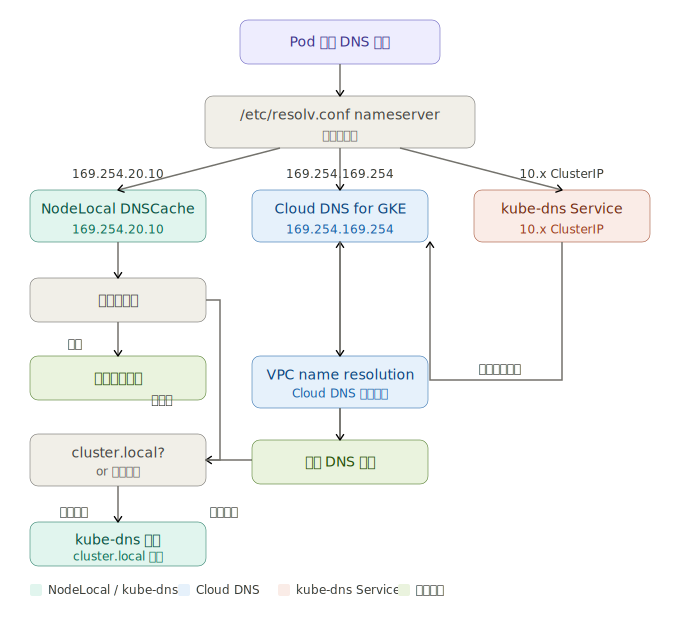

图一： GKE Pod DNS 查询全路径（三种模式）
- 

图二：Cloud DNS Name Resolution Order（含 GKE cluster-scope）
- 

图三：VPC2 Peering → VPC1 Forwarding → 企业 DNS 完整链路
- 

图四：GKE → Cloud DNS → On-prem DNS 完整链路（含 GKE cluster-scope）
- 