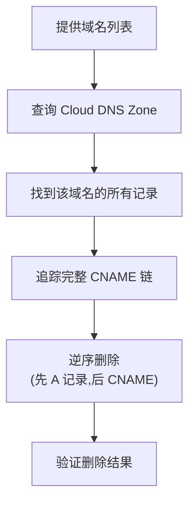

# GCP Cloud DNS 记录批量删除脚本使用说明

## 核心设计理念

### ⚠️ 重要区别

与添加脚本不同,删除脚本**不依赖 `host` 命令重新解析域名**,而是:

> **直接查询 Cloud DNS Zone 中已存在的记录并删除**

这样设计的原因:
- ✅ 删除的是你之前添加的记录,而不是当前解析结果
- ✅ 即使外部 DNS 已经变化,也能准确删除 Zone 中的旧记录
- ✅ 避免因 DNS 解析变化导致删除错误的记录

## 工作原理



## 使用方法

### 基本用法

```bash
# 预览模式(推荐先使用)
./dnsrecord-del-script.sh -n

# 实际删除
./dnsrecord-del-script.sh

# 指定项目和 Zone
./dnsrecord-del-script.sh -p my-project -z my-zone

# 预览指定 Zone 的删除
./dnsrecord-del-script.sh -z custom-zone -n

# 显示帮助
./dnsrecord-del-script.sh -h
```

## 配置说明

### 编辑域名列表

```bash
# 需要删除的域名列表
DOMAINS=(
    "login.microsoft.com"
    "graph.microsoft.com"
    "www.example.com"
)
```

**注意**: 只需要提供最初添加的域名,脚本会自动找到所有相关的 CNAME 链和 A 记录。

## 删除逻辑

### 1. 查找阶段

脚本会在 Cloud DNS Zone 中查找:
- 指定域名的 CNAME 记录
- CNAME 指向的下一跳记录
- 最终的 A 记录

### 2. 删除顺序

**逆序删除** (从后往前):
```
A 记录 (最后一跳)
  ↓
CNAME 记录 (中间跳)
  ↓
CNAME 记录 (第一跳)
```

这样可以避免删除顺序导致的依赖问题。

## 输出示例

### 预览模式

```
========================================
GCP Cloud DNS 记录批量删除工具 [预览模式]
========================================
项目 ID: my-project
DNS Zone: private-access
域名数量: 2
模式: 预览模式 (不会实际删除)

========================================
处理域名: login.microsoft.com
========================================
查找域名相关记录: login.microsoft.com
  找到 CNAME 记录: login.microsoft.com. -> login.mso.msidentity.com.
  找到 CNAME 记录: login.mso.msidentity.com. -> ak.privatelink.msidentity.com.
  找到 A 记录: ak.privatelink.msidentity.com. -> 20.190.160.1

[预览模式] 将要删除以下记录:
  A 记录: ak.privatelink.msidentity.com. (TTL: 300) -> 20.190.160.1
    [预览] 将删除此记录
  CNAME 记录: login.mso.msidentity.com. (TTL: 300) -> ak.privatelink.msidentity.com.
    [预览] 将删除此记录
  CNAME 记录: login.microsoft.com. (TTL: 300) -> login.mso.msidentity.com.
    [预览] 将删除此记录
  处理了 3 条记录

========================================
预览完成
========================================
总域名数: 2
成功处理: 2
失败: 0
将删除记录数: 6

这是预览模式,没有实际删除任何记录
如需实际删除,请去掉 -n 参数重新运行
```

### 实际删除模式

```
========================================
GCP Cloud DNS 记录批量删除工具
========================================

删除 login.microsoft.com 的 DNS 记录...
  A 记录: ak.privatelink.msidentity.com. (TTL: 300) -> 20.190.160.1
    ✓ 成功删除
  CNAME 记录: login.mso.msidentity.com. (TTL: 300) -> ak.privatelink.msidentity.com.
    ✓ 成功删除
  CNAME 记录: login.microsoft.com. (TTL: 300) -> login.mso.msidentity.com.
    ✓ 成功删除
  处理了 3 条记录

验证删除结果...
✓ 确认所有相关记录已删除

========================================
删除完成
========================================
总域名数: 2
成功处理: 2
失败: 0
已删除记录数: 6
========================================
```

## 安全特性

### 1. 预览模式 (`-n`)

**强烈建议先使用预览模式**:
```bash
./dnsrecord-del-script.sh -n
```

预览模式会:
- ✅ 显示将要删除的所有记录
- ✅ 不实际执行删除操作
- ✅ 让你确认删除内容是否正确

### 2. 验证删除

删除后自动验证:
- 检查记录是否真的被删除
- 显示任何残留的记录

### 3. 循环检测

脚本包含循环检测机制,避免 CNAME 循环导致的无限递归。

## 常见场景

### 场景 1: 清理旧的外部依赖记录

```bash
# 5 天前添加的记录
DOMAINS=(
    "old-api.example.com"
    "deprecated-service.com"
)

# 预览
./dnsrecord-del-script.sh -n

# 确认后删除
./dnsrecord-del-script.sh
```

### 场景 2: 批量清理测试记录

```bash
DOMAINS=(
    "test1.example.com"
    "test2.example.com"
    "test3.example.com"
)

./dnsrecord-del-script.sh
```

### 场景 3: 只删除特定 Zone 的记录

```bash
./dnsrecord-del-script.sh -z test-zone
```

## 注意事项

### ⚠️ 重要提醒

1. **先预览**: 始终先使用 `-n` 参数预览
2. **确认域名**: 确保域名列表正确
3. **Zone 选择**: 确认操作的是正确的 Zone
4. **权限要求**: 需要 Cloud DNS 删除权限

### 🔍 故障排除

#### 问题: "未找到相关记录"

**原因**: 
- 域名在 Zone 中不存在
- 域名拼写错误
- 记录已经被删除

**解决**:
```bash
# 手动查看 Zone 中的所有记录
gcloud dns record-sets list --zone=private-access
```

#### 问题: "删除失败"

**可能原因**:
- 权限不足
- 记录被其他记录引用
- Zone 被锁定

**解决**:
```bash
# 检查权限
gcloud projects get-iam-policy PROJECT_ID

# 手动删除单条记录
gcloud dns record-sets delete DOMAIN. \
    --type=CNAME \
    --zone=private-access
```

## 与添加脚本的对比

| 特性 | 添加脚本 | 删除脚本 |
|------|---------|---------|
| DNS 解析 | ✅ 使用 `host` 命令 | ❌ 不使用 |
| 数据来源 | 公网 DNS | Cloud DNS Zone |
| 重复检查 | 跳过已存在 | 查找所有相关 |
| 顺序 | 正序添加 | 逆序删除 |
| 预览模式 | ❌ 无 | ✅ 有 (`-n`) |

## 最佳实践

### 推荐工作流程

```bash
# 1. 先预览
./dnsrecord-del-script.sh -n

# 2. 检查输出,确认要删除的记录

# 3. 实际删除
./dnsrecord-del-script.sh

# 4. 验证结果
gcloud dns record-sets list --zone=private-access
```

### 保存删除日志

```bash
./dnsrecord-del-script.sh 2>&1 | tee dns-delete-$(date +%Y%m%d).log
```

## 相关命令

```bash
# 查看 Zone 中的所有记录
gcloud dns record-sets list --zone=private-access

# 查看特定域名的记录
gcloud dns record-sets list \
    --zone=private-access \
    --filter="name:example.com"

# 手动删除单条记录
gcloud dns record-sets delete example.com. \
    --type=CNAME \
    --zone=private-access
```
