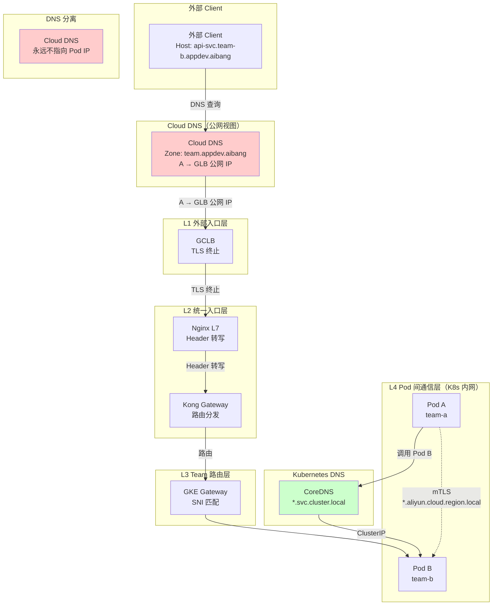
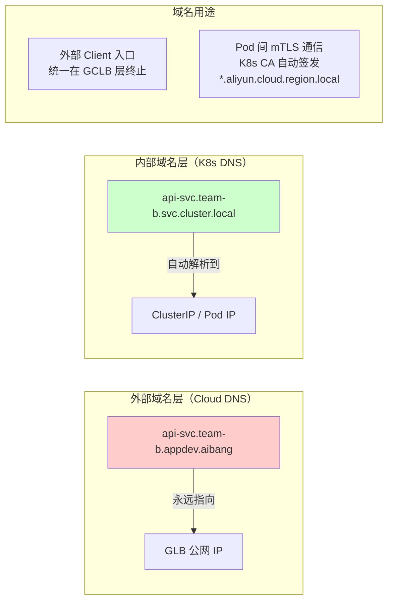

# GKE DNS 架构设计指南：外部域名与内部域名分离原则

> **适用环境**：GKE + Kong Gateway + Nginx L7 + GCLB + ASM/Istio
> **核心原则**：外部域名与内部域名必须分离，不能用同一套域名从头管到尾
> **存放路径**：`linux/dns/docs/external-internal-dns-separation.md`

---

## 1. 核心原则：为什么外部和内部域名必须分离

### 1.1 两种域名的本质差异

| 属性 | 外部域名 `*.team.appdev.aibang` | 内部域名 `*.aliyun.cloud.region.local` |
|------|-------------------------------|-------------------------------------|
| **管理方** | Cloud DNS（平台运维 / 团队） | Kubernetes CoreDNS（自动管理） |
| **IP 类型** | 静态（GLB IP / Internal LB IP） | 动态（Pod IP，随 Pod 重建变化） |
| **生命周期** | 长期稳定（随域名续期） | 随 Pod 生命周期（分钟级创建/销毁） |
| **解析范围** | 外部可解析（公网） | 仅集群内可解析 |
| **证书签发方** | 公共 CA / 私有 CA（手动） | K8s CA / Mesh CA（自动，24h 轮换） |
| **证书存储** | K8s Secret（落盘） | SDS 内存级（不落盘） |
| **路由路径** | Client → GLB → Nginx → Kong → Pod | Pod → CoreDNS → Pod（内部直连） |
| **DNS 机制** | Split-horizon DNS（内部视图 / 外部视图） | K8s DNS（Cluster 内置） |

### 1.2 用同一套域名的后果

如果尝试用 `*.team.appdev.aibang` 同时服务外部入口和内部 Pod 间通信，会触发 **DNS 语义冲突**：

```
同一个域名 api-svc.team-b.appdev.aibang

外部 Client 期望：Client → GLB → Nginx → Kong → Pod
内部 Pod A 期望：Pod A → DNS 解析 → Pod B（内部 mTLS）

DNS 解析行为：
  - 外部 Client：Cloud DNS 公网视图 → GLB 公网 IP ✓
  - Pod A（Split-horizon）：Cloud DNS 内部视图 → GLB 公网 IP ✗
  - Pod A（K8s DNS）：CoreDNS → 不认识 *.team.appdev.aibang → NXDOMAIN ✗
```

**结果**：Pod 间通信必然走不到预期路径，要么 DNS 解析失败，要么流量"绕出集群"走公网。

---

## 2. 分层域名架构

```
┌──────────────────────────────────────────────────────────────┐
│  L1  外部域名层（External Domain）                            │
│       *.team.appdev.aibang                                   │
│                                                              │
│  Cloud DNS Zone: team.appdev.aibang                           │
│  A 记录 → GLB 公网 IP（静态）                                │
│  用途：外部 Client 发起 HTTPS 请求的入口                      │
└──────────────────────────────────────────────────────────────┘
                           ↓ TLS 终止（GCLB 层）
┌──────────────────────────────────────────────────────────────┐
│  L2  统一入口层（Ingress Layer）                              │
│       dev-abjx.aliyun.cloud.region.local                        │
│                                                              │
│  Cloud DNS Zone: appdev.aibang                               │
│  A 记录 → GLB 公网 IP                                        │
│  用途：GCLB/Nginx TLS 终止，Header 转写                       │
└──────────────────────────────────────────────────────────────┘
                           ↓ Header 转写 + 路由分发
┌──────────────────────────────────────────────────────────────┐
│  L3  Team 路由层（Team Routing）                              │
│       *.team.appdev.aibang                                   │
│                                                              │
│  仅用于 Gateway 层的 SNI 识别和路由匹配                        │
│  Kong / GKE Gateway 根据 Host Header 分发到对应 Team          │
│  注意：这一层不做 Pod 间通信的 DNS 解析                        │
└──────────────────────────────────────────────────────────────┘
                           ↓ Kong upstream 寻址
┌──────────────────────────────────────────────────────────────┐
│  L4  Pod 间通信层（Internal Domain）                          │
│       *.aliyun.cloud.region.local                               │
│                                                              │
│  Kubernetes 内置 DNS（CoreDNS）                               │
│  K8s CA / Mesh CA 自动签发 mTLS 证书                          │
│  SDS 内存级私钥，不落盘                                       │
│  用途：Pod ↔ Pod 之间的加密通信                               │
└──────────────────────────────────────────────────────────────┘
```

---

## 3. DNS 解析流程

### 3.1 外部 Client 请求流程

```
外部 Client
  ↓ (HTTPS 请求，Host: api-svc.team-b.appdev.aibang)
Cloud DNS（公网视图）
  ↓ A 记录查询
  → GLB 公网 IP
  ↓
GCLB（Nginx 统一入口）
  ↓ TLS 终止
Nginx L7
  ↓ Header 转写（X-Team: team-b, X-User: xxx）
Kong Gateway
  ↓ 按 Path / Header 路由
GKE Gateway（Team 路由层）
  ↓
Pod B（team-b）收到请求
```

### 3.2 Pod 间通信请求流程（正确做法）

```
Pod A（team-a）调用 Pod B（team-b）的 API
  ↓ 代码中发起 HTTP 请求
  ↓ 目标地址：api-svc.team-b.svc.cluster.local  ← 注意这里是 K8s 原生 DNS
CoreDNS 解析
  → ClusterIP 或 Pod IP（集群内部）
Kong upstream 配置
  → target: team-b-api-svc.team-b.svc.cluster.local:8443
  ↓ Kong DNS 解析 → 集群内部 IP
Kong Pod 直接连接 Pod B
  ↓ mTLS 加密（*.aliyun.cloud.region.local 证书）
Pod B 收到请求（已在 Istio Sidecar 层终止 TLS）
```

### 3.3 Pod 间通信请求流程（错误做法）

```
Pod A（team-a）调用 Pod B（team-b）的 API
  ↓ 代码中发起 HTTP 请求
  ↓ 目标地址：api-svc.team-b.appdev.aibang  ← 错误：用外部 Team 域名
Kong upstream 配置
  → target: api-svc.team-b.appdev.aibang:443
Kong DNS 解析（Split-horizon DNS）
  → Cloud DNS 内部视图 → GLB 公网 IP（外部 IP）
Kong 认为 upstream 在集群外部
  ↓
请求"绕出集群"：
Kong Pod → 公网 → GLB 公网 IP → 外部网络 → GLB → Pod B

后果：
  - 多一跳网络延迟
  - 外部段无 mTLS（安全合规风险）
  - GLB 外部流量计费（额外费用）
  - 流量走向不确定（依赖 DNS 配置）
```

---

## 4. Zone 管理策略

### 4.1 Cloud DNS Zone 划分

```
Cloud DNS 托管区域：

Zone: appdev.aibang（主 Zone，管理平台级域名）
  - dev-abjx.aliyun.cloud.region.local  → GLB 公网 IP
  - *.aliyun.cloud.region.local          → GLB 公网 IP（统一入口）

Zone: team.appdev.aibang（Team 路由 Zone，管理各 Team 的域名）
  - 每个 Team 一个子域
  - A 记录全部指向 GLB 公网 IP（统一入口）
  - 示例：
    - api.team-a.appdev.aibang         → GLB 公网 IP
    - api.team-b.appdev.aibang         → GLB 公网 IP
    - *.team-a.appdev.aibang            → GLB 公网 IP
    - *.team-b.appdev.aibang           → GLB 公网 IP
```

**关键点**：Cloud DNS Zone 的 A 记录**永远指向 GLB 公网 IP**，不指向 Pod IP 或 ClusterIP。外部流量入口必须统一。

### 4.2 Kubernetes DNS 命名规范

```
Kubernetes 内部 DNS 命名：

Namespace: team-a
  Service: api-svc.team-a.svc.cluster.local
  Pod:     api-svc-xxx-xxxxx.team-a.svc.pod.cluster.local

Namespace: team-b
  Service: api-svc.team-b.svc.cluster.local
  Pod:     api-svc-xxx-xxxxx.team-b.svc.pod.cluster.local
```

**注意**：`*.svc.cluster.local` 是 Kubernetes 内置的 Service 域名后缀，不需要在 Cloud DNS 中管理。

### 4.3 分离管理清单

| 域名类型 | 示例 | 管理方 | 存放位置 | A 记录指向 |
| 平台入口域名 | `dev-abjx.aliyun.cloud.region.local` | Cloud DNS Zone `appdev.aibang` | Cloud DNS | GLB 公网 IP |
| Team 路由域名 | `*.team.appdev.aibang` | Cloud DNS Zone `team.appdev.aibang` | Cloud DNS | GLB 公网 IP |
| K8s Service 域名 | `*.svc.cluster.local` | Kubernetes CoreDNS | K8s 内置 | ClusterIP / Pod IP |
| Pod 间 mTLS 域名 | `*.aliyun.cloud.region.local` | K8s CA / Mesh CA | SDS（内存） | 不需要 DNS A 记录 |

---

## 5. Kong 配置的正确实践

### 5.1 Upstream 寻址：使用 K8s Service 名称

```yaml
# Kong upstream 应该使用 K8s Service 名称，不使用外部 Team 域名
upstreams:
  - name: team-b-api
    targets:
      - peer: team-b-api-svc.team-b.svc.cluster.local:8443
    health_checks:
      active:
        type: https
        http_path: /health
        https_verify_certificate: false  # 因为证书是 K8s CA 签发
```

**原因**：Kong Pod 内的 `/etc/resolv.conf` 指向 CoreDNS，CoreDNS 只认识 `*.svc.cluster.local`。使用外部 Team 域名会导致 Split-horizon DNS 返回 GLB 公网 IP，流量绕行公网。

### 5.2 Service Discovery：让 Kong 感知 K8s Service

如果 Kong 需要动态感知 K8s Service 的变化（Pod IP 变更），建议使用 Kong 的 **DNS discovery** 或 **SRV 记录**：

```yaml
# Kong upstream 使用 SRV 记录（推荐）
upstreams:
  - name: team-b-api-srv
    targets:
      # Kong 会自动查询 _api-svc._tcp.team-b.svc.cluster.local SRV 记录
      - balancer: SRV_RECORD
        value: team-b-api-svc.team-b.svc.cluster.local
```

### 5.3 不要做的事情

```
❌ 不要在 Kong upstream 中使用外部 Team 域名：
   targets:
     - peer: api-svc.team-b.appdev.aibang:443

❌ 不要让 Kong 的 /etc/resolv.conf 指向外部 DNS：
   （这会导致所有 DNS 查询都走到集群外部）

❌ 不要在 Cloud DNS 内部视图中将 Team 域名指向 Pod IP：
   （Pod IP 是临时的，DNS A 记录无法自动同步）
```

---

## 6. Egress 流量的 DNS 处理

### 6.1 Pod 对外请求的 DNS 解析路径

```
Pod A 发起 Egress 请求：api-svc.team-b.appdev.aibang

Pod A 的 /etc/resolv.conf：
  nameserver: kube-dns.kube-system.svc.cluster.local

CoreDNS 查询顺序：
  1. 查询 api-svc.team-b.appdev.aibang
  2. 发现是外部域名，转发给上游 DNS（Cloud DNS）
  3. Cloud DNS 返回：GLB 公网 IP
  4. 请求走向：Pod A → GLB 公网 IP → 外部网络

正确做法：
  Pod A 调用内部服务时，应该使用 K8s Service 名称
  → api-svc.team-b.svc.cluster.local
  → CoreDNS 直接解析到 ClusterIP
```

### 6.2 Egress 语义清晰的配置

```
Pod A 的代码应该区分两种调用：

# 场景 1：调用同集群内的其他 Pod
service_client.get("https://api-svc.team-b.svc.cluster.local/api/v1/users")
# → CoreDNS 解析到 ClusterIP → Kong → Pod B（内部 mTLS）

# 场景 2：调用集群外部的服务（如第三方 API）
service_client.get("https://api.some-external.com/api/data")
# → Cloud DNS 公网解析 → 直接出公网
```

---

## 7. 架构图

### 7.1 完整流量路径图



### 7.2 DNS 语义分离图



---

## 8. 实施检查清单

### 8.1 Cloud DNS 配置检查

```
☐ Zone appdev.aibang 已创建，A 记录指向 GLB 公网 IP
☐ Zone team.appdev.aibang 已创建，各 Team 子域 A 记录指向 GLB 公网 IP
☐ Cloud DNS 内部视图未配置指向 Pod IP
☐ Split-horizon DNS 未将 *.team.appdev.aibang 指向 ClusterIP
```

### 8.2 Kong 配置检查

```
☐ Kong upstream 使用 *.svc.cluster.local 而非 *.team.appdev.aibang
☐ Kong upstream health check 使用 https + /health 端点
☐ Kong 未配置指向外部 DNS 作为 nameserver
☐ Kong DP Pod 的 /etc/resolv.conf 指向 kube-dns
```

### 8.3 Kubernetes DNS 检查

```
☐ CoreDNS 正常工作，*.svc.cluster.local 可解析
☐ K8s CA / Mesh CA 为所有 Pod 自动签发 mTLS 证书
☐ Istio/ASM Sidecar 注入了所有需要 mTLS 的 Pod
☐ Pod 间通信使用 K8s Service 名称而非外部 Team 域名
```

### 8.4 监控告警检查

```
☐ DNS 解析延迟告警（CoreDNS 解析 *.svc.cluster.local 应 < 5ms）
☐ Kong upstream 健康状态监控
☐ mTLS 证书到期告警（应在到期前 24h 内触发）
☐ Egress 流量异常告警（Pod 走公网出口的流量突增）
```

---

## 9. 常见问题排查

### 9.1 Kong upstream 解析到外部 IP

**症状**：Kong 日志显示 upstream IP 是 GLB 公网 IP，而不是 ClusterIP。

**原因**：Kong upstream hostname 使用了 `*.team.appdev.aibang`，Split-horizon DNS 返回了 GLB IP。

**解决**：
1. 将 Kong upstream hostname 改为 K8s Service 名称：`*.svc.cluster.local`
2. 检查 CoreDNS 配置，确保未转发 `*.team.appdev.aibang` 到 Cloud DNS 内部端点

### 9.2 Pod 间 mTLS 握手失败

**症状**：Pod A 调用 Pod B 时 TLS 握手报错。

**排查步骤**：
```bash
# 1. 检查 Pod B 的证书 SAN
kubectl exec -it pod-a -c istio-proxy -- curl http://localhost:15000/certs | jq .

# 2. 检查目标 Service 的 DNS 解析
kubectl exec -it pod-a -- nslookup api-svc.team-b.svc.cluster.local

# 3. 检查 Istio PeerAuthentication 策略
kubectl get peerauthentication -n team-b
```

### 9.3 DNS 解析超时

**症状**：Pod 内 DNS 查询超时，requests 失败。

**排查步骤**：
```bash
# 1. 检查 CoreDNS 日志
kubectl logs -n kube-system -l k8s-app=kube-dns -c coredns

# 2. 检查 /etc/resolv.conf 配置
kubectl exec -it pod-a -- cat /etc/resolv.conf

# 3. 测试 K8s DNS 解析
kubectl exec -it pod-a -- nslookup kubernetes.default.svc.cluster.local
```

---

## 10. 参考资料

| 文档 | 路径 | 关键内容 |
|------|------|----------|
| Pod 间证书替代评估 | `safe/ssl/docs/claude/pod-cert-replacement-evaluation.md` | 13 个维度评估不替代方案 |
| GCLB 证书管理 | `webservice/nginx/docs/GCLB-Certificate-Management.md` | Target HTTPS Proxy 证书配额 |
| ASM mTLS 深度探索 | `gcp/asm/asm-mtls-explorer.md` | Pod 间 mTLS 实现机制 |
| GKE DNS 解析图 | `linux/dns/gke-dns-resolution.drawio.svg` | GKE DNS 解析流程图 |
| GCP DNS forwarding | `linux/dns/gcp-dns-forwarding.drawio.png` | Cloud DNS 转发配置图 |

---

## 11. 集群内部域名转换详解

### 11.1 核心问题：Pod 内的 DNS 查询去了哪里

Pod 内的 `/etc/resolv.conf` 控制 DNS 解析行为。这是理解集群内域名转换的第一步：

```bash
# Pod 内的 /etc/resolv.conf 示例
nameserver kube-dns.kube-system.svc.cluster.local
search <namespace>.svc.cluster.local svc.cluster.local cluster.local
options ndots:5

# kube-dns 服务暴露的 IP（ClusterIP）
# 10.x.x.x （固定 IP，由 kube-system namespace 下的 Service 分配）
```

**关键字段解释**：

| 字段 | 值 | 含义 |
|------|----|------|
| `nameserver` | `kube-dns.kube-system.svc.cluster.local` | DNS 查询全部发往 CoreDNS |
| `search` | `<namespace>.svc.cluster.local svc.cluster.local cluster.local` | 查询失败时自动追加后缀重试 |
| `options ndots:5` | `5` | 查询名的普通分隔点数量 **少于** 5 时，先追加 search path 再查原始名；等于或多于 5 时，先查原始名再决定是否继续 search |

**`ndots:5` 的精确行为**（基于参考文档校正）：

```
ndots 行为规则：
  - 普通分隔点数量 < ndots（5）：先追加 search path，全部失败再查原始名
  - 普通分隔点数量 >= ndots（5）：先查原始名，再按 resolver 行为决定是否继续 search
  - 查询名以尾部点结尾（.）：作为绝对 FQDN，不追加 search path（最直接的表达）

点数计算示例：
  api-svc.team-b.svc.cluster.local   → 普通分隔点：4 个（api-svc, team-b, svc, cluster, local 但 svc.cluster.local 是一个复合 label）
                                    → 4 < 5 → 先走 search path

  api-svc.team-b.appdev.aibang      → 普通分隔点：3 个（api-svc, team-b, appdev, aibang）
                                    → 3 < 5 → 先走 search path（先追加 search suffix，再查原始名）
                                    → 注意：不是 5 个点，3 < 5 才触发 search path
```

**`api-svc.team-b.appdev.aibang` 的完整查询序列**（ndots:5，4 个普通分隔点，4 < 5，所以先走 search）：

```
1. api-svc.team-b.appdev.aibang.<namespace>.svc.cluster.local  → NXDOMAIN
2. api-svc.team-b.appdev.aibang.svc.cluster.local              → NXDOMAIN
3. api-svc.team-b.appdev.aibang.cluster.local                   → NXDOMAIN
4. api-svc.team-b.appdev.aibang.<project>.internal             → NXDOMAIN
5. api-svc.team-b.appdev.aibang                                → 最终查询原始名 → 外部 DNS 解析
```

**关键纠正**：当代码中使用外部 Team 域名（`api-svc.team-b.appdev.aibang`，3 个普通分隔点）时，因为 `3 < 5`，Pod resolver 会先尝试 5 次 search path 拼接，全部失败后才查询原始名。这造成不必要的解析延迟。如果使用尾部点 FQDN（`api-svc.team-b.appdev.aibang.`），resolver 会直接按绝对名字查询，跳过 search path。

---

### 11.2 CoreDNS 解析层级与转发链

CoreDNS 是集群内部的 DNS 服务器，负责解析以下几类域名：

```
CoreDNS 解析链路：

Pod DNS Query
  ↓
┌─────────────────────────────────────────────────────────┐
│ CoreDNS（kube-dns Pod）                                  │
│                                                          │
│  1. 查看 /etc/coredns/Corefile（ConfigMap）              │
│  2. 按 zone 顺序匹配                                      │
│  3. 各 zone 处理逻辑：                                    │
└─────────────────────────────────────────────────────────┘

Zone 匹配顺序（从上到下，优先级递减）：

① kubernetes cluster.local          # K8s 内置 Service/Pod 解析
   → 直接返回 ClusterIP 或 Pod IP
   → 找不到则返回 NXDOMAIN

② svc.cluster.local                  # 同上，svc 层级
   → 找不到则返回 NXDOMAIN

③ <namespace>.svc.cluster.local       # search 路径展开的结果
   → 找不到则返回 NXDOMAIN

④ cluster.local                       # search 路径展开
   → 找不到则返回 NXDOMAIN

⑤ .（根 zone）                        # 所有未知域名转发上游
   → Cloud DNS（通过 cloud DNS forwarding rule）
   → 或者 /etc/resolv.conf 中的 external nameserver
```

**典型 CoreDNS ConfigMap 示例**：

```yaml
# kubectl get configmap coredns -n kube-system -o yaml
apiVersion: v1
kind: ConfigMap
metadata:
  name: coredns
  namespace: kube-system
data:
  Corefile: |
    .:53 {
        errors
        health {
           lameduck 5s
        }
        ready
        kubernetes cluster.local in-addr.arpa ip6.arpa {
           pods insecure
           fallthrough in-addr.arpa ip6.arpa
           ttl 30
        }
        forward . 10.60.0.2  # 上游 DNS（Cloud DNS Internal IP）
        cache 30
        loop
        reload
        loadbalance
    }
```

**`forward . 10.60.0.2` 的含义**：所有非 K8s 域名的查询，都转发到 `10.60.0.2`（GCP 内部 DNS 网关）。这意味着 `*.team.appdev.aibang` 这类外部域名，CoreDNS 自身不负责解析，而是转发到 GCP 内部 DNS，再由 GCP 内部 DNS 转发到 Cloud DNS。

---

### 11.3 Kubernetes 内置 DNS 记录类型

K8s DNS 为以下资源自动生成 DNS 记录：

#### 11.3.1 Service（ClusterIP）

```
api-svc.team-b.svc.cluster.local
  → A 记录：ClusterIP（虚拟 IP，不随 Pod 重建变化）
  → SRV 记录：_api-svc._tcp.team-b.svc.cluster.local → Port 8443

Short name（受 ndots 和 search 路径影响）：
  api-svc          → 追加 search 路径 → api-svc.<namespace>.svc.cluster.local
  api-svc.team-b   → 追加 search 路径 → api-svc.team-b.<namespace>.svc.cluster.local
```

#### 11.3.2 Headless Service

```yaml
# 无头 Service（clusterIP: None）
api-svc:
  spec:
    clusterIP: None  # Headless
```

```
api-svc.team-b.svc.cluster.local
  → A 记录：每个 Pod IP（动态，Pod 重建后变化）
  → 多值 A 记录（如有多个 Pod）

解析示例：
  Host: api-svc.team-b.svc.cluster.local
  → 返回: [10.0.1.15, 10.0.1.22, 10.0.1.30]（三个 Pod IP）
```

**注意**：Headless Service 的 DNS 记录指向 Pod IP，Pod IP 是临时的。如果有人试图在 Cloud DNS 中为 Headless Service 创建静态 A 记录指向 Pod IP，这个记录会在 Pod 重建后失效。

#### 11.3.3 ExternalName Service

```yaml
api-external:
  spec:
    type: ExternalName
    externalName: api.external.com
```

```
api-external.team-b.svc.cluster.local
  → CNAME 记录：api.external.com
  → 客户端拿到 CNAME 后自行解析
  → 流量直接出集群，走外部 DNS
```

**风险**：ExternalName Service 不会触发 Istio mTLS，因为流量直接走了外部。

---

### 11.4 域名转换路径详解（从 Pod 到目标 Pod）

Pod 间通信的完整 DNS 解析路径如下：

```
场景：Pod A（team-a）调用 Pod B（team-b）的 api-svc

Step 1：Pod A 发起请求
  代码中：https://api-svc.team-b.svc.cluster.local/api/v1

Step 2：glibc 解析（ndots 决策）
  域名普通分隔点：4 个（api-svc, team-b, svc, cluster, local → 但 svc.cluster.local 是复合 label，实际为 4 个点）
  ndots=5，4 < 5
  → 先走 search path（先追加 search suffix，再查原始名）
  → 实际产生 5 次 DNS 查询：4 次 search path 拼接 + 1 次原始名

Step 3：DNS 查询发往 kube-dns（ClusterIP）
  /etc/resolv.conf nameserver: 10.x.x.x

Step 4：CoreDNS 接收查询
  查询: api-svc.team-b.svc.cluster.local（search path 阶段）

Step 5：CoreDNS Zone 匹配
  匹配 kubernetes cluster.local zone
  查找 Service: api-svc.team-b
  → 返回 ClusterIP（10.x.y.z）

Step 6：TCP 连接建立
  Pod A → ClusterIP:8443
  → kube-proxy 规则 → Endpoint（Pod IP 列表）
  → 负载均衡到某个 Pod B

Step 7：mTLS 握手（Istio Sidecar）
  Pod A 的 istio-proxy 拦截出站流量
  → SDS 请求获取 Client 证书（*.aliyun.cloud.region.local）
  → Pod B 的 istio-proxy 终止入站 TLS
  → 验证 Pod B 证书 SAN

完整路径图：
  Pod A → ClusterIP → kube-proxy → Pod B
         (DNS 解析: CoreDNS → ClusterIP，含 search path 放大)
         (mTLS: istiod SDS → *.aliyun.cloud.region.local)
```

---

### 11.5 Split-Horizon DNS 下的内部视图转换

如果为 `*.team.appdev.aibang` 配置了 Split-horizon DNS（内部视图指向 GLB 公网 IP），CoreDNS 会对这类域名走不同的解析路径：

```
Pod A 查询：api-svc.team-b.appdev.aibang

Step 1：ndots 检查
  域名普通分隔点：1 个（team-b 中的点）
  ndots=5，1 < 5
  → 先走 search 路径（先追加 search suffix，再查原始名）

Step 2：search 路径尝试
  api-svc.team-b.appdev.aibang.<namespace>.svc.cluster.local → NXDOMAIN
  api-svc.team-b.appdev.aibang.svc.cluster.local              → NXDOMAIN
  api-svc.team-b.appdev.aibang.cluster.local                   → NXDOMAIN
  api-svc.team-b.appdev.aibang.<project>.internal             → NXDOMAIN

Step 3：查询完整名称
  api-svc.team-b.appdev.aibang
  → CoreDNS 匹配 .（根 zone）
  → 转发到上游 DNS（10.60.0.2）

Step 4：GCP 内部 DNS 转发
  → Cloud DNS Internal Endpoint
  → Split-horizon 返回内部视图 A 记录：GLB 公网 IP

Step 5：Kong Pod 发起连接
  Kong Pod 认为 target: <GLB 公网 IP>:443 是外部目标
  → 流量出集群：Kong Pod → 公网 → GLB
  → 这是错误的！Kong 应该连接集群内部的 Pod
```

**这就是为什么 Kong upstream 不能用外部 Team 域名**——即使只有 1 个普通分隔点（team-b），因为 `1 < 5`，Pod resolver 会先走 search path（4 次 NXDOMAIN），然后才查原始名，最终通过 Split-horizon DNS 解析到 GLB 公网 IP，导致 Kong 认为 upstream 在集群外部，流量绕行公网。

**推荐做法**：应用代码中使用 K8s Service 名称（`*.svc.cluster.local`），CoreDNS 直接解析到 ClusterIP，流量不绕行公网。

---

### 11.6 Istio ServiceEntry 对 DNS 的影响

Istio ServiceEntry 可以注册外部服务到服务注册表，但它的 DNS 解析行为与 K8s Service 不同：

```yaml
# Istio ServiceEntry 示例：注册外部数据库
apiVersion: networking.istio.io/v1beta1
kind: ServiceEntry
metadata:
  name: external-db
  namespace: team-b
spec:
  hosts:
  - db.external.com
  ports:
  - number: 5432
    name: tcp-postgres
    protocol: TCP
  location: MESH_EXTERNAL
  resolution: DNS
```

```
ServiceEntry db.external.com 的 DNS 解析：

Pod A 查询：db.external.com
  → Istio Sidecar 拦截
  → 查看 ServiceEntry 注册表
  → 发现 resolution: DNS
  → 调用 gethostbyname（不走 CoreDNS）
  → 直接解析到外部 IP

问题：
  - ServiceEntry 的 DNS 解析绕过了 CoreDNS
  - 不受 ndots 配置影响
  - 但如果你在代码中用 Team 外部域名（如 api.team-b.appdev.aibang）
    而没有对应的 ServiceEntry，解析会走 CoreDNS → 上游 DNS
    → Split-horizon 返回 GLB 公网 IP → 流量绕行
```

**正确做法**：

```yaml
# 如果确实需要让 Pod 通过外部域名访问内部服务，注册 ServiceEntry
apiVersion: networking.istio.io/v1beta1
kind: ServiceEntry
metadata:
  name: team-b-internal
  namespace: team-a
spec:
  hosts:
  - api-svc.team-b.appdev.aibang
  ports:
  - number: 443
    name: https
    protocol: HTTPS
  location: MESH_INTERNAL  # 声明为内部服务
  resolution: DNS
  endpoints:
  - address: 10.0.1.15  # 直接指定 Pod IP
    ports:
      https: 8443
```

**警告**：ServiceEntry 直接指定 Pod IP 作为 endpoint，Pod 重建后 IP 变化，ServiceEntry 不会自动更新。除非配合 **网格内部发现**（ mesh expansion）或 **WorkloadEntry**，否则 Endpoint 指向会过时。

---

### 11.7 DNS 缓存层级与失效机制

集群内有 3 层 DNS 缓存，理解它们有助于排查诡异的解析问题：

```
┌────────────────────────────────────────────────────────┐
│ Layer 1: Pod glibc 缓存                                 │
│  - 缓存时间由 DNS 响应中的 TTL 决定                      │
│  - Pod 重启前永不失效（glibc 不提供显式清理接口）        │
│  - 问题：Pod 内缓存的过期 IP 可能指向已不存在的 Pod      │
│  - 解决：应用程序应该使用 K8s Service 名称而非 Pod IP    │
└────────────────────────────────────────────────────────┘

┌────────────────────────────────────────────────────────┐
│ Layer 2: CoreDNS 缓存                                   │
│  - cache 30（ConfigMap 中配置，示例为 30s）             │
│  - K8s Service 变更时，CoreDNS 会主动失效对应缓存       │
│  - 但 Pod IP 变化不会主动通知 CoreDNS（通过 Endpoint）   │
└────────────────────────────────────────────────────────┘

┌────────────────────────────────────────────────────────┐
│ Layer 3: Istio Sidecar（envoy）缓存                     │
│  - Envoy DNS Filter 缓存 upsteam 解析结果               │
│  - 默认 TTL较长（取决于 DNS 响应 TTL）                  │
│  - 问题：Pod IP 变化后，Envoy 仍可能路由到旧 Pod         │
│  - 解决：Istio 会通过 EndpointSlice 感知变化并更新 Envoy │
│  - 关键：确保 EndpointSlice 同步正常                    │
└────────────────────────────────────────────────────────┘

缓存失效顺序：
  Pod 重启 → EndpointSlice 更新 → Istio 控制面通知 Envoy → DNS 缓存失效
```

**缓存问题典型案例**：

```
Pod B 重建（IP: 10.0.1.15 → 10.0.1.99）

Pod A 的 glibc 缓存（假设 TTL=300s）：
  - 旧记录 api-svc.team-b.svc.cluster.local → 10.0.1.15 仍在缓存中
  - 300s 内 Pod A 仍会尝试连接 10.0.1.15
  - 10.0.1.15 已无 Pod → 连接失败

正确做法：应用程序使用 Service 名称，kube-proxy 会负载均衡到可用 Endpoint
错误做法：应用程序直接解析到 Pod IP 并硬编码连接
```

---

### 11.8 集群内部域名转换全景图

```
┌────────────────────────────────────────────────────────────────────┐
│                         Pod A（team-a）                             │
│  代码调用：https://api-svc.team-b.svc.cluster.local/api/v1           │
│           ↓                                                          │
│  /etc/resolv.conf                                                   │
│    nameserver: 10.x.x.x（kube-dns ClusterIP）                       │
│    search: team-a.svc.cluster.local svc.cluster.local cluster.local  │
│    options ndots:5                                                 │
└────────────────────────────────────────────────────────────────────┘
                              ↓ DNS 查询
┌────────────────────────────────────────────────────────────────────┐
│                    CoreDNS（kube-dns Pod）                           │
│                                                                     │
│  查询 qname: api-svc.team-b.svc.cluster.local                       │
│  zone 匹配: kubernetes cluster.local ✓                             │
│  查找结果: Service api-svc.team-b → ClusterIP: 10.0.1.50             │
│  返回: 10.0.1.50                                                    │
└────────────────────────────────────────────────────────────────────┘
                              ↓ ClusterIP
┌────────────────────────────────────────────────────────────────────┐
│                    kube-proxy（iptables/IPVS）                      │
│  ClusterIP: 10.0.1.50 → Endpoint: [10.0.1.15, 10.0.1.22]            │
│  负载均衡到: 10.0.1.22                                              │
└────────────────────────────────────────────────────────────────────┘
                              ↓
┌────────────────────────────────────────────────────────────────────┐
│  Pod B（team-b）istio-proxy 接收请求                                 │
│                                                                     │
│  ① TLS 终止（mTLS）                                                 │
│  ② 验证 Client 证书 SAN：spiffe://team-a/ns-team-a/sa/api-sa        │
│  ③ Header 检查（X-Forwarded-Client-Cert 等）                        │
│  ④ 转发到 Pod B 业务容器                                           │
└────────────────────────────────────────────────────────────────────┘
```

---

### 11.9 常见 DNS 配置错误与纠正

#### 错误 1：在代码中硬编码 Pod IP

```python
# 错误做法
response = requests.get("https://10.0.1.15:8443/api/v1/users")

# 问题：Pod 重建后 IP 变化，连接失败
# 正确做法
response = requests.get("https://api-svc.team-b.svc.cluster.local/api/v1/users")
```

#### 错误 2：用外部 Team 域名作为 Kong upstream

```yaml
# 错误配置
upstreams:
  - name: team-b-api
    targets:
      - api-svc.team-b.appdev.aibang:443

# 纠正配置
upstreams:
  - name: team-b-api
    targets:
      - api-svc.team-b.svc.cluster.local:8443
```

#### 错误 3：Cloud DNS 内部视图指向 Pod IP

```yaml
# 错误做法：Cloud DNS 内部视图 A 记录
# Zone: team.appdev.aibang
# api.team-b.appdev.aibang → 10.0.1.15（Pod IP，临时）

# 正确做法：永远不将 Cloud DNS A 记录指向 Pod IP
# A 记录应该指向 GLB 公网 IP 或 Internal LB IP
# api.team-b.appdev.aibang → <GLB 公网 IP>
```

#### 错误 4：修改 Pod 的 /etc/resolv.conf 指向外部 DNS

```yaml
# 错误：Pod 级别 dnsConfig（会破坏集群内 DNS 解析）
spec:
  dnsConfig:
    nameservers:
      - 8.8.8.8    # 外部 DNS，绕过了 CoreDNS
    searches:
      - cluster.local

# 正确：不修改 dnsConfig，让 Pod 使用集群默认 DNS
# CoreDNS 会处理所有查询，包括外部域名（转发到 GCP 内部 DNS）
```

---

### 11.10 DNS 验证与调试命令

```bash
# 1. 检查 Pod 的 /etc/resolv.conf
kubectl exec -it <pod-name> -n <namespace> -- cat /etc/resolv.conf

# 2. 测试 K8s DNS 解析（Service 名称）
kubectl exec -it <pod-name> -n <namespace> -- nslookup api-svc.team-b.svc.cluster.local

# 3. 测试外部域名解析（是否会走 CoreDNS 上游）
kubectl exec -it <pod-name> -n <namespace> -- nslookup api.team-b.appdev.aibang

# 4. 检查 CoreDNS 日志（查看转发情况）
kubectl logs -n kube-system -l k8s-app=kube-dns -c coredns --tail=100 | grep "team-b"

# 5. 检查 CoreDNS ConfigMap
kubectl get configmap coredns -n kube-system -o yaml

# 6. 检查 Service 及其 Endpoints（确认 Endpoint 同步）
kubectl get svc api-svc -n team-b -o wide
kubectl get endpoints api-svc -n team-b -o wide

# 7. 检查 Istio ServiceEntry
kubectl get serviceentry -A
kubectl describe serviceentry <name> -n <namespace>

# 8. 验证 Pod 间 mTLS（检查证书 SAN）
kubectl exec -it <pod-name> -n <namespace> -c istio-proxy -- curl http://localhost:15000/certs | jq .

# 9. 检查 EndpointSlice 同步状态
kubectl get endpointslice -n <namespace> -o wide
```

---

*文档生成时间：2026-05-28*
*评估人：Hermes Architecture Profile*