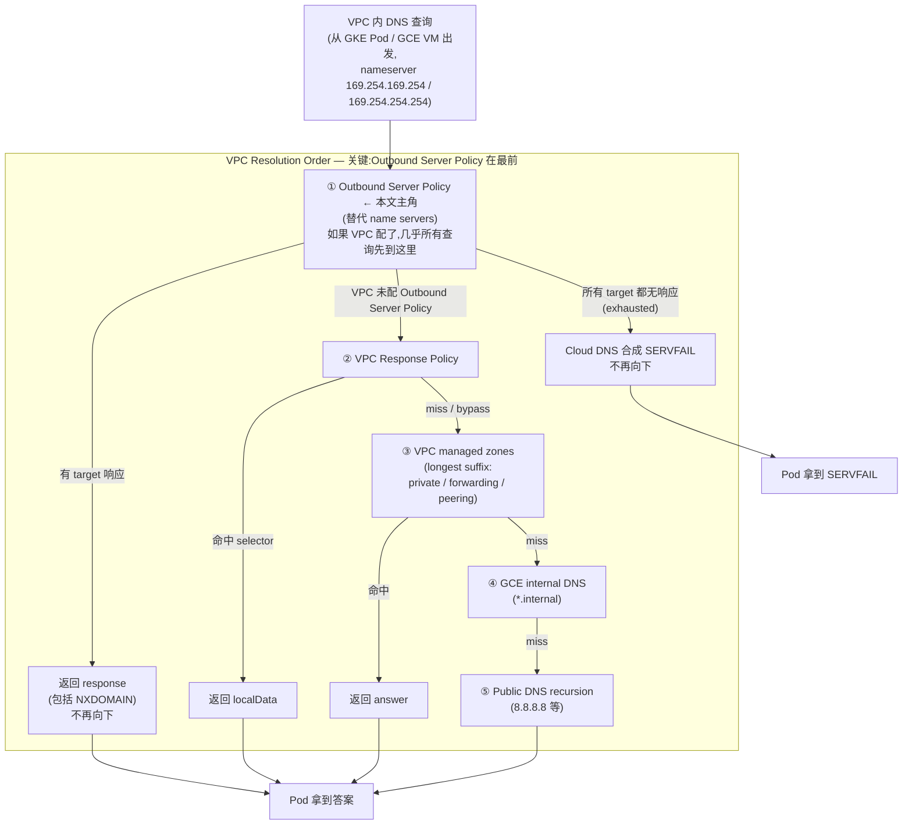
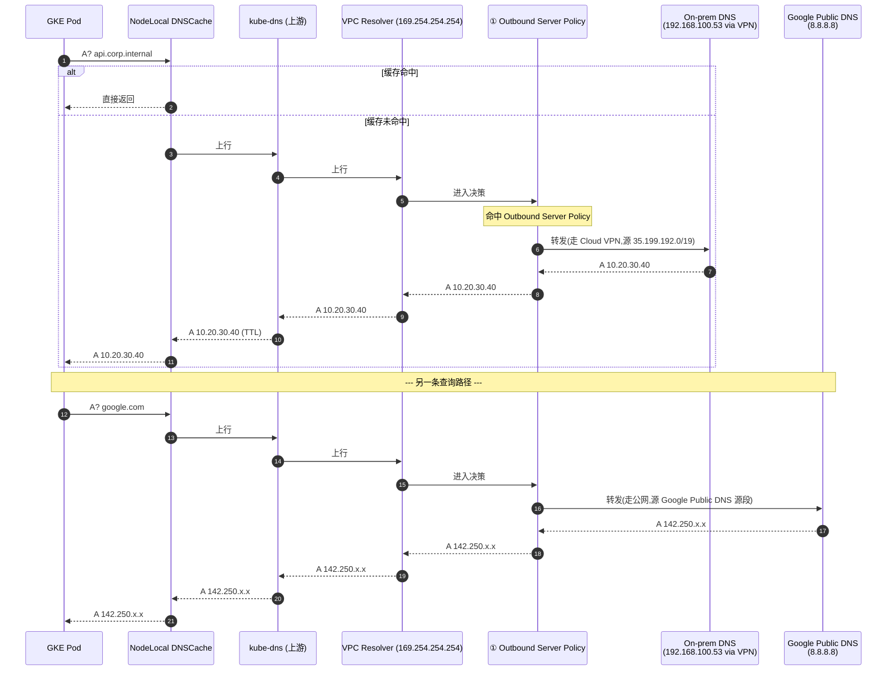
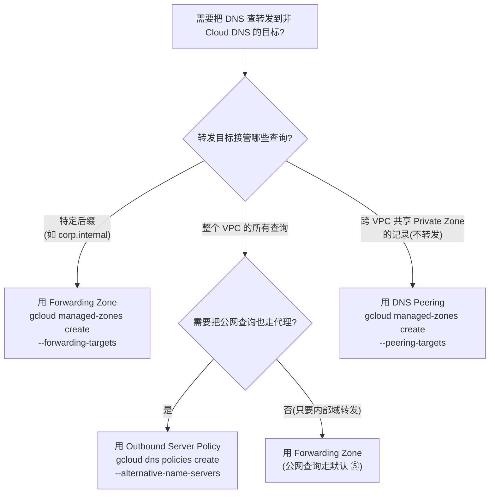

# GCP Cloud DNS Outbound Server Policy Explorer — 替代 DNS、Type 1/2/3 与完整示例

> **目标**:搞清楚"Outbound Server Policy"到底是什么、它在 VPC 解析链路的哪一步生效、跟 Forwarding Zone 的关键区别是什么、以及当你给一个 VPC 装上它之后**整个集群的 DNS 行为会发生什么变化**。
>
> **结论先行**:Outbound Server Policy 是 Cloud DNS 给 VPC 网络提供的**整网级"出站 DNS 转发开关"** —— 一旦启用,VPC 内来自 VM/Pod 的**几乎所有** DNS 查询都会先被转发到你配置的"alternative name servers",**除非**被 GKE cluster-scoped response policy / cluster-scoped private zone 接住。它和 Forwarding Zone 都做"转发",但**作用域完全不同**:Forwarding Zone 只接管某个 DNS 后缀(如 `corp.example.com.`);Outbound Server Policy 接走**整个 VPC 的所有未命中查询**。这是新手最容易踩的坑。
>
> **适用环境**:GKE / GCE / Cloud Run;私有 VPC + 需要把内部域解析交给企业 on-prem DNS / 跨云 DNS / 自建权威 resolver 的场景。
>
> **存放路径**:`linux/dns/docs/gcp-cloud-dns-outbound-server-policy-explorer.md`

---

## 1. 一句话定义

> "An outbound DNS server policy is one way to implement outbound DNS forwarding." — Google Cloud DNS 文档 *DNS server policies*[^server-policies-overview]

把 Outbound Server Policy 想象成 **Cloud DNS 在 VPC Resolver 上挂的"全网转发开关"**:

| 维度 | Forwarding Zone | Outbound Server Policy |
|---|---|---|
| 作用层级 | "特定后缀的转发器" — 只接管 `corp.example.com.` 等具体后缀 | "整网转发器" — 接走 VPC 内**几乎所有** DNS 查询 |
| 匹配规则 | 必须是 managed zone 的最长后缀匹配 | 不做后缀匹配,只接"前面所有层都没命中"的查询 |
| 命中行为 | 转发到 zone 配置的 `forwarding-targets` | 转发到 policy 配置的 `alternative-name-servers` |
| 适用场景 | "我想让 `*.corp.example.com` 走 on-prem DNS,其它走公网" | "我想让**整个 VPC** 的 DNS 都先过企业 DNS,公网查询也走代理" |
| 配置位置 | `gcloud dns managed-zones create ... --forwarding-targets=...` | `gcloud dns policies create ... --alternative-name-servers=...` |
| 配额/限制 | 每个 zone 4 个 targets[^forwarding-zones] | 每个 VPC 只能 attach 1 个 server policy;每个 policy 服务器数量有限(参考文档最新值) |

**一句话**:Outbound Server Policy = 把"整张 VPC 的 DNS 出向流量"重定向到你指定的若干个替代 resolver。它比 Forwarding Zone 粗暴得多,影响整个 VPC 的 DNS 行为。

---

## 2. 它在解析链路的哪一步

把 Outbound Server Policy 放回 VPC Name Resolution Order[^vpc-name-res-order],它**不是**和 Response Policy / Private Zone 平级的资源 —— 它是**整个链路的第 ① 步**(在所有其它 Cloud DNS 资源之前):



**关键事实**(来自 *Name resolution order* 官方文档[^vpc-name-res-order]):

- Outbound Server Policy 在所有其它 Cloud DNS 决策之前生效,**优先级最高**。
- 如果目标服务器响应了(包括 `NXDOMAIN`),Cloud DNS 直接采用这个答案,**不再向下查** ② ③ ④ ⑤。
- 如果**所有**目标服务器都没响应(超时 / 不通),Cloud DNS 合成 `SERVFAIL` 返回给客户端 —— 也**不会** fallback 到公网。这意味着配置错误 = **整个 VPC DNS 全挂**。
- 多个 alternative name servers 存在时,Cloud DNS 按"成功率高 + RTT 低"动态排名,然后按降序逐个尝试,直到收到响应[^vpc-name-res-order]。
- **例外**: GKE cluster-scoped response policy 和 cluster-scoped private zone **会先于** Outbound Server Policy 匹配[^server-policies-overview]。也就是说,Pod 在 GKE 里查 `*.svc.cluster.local` 这类 cluster 内域名,会先被 kube-dns 接住,**不会**走到 Outbound Server Policy。

---

## 3. Alternative Name Servers 的三种类型

Outbound Server Policy 转发到的服务器分三种,源 IP / 路由方式都不同[^server-policies-overview]:

| 类型 | IP 性质 | 例子 | Standard routing 源 IP | Private routing 源 IP |
|---|---|---|---|---|
| **Type 1** | 同一 VPC 内 VM / ILB 的内部 IP | `10.0.10.5`(自家 unbound / bind9 跑在 GCP VM 上) | `35.199.192.0/19` | `35.199.192.0/19` |
| **Type 2** | 通过 Cloud VPN / Interconnect 连接的 on-prem 系统 IP | `192.168.10.5`(企业内网 DNS,经 VPN 暴露) | `35.199.192.0/19` | `35.199.192.0/19` |
| **Type 3** | 互联网可达的外部 IP(Google 资源或公网) | `8.8.8.8` / 另一 VPC VM 的 external IP | Google Public DNS 源段(公网) | **不支持** private routing |

**核心要点**:

- **Source IP 永远是 `35.199.192.0/19`**(对 Type 1 / Type 2)。这是 Google 保留的、专用于 Cloud DNS 出向查询的源段。防火墙规则、路由表都得放行这个段。
- **Standard vs Private routing**:gcloud CLI 上对应 `--alternative-name-servers`(standard, RFC1918 走 VPC,非 RFC1918 走公网)和 `--private-alternative-name-servers`(强制走 VPC,不管 IP 类型)。
- Type 3(纯公网服务器)在 Standard routing 下走公网,**源 IP 是 Google Public DNS 源段**,不是 `35.199.192.0/19`。这个区别对 on-prem 防火墙配置至关重要。
- **重要警告**(原文):"Use of alternative name servers disables the resolution of many Cloud DNS features, and can also affect the resolution of public DNS queries, depending on the configuration of the alternative name servers."[^server-policies-overview] —— 启用后,**公网域名解析也会被这些服务器接走**(比如你配了 `8.8.8.8` 当 fallback,它可能返回与 Google Public DNS 不同的结果)。

---

## 4. 完整示例:GKE Pod 查 `*.corp.internal` 走企业 DNS + 公网走 Google

> 这是最常见的真实场景:**一部分内部域名必须经过企业 on-prem DNS(Bind / AD / Infoblox)**,其它域名(公网)走 Google 默认递归 resolver。Outbound Server Policy 在这种场景下能"一站式接管"所有非 cluster.local 的查询。

### 4.1 用户场景

```
环境:
  - VPC: team-vpc(单一 VPC,GKE 集群跑在里面)
  - GKE cluster: prod-gke(节点在 team-vpc)
  - Pod → 169.254.169.254 → VPC Resolver

需求:
  - *.corp.internal 走企业 on-prem DNS(192.168.100.53,经 Cloud VPN 暴露)
  - 公网域名(api.example.com / google.com 等)走 Google Public DNS(8.8.8.8)
  - cluster.local / cluster-internal 走 kube-dns(不受 Outbound Server Policy 影响)

约束:
  - 不能用 Forwarding Zone(因为"公网域名也走代理"无法用单个后缀的 Forwarding Zone 表达)
  - 必须保证 on-prem DNS 高可用(配置多个 target)
```

### 4.2 创建命令

```bash
# 1. 创建 Outbound Server Policy,绑到目标 VPC
gcloud dns policies create outbound-corp-fallback \
  --description="*.corp.internal → on-prem DNS; others → Google Public DNS" \
  --networks=team-vpc \
  --alternative-name-servers=8.8.8.8,8.8.4.4 \
  --private-alternative-name-servers=192.168.100.53,192.168.100.54 \
  --enable-logging
```

参数解释:

- `--alternative-name-servers=8.8.8.8,8.8.4.4`:公网 IP(Google Public DNS),按 standard routing 走公网。
- `--private-alternative-name-servers=192.168.100.53,192.168.100.54`:on-prem DNS IP(假设是 RFC1918),按 **private routing 强制走 VPC**(即经 Cloud VPN 走到 on-prem),即使这些 IP 不在 `team-vpc` 的子网里。
- `--enable-logging`:打开 query logging,方便排查"查询到底去了哪里、为什么没响应"。
- `--networks=team-vpc`:每个 VPC 只能 attach 1 个 server policy。如果 `team-vpc` 已经 attach 了别的 policy,需要先 detach。

### 4.3 GKE Pod 内的解析路径

```bash
# 进入目标 Pod
kubectl exec -it POD_NAME -- bash

# 在 Pod 里 dig 几个名字,看走的是哪条路
dig +short api.corp.internal
# → 由 192.168.100.53(企业 on-prem DNS)回答
#   数据包: Pod → VPC Resolver → Cloud DNS → 192.168.100.53(走 Cloud VPN) → on-prem DNS

dig +short google.com
# → 由 8.8.8.8(Google Public DNS)回答
#   数据包: Pod → VPC Resolver → Cloud DNS → 8.8.8.8(走公网)

dig +short kubernetes.default.svc.cluster.local
# → 由 kube-dns 回答(ClusterIP)
#   数据包: Pod → kube-dns(直接,不经 VPC Resolver 转发)
#   注意:这是 GKE cluster-scoped 例外,Outbound Server Policy **不会**拦截 cluster.local

dig +short api.example.com
# → 假设 example.com 不在 corp.internal 下,且不在任何 Cloud DNS 资源里
#   数据包: Pod → VPC Resolver → Cloud DNS → 8.8.8.8 → 公网 authoritative DNS
```

完整过程拆解:



### 4.4 验证步骤

```bash
# (1) 确认 policy 已创建并绑到 VPC
gcloud dns policies list
gcloud dns policies describe outbound-corp-fallback

# (2) 在 Pod 内 dig
kubectl run dns-debug --rm -it --image=ghcr.io/nicolaka/netshoot -- bash

dig +short api.corp.internal
# → 应该看到 on-prem DNS 给的 IP

# (3) 打开 query logging 后看实际去向
gcloud logging read 'jsonPayload.resource.type="dns_query" AND jsonPayload.sourceNetwork="projects/PROJECT/global/networks/team-vpc"' \
  --limit=20 \
  --format='json(jsonPayload.queryName, jsonPayload.responseCode, jsonPayload.serverLatency, jsonPayload.sourceNetwork)'

# (4) 验证防火墙 / 路由放行了 35.199.192.0/19
#    On-prem DNS 所在子网 / 防火墙必须:
#    - 入站: TCP/UDP 53 from 35.199.192.0/19
#    - 出站: 35.199.192.0/19 的回包路由(经 Cloud VPN / Interconnect)
```

---

## 5. 与其它 Cloud DNS 出站转发方式的边界对比

新手最容易混淆的是 **Outbound Server Policy vs Forwarding Zone**。下面是 1-to-1 对照:

| 维度 | Outbound Server Policy | Forwarding Zone | DNS Peering |
|---|---|---|---|
| **作用域** | 整网(整个 VPC 内未匹配 GKE cluster scope 的所有查询) | 特定后缀(如 `corp.internal.`) | 跨 VPC / 跨项目共享 Private Zone 的解析结果 |
| **转发目标** | 一组 alternative name servers(Type 1/2/3) | 一组 forwarding targets(同样是 IP 列表) | 不转发,直接共享 Cloud DNS 内部数据 |
| **命中后行为** | 直接采用 target 的答案(包括 NXDOMAIN) | 直接采用 target 的答案(包括 NXDOMAIN) | 共享 Private Zone 记录,无转发 |
| **公网域名会受影响吗?** | **会**(所有未命中查询都被它接走) | **不会**(只接管配置的后缀) | **不会** |
| **适用场景** | "我想让整个 VPC 的 DNS 都先经过 X" | "我只想让 `*.corp.internal` 走 on-prem,其它走公网" | "我想让 VPC B 复用 VPC A 的 Private Zone 记录" |
| **配置命令** | `gcloud dns policies create ... --alternative-name-servers=...` | `gcloud dns managed-zones create ... --dns-name=... --forwarding-targets=...` | `gcloud dns managed-zones create ... --dns-name=... --peering-targets=... --visibility=private` |

**决策树**:



**实际场景举例**:

| 场景 | 用哪个? |
|---|---|
| VPC 内 Pod 查 `*.corp.internal` 走企业 Bind,其它走公网 | **Forwarding Zone**(只为 `corp.internal` 后缀建一个 zone,指定 forwarding targets) |
| VPC 内 Pod 所有 DNS 查询(包括公网)都先过企业 DNS + Cloudflare 过滤 | **Outbound Server Policy**(整网接管) |
| VPC B 想复用 VPC A 的 Private Zone(如 `internal.example.com`) | **DNS Peering**(无转发,直接共享) |
| 同一 VPC 内多套 DNS 后缀走不同 on-prem DNS(如 `corp1.example.com` 走 DNS-A,`corp2.example.com` 走 DNS-B) | **多个 Forwarding Zone**(每个后缀一个,Outbound Server Policy 是"一锅端") |

---

## 6. 关键陷阱 & 落地注意事项

### 6.1 "全网接管"的副作用

Outbound Server Policy 接走所有未匹配 GKE cluster scope 的查询。这意味着:

- **公网域名也会被它接走**(如果配的 target 是 `8.8.8.8` 或企业 DNS,后者可能有不同的过滤 / 解析策略)。
- 如果某个 target 错误响应 / 故障,**整个 VPC DNS 失败**(合成 SERVFAIL,不会 fallback 到公网)。
- 如果 target 是企业内部 DNS,它**必须能解析公网**(否则所有公网域名查询失败)。

### 6.2 防火墙 / 路由必须放行 `35.199.192.0/19`

这是 Cloud DNS 出向查询的源 IP 段[^forwarding-zones]。你的 on-prem DNS 服务器所在网络必须:

- **入站规则**:允许来自 `35.199.192.0/19` 的 TCP/UDP port 53。
- **回程路由**:对 `35.199.192.0/19` 的回包必须经 Cloud VPN / Interconnect 回到 Cloud DNS 所在的 VPC(且同一 region)。
- **不要用 tagged static routes**(tagged static routes 不被 Cloud DNS 用于这种转发)[^forwarding-zones]。

### 6.3 一个 VPC 只能 attach 一个 Server Policy

> "Each VPC network can reference no more than one DNS server policy."[^policies]

这意味着如果你需要"内部域走企业 DNS + 公网走 Google"两个目标,**必须放进同一个 policy**,用 `--alternative-name-servers`(公网)和 `--private-alternative-name-servers`(内部)两组 target 区分。

### 6.4 Type 3 服务器不支持 Private Routing

如果你的目标服务器是公网 IP(不是 RFC1918),它会被归类为 Type 3,只能走 standard routing(走公网)。即使你给它加了 `--private-alternative-name-servers` 标志,**对 Type 3 无效**[^server-policies-overview]。

### 6.5 GKE Cluster Scope 例外

> "Cloud DNS sends all queries to the alternative name servers **unless the queries are matched by a Google Kubernetes Engine cluster-scoped response policy or GKE cluster-scoped private zone**."[^server-policies-overview]

也就是说,GKE 内的 cluster-internal 域名(如 `*.svc.cluster.local`)**先于** Outbound Server Policy 被 kube-dns 接住。这是好的设计 —— 否则整个集群的 service discovery 都要绕一圈。

### 6.6 启用前先在测试 VPC 试

启用 Outbound Server Policy 是一个**整网级开关**,出问题的 blast radius 很大。强烈建议:

1. 先在 dev / staging VPC 试,验证 on-prem DNS 联通、源 IP `35.199.192.0/19` 被放行。
2. 开启 query logging,观察"哪些查询去了 on-prem / 哪些失败"。
3. 配 `--alternative-name-servers` 时**至少配 2 个 target**(主备),防止单点。
4. 灰度切换:先把少量节点 / Pod 切到新 VPC,验证 OK 后再批量迁移。

---

## 7. 落地步骤(端到端)

### 7.1 准备阶段

```bash
# 1. 确认目标 VPC 存在
gcloud compute networks describe team-vpc --project=YOUR_PROJECT

# 2. 确认 Cloud DNS API 已启用(默认已启用)
gcloud services enable dns.googleapis.com --project=YOUR_PROJECT

# 3. 准备 alternative name servers 的清单
#    - 企业 on-prem DNS IP(经 Cloud VPN / Interconnect 暴露)
#    - 公网 DNS(8.8.8.8 或其它)
#    - 至少 2 个 target,做高可用

# 4. IAM:创建 policy 需要 dns.admin
gcloud projects add-iam-policy-binding YOUR_PROJECT \
  --member=user:OPERATOR@your.domain \
  --role=roles/dns.admin
```

### 7.2 创建 + 验证

```bash
# 1. 创建 Outbound Server Policy
gcloud dns policies create outbound-corp-fallback \
  --description="*.corp.internal → on-prem; others → Google Public DNS" \
  --networks=team-vpc \
  --alternative-name-servers=8.8.8.8,8.8.4.4 \
  --private-alternative-name-servers=192.168.100.53,192.168.100.54 \
  --enable-logging

# 2. 验证 policy 已绑到 VPC
gcloud dns policies describe outbound-corp-fallback \
  --format='json(networks, alternativeNameServerConfig, enableLogging)'

# 3. 在 GKE Pod 内测
kubectl run dns-debug --rm -it --image=ghcr.io/nicolaka/netshoot -- bash
dig +short api.corp.internal    # 期望: on-prem DNS 答案
dig +short google.com            # 期望: Google Public DNS 答案
dig +short kubernetes.default.svc.cluster.local  # 期望: ClusterIP(kube-dns,不受 OSP 影响)

# 4. 用 query logging 看实际去向
gcloud logging read 'jsonPayload.resource.type="dns_query" AND jsonPayload.sourceNetwork="projects/PROJECT/global/networks/team-vpc"' \
  --limit=20 \
  --format='table(jsonPayload.queryName, jsonPayload.responseCode, jsonPayload.sourceNetwork)'

# 5. 验证防火墙 / 路由
#    - on-prem DNS 入站: TCP/UDP 53 from 35.199.192.0/19
#    - on-prem DNS 回程: 35.199.192.0/19 经 Cloud VPN/Interconnect 回 Cloud DNS
```

### 7.3 删除 / 修改

```bash
# 列出现有 policy
gcloud dns policies list

# 查看具体某个 policy 的 networks
gcloud dns policies describe POLICY_NAME --format='json(networks)'

# 修改:detach VPC(不能直接改 networks,需要 update + 新 networks 列表)
gcloud dns policies update POLICY_NAME \
  --networks=team-vpc,team-vpc-2

# 删除(先 detach 全部 networks)
gcloud dns policies update POLICY_NAME --networks=
gcloud dns policies delete POLICY_NAME
```

---

## 8. FAQ

### Q1:Outbound Server Policy 和 Forwarding Zone 可以同时存在吗?

**答**:**可以**。它们在解析链路中是不同步骤 —— Outbound Server Policy 在第 ① 步,Forwarding Zone 在第 ③ 步(longest suffix 匹配后)。但**实际行为**有微妙差别:

- 如果你配了 Outbound Server Policy **且** Forwarding Zone 后缀匹配,Outbound Server Policy 先抢走查询,Forwarding Zone 不会触发(除非 alternative servers 都失败且不返回 SERVFAIL)。要避免这种"配了等于没配"的情况。
- 真实用法:用 Outbound Server Policy 接公网(`8.8.8.8`),用 Forwarding Zone 接企业内部后缀(`corp.internal.`)。但 on-prem DNS 必须配 `corp.internal.` zone,否则公网解析也被企业 DNS 接管。

### Q2:配置错了会导致整个 VPC DNS 挂吗?

**答**:**会**。所有 target 都无响应时,Cloud DNS 合成 `SERVFAIL` 返回,**不 fallback 到公网**[^vpc-name-res-order]。所以:

- 至少配 2 个 target(主备)。
- 先在 dev/staging VPC 试。
- 准备 rollback 计划(detach VPC)。

### Q3:为什么 Pod 内 `*.svc.cluster.local` 不受 Outbound Server Policy 影响?

**答**:官方原文明确:"Cloud DNS sends all queries to the alternative name servers **unless the queries are matched by a Google Kubernetes Engine cluster-scoped response policy or GKE cluster-scoped private zone**."[^server-policies-overview]。GKE 的 cluster-scoped 资源在 Outbound Server Policy 之前匹配。`*.svc.cluster.local` 通常由 cluster-scoped private zone(`cluster.local.`)接住,所以不会跑到 Outbound Server Policy。

### Q4:可以 attach 同一个 policy 到多个 VPC 吗?

**答**:**可以**。`gcloud dns policies update POLICY_NAME --networks=team-vpc,team-vpc-2`,多个 VPC 共享同一个 policy(同一组 alternative name servers)。注意每个 VPC 仍**只能 attach 1 个** policy。

### Q5:如何验证查询实际去了哪个 server?

**答**:开 `--enable-logging`,然后用 Cloud Logging 查:

```bash
gcloud logging read 'jsonPayload.resource.type="dns_query" AND jsonPayload.queryName="api.corp.internal"' \
  --limit=5 \
  --format='json(jsonPayload.queryName, jsonPayload.responseCode, jsonPayload.serverLatency, jsonPayload.sourceNetwork, jsonPayload.responsePolicy, jsonPayload.privateZone)'
```

注意:query logging 不会直接告诉你"查询被转到了哪个 IP",但能告诉你 response code / latency,辅助判断 target 是否响应。

### Q6:Type 1 / Type 2 / Type 3 怎么选?

**答**:

| 你想转发到... | 用哪种? |
|---|---|
| 同一 VPC 内自己 VM 跑的 DNS | Type 1(standard 或 private 都可以) |
| on-prem 经 VPN/Interconnect 的企业 DNS | Type 2(standard 或 private,源 IP 是 `35.199.192.0/19`) |
| 8.8.8.8 这类纯公网 DNS | Type 3(只能 standard,走公网) |
| 想强制公网 IP 也走 VPC(不走公网出口) | 不可行 —— Type 3 不支持 private routing |

---

## 9. 与本目录其它文档的关系

| 文档 | 关系 |
|---|---|
| [`gcp-cloud-dns-response-policy-explorer.md`](./gcp-cloud-dns-response-policy-explorer.md) | 详细描述 Response Policy 在 VPC 解析链路的第 ② 步 —— 本文 Outbound Server Policy 在第 ① 步,比 Response Policy 更早生效 |
| [`gcp-dns-explorer-gpt5-6.md`](./gcp-dns-explorer-gpt5-6.md) | 详细描述 Cloud DNS 完整 Name Resolution Order —— 本文是其中"Outbound Server Policy"那一节的深度展开 |
| [`external-internal-dns-separation.md`](./external-internal-dns-separation.md) | 外部域名与内部域名分离原则 —— 本文 §4 示例遵循此原则(内部域走 on-prem,公网走 Google) |
| `gcp-dns-forwarding.md` / `dns-peerning.md` | Forwarding Zone / DNS Peering 的细节 —— 对照 §5 的边界对比 |

---

## 10. 权威证据 / 来源

本文事实点全部来自以下 Google Cloud DNS 官方文档。括号内的引用编号贯穿全文。

[^server-policies-overview]: **"DNS server policies"** — Google Cloud DNS 官方文档
<https://cloud.google.com/dns/docs/server-policies-overview>
关键原文: "An outbound DNS server policy is one way to implement outbound DNS forwarding."; "Cloud DNS sends all queries to the alternative name servers **unless** the queries are matched by a Google Kubernetes Engine cluster-scoped response policy or GKE cluster-scoped private zone."; "Use of alternative name servers disables the resolution of many Cloud DNS features, and can also affect the resolution of public DNS queries."; "Each VPC network can reference no more than one DNS server policy."; Type 1 / Type 2 / Type 3 服务器类型表 + Source IP `35.199.192.0/19` 的完整定义。
最后访问:2026-08-20。

[^vpc-name-res-order]: **"Name resolution order"** — Google Cloud DNS 官方文档
<https://cloud.google.com/dns/docs/vpc-name-res-order>
关键原文: "If the VPC network has an outbound server policy, Google Cloud forwards the query to one of the alternative name servers defined in that policy **to complete the name resolution process**."; "alternative name servers increase in rank based on higher rates of successful responses (including NXDOMAIN responses) and based on the shortest round-trip time"; "If Cloud DNS does not receive a response from all alternative name servers in the outbound server policy, Cloud DNS synthesizes a SERVFAIL response."(强调:不 fallback 到公网)
最后访问:2026-08-20。

[^policies]: **"Configure DNS server policies"** — Google Cloud DNS 官方文档
<https://cloud.google.com/dns/docs/policies>
关键原文: "Each VPC network can reference no more than one DNS server policy."; `gcloud dns policies create` 完整命令行 + 标志解释; Terraform `google_dns_policy` resource 示例。
最后访问:2026-08-20。

[^forwarding-zones]: **"Forwarding zones"** — Google Cloud DNS 官方文档
<https://cloud.google.com/dns/docs/zones/forwarding-zones>
关键原文: 4 个 forwarding target 类型(Type 1/2/3/4)的完整定义;每个类型的 source IP 段;防火墙 + 路由要求;Type 1 / Type 2 / Type 3 vs Type 4 的差异。
最后访问:2026-08-20。

---

## 11. 未验证假设(部署前需要确认)

| # | 假设 | 验证方式 |
|---|---|---|
| 1 | `team-vpc` 网络**确实存在**且未 attach 其它 server policy。 | `gcloud dns policies list` + `gcloud compute networks describe team-vpc` |
| 2 | on-prem DNS(192.168.100.53 / 192.168.100.54)**确实可达**经 Cloud VPN/Interconnect,且防火墙已放行 `35.199.192.0/19`。 | 从 `team-vpc` 内 VM 测试连通性;检查 on-prem 防火墙规则。 |
| 3 | on-prem DNS**有能力解析公网**(或确认你接受公网解析失败 / 走另一组 target)。 | 业务侧确认;或配置多个 target 混合(企业 DNS + Google Public DNS)。 |
| 4 | 集群内 Pod 调 Pod **目前用 `*.svc.cluster.local`**,不会因为启用 Outbound Server Policy 而受影响。 | 检查应用代码 / SDK 配置。 |
| 5 | 用户**接受**公网域名解析被企业 DNS(如有)或 Google Public DNS(走公网)接管,不再走 Cloud DNS 默认递归。 | 业务侧确认。 |
| 6 | 启用前**已准备好 rollback 计划**(detach VPC)。 | 文档化操作步骤。 |
| 7 | `--enable-logging` 启用后,日志保留期符合合规要求(默认 30 天,可调)。 | 检查 Cloud Logging bucket 配置。 |
