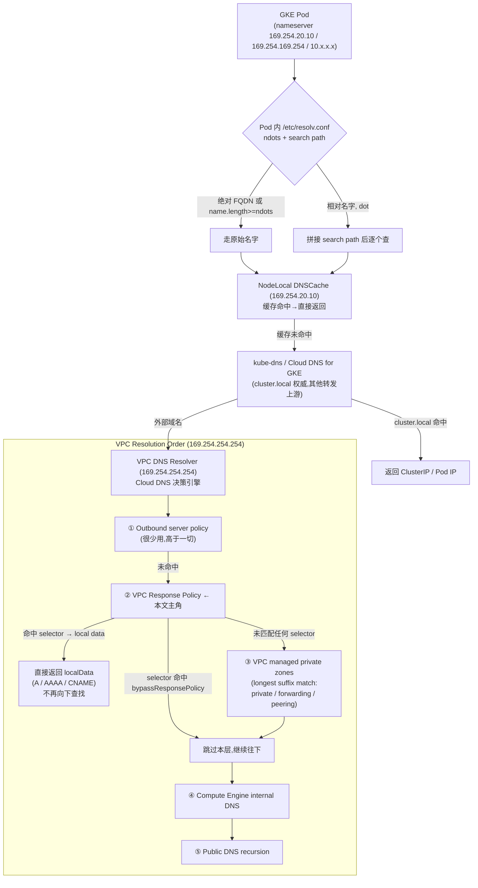
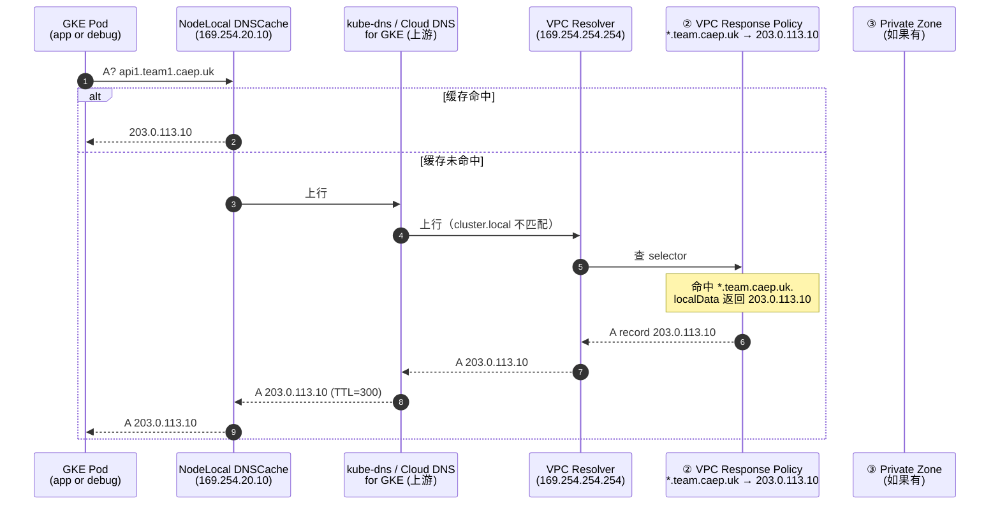
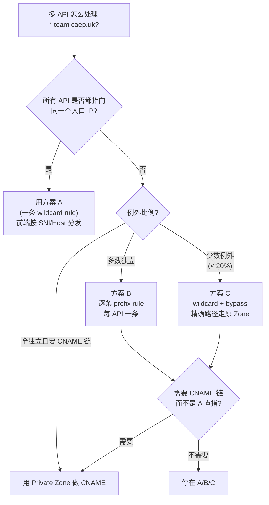
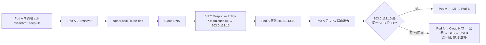

# GCP Cloud DNS Response Policy Explorer — Wildcard Override、Pod 出口与 API 入口分流

> **目标**：把 `*.team.caep.uk` 通过 Response Policy 范解析到一个固定 IP 时，从 GKE Pod 出发的整个解析链路是怎么走的；规则会拦截哪些查询、放行哪些查询；多 API（`api1.team1.caep.uk` / `api2.team.caep.uk`）共存时怎么用 prefix 选择最合适的方案；以及集群内部的 Pod-to-Pod 通信会不会被这条规则"误伤"。
>
> **结论先行**：Response Policy 是 Cloud DNS 里"**最高优先级**"的解析层 —— 它在所有 Private Zone、Forwarding Zone、DNS Peering、Default Recursion **之前**做匹配。`*` 通配规则会把 `*.team.caep.uk` 下所有未显式列出的子域名全部劫持到这条 local data；只有显式 `bypassResponsePolicy` 的子域名会"逃出去"，走后续的 Private Zone / Forwarding / 公网。Pod 内部 `*.team.caep.uk` 之间的互调（intra-cluster call）同样会命中这条规则，**除非**集群内部 DNS 走的是 K8s 的 `*.svc.cluster.local` 而不是这个外部域名。
>
> **适用环境**：GKE / GCE / Cloud Run；私有 VPC + Private DNS Zone；多团队共享 `*.team.caep.uk` 形式短域名。
>
> **存放路径**：`linux/dns/docs/gcp-cloud-dns-response-policy-explorer.md`

---

## 1. Response Policy 是什么 —— 一句话定义

> "A Response Policy is a collection of selectors that apply to queries made against one or more Virtual Private Cloud networks." — Google Cloud DNS REST API reference[^api-rp]

把 Response Policy 想象成 **Cloud DNS 内嵌的一个"防火墙 DNS 层"**：

| 维度 | 传统 Private Zone | Response Policy |
|---|---|---|
| 作用层级 | "权威记录库" — 提供 answer | "前置拦截器" — 命中后用本地 local data 直接返回 |
| 优先级 | 在 outbound server policy / response policy 之后匹配 | 在所有其它 Cloud DNS 资源之前匹配 |
| 命中行为 | 找不到记录就走下一层 / NXDOMAIN | 找到 selector 就直接返回 local data，**短路掉**后续所有层 |
| 通配支持 | Zone apex 下可以用 `*` 通配 | 单条 rule 的 `dnsName` 本身就是通配（`*.team.caep.uk.`）|
| 适用场景 | 真正的权威解析（hosted zone） | "我想让某子域名解析到一个固定 IP / CNAME，不用新建 Zone" |

**一句话**：Response Policy 是 Cloud DNS 给你"在不动 Zone 的前提下，把一批查询直接劫持到自己想要的答案"的开关。

---

## 2. 解析链路：从 GKE Pod 发出的查询会经过哪些层

把链路画出来，方便后面对照：



**关键事实**（来自 Google 官方 VPC name resolution order[^gke-dns-explorer-6]）：

- Response Policy 在 **所有 Private Zone / Forwarding Zone / DNS Peering 之前** 匹配。
- 同一个 VPC 里，**每个网络只能 attach 一个 Response Policy**（`You can only attach one response policy per network`，见 Manage Response Policies 文档[^manage-rp]）。
- Response Policy selector 支持 wildcard：`*.team.caep.uk.` 会匹配 `api1.team.caep.uk.`、`api2.team.caep.uk.`、`x.y.team.caep.uk.` 等所有子域名（参见 manage-rp 文档"the DNS name (wildcard or exact) to apply the rule to"[^manage-rp]）。
- 命中 wildcard 后是返回 local data 还是 passthru，按 rule 的 longest suffix 决定 —— 越具体的 selector 优先（与 Private Zone 的 longest suffix 语义一致）[^api-rpr]。

---

## 3. 核心 API 概念（写代码前先搞清楚）

### 3.1 两个 GCP 资源

| 资源 | 含义 | 关键字段 |
|---|---|---|
| `responsePolicies` | 一个挂在 VPC 上的容器 | `responsePolicyName`、`networks[]` (networkUrl 列表) |
| `responsePolicyRules` | 容器内的单条规则 | `ruleName`、`dnsName` (selector, 可通配) + `localData` 或 `behavior` |

数据形态（来自 Google REST API reference[^api-rp][^api-rpr]）：

```json
// ResponsePolicy (gcloud create 时传 networks + description)
{
  "responsePolicyName": "rp-wildcard-team-caep",
  "description": "Wildcard override for *.team.caep.uk",
  "networks": [
    { "networkUrl": "https://www.googleapis.com/compute/v1/projects/PROJECT/global/networks/team-vpc" }
  ]
}

// ResponsePolicyRule — selector + action
{
  "ruleName": "wildcard-team-caep",
  "dnsName": "*.team.caep.uk.",   // selector (wildcard)
  "localData": {
    "localDatas": [
      { "name": "*.team.caep.uk.", "type": "A",    "ttl": 300, "rrdatas": ["203.0.113.10"] },
      { "name": "*.team.caep.uk.", "type": "AAAA", "ttl": 300, "rrdatas": ["2600:1901:0:abcd::"] }
    ]
  }
}
```

### 3.2 两种 action — 必须二选一

| Action | 字段 | 含义 |
|---|---|---|
| **`localData`** | `localData.localDatas[]` (A/AAAA/CNAME 数组) | 命中 selector 后**直接返回**这些记录；"override any other DNS behavior for the matched name; in particular they override private zones, the public internet, and GCP internal DNS"[^api-rpr] |
| **`behavior`** | 当前**只有**一个值：`bypassResponsePolicy` | 命中后**跳过**本 RP，继续走下一层（用于 wildcard 下的白名单）[^api-rpr][^manage-rp] |

> 注意 `localData` 不允许 `SOA` 或 `NS` 记录（"No SOA nor NS types are allowed"[^api-rpr]）—— 这一点对"用 RP 接管 zone apex"是直接卡死。

### 3.3 Behavior 枚举的现状

> "Behavior enum: behaviorUnspecified, bypassResponsePolicy. Skip a less-specific Response Policy Rule and let the query logic continue. ... This functionality also facilitates allowlisting." — REST API reference[^api-rpr]

也就是说，今天**只有一个真正能用的 behavior**：bypassResponsePolicy。如果你在等"`redirectToInternalDNS`"或"`block`"（firewall-style 拒绝回答），目前**不存在**。要做"恶意域名 NXDOMAIN"必须绕路（见 §6.4）。

---

## 4. 案例：`*.team.caep.uk` 范解析到一个 IP 的全流程

### 4.1 用户场景

```
目标：
  *.team.caep.uk  →  203.0.113.10 （一个固定入口 IP，可以是 GLB / ILB / external LB）

域名层级：
  api1.team1.caep.uk   ← 用户实际请求
  api2.team.caep.uk     ← 用户实际请求
  ...
  即 "team" 是 zone 二级域; "team1" / "team2" 是子团队代号;
     "api1" / "api2" 是具体 API 名。

后端：
  203.0.113.10 = 某条 GLB 的静态 IP（公网 / 私网皆可，取决于 Route A / B 选择）
```

### 4.2 创建命令

```bash
# 1. 创建 Response Policy 容器，绑到目标 VPC
gcloud dns response-policies create rp-team-caep-wildcard \
  --networks=team-vpc \
  --description="Wildcard override for *.team.caep.uk"

# 2. 创建 wildcard rule — localData 写 A 记录
gcloud dns response-policies rules create wildcard-team-caep \
  --response-policy=rp-team-caep-wildcard \
  --dns-name='*.team.caep.uk.' \
  --local-data=name='*.team.caep.uk.',type='A',ttl=300,rrdatas='203.0.113.10'

# 如需 AAAA
gcloud dns response-policies rules update wildcard-team-caep \
  --response-policy=rp-team-caep-wildcard \
  --dns-name='*.team.caep.uk.' \
  --local-data=name='*.team.caep.uk.',type='AAAA',ttl=300,rrdatas='2600:1901:0:abcd::'
```

### 4.3 GKE Pod 内的解析路径（从 `dig` 看到的过程）

```bash
# 进入目标 Pod（任意业务 Pod 或 debug pod）
kubectl exec -it POD_NAME -- bash

# 在 Pod 里 dig 这两个名字
dig +short api1.team1.caep.uk
# → 203.0.113.10

dig +short api2.team.caep.uk
# → 203.0.113.10

# 看到完整链路
dig +trace api1.team1.caep.uk
```

完整过程拆解：



**关键点**：

- Pod 看到的 `203.0.113.10` 是从 Cloud DNS 直接拿到的，**不经过** GLB 上的路由逻辑 —— 如果 RP 给的是某个内部 ILB IP（如 `10.0.50.20`），Pod 拿到后**直接发包到 10.0.50.20**，因为同 VPC 的 Pod 可以路由到 ILB。
- 如果 Pod 和 RP 给的 IP **不在同一个 VPC**（例如 `203.0.113.10` 是另一个 VPC 的 ILB 或公网 IP），需要 Pod 出去的路由能到。Cloud DNS 本身**只负责名字解析**，**不负责** 流量能不能到。
- TTL=300 是 RP 的 local data 默认建议（见官方 use case 的例子"ttl=300"[^manage-rp]）。生产可以改短，灵活度比 Private Zone 强。

---

## 5. 多 API 场景的策略选择 — 五个常见方案对比

> 用户问的"api1.team1.caep.uk 和 api2.team.caep.uk 怎么处理"是核心问题。
> 这里要同时考虑：
> 1. 不同 API 是不是指向**同一个** 入口 IP（简化版）；
> 2. 不同 API 是不是要指向**不同**入口 IP（精细化）；
> 3. 集群内部 Pod 调 Pod 用的是什么域名。

### 5.1 五个方案 1-to-1 对比

| 方案 | 做法 | 优点 | 缺点 | 适合什么 |
|---|---|---|---|---|
| **A. 一条 wildcard rule** | `*.team.caep.uk → 203.0.113.10` (A) | 简单、1 条 rule | 全部 API 走同一个 IP（前端要按 SNI / Host 再分发） | 所有 API 共享同一个 GLB / 同一组后端 |
| **B. 多条 prefix rule** | `api1.team1.caep.uk → 1.2.3.4`<br/>`api2.team.caep.uk → 5.6.7.8` | 每个 API 精确指向不同 IP | 维护成本（每加一个 API 要多一条 rule） | API 入口独立，每个 API 自己的 GLB / ILB |
| **C. wildcard + bypass** | `*.team.caep.uk → 203.0.113.10`<br/>`api1.team1.caep.uk → bypassResponsePolicy` | 给少数例外开口子，让其走原 Private Zone | 例外多了还是回到逐条管理 | 大多数 API 共用入口，少数走原路 |
| **D. 直接用 Private Zone** | 创建 `team.caep.uk` Private Zone + 通配记录 | 仍是 Cloud DNS 原生；可与 forward / peering 协作 | 不能"插队"在更高优先级的层 | 不需要强制劫持，让 Private Zone 自然接管 |
| **E. ALIAS / CNAME 私有化** | `*.team.caep.uk → gateway.platform.example` Private Zone | 真正的 CNAME 解析链；TLS SNI / Host header 都跟 CNAME 走 | 要新建 Private Zone 并配记录 | 需要标准 CNAME 链的可观察性（`dig +trace` 清晰） |

### 5.2 方案 B 的完整命令模板

```bash
gcloud dns response-policies rules create api1-team1 \
  --response-policy=rp-team-caep-wildcard \
  --dns-name='api1.team1.caep.uk.' \
  --local-data=name='api1.team1.caep.uk.',type='A',ttl=300,rrdatas='1.2.3.4'

gcloud dns response-policies rules create api2-team \
  --response-policy=rp-team-caep-wildcard \
  --dns-name='api2.team.caep.uk.' \
  --local-data=name='api2.team.caep.uk.',type='A',ttl=300,rrdatas='5.6.7.8'
```

**关键事实**：selector 越长越优先（longest suffix match）[^api-rpr]。

也就是说，如果同时存在：

```
*.team.caep.uk.                → 203.0.113.10   (wildcard)
api1.team1.caep.uk.            → 1.2.3.4        (exact match)
```

则 `api1.team1.caep.uk` 命中 **exact match**（最长后缀），返回 `1.2.3.4`；其他 `*.team.caep.uk` 命中 wildcard，返回 `203.0.113.10`。

这就是 §5.1 方案 B 的实现机制 —— 不需要任何特殊配置，longest suffix 替你排好了优先级。

### 5.3 方案 C 的 bypass 模式（关键 use case）

如果某些子域名（比如 `internal-api.team1.caep.uk`）需要"绕过" wildcard 走 Private Zone 的真实解析：

```bash
# wildcard 全局劫持
gcloud dns response-policies rules create wildcard-team-caep \
  --response-policy=rp-team-caep-wildcard \
  --dns-name='*.team.caep.uk.' \
  --local-data=name='*.team.caep.uk.',type='A',ttl=300,rrdatas='203.0.113.10'

# 给 internal-api 开 bypass 通道
gcloud dns response-policies rules create bypass-internal-api \
  --response-policy=rp-team-caep-wildcard \
  --dns-name='internal-api.team1.caep.uk.' \
  --behavior=bypassResponsePolicy
```

效果：

| 查询 | 命中规则 | 结果 |
|---|---|---|
| `api1.team1.caep.uk` | wildcard（最长后缀是 `*.team.caep.uk.`） | `203.0.113.10` |
| `internal-api.team1.caep.uk` | bypass（exact match `internal-api.team1.caep.uk.` 比 wildcard 长） | 跳过本 RP，继续往下走 Private Zone / Forwarding / 公网 |

**对照官方原文**：

> "bypassResponsePolicy: Skip a less-specific Response Policy Rule and let the query logic continue. This mechanism, when used with wildcard selectors, lets you exempt specific subdomains from a broader Response Policy Rule and direct the queries to the public internet instead. ... if the following rules exist: `*.example.com` → LocalData 1.2.3.4; `foo.example.com` → Behavior 'passthrough'. A query for `foo.example.com` skips the wildcard rule. This functionality also facilitates allowlisting." — REST API reference[^api-rpr]

### 5.4 决策树（多 API 怎么选）



---

## 6. 集群内部 Pod-to-Pod 调用会怎样？—— 关键陷阱

> 这是用户最关心的点：**Pod 内部用 `api1.team1.caep.uk` 调另一个 Pod，会不会被 Response Policy 劫持？**

### 6.1 取决于 Pod 用什么域名做服务发现

| Pod 用什么域名 | RP 会不会拦截？ | 后果 |
|---|---|---|
| `api-svc.team1.caep.uk`（外部域名） | **会**。Pod 内 resolver 拿到的就是 RP 给的 IP `203.0.113.10` | Pod 把请求发到 203.0.113.10（走 VPC → 公网 / 另一 VPC → 再回来），绕一圈。**性能差、流量大、绕路**，且依赖 outbound 路径能通 |
| `api-svc.team-ns.svc.cluster.local`（K8s 原生 DNS） | **不会**。这是 `cluster.local` 后缀，kube-dns 在 cluster scope 就回答了，**根本不会走到** Cloud DNS / RP | Pod 直接拿到 ClusterIP，集群内直连，最短路径 |
| `api-svc.team-ns.svc.cluster.local.`（绝对 FQDN 加尾部点） | 同上，kube-dns 在 cluster scope 回答 | 同上 |

### 6.2 **推荐**：集群内部用 `*.svc.cluster.local`，不要复用 `*.team.caep.uk`

> 详见本目录 `external-internal-dns-separation.md` —— 这是一个**通用原则**：
> 外部域名和内部域名必须分离[^external-internal]。

具体到 Response Policy 场景：

- **外部 Client → API**：用 `api1.team1.caep.uk`（外部域名，命中 RP → GLB IP）
- **集群内 Pod A → Pod B**：用 `api-svc.team-ns.svc.cluster.local`（K8s 原生 DNS，kube-dns 在 cluster scope 直接回答，**完全不经过 RP**）

**这样设计的好处**：

1. Pod 内互调走最短路径（cluster IP 直连），不需要经过 GLB / nginx 绕一圈。
2. 即使 RP 给的 IP 是另一个 VPC 的 ILB 或公网 IP，集群内 Pod 也不会被这条路"骗出去"。
3. **RP 的 wildcard rule 不会"误伤" Pod 内部通信** —— 因为 Pod 内用的是 `cluster.local`，根本不经过 RP。

### 6.3 反面：如果坚持用 `*.team.caep.uk` 做 Pod 内服务发现

会出现的几个连锁问题：



**具体后果**：

1. **流量路径变长**：Pod → RP 给的 IP → （ILB 转发 / GLB 转发 / 公网 NAT 转发） → 真正的 Pod。延迟 +10ms ~ 数百 ms 都有可能。
2. **网络安全策略被绕过**：原以为"Pod 内互调"在 NetworkPolicy 限制下只有少数 Egress 被放行，现在 RP 让 Pod 全部 Egress 到 ILB / GLB IP，**等于打破 NetworkPolicy 的假设**。
3. **mTLS / 内部证书 SAN 失效**：Pod 内互调本来是 Mesh CA 签发 `*.svc.cluster.local` 证书；如果走外部域名 `*.team.caep.uk`，要么用公网证书、要么 SAN 不匹配。
4. **DNS 缓存一致性差**：RP TTL=300s 期间，Pod A 一直连老 IP；Pod B 滚动发布换了 ILB，Pod A 要等 300s 才会重新查询。
5. **调试难**：`kubectl logs` 看到的连接是 Pod A → `203.0.113.10`，但这是"自己的域名"被解析过去的，"出问题的环节"看不清。

### 6.4 如果一定要"在 Pod 内用 `*.team.caep.uk`，但不希望 RP 拦截"—— 用 bypass

```bash
# wildcard rule 全部劫持
gcloud dns response-policies rules create wildcard-team-caep \
  --response-policy=rp-team-caep-wildcard \
  --dns-name='*.team.caep.uk.' \
  --local-data=name='*.team.caep.uk.',type='A',ttl=300,rrdatas='203.0.113.10'

# 给集群内 Pod 调用的服务开 bypass
gcloud dns response-policies rules create bypass-internal-team1 \
  --response-policy=rp-team-caep-wildcard \
  --dns-name='internal.team1.caep.uk.' \
  --behavior=bypassResponsePolicy
```

但**这只是在 wildcard 之外**额外维护一条规则，业务上**不推荐** —— 应该直接用 `*.svc.cluster.local` 命名空间内的服务名（cluster scope）。

---

## 7. 与其它 Cloud DNS 资源的优先级关系

> 关键：很多 RP 的坑来自"以为它在某层结果在另一层"。下表是已核对的优先级顺序。

| 优先级 | Cloud DNS 决策层 | RP 命中的行为 | RP 不命中的行为 |
|---|---|---|---|
| ① | **Outbound server policy** | 转发到 outbound target（很少用） | 继续往下 |
| ② | **VPC Response Policy** | 命中 selector → 返回 localData；命中 bypass → 跳到 ③ | 继续往下 |
| ③ | **VPC managed private zones (longest suffix)** | Private / Forwarding / Peering zone 按最长后缀匹配 | 继续往下 |
| ④ | **Compute Engine internal DNS** | `*.internal` 后缀的 GCE 名字 | 继续往下 |
| ⑤ | **Public DNS recursion** | 走公网 | — |

**重点强调**：

- **RP > 一切 Zone 类资源**：即使 Private Zone 有 `api1.team1.caep.uk` 的 A 记录，RP 的 wildcard 仍然优先。引用 REST API reference 原话：
  > "These ResourceRecordSets override any other DNS behavior for the matched name; in particular they override private zones, the public internet, and GCP internal DNS."[^api-rpr]
- **RP 不能"放 fallback"**：不像 Private Zone 找不到可以 NXDOMAIN 然后下一层接管 —— RP 命中 localData 就**短路掉**，找不到就往下走。
- **每个 network 只能 attach 一个 RP**[^manage-rp]：意味着如果你有 10 个 use case 想劫持，只能塞到同一个 RP 里用 selector + longest suffix 区分。

---

## 8. 落地步骤（端到端）

### 8.1 准备阶段

```bash
# 1. 确认目标 VPC 存在
gcloud compute networks describe team-vpc --project=YOUR_PROJECT

# 2. 启用 Cloud DNS API（默认已启用）
gcloud services enable dns.googleapis.com --project=YOUR_PROJECT

# 3. IAM 权限 — 创建 RP 需要 dns.admin
gcloud projects add-iam-policy-binding YOUR_PROJECT \
  --member=user:OPERATOR@your.domain \
  --role=roles/dns.admin
```

### 8.2 创建 RP + rule

```bash
# 容器
gcloud dns response-policies create rp-team-caep-wildcard \
  --networks=team-vpc \
  --description="Wildcard *.team.caep.uk override"

# wildcard rule (A + AAAA 都给)
gcloud dns response-policies rules create wildcard-team-caep \
  --response-policy=rp-team-caep-wildcard \
  --dns-name='*.team.caep.uk.' \
  --local-data=name='*.team.caep.uk.',type='A',ttl=300,rrdatas='203.0.113.10'

gcloud dns response-policies rules update wildcard-team-caep \
  --response-policy=rp-team-caep-wildcard \
  --dns-name='*.team.caep.uk.' \
  --local-data=name='*.team.caep.uk.',type='A',ttl=300,rrdatas='203.0.113.10' \
  --local-data=name='*.team.caep.uk.',type='AAAA',ttl=300,rrdatas='2600:1901:0:abcd::'
```

### 8.3 验证（必须从 Pod 内做，不要只在工作站上测）

```bash
# 在 debug Pod 里测
kubectl run dns-debug --rm -it --image=ghcr.io/nicolaka/netshoot -- bash

# Pod 内:
# (1) Pod 内 resolver 是谁?
cat /etc/resolv.conf

# (2) Wildcard 命中
dig +short api1.team1.caep.uk
# → 应该看到 203.0.113.10

dig +short api2.team.caep.uk
# → 应该看到 203.0.113.10

# (3) 完整路径 + 命中哪一层
dig +trace api1.team1.caep.uk

# (4) AAAA 验证
dig +short AAAA api1.team1.caep.uk
# → 应该看到 2600:1901:0:abcd::

# (5) cluster.local 不受影响（关键反例）
dig +short kubernetes.default.svc.cluster.local
# → ClusterIP（kube-dns 权威, RP 完全不参与）

# (6) bypass 验证（如果有的话）
dig +short internal-api.team1.caep.uk
# → 如果内部 bypass 配了, 应该看到 Private Zone 里的真实 IP / ClusterIP,
#   而不是 wildcard 给的 203.0.113.10
```

### 8.4 用 Cloud Logging 看实际命中

```bash
# Cloud DNS 默认不开 query logging, 验证前先开:
gcloud dns policies create dns-query-log-policy \
  --networks=team-vpc \
  --enable-logging

# 看最近的查询（如果开了 logging）
gcloud logging read 'jsonPayload.resource.type="dns_query" AND jsonPayload.queryName:"team.caep.uk"' \
  --limit=20 \
  --project=YOUR_PROJECT \
  --format=json

# 看命中的是哪一层（response policy / private zone / forwarding / peering）
gcloud logging read 'jsonPayload.resource.type="dns_query" AND jsonPayload.queryName="api1.team1.caep.uk"' \
  --limit=5 \
  --project=YOUR_PROJECT \
  --format='json(jsonPayload.responsePolicy, jsonPayload.privateZone, jsonPayload.queryName, jsonPayload.sourceNetwork)'
```

### 8.5 删除 / 修改

```bash
# 列出现有 RP 和 rules
gcloud dns response-policies list
gcloud dns response-policies rules list rp-team-caep-wildcard

# 改 rule（用 update 而不是 delete + create,保留 ruleName 不变）
gcloud dns response-policies rules update wildcard-team-caep \
  --response-policy=rp-team-caep-wildcard \
  --dns-name='*.team.caep.uk.' \
  --local-data=name='*.team.caep.uk.',type='A',ttl=300,rrdatas='203.0.113.20'

# 删除 rule
gcloud dns response-policies rules delete wildcard-team-caep \
  --response-policy=rp-team-caep-wildcard

# 删 RP（必须先删所有 rules 才能删 RP）
gcloud dns response-policies delete rp-team-caep-wildcard
```

> "Note: You cannot delete a response policy that is associated with a network or response policy rule. You must first remove the network from the policy or delete the rule before deleting the policy." — Manage Response Policies[^manage-rp]

---

## 9. 验证 checklist（部署后必须跑过这 5 条）

| # | 测试 | 命令 | 期望 |
|---|---|---|---|
| 1 | Pod 内 wildcard 命中 | `dig +short api1.team1.caep.uk` | 返回 RP 给的 IP |
| 2 | Pod 内 cluster.local 不受影响 | `dig +short kubernetes.default.svc.cluster.local` | 返回 ClusterIP |
| 3 | AAAA 也命中 | `dig +short AAAA api1.team1.caep.uk` | 返回 AAAA IP |
| 4 | Pod 内不同子域名都命中 | `dig +short foo.bar.team1.caep.uk` | 返回 wildcard 给的 IP |
| 5 | bypass 规则生效（如果有） | `dig +short internal-api.team1.caep.uk` | 不返回 wildcard IP，而是 Private Zone 真实记录 |

**额外建议**：

- **从同一 VPC 内的 GCE VM 也跑一遍 dig**，确认 RP 对所有 workload 类型生效（不只 GKE Pod）。
- **从 VPC 外的客户端**（如本地笔记本 `dig @169.254.254.254 api1.team1.caep.uk`，但要先有 VPN / IAP 隧道到 VPC）确认 RPC 链路。
- **Pod 出 Pod 的实际 TCP 连通性**：`kubectl exec ... curl -v http://203.0.113.10/healthz`，确认不仅名字解析对，**路由也通**。这是另一个独立的网络层验证。

---

## 10. 常见误区（FAQ）

### Q1: RP 是不是 "DNS Firewall"？

**答**：不是。**只能 hijack 到一个 IP / CNAME**，不能做"拒绝回答 / NXDOMAIN / Sinkhole"。今天 Behavior 只有 `bypassResponsePolicy` 一个值[^api-rpr]。要做"恶意域名 NXDOMAIN"必须把 wildcard → `127.0.0.1` 或 `0.0.0.0`，但这是"返回 IP 让 client 拒绝连接"而不是"在 DNS 层 NXDOMAIN"。

### Q2: RP 是不是比 Private Zone 更好？

**答**：**不一定**。两者用途不同：

| 维度 | RP | Private Zone |
|---|---|---|
| 适合 | "我要劫持一个域名到一个 IP" | "我要 host 一套完整 zone 解析" |
| 记录类型 | A / AAAA / CNAME[^api-rpr] | A / AAAA / CNAME / MX / TXT / NS / SOA / SRV ... |
| 是否允许 NS / SOA | **不允许**[^api-rpr] | 允许 |
| 是否可转发 | 不能（必须自己回答） | 可以做 Forwarding Zone |
| 跨 project 复用 | **不能** attach 到多个 project | 可以通过 DNS Peering 跨 project / VPC |
| 配额 | 100 RP per project（具体看文档最新值） | 类似 |

**简单原则**：只是劫持 → 用 RP；host 完整 zone → 用 Private Zone。

### Q3: RP rule 能不能用 CNAME？

**答**：**可以**。`localData` 接受 CNAME 记录[^api-rpr]。语法：

```bash
gcloud dns response-policies rules create wildcard-team-caep-cname \
  --response-policy=rp-team-caep-wildcard \
  --dns-name='*.team.caep.uk.' \
  --local-data=name='*.team.caep.uk.',type='CNAME',ttl=300,rrdatas='gateway.platform.example.'
```

但**注意**：CNAME 在 wildcard 上常被 dig 行为影响（CNAME 后面通常要再追 A 查询），如果 Pod 内 resolver 不再追，会拿不到 A 记录。生产推荐直接写 A / AAAA，更可控。

### Q4: 我能不能"先 RP，再 Private Zone"？

**答**：**不能**。RP 在所有 Zone 类资源**之前**匹配[^api-rpr]。一旦 RP 的 selector 命中 + localData 返回，Pod 拿到的就是 RP 的答案，**不会**再去看 Zone。

如果想要"优先 Zone，Zone 找不到再用 RP 给的 fallback IP"，**只能把 fallback 直接配在 Zone 里**（用 NXDOMAIN + 通配的最后 fallback），或者**用 wildcard 在 Zone 里 + RP bypass**（见 §5.3 反向）。

### Q5: RP 改了 IP，Pod 多快看到？

**答**：TTL=300s（默认）的话，**最长 300s 后**所有 Pod 内 NodeLocal / 应用层缓存才会过期重查。生产建议：

- **关键切换**（如 GLB IP 大变更）：先调 TTL 到 60s 或更低，再切换，再调回。
- **不要**依赖"立即生效" —— NodeLocal 默认 30s TTL，应用层（Java `networkaddress.cache.ttl` 默认永远不过期）可能更慢。

### Q6: RP 能 attach 到 Shared VPC 吗？

**答**：**可以**，但 RP 必须**在 host project 创建**，然后 attach 到 host VPC。这与 Private Zone 在 Shared VPC 下的规则相同（RP 出现在 Manage Response Policies 的"Permissions required"里：`dns.networks.bindDNSResponsePolicy`，是网络级 IAM）[^manage-rp][^dns-overview]。

### Q7: RP 命中后, 是哪个组件返回的?

**答**：**VPC DNS Resolver (`169.254.254.254`) 在做决定**。Pod 内 resolver (NodeLocal / kube-dns) 只是把查询转到 VPC resolver；VPC resolver 内部按"outbound server policy → VPC response policy → managed private zones → GCE internal DNS → 公网递归"逐层匹配。NodeLocal 缓存命中直接返回，但**首次 miss 时是 VPC resolver 在做决定**[^gke-dns-explorer-6]。

---

## 11. 推荐方案（基于用户场景）

> 用户场景：
> - `*.team.caep.uk` 范解析到一个固定 IP
> - 集群里有 `api1.team1.caep.uk` 和 `api2.team.caep.uk` 等多个 API
> - 集群内部有 Pod-to-Pod 调用

### 11.1 推荐：**方案 B 简化版 + 内部用 cluster.local**

具体做法：

1. **方案 A 起步**：所有 `*.team.caep.uk` → 同一个 GLB（`203.0.113.10`），1 条 wildcard rule。GLB 上按 SNI / Host header 分发到不同 backend。
2. **如果某个 API 入口独立**：用方案 B 加 1 条 exact match rule，longest suffix 自动覆盖 wildcard。
3. **集群内部 Pod 互调用 `api-svc.team-ns.svc.cluster.local`**，不碰 `*.team.caep.uk`。

```bash
# 步骤 1: 1 条 wildcard（覆盖所有 API, 同一入口）
gcloud dns response-policies create rp-team-caep-wildcard \
  --networks=team-vpc \
  --description="*.team.caep.uk → GLB 203.0.113.10"

gcloud dns response-policies rules create wildcard-team-caep \
  --response-policy=rp-team-caep-wildcard \
  --dns-name='*.team.caep.uk.' \
  --local-data=name='*.team.caep.uk.',type='A',ttl=300,rrdatas='203.0.113.10'

# 步骤 2（可选）: 某个 API 入口独立时, 加 exact match
gcloud dns response-policies rules create special-api3 \
  --response-policy=rp-team-caep-wildcard \
  --dns-name='api3.team2.caep.uk.' \
  --local-data=name='api3.team2.caep.uk.',type='A',ttl=300,rrdatas='198.51.100.7'
# longest suffix 自动让 api3.team2.caep.uk 命中 exact match, 不再走 wildcard
```

### 11.2 不推荐：

- ❌ 用 RP 做"恶意域名 NXDOMAIN"（无法实现，参见 §10 Q1）
- ❌ Pod 内复用 `*.team.caep.uk`（参见 §6.3，应该用 `*.svc.cluster.local`）
- ❌ 把 wildcard TTL 设成 86400+（变更太慢，参见 §10 Q5）
- ❌ 多个 project 都建相同的 RP（应该用 1 个 RP attach 多个 VPC，或用 Private Zone 跨 project 共享，参见 §10 Q6）

---

## 12. 与本目录其它文档的关系

| 文档 | 关系 |
|---|---|
| `gcp-dns-explorer-gpt5-6.md` | 详细描述 Cloud DNS Name Resolution Order，RP 在第 ② 位（仅次于 outbound server policy） |
| `gke-dns-resolution-flow.md` | Pod 内 resolver 链路（NodeLocal / kube-dns / Cloud DNS for GKE）—— RP 在 Pod resolver 上游的 VPC resolver 内做决定 |
| `three-layer-domain-architecture.md` | 三层域名体系（L1 外部 / L2 内部 / L3 cluster.local）—— 本文 RP 的应用建议完全遵循此架构 |
| `external-internal-dns-separation.md` | 外部域名与内部域名分离原则 —— §6 直接引用此原则 |
| `apply-cname.md` | CNAME 的工作原理 + TLS SNI / Host header 行为 —— 影响 §10 Q3 中 CNAME 选择的判断 |
| `dns-peerning.md` / `gcp-dns-forwarding.md` | DNS Peering / Forwarding Zone 的细节 —— 对照 §7 RP 与它们的优先级 |

---

## 13. 权威证据 / 来源

本文事实点全部来自以下 Google Cloud DNS 官方文档与 API reference。括号内的引用编号贯穿全文。

[^manage-rp]: **"Manage response policies and rules"** — Google Cloud DNS 官方文档
<https://cloud.google.com/dns/docs/zones/manage-response-policies>
关键原文: "Cloud DNS private zones let you create response policies that can modify resolver behavior based on response policy rules. However, you can only attach one response policy per network."；"Each response policy rule can alter results for the selected query names (including wildcards) by providing specific resource records"；"trigger passthru behavior that bypasses the response policy and exempts names that would otherwise match"；"Note: You cannot delete a response policy that is associated with a network or response policy rule."。
最后访问：2026-08-20。

[^api-rp]: **"REST Resource: responsePolicies"** — Google Cloud DNS REST API Reference
<https://cloud.google.com/dns/docs/reference/rest/v1/responsePolicies>
关键原文: "A Response Policy is a collection of selectors that apply to queries made against one or more Virtual Private Cloud networks."；"responsePolicies.list of network names specifying networks to which this policy is applied."；"The list of Google Kubernetes Engine clusters to which this response policy is applied."。
最后访问：2026-08-20。

[^api-rpr]: **"REST Resource: responsePolicyRules"** — Google Cloud DNS REST API Reference
<https://cloud.google.com/dns/docs/reference/rest/v1/responsePolicyRules>
关键原文: "A Response Policy Rule is a selector that applies its behavior to queries that match the selector. Selectors are DNS names, which may be wildcards or exact matches. Each DNS query subject to a Response Policy matches at most one ResponsePolicyRule, as identified by the dnsName field with the longest matching suffix."；"These ResourceRecordSets override any other DNS behavior for the matched name; in particular they override private zones, the public internet, and GCP internal DNS. No SOA nor NS types are allowed."；"Behavior: bypassResponsePolicy — Skip a less-specific Response Policy Rule and let the query logic continue. ... if the following rules exist: `*.example.com` -> LocalData 1.2.3.4; `foo.example.com` -> Behavior 'passthrough'. A query for `foo.example.com` skips the wildcard rule. This functionality also facilitates allowlisting."。
最后访问：2026-08-20。

[^gke-dns-explorer-6]: **"GCP DNS Explorer — GKE / Cloud DNS 路径校正版"** (`gcp-dns-explorer-gpt5-6.md`)
`/Users/lex/git/knowledge/linux/dns/docs/gcp-dns-explorer-gpt5-6.md`
关键原文: "官方 VPC resolution order 是：outbound server policy → VPC response policy → 最长后缀匹配的 managed private zones, 其中 private / forwarding / peering 都在这一步按最具体后缀命中；再到 Compute Engine internal DNS 和公网。GKE 节点还会先匹配 cluster-scoped response policy / cluster-scoped private zone."。
最后访问：2026-08-20。

[^external-internal]: **"GKE DNS 架构设计指南：外部域名与内部域名分离原则"** (`external-internal-dns-separation.md`)
`/Users/lex/git/knowledge/linux/dns/docs/external-internal-dns-separation.md`
关键原文: "外部域名与内部域名必须分离，不能用同一套域名从头管到尾"；"如果尝试用 `*.team.appdev.aibang` 同时服务外部入口和内部 Pod 间通信，会触发 DNS 语义冲突"。
最后访问：2026-08-20。

[^dns-overview]: **"Cloud DNS overview"** — Google Cloud DNS 官方文档
<https://cloud.google.com/dns/docs/overview>
关键原文: "To use a Cloud DNS managed private zone, Cloud DNS forwarding zone, or Cloud DNS peering zone with Shared VPC, you must create the zone in the host project, and then add one or more Shared VPC networks to the list of authorized networks for that zone."
最后访问：2026-08-20。

---

## 14. 未验证假设（部署前需要确认）

| # | 假设 | 验证方式 |
|---|---|---|
| 1 | 用户 `team-vpc` 网络**确实存在且已配置** GKE 集群。 | `gcloud compute networks describe team-vpc` |
| 2 | 用户打算给 `203.0.113.10` 这个 IP 是**真实可达的 GLB/ILB**（不是占位符）。 | 实际部署时替换为真实 IP；本文用 `203.0.113.10` / `198.51.100.7` 是 RFC 5737 文档段 |
| 3 | 集群内 Pod 互调**目前确实是用 `*.svc.cluster.local`**，不会因为引入 RP 而被迫改域名。 | 检查 `Deployment.spec.template.spec.dnsConfig` 和应用代码 / SDK 配置 |
| 4 | 用户没有现有 RP 绑定到 `team-vpc`（每个 VPC 只能有 1 个 RP，参见 §10 Q6）。 | `gcloud dns response-policies list` |
| 5 | 用户**接受**集群内 Pod 调用 `*.team.caep.uk` 会被 RP 劫持（如果现有代码有复用外部域名做服务发现），并有 fallback 计划。 | 代码层 review |
| 6 | TTL=300s 满足用户期望的故障切换时间。如更快需要降到 60s 或更低。 | 业务侧确认 |
| 7 | 不需要 CNAME 链（如果需要 → 改用 Private Zone 而不是 RP，参见 §10 Q3）。 | 业务侧确认 |