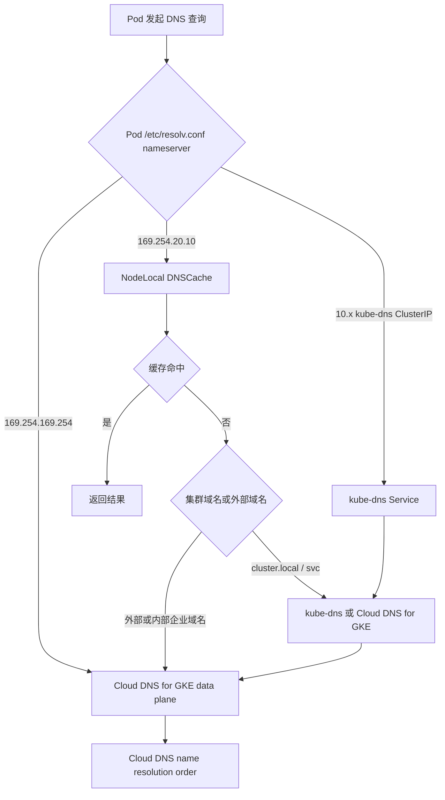
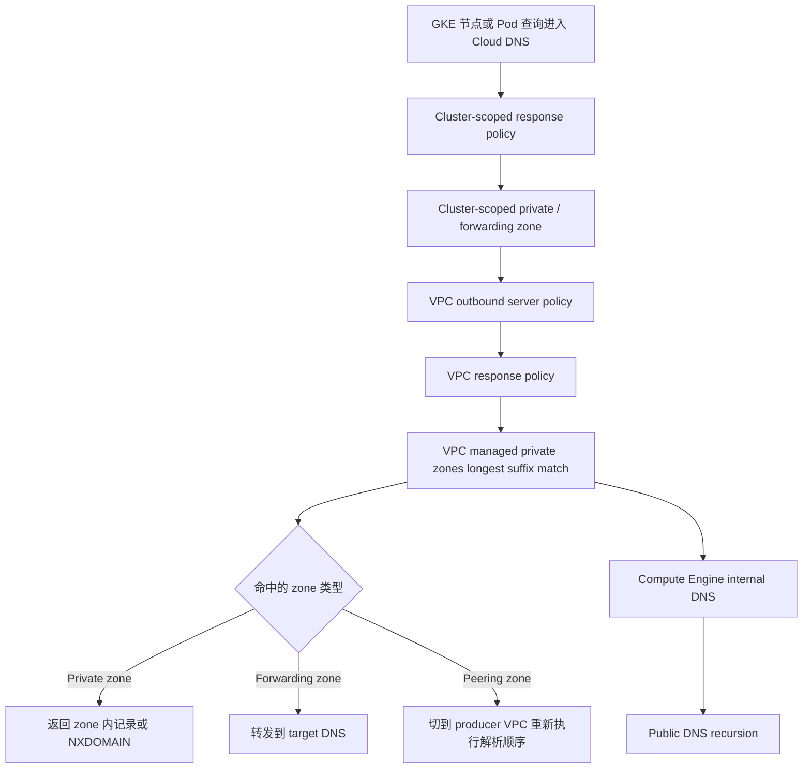
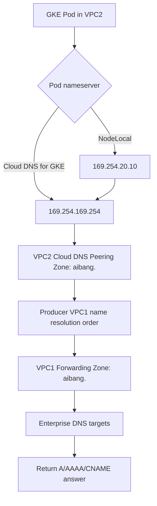
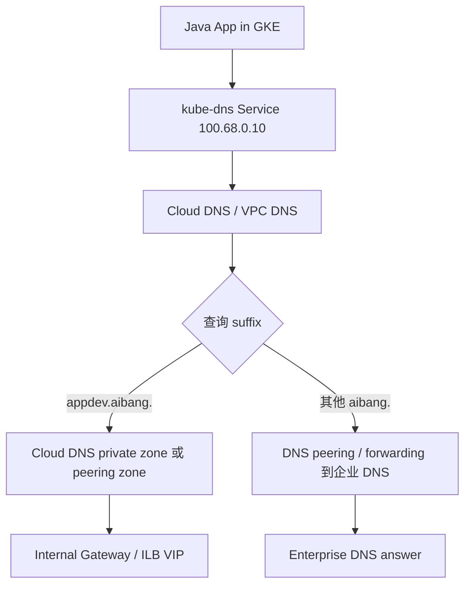
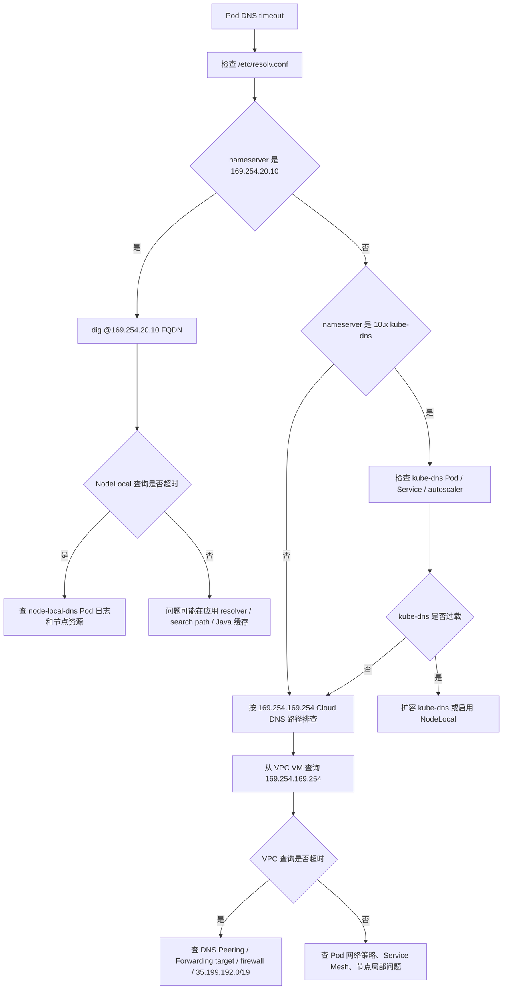

# GCP DNS Explorer — GKE / Cloud DNS 路径校正版

> 目标：基于现有 `gcp-dns-explorer.md` 的探索目标，重新确认 GKE Pod 到 Cloud DNS、DNS Peering、Forwarding Zone、NodeLocal DNSCache、Java DNS 缓存和 `ndots` 行为，形成一个更适合生产排查和落地验证的版本。
>
> 结论先行：原文的方向是对的，但有几处需要修正，尤其是 `169.254.254.254`、`ndots` 计数、DNS Peering 与 Forwarding Zone 的关系、Forwarding Target 回包源地址，以及 GKE Standard / Autopilot / Cloud DNS for GKE 的默认差异。

---

## 1. 本文适用范围

### 1.1 假设环境

| 项目 | 假设 |
|---|---|
| Workload | Java 应用运行在 GKE Pod 中 |
| DNS 目标 | 既包括 Kubernetes Service，也包括公司内部域名，例如 `aibang.` |
| 网络形态 | VPC2 运行 GKE；VPC1 或公司网络承载内部 DNS 能力 |
| Cloud DNS 能力 | 可能存在 DNS Peering、Forwarding Zone、Response Policy |
| 排查目标 | 解释 `*.cluster.local` 异常查询、DNS 超时、Java DNS 请求行为和内部域名解析路径 |

### 1.2 需要先确认的事实

不要先假设 Pod 一定使用 `169.254.20.10`、`169.254.169.254` 或 kube-dns ClusterIP。先从 Pod 里确认：

```bash
kubectl exec -it POD_NAME -- cat /etc/resolv.conf
```

常见结果：

| Pod nameserver | 含义 | 常见场景 |
|---|---|---|
| `169.254.20.10` | NodeLocal DNSCache | Autopilot 默认；Standard 1.34.1-gke.3720000+ 默认启用，或手动启用 |
| `169.254.169.254` | 节点本地 metadata server 上的 Cloud DNS data plane | Standard 使用 Cloud DNS for GKE，且没有通过 NodeLocal 作为第一跳 |
| `10.x.y.10` 或类似 ClusterIP | kube-dns Service | Standard 默认 kube-dns，或 Cloud DNS for GKE 未作为 Pod DNS 第一跳 |

> 生产排查中不要把 `169.254.254.254` 当作 GKE 官方验证入口。Google 文档对 Cloud DNS for GKE 的验证路径使用 `169.254.169.254`，NodeLocal 使用 `169.254.20.10`。

---

## 2. 对原文的正确性校正

| 原文点 | 判断 | 修正建议 |
|---|---|---|
| “GKE 1.36+ 全面使用 CoreDNS，并默认启用 NodeLocal DNSCache” | 不够准确 | GKE 1.36+ 的 kube-dns 底层实现变为 CoreDNS；Autopilot 默认 Cloud DNS；Standard 默认 DNS provider 仍需要区分 kube-dns 与 Cloud DNS for GKE。NodeLocal 在 Autopilot 默认启用，Standard 从 `1.34.1-gke.3720000` 起默认启用。 |
| “GKE 使用 Cloud DNS 169.254.254.254” | 需要修正 | Cloud DNS for GKE 文档示例中，Standard Pod nameserver 是 `169.254.169.254`；Autopilot 因 NodeLocal 是 `169.254.20.10`。 |
| `api.aliyun.cloud.region.aibang` 有 5 个 dots | 错误 | 这个名字有 4 个 dots。默认 `ndots:5` 会先追加 search path，再查询原始名字。 |
| `ndots` 值变大对短域名不利，会减少 search 追加 | 错误 | `ndots` 越大，越容易触发 search path；`ndots` 越小，越容易先查原始名字。 |
| `aibang.cluster.local` 只有 `ndots>=6` 才会出现 | 错误 | 对 4-dot 名字，默认 `ndots:5` 就会触发 search path。 |
| Cloud DNS 决策顺序写成 Response Policy -> DNS Peering -> Forwarding Zone -> Private Zone | 不准确 | 官方 VPC resolution order 是：outbound server policy -> VPC response policy -> 最长后缀匹配的 managed private zones，其中 private / forwarding / peering 都在这一步按最具体后缀命中；再到 Compute Engine internal DNS 和公网。GKE 节点还会先匹配 cluster-scoped response policy / private zone。 |
| “DNS Peering 依赖 VPC Network Peering” | 不准确 | Cloud DNS Peering 与 VPC Network Peering 是不同能力；DNS Peering 是单向关系，不要求 VPC Network Peering 存在。 |
| Forwarding target 防火墙允许 `169.254.0.0/16` | 错误 | Cloud DNS forwarding 到 Type 1 / Type 2 target 的源地址范围是 `35.199.192.0/19`，目标 DNS 和防火墙需要允许 TCP/UDP 53 来自该范围。 |
| 直接编辑 CoreDNS Corefile 优化 GKE DNS | 需要谨慎 | Standard kube-dns 可以通过 GKE 支持的 ConfigMap 字段做 stubDomains / upstreamNameservers；直接套通用 CoreDNS Corefile 不一定适用于 GKE 管理组件。Cloud DNS for GKE 场景也不应该以改 CoreDNS 作为主路径。 |

---

## 3. 推荐的生产级 DNS 心智模型

### 3.1 先区分三种 GKE DNS 模式



### 3.2 Cloud DNS for GKE 与 kube-dns 的差异

| 维度 | kube-dns | Cloud DNS for GKE |
|---|---|---|
| 默认适用 | Standard 默认 DNS provider | Autopilot 默认；Standard 可切换 |
| Pod 第一跳 | kube-dns ClusterIP，或 NodeLocal | `169.254.169.254`，或 NodeLocal |
| Service 记录 | 集群内组件维护 | Cloud DNS controller 同步到 Cloud DNS managed zone |
| 扩容关注点 | kube-dns 副本、autoscaler、NodeLocal | Cloud DNS 管理面和节点本地 data plane，通常无需手动扩 DNS server |
| 跨 VPC / VPC 内可见性 | 对 headless service 跨 VPC 有限制 | 支持 cluster scope、additive VPC scope、VPC scope，需要按创建时或功能限制选择 |

---

## 4. 正确的 Cloud DNS Name Resolution Order

对 GKE 节点，Cloud DNS 处理顺序可以简化为：



关键点：

- Cloud DNS 使用 longest suffix matching，不是简单的“Peering 永远优先于 Forwarding”。
- 在同一个 VPC resolution order 中，private zone、forwarding zone、peering zone 都属于 VPC-scoped managed private zones 的匹配阶段。
- 如果存在 outbound server policy，它会在 VPC response policy 和 VPC managed private zones 之前接管查询，这一点很容易被忽略。
- GKE Cloud DNS cluster scope 会先看 cluster-scoped response policy 和 cluster-scoped private zone，再进入 VPC order。

---

## 5. `aibang.` 内部域名的推荐架构

### 5.1 推荐路径：VPC2 Peering Zone -> VPC1 Forwarding Zone -> 企业 DNS

适用于：GKE 所在 VPC2 不能直接通过 Cloud DNS forwarding 访问企业 DNS，或者企业 DNS 的 forwarding target 位于 VPC1 / on-prem，并希望 VPC1 作为 DNS producer。



这一链路的优点：

- VPC2 不需要直接承载企业 DNS forwarding target。
- VPC1 可以集中管理 `aibang.` 的 forwarding target、日志和策略。
- DNS Peering 是 Cloud DNS 原生能力，不等同于也不强依赖 VPC Network Peering。

### 5.2 什么时候直接在 VPC2 建 Forwarding Zone

只有当以下条件都满足时才建议直接在 VPC2 创建 forwarding zone：

- 企业 DNS target 对 VPC2 可达。
- 返回路径和防火墙允许 `35.199.192.0/19` 到 target 的 TCP/UDP 53。
- 不依赖经由第三个 VPC 的传递路由。
- 多个 target 或前置内部 passthrough Network Load Balancer 已经设计好 HA。

---

## 6. `ndots` 与 `aibang.cluster.local` 的真实原因

### 6.1 精确结论：普通点数 vs 尾部根点

`api.aliyun.cloud.region.aibang` 和 `api.aliyun.cloud.region.aibang.` 不能只按“肉眼看到几个点”来判断 `ndots` 行为。

| 写法 | 字符串里看到的点 | DNS 语义 | `ndots:5` 下的 resolver 行为 |
|---|---:|---|---|
| `api.aliyun.cloud.region.aibang` | 4 | 相对名字，未显式声明 root | 4 `<` 5，先追加 search path，再尝试原始名字 |
| `api.aliyun.cloud.region.aibang.` | 5 | 绝对 FQDN，最后的 `.` 是 root label | 直接按绝对名字查询，通常不追加 search path |

所以：

- 如果不带尾部点，`api.aliyun.cloud.region.aibang` 只有 4 个普通分隔点，默认 `ndots:5` 会触发 search path。
- 如果带尾部点，`api.aliyun.cloud.region.aibang.` 字符串里确实有 5 个点，但最后一个点不是普通 label 分隔点，而是 root label 的显式表示。它的效果不是“因为满足 5 个 dots 所以先查原始名字”，而是“这是绝对 FQDN，所以跳过 search path”。
- 生产建议依然是：企业内部域名、外部域名、跨 VPC 域名优先使用尾部点 FQDN，例如 `service-a.internal.aibang.`。

### 6.2 点数计算示例

不带尾部点时，域名 `api.aliyun.cloud.region.aibang` 的普通分隔点是 4 个：

```text
api.aliyun.cloud.region.aibang
   1      2     3      4
```

带尾部点时：

```text
api.aliyun.cloud.region.aibang.
   1      2     3      4     root
```

这里的 `root` 点用于告诉 resolver：这个名字已经到 DNS root，不要再按 `/etc/resolv.conf` 的 search list 扩展。

Kubernetes 常见默认配置：

```text
options ndots:5
search <namespace>.svc.cluster.local svc.cluster.local cluster.local c.PROJECT_ID.internal google.internal
```

规则：

- 查询名的点数 `< ndots`：先追加 search path，再查询原始名字。
- 查询名的点数 `>= ndots`：先查询原始名字，再按 resolver 行为决定是否继续 search。
- 查询名以尾部点结尾：作为绝对 FQDN，通常不会追加 search path；这是比 `ndots` 更直接的表达。

### 6.3 对 `api.aliyun.cloud.region.aibang` 的影响

| 场景 | 查询名 | 普通分隔点 | `ndots` 配置 | resolver 首次查询 | 结果 |
|---|---|---:|---|---|---|
| 当前默认写法 | `api.aliyun.cloud.region.aibang` | 4 | `ndots:5` | 先追加 search path | 会先出现 `api.aliyun.cloud.region.aibang.<search-suffix>`，最后才查原始名字 |
| 推荐 DNS 查询写法 | `api.aliyun.cloud.region.aibang.` | 4 + root 点 | 任意 | 直接查绝对 FQDN | 不走 search path，最适合排查和底层 DNS lookup |
| 对比场景：局部改 Pod 配置 | `api.aliyun.cloud.region.aibang` | 4 | `ndots:4` | 先查原始名字 | 只有在显式把该 Pod 的 `ndots` 改成 4 或更低时才成立 |

第三行不是另一种域名写法，而是同一个相对名字在不同 Pod `ndots` 配置下的行为对比。你的实际 Pod 是 `ndots:5`，所以第一行才是当前真实行为。

### 6.4 为什么会看到 `aibang.cluster.local`

如果应用、JVM、HTTP client 或日志聚合把完整域名截断、规整或只展示 suffix，就可能看到类似：

```text
aibang.cluster.local
api.aliyun.cloud.region.aibang.cluster.local
api.aliyun.cloud.region.aibang.default.svc.cluster.local
```

这不是 Cloud DNS Peering 本身产生的，而是 Pod resolver 根据 search path 构造出来的查询。

生产建议：

```text
企业内部域名、外部域名、跨 VPC 域名：使用尾部点 FQDN，例如 service-a.internal.aibang.
Kubernetes Service 短名：保留默认 search path，例如 my-svc 或 my-svc.my-ns
不要全局随意把 ndots 改成 1，除非已评估所有服务发现路径。
```

---

## 7. 平台短域名入口的最佳实践

### 7.1 你的真实 Pod DNS 配置

你提供的 Pod `/etc/resolv.conf` 是：

```text
search my-namespace.svc.cluster.local svc.cluster.local cluster.local us-east4-a.c.aibang-projectid-devcn-dev.internal c.aibang-projectid-devcn-dev.internal google.internal
nameserver 100.68.0.10
options ndots:5
```

这个配置说明：

| 字段 | 含义 | 对平台短域名的影响 |
|---|---|---|
| `nameserver 100.68.0.10` | Pod 第一跳是集群 DNS Service，通常是 kube-dns/CoreDNS 的 ClusterIP | 查询先进入 kube-dns，再由 kube-dns 或上游进入 Cloud DNS / VPC DNS |
| `search my-namespace.svc.cluster.local ... google.internal` | resolver 会把相对名字和这些 suffix 逐个拼接 | 未带尾部点的企业域名会被放大成多次查询 |
| `options ndots:5` | 少于 5 个普通分隔点的名字，先走 search list | `api1.teamname1.appdev.aibang` 和 `api.aliyun.cloud.region.aibang` 都会先被追加 search path |

这里的 `100.68.0.10` 看起来更像 kube-dns Service IP，而不是 NodeLocal DNSCache。也就是说，当前环境里的 DNS 压力会先打到集群 DNS，再转发到 Cloud DNS 或上游。

### 7.2 为什么 Pod 默认会有这些层级

这不是 GCP 特有的“外部 DNS 改写”，而是 Kubernetes `ClusterFirst` DNS 策略和节点 DNS 配置合并后的结果。

| search suffix | 来源 | 作用 |
|---|---|---|
| `my-namespace.svc.cluster.local` | Kubernetes namespace service scope | 让 Pod 可以用短名访问同 namespace Service，例如 `orders` -> `orders.my-namespace.svc.cluster.local` |
| `svc.cluster.local` | Kubernetes service scope | 让 Pod 可以用 `service.namespace` 访问 Service，例如 `orders.prod` -> `orders.prod.svc.cluster.local` |
| `cluster.local` | Kubernetes cluster domain | 支撑集群内完整 service 域名层级 |
| `us-east4-a.c.aibang-projectid-devcn-dev.internal` | GCE zonal internal DNS suffix | 让 workload 能解析同 zone 内 GCE 内部名字 |
| `c.aibang-projectid-devcn-dev.internal` | GCE project internal DNS suffix | 让 workload 能解析同 project 内 GCE 内部名字 |
| `google.internal` | Google internal DNS suffix | 支撑部分 Google 内部服务名解析 |

这些 suffix 本身不是说“只有 `.local` 或 `.internal` 结尾的域名才会受影响”。它们的作用是：当应用给 resolver 一个“相对名字”时，resolver 会主动把这些 suffix 拼到查询名后面逐个尝试。

所以对 Pod 来说，下面两个名字语义不同：

```text
api.aliyun.cloud.region.aibang    # 相对名字，可能被 search list 扩展
api.aliyun.cloud.region.aibang.   # 绝对 FQDN，不走 search list
```

`api.aliyun.cloud.region.aibang` 看起来像完整域名，但因为它没有尾部 root 点，而且普通分隔点数量是 4，小于 `ndots:5`，Linux resolver 会先把它当作“可以尝试 search list 的名字”处理。

### 7.3 为什么外部或公司内部域名也会受影响

影响点不在于目标域名是不是 `.local` 或 `.internal` 结尾，而在于应用提交给 resolver 的名字是否会触发 search list。

以 `api.aliyun.cloud.region.aibang` 为例，resolver 实际先问的不是这个域名本身，而是多个拼接后的“新域名”：

```text
api.aliyun.cloud.region.aibang.my-namespace.svc.cluster.local
api.aliyun.cloud.region.aibang.svc.cluster.local
api.aliyun.cloud.region.aibang.cluster.local
api.aliyun.cloud.region.aibang.us-east4-a.c.aibang-projectid-devcn-dev.internal
api.aliyun.cloud.region.aibang.c.aibang-projectid-devcn-dev.internal
api.aliyun.cloud.region.aibang.google.internal
api.aliyun.cloud.region.aibang
```

这些拼接后的名字当然大多不会命中，但它们仍然会产生真实 DNS 查询，并带来三个影响：

| 影响 | 说明 | 生产风险 |
|---|---|---|
| 额外延迟 | 每个 suffix 至少要得到 NXDOMAIN / NODATA / timeout 后才继续 | 首次连接变慢，P99 抖动 |
| 额外 DNS QPS | 每次业务域名解析可能被放大成多次 DNS 查询 | kube-dns / CoreDNS / NodeLocal / Cloud DNS 压力增加 |
| 错误命中 | 如果某个 search suffix 下存在 wildcard 或误配置记录，可能提前返回错误 IP | 应用连到错误目标，且不会继续查原始域名 |

所以 `.cluster.local`、`.internal`、`.google.internal` 不是“只影响这些后缀自己的域名”，而是会作为 suffix 被拼接到任何触发 search 的相对名字后面。

### 7.4 “追加 search path” 的精确流程

“追加”不是把名字变成 `.local`，除非你的 search list 里真的有 `local`。

精确逻辑可以理解成：

```text
输入：api.aliyun.cloud.region.aibang
普通分隔点：4
ndots：5

因为 4 < 5：
  先依次尝试 name + "." + search_suffix
  如果都没有成功答案，再尝试原始 name
```

注意这里的“成功答案”不只是 A 记录，也可能是 CNAME 链路最终返回 A/AAAA。只要 resolver 认为某次查询成功，就不会继续尝试后面的 search suffix 或原始名字。

不同错误的影响也不完全一样：

| 返回结果 | 常见含义 | resolver 行为 |
|---|---|---|
| NXDOMAIN | 这个拼接名字不存在 | 继续下一个 search suffix |
| NODATA / NOERROR no answer | 名字存在但没有所需记录类型 | 具体行为取决于 resolver / libc / JVM，但通常会继续或返回无记录 |
| SERVFAIL / timeout | 上游失败或超时 | 可能等待重试，造成明显延迟 |
| A / AAAA / CNAME 成功 | 已解析 | 停止 search，返回该结果 |

这就是为什么“外部域名看似和本地 `.local` 没关系”，但仍然会看到 `.cluster.local` 查询：它不是外部域名自己变成本地域，而是 resolver 先构造了一批本地域候选名。

### 7.5 用你的配置展开两个例子

以你的配置为例，应用查询：

```text
api.aliyun.cloud.region.aibang
```

这个名字有 4 个普通分隔点，低于 `ndots:5`，所以 resolver 会先按 search list 拼接查询。典型顺序是：

```text
1. api.aliyun.cloud.region.aibang.my-namespace.svc.cluster.local
2. api.aliyun.cloud.region.aibang.svc.cluster.local
3. api.aliyun.cloud.region.aibang.cluster.local
4. api.aliyun.cloud.region.aibang.us-east4-a.c.aibang-projectid-devcn-dev.internal
5. api.aliyun.cloud.region.aibang.c.aibang-projectid-devcn-dev.internal
6. api.aliyun.cloud.region.aibang.google.internal
7. api.aliyun.cloud.region.aibang
```

如果应用查询的是平台短域名：

```text
api1.teamname1.appdev.aibang
```

这个名字只有 3 个普通分隔点，默认 `ndots:5` 下也会被放大：

```text
1. api1.teamname1.appdev.aibang.my-namespace.svc.cluster.local
2. api1.teamname1.appdev.aibang.svc.cluster.local
3. api1.teamname1.appdev.aibang.cluster.local
4. api1.teamname1.appdev.aibang.us-east4-a.c.aibang-projectid-devcn-dev.internal
5. api1.teamname1.appdev.aibang.c.aibang-projectid-devcn-dev.internal
6. api1.teamname1.appdev.aibang.google.internal
7. api1.teamname1.appdev.aibang
```

如果应用使用尾部点：

```text
api1.teamname1.appdev.aibang.
api.aliyun.cloud.region.aibang.
```

resolver 会把它们当作绝对 FQDN，直接查询原始名字，不再追加 search path。

### 7.6 对平台短域名的命名建议

你计划的平台入口类似：

```text
api1.teamname1.appdev.aibang
api2.teamname2.appdev.aibang
*.teamname.appdev.aibang
api.aliyun.cloud.region.aibang
```

建议把 `aibang.` 视为公司内部根域，把 `appdev.aibang.` 作为平台应用入口子域，而不是把所有平台记录直接散落在 `aibang.` 根下。

推荐分层：

| 层级 | 示例 | 用途 |
|---|---|---|
| 公司内部根域 | `aibang.` | 公司级内部 DNS 根，不建议承载所有应用记录 |
| 平台环境域 | `appdev.aibang.` | Dev / AppDev 平台入口 |
| 团队域 | `teamname1.appdev.aibang.` | 团队边界、证书、权限和路由策略边界 |
| API 入口 | `api1.teamname1.appdev.aibang.` | Java 应用实际访问的 FQDN |

DNS 查询层面更推荐的绝对 FQDN 形式：

```text
api1.teamname1.appdev.aibang.
api2.teamname2.appdev.aibang.
api.aliyun.cloud.region.aibang.
```

但 HTTP / TLS 层要单独评估。很多客户端、证书校验和 Gateway Host 路由仍然以不带尾部点的 hostname 作为服务身份：

```text
api1.teamname1.appdev.aibang
api2.teamname2.appdev.aibang
api.aliyun.cloud.region.aibang
```

所以最佳实践不是简单要求所有 URL 都写成尾部点，而是：

- DNS 排查命令和底层 resolver 可以使用尾部点，避免 search path 放大。
- HTTP Host、TLS SNI、证书 SAN、Gateway HTTPRoute hostnames 默认仍使用不带尾部点的服务名。
- 如果要在 URL 中直接写尾部点，必须先验证 Java HTTP client、TLS 证书校验、Gateway Host 匹配和后端应用是否都接受。

### 7.7 DNS Zone 设计

推荐优先使用 Cloud DNS 原生能力：

| 方案 | 适用场景 | 推荐度 |
|---|---|---|
| VPC2 直接绑定 private zone `appdev.aibang.` | 平台入口都在 GCP / GKE 内部，解析结果是 GCP 内部 LB 或 Gateway VIP | 高 |
| VPC2 peering zone `appdev.aibang.` -> VPC1 private / forwarding zone | 平台 DNS 由中心 VPC 管理，多个 GKE VPC 需要共享 | 高 |
| VPC1 forwarding zone `aibang.` -> 企业 DNS | 企业 DNS 已经是权威源，GCP 只做转发 | 中到高 |
| 每个团队独立 zone `teamname1.appdev.aibang.` | 团队强隔离、独立授权、独立变更流程 | 中 |
| 所有应用记录都放在 `aibang.` 根域 | 命名混乱，权限边界不清 | 不推荐 |

建议的生产落地模型：



### 7.8 Wildcard 记录怎么用

Cloud DNS 支持 wildcard record，但要注意 DNS wildcard 的匹配语义。

| 记录 | 能匹配 | 不能匹配 |
|---|---|---|
| `*.appdev.aibang.` | `api1.appdev.aibang.` | `api1.teamname1.appdev.aibang.` |
| `*.teamname1.appdev.aibang.` | `api1.teamname1.appdev.aibang.` | `a.b.teamname1.appdev.aibang.` |
| `*.cloud.region.aibang.` | `api.cloud.region.aibang.` | `api.aliyun.cloud.region.aibang.` |
| `*.aliyun.cloud.region.aibang.` | `api.aliyun.cloud.region.aibang.` | `a.b.aliyun.cloud.region.aibang.` |

核心规则：`*` 只匹配一个 label，不会跨多级 label 匹配。也就是说，`*.cloud.region.aibang.` 只能覆盖 `<one-label>.cloud.region.aibang.`，不能覆盖 `<one-label>.aliyun.cloud.region.aibang.`。

因此，如果你的标准入口是：

```text
api1.teamname1.appdev.aibang.
api2.teamname2.appdev.aibang.
```

更合理的是按团队维护：

```text
*.teamname1.appdev.aibang.  A     INTERNAL_GATEWAY_VIP
*.teamname2.appdev.aibang.  A     INTERNAL_GATEWAY_VIP
```

或者按具体 API 显式维护：

```text
api1.teamname1.appdev.aibang.  A  INTERNAL_GATEWAY_VIP
api2.teamname2.appdev.aibang.  A  INTERNAL_GATEWAY_VIP
```

如果入口最终都进入同一个 Gateway / Kong / Nginx，再由 Host header 做路由，那么 DNS 可以指向同一个内部 VIP；真正的 API 区分发生在 L7 路由层。

### 7.9 Java 代码和配置建议

Java 应用里不要硬编码平台短域名。建议通过配置注入“服务身份 hostname”，默认不带尾部点：

```yaml
api:
  paymentBaseUrl: "https://api1.teamname1.appdev.aibang"
  orderBaseUrl: "https://api2.teamname2.appdev.aibang"
  aliyunBaseUrl: "https://api.aliyun.cloud.region.aibang"
```

然后在 DNS resolver 层做优化，而不是默认把 HTTP URL 改成尾部点。

以 OkHttp 为例，可以在 DNS lookup 时追加尾部点，但连接、SNI 和 Host header 仍保持原始 hostname：

```java
import okhttp3.Dns;
import okhttp3.OkHttpClient;

import java.net.InetAddress;
import java.net.UnknownHostException;
import java.util.List;

public final class AbsoluteFqdnDns implements Dns {
    @Override
    public List<InetAddress> lookup(String hostname) throws UnknownHostException {
        String queryName = hostname.endsWith(".") ? hostname : hostname + ".";
        return Dns.SYSTEM.lookup(queryName);
    }
}

OkHttpClient client = new OkHttpClient.Builder()
    .dns(new AbsoluteFqdnDns())
    .build();
```

这个模式的目标是：

- URL 仍然是 `https://api1.teamname1.appdev.aibang`。
- HTTP Host header 仍然是 `api1.teamname1.appdev.aibang`。
- TLS SNI 和证书校验仍然面向 `api1.teamname1.appdev.aibang`。
- 只有 DNS 查询名变成 `api1.teamname1.appdev.aibang.`，从而绕过 Kubernetes search path。

更稳的折中方案：

- DNS 层和排查命令使用尾部点。
- 应用 URL 默认不带尾部点，保持服务身份、SNI、证书和 Gateway 路由一致。
- 平台 SDK 或 HTTP client DNS resolver 负责把 DNS lookup 绝对化。
- 如果团队不使用统一 SDK，再考虑在特定 Pod 上局部调低 `ndots`，不要全局改。

### 7.10 JVM DNS TTL 与连接池

建议基线：

```text
networkaddress.cache.ttl=30
networkaddress.cache.negative.ttl=5
```

如果平台入口背后是 Gateway VIP，且 VIP 很稳定，可以使用 30-60 秒正缓存。不要让 Java 永久缓存，也不要把 TTL 盲目压到 1 秒。

连接池也要配合：

| 项 | 建议 |
|---|---|
| DNS positive TTL | 30s 起步 |
| DNS negative TTL | 5s |
| HTTP idle connection timeout | 30-300s，按业务调整 |
| Max connection lifetime | 建议设置上限，避免永久粘住旧后端 |
| Retry | 连接失败后允许重新解析和重建连接 |

### 7.11 是否要改 Pod `ndots`

可以手动调整，但不建议把“平台短域名解析优化”建立在全局修改 `ndots` 上。Kubernetes 支持通过 Pod `dnsConfig.options` 自定义 `ndots`，它会和当前 `dnsPolicy` 生成的 DNS 配置合并。Linux resolver 对 `ndots` 有上限，过大的值没有实际收益；生产上通常只评估 `1`、`2`、`3`、`4`、`5` 这几个值。

| 方案 | 效果 | 风险 |
|---|---|---|
| 应用使用尾部点 FQDN | 精准，只影响外部/内部企业域名 | 需要验证 Java URL/TLS/Gateway Host |
| 平台 SDK 或 DNS resolver 统一处理 FQDN | 对应用侵入小，可控 | 需要维护 SDK |
| Pod `dnsConfig.options.ndots:1` | 能减少外部域名 search 放大 | 可能改变 Kubernetes 短 Service 名解析行为，不适合全局默认 |
| Pod `dnsConfig.options.ndots:4` | 对 `api.aliyun.cloud.region.aibang` 这种 4-dot 名字会先查原始域名 | 对 `api1.teamname1.appdev.aibang` 这种 3-dot 名字仍会 search-first |
| 保持默认 `ndots:5` | K8s 服务发现兼容性最好 | 企业域名不带尾部点时会产生额外 DNS 查询 |

如果确实要对某类 Pod 单独降低 `ndots`，只建议在明确不依赖短 Service 名的 workload 上局部配置。只改 `options` 时可以保留默认 `dnsPolicy: ClusterFirst`：

```yaml
apiVersion: apps/v1
kind: Deployment
metadata:
  name: external-heavy-client
spec:
  replicas: 2
  selector:
    matchLabels:
      app: external-heavy-client
  template:
    metadata:
      labels:
        app: external-heavy-client
    spec:
      dnsPolicy: ClusterFirst
      dnsConfig:
        options:
        - name: ndots
          value: "1"
      containers:
      - name: app
        image: your-image:tag
```

如果只是想让 `api.aliyun.cloud.region.aibang` 这种 4-dot 名字先查原始域名，也可以局部设置为 `4`：

```yaml
apiVersion: apps/v1
kind: Deployment
metadata:
  name: aibang-api-client
spec:
  replicas: 2
  selector:
    matchLabels:
      app: aibang-api-client
  template:
    metadata:
      labels:
        app: aibang-api-client
    spec:
      dnsPolicy: ClusterFirst
      dnsConfig:
        options:
        - name: ndots
          value: "4"
      containers:
      - name: app
        image: your-image:tag
```

但这对 `api1.teamname1.appdev.aibang` 不够，因为它只有 3 个普通分隔点；要让它也 first absolute，需要 `ndots:3` 或更低，或者使用尾部点 FQDN。

推荐决策：

| Workload 类型 | 建议 |
|---|---|
| 大量访问 Kubernetes Service 短名 | 保持 `ndots:5` |
| 主要访问公司内部 FQDN / 外部 FQDN | 优先 SDK/resolver 绝对化；必要时局部 `ndots:1` 或 `ndots:2` |
| 只访问 `api.aliyun.cloud.region.aibang` 这类 4-dot 域名 | 可以评估局部 `ndots:4` |
| 混合访问 K8s Service 和平台 FQDN | 保持 `ndots:5`，平台域名用尾部点或 SDK resolver |

平台默认建议仍然是：保留 Kubernetes 默认 DNS 行为，应用访问平台入口时使用绝对 FQDN 或 SDK 统一处理；`ndots` 作为特定 workload 的例外优化，不作为平台全局默认。

### 7.12 验证命令

在当前 Pod 里对比相对名和绝对 FQDN：

```bash
kubectl exec -it POD_NAME -- sh -c '
  echo "Current resolv.conf";
  cat /etc/resolv.conf;
  echo;

  echo "Relative platform name";
  time nslookup api1.teamname1.appdev.aibang || true;
  echo;

  echo "Absolute platform FQDN";
  time nslookup api1.teamname1.appdev.aibang. || true;
  echo;

  echo "Relative aliyun name";
  time nslookup api.aliyun.cloud.region.aibang || true;
  echo;

  echo "Absolute aliyun FQDN";
  time nslookup api.aliyun.cloud.region.aibang. || true
'
```

如果可用 `dig +search +trace`，可以更直观看到查询链路；如果容器里没有 `dig`，建议临时起 debug Pod：

```bash
kubectl run dns-debug -it --rm \
  --image=ghcr.io/nicolaka/netshoot \
  --restart=Never -- bash
```

进入后执行：

```bash
cat /etc/resolv.conf
dig api1.teamname1.appdev.aibang
dig api1.teamname1.appdev.aibang.
dig +search api1.teamname1.appdev.aibang
```

---

## 8. Java 应用 DNS 优化

### 8.1 正确目标

Java 应用不是简单地“缓存越久越好”或“TTL 越短越好”。生产目标是：

- DNS 故障切换可以被应用感知。
- DNS QPS 不击穿 NodeLocal / kube-dns / Cloud DNS / 企业 DNS。
- 连接池不会长期绑定旧 IP。
- 负缓存不会因为短暂 NXDOMAIN 造成持续故障。

### 8.2 JVM 参数建议

优先通过 `java.security` 或 `JAVA_TOOL_OPTIONS` 显式设置：

```yaml
apiVersion: apps/v1
kind: Deployment
metadata:
  name: java-microservice
spec:
  template:
    spec:
      containers:
      - name: app
        image: your-java-app:latest
        env:
        - name: JAVA_TOOL_OPTIONS
          value: >-
            -Dsun.net.inetaddr.ttl=30
            -Dsun.net.inetaddr.negative.ttl=5
        resources:
          requests:
            cpu: "250m"
            memory: "512Mi"
          limits:
            memory: "1Gi"
```

如果镜像允许修改 security property，更推荐：

```dockerfile
FROM eclipse-temurin:17-jre
RUN echo "networkaddress.cache.ttl=30" >> "$JAVA_HOME/conf/security/java.security" && \
    echo "networkaddress.cache.negative.ttl=5" >> "$JAVA_HOME/conf/security/java.security"
COPY app.jar /app.jar
ENTRYPOINT ["java", "-jar", "/app.jar"]
```

建议值：

| 场景 | 正缓存 TTL | 负缓存 TTL | 说明 |
|---|---:|---:|---|
| 普通内部服务 | 30s | 5s | 推荐默认 |
| DNS 切换非常频繁 | 10s | 3-5s | QPS 会增加，必须确认 NodeLocal |
| 企业 DNS 压力大 | 60s | 5-10s | 稳定优先，切换感知较慢 |

### 8.3 连接池和 FQDN

即使 DNS TTL 已降低，HTTP/gRPC 连接池仍可能复用旧连接。需要同时确认：

- HTTP client idle connection TTL。
- max connection lifetime。
- 失败重试是否会重新解析 DNS。
- 企业内部域名是否使用尾部点 FQDN。

示例原则：

```java
String host = "service-a.internal.aibang."; // 推荐：绝对 FQDN
```

---

## 9. NodeLocal DNSCache 的定位

NodeLocal DNSCache 的价值：

- 降低 Pod DNS 查询延迟。
- 降低 kube-dns 或 Cloud DNS for GKE 的重复查询压力。
- 避免部分 UDP DNS 查询经过 conntrack 带来的竞态问题。
- 在同节点上对重复查询形成缓存。

验证：

```bash
kubectl get pods -n kube-system -o wide | grep node-local-dns
kubectl exec -it POD_NAME -- cat /etc/resolv.conf
```

如果 Pod nameserver 是 `169.254.20.10`：

```bash
kubectl exec -it POD_NAME -- dig @169.254.20.10 service-a.internal.aibang. +short
```

启用 Standard 集群 NodeLocal：

```bash
gcloud container clusters update CLUSTER_NAME \
  --location=COMPUTE_LOCATION \
  --update-addons=NodeLocalDNS=ENABLED
```

注意：启用或禁用 NodeLocal 可能触发节点重建或滚动更新，应结合 maintenance policy、PDB、工作负载副本数执行。

---

## 10. Cloud DNS Forwarding Zone 的生产要求

### 10.1 Forwarding target 类型

Cloud DNS forwarding zone 可以把特定 suffix 转发到目标 DNS server。目标可以是：

- 同 VPC 内 VM 或 internal passthrough Network Load Balancer 的内部 IP。
- 通过 Cloud VPN / Cloud Interconnect 可达的 on-prem DNS。
- 公网可达 DNS。
- FQDN target。

### 10.2 防火墙和回包

对 Type 1 / Type 2 target，目标 DNS server 和相关防火墙必须允许：

```text
source: 35.199.192.0/19
protocol: TCP/UDP
port: 53
```

不要把 `169.254.0.0/16` 当作 forwarding target 入站源范围。

### 10.3 HA 建议

| 设计 | 推荐度 | 说明 |
|---|---|---|
| 单个 DNS target | 低 | target 故障会导致 SERVFAIL |
| 多个 DNS target | 中 | Cloud DNS 会根据成功率和延迟排序；仍需保证每个 target 可达 |
| Internal passthrough Network Load Balancer + 多 DNS 后端 | 高 | 适合 VPC 内 DNS fleet |
| VPC2 Peering Zone -> VPC1 Forwarding Zone | 高 | 适合集中管理企业 DNS 出口 |

Cloud DNS 会缓存 forwarding zone 的响应，缓存时间取记录 TTL 和 60 秒中的较小值。

---

## 11. 排查流程

### 11.1 一条命令确认 Pod 第一跳

```bash
kubectl exec -it POD_NAME -- sh -c 'cat /etc/resolv.conf; echo; nslookup kubernetes.default.svc.cluster.local'
```

判断：

| 结果 | 下一步 |
|---|---|
| nameserver `169.254.20.10` | 先查 NodeLocal，再查 Cloud DNS / kube-dns |
| nameserver `169.254.169.254` | 直接按 Cloud DNS for GKE 排查 |
| nameserver `10.x` | 先查 kube-dns Service 和 kube-dns Pod |

### 11.2 验证 `aibang.` 是否被 search path 放大

```bash
kubectl exec -it POD_NAME -- sh -c '
  echo "relative name:";
  time nslookup api.aliyun.cloud.region.aibang || true;
  echo;
  echo "absolute FQDN:";
  time nslookup api.aliyun.cloud.region.aibang. || true
'
```

如果 FQDN 尾部点明显更快，或日志里少了 `cluster.local` 查询，说明主要问题是 `ndots` 和 search path 放大。

### 11.3 验证 Cloud DNS for GKE

```bash
kubectl exec -it POD_NAME -- cat /etc/resolv.conf | grep nameserver

gcloud container clusters describe CLUSTER_NAME \
  --location=COMPUTE_LOCATION \
  --format="yaml(dnsConfig)"
```

如果输出仍是 kube-dns ClusterIP，需要确认集群是否真的启用了 Cloud DNS for GKE，以及 Pod DNS policy 是否特殊。

### 11.4 验证 VPC2 Peering Zone

```bash
gcloud dns managed-zones list \
  --filter='visibility=private AND peeringConfig.targetNetwork:*' \
  --format='table(name,dnsName,peeringConfig.targetNetwork.networkUrl)'

gcloud dns managed-zones describe ZONE_NAME \
  --format='yaml(name,dnsName,visibility,privateVisibilityConfig,peeringConfig)'
```

检查点：

- `dnsName` 是否为 `aibang.` 或更具体 suffix。
- zone 是否授权给 GKE 所在 VPC2。
- targetNetwork 是否为承载 forwarding zone 的 producer VPC1。

### 11.5 验证 VPC1 Forwarding Zone

```bash
gcloud dns managed-zones list \
  --filter='visibility=private AND forwardingConfig.targetNameServers:*' \
  --format='table(name,dnsName,forwardingConfig.targetNameServers[].ipv4Address)'

gcloud dns managed-zones describe ZONE_NAME \
  --format='yaml(name,dnsName,visibility,privateVisibilityConfig,forwardingConfig)'
```

检查点：

- `dnsName` 是否覆盖 `aibang.`。
- forwarding targets 是否可从 producer VPC 通过 Cloud DNS 支持路径访问。
- 防火墙和 on-prem 路由是否允许 `35.199.192.0/19`。

### 11.6 从 VM 做分层验证

建议在 VPC2 和 VPC1 各放一个最小测试 VM，避免 Pod、NetworkPolicy、Service Mesh 干扰。

```bash
# VPC2 VM：验证 peering zone 是否生效
dig @169.254.169.254 api.aliyun.cloud.region.aibang. +short

# VPC1 VM：验证 forwarding zone 是否生效
dig @169.254.169.254 api.aliyun.cloud.region.aibang. +short

# 如果知道企业 DNS target，也可在 VPC1 验证直连
dig @ENTERPRISE_DNS_IP api.aliyun.cloud.region.aibang. +short
```

### 11.7 Cloud DNS 日志

如果已启用 Cloud DNS logging：

```bash
gcloud logging read \
  'resource.type="dns_query" AND jsonPayload.queryName:"aibang"' \
  --limit=50 \
  --order=desc \
  --format='table(timestamp,jsonPayload.queryName,jsonPayload.responseCode,jsonPayload.sourceNetwork,jsonPayload.targetName)'
```

不同项目和日志字段可能略有差异，必要时先用：

```bash
gcloud logging read 'resource.type="dns_query"' --limit=5 --format=json
```

---

## 12. DNS 超时定位决策树



---

## 13. 生产整改优先级

| 优先级 | 动作 | 原因 | 风险 |
|---:|---|---|---|
| P0 | 用 Pod `/etc/resolv.conf` 确认真实第一跳 | 避免围绕错误 IP 排查 | 无 |
| P0 | 对企业域名统一使用尾部点 FQDN | 立刻减少 search path 放大和 `cluster.local` 噪音 | 需确认应用配置兼容尾部点 |
| P1 | 确认 NodeLocal DNSCache 状态 | 降低重复查询和延迟 | 启用可能触发节点更新 |
| P1 | 修正 JVM DNS TTL | 避免永久缓存旧 IP 或过高 DNS QPS | TTL 过低会增加 DNS 压力 |
| P1 | 校验 DNS Peering / Forwarding Zone 架构 | 确保 VPC2 -> VPC1 -> 企业 DNS 路径正确 | 需要跨项目权限 |
| P2 | 开启 Cloud DNS logging 并建立 dashboard | 定位超时和 SERVFAIL | 日志成本 |
| P2 | 为企业 DNS target 做 HA | 避免单 target 造成 SERVFAIL | 需要网络和负载均衡设计 |

---

## 14. 最终建议版本

如果你的实际环境是：

- VPC1 连接公司内部网络。
- VPC1 有 `aibang.` forwarding zone 指向公司 DNS。
- VPC2 跑 GKE。
- VPC2 需要解析 `aibang.`。

推荐架构：

```text
GKE Pod
  -> NodeLocal DNSCache 169.254.20.10 或 Cloud DNS for GKE 169.254.169.254
  -> VPC2 Cloud DNS peering zone aibang.
  -> VPC1 Cloud DNS name resolution order
  -> VPC1 forwarding zone aibang.
  -> Enterprise DNS target
```

应用侧建议：

```text
service-a.internal.aibang.   # 使用尾部点
networkaddress.cache.ttl=30
networkaddress.cache.negative.ttl=5
NodeLocal DNSCache enabled
Cloud DNS logging enabled for private/forwarding zones
```

不要优先做：

- 不要先全局修改 `ndots`。
- 不要把 `169.254.254.254` 写进排查命令作为标准入口。
- 不要在 VPC2 直接建 forwarding zone 指向经由 VPC1/on-prem 的非直达 target。
- 不要直接套用通用 CoreDNS Corefile 到 GKE 管理的 kube-dns。

---

## 15. 参考文档

- [About Cloud DNS for GKE](https://cloud.google.com/kubernetes-engine/docs/concepts/about-cloud-dns)
- [Use Cloud DNS for GKE](https://cloud.google.com/kubernetes-engine/docs/how-to/cloud-dns)
- [About kube-dns for GKE](https://cloud.google.com/kubernetes-engine/docs/concepts/kube-dns)
- [Set up NodeLocal DNSCache](https://cloud.google.com/kubernetes-engine/docs/how-to/nodelocal-dns-cache)
- [Cloud DNS name resolution order](https://cloud.google.com/dns/docs/vpc-name-res-order)
- [Cloud DNS zones overview](https://cloud.google.com/dns/docs/zones/zones-overview)
- [Cloud DNS add, update, and delete records](https://cloud.google.com/dns/docs/records)
- [Kubernetes DNS for Services and Pods](https://kubernetes.io/docs/concepts/services-networking/dns-pod-service/)
- [Linux resolv.conf manual](https://man7.org/linux/man-pages/man5/resolver.5.html)

---

*Document version: gpt5-5 — 2026-05-24*
