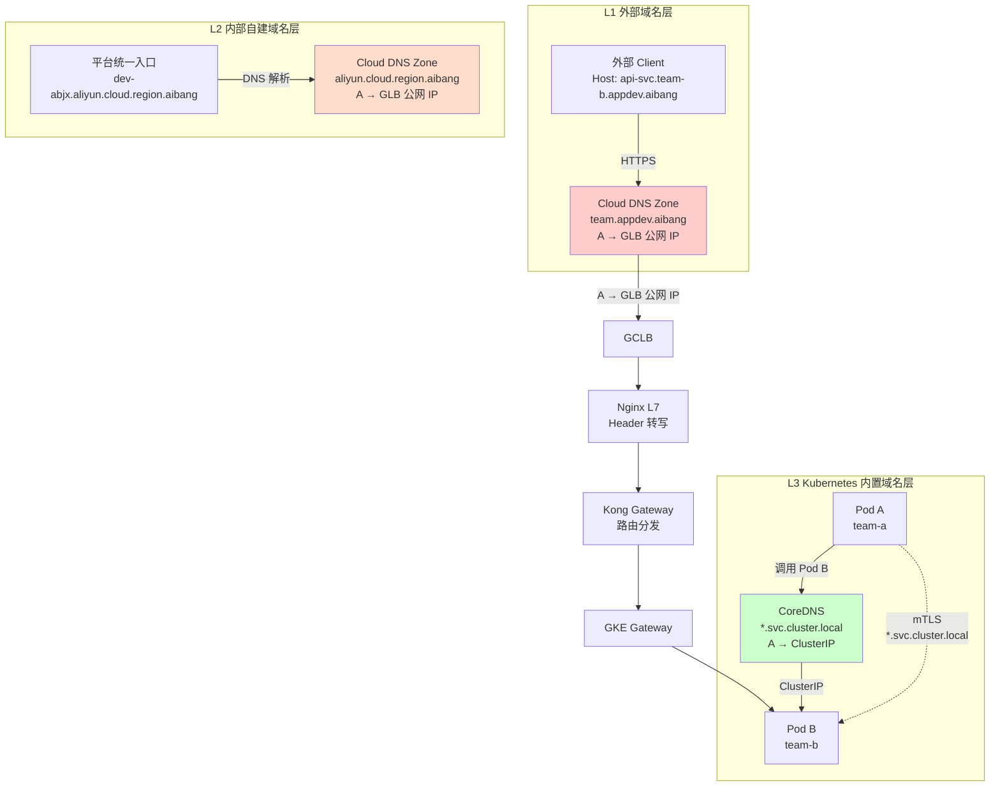
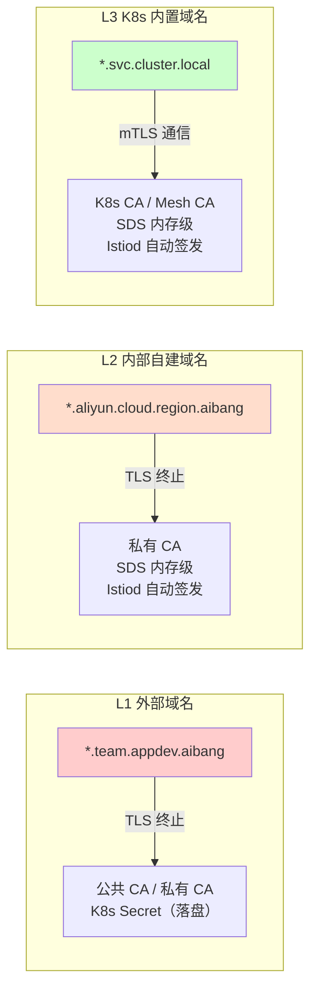

# GKE DNS 架构设计指南：三层域名体系

> **核心问题**：原有文档将"内部自建域名"和"Kubernetes 内置域名"混淆为一个概念 `*.aliyun.cloud.region.local`。实际上存在三层不同的域名体系，各自有不同的管理方、解析机制和证书用途。
>
> **适用环境**：GKE + Kong Gateway + Nginx L7 + GCLB + ASM/Istio
>
> **存放路径**：`linux/dns/docs/three-layer-domain-architecture.md`

---

## 1. 三层域名体系的本质区分

### 1.1 三层域名总览

```
┌────────────────────────────────────────────────────────────────────────────┐
│  L1  外部域名（External Domain）                                             │
│       *.team.appdev.aibang                                                   │
│                                                                              │
│       管理方：Cloud DNS（平台运维）                                           │
│       A 记录 → GLB 公网 IP（静态）                                          │
│       证书：公共 CA / 私有 CA（手动管理）                                    │
│       用途：外部 Client 发起 HTTPS 请求的入口                                │
│       DNS 机制：公网视图 / 内部视图（Split-horizon）                         │
└────────────────────────────────────────────────────────────────────────────┘
                                    ↓
┌────────────────────────────────────────────────────────────────────────────┐
│  L2  内部自建域名（Platform Internal Domain）                                 │
│       *.aliyun.cloud.region.local                                              │
│                                                                              │
│       管理方：Cloud DNS（平台团队自建 Zone）                                  │
│       A 记录 → GLB 公网 IP 或 Internal LB IP（静态）                        │
│       证书：私有 CA 签发，SDS 内存级分发（通过 Istiod）                       │
│       用途：统一入口层（GCLB/Nginx TLS 终止）的 SNI 识别                     │
│       DNS 机制：Cloud DNS Zone，在 CoreDNS 中通过 forwarding 解析            │
│       注意：这是 Cloud DNS 中的一个 Zone，不是 K8s 内置的                    │
└────────────────────────────────────────────────────────────────────────────┘
                                    ↓
┌────────────────────────────────────────────────────────────────────────────┐
│  L3  Kubernetes 内置域名（Cluster Local Domain）                             │
│       *.svc.cluster.local                                                    │
│                                                                              │
│       管理方：Kubernetes CoreDNS（自动管理）                                  │
│       A 记录 → ClusterIP 或 Pod IP（动态，随 Pod 生命周期变化）             │
│       证书：K8s CA / Mesh CA 自动签发，SDS 内存级（通过 istiod）             │
│       用途：Pod ↔ Pod 之间的服务发现和 mTLS 通信                            │
│       DNS 机制：CoreDNS 权威解析，不走外部 DNS                               │
└────────────────────────────────────────────────────────────────────────────┘
```

### 1.2 三层域名的关键差异

| 属性 | L1 外部域名 | L2 内部自建域名 | L3 K8s 内置域名 |
|------|------------|----------------|----------------|
| **示例** | `*.team.appdev.aibang` | `*.aliyun.cloud.region.local` | `*.svc.cluster.local` |
| **管理方** | Cloud DNS（团队） | Cloud DNS（平台团队） | Kubernetes CoreDNS（自动） |
| **DNS Zone 类型** | Cloud DNS Public/Private Zone | Cloud DNS Private Zone（自建） | K8s 内置（非 Zone 概念） |
| **A 记录指向** | GLB 公网 IP（静态） | GLB 公网 IP 或 Internal LB IP | ClusterIP / Pod IP（动态） |
| **解析机制** | Split-horizon DNS | Cloud DNS Zone + CoreDNS forwarding | CoreDNS 权威解析 |
| **证书签发方** | 公共 CA / 私有 CA（手动） | 私有 CA（通过 Istiod SDS） | K8s CA / Mesh CA（自动） |
| **证书存储** | K8s Secret（落盘） | SDS 内存级（不落盘） | SDS 内存级（不落盘） |
| **证书生命周期** | 长期（随域名续期） | 短（24h 自动轮换） | 短（24h 自动轮换） |
| **Pod 内解析方式** | ndots 决策后走 search path | CoreDNS 转发到 Cloud DNS | CoreDNS 直接权威解析 |
| **是否需要手工维护记录** | 是（A 记录需手动管理） | 是（A 记录需手动管理） | 否（K8s 自动生成） |

---

## 2. 三层域名的详细解析

### 2.1 L1：外部域名 `*.team.appdev.aibang`

**用途**：外部 Client 发起 HTTPS 请求的入口域名。

```
外部 Client
  ↓ HTTPS 请求，Host: api-svc.team-b.appdev.aibang
Cloud DNS（公网视图）
  ↓ A 记录查询
  → GLB 公网 IP
  ↓ TLS 终止
GCLB/Nginx
  ↓ Header 转写
Kong Gateway
  ↓ 按 Path/Header 路由
Pod B（team-b）
```

**特点**：
- 这是用户/外部合作方可以直接访问的域名
- 证书通常使用公共 CA（如 DigiCert）或公司私有 CA
- DNS A 记录指向 GLB 公网 IP，流量从公网进入 GCLB 层
- Split-horizon DNS 可以配置内部视图，使集群内 Pod 访问同一域名时解析到 GLB 公网 IP（不推荐，会导致流量绕行公网）

**推荐做法**：Pod 间通信不要使用外部域名，应该用 L3 的 K8s Service 名称。

---

### 2.2 L2：内部自建域名 `*.aliyun.cloud.region.local`
- 个人理解，我们为什么要增加这样一个L2的一个层？因为我们这个最终运行的GKE的Runtime，或者说GKE的这个server需要接受来自Kong的访问，也就是这个是KongDP的 Upstream的 route hosts 
- 也就是我们这个GKE的Runtime，或者说GKE的这个server，它需要有一个域名，这个域名是写在Kong的 Upstream的 route hosts 里面的。
- 这个域名，我们最终需要把它解析到GKE的Runtime，或者说GKE的这个server的IP地址。
- 因为对于我们内部而言，我们所有的Pod都必须运行的是HTTPS。所以说这个也是当初配置证书的一个原因。
- 是在单域名作为入口的场景之下，是将外部和内部的证书进行对应的隔离。

**用途**：统一入口层（GCLB/Nginx TLS 终止）的 SNI 识别，以及平台内部服务的一定程度的服务发现。

**关键理解**：这是平台团队在 Cloud DNS 中**自己创建的 Zone**，不是 Kubernetes 内置的。

```
Cloud DNS Zone: aliyun.cloud.region.local（私有 Zone）
  - dev-abjx.aliyun.cloud.region.local  → GLB 公网 IP
  - *.aliyun.cloud.region.local          → GLB 公网 IP（wildcard）

解析路径：
  Pod 内查询 dev-abjx.aliyun.cloud.region.local
    → CoreDNS 匹配 forward 规则
    → 转发到 GCP 内部 DNS（35.199.192.0/19 源地址）
    → Cloud DNS 解析
    → 返回 GLB 公网 IP
```

**特点**：
- 这是一个 Cloud DNS Private Zone，不是 Kubernetes 内置的
- 平台团队可以像管理外部域名一样管理它（A 记录指向 GLB IP）
- 证书通常使用私有 CA（如公司内部 PKI），由 Istiod 通过 SDS 分发
- 相对于 L1 外部域名，L2 的管理更受控，可以做更细的策略控制
- 相对于 L3 K8s 内置域名，L2 的解析需要走 CoreDNS forwarding，有额外的网络跳

**为什么需要 L2**：
- 外部 Client 和部分内部场景需要使用"不带 `svc.cluster.local` 后缀"的域名
- 平台统一入口需要使用 `dev-abjx.aliyun.cloud.region.local` 这样的域名做 TLS 终止
- 提供一个介于"完全外部"和"完全 K8s 内置"之间的中间层

**注意**：如果 Pod 内代码使用 L2 域名（如 `api-svc.team-b.aliyun.cloud.region.local`），解析会走 CoreDNS → 上游 DNS → Cloud DNS，比 L3 的直接 CoreDNS 权威解析多一跳。

---

### 2.3 L3：Kubernetes 内置域名 `*.svc.cluster.local`

**用途**：Pod ↔ Pod 之间服务发现和 mTLS 加密通信的标准方式。

```
Pod A 调用 Pod B
  ↓ 代码中发起 HTTP 请求
  ↓ 目标地址：api-svc.team-b.svc.cluster.local
CoreDNS 权威解析
  → 直接返回 ClusterIP（10.x.y.z）
  → 不走外部 DNS
Kube-proxy 负载均衡到 Pod B
  ↓ mTLS（*.svc.cluster.local 证书，但 SAN 中包含 Pod IP）
Istio Sidecar 终止 TLS
Pod B 业务容器收到请求
```

**特点**：
- Kubernetes 自动管理，不需要手工维护 DNS 记录
- ClusterIP 随 Service 创建分配，不随 Pod 重建变化（比 Pod IP 更稳定）
- DNS 解析在 CoreDNS 内部完成，不走外部 DNS，延迟最低
- 证书由 K8s CA / Mesh CA 签发，SAN 通常包含 `*.svc.cluster.local` 格式的服务名

**关键点**：`*.svc.cluster.local` 和 `*.aliyun.cloud.region.local` 是两个完全不同的命名空间：
- `*.svc.cluster.local` 是 K8s 内置的，CoreDNS 直接权威解析
- `*.aliyun.cloud.region.local` 是平台自建域名，解析需要通过 CoreDNS forwarding 到 Cloud DNS

---

## 3. 三层域名与证书体系的关系

### 3.1 三层域名对应的证书

```
L1 外部域名（*.team.appdev.aibang）
  → 公共 CA 或私有 CA
  → 手动管理，证书存储在 K8s Secret（落盘）
  → 生命周期长（通常 1 年）
  → 用途：外部 Client HTTPS 请求的 TLS 终止

L2 内部自建域名（*.aliyun.cloud.region.local）
  → 私有 CA（如公司内部 PKI）
  → Istiod 通过 SDS 自动签发和轮换
  → 证书存储在 SDS 内存级（不落盘）
  → 生命周期短（24h 自动轮换）
  → 用途：统一入口层（GCLB/Nginx）的 TLS 终止，SNI 识别

L3 Kubernetes 内置域名（*.svc.cluster.local）
  → K8s CA / Mesh CA
  → Istiod 通过 SDS 自动签发和轮换
  → 证书存储在 SDS 内存级（不落盘）
  → 生命周期短（24h 自动轮换）
  → 用途：Pod ↔ Pod mTLS 加密
```

### 3.2 证书与域名的匹配关系

```
证书 SAN                      匹配的域名层级                使用场景
─────────────────────────────────────────────────────────────────────────
*.team.appdev.aibang          L1 外部域名                   外部 Client HTTPS 入口
dev-abjx.aliyun.cloud.region.*   L2 内部自建域名                GCLB/Nginx 统一入口 TLS
*.aliyun.cloud.region.local       L2 内部自建域名（wildcard）     平台内部某些服务的 TLS
*.svc.cluster.local           L3 Kubernetes 内置域名         Pod 间 mTLS 通信
```

**注意**：Istio/ASM 的 SPIFFE 身份体系与 L3 的 `*.svc.cluster.local` 证书紧密相关。Pod 的 SPIFFE ID 通常格式为 `spiffe://<trust-domain>/ns/<namespace>/sa/<service-account>`，证书 SAN 中会包含对应的 `*.svc.cluster.local` 格式。

---

## 4. 三层域名的 DNS 解析流程

### 4.1 Pod 内的 DNS 解析决策（ndots:5）

Pod 内的 `/etc/resolv.conf` 配置：

```
nameserver 100.68.0.10（kube-dns ClusterIP）
search <namespace>.svc.cluster.local svc.cluster.local cluster.local ...
options ndots:5
```

**ndots:5 行为**：

```
查询名的普通分隔点数量 < 5：先追加 search path，再查原始名
查询名的普通分隔点数量 >= 5：先查原始名，再按 resolver 行为决定是否继续 search
查询名以尾部点结尾（.）：作为绝对 FQDN，不追加 search path
```

### 4.2 三层域名的实际解析路径

#### 查询 L1 外部域名（如 `api-svc.team-b.appdev.aibang`）

```
普通分隔点：1 个（team-b 中的点）
1 < 5 → 先走 search path

1. api-svc.team-b.appdev.aibang.<namespace>.svc.cluster.local  → NXDOMAIN
2. api-svc.team-b.appdev.aibang.svc.cluster.local              → NXDOMAIN
3. api-svc.team-b.appdev.aibang.cluster.local                   → NXDOMAIN
4. api-svc.team-b.appdev.aibang.<project>.internal             → NXDOMAIN
5. api-svc.team-b.appdev.aibang                                 → 最终查询原始名 → CoreDNS 匹配 .（根 zone）→ 转发到上游 DNS → Cloud DNS 返回 GLB 公网 IP

结论：L1 外部域名在 Pod 内查询会产生 5 次 DNS 查询（4 次 search path + 1 次原始名），有解析延迟。
推荐：在代码中使用带尾部点的 FQDN（api-svc.team-b.appdev.aibang.），避免 search path 放大。
```

#### 查询 L2 内部自建域名（如 `dev-abjx.aliyun.cloud.region.local`）

```
普通分隔点：2 个（gcp, cloud）
2 < 5 → 先走 search path

1. dev-abjx.aliyun.cloud.region.local.<namespace>.svc.cluster.local  → NXDOMAIN
2. dev-abjx.aliyun.cloud.region.local.svc.cluster.local              → NXDOMAIN
3. dev-abjx.aliyun.cloud.region.local.cluster.local                   → NXDOMAIN
4. dev-abjx.aliyun.cloud.region.local.<project>.internal              → NXDOMAIN
5. dev-abjx.aliyun.cloud.region.local                                  → 最终查询原始名 → CoreDNS 匹配 .（根 zone）→ 转发到上游 DNS → Cloud DNS 解析 → 返回 GLB 公网 IP

结论：L2 内部自建域名在 Pod 内查询也会产生 search path 放大。建议使用尾部点 FQDN。
```

#### 查询 L3 Kubernetes 内置域名（如 `api-svc.team-b.svc.cluster.local`）

```
普通分隔点：4 个（api-svc, team-b, svc, cluster, local）
4 < 5 → 先走 search path

1. api-svc.team-b.svc.cluster.local.<namespace>.svc.cluster.local  → NXDOMAIN（名字太长，直接回源）
2. api-svc.team-b.svc.cluster.local.svc.cluster.local              → NXDOMAIN
3. api-svc.team-b.svc.cluster.local.cluster.local                   → NXDOMAIN
4. api-svc.team-b.svc.cluster.local.<project>.internal             → NXDOMAIN
5. api-svc.team-b.svc.cluster.local                                 → 最终查询原始名 → CoreDNS 权威解析 → 直接返回 ClusterIP

结论：L3 K8s 内置域名虽然也会走 search path，但因为搜索名字本身是完整 FQDN，CoreDNS 在处理时会直接返回 ClusterIP，没有外部 DNS 转发，延迟最低。
```

---

## 5. 三层域名的实际使用场景

### 5.1 外部 Client 请求（使用 L1）

```
外部 Client
  → HTTPS: api-svc.team-b.appdev.aibang
  → Cloud DNS 解析到 GLB 公网 IP
  → GCLB TLS 终止
  → Nginx L7 Header 转写
  → Kong Gateway 路由
  → GKE Gateway
  → Pod B
```

### 5.2 Pod 调用同一集群内的其他 Pod（使用 L3）

```
Pod A（team-a）
  → 代码：https://api-svc.team-b.svc.cluster.local/api/v1
  → CoreDNS 直接权威解析到 ClusterIP
  → kube-proxy 负载均衡到 Pod B
  → Istio Sidecar mTLS 加密（*.svc.cluster.local 证书）
  → Pod B
```

### 5.3 Pod 调用需要通过统一入口的内部服务（可能涉及 L2）

```
Pod A（team-a）
  → 代码：https://api-svc.team-b.aliyun.cloud.region.local/api/v1
  → CoreDNS 转发到 Cloud DNS
  → Cloud DNS 解析到 GLB 公网 IP
  → 流量"绕出集群"再回来（不推荐）
```

**警告**：这种情况应该避免。Pod 调用内部服务应该使用 L3 的 `*.svc.cluster.local`，而不是 L2 的 `*.aliyun.cloud.region.local`。如果确实需要使用 L2 域名，应该通过 Istio ServiceEntry 注册，而不是依赖 Split-horizon DNS。

---

## 6. 三层域名的 Zone 管理策略

### 6.1 Cloud DNS Zone 划分

```
Cloud DNS 托管区域：

Zone: appdev.aibang（主 Zone，管理平台级域名）
  - dev-abjx.aliyun.cloud.region.local  → GLB 公网 IP
  - *.aliyun.cloud.region.local          → GLB 公网 IP（统一入口）

Zone: team.appdev.aibang（Team 路由 Zone，管理各 Team 的域名）
  - 每个 Team 一个子域
  - A 记录全部指向 GLB 公网 IP（统一入口）
  - 示例：
    - api.team-a.appdev.aibang         → GLB 公网 IP
    - api.team-b.appdev.aibang         → GLB 公网 IP

注意：aliyun.cloud.region.aibang 和 team.appdev.aibang 是两个独立的 Cloud DNS Zone
```

### 6.2 Kubernetes DNS（CoreDNS）

```
Kubernetes 内置 DNS 命名：

Namespace: team-a
  Service: api-svc.team-a.svc.cluster.local
  Pod:     api-svc-xxx-xxxxx.team-a.svc.pod.cluster.local

Namespace: team-b
  Service: api-svc.team-b.svc.cluster.local
  Pod:     api-svc-xxx-xxxxx.team-b.svc.pod.cluster.local

注意：*.svc.cluster.local 是 Kubernetes 内置的，不需要在 Cloud DNS 中管理。
```

### 6.3 三层域名分离管理清单

| 域名层级 | 示例 | 管理方 | 存放位置 | A 记录指向 | 是否需要手工维护 |
|---------|------|--------|----------|-----------|----------------|
| L1 外部域名 | `*.team.appdev.aibang` | Cloud DNS（团队） | Cloud DNS Zone `team.appdev.aibang` | GLB 公网 IP | 是 |
| L2 内部自建域名 | `*.aliyun.cloud.region.local` | Cloud DNS（平台团队） | Cloud DNS Zone `aliyun.cloud.region.local` | GLB 公网 IP 或 Internal LB IP | 是 |
| L3 K8s 内置域名 | `*.svc.cluster.local` | Kubernetes CoreDNS | K8s 内置 | ClusterIP / Pod IP | 否（K8s 自动管理） |

---

## 7. 常见错误与正确做法

### 错误 1：Pod 间通信使用 L1 外部域名

```yaml
# 错误配置
upstreams:
  - name: team-b-api
    targets:
      - api-svc.team-b.appdev.aibang:443  # L1 外部域名

# 后果
  → Split-horizon DNS 解析到 GLB 公网 IP
  → Kong Pod 认为 upstream 在集群外部
  → 流量绕行公网
  → 多一跳延迟、外部段无 mTLS、GLB 外部流量计费

# 正确配置
upstreams:
  - name: team-b-api
    targets:
      - api-svc.team-b.svc.cluster.local:8443  # L3 K8s 内置域名
```

### 错误 2：Pod 间通信使用 L2 内部自建域名

```yaml
# 错误配置
upstreams:
  - name: team-b-api
    targets:
      - api-svc.team-b.aliyun.cloud.region.local:443  # L2 内部自建域名

# 后果
  → CoreDNS 转发到 Cloud DNS
  → 返回 GLB 公网 IP
  → 流量绕行公网（和 L1 一样的问题）

# 正确配置
upstreams:
  - name: team-b-api
    targets:
      - api-svc.team-b.svc.cluster.local:8443  # L3 K8s 内置域名
```

### 错误 3：Cloud DNS Zone 指向 Pod IP

```yaml
# 错误做法：Cloud DNS Zone 中创建 A 记录指向 Pod IP
# Zone: team.appdev.aibang
# api.team-b.appdev.aibang → 10.0.1.15（Pod IP，临时）

# 正确做法：永远不将 Cloud DNS A 记录指向 Pod IP
# A 记录应该指向 GLB 公网 IP 或 Internal LB IP
# api.team-b.appdev.aibang → <GLB 公网 IP>
```

### 错误 4：修改 Pod 的 /etc/resolv.conf 指向外部 DNS

```yaml
# 错误：Pod 级别 dnsConfig（会破坏集群内 DNS 解析）
spec:
  dnsConfig:
    nameservers:
      - 8.8.8.8    # 外部 DNS，绕过了 CoreDNS

# 正确：不修改 dnsConfig，让 Pod 使用集群默认 DNS
# CoreDNS 会处理所有查询，包括外部域名（转发到 GCP 内部 DNS）
```

---

## 8. 架构图

### 8.1 三层域名全景图



### 8.2 三层域名与证书对应关系



---

## 9. 实施检查清单

### 9.1 Cloud DNS 配置检查

```
☐ Zone appdev.aibang 已创建，包含 *.aliyun.cloud.region.local A 记录指向 GLB 公网 IP
☐ Zone team.appdev.aibang 已创建，各 Team 子域 A 记录指向 GLB 公网 IP
☐ Cloud DNS 内部视图未配置指向 Pod IP
☐ Split-horizon DNS 未将 *.team.appdev.aibang 或 *.aliyun.cloud.region.local 指向 ClusterIP
☐ aliyun.cloud.region.local Zone 和 team.appdev.aibang Zone 是两个独立 Zone
```

### 9.2 Kong 配置检查

```
☐ Kong upstream 使用 L3 K8s Service 名称（*.svc.cluster.local）
☐ Kong upstream 未使用 L1 外部域名（*.team.appdev.aibang）
☐ Kong upstream 未使用 L2 内部自建域名（*.aliyun.cloud.region.local）
☐ Kong upstream health check 使用 https + /health 端点
☐ Kong DP Pod 的 /etc/resolv.conf 指向 kube-dns
```

### 9.3 Kubernetes DNS 检查

```
☐ CoreDNS 正常工作，*.svc.cluster.local 可解析
☐ K8s CA / Mesh CA 为所有 Pod 自动签发 mTLS 证书（*.svc.cluster.local）
☐ Istio/ASM Sidecar 注入了所有需要 mTLS 的 Pod
☐ Pod 间通信使用 L3 K8s Service 名称（*.svc.cluster.local）
```

---

## 10. 参考资料

| 文档 | 路径 | 关键内容 |
|------|------|----------|
| DNS 架构设计指南（原始） | `linux/dns/docs/external-internal-dns-separation.md` | 外部域名与内部域名分离原则（两域版本） |
| Pod 间证书替代评估 | `safe/ssl/docs/claude/pod-cert-replacement-evaluation.md` | 13 个维度评估不替代方案 |
| GCP DNS Explorer | `linux/dns/docs/gcp-dns-explorer-gpt5-6.md` | ndots 行为、Cloud DNS 解析顺序校正 |
| GCLB 证书管理 | `webservice/nginx/docs/GCLB-Certificate-Management.md` | Target HTTPS Proxy 证书配额 |

---

*文档生成时间：2026-05-28*
*评估人：Hermes Architecture Profile*
*版本：v2.0（从两域体系升级为三层域名体系）*