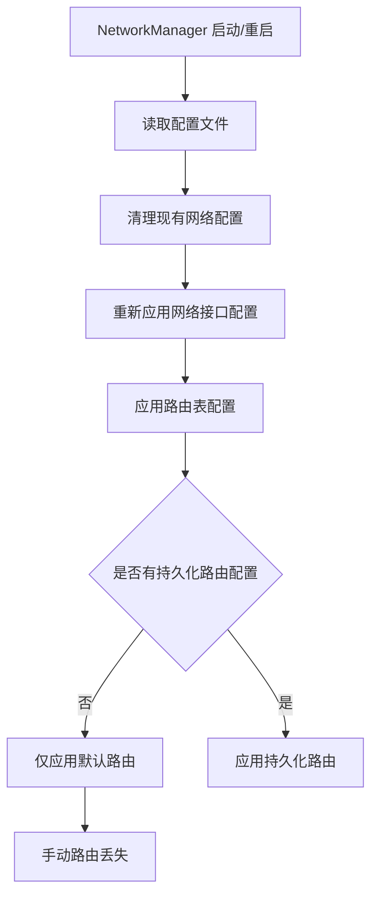

# GCP Instance 重启 NetworkManager 导致静态路由丢失问题分析

## 问题分析

当禁用 IPv6 并重启 NetworkManager 服务时,手动添加的静态路由会丢失。这是因为 NetworkManager 重启会重新初始化网络配置,导致临时添加的路由被清除。

## 路由丢失的根本原因

### 原因 1: NetworkManager 的工作机制


### 原因 2: 路由生命周期
- **临时路由**: 使用 `ip route add` 添加的路由仅存在于运行时内存中
- **持久路由**: 需要通过配置文件或系统服务管理
- **NetworkManager 重启**: 会清空路由表并重新从配置文件加载

## 解决方案

### 方案 1: 使用 NetworkManager Dispatcher (推荐)

创建 dispatcher 脚本,在 NetworkManager 启动后自动添加路由:

```bash
# 创建 dispatcher 脚本
sudo tee /etc/NetworkManager/dispatcher.d/99-custom-routes << 'EOF'
#!/bin/bash

# 仅在接口启动时执行
if [ "$2" = "up" ]; then
    # 从 metadata 获取路由信息
    ROUTE_RANGE=$(curl -s -H "Metadata-Flavor: Google" \
        http://metadata.google.internal/computeMetadata/v1/instance/attributes/route-range)
    
    # 获取网关信息
    GATEWAY=$(curl -s -H "Metadata-Flavor: Google" \
        http://metadata.google.internal/computeMetadata/v1/instance/network-interfaces/0/gateway)
    
    # 添加静态路由
    if [ -n "$ROUTE_RANGE" ]; then
        logger "Adding custom route: $ROUTE_RANGE via $GATEWAY"
        ip route add $ROUTE_RANGE via $GATEWAY dev $INTERFACE_NAME 2>/dev/null || true
    fi
fi
EOF

# 设置执行权限
sudo chmod +x /etc/NetworkManager/dispatcher.d/99-custom-routes
```

### 方案 2: 修改 start.sh 执行顺序

确保路由添加发生在 NetworkManager 重启之后:

```bash
#!/bin/bash
# start.sh

# 1. 禁用 IPv6
echo "Disabling IPv6..."
sysctl -w net.ipv6.conf.all.disable_ipv6=1
sysctl -w net.ipv6.conf.default.disable_ipv6=1

# 2. 重启 NetworkManager
echo "Restarting NetworkManager..."
systemctl restart NetworkManager

# 3. 等待 NetworkManager 完全启动
echo "Waiting for NetworkManager to stabilize..."
sleep 5

# 确保接口完全启动
nmcli networking connectivity check
while [ $? -ne 0 ]; do
    sleep 2
    nmcli networking connectivity check
done

# 4. 从 metadata 获取路由信息并添加
echo "Adding custom routes..."
ROUTE_RANGE=$(curl -s -H "Metadata-Flavor: Google" \
    http://metadata.google.internal/computeMetadata/v1/instance/attributes/route-range)

GATEWAY=$(curl -s -H "Metadata-Flavor: Google" \
    http://metadata.google.internal/computeMetadata/v1/instance/network-interfaces/0/gateway)

INTERFACE=$(ip route | grep default | awk '{print $5}' | head -n1)

if [ -n "$ROUTE_RANGE" ]; then
    ip route add $ROUTE_RANGE via $GATEWAY dev $INTERFACE
    echo "Route added: $ROUTE_RANGE via $GATEWAY dev $INTERFACE"
fi

# 5. 验证路由
ip route show | grep "$ROUTE_RANGE"
```

### 方案 3: 使用 systemd service (最稳定)

创建专门的 systemd 服务来管理路由:

```bash
# 创建服务脚本
sudo tee /usr/local/bin/setup-custom-routes.sh << 'EOF'
#!/bin/bash

# 获取 metadata
ROUTE_RANGE=$(curl -s -H "Metadata-Flavor: Google" \
    http://metadata.google.internal/computeMetadata/v1/instance/attributes/route-range)

GATEWAY=$(curl -s -H "Metadata-Flavor: Google" \
    http://metadata.google.internal/computeMetadata/v1/instance/network-interfaces/0/gateway)

INTERFACE=$(ip route | grep default | awk '{print $5}' | head -n1)

# 添加路由
if [ -n "$ROUTE_RANGE" ] && [ -n "$GATEWAY" ] && [ -n "$INTERFACE" ]; then
    ip route add $ROUTE_RANGE via $GATEWAY dev $INTERFACE 2>/dev/null
    logger "Custom route added: $ROUTE_RANGE via $GATEWAY dev $INTERFACE"
    exit 0
else
    logger "Failed to add custom route: missing parameters"
    exit 1
fi
EOF

sudo chmod +x /usr/local/bin/setup-custom-routes.sh

# 创建 systemd service
sudo tee /etc/systemd/system/custom-routes.service << 'EOF'
[Unit]
Description=Setup Custom Static Routes
After=network-online.target NetworkManager.service
Wants=network-online.target

[Service]
Type=oneshot
ExecStart=/usr/local/bin/setup-custom-routes.sh
RemainAfterExit=yes
Restart=on-failure
RestartSec=5s

[Install]
WantedBy=multi-user.target
EOF

# 启用服务
sudo systemctl daemon-reload
sudo systemctl enable custom-routes.service
sudo systemctl start custom-routes.service
```

### 方案 4: 使用 NetworkManager 配置文件持久化路由

```bash
# 创建路由配置文件
sudo tee /etc/NetworkManager/system-connections/static-routes << EOF
[connection]
id=static-routes
type=ethernet
autoconnect=true

[ipv4]
method=auto
route1=10.0.0.0/8,192.168.1.1
# 根据实际情况修改上面的路由
never-default=false

[ipv6]
method=disabled
EOF

# 重新加载配置
sudo nmcli connection reload
```

## 对比与选择

| 方案 | 优点 | 缺点 | 适用场景 |
|------|------|------|----------|
| Dispatcher | 自动触发,无需修改启动流程 | 依赖 NetworkManager | 标准场景 |
| 修改 start.sh | 简单直接,易于理解 | 需要准确的等待时间 | 快速修复 |
| systemd service | 最稳定,支持自动重试 | 配置稍复杂 | 生产环境推荐 |
| NM 配置文件 | 完全持久化 | 路由需要硬编码 | 固定路由场景 |

## 调试与验证

### 验证路由是否正确添加

```bash
# 查看所有路由
ip route show

# 查看特定路由
ip route get <目标IP>

# 检查路由表
ip route list table all
```

### 监控 NetworkManager 日志

```bash
# 实时查看日志
journalctl -u NetworkManager -f

# 查看历史日志
journalctl -u NetworkManager --since "10 minutes ago"
```

### 测试路由连通性

```bash
# 测试特定路由
ping -I <接口名> <目标IP>

# 追踪路由路径
traceroute -i <接口名> <目标IP>
```

## 注意事项

1. **时序问题**: 确保 NetworkManager 完全启动后再添加路由
2. **接口名称**: GCP 实例的主接口通常是 `ens4` 或 `eth0`,需要动态获取
3. **Metadata 可用性**: 确保 metadata 服务可访问
4. **错误处理**: 添加路由时使用 `2>/dev/null || true` 避免重复添加报错
5. **日志记录**: 使用 `logger` 命令记录操作到系统日志,便于排查

## 最佳实践建议

1. **优先使用 systemd service** (方案 3),最稳定且易于维护
2. **添加健康检查**,确保路由添加成功
3. **实现重试机制**,处理网络初始化延迟
4. **记录详细日志**,便于问题追踪
5. **定期验证路由**,可以添加 cron 任务监控