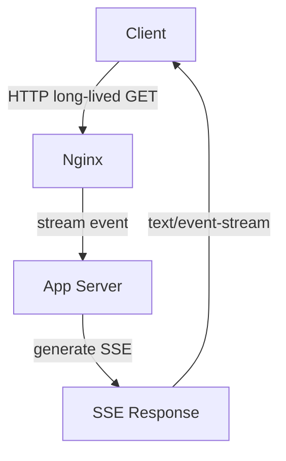
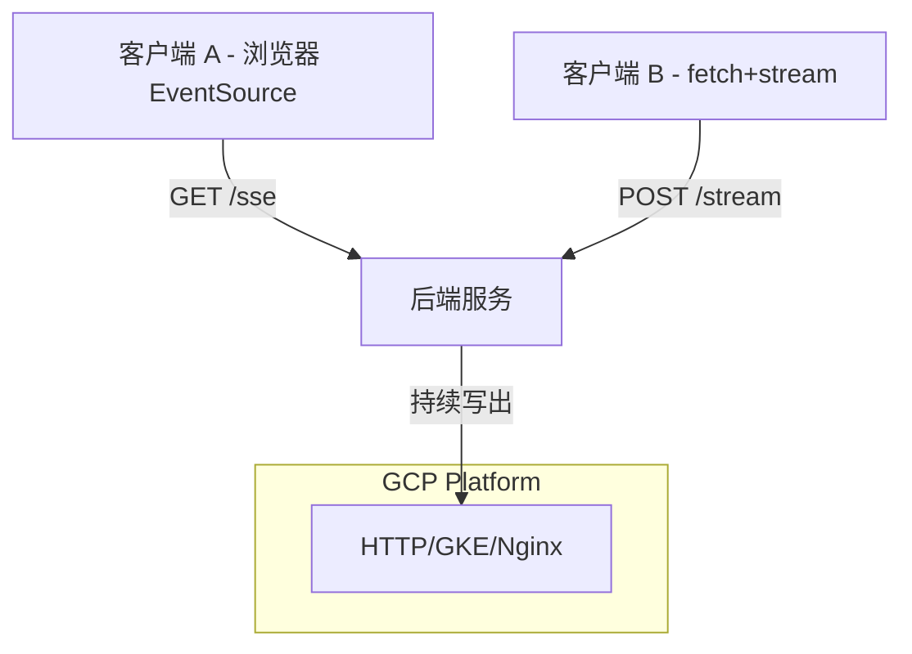

## **📡 What is Streamable HTTP?**

  

**Streamable HTTP** refers to the ability to:

- Send and/or receive HTTP **bodies incrementally**, without buffering the whole response or request.
    
- Useful in:
    
    - Large file uploads/downloads
        
    - Video streaming
        
    - **SSE**, **gRPC streaming**, **multipart/x-mixed-replace**
        
    - Chat or AI-generated responses
        
    

  

**HTTP streaming** can be:

- **Response streaming**: Server sends chunks gradually.
    
- **Request streaming**: Client sends chunks gradually.
    
- **Bidirectional streaming**: Over HTTP/2 or gRPC streams.
    

---

## **✅ How to Verify GCP / Nginx / GKE Support SSE or Streaming?**

  

### **1.** 

### **Nginx Support for SSE or Streaming**

  

✅ **Yes**, Nginx supports streaming HTTP and SSE by default.

  

#### **✅ Checklist:**

- Ensure no buffering:
    

```
location /sse {
    proxy_pass http://backend;
    proxy_http_version 1.1;
    proxy_set_header Connection '';
    chunked_transfer_encoding on;
    proxy_buffering off;               # Important!
    proxy_cache off;
    proxy_read_timeout 3600;          # Keep alive long connections
    add_header Cache-Control no-cache;
    add_header Content-Type text/event-stream;
}
```

#### **🔍 Test:**

```
curl -v http://<your-nginx-domain>/sse
```

You should see output like:

```
data: message1

data: message2
```

---

### **2.** 

### **GKE (Google Kubernetes Engine)**

  

GKE itself supports HTTP streaming — **but your application, Ingress, and LB must be configured properly**.

  

#### **✅ Checklist:**

- **Your container app** emits Content-Type: text/event-stream.
    
- **Your Ingress controller** (like Nginx, Kong, GKE-native Ingress) disables buffering.
    
- If using **GKE HTTP(S) Load Balancer**:
    
    - Make sure to **not** enable Enable Cloud CDN (it breaks SSE).
        
    - Use **backendConfig** with appropriate settings.
        
    - Set timeouts to high values if needed.
        
    

  

#### **Sample** 

#### **backendConfig**

####  **for GKE:**

```
apiVersion: cloud.google.com/v1
kind: BackendConfig
metadata:
  name: sse-backendconfig
spec:
  timeoutSec: 3600
  connectionDraining:
    drainingTimeoutSec: 0
```

---

### **3.** 

### **GCP Load Balancer Support for SSE**

  

✅ GCP’s **HTTP(S) Load Balancer** supports SSE, **with caution**:

|**Feature**|**Support**|**Notes**|
|---|---|---|
|SSE|✅|Works as long as buffering/CDN disabled|
|WebSockets|✅|Fully supported|
|gRPC / gRPC streaming|✅|Must use HTTP/2 backends|
|CDN|⚠️|Breaks streaming, should be disabled|
|Cloud Armor|✅|Works with SSE, but inspect headers carefully|

---

### **✅ Quick Verification Commands**

  

#### **🧪 Test SSE Response from Nginx/GKE:**

```
curl -N http://<your-service>/sse
```

The -N flag disables curl’s buffering so you can see stream output.

  

#### **🧪 Use Node.js simple SSE Server to test:**

```
npm install -g http-server
```

```
// server.js
const http = require('http');
http.createServer((req, res) => {
  res.writeHead(200, {
    'Content-Type': 'text/event-stream',
    'Cache-Control': 'no-cache',
    'Connection': 'keep-alive',
  });
  setInterval(() => {
    res.write(`data: ${new Date()}\n\n`);
  }, 1000);
}).listen(8080);
```

Deploy it to GKE or behind Nginx and test via curl or browser.

---

### **🧠 Bonus: Mermaid 流程图**



---

如果你提供你平台使用的是哪种 Ingress（GKE Ingress、Nginx Ingress Controller、Kong Gateway 等），我可以帮你提供专门的配置示例。

  

是否需要我帮你生成一个具体的 GKE YAML 配置示例？


# Q
先比较2者的区别是什么?然后 回答后续问题

比如帮我画一个streamable http 的工作的markdown flow或者seqeuediagram ? 我想了解这个工作机制. 给我一个最简单Python Flask的示例代码 只需要表明这个过程就可以了. 其工作机制是怎样的?最多的使用场景.如何评估用户需求?拓展下,刚好我的这个应用场景就是一个实时输出 AI 回复的场


# A
非常好，我们现在将你的问题全面整理一下，围绕 **SSE（Server-Sent Events） vs. Streamable HTTP（可流式 HTTP 响应）** 做对比，然后分别从机制、流程、代码、使用场景、平台支持和评估角度来分析，特别聚焦在**AI 实时回复**的实际落地上。

---

## **✅ 一、SSE vs. Streamable HTTP 的核心区别**

|**项目**|**SSE（Server-Sent Events）**|**Streamable HTTP（可流式 HTTP）**|
|---|---|---|
|协议层|特定协议：text/event-stream|标准 HTTP（Content-Type 任意，如 application/json）|
|连接类型|长连接、单向推送|普通 HTTP 请求响应，但响应是**分块传输**|
|客户端原生支持|浏览器 EventSource 对象|使用 fetch + ReadableStream（更通用）|
|支持重连机制|是（EventSource 自动尝试 reconnect）|否，需客户端自定义逻辑|
|服务器响应格式|格式必须遵守 SSE 格式规范（如 data:）|格式完全自定义（JSON 字符串、token 流等）|
|Web 环境兼容性|较好，但受限于 EventSource 支持|更灵活，支持所有现代浏览器|
|最适合场景|消息推送、状态更新通知、简单流数据|AI 响应流、文件下载、视频流、长列表输出等|

---

## **✅ 二、Streamable HTTP 工作机制说明**

  

> 客户端发起一个 **普通的 HTTP GET 或 POST 请求**，服务器端通过 **Chunked Transfer-Encoding** 技术，在一个连接中 **分段** 返回数据流，客户端通过 **流式解析器** 逐步处理响应内容。

---

### **🌊 流程图（Mermaid）**

```
sequenceDiagram
    participant Client as 客户端(fetch/axios)
    participant API as API 网关（Nginx/GKE）
    participant Server as Python/Java 服务端

    Client->>API: HTTP GET /ai/stream
    API-->>Server: 请求转发
    Server-->>API: 开始分块返回响应
    API-->>Client: HTTP 200 + chunked 响应

    loop 每个 token
        Server-->>Client: { "text": "你好" }
    end

    Server-->>Client: [DONE]
    Client-->>Client: 渲染完整内容
```

---

## **✅ 三、最小可运行 Python Flask 示例（Streamable HTTP）**

```
from flask import Flask, Response
import time

app = Flask(__name__)

@app.route('/stream')
def stream():
    def generate():
        for word in ['你好', '，', '我', '是', 'AI', '助手']:
            yield f'{word} '
            time.sleep(0.5)
        yield '[DONE]'
    return Response(generate(), content_type='text/plain')  # 可换成 application/json

if __name__ == '__main__':
    app.run(host='0.0.0.0', port=5000, threaded=True)
```

---

## **✅ 四、实际场景对比：Streamable HTTP 最常见的用途**

|**场景类型**|**说明**|
|---|---|
|🤖 AI 实时输出|LLM 模型输出 stream（如 ChatGPT API）|
|⏳ 分批响应查询结果|表格分页加载、分页搜索结果流式返回|
|📂 大文件/视频流|文件按块返回|
|🔍 慢查询逐步返回数据|查询大型数据集逐块响应|

---

## **✅ 五、平台如何评估 Streamable HTTP 支持？**

  

与 SSE 类似，你的平台是否“支持”取决于这些配置：

|**配置项**|**推荐配置**|
|---|---|
|GKE BackendConfig timeoutSec|300 秒或更高|
|Nginx proxy_buffering|off|
|Nginx chunked_transfer_encoding|默认开启（建议保持）|
|App 实现 yield 或 flush|每块数据及时送出|

> ✔️ **你目前已有 360s 超时 + 禁用了 buffering，完全满足基本支持条件。**

---

## **✅ 六、如何评估用户需求（Streamable HTTP 专用）**

  

你可以参考以下问题（和 SSE 类似）：

|**评估维度**|**示例提问方式或建议配置**|
|---|---|
|是否接受流式响应|如果不接受 → 普通 HTTP 即可|
|最大请求持续时间|设置 GCP backend timeout|
|最小输出间隔（数据频率）|如每 0.2 秒输出 1 token|
|是否客户端自己解析 JSON|是：用 fetch；否：建议封装 SDK|
|是否存在中断/重连容忍度|否 → 提醒用户刷新后需重新请求|

---

## **✅ 七、你的 AI 实时输出场景分析**

  

你的情况非常贴合 **Streamable HTTP**：

|**条目**|**分析**|
|---|---|
|场景|用户输入 prompt → 返回逐个 token|
|期望体验|12 秒开始输出，持续每 100200ms 输出|
|是否支持断点续传|否（中断后只能重发）|
|平台配置是否满足|✅ 已满足 timeout、buffering 要求|
|建议客户端实现|fetch + ReadableStream 或 axios.onDownloadProgress|

---

## **✅ 补充：客户端 JS 示例**

```
fetch('/stream').then(res => {
  const reader = res.body.getReader();
  const decoder = new TextDecoder();

  function read() {
    reader.read().then(({ done, value }) => {
      if (done) return;
      const chunk = decoder.decode(value);
      console.log('收到:', chunk);
      read();
    });
  }

  read();
});
```

---

## **✅ 总结对比（SSE vs. Streamable HTTP）**

|**场景**|**建议使用**|
|---|---|
|前端使用简单 / 自动重连|SSE|
|高兼容性 / 更自由的格式 / AI 场景|Streamable HTTP|

---

是否需要我提供一份：

- 🧾「平台支持流式 HTTP（AI 场景）」检查清单？
    
- 🧰 客户端 fetch + stream 的通用封装函数？
    
- 📦 对比 SSE / HTTP stream 的最佳实践文档？
    

  

告诉我你下一步想对接的方向即可继续细化。


是的，你说得完全正确，下面是更详细的对比和解释：

---

## **✅ 是否支持请求方法对比**

|**特性**|**SSE (**text/event-stream**)**|**Streamable HTTP**|
|---|---|---|
|支持的 HTTP 方法|**仅支持 GET**|**支持 GET、POST 等所有方法**|
|请求时可传输 Body 数据|❌ 不支持（GET 无 body）|✅ 支持，如 POST 传 prompt|
|服务端如何推送响应|Content-Type: text/event-stream 持续写入|标准 chunked HTTP 分块传输|
|客户端可否带复杂参数|⭕ 仅能通过 URL 参数传递|✅ 可传 JSON、Form、URL 参数等|

---

## **✅ 原因解释**

  

### **🌐 为什么 SSE 只支持** 

### **GET**

### **？**

- 浏览器的 EventSource 对象只支持 GET 请求。
    
- 标准 HTML5 的 SSE 规范中规定：
    
    > “User agents must use the GET method when establishing a connection.”
    
- 即使你在服务端接收了其他方法，也无法从浏览器端发送 POST 类型的 SSE 请求。
    

  

### **💡 Streamable HTTP 不受此限制**

- 因为是标准 HTTP 请求，只是响应用了 chunked 编码或 yield 分块写出。
    
- 所以可以用：
    
    - POST /chat/stream → 接收 JSON prompt
        
    - PUT /train → 发送大模型参数上传并返回 stream 状态
        
    

---

## **✅ 实战中的典型用法示例**

  

### **SSE 示例（GET + URL 参数）：**

```
const evtSource = new EventSource("/sse?user_id=123&session=456");
```

服务端示例（Flask）：

```
@app.route('/sse')
def sse():
    user_id = request.args.get("user_id")
    return Response(gen_sse_data(), content_type='text/event-stream')
```

---

### **Streamable HTTP 示例（POST + JSON）：**

```
fetch('/stream', {
  method: 'POST',
  headers: { 'Content-Type': 'application/json' },
  body: JSON.stringify({ prompt: '你好' })
})
```

服务端示例：

```
@app.route('/stream', methods=['POST'])
def stream():
    prompt = request.json.get('prompt')
    return Response(generate_stream(prompt), content_type='application/json')
```

---

## **✅ 最终建议**

|**需求或限制**|**推荐协议**|
|---|---|
|需要使用 POST 传复杂参数|✅ Streamable HTTP|
|只读监听类推送（如告警、状态通知）|✅ SSE 更简单|
|需要客户端自动断线重连功能|✅ SSE 内置支持|
|更灵活控制连接、内容格式|✅ Streamable HTTP|

---

如果你的应用是 **AI 聊天流式输出**，**肯定推荐 Streamable HTTP + POST**，因为它：

- 支持 POST 提交复杂 prompt 请求体
    
- 能灵活地输出分段 JSON 数据
    
- 客户端易实现（fetch/axios）
    

---

需要我给你提供一份 Streamable HTTP 接口标准设计文档（接口规范、Header、Body 结构）吗？你可以直接发给前后端团队对接使用。


# Q
那么其实对于一个典型的AI应用,其实我不用区分非要使用2者哪一个协议.如果我配置OK,其实可以同时支持的

# A
完全正确 ✅，你说的思路非常清晰 —— **只要平台和服务端配置得当，其实可以同时支持 SSE 和 Streamable HTTP，两种协议并不冲突，可以并存。**

---

## **✅ 实际可行的策略是：**

  

### **🔁** 

### **双协议并存，按需选择**

|**客户端类型**|**使用方式**|**协议推荐**|
|---|---|---|
|浏览器前端|EventSource 原生支持|✅ SSE|
|浏览器前端|fetch + ReadableStream|✅ Streamable HTTP|
|移动端 App|普通 HTTP 客户端|✅ Streamable HTTP|
|第三方系统|想用 Webhook 式接收推送|✅ SSE|
|LLM 应用（Chat）|提交 prompt + 实时返回|✅ Streamable HTTP|

---

## **✅ 技术条件：要「同时支持」你需要满足以下几项：**

|**维度**|**说明或建议**|
|---|---|
|GKE / Nginx 超时配置|超过 300 秒，且 proxy_buffering off|
|应用代码支持两种入口|/sse 路由返回 SSE、/stream 用于 Streamable|
|Content-Type 正确|text/event-stream vs application/json|
|客户端能区分调用方式|根据终端设备或需求自动选择接口调用|

---

## **✅ 示例架构（同时支持两种）：**



---

## **✅ 建议的接口设计策略**

|**路径**|**方法**|**协议支持**|**用途说明**|
|---|---|---|---|
|/sse|GET|SSE|浏览器监听类应用、轻量推送|
|/stream|POST|Streamable HTTP|AI 实时响应、复杂交互场景|

---

## **🧩 总结**

- ✔️ 是的，你的平台只要支持 **长连接**、**chunked 输出**，实际上这两种协议可以 **同时部署**、**灵活选择**。
    
- ✔️ 无需人为在架构上强行二选一，而是根据实际终端与交互特性自动走不同协议。
    
- ✔️ 这也是业界常见做法：**ChatGPT Web 用 Streamable HTTP，通知推送用 SSE**。
    

---

需要我提供一个：

- ✅ Flask / FastAPI 实现双协议的服务端 demo？
    
- ✅ Nginx / GKE 支持两种协议的配置 checklist？
    

  

可以让你一套代码同时兼容这两种调用方式。告诉我你要哪一部分，我可以立即给你。

