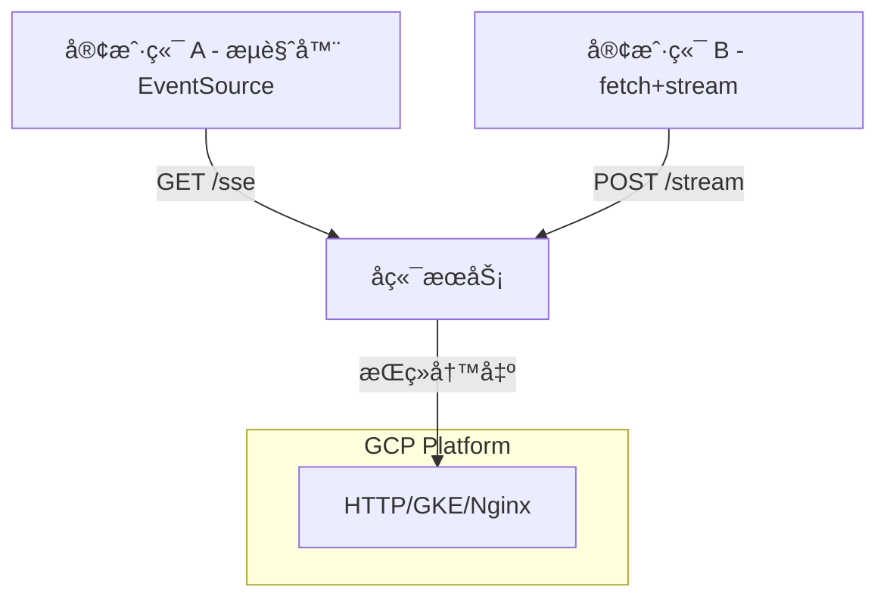

## **📡 What is Streamable HTTP?**

  

**Streamable HTTP** refers to the ability to:

- Send and/or receive HTTP **bodies incrementally**, without buffering the whole response or request.
    
- Useful in:
    
    - Large file uploads/downloads
        
    - Video streaming
        
    - **SSE**, **gRPC streaming**, **multipart/x-mixed-replace**
        
    - Chat or AI-generated responses
        
    

  

**HTTP streaming** can be:

- **Response streaming**: Server sends chunks gradually.
    
- **Request streaming**: Client sends chunks gradually.
    
- **Bidirectional streaming**: Over HTTP/2 or gRPC streams.
    

---

## **✅ How to Verify GCP / Nginx / GKE Support SSE or Streaming?**

  

### **1.** 

### **Nginx Support for SSE or Streaming**

  

✅ **Yes**, Nginx supports streaming HTTP and SSE by default.

  

#### **✅ Checklist:**

- Ensure no buffering:
    

```
location /sse {
    proxy_pass http://backend;
    proxy_http_version 1.1;
    proxy_set_header Connection '';
    chunked_transfer_encoding on;
    proxy_buffering off;               # Important!
    proxy_cache off;
    proxy_read_timeout 3600;          # Keep alive long connections
    add_header Cache-Control no-cache;
    add_header Content-Type text/event-stream;
}
```

#### **🔠Test:**

```
curl -v http://<your-nginx-domain>/sse
```

You should see output like:

```
data: message1

data: message2
```

---

### **2.** 

### **GKE (Google Kubernetes Engine)**

  

GKE itself supports HTTP streaming — **but your application, Ingress, and LB must be configured properly**.

  

#### **✅ Checklist:**

- **Your container app** emits Content-Type: text/event-stream.
    
- **Your Ingress controller** (like Nginx, Kong, GKE-native Ingress) disables buffering.
    
- If using **GKE HTTP(S) Load Balancer**:
    
    - Make sure to **not** enable Enable Cloud CDN (it breaks SSE).
        
    - Use **backendConfig** with appropriate settings.
        
    - Set timeouts to high values if needed.
        
    

  

#### **Sample** 

#### **backendConfig**

####  **for GKE:**

```
apiVersion: cloud.google.com/v1
kind: BackendConfig
metadata:
  name: sse-backendconfig
spec:
  timeoutSec: 3600
  connectionDraining:
    drainingTimeoutSec: 0
```

---

### **3.** 

### **GCP Load Balancer Support for SSE**

  

✅ GCP’s **HTTP(S) Load Balancer** supports SSE, **with caution**:

|**Feature**|**Support**|**Notes**|
|---|---|---|
|SSE|✅|Works as long as buffering/CDN disabled|
|WebSockets|✅|Fully supported|
|gRPC / gRPC streaming|✅|Must use HTTP/2 backends|
|CDN|âš ï¸|Breaks streaming, should be disabled|
|Cloud Armor|✅|Works with SSE, but inspect headers carefully|

---

### **✅ Quick Verification Commands**

  

#### **🧪 Test SSE Response from Nginx/GKE:**

```
curl -N http://<your-service>/sse
```

The -N flag disables curl’s buffering so you can see stream output.

  

#### **🧪 Use Node.js simple SSE Server to test:**

```
npm install -g http-server
```

```
// server.js
const http = require('http');
http.createServer((req, res) => {
  res.writeHead(200, {
    'Content-Type': 'text/event-stream',
    'Cache-Control': 'no-cache',
    'Connection': 'keep-alive',
  });
  setInterval(() => {
    res.write(`data: ${new Date()}\n\n`);
  }, 1000);
}).listen(8080);
```

Deploy it to GKE or behind Nginx and test via curl or browser.

---

### **🧠 Bonus: Mermaid æµç¨‹å›¾**


---

如æœä½ æ供你平å°ä½¿ç”¨çš„æ˜¯å“ªç§ Ingress（GKE Ingressã€Nginx Ingress Controllerã€Kong Gateway 等），我å¯ä»¥å¸®ä½ æ供专门的é…置示例。

  

是å¦éœ€è¦æˆ‘帮你生æˆä¸€ä¸ªå…·ä½“çš„ GKE YAML é…置示例？


# Q
先比较2者的区别是什么?然å å›ç­”å续问题

比如帮我画一个streamable http 的工作的markdown flow或者seqeuediagram ? 我想了解这个工作机制. 给我一个最简å•Python Flaskçš„ç¤ºä¾‹ä»£ç  åªéœ€è¦è¡¨æ˜è¿™ä¸ªè¿‡ç¨‹å°±å¯ä»¥äº†. 其工作机制是æ€æ ·çš„?最多的使用场景.如何评估用户需求?拓展下,刚好我的这个应用场景就是一个å®æ—¶è¾“出 AI å›å¤çš„场


# A
é常好，我们ç°åœ¨å°†ä½ çš„问题全é¢æ•´ç†ä¸€ä¸‹ï¼Œå›´ç»• **SSE（Server-Sent Events） vs. Streamable HTTP（å¯æµå¼ HTTP å“应）** åšå¯¹æ¯”，然å分别ä»æœºåˆ¶ã€æµç¨‹ã€ä»£ç ã€ä½¿ç”¨åœºæ™¯ã€å¹³å°æ”¯æŒå’Œè¯„估角度æ¥åˆ†æ，特别èšç„¦åœ¨**AI å®æ—¶å›å¤**çš„å®é™…è½åœ°ä¸Šã€‚

---

## **✅ 一ã€SSE vs. Streamable HTTP 的核心区别**

|**项目**|**SSE（Server-Sent Events）**|**Streamable HTTP（å¯æµå¼ HTTP）**|
|---|---|---|
|å议层|特定å议：text/event-stream|标准 HTTP（Content-Type ä»»æ„，如 application/json）|
|è¿æ¥ç±»å‹|é•¿è¿æ¥ã€å•å‘æ¨é€|普通 HTTP 请求å“应，但å“应是**分å—传输**|
|客户端åŸç”Ÿæ”¯æŒ|æµè§ˆå™¨ EventSource 对象|使用 fetch + ReadableStream（更通用）|
|支æŒé‡è¿æœºåˆ¶|是（EventSource 自动å°è¯• reconnect）|å¦ï¼Œéœ€å®¢æˆ·ç«¯è‡ªå®šä¹‰é€»è¾‘|
|æœåŠ¡å™¨å“应格å¼|æ ¼å¼å¿…é¡»éµå®ˆ SSE æ ¼å¼è§„范（如 data:）|æ ¼å¼å®Œå…¨è‡ªå®šä¹‰ï¼ˆJSON 字符串ã€token æµç­‰ï¼‰|
|Web ç¯å¢ƒå…¼å®¹æ€§|较好，但å—é™äº EventSource 支æŒ|æ›´çµæ´»ï¼Œæ”¯æŒæ‰€æœ‰ç°ä»£æµè§ˆå™¨|
|最适åˆåœºæ™¯|消æ¯æ¨é€ã€çŠ¶æ€æ›´æ–°é€šçŸ¥ã€ç®€å•æµæ•°æ®|AI å“应æµã€æ–‡ä»¶ä¸‹è½½ã€è§†é¢‘æµã€é•¿åˆ—表输出等|

---

## **✅ 二ã€Streamable HTTP 工作机制说æ˜**

  

> 客户端å‘起一个 **普通的 HTTP GET 或 POST 请求**，æœåŠ¡å™¨ç«¯é€šè¿‡ **Chunked Transfer-Encoding** 技术，在一个è¿æ¥ä¸­ **分段** è¿”å›æ•°æ®æµï¼Œå®¢æˆ·ç«¯é€šè¿‡ **æµå¼è§£æ器** é€æ­¥å¤„ç†å“应内容。

---

### **🌊 æµç¨‹å›¾ï¼ˆMermaid）**

```
sequenceDiagram
    participant Client as 客户端(fetch/axios)
    participant API as API 网关（Nginx/GKE）
    participant Server as Python/Java æœåŠ¡ç«¯

    Client->>API: HTTP GET /ai/stream
    API-->>Server: 请求转å‘
    Server-->>API: 开始分å—è¿”å›å“应
    API-->>Client: HTTP 200 + chunked å“应

    loop æ¯ä¸ª token
        Server-->>Client: { "text": "你好" }
    end

    Server-->>Client: [DONE]
    Client-->>Client: 渲染完整内容
```

---

## **✅ 三ã€æœ€å°å¯è¿è¡Œ Python Flask 示例（Streamable HTTP）**

```
from flask import Flask, Response
import time

app = Flask(__name__)

@app.route('/stream')
def stream():
    def generate():
        for word in ['你好', '，', '我', '是', 'AI', '助手']:
            yield f'{word} '
            time.sleep(0.5)
        yield '[DONE]'
    return Response(generate(), content_type='text/plain')  # å¯æ¢æˆ application/json

if __name__ == '__main__':
    app.run(host='0.0.0.0', port=5000, threaded=True)
```

---

## **✅ å››ã€å®é™…场景对比：Streamable HTTP 最常è§çš„用途**

|**场景类å‹**|**说æ˜**|
|---|---|
|🤖 AI å®æ—¶è¾“出|LLM 模å‹è¾“出 stream（如 ChatGPT API）|
|Ⳡ分批å“应查询结æœ|表格分页加载ã€åˆ†é¡µæœç´¢ç»“æœæµå¼è¿”å›|
|📂 大文件/视频æµ|文件按å—è¿”å›|
|🔠慢查询é€æ­¥è¿”å›æ•°æ®|查询大å‹æ•°æ®é›†é€å—å“应|

---

## **✅ 五ã€å¹³å°å¦‚何评估 Streamable HTTP 支æŒï¼Ÿ**

  

ä¸ SSE 类似，你的平å°æ˜¯å¦â€œæ”¯æŒâ€å–决äºè¿™äº›é…置：

|**é…置项**|**æ¨èé…ç½®**|
|---|---|
|GKE BackendConfig timeoutSec|300 秒或更高|
|Nginx proxy_buffering|off|
|Nginx chunked_transfer_encoding|默认开å¯ï¼ˆå»ºè®®ä¿æŒï¼‰|
|App å®ç° yield 或 flush|æ¯å—æ•°æ®åŠæ—¶é€å‡º|

> âœ”ï¸ **ä½ ç›®å‰å·²æœ‰ 360s 超时 + ç¦ç”¨äº† buffering，完全满足基本支æŒæ¡ä»¶ã€‚**

---

## **✅ å…­ã€å¦‚何评估用户需求（Streamable HTTP 专用）**

  

ä½ å¯ä»¥å‚考以下问题（和 SSE 类似）：

|**评估维度**|**示例æ问方å¼æˆ–建议é…ç½®**|
|---|---|
|是å¦æ¥å—æµå¼å“应|如æœä¸æ¥å— → 普通 HTTP å³å¯|
|最大请求æŒç»­æ—¶é—´|设置 GCP backend timeout|
|最å°è¾“出间隔（数æ®é¢‘ç‡ï¼‰|å¦‚æ¯ 0.2 秒输出 1 token|
|是å¦å®¢æˆ·ç«¯è‡ªå·±è§£æ JSON|是：用 fetchï¼›å¦ï¼šå»ºè®®å°è£… SDK|
|是å¦å­˜åœ¨ä¸­æ–­/é‡è¿å®¹å¿åº¦|å¦ â†’ æ醒用户刷新å需é‡æ–°è¯·æ±‚|

---

## **✅ 七ã€ä½ çš„ AI å®æ—¶è¾“出场景分æ**

  

你的情况éå¸¸è´´åˆ **Streamable HTTP**：

|**æ¡ç›®**|**分æ**|
|---|---|
|场景|用户输入 prompt → è¿”å›é€ä¸ª token|
|期望体验|12 秒开始输出，æŒç»­æ¯ 100200ms 输出|
|是å¦æ”¯æŒæ–­ç‚¹ç»­ä¼ |å¦ï¼ˆä¸­æ–­ååªèƒ½é‡å‘）|
|å¹³å°é…置是å¦æ»¡è¶³|✅ 已满足 timeoutã€buffering è¦æ±‚|
|建议客户端å®ç°|fetch + ReadableStream 或 axios.onDownloadProgress|

---

## **✅ 补充：客户端 JS 示例**

```
fetch('/stream').then(res => {
  const reader = res.body.getReader();
  const decoder = new TextDecoder();

  function read() {
    reader.read().then(({ done, value }) => {
      if (done) return;
      const chunk = decoder.decode(value);
      console.log('收到:', chunk);
      read();
    });
  }

  read();
});
```

---

## **✅ 总结对比（SSE vs. Streamable HTTP）**

|**场景**|**建议使用**|
|---|---|
|å‰ç«¯ä½¿ç”¨ç®€å• / 自动é‡è¿|SSE|
|高兼容性 / æ›´è‡ªç”±çš„æ ¼å¼ / AI 场景|Streamable HTTP|

---

是å¦éœ€è¦æˆ‘æ供一份：

- 🧾「平å°æ”¯æŒæµå¼ HTTP（AI 场景）ã€æ£€æŸ¥æ¸…å•ï¼Ÿ
    
- 🧰 客户端 fetch + stream 的通用å°è£…函数？
    
- 📦 对比 SSE / HTTP stream 的最佳å®è·µæ–‡æ¡£ï¼Ÿ
    

  

告诉我你下一步想对æ¥çš„æ–¹å‘å³å¯ç»§ç»­ç»†åŒ–。


是的，你说得完全正确，下é¢æ˜¯æ›´è¯¦ç»†çš„对比和解释：

---

## **✅ 是å¦æ”¯æŒè¯·æ±‚方法对比**

|**特性**|**SSE (**text/event-stream**)**|**Streamable HTTP**|
|---|---|---|
|支æŒçš„ HTTP 方法|**ä»…æ”¯æŒ GET**|**æ”¯æŒ GETã€POST 等所有方法**|
|请求时å¯ä¼ è¾“ Body æ•°æ®|⌠ä¸æ”¯æŒï¼ˆGET æ—  body）|✅ 支æŒï¼Œå¦‚ POST ä¼  prompt|
|æœåŠ¡ç«¯å¦‚何æ¨é€å“应|Content-Type: text/event-stream æŒç»­å†™å…¥|标准 chunked HTTP 分å—传输|
|客户端å¯å¦å¸¦å¤æ‚å‚æ•°|â­• 仅能通过 URL å‚数传递|✅ å¯ä¼  JSONã€Formã€URL å‚æ•°ç­‰|

---

## **✅ åŸå› è§£é‡Š**

  

### **🌠为什么 SSE åªæ”¯æŒ** 

### **GET**

### **？**

- æµè§ˆå™¨çš„ EventSource 对象åªæ”¯æŒ GET 请求。
    
- 标准 HTML5 的 SSE 规范中规定：
    
    > “User agents must use the GET method when establishing a connection.â€
    
- å³ä½¿ä½ åœ¨æœåŠ¡ç«¯æ¥æ”¶äº†å…¶ä»–方法，也无法ä»æµè§ˆå™¨ç«¯å‘é€ POST ç±»å‹çš„ SSE 请求。
    

  

### **💡 Streamable HTTP ä¸å—æ­¤é™åˆ¶**

- 因为是标准 HTTP 请求，åªæ˜¯å“应用了 chunked ç¼–ç æˆ– yield 分å—写出。
    
- 所以å¯ä»¥ç”¨ï¼š
    
    - POST /chat/stream → æ¥æ”¶ JSON prompt
        
    - PUT /train → å‘é€å¤§æ¨¡å‹å‚æ•°ä¸Šä¼ å¹¶è¿”å› stream 状æ€
        
    

---

## **✅ å®æˆ˜ä¸­çš„å…¸å‹ç”¨æ³•ç¤ºä¾‹**

  

### **SSE 示例（GET + URL å‚数）：**

```
const evtSource = new EventSource("/sse?user_id=123&session=456");
```

æœåŠ¡ç«¯ç¤ºä¾‹ï¼ˆFlask）：

```
@app.route('/sse')
def sse():
    user_id = request.args.get("user_id")
    return Response(gen_sse_data(), content_type='text/event-stream')
```

---

### **Streamable HTTP 示例（POST + JSON）：**

```
fetch('/stream', {
  method: 'POST',
  headers: { 'Content-Type': 'application/json' },
  body: JSON.stringify({ prompt: '你好' })
})
```

æœåŠ¡ç«¯ç¤ºä¾‹ï¼š

```
@app.route('/stream', methods=['POST'])
def stream():
    prompt = request.json.get('prompt')
    return Response(generate_stream(prompt), content_type='application/json')
```

---

## **✅ 最终建议**

|**需求或é™åˆ¶**|**æ¨èåè®®**|
|---|---|
|需è¦ä½¿ç”¨ POST ä¼ å¤æ‚å‚æ•°|✅ Streamable HTTP|
|åªè¯»ç›‘å¬ç±»æ¨é€ï¼ˆå¦‚å‘Šè­¦ã€çŠ¶æ€é€šçŸ¥ï¼‰|✅ SSE 更简å•|
|需è¦å®¢æˆ·ç«¯è‡ªåŠ¨æ–­çº¿é‡è¿åŠŸèƒ½|✅ SSE 内置支æŒ|
|æ›´çµæ´»æ§åˆ¶è¿æ¥ã€å†…容格å¼|✅ Streamable HTTP|

---

如æœä½ çš„应用是 **AI èŠå¤©æµå¼è¾“出**，**肯定æ¨è Streamable HTTP + POST**，因为它：

- æ”¯æŒ POST æ交å¤æ‚ prompt 请求体
    
- 能çµæ´»åœ°è¾“出分段 JSON æ•°æ®
    
- 客户端易å®ç°ï¼ˆfetch/axios）
    

---

需è¦æˆ‘给你æ供一份 Streamable HTTP æ¥å£æ ‡å‡†è®¾è®¡æ–‡æ¡£ï¼ˆæ¥å£è§„范ã€Headerã€Body 结æ„）å—？你å¯ä»¥ç›´æ¥å‘ç»™å‰å端团队对æ¥ä½¿ç”¨ã€‚


# Q
那么其å®å¯¹äºä¸€ä¸ªå…¸å‹çš„AI应用,å…¶å®æˆ‘ä¸ç”¨åŒºåˆ†éè¦ä½¿ç”¨2者哪一个åè®®.如æœæˆ‘é…ç½®OK,å…¶å®å¯ä»¥åŒæ—¶æ”¯æŒçš„

# A
完全正确 ✅，你说的æ€è·¯é常清晰 —— **åªè¦å¹³å°å’ŒæœåŠ¡ç«¯é…置得当，其å®å¯ä»¥åŒæ—¶æ”¯æŒ SSE å’Œ Streamable HTTP，两ç§å议并ä¸å†²çªï¼Œå¯ä»¥å¹¶å­˜ã€‚**

---

## **✅ å®é™…å¯è¡Œçš„策略是：**

  

### **ğŸ”** 

### **åŒå议并存，按需选择**

|**客户端类å‹**|**使用方å¼**|**åè®®æ¨è**|
|---|---|---|
|æµè§ˆå™¨å‰ç«¯|EventSource åŸç”Ÿæ”¯æŒ|✅ SSE|
|æµè§ˆå™¨å‰ç«¯|fetch + ReadableStream|✅ Streamable HTTP|
|移动端 App|普通 HTTP 客户端|✅ Streamable HTTP|
|第三方系统|想用 Webhook å¼æ¥æ”¶æ¨é€|✅ SSE|
|LLM 应用（Chat）|æ交 prompt + å®æ—¶è¿”å›|✅ Streamable HTTP|

---

## **✅ 技术æ¡ä»¶ï¼šè¦ã€ŒåŒæ—¶æ”¯æŒã€ä½ éœ€è¦æ»¡è¶³ä»¥ä¸‹å‡ é¡¹ï¼š**

|**维度**|**说æ˜æˆ–建议**|
|---|---|
|GKE / Nginx 超时é…ç½®|超过 300 秒，且 proxy_buffering off|
|应用代ç æ”¯æŒä¸¤ç§å…¥å£|/sse è·¯ç”±è¿”å› SSEã€/stream ç”¨äº Streamable|
|Content-Type 正确|text/event-stream vs application/json|
|客户端能区分调用方å¼|æ ¹æ®ç»ˆç«¯è®¾å¤‡æˆ–需求自动选择æ¥å£è°ƒç”¨|

---

## **✅ 示例æ¶æ„（åŒæ—¶æ”¯æŒä¸¤ç§ï¼‰ï¼š**



---

## **✅ 建议的æ¥å£è®¾è®¡ç­–ç•¥**

|**路径**|**方法**|**å议支æŒ**|**用途说æ˜**|
|---|---|---|---|
|/sse|GET|SSE|æµè§ˆå™¨ç›‘å¬ç±»åº”用ã€è½»é‡æ¨é€|
|/stream|POST|Streamable HTTP|AI å®æ—¶å“应ã€å¤æ‚交互场景|

---

## **🧩 总结**

- âœ”ï¸ æ˜¯çš„ï¼Œä½ çš„å¹³å°åªè¦æ”¯æŒ **é•¿è¿æ¥**ã€**chunked 输出**，å®é™…上这两ç§åè®®å¯ä»¥ **åŒæ—¶éƒ¨ç½²**ã€**çµæ´»é€‰æ‹©**。
    
- âœ”ï¸ æ— éœ€äººä¸ºåœ¨æ¶æ„上强行二选一，而是根æ®å®é™…终端ä¸äº¤äº’特性自动走ä¸åŒå议。
    
- âœ”ï¸ è¿™ä¹Ÿæ˜¯ä¸šç•Œå¸¸è§åšæ³•ï¼š**ChatGPT Web 用 Streamable HTTP，通知æ¨é€ç”¨ SSE**。
    

---

需è¦æˆ‘æ供一个：

- ✅ Flask / FastAPI å®ç°åŒå议的æœåŠ¡ç«¯ demo？
    
- ✅ Nginx / GKE 支æŒä¸¤ç§å议的é…ç½® checklist？
    

  

å¯ä»¥è®©ä½ ä¸€å¥—代ç åŒæ—¶å…¼å®¹è¿™ä¸¤ç§è°ƒç”¨æ–¹å¼ã€‚告诉我你è¦å“ªä¸€éƒ¨åˆ†ï¼Œæˆ‘å¯ä»¥ç«‹å³ç»™ä½ ã€‚

