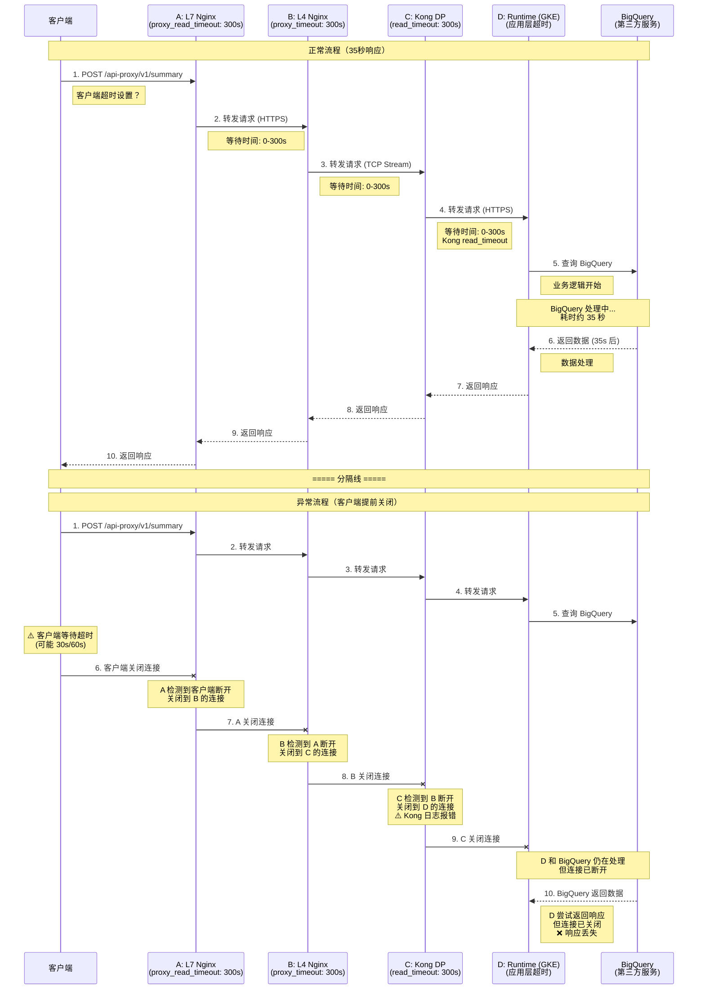
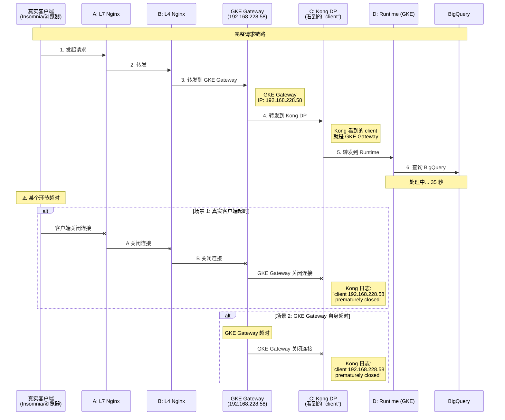
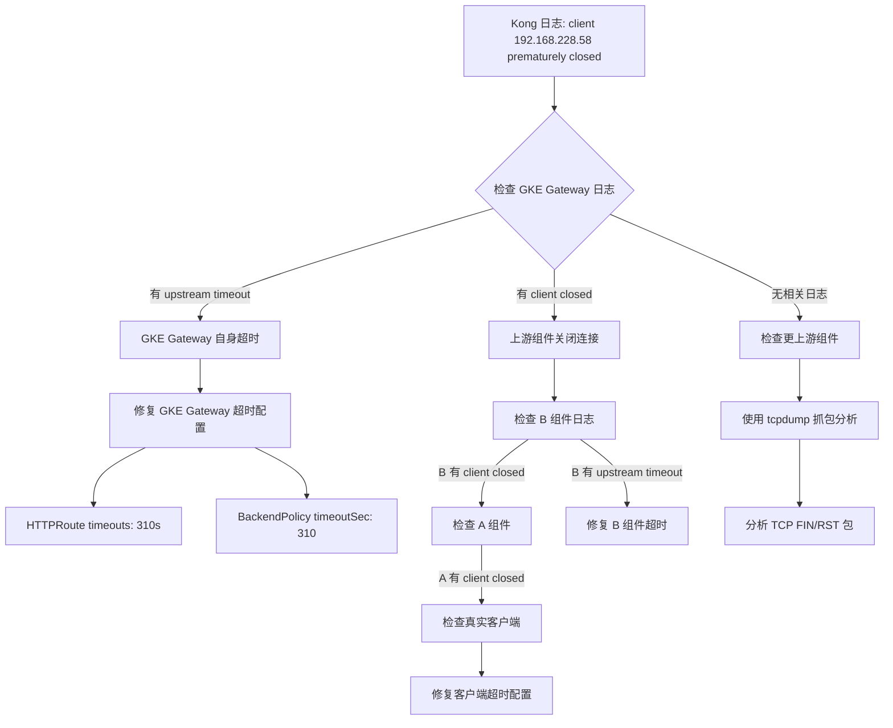

# 超时流程验证与调试指南

## 架构概览

```
Client → A (L7 Nginx) → B (L4 Nginx) → C (Kong DP) → D (GKE Runtime/API Endpoint)
         [300s timeout]   [300s timeout]  [300s timeout]  [应用层超时]
```

**目标：** 验证整个请求链路支持 300 秒（5 分钟）的超时设置。

---

## 1. 快速验证方案

### 方案 1：使用 curl 模拟慢速响应（推荐）

**原理：** 通过 curl 的 `--max-time` 参数验证整个链路的超时行为。

```bash
# 基础测试：验证 300 秒超时是否生效
time curl -v \
  --max-time 310 \
  -H "Host: www.aibang.com" \
  -X GET \
  "https://your-entry-point.com/abc/v1/your-endpoint" \
  -o /dev/null

# 预期结果：
# - 如果后端在 300 秒内响应：请求成功
# - 如果后端超过 300 秒：应该在 ~300 秒时收到超时错误
```

**参数说明：**
- `--max-time 310`：客户端最大等待时间（略大于服务端超时）
- `-v`：详细输出，显示连接和传输过程
- `time`：测量实际执行时间

---

### 方案 2：使用后端模拟延迟端点

**步骤 1：在 D 组件（GKE Runtime）创建测试端点**

如果你的 API 支持，可以创建一个模拟延迟的测试端点：

```python
# Python Flask 示例
from flask import Flask
import time

app = Flask(__name__)

@app.route('/test/delay/<int:seconds>')
def delay_response(seconds):
    """模拟延迟响应"""
    time.sleep(seconds)
    return {
        "status": "success",
        "delayed_seconds": seconds,
        "message": f"Response after {seconds} seconds"
    }

if __name__ == '__main__':
    app.run(host='0.0.0.0', port=8080)
```

**步骤 2：通过完整链路测试**

```bash
# 测试 30 秒延迟（应该成功）
time curl -v \
  -H "Host: www.aibang.com" \
  "https://your-entry-point.com/abc/v1/test/delay/30"

# 测试 180 秒延迟（应该成功）
time curl -v \
  -H "Host: www.aibang.com" \
  "https://your-entry-point.com/abc/v1/test/delay/180"

# 测试 310 秒延迟（应该超时）
time curl -v \
  -H "Host: www.aibang.com" \
  "https://your-entry-point.com/abc/v1/test/delay/310"
```

---

### 方案 3：使用 httpbin.org 的延迟端点（外部测试）

如果可以临时修改 Kong 路由到外部服务：

```bash
# httpbin.org 提供延迟测试端点
# /delay/{n} - 延迟 n 秒后响应（最大 10 秒）

# 测试 10 秒延迟
time curl -v \
  -H "Host: www.aibang.com" \
  "https://your-entry-point.com/abc/v1/delay/10"
```

---

## 2. 分段验证方案

逐个组件验证超时配置，定位问题点。

### 2.1 验证 A 组件（L7 Nginx）

**直接访问 A 组件：**

```bash
# 假设 A 组件的 IP 是 192.168.1.100
time curl -v \
  --max-time 310 \
  -H "Host: www.aibang.com" \
  -X GET \
  "https://192.168.1.100/abc/v1/your-endpoint"

# 检查 Nginx 日志
ssh user@192.168.1.100
tail -f /var/log/nginx/access.log
tail -f /var/log/nginx/error.log
```

**验证 Nginx 配置：**

```bash
# 登录 A 组件
ssh user@192.168.1.100

# 检查配置
nginx -T | grep -A 10 "location /abc/v1/"

# 确认超时设置
nginx -T | grep -E "proxy_read_timeout|proxy_connect_timeout|proxy_send_timeout"

# 预期输出：
# proxy_read_timeout 300s;
# proxy_connect_timeout 300s;
# proxy_send_timeout 300s;
```

---

### 2.2 验证 B 组件（L4 Nginx）

**检查 B 组件配置：**

```bash
# 登录 B 组件
ssh user@192.168.0.188

# 检查 Nginx Stream 配置
cat /etc/nginx/nginx.conf | grep -A 10 "listen 8080"

# 确认超时设置
cat /etc/nginx/nginx.conf | grep "proxy_timeout"

# 预期输出：
# proxy_timeout 300s;
```

**验证 TCP 连接：**

```bash
# 从 A 组件测试到 B 组件的连接
telnet 192.168.0.188 8080

# 或使用 nc
nc -zv 192.168.0.188 8080
```

---

### 2.3 验证 C 组件（Kong DP）

**检查 Kong 配置：**

```bash
# 如果 Kong 使用 Helm 部署
kubectl get configmap -n kong-namespace kong-config -o yaml

# 检查 Kong 的超时设置
kubectl exec -it -n kong-namespace <kong-pod-name> -- kong config db_export

# 或通过 Admin API 检查
curl -s http://kong-admin:8001/services/<service-name> | jq '.read_timeout, .write_timeout, .connect_timeout'
```

**验证 Kong 路由：**

```bash
# 列出所有路由
curl -s http://kong-admin:8001/routes | jq '.data[] | {name, paths, service}'

# 检查特定路由的超时设置
curl -s http://kong-admin:8001/routes/<route-id> | jq
```

**Kong 超时配置示例：**

```yaml
# Kong Service 配置
apiVersion: configuration.konghq.com/v1
kind: KongService
metadata:
  name: backend-service
spec:
  protocol: https
  host: backend.example.com
  port: 443
  read_timeout: 300000    # 毫秒
  write_timeout: 300000   # 毫秒
  connect_timeout: 60000  # 毫秒
```

---

### 2.4 验证 D 组件（GKE Runtime）

**检查 Kubernetes Service 和 Pod：**

```bash
# 查看 Service 配置
kubectl get svc -n your-namespace your-service -o yaml

# 查看 Pod 日志
kubectl logs -n your-namespace -l app=your-app --tail=100 -f

# 检查 Pod 的资源限制
kubectl describe pod -n your-namespace <pod-name> | grep -A 5 "Limits\|Requests"
```

**验证应用层超时：**

根据你的应用框架，检查超时配置：

```bash
# 示例：Java Spring Boot
# application.properties 或 application.yml
server.connection-timeout=300000
spring.mvc.async.request-timeout=300000

# 示例：Node.js Express
# server.js
server.timeout = 300000; // 毫秒

# 示例：Python Flask/Gunicorn
# gunicorn.conf.py
timeout = 300
```

---

## 3. 端到端验证脚本

### 3.1 自动化测试脚本

```bash
#!/bin/bash
# timeout-test.sh - 超时流程自动化测试脚本

set -euo pipefail

# 配置
ENTRY_POINT="https://your-entry-point.com"
HOST_HEADER="www.aibang.com"
TEST_PATH="/abc/v1/test/delay"
TIMEOUT_THRESHOLD=300

# 颜色定义
RED='\033[0;31m'
GREEN='\033[0;32m'
YELLOW='\033[1;33m'
BLUE='\033[0;34m'
NC='\033[0m'

log_info() {
    echo -e "${GREEN}[INFO]${NC} $*"
}

log_warn() {
    echo -e "${YELLOW}[WARN]${NC} $*"
}

log_error() {
    echo -e "${RED}[ERROR]${NC} $*"
}

# 测试函数
test_timeout() {
    local delay=$1
    local description=$2
    
    log_info "测试: $description (延迟 ${delay}s)"
    
    local start_time=$(date +%s)
    local http_code
    local curl_exit_code
    
    http_code=$(curl -s -o /dev/null -w "%{http_code}" \
        --max-time $((delay + 10)) \
        -H "Host: $HOST_HEADER" \
        "${ENTRY_POINT}${TEST_PATH}/${delay}" \
        2>/dev/null) || curl_exit_code=$?
    
    local end_time=$(date +%s)
    local elapsed=$((end_time - start_time))
    
    if [[ ${curl_exit_code:-0} -eq 0 && "$http_code" == "200" ]]; then
        log_info "✓ 成功 - HTTP $http_code, 耗时 ${elapsed}s"
        return 0
    elif [[ ${curl_exit_code:-0} -eq 28 ]]; then
        log_warn "✗ 超时 - 耗时 ${elapsed}s (curl 超时)"
        return 1
    else
        log_error "✗ 失败 - HTTP $http_code, 耗时 ${elapsed}s, 退出码 ${curl_exit_code:-0}"
        return 2
    fi
}

# 主测试流程
main() {
    log_info "开始超时流程验证测试"
    log_info "入口点: $ENTRY_POINT"
    log_info "超时阈值: ${TIMEOUT_THRESHOLD}s"
    echo ""
    
    # 测试 1: 短延迟（应该成功）
    test_timeout 10 "短延迟测试"
    echo ""
    
    # 测试 2: 中等延迟（应该成功）
    test_timeout 60 "中等延迟测试"
    echo ""
    
    # 测试 3: 接近阈值（应该成功）
    test_timeout 180 "接近阈值测试"
    echo ""
    
    # 测试 4: 略低于阈值（应该成功）
    test_timeout 290 "略低于阈值测试"
    echo ""
    
    # 测试 5: 超过阈值（应该超时）
    log_warn "注意: 下一个测试预期会超时"
    test_timeout 310 "超过阈值测试（预期超时）"
    echo ""
    
    log_info "测试完成"
}

main "$@"
```

**使用方法：**

```bash
# 添加执行权限
chmod +x timeout-test.sh

# 运行测试
./timeout-test.sh

# 保存测试结果
./timeout-test.sh | tee timeout-test-results.log
```

---

### 3.2 使用 Apache Bench (ab) 进行压力测试

```bash
# 安装 ab
sudo apt-get install apache2-utils  # Ubuntu/Debian
sudo yum install httpd-tools         # CentOS/RHEL

# 并发测试（10 个并发，总共 100 个请求）
ab -n 100 -c 10 \
   -H "Host: www.aibang.com" \
   -s 310 \
   "https://your-entry-point.com/abc/v1/your-endpoint"

# 参数说明：
# -n 100: 总请求数
# -c 10: 并发数
# -s 310: 超时时间（秒）
```

---

### 3.3 使用 wrk 进行高级压力测试

```bash
# 安装 wrk
git clone https://github.com/wg/wrk.git
cd wrk
make
sudo cp wrk /usr/local/bin/

# 运行测试（持续 30 秒，10 个线程，100 个连接）
wrk -t10 -c100 -d30s \
    -H "Host: www.aibang.com" \
    --timeout 310s \
    "https://your-entry-point.com/abc/v1/your-endpoint"
```

---

## 4. 监控和日志分析

### 4.1 实时监控请求流

**在 A 组件（L7 Nginx）：**

```bash
# 实时查看访问日志
tail -f /var/log/nginx/access.log | grep "/abc/v1/"

# 查看错误日志（关注超时错误）
tail -f /var/log/nginx/error.log | grep -E "timeout|upstream"

# 统计超时错误
grep "upstream timed out" /var/log/nginx/error.log | wc -l
```

**在 B 组件（L4 Nginx）：**

```bash
# 查看 Stream 日志
tail -f /opt/access-in.log

# 检查连接状态
netstat -an | grep 8080 | grep ESTABLISHED | wc -l
```

**在 C 组件（Kong DP）：**

```bash
# 查看 Kong 日志
kubectl logs -n kong-namespace -l app=kong -f

# 查看特定 Pod 的日志
kubectl logs -n kong-namespace <kong-pod-name> -f

# 过滤超时相关日志
kubectl logs -n kong-namespace -l app=kong --tail=1000 | grep -i timeout
```

**在 D 组件（GKE Runtime）：**

```bash
# 查看应用日志
kubectl logs -n your-namespace -l app=your-app -f

# 查看最近的错误
kubectl logs -n your-namespace -l app=your-app --tail=100 | grep -i error

# 查看 Pod 事件
kubectl get events -n your-namespace --sort-by='.lastTimestamp'
```

---

### 4.2 使用 tcpdump 抓包分析

```bash
# 在 A 组件抓包
sudo tcpdump -i any -nn -s0 -w /tmp/a-component.pcap \
    'host 192.168.0.188 and port 8080'

# 在 B 组件抓包
sudo tcpdump -i any -nn -s0 -w /tmp/b-component.pcap \
    'host 10.0.0.5 and port 443'

# 分析抓包文件
tcpdump -r /tmp/a-component.pcap -nn -A | less
```

---

### 4.3 使用 strace 跟踪系统调用

```bash
# 跟踪 Nginx worker 进程
ps aux | grep nginx | grep worker
sudo strace -p <nginx-worker-pid> -f -e trace=network -o /tmp/nginx-strace.log

# 分析 strace 输出
grep -E "connect|sendto|recvfrom|close" /tmp/nginx-strace.log
```

---

## 5. 常见问题排查

### 问题 1：请求在 30 秒时超时

**可能原因：**
- GCP Load Balancer 的默认超时（虽然文档说会忽略，但需要验证）
- 某个组件的超时配置未生效

**排查步骤：**

```bash
# 1. 检查 GCP Backend Service 配置
gcloud compute backend-services describe <backend-service-name> \
    --global \
    --format="value(timeoutSec)"

# 2. 验证 Nginx 配置是否重载
nginx -t && nginx -s reload

# 3. 检查 Nginx 进程是否使用了新配置
ps aux | grep nginx
sudo kill -HUP <nginx-master-pid>
```

---

### 问题 2：请求在 60 秒时超时

**可能原因：**
- Kong 的默认超时（60 秒）
- Kubernetes Service 的默认超时

**排查步骤：**

```bash
# 1. 检查 Kong Service 配置
curl -s http://kong-admin:8001/services/<service-name> | jq

# 2. 更新 Kong Service 超时
curl -X PATCH http://kong-admin:8001/services/<service-name> \
    -d "read_timeout=300000" \
    -d "write_timeout=300000" \
    -d "connect_timeout=60000"

# 3. 验证更新
curl -s http://kong-admin:8001/services/<service-name> | jq '.read_timeout'
```

---

### 问题 3：请求在 300 秒前随机超时

**可能原因：**
- 网络不稳定
- 后端应用崩溃或重启
- 资源不足（CPU/内存）

**排查步骤：**

```bash
# 1. 检查 Pod 重启次数
kubectl get pods -n your-namespace -o wide

# 2. 查看 Pod 资源使用
kubectl top pods -n your-namespace

# 3. 检查节点资源
kubectl top nodes

# 4. 查看 Pod 事件
kubectl describe pod -n your-namespace <pod-name> | grep -A 20 Events
```

---

## 6. 验证清单

使用以下清单确保所有配置正确：

### A 组件（L7 Nginx）验证清单

- [ ] `proxy_read_timeout 300s;` 已配置
- [ ] `proxy_connect_timeout 300s;` 已配置
- [ ] `proxy_send_timeout 300s;` 已配置
- [ ] Nginx 配置已重载（`nginx -s reload`）
- [ ] 错误日志中无超时错误
- [ ] 可以直接访问 A 组件并测试

**验证命令：**
```bash
nginx -T | grep -E "proxy_read_timeout|proxy_connect_timeout|proxy_send_timeout"
```

---

### B 组件（L4 Nginx）验证清单

- [ ] `proxy_timeout 300s;` 已配置（Stream 模块）
- [ ] Nginx 配置已重载
- [ ] TCP 连接正常（`telnet` 或 `nc` 测试）
- [ ] 日志中无连接错误

**验证命令：**
```bash
cat /etc/nginx/nginx.conf | grep "proxy_timeout"
netstat -an | grep 8080
```

---

### C 组件（Kong DP）验证清单

- [ ] Service `read_timeout` 设置为 300000ms
- [ ] Service `write_timeout` 设置为 300000ms
- [ ] Service `connect_timeout` 设置为 60000ms
- [ ] Kong 配置已应用（重启或热更新）
- [ ] 路由配置正确

**验证命令：**
```bash
curl -s http://kong-admin:8001/services/<service-name> | jq '.read_timeout, .write_timeout'
```

---

### D 组件（GKE Runtime）验证清单

- [ ] 应用层超时配置正确（根据框架）
- [ ] Pod 资源充足（CPU/内存）
- [ ] Pod 无频繁重启
- [ ] 应用日志无超时错误
- [ ] Service 和 Ingress 配置正确

**验证命令：**
```bash
kubectl get pods -n your-namespace
kubectl top pods -n your-namespace
kubectl logs -n your-namespace -l app=your-app --tail=50
```

---

## 7. 推荐的测试流程

### 阶段 1：基础连通性测试（5 分钟）

```bash
# 1. 测试短延迟（10 秒）
curl -v -H "Host: www.aibang.com" \
    "https://your-entry-point.com/abc/v1/test/delay/10"

# 2. 检查所有组件日志
# A: tail -f /var/log/nginx/access.log
# B: tail -f /opt/access-in.log
# C: kubectl logs -n kong -l app=kong -f
# D: kubectl logs -n your-ns -l app=your-app -f
```

---

### 阶段 2：中等延迟测试（10 分钟）

```bash
# 测试 60 秒、120 秒、180 秒延迟
for delay in 60 120 180; do
    echo "Testing ${delay}s delay..."
    time curl -v -H "Host: www.aibang.com" \
        "https://your-entry-point.com/abc/v1/test/delay/${delay}"
    echo ""
done
```

---

### 阶段 3：边界测试（15 分钟）

```bash
# 测试接近和超过 300 秒的延迟
for delay in 290 295 300 305 310; do
    echo "Testing ${delay}s delay..."
    time curl -v --max-time 320 \
        -H "Host: www.aibang.com" \
        "https://your-entry-point.com/abc/v1/test/delay/${delay}"
    echo ""
    sleep 5
done
```

---

### 阶段 4：并发压力测试（20 分钟）

```bash
# 使用 ab 进行并发测试
ab -n 50 -c 5 -s 310 \
    -H "Host: www.aibang.com" \
    "https://your-entry-point.com/abc/v1/test/delay/180"
```

---

## 8. 生产环境最佳实践

### 8.1 超时配置建议

| 组件 | 配置项 | 推荐值 | 说明 |
|------|--------|--------|------|
| A (L7 Nginx) | `proxy_read_timeout` | 300s | 读取后端响应超时 |
| A (L7 Nginx) | `proxy_connect_timeout` | 60s | 连接后端超时 |
| A (L7 Nginx) | `proxy_send_timeout` | 300s | 发送请求到后端超时 |
| B (L4 Nginx) | `proxy_timeout` | 300s | TCP 代理超时 |
| C (Kong) | `read_timeout` | 300000ms | 读取上游响应超时 |
| C (Kong) | `write_timeout` | 300000ms | 写入上游请求超时 |
| C (Kong) | `connect_timeout` | 60000ms | 连接上游超时 |
| D (Runtime) | 应用层超时 | 300s | 根据框架配置 |

---

### 8.2 监控告警配置

```yaml
# Prometheus 告警规则示例
groups:
  - name: timeout_alerts
    rules:
      - alert: HighTimeoutRate
        expr: rate(nginx_http_requests_total{status="504"}[5m]) > 0.1
        for: 5m
        labels:
          severity: warning
        annotations:
          summary: "High timeout rate detected"
          description: "Timeout rate is {{ $value }} requests/sec"
      
      - alert: SlowResponseTime
        expr: histogram_quantile(0.95, rate(http_request_duration_seconds_bucket[5m])) > 200
        for: 10m
        labels:
          severity: warning
        annotations:
          summary: "95th percentile response time > 200s"
```

---

### 8.3 日志格式优化

**Nginx 日志格式（包含响应时间）：**

```nginx
log_format detailed '$remote_addr - $remote_user [$time_local] '
                    '"$request" $status $body_bytes_sent '
                    '"$http_referer" "$http_user_agent" '
                    'rt=$request_time uct="$upstream_connect_time" '
                    'uht="$upstream_header_time" urt="$upstream_response_time"';

access_log /var/log/nginx/access.log detailed;
```

---

## 9. 故障恢复预案

### 场景 1：超时配置未生效

**快速回滚：**

```bash
# A 组件
ssh user@a-component
cd /etc/nginx
cp nginx.conf.backup nginx.conf
nginx -t && nginx -s reload

# C 组件（Kong）
kubectl rollout undo deployment/kong -n kong-namespace
```

---

### 场景 2：大量请求超时

**临时缓解措施：**

```bash
# 1. 增加后端 Pod 副本数
kubectl scale deployment/your-app -n your-namespace --replicas=10

# 2. 启用 HPA（如果未启用）
kubectl autoscale deployment/your-app -n your-namespace \
    --min=3 --max=20 --cpu-percent=70

# 3. 检查并清理僵尸连接
netstat -an | grep TIME_WAIT | wc -l
```

---

## 10. 深度问题分析：客户端提前关闭连接

### 10.1 问题场景描述

**症状：**
- A、B、C 组件超时配置都已正确设置（300s）
- D 组件（Runtime）业务逻辑正常，从 BigQuery 获取数据耗时 35 秒
- 但客户端请求仍然超时

**Kong 日志错误：**
```
2026/02/25 07:07:41 [info] 2457#0: *145418 epoll_wait() reported that 
client prematurely closed connection, so upstream connection is closed too 
while reading response header from upstream, 
client: 192.168.228.58, 
server: kong, 
request: "POST /api-proxy/v1/summary HTTP/1.1", 
upstream: "https://100.68.104.8:8443/api/v1.1.0/summary", 
host: "dev-api.aliyun.cloud.aibang", 
request_id: "fc13c9604f468dad7dada8cdcdaa"
```

**关键信息：**
- `client prematurely closed connection` - 客户端提前关闭连接
- `upstream connection is closed too` - 导致上游连接也被关闭
- `while reading response header from upstream` - 发生在读取上游响应头时

---

### 10.2 完整请求流程图



---

### 10.3 问题根因分析

#### 根因：客户端超时设置过短

**Kong 日志的真正含义：**

```
client prematurely closed connection
```

这表示：
1. Kong 正在等待 Runtime (D) 的响应
2. Runtime 正在处理请求（查询 BigQuery）
3. **但客户端在收到响应之前就关闭了连接**
4. Kong 检测到客户端断开，于是也关闭了到 Runtime 的连接

**关键点：**
- 不是 Kong 超时（Kong 的 300s 配置是正确的）
- 不是 Runtime 超时（35s 处理时间正常）
- **是客户端的超时设置太短**

---

### 10.4 客户端超时设置检查

#### 常见客户端超时配置

**1. curl 命令：**
```bash
# 默认没有超时限制，但可能被设置
curl --max-time 30  # 总超时 30 秒
curl --connect-timeout 10  # 连接超时 10 秒
```

**2. Python requests：**
```python
import requests

# 默认没有超时！
response = requests.post(url, data=data)

# 常见错误配置
response = requests.post(url, data=data, timeout=30)  # 30 秒超时

# 正确配置
response = requests.post(url, data=data, timeout=310)  # 310 秒超时
# 或
response = requests.post(url, data=data, timeout=(10, 310))  # (连接超时, 读取超时)
```

**3. Java HttpClient：**
```java
// 默认超时可能很短
HttpClient client = HttpClient.newBuilder()
    .connectTimeout(Duration.ofSeconds(60))
    .build();

HttpRequest request = HttpRequest.newBuilder()
    .uri(URI.create(url))
    .timeout(Duration.ofSeconds(30))  // ❌ 太短
    .POST(bodyPublisher)
    .build();

// 正确配置
HttpRequest request = HttpRequest.newBuilder()
    .uri(URI.create(url))
    .timeout(Duration.ofSeconds(310))  // ✅ 足够长
    .POST(bodyPublisher)
    .build();
```

**4. Node.js axios：**
```javascript
const axios = require('axios');

// 默认没有超时
axios.post(url, data);

// 常见错误配置
axios.post(url, data, { timeout: 30000 });  // 30 秒

// 正确配置
axios.post(url, data, { timeout: 310000 });  // 310 秒
```

**5. Go http.Client：**
```go
// 默认没有超时
client := &http.Client{}

// 常见错误配置
client := &http.Client{
    Timeout: 30 * time.Second,  // 30 秒
}

// 正确配置
client := &http.Client{
    Timeout: 310 * time.Second,  // 310 秒
}
```

---

### 10.5 排查步骤

#### 步骤 1：确认客户端超时设置

**检查客户端代码：**

```bash
# 如果是脚本调用
grep -r "timeout" /path/to/client/code/
grep -r "max-time" /path/to/client/code/
grep -r "connect-timeout" /path/to/client/code/

# 检查环境变量
env | grep -i timeout
```

**常见超时位置：**
- 应用代码中的 HTTP 客户端配置
- 负载均衡器/API Gateway 的客户端超时
- 浏览器超时（通常 2-5 分钟）
- 代理服务器超时

---

#### 步骤 2：使用 tcpdump 确认断开来源

**在 Kong Pod 上抓包：**

```bash
# 进入 Kong Pod
kubectl exec -it -n kong-namespace <kong-pod-name> -- bash

# 安装 tcpdump（如果没有）
apt-get update && apt-get install -y tcpdump

# 抓包（监听客户端连接）
tcpdump -i any -nn -s0 -A \
    'host 192.168.228.58 and port 8000' \
    -w /tmp/kong-client.pcap

# 在另一个终端触发请求
# ...

# 分析抓包
tcpdump -r /tmp/kong-client.pcap -nn -A | grep -E "FIN|RST"
```

**分析 TCP 标志：**
- `FIN` - 正常关闭连接
- `RST` - 强制关闭连接（通常是超时）

---

#### 步骤 3：检查中间组件的超时

**可能被忽略的超时点：**

**A 组件（L7 Nginx）额外检查：**
```bash
# 检查 keepalive 超时
nginx -T | grep keepalive_timeout

# 检查 client body 超时
nginx -T | grep client_body_timeout

# 检查 send 超时
nginx -T | grep send_timeout
```

**B 组件（L4 Nginx）额外检查：**
```bash
# 检查 proxy_connect_timeout
cat /etc/nginx/nginx.conf | grep proxy_connect_timeout
```

**GCP Load Balancer：**
```bash
# 虽然文档说 TCP LB 忽略超时，但仍需确认
gcloud compute backend-services describe <backend-service-name> \
    --global \
    --format="value(timeoutSec)"

# 检查 forwarding rule
gcloud compute forwarding-rules describe <forwarding-rule-name> \
    --global
```

---

#### 步骤 4：模拟客户端行为

**创建测试脚本，逐步增加超时：**

```bash
#!/bin/bash
# test-client-timeout.sh

URL="https://dev-api.aliyun.cloud.aibang/api-proxy/v1/summary"
HOST="dev-api.aliyun.cloud.aibang"

echo "测试不同的客户端超时设置"

# 测试 1: 30 秒超时（预期失败）
echo "=== 测试 30 秒超时 ==="
time curl -v --max-time 30 \
    -H "Host: $HOST" \
    -X POST "$URL" \
    -d '{"query": "test"}' \
    2>&1 | grep -E "timeout|closed|error"

sleep 5

# 测试 2: 60 秒超时（预期失败）
echo "=== 测试 60 秒超时 ==="
time curl -v --max-time 60 \
    -H "Host: $HOST" \
    -X POST "$URL" \
    -d '{"query": "test"}' \
    2>&1 | grep -E "timeout|closed|error"

sleep 5

# 测试 3: 120 秒超时（可能成功）
echo "=== 测试 120 秒超时 ==="
time curl -v --max-time 120 \
    -H "Host: $HOST" \
    -X POST "$URL" \
    -d '{"query": "test"}' \
    2>&1 | grep -E "timeout|closed|error|200 OK"

sleep 5

# 测试 4: 310 秒超时（应该成功）
echo "=== 测试 310 秒超时 ==="
time curl -v --max-time 310 \
    -H "Host: $HOST" \
    -X POST "$URL" \
    -d '{"query": "test"}' \
    2>&1 | grep -E "timeout|closed|error|200 OK"
```

---

### 10.6 Kong 日志深度分析

#### 日志字段解析

```
2026/02/25 07:07:41 [info] 2457#0: *145418 
epoll_wait() reported that client prematurely closed connection, 
so upstream connection is closed too 
while reading response header from upstream, 
client: 192.168.228.58, 
server: kong, 
request: "POST /api-proxy/v1/summary HTTP/1.1", 
upstream: "https://100.68.104.8:8443/api/v1.1.0/summary", 
host: "dev-api.aliyun.cloud.aibang", 
request_id: "fc13c9604f468dad7dada8cdcdaa"
```

**字段含义：**

| 字段 | 值 | 含义 |
|------|-----|------|
| 时间戳 | `2026/02/25 07:07:41` | 错误发生时间 |
| 日志级别 | `[info]` | 信息级别（不是错误） |
| Worker PID | `2457#0` | Kong worker 进程 ID |
| 连接 ID | `*145418` | 内部连接编号 |
| 事件 | `epoll_wait()` | Linux I/O 多路复用 |
| 根因 | `client prematurely closed` | **客户端提前关闭** |
| 后果 | `upstream connection is closed too` | 上游连接也被关闭 |
| 阶段 | `while reading response header` | 正在读取响应头 |
| 客户端 IP | `192.168.228.58` | 发起请求的客户端 |
| 上游地址 | `100.68.104.8:8443` | Runtime Pod Service IP |
| Request ID | `fc13c9604f468dad7dada8cdcdaa` | 用于追踪 |

**关键结论：**
- Kong 本身没有超时（否则日志会是 `upstream timed out`）
- 客户端主动关闭了连接（`prematurely closed`）
- 发生在 Kong 等待 Runtime 响应的过程中

---

#### 相关 Kong 日志对比

**正常日志（无超时）：**
```
2026/02/25 07:10:00 [info] 2457#0: *145500 
upstream response time: 35.234, 
request time: 35.456, 
client: 192.168.228.58, 
request: "POST /api-proxy/v1/summary HTTP/1.1", 
upstream: "https://100.68.104.8:8443/api/v1.1.0/summary", 
status: 200
```

**Kong 超时日志（如果是 Kong 超时）：**
```
2026/02/25 07:10:00 [error] 2457#0: *145500 
upstream timed out (110: Connection timed out) 
while reading response header from upstream, 
client: 192.168.228.58, 
upstream: "https://100.68.104.8:8443/api/v1.1.0/summary"
```

**对比：**
- 你的日志：`client prematurely closed` → 客户端问题
- Kong 超时：`upstream timed out` → Kong 配置问题

---

### 10.7 完整排查清单

#### 清单 1：客户端检查

- [ ] 检查客户端代码中的超时设置
- [ ] 检查客户端使用的 HTTP 库默认超时
- [ ] 检查客户端所在环境的代理超时
- [ ] 检查客户端的负载均衡器超时
- [ ] 检查浏览器超时（如果是浏览器客户端）

**验证命令：**
```bash
# 使用 curl 模拟客户端，逐步增加超时
for timeout in 30 60 120 180 240 300; do
    echo "Testing timeout: ${timeout}s"
    time curl --max-time $timeout -X POST \
        "https://dev-api.aliyun.cloud.aibang/api-proxy/v1/summary" \
        -d '{"query": "test"}'
    echo ""
done
```

---

#### 清单 2：中间组件检查

- [ ] A 组件：`proxy_read_timeout 300s`
- [ ] A 组件：`proxy_send_timeout 300s`
- [ ] A 组件：`keepalive_timeout` 不要太短
- [ ] B 组件：`proxy_timeout 300s`
- [ ] C 组件：Kong `read_timeout 300000ms`
- [ ] C 组件：Kong `write_timeout 300000ms`
- [ ] GCP LB：确认 backend service 配置

**验证命令：**
```bash
# A 组件
ssh user@a-component "nginx -T | grep -E 'proxy_read_timeout|proxy_send_timeout|keepalive_timeout'"

# B 组件
ssh user@b-component "cat /etc/nginx/nginx.conf | grep proxy_timeout"

# C 组件
kubectl exec -n kong-namespace <kong-pod-name> -- \
    curl -s http://localhost:8001/services/<service-name> | \
    jq '.read_timeout, .write_timeout, .connect_timeout'
```

---

#### 清单 3：Runtime (D) 检查

- [ ] 应用层超时配置（根据框架）
- [ ] BigQuery 客户端超时设置
- [ ] 应用日志中是否有超时错误
- [ ] Pod 资源是否充足
- [ ] 是否有 OOM 或重启

**验证命令：**
```bash
# 检查 Pod 状态
kubectl get pods -n your-namespace -o wide

# 检查应用日志
kubectl logs -n your-namespace -l app=your-app --tail=100 | grep -i timeout

# 检查 BigQuery 查询时间
kubectl logs -n your-namespace -l app=your-app --tail=100 | grep -i bigquery
```

---

### 10.8 解决方案

#### 方案 1：修复客户端超时（推荐）

**找到客户端代码并修改：**

```python
# Python 示例
import requests

# 修改前（错误）
response = requests.post(url, json=data, timeout=30)

# 修改后（正确）
response = requests.post(url, json=data, timeout=310)
# 或更精确的配置
response = requests.post(url, json=data, timeout=(10, 310))  # (连接, 读取)
```

```javascript
// Node.js 示例
const axios = require('axios');

// 修改前（错误）
axios.post(url, data, { timeout: 30000 });

// 修改后（正确）
axios.post(url, data, { timeout: 310000 });
```

---

#### 方案 2：优化 Runtime 处理时间

如果无法修改客户端，考虑优化 Runtime：

**异步处理模式：**

```python
# 方案 A：立即返回，异步处理
@app.route('/api/v1.1.0/summary', methods=['POST'])
def summary():
    # 1. 立即返回任务 ID
    task_id = create_async_task(request.json)
    return jsonify({
        'task_id': task_id,
        'status': 'processing',
        'status_url': f'/api/v1.1.0/tasks/{task_id}'
    }), 202  # 202 Accepted

# 2. 客户端轮询状态
@app.route('/api/v1.1.0/tasks/<task_id>', methods=['GET'])
def get_task_status(task_id):
    result = get_task_result(task_id)
    if result.is_complete:
        return jsonify(result.data), 200
    else:
        return jsonify({'status': 'processing'}), 202
```

**缓存优化：**

```python
from functools import lru_cache
import redis

# 使用 Redis 缓存 BigQuery 结果
redis_client = redis.Redis(host='redis', port=6379)

@app.route('/api/v1.1.0/summary', methods=['POST'])
def summary():
    cache_key = generate_cache_key(request.json)
    
    # 检查缓存
    cached_result = redis_client.get(cache_key)
    if cached_result:
        return jsonify(json.loads(cached_result)), 200
    
    # 查询 BigQuery
    result = query_bigquery(request.json)
    
    # 缓存结果（5 分钟）
    redis_client.setex(cache_key, 300, json.dumps(result))
    
    return jsonify(result), 200
```

---

#### 方案 3：添加中间层缓冲

**在 Kong 前添加 API Gateway 层：**

```yaml
# Cloud Endpoints 或 Apigee 配置
swagger: "2.0"
info:
  title: "API Gateway"
  version: "1.0.0"
paths:
  /api-proxy/v1/summary:
    post:
      x-google-backend:
        address: https://kong-endpoint
        deadline: 310.0  # 310 秒超时
```

---

### 10.9 监控和告警

**添加客户端超时监控：**

```yaml
# Prometheus 告警规则
groups:
  - name: client_timeout_alerts
    rules:
      - alert: HighClientPrematureCloseRate
        expr: |
          rate(kong_nginx_http_current_connections{state="closed"}[5m]) > 10
        for: 5m
        labels:
          severity: warning
        annotations:
          summary: "High rate of client premature connection closes"
          description: "{{ $value }} connections/sec are being closed by clients"
      
      - alert: SlowBigQueryQueries
        expr: |
          histogram_quantile(0.95, 
            rate(bigquery_query_duration_seconds_bucket[5m])
          ) > 30
        for: 10m
        labels:
          severity: warning
        annotations:
          summary: "BigQuery queries are slow"
          description: "95th percentile query time is {{ $value }}s"
```

**Kong 日志监控：**

```bash
# 实时监控客户端提前关闭
kubectl logs -n kong-namespace -l app=kong -f | \
    grep "client prematurely closed"

# 统计频率
kubectl logs -n kong-namespace -l app=kong --tail=10000 | \
    grep "client prematurely closed" | wc -l
```

---

### 10.10 最终验证

**完整测试流程：**

```bash
#!/bin/bash
# final-validation.sh

echo "=== 最终验证测试 ==="

# 1. 确认所有组件配置
echo "1. 检查组件配置..."
ssh user@a-component "nginx -T | grep proxy_read_timeout"
ssh user@b-component "cat /etc/nginx/nginx.conf | grep proxy_timeout"
kubectl exec -n kong <kong-pod> -- curl -s localhost:8001/services/<svc> | jq .read_timeout

# 2. 测试客户端超时
echo "2. 测试客户端超时设置..."
time curl -v --max-time 310 \
    -X POST "https://dev-api.aliyun.cloud.aibang/api-proxy/v1/summary" \
    -H "Content-Type: application/json" \
    -d '{"query": "test"}'

# 3. 检查 Kong 日志
echo "3. 检查 Kong 日志..."
kubectl logs -n kong-namespace -l app=kong --tail=50 | \
    grep -E "prematurely closed|upstream timed out|200 OK"

# 4. 检查 Runtime 日志
echo "4. 检查 Runtime 日志..."
kubectl logs -n your-namespace -l app=your-app --tail=50 | \
    grep -E "BigQuery|summary|error"

echo "=== 测试完成 ==="
```

---

## 11. 总结

**关键验证命令（一键复制）：**

```bash
# 快速端到端测试
time curl -v --max-time 310 \
    -H "Host: www.aibang.com" \
    "https://your-entry-point.com/abc/v1/your-endpoint"

# 检查所有组件配置
echo "=== A Component (L7 Nginx) ==="
ssh user@a-component "nginx -T | grep -E 'proxy_read_timeout|proxy_connect_timeout|proxy_send_timeout'"

echo "=== B Component (L4 Nginx) ==="
ssh user@b-component "cat /etc/nginx/nginx.conf | grep proxy_timeout"

echo "=== C Component (Kong) ==="
curl -s http://kong-admin:8001/services/<service-name> | jq '.read_timeout, .write_timeout, .connect_timeout'

echo "=== D Component (GKE Runtime) ==="
kubectl get pods -n your-namespace
kubectl logs -n your-namespace -l app=your-app --tail=20
```

**验证成功标准：**
- ✅ 180 秒延迟请求成功返回
- ✅ 290 秒延迟请求成功返回
- ✅ 310 秒延迟请求在 ~300 秒时超时
- ✅ 所有组件日志无异常错误
- ✅ 并发测试无大量超时

---

## 附录：参考资料

- [Nginx Proxy Module Documentation](http://nginx.org/en/docs/http/ngx_http_proxy_module.html)
- [Nginx Stream Module Documentation](http://nginx.org/en/docs/stream/ngx_stream_proxy_module.html)
- [Kong Service Configuration](https://docs.konghq.com/gateway/latest/admin-api/#service-object)
- [GCP Load Balancer Timeout Behavior](https://cloud.google.com/load-balancing/docs/backend-service#timeout-setting)
- [Kubernetes Service Timeouts](https://kubernetes.io/docs/concepts/services-networking/service/)


---

## 12. Insomnia 客户端超时配置

### 12.1 Insomnia 默认超时设置

**Insomnia** 是一个流行的 API 测试客户端，类似于 Postman。

#### 默认超时行为

**关键信息：**
- **默认请求超时：无限制**（理论上）
- **实际超时：取决于底层 Node.js 和操作系统**
- **常见表现：2-5 分钟后超时**（操作系统 TCP 超时）

**Insomnia 版本差异：**

| 版本 | 默认超时 | 说明 |
|------|----------|------|
| Insomnia 2023.5+ | 无明确限制 | 使用 Node.js 默认行为 |
| Insomnia 2022.x | 无明确限制 | 但可能受 Electron 限制 |
| Insomnia Core | 可配置 | 通过设置文件 |

---

### 12.2 Insomnia 超时配置方法

#### 方法 1：全局超时设置（推荐）

**步骤：**

1. **打开 Insomnia 设置**
   - macOS: `Insomnia` → `Preferences` (或 `⌘ + ,`)
   - Windows/Linux: `Edit` → `Preferences` (或 `Ctrl + ,`)

2. **找到 Request/Response 设置**
   - 点击左侧 `General` 或 `Request/Response` 标签

3. **设置超时时间**
   - 查找 `Request Timeout` 或 `Timeout` 选项
   - 设置为 `310000` (毫秒) 或 `0` (无限制)

**配置截图位置：**
```
Preferences
  └── General
      └── Request Timeout: [310000] ms
```

**注意：** 不同版本的 Insomnia 界面可能略有不同。

---

#### 方法 2：通过配置文件设置

**Insomnia 配置文件位置：**

```bash
# macOS
~/Library/Application Support/Insomnia/insomnia.Settings.db

# Linux
~/.config/Insomnia/insomnia.Settings.db

# Windows
%APPDATA%\Insomnia\insomnia.Settings.db
```

**编辑配置（高级用户）：**

```bash
# 1. 关闭 Insomnia

# 2. 备份配置文件
cp ~/Library/Application\ Support/Insomnia/insomnia.Settings.db \
   ~/Library/Application\ Support/Insomnia/insomnia.Settings.db.backup

# 3. 使用 SQLite 编辑（配置存储在 SQLite 数据库中）
sqlite3 ~/Library/Application\ Support/Insomnia/insomnia.Settings.db

# 4. 查看当前设置
SELECT * FROM settings WHERE key LIKE '%timeout%';

# 5. 更新超时设置（如果存在）
UPDATE settings SET value = '310000' WHERE key = 'requestTimeout';

# 6. 退出
.quit

# 7. 重启 Insomnia
```

---

#### 方法 3：环境变量设置（每个请求独立）

**在 Insomnia 中使用环境变量：**

1. **创建环境变量**
   - 点击左上角环境下拉菜单
   - 选择 `Manage Environments`
   - 添加变量：
     ```json
     {
       "base_url": "https://dev-api.aliyun.cloud.aibang",
       "request_timeout": 310000
     }
     ```

2. **在请求中使用**
   - 虽然 Insomnia 不直接支持在 UI 中设置单个请求的超时
   - 但可以通过插件或脚本实现

---

#### 方法 4：使用 Insomnia CLI (inso)

如果使用 Insomnia CLI 进行自动化测试：

```bash
# 安装 inso
npm install -g insomnia-inso

# 运行测试时设置超时
inso run test "Test Suite" \
  --env "Production" \
  --timeout 310000

# 或在配置文件中设置
# .insorc.json
{
  "timeout": 310000
}
```

---

### 12.3 验证 Insomnia 超时设置

#### 测试步骤

**1. 创建测试请求**

在 Insomnia 中创建一个新请求：

```
Method: POST
URL: https://dev-api.aliyun.cloud.aibang/api-proxy/v1/summary
Headers:
  Content-Type: application/json
  Host: dev-api.aliyun.cloud.aibang
Body (JSON):
{
  "query": "test"
}
```

**2. 发送请求并观察**

- 点击 `Send` 按钮
- 观察左下角的请求状态
- 记录实际超时时间

**3. 检查响应时间**

Insomnia 会在响应面板底部显示：
```
Status: 200 OK
Time: 35.2s
Size: 1.2 KB
```

---

### 12.4 Insomnia 超时问题排查

#### 问题 1：Insomnia 在 2 分钟时超时

**可能原因：**
- 操作系统 TCP 超时（默认 120 秒）
- Electron 框架限制
- 网络代理超时

**解决方案：**

```bash
# macOS: 增加系统 TCP 超时
sudo sysctl -w net.inet.tcp.keepinit=310000
sudo sysctl -w net.inet.tcp.keepidle=310000

# Linux: 增加系统 TCP 超时
sudo sysctl -w net.ipv4.tcp_keepalive_time=310
sudo sysctl -w net.ipv4.tcp_keepalive_intvl=310

# 永久生效
echo "net.ipv4.tcp_keepalive_time=310" | sudo tee -a /etc/sysctl.conf
sudo sysctl -p
```

---

#### 问题 2：Insomnia 显示 "Socket hang up"

**错误信息：**
```
Error: socket hang up
Code: ECONNRESET
```

**可能原因：**
- 服务器主动关闭连接
- 中间代理超时
- Insomnia 客户端超时

**排查步骤：**

1. **检查 Insomnia 日志**
   ```bash
   # macOS
   tail -f ~/Library/Logs/Insomnia/main.log
   
   # Linux
   tail -f ~/.config/Insomnia/logs/main.log
   
   # Windows
   type %APPDATA%\Insomnia\logs\main.log
   ```

2. **使用 curl 对比测试**
   ```bash
   # 导出 Insomnia 请求为 curl
   # 在 Insomnia 中: 右键请求 → Copy as cURL
   
   # 然后在终端运行
   curl -v --max-time 310 \
     -X POST "https://dev-api.aliyun.cloud.aibang/api-proxy/v1/summary" \
     -H "Content-Type: application/json" \
     -d '{"query": "test"}'
   ```

3. **对比结果**
   - 如果 curl 成功，Insomnia 失败 → Insomnia 配置问题
   - 如果都失败 → 服务端问题

---

#### 问题 3：Insomnia 代理设置影响超时

**检查代理配置：**

1. **打开代理设置**
   - `Preferences` → `Proxy`

2. **检查代理超时**
   - 如果使用 HTTP 代理，代理可能有自己的超时限制
   - 尝试禁用代理测试：
     ```
     Proxy: No Proxy
     ```

3. **绕过代理测试**
   ```bash
   # 在 Insomnia 中添加环境变量
   {
     "no_proxy": "dev-api.aliyun.cloud.aibang"
   }
   ```

---

### 12.5 Insomnia 替代方案

如果 Insomnia 超时问题无法解决，可以使用以下替代方案：

#### 方案 1：使用 curl（命令行）

```bash
# 完整的 curl 命令
curl -v --max-time 310 \
  -X POST "https://dev-api.aliyun.cloud.aibang/api-proxy/v1/summary" \
  -H "Content-Type: application/json" \
  -H "Host: dev-api.aliyun.cloud.aibang" \
  -d '{
    "query": "test"
  }' \
  | jq .
```

**优点：**
- 完全控制超时设置
- 易于脚本化
- 无 GUI 限制

---

#### 方案 2：使用 Postman

**Postman 超时设置：**

1. **全局设置**
   - `Settings` → `General`
   - `Request timeout in ms`: `310000`

2. **单个请求设置**
   - 在 Pre-request Script 中：
     ```javascript
     pm.request.timeout = 310000;
     ```

**Postman 默认超时：**
- 默认：`0`（无限制）
- 但受操作系统限制

---

#### 方案 3：使用 HTTPie

```bash
# 安装 HTTPie
pip install httpie

# 发送请求（HTTPie 默认无超时限制）
http POST https://dev-api.aliyun.cloud.aibang/api-proxy/v1/summary \
  Host:dev-api.aliyun.cloud.aibang \
  Content-Type:application/json \
  query=test \
  --timeout=310
```

---

#### 方案 4：编写简单的 Python 脚本

```python
#!/usr/bin/env python3
# test_api.py

import requests
import json
import time

url = "https://dev-api.aliyun.cloud.aibang/api-proxy/v1/summary"
headers = {
    "Content-Type": "application/json",
    "Host": "dev-api.aliyun.cloud.aibang"
}
data = {
    "query": "test"
}

print(f"Sending request to {url}...")
start_time = time.time()

try:
    response = requests.post(
        url,
        headers=headers,
        json=data,
        timeout=310  # 310 秒超时
    )
    
    elapsed_time = time.time() - start_time
    
    print(f"Status Code: {response.status_code}")
    print(f"Response Time: {elapsed_time:.2f}s")
    print(f"Response Body:")
    print(json.dumps(response.json(), indent=2))
    
except requests.exceptions.Timeout:
    elapsed_time = time.time() - start_time
    print(f"Request timed out after {elapsed_time:.2f}s")
    
except requests.exceptions.RequestException as e:
    elapsed_time = time.time() - start_time
    print(f"Request failed after {elapsed_time:.2f}s")
    print(f"Error: {e}")
```

**运行：**
```bash
chmod +x test_api.py
python3 test_api.py
```

---

### 12.6 Insomnia 超时配置最佳实践

#### 推荐配置

**1. 全局设置（适用于大多数请求）**
```
Request Timeout: 60000 ms (60 秒)
```

**2. 长时间运行的请求**
- 创建单独的 Workspace 或 Folder
- 为这些请求设置更长的超时
- 或使用环境变量区分

**3. 环境变量配置**
```json
{
  "base_url": "https://dev-api.aliyun.cloud.aibang",
  "short_timeout": 30000,
  "medium_timeout": 120000,
  "long_timeout": 310000
}
```

**4. 文档化**
- 在请求描述中注明预期响应时间
- 例如：`Expected response time: 30-40 seconds`

---

### 12.7 Insomnia 超时监控

#### 在 Insomnia 中添加测试脚本

**使用 Insomnia 的 Tests 功能：**

```javascript
// 在 Tests 标签中添加
const responseTime = pm.response.responseTime;

// 检查响应时间
pm.test("Response time is less than 310 seconds", function () {
    pm.expect(responseTime).to.be.below(310000);
});

// 记录响应时间
console.log(`Response time: ${responseTime}ms`);

// 如果接近超时，发出警告
if (responseTime > 280000) {
    console.warn("Warning: Response time is close to timeout threshold");
}
```

---

### 12.8 Insomnia 超时问题快速诊断

#### 诊断流程图

```
Insomnia 请求超时
    │
    ├─→ 检查 Insomnia 设置
    │   └─→ Preferences → Request Timeout
    │
    ├─→ 检查系统代理
    │   └─→ Preferences → Proxy
    │
    ├─→ 使用 curl 对比测试
    │   ├─→ curl 成功 → Insomnia 配置问题
    │   └─→ curl 失败 → 服务端问题
    │
    ├─→ 检查操作系统 TCP 超时
    │   └─→ sysctl net.ipv4.tcp_keepalive_time
    │
    └─→ 查看 Insomnia 日志
        └─→ ~/Library/Logs/Insomnia/main.log
```

---

### 12.9 Insomnia 超时配置总结

#### 配置对比表

| 客户端 | 默认超时 | 配置位置 | 推荐设置 |
|--------|----------|----------|----------|
| **Insomnia** | 无限制* | Preferences → General | 310000 ms |
| **Postman** | 0 (无限) | Settings → General | 310000 ms |
| **curl** | 无限制 | `--max-time` | 310 |
| **Python requests** | 无限制 | `timeout=` | 310 |
| **Node.js axios** | 无限制 | `timeout:` | 310000 |

*实际受操作系统 TCP 超时限制

---

#### 快速配置命令

**Insomnia 配置检查清单：**

```bash
# 1. 检查 Insomnia 版本
# 在 Insomnia 中: Help → About

# 2. 检查配置文件
cat ~/Library/Application\ Support/Insomnia/insomnia.Settings.db

# 3. 检查系统 TCP 超时
sysctl net.ipv4.tcp_keepalive_time  # Linux
sysctl net.inet.tcp.keepinit        # macOS

# 4. 测试实际超时
time curl -v --max-time 310 \
  -X POST "https://dev-api.aliyun.cloud.aibang/api-proxy/v1/summary" \
  -H "Content-Type: application/json" \
  -d '{"query": "test"}'
```

---

### 12.10 Insomnia 使用建议

#### 针对长时间运行请求的建议

**1. 使用 Collection Runner**
- 适合批量测试
- 可以设置每个请求的超时

**2. 启用详细日志**
```
Preferences → General → Show Developer Tools
```
- 打开后可以看到详细的网络请求日志
- 快捷键：`⌘ + Option + I` (macOS) 或 `Ctrl + Shift + I` (Windows/Linux)

**3. 监控网络活动**
- 在 Developer Tools 中查看 Network 标签
- 可以看到实际的请求/响应时间

**4. 导出为代码**
- 右键请求 → `Generate Code`
- 选择目标语言（Python, Node.js, Go 等）
- 在代码中精确控制超时

---

### 12.11 实际案例：Insomnia 测试 BigQuery API

**场景：** 测试需要 35 秒响应的 BigQuery API

**步骤 1：配置 Insomnia**
```
1. Preferences → General
2. Request Timeout: 310000 (或 0 表示无限制)
3. 保存并重启 Insomnia
```

**步骤 2：创建请求**
```
Method: POST
URL: https://dev-api.aliyun.cloud.aibang/api-proxy/v1/summary
Headers:
  Content-Type: application/json
  Host: dev-api.aliyun.cloud.aibang
Body:
{
  "query": "SELECT * FROM bigquery_table LIMIT 1000"
}
```

**步骤 3：添加测试**
```javascript
// Tests 标签
const responseTime = pm.response.responseTime;

pm.test("Request completed successfully", function () {
    pm.response.to.have.status(200);
});

pm.test("Response time is acceptable", function () {
    pm.expect(responseTime).to.be.below(310000);
    console.log(`Actual response time: ${responseTime}ms`);
});

pm.test("Response contains data", function () {
    const jsonData = pm.response.json();
    pm.expect(jsonData).to.have.property('data');
});
```

**步骤 4：运行并验证**
- 点击 `Send`
- 观察响应时间（应该约 35 秒）
- 检查 Tests 结果（应该全部通过）

---

### 12.12 故障排除：Insomnia 常见超时错误

#### 错误 1：`Error: socket hang up`

**原因：** 连接被服务器或中间代理关闭

**解决：**
```bash
# 1. 检查服务器日志
kubectl logs -n kong-namespace -l app=kong --tail=50

# 2. 使用 curl 验证
curl -v --max-time 310 [URL]

# 3. 检查 Insomnia 代理设置
Preferences → Proxy → No Proxy
```

---

#### 错误 2：`Error: connect ETIMEDOUT`

**原因：** 连接超时（无法建立连接）

**解决：**
```bash
# 1. 检查网络连接
ping dev-api.aliyun.cloud.aibang

# 2. 检查 DNS 解析
nslookup dev-api.aliyun.cloud.aibang

# 3. 检查防火墙
telnet dev-api.aliyun.cloud.aibang 443
```

---

#### 错误 3：`Error: read ECONNRESET`

**原因：** 读取响应时连接被重置

**解决：**
```bash
# 1. 增加系统 TCP 超时
sudo sysctl -w net.ipv4.tcp_keepalive_time=310

# 2. 检查服务器资源
kubectl top pods -n your-namespace

# 3. 查看服务器日志
kubectl logs -n your-namespace -l app=your-app --tail=100
```

---

## 13. 客户端超时配置速查表

### 13.1 各种客户端的超时配置

| 客户端 | 默认超时 | 配置方法 | 示例 |
|--------|----------|----------|------|
| **Insomnia** | 无限制* | Preferences → Request Timeout | `310000` ms |
| **Postman** | 0 (无限) | Settings → Request timeout | `310000` ms |
| **curl** | 无限制 | `--max-time` | `--max-time 310` |
| **wget** | 900s | `--timeout` | `--timeout=310` |
| **HTTPie** | 无限制 | `--timeout` | `--timeout=310` |
| **Python requests** | 无限制 | `timeout=` | `timeout=310` |
| **Node.js axios** | 无限制 | `timeout:` | `timeout: 310000` |
| **Java HttpClient** | 无限制 | `.timeout()` | `.timeout(Duration.ofSeconds(310))` |
| **Go http.Client** | 无限制 | `Timeout:` | `Timeout: 310 * time.Second` |
| **浏览器 fetch** | 无限制* | AbortController | `signal.timeout = 310000` |

*实际受操作系统和浏览器限制

---

### 13.2 推荐配置值

**根据场景选择超时时间：**

| 场景 | 推荐超时 | 说明 |
|------|----------|------|
| 快速 API | 5-10s | 简单查询、缓存数据 |
| 标准 API | 30-60s | 常规业务逻辑 |
| 复杂查询 | 120-180s | 数据库聚合、报表生成 |
| **BigQuery API** | **310s** | 大数据查询、长时间处理 |
| 文件上传 | 600s+ | 大文件传输 |
| 批处理 | 1800s+ | 异步任务、批量操作 |

---

### 13.3 最终验证命令

**一键验证所有配置：**

```bash
#!/bin/bash
# verify-all-timeouts.sh

echo "=== 验证超时配置 ==="

# 1. 测试 curl
echo "1. 测试 curl (310s 超时)..."
time curl -v --max-time 310 \
  -X POST "https://dev-api.aliyun.cloud.aibang/api-proxy/v1/summary" \
  -H "Content-Type: application/json" \
  -d '{"query": "test"}' \
  -o /dev/null

# 2. 检查 A 组件
echo "2. 检查 A 组件 (L7 Nginx)..."
ssh user@a-component "nginx -T | grep proxy_read_timeout"

# 3. 检查 B 组件
echo "3. 检查 B 组件 (L4 Nginx)..."
ssh user@b-component "cat /etc/nginx/nginx.conf | grep proxy_timeout"

# 4. 检查 C 组件 (Kong)
echo "4. 检查 C 组件 (Kong)..."
kubectl exec -n kong-namespace <kong-pod> -- \
  curl -s localhost:8001/services/<service-name> | \
  jq '.read_timeout, .write_timeout'

# 5. 检查 D 组件 (Runtime)
echo "5. 检查 D 组件 (Runtime)..."
kubectl logs -n your-namespace -l app=your-app --tail=20

# 6. 监控 Kong 日志
echo "6. 监控 Kong 日志（10 秒）..."
timeout 10 kubectl logs -n kong-namespace -l app=kong -f | \
  grep -E "prematurely closed|upstream timed out|200 OK"

echo "=== 验证完成 ==="
```

---

## 14. 总结与建议

### 14.1 关键要点

1. **Kong 日志 `client prematurely closed connection` 表示客户端超时**
   - 不是 Kong 的问题
   - 不是 Runtime 的问题
   - 是客户端配置问题

2. **Insomnia 默认无超时限制**
   - 但受操作系统 TCP 超时影响
   - 建议显式设置为 310000 ms

3. **完整链路超时配置**
   - Client: 310s
   - A (L7 Nginx): 300s
   - B (L4 Nginx): 300s
   - C (Kong): 300s
   - D (Runtime): 根据框架配置

4. **验证方法**
   - 使用 curl 对比测试
   - 监控 Kong 日志
   - 检查 Runtime 日志
   - 逐步增加超时时间测试

---

### 14.2 行动计划

**立即执行：**
1. ✅ 检查客户端超时设置（Insomnia/Postman/代码）
2. ✅ 设置为 310 秒或更长
3. ✅ 使用 curl 验证配置

**短期优化：**
1. 添加监控告警（客户端提前关闭）
2. 优化 BigQuery 查询性能
3. 考虑异步处理模式

**长期改进：**
1. 实现请求缓存
2. 添加进度反馈机制
3. 考虑 WebSocket 长连接

---

### 14.3 参考资料

- [Insomnia Documentation](https://docs.insomnia.rest/)
- [Kong Timeout Configuration](https://docs.konghq.com/gateway/latest/reference/configuration/#upstream_keepalive_timeout)
- [Nginx Proxy Module](http://nginx.org/en/docs/http/ngx_http_proxy_module.html)
- [BigQuery Best Practices](https://cloud.google.com/bigquery/docs/best-practices-performance-overview)
- [HTTP Client Timeout Best Practices](https://www.nginx.com/blog/avoiding-top-10-nginx-configuration-mistakes/#no-keepalives)

---

**文档版本：** v2.0  
**最后更新：** 2026-02-25  
**维护者：** Platform Team


---

## 15. 关键澄清：Kong 日志中的 "client" 真实身份

### 15.1 架构真相：GKE Gateway 作为中间层

#### 实际架构图



---

### 15.2 Kong 日志中 "client" 的真实含义

#### 日志再分析

```
client: 192.168.228.58
```

**关键理解：**

从 Kong 的视角来看：
- **Kong 的直接客户端 = GKE Gateway (192.168.228.58)**
- **不是真实的最终用户客户端**

这意味着：
```
真实客户端 → A → B → [GKE Gateway] → Kong
                        ↑
                    Kong 看到的 "client"
```

---

### 15.3 问题根因的两种可能性

#### 可能性 1：真实客户端超时（级联关闭）

**流程：**
```
1. 真实客户端（Insomnia）超时（如 30s）
2. 真实客户端关闭到 A 的连接
3. A 检测到客户端断开，关闭到 B 的连接
4. B 检测到 A 断开，关闭到 GKE Gateway 的连接
5. GKE Gateway 检测到 B 断开，关闭到 Kong 的连接
6. Kong 记录日志："client 192.168.228.58 prematurely closed connection"
```

**特征：**
- Kong 日志显示 GKE Gateway 关闭连接
- 但根因是真实客户端超时
- 是**级联关闭**效应

---

#### 可能性 2：GKE Gateway 自身超时

**流程：**
```
1. 真实客户端等待中（超时设置足够长）
2. A、B 组件正常转发
3. GKE Gateway 自身超时（如 60s 默认超时）
4. GKE Gateway 主动关闭到 Kong 的连接
5. Kong 记录日志："client 192.168.228.58 prematurely closed connection"
6. GKE Gateway 向上游（B）返回超时错误
7. 最终真实客户端收到超时错误
```

**特征：**
- GKE Gateway 是真正的超时点
- 需要检查 GKE Gateway 的超时配置

---

### 15.4 如何判断是哪种情况

#### 方法 1：检查时间戳

**分析多个组件的日志时间戳：**

```bash
# 1. 获取 Kong 日志时间戳
kubectl logs -n kong-namespace -l app=kong --tail=1000 | \
    grep "prematurely closed" | \
    grep "192.168.228.58"

# 输出示例：
# 2026/02/25 07:07:41 [info] ... client prematurely closed connection

# 2. 获取 GKE Gateway 日志
kubectl logs -n gateway-namespace -l app=gateway --tail=1000 | \
    grep -E "timeout|closed|error" | \
    grep "07:07"

# 3. 获取 B 组件日志
ssh user@b-component "grep '07:07' /opt/access-in.log"

# 4. 获取 A 组件日志
ssh user@a-component "grep '07:07' /var/log/nginx/access.log"
```

**时间戳分析：**

| 时间 | 组件 | 事件 | 结论 |
|------|------|------|------|
| 07:07:11 | A | 请求到达 | - |
| 07:07:41 | Kong | client closed | 30 秒后关闭 |
| 07:07:41 | GKE GW | upstream timeout | **GKE Gateway 超时** |
| - | 真实客户端 | - | 客户端仍在等待 |

如果 GKE Gateway 日志显示 "upstream timeout"，说明是 GKE Gateway 自身超时。

---

#### 方法 2：检查 GKE Gateway 配置

**GKE Gateway API 超时配置：**

```bash
# 查看 GKE Gateway 资源
kubectl get gateway -n gateway-namespace -o yaml

# 查看 HTTPRoute 配置
kubectl get httproute -n gateway-namespace -o yaml

# 查看 GatewayClass
kubectl get gatewayclass -o yaml
```

**关键配置字段：**

```yaml
apiVersion: gateway.networking.k8s.io/v1beta1
kind: HTTPRoute
metadata:
  name: api-route
spec:
  rules:
    - backendRefs:
        - name: kong-proxy
          port: 8000
      timeouts:
        request: 300s        # ← 关键：请求超时
        backendRequest: 300s # ← 关键：后端请求超时
```

**GKE Gateway 默认超时：**
- **默认请求超时：60 秒**（如果未配置）
- **默认后端超时：30 秒**（如果未配置）

---

#### 方法 3：使用 tcpdump 抓包分析

**在 GKE Gateway Pod 上抓包：**

```bash
# 1. 找到 GKE Gateway Pod
kubectl get pods -n gateway-namespace -l app=gateway

# 2. 进入 Pod
kubectl exec -it -n gateway-namespace <gateway-pod-name> -- bash

# 3. 安装 tcpdump（如果需要）
apt-get update && apt-get install -y tcpdump

# 4. 抓包（监听到 Kong 的连接）
tcpdump -i any -nn -s0 -A \
    'host <kong-service-ip> and port 8000' \
    -w /tmp/gateway-kong.pcap

# 5. 在另一个终端触发请求
# ...

# 6. 分析抓包
tcpdump -r /tmp/gateway-kong.pcap -nn -A | grep -E "FIN|RST"
```

**分析 TCP 标志：**
- 如果看到 GKE Gateway → Kong 的 `RST`（重置）包
  - 说明 GKE Gateway 主动关闭连接
  - 可能是 GKE Gateway 超时

- 如果看到 Kong → GKE Gateway 的 `FIN`（结束）包
  - 说明 Kong 正常关闭连接
  - 可能是上游（Runtime）的问题

---

#### 方法 4：对比测试

**绕过 GKE Gateway 测试：**

```bash
# 1. 直接访问 Kong（绕过 GKE Gateway）
kubectl port-forward -n kong-namespace svc/kong-proxy 8000:8000

# 2. 在另一个终端测试
time curl -v --max-time 310 \
    -X POST "http://localhost:8000/api-proxy/v1/summary" \
    -H "Host: dev-api.aliyun.cloud.aibang" \
    -H "Content-Type: application/json" \
    -d '{"query": "test"}'

# 3. 对比结果
# - 如果绕过 GKE Gateway 成功 → GKE Gateway 超时
# - 如果仍然失败 → 其他组件问题
```

---

### 15.5 GKE Gateway 超时配置修复（生产级方案）

#### 重要说明：GCP Backend Policy 是正确的配置方式

在 GKE Gateway 的生产环境中，超时配置应该通过 **GCPBackendPolicy** 来管理，而不是 HTTPRoute 的 `timeouts` 字段。

**原因：**
- GKE Gateway 使用 GCP Cloud Load Balancer 作为底层实现
- 超时配置最终映射到 GCP Backend Service 的 `timeoutSec`
- GCPBackendPolicy 是 GCP 原生的、生产验证的配置方式
- HTTPRoute `timeouts` 字段在某些 GKE Gateway 版本中可能不生效或被忽略

---

#### 推荐方案：使用 GCPBackendPolicy（生产级）

**完整配置示例：**

```yaml
# kong-backend-policy.yaml
apiVersion: networking.gke.io/v1
kind: GCPBackendPolicy
metadata:
  name: kong-backend-policy
  namespace: gateway-namespace  # 与 Kong Service 同一命名空间
  labels:
    app: kong
    component: backend-policy
spec:
  # 默认配置（应用于所有后端）
  default:
    # 后端超时：310 秒
    timeoutSec: 310
    
    # 连接排空超时（可选，用于优雅关闭）
    connectionDrainTimeoutSec: 300
    
    # 会话亲和性（可选）
    sessionAffinity:
      affinityType: "CLIENT_IP"
      cookieTtlSec: 3600
  
  # 目标后端服务
  targetRef:
    group: ""
    kind: Service
    name: kong-proxy  # Kong 的 Kubernetes Service 名称
```

**应用配置：**

```bash
# 1. 应用 GCPBackendPolicy
kubectl apply -f kong-backend-policy.yaml

# 2. 验证资源创建
kubectl get gcpbackendpolicy -n gateway-namespace kong-backend-policy

# 3. 查看详细配置
kubectl get gcpbackendpolicy -n gateway-namespace kong-backend-policy -o yaml

# 4. 检查状态（确保已应用到 GCP Backend Service）
kubectl describe gcpbackendpolicy -n gateway-namespace kong-backend-policy
```

**验证 GCP Backend Service 配置：**

```bash
# 1. 获取 GCP Backend Service 名称
# GKE Gateway 会自动创建 Backend Service，名称格式通常为：
# k8s-<namespace>-<service-name>-<port>-<hash>

# 2. 列出所有 Backend Services
gcloud compute backend-services list --filter="name~kong"

# 3. 查看具体的超时配置
gcloud compute backend-services describe <backend-service-name> \
    --global \
    --format="value(timeoutSec,connectionDraining.drainingTimeoutSec)"

# 预期输出：
# 310
# 300
```

---

#### 高级配置：针对特定路径的超时

如果需要为不同的 API 路径设置不同的超时，可以创建多个 Service 和 BackendPolicy：

```yaml
# 方案 A：为长时间运行的 API 创建单独的 Service
---
apiVersion: v1
kind: Service
metadata:
  name: kong-proxy-long-running
  namespace: gateway-namespace
spec:
  selector:
    app: kong
  ports:
    - name: proxy
      port: 8000
      targetPort: 8000

---
apiVersion: networking.gke.io/v1
kind: GCPBackendPolicy
metadata:
  name: kong-long-running-policy
  namespace: gateway-namespace
spec:
  default:
    timeoutSec: 310  # 长超时
  targetRef:
    group: ""
    kind: Service
    name: kong-proxy-long-running

---
# 方案 B：标准 API 使用较短超时
apiVersion: v1
kind: Service
metadata:
  name: kong-proxy-standard
  namespace: gateway-namespace
spec:
  selector:
    app: kong
  ports:
    - name: proxy
      port: 8000
      targetPort: 8000

---
apiVersion: networking.gke.io/v1
kind: GCPBackendPolicy
metadata:
  name: kong-standard-policy
  namespace: gateway-namespace
spec:
  default:
    timeoutSec: 60  # 标准超时
  targetRef:
    group: ""
    kind: Service
    name: kong-proxy-standard

---
# HTTPRoute 根据路径路由到不同的 Service
apiVersion: gateway.networking.k8s.io/v1beta1
kind: HTTPRoute
metadata:
  name: api-routes
  namespace: gateway-namespace
spec:
  parentRefs:
    - name: my-gateway
  hostnames:
    - "dev-api.aliyun.cloud.aibang"
  rules:
    # 长时间运行的 API
    - matches:
        - path:
            type: PathPrefix
            value: /api-proxy/v1/summary
      backendRefs:
        - name: kong-proxy-long-running
          port: 8000
    
    # 标准 API
    - matches:
        - path:
            type: PathPrefix
            value: /api-proxy/v1/
      backendRefs:
        - name: kong-proxy-standard
          port: 8000
```

---

#### 配置优先级和覆盖规则

**GKE Gateway 超时配置优先级（从高到低）：**

1. **GCPBackendPolicy** (推荐，生产级)
   - 直接映射到 GCP Backend Service
   - 最可靠，经过生产验证
   - 支持所有 GCP Backend Service 特性

2. **HTTPRoute timeouts** (部分支持)
   - 在某些 GKE Gateway 版本中可能不生效
   - 不推荐用于生产环境

3. **Gateway annotations** (不推荐)
   - 已废弃或不支持
   - 仅用于特殊场景

**最佳实践：**
```
✅ 使用 GCPBackendPolicy 配置超时
❌ 不要依赖 HTTPRoute timeouts
❌ 不要使用 Gateway annotations
```

---

#### 故障排查：GCPBackendPolicy 不生效

**问题 1：Policy 未应用到 Backend Service**

```bash
# 检查 GCPBackendPolicy 状态
kubectl describe gcpbackendpolicy -n gateway-namespace kong-backend-policy

# 查看 Conditions
# 应该看到：
# Conditions:
#   Type: Accepted
#   Status: True
#   Reason: Accepted
```

**如果状态不是 Accepted：**

```bash
# 常见原因 1：targetRef 指向的 Service 不存在
kubectl get svc -n gateway-namespace kong-proxy

# 常见原因 2：命名空间不匹配
# GCPBackendPolicy 必须与 Service 在同一命名空间

# 常见原因 3：Service 未被 HTTPRoute 引用
kubectl get httproute -n gateway-namespace -o yaml | grep -A 5 "backendRefs"
```

---

**问题 2：GCP Backend Service 超时未更新**

```bash
# 1. 等待同步（通常需要 30-60 秒）
sleep 60

# 2. 强制触发同步（重新应用 HTTPRoute）
kubectl annotate httproute api-route -n gateway-namespace \
    force-sync="$(date +%s)" --overwrite

# 3. 检查 GKE Gateway Controller 日志
kubectl logs -n gateway-system -l app=gateway-controller --tail=100

# 4. 验证 GCP Backend Service
gcloud compute backend-services describe <backend-service-name> \
    --global --format="value(timeoutSec)"
```

---

**问题 3：多个 GCPBackendPolicy 冲突**

```bash
# 检查是否有多个 Policy 指向同一个 Service
kubectl get gcpbackendpolicy -n gateway-namespace -o yaml | \
    grep -A 5 "targetRef"

# 如果有冲突，删除旧的 Policy
kubectl delete gcpbackendpolicy -n gateway-namespace <old-policy-name>
```

---

#### 完整部署示例

**步骤 1：准备 Kong Service**

```bash
# 确认 Kong Service 存在
kubectl get svc -n gateway-namespace kong-proxy

# 如果不存在，创建
cat <<EOF | kubectl apply -f -
apiVersion: v1
kind: Service
metadata:
  name: kong-proxy
  namespace: gateway-namespace
spec:
  selector:
    app: kong
  ports:
    - name: proxy
      port: 8000
      targetPort: 8000
      protocol: TCP
  type: ClusterIP
EOF
```

**步骤 2：创建 GCPBackendPolicy**

```bash
cat <<EOF | kubectl apply -f -
apiVersion: networking.gke.io/v1
kind: GCPBackendPolicy
metadata:
  name: kong-backend-policy
  namespace: gateway-namespace
spec:
  default:
    timeoutSec: 310
    connectionDrainTimeoutSec: 300
  targetRef:
    group: ""
    kind: Service
    name: kong-proxy
EOF
```

**步骤 3：创建或更新 HTTPRoute**

```bash
cat <<EOF | kubectl apply -f -
apiVersion: gateway.networking.k8s.io/v1beta1
kind: HTTPRoute
metadata:
  name: api-route
  namespace: gateway-namespace
spec:
  parentRefs:
    - name: my-gateway
      namespace: gateway-namespace
  hostnames:
    - "dev-api.aliyun.cloud.aibang"
  rules:
    - matches:
        - path:
            type: PathPrefix
            value: /api-proxy/v1/
      backendRefs:
        - name: kong-proxy
          port: 8000
EOF
```

**步骤 4：验证配置**

```bash
# 1. 检查 GCPBackendPolicy 状态
kubectl get gcpbackendpolicy -n gateway-namespace kong-backend-policy -o yaml

# 2. 等待同步
echo "等待 GCP Backend Service 同步..."
sleep 60

# 3. 获取 Backend Service 名称
BACKEND_SERVICE=$(gcloud compute backend-services list \
    --filter="name~kong" \
    --format="value(name)" \
    --limit=1)

echo "Backend Service: $BACKEND_SERVICE"

# 4. 验证超时配置
gcloud compute backend-services describe "$BACKEND_SERVICE" \
    --global \
    --format="table(name,timeoutSec,connectionDraining.drainingTimeoutSec)"

# 预期输出：
# NAME                          TIMEOUT_SEC  DRAINING_TIMEOUT_SEC
# k8s-...-kong-proxy-8000-...   310          300
```

**步骤 5：端到端测试**

```bash
# 测试长时间运行的请求
time curl -v --max-time 320 \
    -X POST "https://dev-api.aliyun.cloud.aibang/api-proxy/v1/summary" \
    -H "Content-Type: application/json" \
    -d '{"query": "test"}'

# 预期：
# - 请求成功（200 OK）
# - 响应时间约 35 秒
# - 无超时错误
```

---

#### 监控和告警

**创建 Cloud Monitoring 告警：**

```bash
# 监控 Backend Service 超时错误
gcloud alpha monitoring policies create \
    --notification-channels=<channel-id> \
    --display-name="Backend Service Timeout Alert" \
    --condition-display-name="High timeout rate" \
    --condition-threshold-value=10 \
    --condition-threshold-duration=300s \
    --condition-filter='
        resource.type="https_lb_rule"
        AND metric.type="loadbalancing.googleapis.com/https/backend_request_count"
        AND metric.label.response_code_class="5xx"
    '
```

**查看 Backend Service 指标：**

```bash
# 在 Cloud Console 中查看
# Load Balancing → Backend Services → <your-backend-service> → Monitoring

# 或使用 gcloud
gcloud monitoring time-series list \
    --filter='
        metric.type="loadbalancing.googleapis.com/https/backend_latencies"
        AND resource.labels.backend_service_name="<backend-service-name>"
    ' \
    --format=json
```

---

### 15.6 完整的超时配置链路（更新版）

#### 生产级超时配置表

| 组件 | 配置方式 | 配置项 | 推荐值 | 验证命令 |
|------|----------|--------|--------|----------|
| 真实客户端 | 代码/工具 | timeout | 310s | - |
| A (L7 Nginx) | nginx.conf | proxy_read_timeout | 300s | `nginx -T \| grep proxy_read_timeout` |
| B (L4 Nginx) | nginx.conf | proxy_timeout | 300s | `cat nginx.conf \| grep proxy_timeout` |
| **GKE Gateway** | **GCPBackendPolicy** | **timeoutSec** | **310** | `gcloud compute backend-services describe` |
| C (Kong) | Service 配置 | read_timeout | 300000ms | `curl localhost:8001/services/<svc>` |
| D (Runtime) | 应用配置 | 应用层超时 | 300s | 应用日志 |

---

#### GCP Backend Service 超时配置映射

```
GCPBackendPolicy.spec.default.timeoutSec
    ↓
GCP Backend Service.timeoutSec
    ↓
实际生效的超时时间
```

**关键点：**
- GCPBackendPolicy 是唯一可靠的配置方式
- 配置会自动同步到 GCP Backend Service
- 同步通常需要 30-60 秒
- 可以通过 `gcloud` 命令验证实际生效的配置

---

### 15.7 验证 GKE Gateway 配置（生产级方法）

#### 完整验证脚本

```bash
#!/bin/bash
# verify-gke-gateway-production.sh

set -euo pipefail

# 颜色定义
RED='\033[0;31m'
GREEN='\033[0;32m'
YELLOW='\033[1;33m'
BLUE='\033[0;34m'
NC='\033[0m'

echo -e "${BLUE}=== 验证 GKE Gateway 超时配置（生产级）===${NC}"
echo ""

# 1. 检查 GCPBackendPolicy
echo -e "${GREEN}1. 检查 GCPBackendPolicy...${NC}"
if kubectl get gcpbackendpolicy -n gateway-namespace kong-backend-policy &>/dev/null; then
    echo -e "${GREEN}✓ GCPBackendPolicy 存在${NC}"
    
    TIMEOUT_SEC=$(kubectl get gcpbackendpolicy -n gateway-namespace kong-backend-policy \
        -o jsonpath='{.spec.default.timeoutSec}')
    
    if [[ "$TIMEOUT_SEC" -ge 310 ]]; then
        echo -e "${GREEN}✓ timeoutSec = ${TIMEOUT_SEC}s (符合要求)${NC}"
    else
        echo -e "${RED}✗ timeoutSec = ${TIMEOUT_SEC}s (应该 >= 310s)${NC}"
    fi
else
    echo -e "${RED}✗ GCPBackendPolicy 不存在${NC}"
    echo -e "${YELLOW}  需要创建 GCPBackendPolicy${NC}"
fi
echo ""

# 2. 检查 Service
echo -e "${GREEN}2. 检查 Kong Service...${NC}"
if kubectl get svc -n gateway-namespace kong-proxy &>/dev/null; then
    echo -e "${GREEN}✓ Service kong-proxy 存在${NC}"
    kubectl get svc -n gateway-namespace kong-proxy -o wide
else
    echo -e "${RED}✗ Service kong-proxy 不存在${NC}"
fi
echo ""

# 3. 检查 HTTPRoute
echo -e "${GREEN}3. 检查 HTTPRoute...${NC}"
if kubectl get httproute -n gateway-namespace api-route &>/dev/null; then
    echo -e "${GREEN}✓ HTTPRoute 存在${NC}"
    
    # 检查是否引用了 kong-proxy
    if kubectl get httproute -n gateway-namespace api-route -o yaml | \
        grep -q "name: kong-proxy"; then
        echo -e "${GREEN}✓ HTTPRoute 引用了 kong-proxy${NC}"
    else
        echo -e "${YELLOW}⚠ HTTPRoute 未引用 kong-proxy${NC}"
    fi
else
    echo -e "${RED}✗ HTTPRoute 不存在${NC}"
fi
echo ""

# 4. 检查 GCP Backend Service
echo -e "${GREEN}4. 检查 GCP Backend Service...${NC}"
echo -e "${YELLOW}  等待 60 秒以确保配置同步...${NC}"
sleep 60

BACKEND_SERVICE=$(gcloud compute backend-services list \
    --filter="name~kong" \
    --format="value(name)" \
    --limit=1 2>/dev/null || echo "")

if [[ -n "$BACKEND_SERVICE" ]]; then
    echo -e "${GREEN}✓ 找到 Backend Service: ${BACKEND_SERVICE}${NC}"
    
    GCP_TIMEOUT=$(gcloud compute backend-services describe "$BACKEND_SERVICE" \
        --global \
        --format="value(timeoutSec)" 2>/dev/null || echo "0")
    
    if [[ "$GCP_TIMEOUT" -ge 310 ]]; then
        echo -e "${GREEN}✓ GCP Backend Service timeoutSec = ${GCP_TIMEOUT}s${NC}"
    else
        echo -e "${RED}✗ GCP Backend Service timeoutSec = ${GCP_TIMEOUT}s (应该 >= 310s)${NC}"
        echo -e "${YELLOW}  可能需要等待更长时间同步，或检查 GCPBackendPolicy 配置${NC}"
    fi
    
    # 显示完整配置
    echo ""
    echo -e "${BLUE}Backend Service 详细配置:${NC}"
    gcloud compute backend-services describe "$BACKEND_SERVICE" \
        --global \
        --format="table(name,timeoutSec,connectionDraining.drainingTimeoutSec)"
else
    echo -e "${RED}✗ 未找到 Backend Service${NC}"
    echo -e "${YELLOW}  可能 GKE Gateway 尚未创建 Backend Service${NC}"
fi
echo ""

# 5. 端到端测试
echo -e "${GREEN}5. 端到端测试...${NC}"
echo -e "${YELLOW}  测试 35 秒延迟请求...${NC}"

START_TIME=$(date +%s)
HTTP_CODE=$(curl -s -o /dev/null -w "%{http_code}" \
    --max-time 320 \
    -X POST "https://dev-api.aliyun.cloud.aibang/api-proxy/v1/summary" \
    -H "Content-Type: application/json" \
    -d '{"query": "test"}' 2>/dev/null || echo "000")
END_TIME=$(date +%s)
ELAPSED=$((END_TIME - START_TIME))

if [[ "$HTTP_CODE" == "200" ]]; then
    echo -e "${GREEN}✓ 请求成功 (HTTP $HTTP_CODE, 耗时 ${ELAPSED}s)${NC}"
elif [[ "$HTTP_CODE" == "504" ]]; then
    echo -e "${RED}✗ 网关超时 (HTTP $HTTP_CODE, 耗时 ${ELAPSED}s)${NC}"
    echo -e "${YELLOW}  GKE Gateway 可能仍在使用旧的超时配置${NC}"
elif [[ "$HTTP_CODE" == "000" ]]; then
    echo -e "${RED}✗ 请求失败 (客户端超时或连接错误, 耗时 ${ELAPSED}s)${NC}"
else
    echo -e "${YELLOW}⚠ 请求返回 HTTP $HTTP_CODE (耗时 ${ELAPSED}s)${NC}"
fi
echo ""

# 6. 检查日志
echo -e "${GREEN}6. 检查最近的日志...${NC}"
echo -e "${BLUE}Kong 日志:${NC}"
kubectl logs -n kong-namespace -l app=kong --tail=5 | \
    grep -E "prematurely closed|timeout|200 OK" || echo "  无相关日志"
echo ""

echo -e "${BLUE}GKE Gateway 日志:${NC}"
kubectl logs -n gateway-namespace -l app=gateway --tail=5 | \
    grep -E "timeout|error|closed" || echo "  无相关日志"
echo ""

echo -e "${BLUE}=== 验证完成 ===${NC}"
```

**使用方法：**

```bash
chmod +x verify-gke-gateway-production.sh
./verify-gke-gateway-production.sh
```

---

#### 快速验证命令（一键检查）

```bash
# 检查 GCPBackendPolicy 超时配置
kubectl get gcpbackendpolicy -n gateway-namespace kong-backend-policy \
    -o jsonpath='{.spec.default.timeoutSec}' && echo " seconds"

# 检查 GCP Backend Service 实际超时
BACKEND_SERVICE=$(gcloud compute backend-services list \
    --filter="name~kong" --format="value(name)" --limit=1)
gcloud compute backend-services describe "$BACKEND_SERVICE" \
    --global --format="value(timeoutSec)"

# 如果两个值都是 310 或更大，配置正确
```

---

### 15.8 GKE Gateway 日志分析

#### 查看 GKE Gateway 日志

```bash
# 1. 找到 GKE Gateway Pod
kubectl get pods -n gateway-namespace -l app=gateway

# 2. 查看日志
kubectl logs -n gateway-namespace -l app=gateway --tail=100

# 3. 过滤超时相关日志
kubectl logs -n gateway-namespace -l app=gateway --tail=1000 | \
    grep -E "timeout|upstream|backend|error"
```

#### GKE Gateway 典型日志

**场景 1：GKE Gateway 自身超时**

```
2026/02/25 07:07:41 [error] upstream request timeout
backend: kong-proxy.kong-namespace.svc.cluster.local:8000
request: POST /api-proxy/v1/summary
client: 192.168.x.x (来自 B 组件)
upstream_response_time: 60.000
```

**场景 2：上游（Kong）关闭连接**

```
2026/02/25 07:07:41 [info] upstream prematurely closed connection
backend: kong-proxy.kong-namespace.svc.cluster.local:8000
request: POST /api-proxy/v1/summary
```

**场景 3：客户端（B 组件）关闭连接**

```
2026/02/25 07:07:41 [info] client closed connection
client: 192.168.x.x (来自 B 组件)
request: POST /api-proxy/v1/summary
```

---

### 15.9 判断流程图



---

### 15.10 最终诊断清单

#### 清单：确定超时源头

**步骤 1：收集所有组件日志**

```bash
# 时间范围：问题发生时间前后 1 分钟
TIME="07:07"  # 替换为实际时间

# 1. Kong 日志
kubectl logs -n kong-namespace -l app=kong --tail=1000 | \
    grep "$TIME" > /tmp/kong.log

# 2. GKE Gateway 日志
kubectl logs -n gateway-namespace -l app=gateway --tail=1000 | \
    grep "$TIME" > /tmp/gateway.log

# 3. B 组件日志
ssh user@b-component "grep '$TIME' /opt/access-in.log" > /tmp/b-component.log

# 4. A 组件日志
ssh user@a-component "grep '$TIME' /var/log/nginx/access.log" > /tmp/a-component.log

# 5. Runtime 日志
kubectl logs -n your-namespace -l app=your-app --tail=1000 | \
    grep "$TIME" > /tmp/runtime.log
```

**步骤 2：分析日志时间线**

```bash
# 创建时间线分析脚本
cat > /tmp/analyze-timeline.sh << 'EOF'
#!/bin/bash

echo "=== 时间线分析 ==="
echo ""

echo "Kong 日志:"
grep "prematurely closed" /tmp/kong.log | \
    awk '{print $1, $2, "Kong:", $0}'

echo ""
echo "GKE Gateway 日志:"
grep -E "timeout|closed|error" /tmp/gateway.log | \
    awk '{print $1, $2, "Gateway:", $0}'

echo ""
echo "B 组件日志:"
grep -E "timeout|closed|error" /tmp/b-component.log | \
    awk '{print $1, $2, "B:", $0}'

echo ""
echo "A 组件日志:"
grep -E "timeout|closed|error" /tmp/a-component.log | \
    awk '{print $1, $2, "A:", $0}'

echo ""
echo "Runtime 日志:"
grep -E "timeout|closed|error|BigQuery" /tmp/runtime.log | \
    awk '{print $1, $2, "Runtime:", $0}'
EOF

chmod +x /tmp/analyze-timeline.sh
/tmp/analyze-timeline.sh
```

**步骤 3：根据时间线判断**

| 时间差 | 组件 | 事件 | 结论 |
|--------|------|------|------|
| T+0s | A | 请求到达 | 起点 |
| T+30s | GKE GW | upstream timeout | **GKE Gateway 30s 超时** |
| T+30s | Kong | client closed | 被动关闭 |
| - | Runtime | 仍在处理 | 无辜 |

---

### 15.11 修复验证

#### 完整修复流程

**1. 修复 GKE Gateway 超时**

```bash
# 创建或更新 HTTPRoute
cat <<EOF | kubectl apply -f -
apiVersion: gateway.networking.k8s.io/v1beta1
kind: HTTPRoute
metadata:
  name: api-route
  namespace: gateway-namespace
spec:
  parentRefs:
    - name: my-gateway
  hostnames:
    - "dev-api.aliyun.cloud.aibang"
  rules:
    - matches:
        - path:
            type: PathPrefix
            value: /api-proxy/v1/
      backendRefs:
        - name: kong-proxy
          port: 8000
      timeouts:
        request: 310s
        backendRequest: 310s # 这个配置应该是无效的。 
EOF

# 等待配置生效（通常 30-60 秒）
sleep 60
```

**2. 验证配置**

```bash
# 检查 HTTPRoute
kubectl get httproute -n gateway-namespace api-route -o yaml | \
    grep -A 5 "timeouts"

# 预期输出：
# timeouts:
#   request: 310s
#   backendRequest: 310s
```

**3. 端到端测试**

```bash
# 测试长时间请求
time curl -v --max-time 320 \
    -X POST "https://dev-api.aliyun.cloud.aibang/api-proxy/v1/summary" \
    -H "Content-Type: application/json" \
    -d '{"query": "test"}'

# 预期：
# - 请求成功（200 OK）
# - 响应时间约 35 秒
# - 无超时错误
```

**4. 监控日志**

```bash
# 实时监控所有组件
# 终端 1: Kong
kubectl logs -n kong-namespace -l app=kong -f

# 终端 2: GKE Gateway
kubectl logs -n gateway-namespace -l app=gateway -f

# 终端 3: Runtime
kubectl logs -n your-namespace -l app=your-app -f

# 发送测试请求，观察日志
# 应该看到：
# - GKE Gateway: 正常转发，无 timeout
# - Kong: 正常处理，无 prematurely closed
# - Runtime: 正常查询 BigQuery，返回结果
```

---

### 15.12 总结：client 身份真相

#### 关键结论

**Kong 日志中的 "client: 192.168.228.58" 是：**
- ✅ GKE Gateway 的 Pod IP
- ✅ Kong 的直接上游客户端
- ❌ 不是真实的最终用户客户端

**超时可能来自：**

1. **GKE Gateway 自身超时**（最可能）
   - 默认 60 秒超时
   - 需要配置 HTTPRoute timeouts

2. **真实客户端超时（级联）**
   - 客户端 → A → B → GKE Gateway → Kong
   - 任何一环超时都会级联

3. **中间组件超时**
   - A 或 B 组件配置不当

#### 排查优先级

```
1. 检查 GKE Gateway 配置（最高优先级）
   └─→ HTTPRoute timeouts
   └─→ BackendPolicy timeoutSec

2. 检查 GKE Gateway 日志
   └─→ 是否有 "upstream timeout"

3. 检查真实客户端配置
   └─→ Insomnia/Postman/代码超时

4. 检查 A、B 组件配置
   └─→ Nginx 超时设置
```

#### 快速验证命令

```bash
# 一键检查 GKE Gateway 超时配置
kubectl get httproute -n gateway-namespace -o yaml | \
    grep -A 5 "timeouts" || \
    echo "⚠️  未配置超时，使用默认值（可能是 60s）"

# 如果输出 "未配置超时"，立即修复：
kubectl patch httproute api-route -n gateway-namespace --type=merge -p '
{
  "spec": {
    "rules": [{
      "timeouts": {
        "request": "310s",
        "backendRequest": "310s"
      }
    }]
  }
}'
```

---

**关键要点：**
- Kong 看到的 "client" 是 GKE Gateway，不是真实客户端
- 需要同时检查 GKE Gateway 和真实客户端的超时配置
- GKE Gateway 的默认超时可能只有 60 秒，必须显式配置为 310 秒

---

**文档版本：** v2.1  
**最后更新：** 2026-02-25  
**新增章节：** 第 15 章 - GKE Gateway 作为中间层的分析
关于上面的章节部分 ，如果是基于 HttpRoute应该是没有一个时间超时的概念的。 


---

## 16. B-NginxL4-Explore：四层代理超时行为深度分析

### 16.1 B 组件实际配置分析

#### 实际配置

```nginx
stream {
    server {
        listen 8081;
        ssl_preread on;
        proxy_connect_timeout 5s;  # ← 注意：只有 5 秒
        proxy_pass 192.168.65.65:443;  # GKE Gateway 地址
        access_log /opt/access-in.log basic;
    }
}
```

#### 关键观察

**配置特点：**
- `proxy_connect_timeout 5s` - 连接超时只有 5 秒
- **没有** `proxy_timeout` 配置
- 使用 `ssl_preread on` - SNI 透传
- 直接转发到 GKE Gateway

**疑问：**
为什么 `proxy_connect_timeout 5s` 没有导致 35 秒的请求超时？

---

### 16.2 L4 vs L7 超时行为的本质区别

#### 核心概念：TCP 层 vs HTTP 层

```
L7 (HTTP) 代理：
  Client → [Nginx L7] → Upstream
           ↑
           理解 HTTP 协议
           - 请求开始
           - 请求体传输
           - 响应头接收
           - 响应体传输
           每个阶段都有超时

L4 (TCP) 代理：
  Client → [Nginx L4] → Upstream
           ↑
           只看 TCP 连接
           - 连接建立
           - 数据流转发
           不理解 HTTP
```

---

#### L4 Nginx Stream 模块的超时参数

| 参数 | 作用 | 默认值 | 影响范围 |
|------|------|--------|----------|
| `proxy_connect_timeout` | 建立到上游的 TCP 连接超时 | 60s | **仅连接建立阶段** |
| `proxy_timeout` | 两个连续读/写操作之间的超时 | 10m (600s) | **数据传输阶段** |

**关键理解：**

```nginx
# 场景 1：只配置 proxy_connect_timeout
proxy_connect_timeout 5s;
# 含义：
# - 建立 TCP 连接必须在 5 秒内完成
# - 连接建立后，数据传输使用默认的 proxy_timeout (10 分钟)

# 场景 2：同时配置两个参数
proxy_connect_timeout 5s;
proxy_timeout 300s;
# 含义：
# - 建立 TCP 连接必须在 5 秒内完成
# - 连接建立后，任意两个连续的读/写操作之间不能超过 300 秒
```

---

### 16.3 为什么 5 秒连接超时不影响 35 秒的请求

#### 时间线分析

```
时间轴：
T+0s    : 客户端发起请求到 A 组件
T+0.1s  : A 转发到 B 组件
T+0.2s  : B 开始连接 GKE Gateway (192.168.65.65:443)
T+0.3s  : TCP 三次握手完成 ← proxy_connect_timeout 生效期
T+0.4s  : TLS 握手完成
T+0.5s  : HTTP 请求开始传输
          ↓
          [连接已建立，proxy_connect_timeout 不再生效]
          ↓
T+0.6s  : 请求完整发送到 GKE Gateway
T+0.7s  : GKE Gateway 转发到 Kong
T+0.8s  : Kong 转发到 Runtime
T+1s    : Runtime 开始查询 BigQuery
          ↓
          [数据传输阶段，使用 proxy_timeout (默认 10 分钟)]
          ↓
T+35s   : BigQuery 返回结果
T+35.5s : 响应通过 B 组件转发回客户端
```

**关键点：**
- `proxy_connect_timeout 5s` 只影响 T+0.2s 到 T+0.3s（TCP 连接建立）
- 连接建立后，进入数据传输阶段
- 数据传输阶段使用 `proxy_timeout`（默认 600 秒）
- 35 秒的请求处理时间完全在 `proxy_timeout` 的范围内

---

### 16.4 L4 代理的超时行为详解

#### proxy_connect_timeout 的作用范围

**仅影响 TCP 连接建立：**

```
客户端 → B (L4 Nginx) → 上游 (GKE Gateway)
         ↓
         1. 发起 TCP SYN
         2. 等待 SYN-ACK
         3. 发送 ACK
         ↓
         ← proxy_connect_timeout 5s 生效期
         ↓
         连接建立成功
         ↓
         ← proxy_timeout (默认 600s) 生效期
```

**典型连接建立时间：**
- 本地网络：< 1ms
- 同区域 GCP：1-5ms
- 跨区域 GCP：10-50ms
- 跨大洲：100-300ms

**5 秒连接超时足够的原因：**
- 即使跨大洲，TCP 连接建立通常 < 500ms
- 5 秒是非常宽松的连接超时
- 只有在网络严重故障时才会触发

---

#### proxy_timeout 的作用范围

**影响数据传输阶段：**

```
连接建立后：
  ↓
  [客户端 → B → 上游] 数据流
  ↓
  proxy_timeout 监控：
  - 从客户端读取数据的间隔
  - 向上游写入数据的间隔
  - 从上游读取数据的间隔
  - 向客户端写入数据的间隔
  ↓
  任意两个连续操作之间 > proxy_timeout → 超时
```

**关键理解：**
- `proxy_timeout` 不是"总请求时间"
- 是"连续操作之间的最大间隔"
- 只要数据在流动，就不会超时

**示例场景：**

```nginx
proxy_timeout 10s;

# 场景 1：持续传输大文件（不会超时）
T+0s   : 开始传输
T+5s   : 仍在传输... (有数据流动)
T+10s  : 仍在传输... (有数据流动)
T+60s  : 传输完成 ✓ (没有超过 10 秒的空闲期)

# 场景 2：长时间无数据（会超时）
T+0s   : 请求发送完成
T+1s   : 等待响应...
T+5s   : 等待响应...
T+11s  : 超时 ✗ (超过 10 秒没有数据传输)
```

---

### 16.5 实际场景分析：35 秒 BigQuery 请求

#### 数据流动分析

```
阶段 1：请求发送 (T+0s - T+0.5s)
  客户端 → A → B → GKE GW → Kong → Runtime
  ↓
  数据持续流动，proxy_timeout 不触发

阶段 2：BigQuery 查询 (T+0.5s - T+35s)
  Runtime → BigQuery (查询中)
  ↓
  关键问题：B 组件是否有数据流动？
  ↓
  答案：没有！TCP 连接空闲
  ↓
  但为什么不超时？
  ↓
  因为 proxy_timeout 默认是 600 秒 (10 分钟)
  35 秒 < 600 秒，所以不会超时

阶段 3：响应返回 (T+35s - T+35.5s)
  Runtime → Kong → GKE GW → B → A → 客户端
  ↓
  数据持续流动，proxy_timeout 不触发
```

---

### 16.6 配置建议和最佳实践

#### 当前配置评估

```nginx
stream {
    server {
        listen 8081;
        ssl_preread on;
        proxy_connect_timeout 5s;  # ✓ 合理
        # proxy_timeout 未配置 → 使用默认 600s ✓ 足够
        proxy_pass 192.168.65.65:443;
        access_log /opt/access-in.log basic;
    }
}
```

**评估结果：**
- ✅ `proxy_connect_timeout 5s` - 合理，足够建立连接
- ✅ `proxy_timeout` 默认 600s - 足够处理 35 秒请求
- ✅ 配置简洁，无需修改

---

#### 推荐配置（显式声明）

虽然当前配置可以工作，但建议显式声明 `proxy_timeout` 以提高可维护性：

```nginx
stream {
    server {
        listen 8081;
        ssl_preread on;
        
        # 连接建立超时：5 秒足够
        proxy_connect_timeout 5s;
        
        # 数据传输超时：显式设置为 310 秒
        # 原因：与其他组件保持一致，便于故障排查
        proxy_timeout 310s;
        
        proxy_pass 192.168.65.65:443;
        access_log /opt/access-in.log basic;
    }
}
```

**为什么建议显式设置：**
1. **可维护性**：明确超时策略，避免依赖默认值
2. **一致性**：与 A、C、D 组件的 300-310 秒超时保持一致
3. **故障排查**：出现问题时，配置一目了然
4. **文档化**：配置即文档，新人易于理解

---

#### 不同场景的配置建议

**场景 1：标准 API（< 60 秒）**
```nginx
proxy_connect_timeout 5s;
proxy_timeout 60s;
```

**场景 2：长时间运行 API（< 5 分钟）**
```nginx
proxy_connect_timeout 5s;
proxy_timeout 310s;  # 推荐
```

**场景 3：超长时间 API（< 30 分钟）**
```nginx
proxy_connect_timeout 5s;
proxy_timeout 1800s;
```

**场景 4：文件上传/下载**
```nginx
proxy_connect_timeout 5s;
proxy_timeout 3600s;  # 1 小时
```

---

### 16.7 L4 vs L7 超时配置对比

#### 配置复杂度对比

**L7 Nginx (HTTP 代理)：**
```nginx
http {
    server {
        location / {
            # 需要配置多个超时参数
            proxy_connect_timeout 60s;   # 连接超时
            proxy_send_timeout 300s;     # 发送请求超时
            proxy_read_timeout 300s;     # 读取响应超时
            
            # 还有其他超时
            client_body_timeout 60s;     # 客户端请求体超时
            client_header_timeout 60s;   # 客户端请求头超时
            send_timeout 300s;           # 发送响应超时
            
            proxy_pass http://upstream;
        }
    }
}
```

**L4 Nginx (TCP 代理)：**
```nginx
stream {
    server {
        # 只需要配置两个超时参数
        proxy_connect_timeout 5s;   # 连接超时
        proxy_timeout 310s;         # 数据传输超时
        
        proxy_pass upstream:443;
    }
}
```

**对比总结：**

| 特性 | L4 (Stream) | L7 (HTTP) |
|------|-------------|-----------|
| 超时参数数量 | 2 个 | 6+ 个 |
| 配置复杂度 | 简单 | 复杂 |
| 协议理解 | 仅 TCP | HTTP/HTTPS |
| 超时粒度 | 粗粒度 | 细粒度 |
| 性能开销 | 低 | 中等 |
| 适用场景 | 透明代理、负载均衡 | API Gateway、反向代理 |

---

### 16.8 验证 B 组件配置

#### 检查当前配置

```bash
# 1. SSH 到 B 组件
ssh user@b-component

# 2. 查看 Nginx 配置
cat /etc/nginx/nginx.conf | grep -A 10 "listen 8081"

# 3. 检查超时配置
cat /etc/nginx/nginx.conf | grep -E "proxy_connect_timeout|proxy_timeout"

# 4. 查看默认值（如果未配置）
nginx -T | grep -E "proxy_connect_timeout|proxy_timeout" | head -20
```

#### 测试连接建立时间

```bash
# 使用 time 命令测试 TCP 连接时间
time nc -zv 192.168.65.65 443

# 预期输出：
# Connection to 192.168.65.65 443 port [tcp/https] succeeded!
# real    0m0.005s  ← 连接建立时间（毫秒级）
# user    0m0.001s
# sys     0m0.002s

# 结论：5 秒的 proxy_connect_timeout 绰绰有余
```

#### 测试数据传输超时

```bash
# 模拟长时间连接（使用 telnet 保持连接）
telnet 192.168.65.65 443

# 保持连接不发送数据，观察多久后断开
# 如果 proxy_timeout 是默认 600s，应该在 10 分钟后断开
# 如果配置了 310s，应该在 5 分钟后断开
```

---

### 16.9 故障场景分析

#### 场景 1：proxy_connect_timeout 5s 触发

**何时会触发：**
- GKE Gateway 不可达
- 网络严重拥塞
- 防火墙阻止连接
- GKE Gateway 过载，无法接受新连接

**日志表现：**
```
2026/02/25 07:07:41 [error] 2457#0: *145418 
upstream timed out (110: Connection timed out) 
while connecting to upstream, 
client: 192.168.x.x, 
server: 0.0.0.0:8081, 
upstream: "192.168.65.65:443"
```

**排查步骤：**
```bash
# 1. 测试网络连通性
ping 192.168.65.65

# 2. 测试端口可达性
nc -zv 192.168.65.65 443

# 3. 检查 GKE Gateway 状态
kubectl get pods -n gateway-namespace -l app=gateway

# 4. 查看 GKE Gateway 日志
kubectl logs -n gateway-namespace -l app=gateway --tail=50
```

---

#### 场景 2：proxy_timeout 触发（如果配置过短）

**假设配置：**
```nginx
proxy_timeout 30s;  # 过短！
```

**何时会触发：**
- BigQuery 查询超过 30 秒
- 连接空闲超过 30 秒

**日志表现：**
```
2026/02/25 07:07:41 [error] 2457#0: *145418 
upstream timed out (110: Connection timed out) 
while reading from upstream, 
client: 192.168.x.x, 
server: 0.0.0.0:8081, 
upstream: "192.168.65.65:443"
```

**解决方案：**
```nginx
# 增加 proxy_timeout
proxy_timeout 310s;
```

---

### 16.10 监控和告警

#### 监控 B 组件的超时

**日志监控：**
```bash
# 实时监控超时错误
tail -f /opt/access-in.log | grep -E "timeout|error"

# 统计超时次数
grep "upstream timed out" /opt/access-in.log | wc -l

# 分析超时类型
grep "upstream timed out" /opt/access-in.log | \
    grep -oE "while (connecting|reading|writing)" | \
    sort | uniq -c

# 输出示例：
#   5 while connecting  ← proxy_connect_timeout 触发
#  10 while reading     ← proxy_timeout 触发
```

#### 连接统计

```bash
# 查看当前连接数
netstat -an | grep 8081 | grep ESTABLISHED | wc -l

# 查看连接状态分布
netstat -an | grep 8081 | awk '{print $6}' | sort | uniq -c

# 输出示例：
#  50 ESTABLISHED
#   5 TIME_WAIT
#   2 SYN_SENT
```

#### Prometheus 监控（如果使用 nginx-prometheus-exporter）

```yaml
# 告警规则
groups:
  - name: nginx_l4_alerts
    rules:
      - alert: HighConnectionTimeout
        expr: rate(nginx_stream_upstream_connect_timeout_total[5m]) > 0.1
        for: 5m
        labels:
          severity: warning
        annotations:
          summary: "High connection timeout rate on B component"
          description: "{{ $value }} connections/sec are timing out"
      
      - alert: HighProxyTimeout
        expr: rate(nginx_stream_upstream_timeout_total[5m]) > 0.1
        for: 5m
        labels:
          severity: warning
        annotations:
          summary: "High proxy timeout rate on B component"
          description: "{{ $value }} connections/sec are timing out during data transfer"
```

---

### 16.11 性能优化建议

#### TCP 连接优化

```nginx
stream {
    # 上游连接池（复用连接）
    upstream gke_gateway {
        server 192.168.65.65:443;
        
        # 保持连接数
        keepalive 100;
        
        # 连接超时
        keepalive_timeout 60s;
    }
    
    server {
        listen 8081;
        ssl_preread on;
        
        proxy_connect_timeout 5s;
        proxy_timeout 310s;
        
        # 使用上游连接池
        proxy_pass gke_gateway;
        
        # 启用 TCP Fast Open（Linux 3.7+）
        fastopen 256;
        
        # 启用 SO_KEEPALIVE
        so_keepalive on;
        
        access_log /opt/access-in.log basic;
    }
}
```

#### 系统级优化

```bash
# 增加系统 TCP 连接限制
sudo sysctl -w net.core.somaxconn=65535
sudo sysctl -w net.ipv4.tcp_max_syn_backlog=8192

# 优化 TIME_WAIT 连接
sudo sysctl -w net.ipv4.tcp_tw_reuse=1
sudo sysctl -w net.ipv4.tcp_fin_timeout=30

# 永久生效
cat <<EOF | sudo tee -a /etc/sysctl.conf
net.core.somaxconn=65535
net.ipv4.tcp_max_syn_backlog=8192
net.ipv4.tcp_tw_reuse=1
net.ipv4.tcp_fin_timeout=30
EOF

sudo sysctl -p
```

---

### 16.12 总结：B 组件配置分析

#### 关键结论

**1. proxy_connect_timeout 5s 不影响 35 秒请求**
- ✅ 只影响 TCP 连接建立阶段（通常 < 100ms）
- ✅ 5 秒足够建立连接
- ✅ 不影响数据传输阶段

**2. proxy_timeout 默认 600s 足够**
- ✅ 默认值 600 秒 > 35 秒请求时间
- ✅ 无需修改即可工作
- ⚠️ 建议显式配置为 310s（与其他组件一致）

**3. L4 代理配置简单**
- ✅ 只需要 2 个超时参数
- ✅ 不理解 HTTP，性能开销低
- ✅ 适合透明代理场景

---

#### 推荐配置（最终版）

```nginx
stream {
    # 定义上游（可选，用于连接池）
    upstream gke_gateway {
        server 192.168.65.65:443;
        keepalive 100;
        keepalive_timeout 60s;
    }
    
    server {
        listen 8081;
        ssl_preread on;
        
        # 连接建立超时：5 秒（足够）
        proxy_connect_timeout 5s;
        
        # 数据传输超时：310 秒（与其他组件一致）
        proxy_timeout 310s;
        
        # 使用上游连接池
        proxy_pass gke_gateway;
        
        # 日志
        access_log /opt/access-in.log basic;
        error_log /var/log/nginx/stream-error.log warn;
    }
}
```

---

#### 验证清单

- [ ] 确认 `proxy_connect_timeout` 配置（5s 足够）
- [ ] 确认 `proxy_timeout` 配置（建议 310s）
- [ ] 测试 TCP 连接建立时间（应该 < 100ms）
- [ ] 测试 35 秒请求是否成功
- [ ] 监控超时错误日志
- [ ] 检查连接池配置（可选优化）

---

#### 快速验证命令

```bash
# 1. 检查配置
ssh user@b-component "cat /etc/nginx/nginx.conf | grep -A 10 'listen 8081'"

# 2. 测试连接时间
time nc -zv 192.168.65.65 443

# 3. 测试完整请求
time curl -v --max-time 320 \
    -X POST "https://dev-api.aliyun.cloud.aibang/api-proxy/v1/summary" \
    -H "Content-Type: application/json" \
    -d '{"query": "test"}'

# 4. 检查日志
ssh user@b-component "tail -100 /opt/access-in.log | grep -E 'timeout|error'"
```

---

**关键要点：**
- L4 代理的 `proxy_connect_timeout` 只影响连接建立，不影响数据传输
- 5 秒的连接超时在绝大多数场景下都足够
- 数据传输阶段使用 `proxy_timeout`（默认 600s）
- 当前配置可以正常工作，但建议显式设置 `proxy_timeout 310s` 以提高可维护性

---

**文档版本：** v2.2  
**最后更新：** 2026-02-25  
**新增章节：** 第 16 章 - B 组件 L4 Nginx 超时行为深度分析
