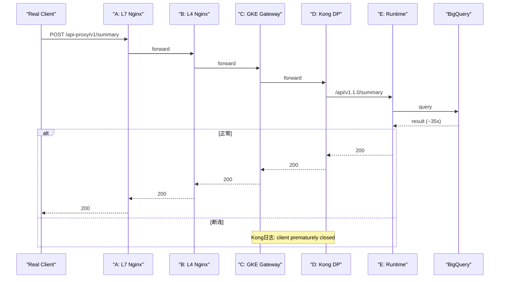

# 超时问题排查 Runbook（A→B→C→D→E）

## 1. Goal and Constraints

### 目标

定位并修复以下链路中的超时/断连问题：

```text
Client → A (L7 Nginx) → B (L4 Nginx) → C (GKE Gateway) → D (Kong DP) → E (GKE Runtime/API)
         [300s]          [300s]         [300s目标]         [300s]           [应用层超时]
```

### 已知现象（2026-02-25）

Kong 日志出现：

```text
epoll_wait() reported that client prematurely closed connection,
so upstream connection is closed too while reading response header from upstream,
client: 192.168.228.58,
request: "POST /api-proxy/v1/summary HTTP/1.1",
upstream: "https://100.68.104.8:8443/api/v1.1.0/summary"
```

业务侧观测：
- E（Runtime）调用 BigQuery 约 35s。
- 你已配置 A/B/C/D 多处 300s。
- 但请求在 < 180s 时失败。

### 关键约束
- 生产环境优先，先做可验证排查，再做结构优化。
- 优先 GCP 原生方案（GKE Gateway + GCPBackendPolicy + Cloud Monitoring）。
- 所有建议必须可执行、可回滚、可验证。

---

## 2. Recommended Architecture (V1)

### 核心判断
`client prematurely closed` 在 Kong 视角表示“**Kong 的直接下游关闭连接**”。
在你的链路里，Kong 的直接下游不是最终用户，而是 **C: GKE Gateway（或其数据面IP）**。

所以根因通常落在两类：
1. **级联关闭**：真实 Client/A/B 先超时，最终由 C 关闭 D 的连接。
2. **C 自身超时**：GKE Gateway 后端超时先触发，主动关闭到 D(Kong) 的连接。

### 复杂度评估
`Moderate`（跨 5 跳链路 + 多控制面配置 + 需时间线对齐）。

### 流程图（真实排查模型）



---

## 3. Trade-offs and Alternatives

### Immediate Fix（当天可落地）
- 把真实客户端超时统一提升到 `>= 310s`（connect/read 分离配置）。
- 在 C 使用 `GCPBackendPolicy.spec.default.timeoutSec: 310` 明确覆盖默认值。
- 逐跳核对 A/B/D/E 的 timeout 与 keepalive/send/read 超时。

### Structural Improvement（1-2 周）
- 将长耗时接口（如 summary）拆分到独立路由与独立 backend policy（长超时专线）。
- 对 BigQuery 结果做缓存与请求去重，降低 35s 长尾概率。
- 建立跨 hop `request_id` 统一透传，形成标准时间线。

### Long-term Redesign（>2 周）
- 将 summary 改造为异步任务（202 + task_id + 轮询/回调）。
- 对高时延计算链路引入队列和可恢复状态，减少长连接依赖。

---

## 4. Implementation Steps

### Step 1: 先做端到端基线测试

```bash
time curl -sv --max-time 320 \
  -X POST "https://dev-api.aliyun.cloud.aibang/api-proxy/v1/summary" \
  -H "Content-Type: application/json" \
  -H "Host: dev-api.aliyun.cloud.aibang" \
  -d '{"query":"test"}' \
  -o /tmp/summary.out
```

观察点：
- 总耗时、HTTP 状态码。
- 若失败，记录失败时刻（秒级）用于多组件日志对齐。

### Step 2: 分层配置核对（A/B/C/D/E）

#### A: L7 Nginx

```bash
ssh user@a-component "nginx -T | egrep 'proxy_read_timeout|proxy_connect_timeout|proxy_send_timeout|send_timeout|keepalive_timeout|client_body_timeout'"
```

建议最小值：
- `proxy_read_timeout 300s`
- `proxy_send_timeout 300s`
- `proxy_connect_timeout 60s~300s`
- `send_timeout >= 300s`（避免响应写回阶段过早断开）

#### B: L4 Nginx (stream)

```bash
ssh user@b-component "nginx -T | egrep 'proxy_timeout|proxy_connect_timeout|proxy_socket_keepalive'"
```

建议最小值：
- `proxy_timeout 300s`
- `proxy_connect_timeout` 明确设置（避免默认值过短）

#### C: GKE Gateway（重点）

1) 检查 Gateway/HTTPRoute 资源：

```bash
kubectl get gateway -A
kubectl get httproute -A -o yaml | egrep -n 'name:|hostnames:|backendRefs:|timeouts:'
```

2) 检查 GCPBackendPolicy（生产优先）：

```bash
kubectl get gcpbackendpolicy -A
kubectl get gcpbackendpolicy -A -o yaml | egrep -n 'name:|namespace:|targetRef:|timeoutSec|connectionDrainTimeoutSec'
```

3) 验证 GCLB Backend Service 实际生效值：

```bash
gcloud compute backend-services list --filter='name~kong'
gcloud compute backend-services describe <backend-service-name> --global \
  --format='table(name,timeoutSec,connectionDraining.drainingTimeoutSec)'
```

> 注意：GCLB backend service 实际 `timeoutSec` 是**必要校验项**，但不是唯一根因结论。  
> 若你已验证该值在异常环境与正常环境一致，则应优先转向“级联关闭/客户端超时/连接行为差异”排查。

#### D: Kong DP

```bash
kubectl -n kong-namespace get pods -l app=kong
kubectl -n kong-namespace logs -l app=kong --tail=300 | egrep 'prematurely closed|upstream timed out|request_id|summary'
```

```bash
# Admin API 检查 Service 超时（单位 ms）
kubectl -n kong-namespace exec -it <kong-pod> -- \
  curl -s localhost:8001/services/<service-name> | jq '.connect_timeout,.read_timeout,.write_timeout'
```

#### E: Runtime/API

```bash
kubectl -n your-namespace logs -l app=your-app --tail=300 | egrep 'summary|bigquery|timeout|request_id'
kubectl -n your-namespace get pods -l app=your-app
kubectl -n your-namespace describe pod <pod-name> | egrep -n 'Restart|OOM|Limits|Requests'
```

### Step 3: 时间线对齐（必须做）

对同一个 `request_id`，按时间排序收集 A/B/C/D/E 日志：

```bash
REQ_ID='fc13c9604f468dad7dada8cdcdaa'

# D: Kong
kubectl -n kong-namespace logs -l app=kong --since=30m | grep "$REQ_ID" > /tmp/req-kong.log

# C: Gateway
kubectl -n gateway-namespace logs -l app=gateway --since=30m | egrep "$REQ_ID|summary|timeout|upstream" > /tmp/req-gw.log

# A/B (示例)
ssh user@a-component "grep '$REQ_ID' /var/log/nginx/access.log /var/log/nginx/error.log" > /tmp/req-a.log
ssh user@b-component "grep '$REQ_ID' /opt/access-in.log /opt/error.log" > /tmp/req-b.log
```

判定规则：
- C 先出现 timeout，再到 D 出现 `prematurely closed` => **C 是超时点**。
- A/B/真实 Client 先断，再级联到 C→D => **前链路或客户端是超时点**。
- 若异常环境与正常环境的 C `timeoutSec` 相同：优先对比客户端工具配置、A/B 连接行为、请求特征与并发负载差异。

### Step 4: 绕过实验（快速定位）

直接绕过 C 测 D：

```bash
kubectl -n kong-namespace port-forward svc/kong-proxy 8000:8000

time curl -sv --max-time 320 \
  -X POST "http://127.0.0.1:8000/api-proxy/v1/summary" \
  -H "Host: dev-api.aliyun.cloud.aibang" \
  -H "Content-Type: application/json" \
  -d '{"query":"test"}'
```

结论：
- 绕过 C 成功、走全链路失败 => C 或 C 前链路问题。
- 绕过 C 仍失败 => D/E 或业务耗时问题。

### Step 5: 客户端工具专项（Insomnia/Postman/curl/代码）

常见误区：客户端默认或局部 timeout < 180s。

最低要求：
- `connect timeout`: 10-30s
- `read/overall timeout`: `>= 310s`

示例：

```bash
# curl
time curl --connect-timeout 10 --max-time 320 ...
```

```python
# Python requests
requests.post(url, json=payload, timeout=(10, 310))
```

```javascript
// axios
axios.post(url, payload, { timeout: 310000 })
```

```java
// Java HttpClient
HttpRequest.newBuilder().timeout(Duration.ofSeconds(310))
```

---

## 5. Validation and Rollback

### 验证标准
- 35s 典型请求稳定 200。
- 180s 以内请求不出现 `client prematurely closed`。
- 290s 延迟压测可成功；310s 时按预期在上游预算边界失败。
- C 的 backend service `timeoutSec` 与目标一致。

### 回滚策略
- A/B：回滚到上一个 Nginx 配置并 reload。
- C：回滚 GCPBackendPolicy 到上一个版本。
- D：回滚 Kong service timeout 变更。

示例：

```bash
# A/B
ssh user@a-component 'cp /etc/nginx/nginx.conf.bak /etc/nginx/nginx.conf && nginx -t && nginx -s reload'
ssh user@b-component 'cp /etc/nginx/nginx.conf.bak /etc/nginx/nginx.conf && nginx -t && nginx -s reload'

# C（示例）
kubectl -n gateway-namespace rollout history deploy/<gateway-controller-if-managed>
# 或恢复上一个 GCPBackendPolicy 清单版本
```

---

## 6. Reliability and Cost Optimizations

### HA/稳定性
- 为 D/E 配置 PDB，避免升级期全量中断。
- 对 E 配置 HPA（CPU+自定义 QPS/latency 指标）。
- 为关键长请求路径设置单独资源池和并发上限。

### 流量控制
- 明确链路超时预算：Client(320) > A/B/C/D(300-310) > E 内部调用预算。
- 避免盲目增大所有 timeout，先收敛慢查询来源。

### 成本
- BigQuery 查询做缓存（TTL）与预聚合，减少重复查询。
- 长耗时接口与普通接口分路由，避免全局长 timeout 拉高资源占用。

### 可观测性
- 强制透传 `X-Request-ID`。
- 为 `prematurely closed`、`upstream timed out`、`5xx` 建告警。
- 重点看 P95/P99 耗时与 timeout 错误率，不只看均值。

---

## 7. Handoff Checklist

### 配置核对
- [ ] A: `proxy_read_timeout/proxy_send_timeout/send_timeout` 全部确认
- [ ] B: `proxy_timeout/proxy_connect_timeout` 确认
- [ ] C: `GCPBackendPolicy.timeoutSec` 已发布且 `Accepted=True`
- [ ] C: GCLB backend service `timeoutSec` 已生效
- [ ] D: Kong `read_timeout/write_timeout/connect_timeout` 确认
- [ ] E: 应用层 timeout、BigQuery 调用 timeout 确认

### 证据链
- [ ] 同一 `request_id` 的 A/B/C/D/E 时间线日志
- [ ] 至少 1 次绕过 C 的对比实验
- [ ] 至少 1 次 `tcpdump`/连接级证据（如有必要）

### 发布与回滚
- [ ] 变更清单已记录（变更项、负责人、时间）
- [ ] 回滚命令已验证可执行
- [ ] 告警阈值已启用并通知到值班组

---

## Appendix A: 生产推荐的 C 层超时策略（GKE Gateway）

> 优先采用 GCP 原生策略并核对实际 backend service 生效值。

```yaml
apiVersion: networking.gke.io/v1
kind: GCPBackendPolicy
metadata:
  name: kong-backend-policy
  namespace: gateway-namespace
spec:
  default:
    timeoutSec: 310
    connectionDrainTimeoutSec: 300
  targetRef:
    group: ""
    kind: Service
    name: kong-proxy
```

验证：

```bash
kubectl get gcpbackendpolicy -n gateway-namespace kong-backend-policy -o yaml
gcloud compute backend-services describe <backend-service-name> --global --format='value(timeoutSec)'
```

---

## Appendix B: 一键快速诊断脚本

```bash
#!/usr/bin/env bash
set -euo pipefail

URL='https://dev-api.aliyun.cloud.aibang/api-proxy/v1/summary'
HOST='dev-api.aliyun.cloud.aibang'
for t in 30 60 120 180 240 320; do
  echo "===== max-time=${t}s ====="
  TS=$(date '+%Y-%m-%d %H:%M:%S')
  echo "start: ${TS}"
  time curl -sS -o /tmp/resp-${t}.json -w 'http_code=%{http_code} total=%{time_total}\n' \
    --connect-timeout 10 --max-time "${t}" \
    -X POST "${URL}" \
    -H "Host: ${HOST}" \
    -H 'Content-Type: application/json' \
    -H "X-Request-ID: timeout-debug-${t}-$(date +%s)" \
    -d '{"query":"test"}' || true
  echo
  sleep 3
done
```

---

## Appendix C: 高级诊断（抓包 / 压测 / 系统调用）

### C.1 tcpdump（定位谁先发 FIN/RST）

在 D（Kong）或 C（Gateway）侧抓包，确认连接主动关闭方：

```bash
# Kong Pod 内（示例）
kubectl -n kong-namespace exec -it <kong-pod> -- sh
tcpdump -i any -nn -s0 'host 192.168.228.58 and tcp port 8443' -w /tmp/kong-timeout.pcap

# 本地分析
tcpdump -nr /tmp/kong-timeout.pcap -tttt -nn | egrep 'Flags \\[F\\]|Flags \\[R\\]'
```

判定：
- 先看到 `C -> D` 的 RST/FIN，通常是 C 主动关闭。
- 先看到 `D -> C` 的 RST/FIN，通常是 D 或 D 上游中断。

### C.2 压测（ab / wrk）

```bash
# ab（示例）
ab -n 100 -c 10 -s 320 -T 'application/json' \
  -p req.json https://dev-api.aliyun.cloud.aibang/api-proxy/v1/summary
```

```bash
# wrk（示例）
wrk -t10 -c100 -d30s --timeout 320s \
  -s post_summary.lua https://dev-api.aliyun.cloud.aibang/api-proxy/v1/summary
```

观察：
- 错误类型分布（timeout/reset/5xx）。  
- P95/P99 是否逼近各 hop timeout 阈值。

### C.3 strace（仅在 VM 侧必要时）

```bash
# 示例：跟踪 nginx worker 网络 syscall
sudo strace -f -tt -e trace=network -p <nginx-worker-pid>
```

用途：
- 验证是否是内核层 `ECONNRESET` / `ETIMEDOUT` 触发。

---

## Appendix D: 常见故障指纹与处理

### D.1 固定在 30s 左右失败
- 高概率是 C（Gateway/GCLB backend timeout 默认值）或某处默认 read timeout。
- 优先检查 C 的 `timeoutSec` 实际生效值（`gcloud compute backend-services describe`）。
- 若 `timeoutSec` 在正常环境也相同且正常，则不要停在 C 配置层；继续查客户端或前链路级联关闭。

### D.2 固定在 60s 左右失败
- 常见是 Gateway/客户端 SDK 默认 timeout。
- 检查真实客户端、A/B/C 各层默认值是否仍为 60s。

### D.3 小于 180s 随机失败
- 常见是级联关闭、连接复用异常、节点抖动或 Pod 重启。
- 核查：
  - A/B/C/D/E 同一 `request_id` 时间线。
  - D/E Pod 重启/OOM。
  - 并发峰值下连接池与上游依赖（BigQuery）延迟飙升。

### D.4 日志语义速记
- `client prematurely closed`：Kong 下游关闭（在你链路里通常是 C）。  
- `upstream timed out`：Kong 到 E 超时。  
- `499`（Nginx）：客户端中断请求。  

---

## Appendix E: Insomnia / API Client 超时专项

### E.1 最小要求
- Request timeout/Read timeout 至少 `310s`。
- 关闭或拉长代理层 timeout（若启用系统代理/VPN）。

### E.2 验证方法
- 用 `curl --max-time 320` 做对照组。
- Insomnia 与 curl 请求体、Host、Headers 保持一致，比较失败时刻是否一致。

### E.3 结论规则
- 仅 Insomnia 失败、curl 稳定成功：优先判定为客户端工具配置问题。  
- Insomnia 与 curl 同时失败且时刻一致：优先看链路配置问题。  

---

## Appendix F: 本次问题最终 RCA（2026-02-25）

### F.1 最终根因

根因不在 A/B/C/D 链路超时配置，而在 **终端用户应用容器启动参数**：

- 用户在构建镜像时注入了 `GUNICORN_CMD_ARGS`，覆盖了平台默认 gunicorn 配置。
- 覆盖后的启动参数未包含 `timeout`，导致未继承模板里的 `timeout = 0`（无限等待）。
- 同时 `workers=3` 覆盖了平台期望值 `workers=4`，现场进程表现为 `3+1`，而不是期望的 `4+1`。

### F.2 现场证据

用户 Pod 内环境变量：

```bash
env | grep GUNICORN
# GUNICORN_CMD_ARGS=--bind=0.0.0.0:8443 --workers=3 --keyfile=/opt/keystore/aibang-sbrt-key.pem --certfile=/opt/keystore/aibang-sbrt-cert.pem
```

平台模板（期望配置）：

```python
# /opt/conf/gunicorn.conf.py
import os

workers = 4
bind = "0.0.0.0:8443"
keyfile = "/opt/keystore/aibang-sbrt-key.pem"
certfile = "/opt/keystore/aibang-sbrt-cert.pem"
timeout = 0

os.environ["SCRIPT_NAME"] = "/" + os.getenv("apiName") + "/v" + os.getenv("minorVersion")
```

进程侧验证（错误 Pod）：
- worker 数表现为 `3+1`（主进程 + 3 worker），与期望 `4+1` 不一致。

镜像侧验证（确认构建期注入）：

```bash
# 建议命令（修正拼写）
gcrane config <image-ref> | jq
```

### F.3 修复步骤（已验证有效）

1. 从用户镜像/启动参数中移除或修正 `GUNICORN_CMD_ARGS`，避免覆盖平台模板关键项。  
2. 若必须自定义，显式补齐平台基线参数：
   - `--workers=4`
   - `--timeout=0`（或平台统一值）
3. 重新构建并发布镜像，滚动重启 Pod。  
4. Pod 内复核：
   - `env | grep GUNICORN`
   - `ps -ef | grep gunicorn`
5. 重新执行 `summary` 长耗时接口验证，确认不再出现提前关闭。

### F.4 预防机制（建议纳入平台规范）

- 在 CI 加镜像策略检查：若检测到 `GUNICORN_CMD_ARGS`，必须校验是否包含平台必选参数（`workers`、`timeout`、证书路径）。  
- 在部署准入（Admission/OPA）加规则：禁止业务随意覆盖运行时关键参数，或要求通过白名单方式覆盖。  
- 在运行时巡检脚本中加入以下项：
  - `gunicorn` 实际命令行参数
  - worker 数是否符合模板
  - timeout 是否符合平台基线
- 在变更单中记录“是否覆盖平台启动参数”作为必填项。  
