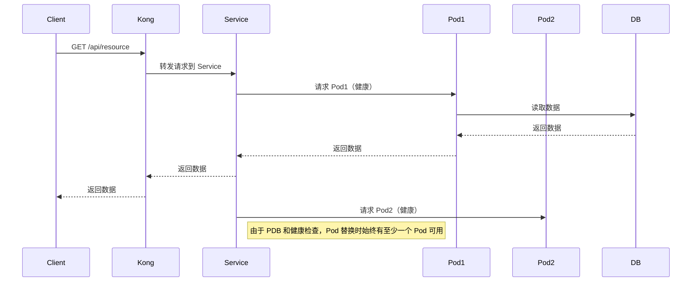

好的，接下来我为你展示一个 **GET 请求** 的完整过程，特别是在 **Kubernetes 服务升级** 和 **Pod 替换** 的高可用性场景下。

  

**GET 请求的完成标准**

  

在 **GET 请求** 中，请求的完成标准通常是客户端从服务器接收到数据。当客户端发起 GET 请求时，目标是从服务器获取数据（例如获取资源或状态信息），一旦响应返回，客户端就认为请求已完成。

  

不同于 POST 请求的创建或修改操作，**GET 请求** 主要是用于查询数据，不涉及对服务器状态的改变，因此其过程通常较为简单，关键点在于服务器能否在升级或 Pod 替换时保持高可用，并成功返回数据。

**GET 请求的流程**

1. **客户端发起请求**：客户端向服务器发送一个 **GET 请求**，例如请求某个资源的详情。

2. **请求路由**：请求首先经过 **Kong DP**，然后被转发到 **Kubernetes 服务**。

3. **Kubernetes 服务** 根据其 Endpoints 将请求转发到相应的 **Pod**。

4. **Pod 处理请求**：Pod 返回请求的结果，可能是从数据库中读取数据，或者从本地缓存中读取。

5. **响应返回客户端**：一旦 Pod 处理完请求，它会将响应数据返回给 Kong，Kong 再将响应返回给客户端。

  

在 **GKE 升级** 和 **Pod 替换** 的场景下，Pod 的替换不会中断 GET 请求的正常流动，因为请求是无状态的，且 **Kubernetes** 会在升级过程中保持至少一个健康 Pod 可用。

**关键点**

• **GET 请求的完成** 是由客户端接收到有效的响应数据来决定的。当请求完成时，服务器会返回相关的资源信息（如 200 OK 状态码）。

• 在 Pod 替换过程中，**Kubernetes** 确保至少有一个健康的 Pod 可用来处理流量。这样，Kong 会把流量转发到健康的 Pod，避免中断。

• 对于 **无状态请求**（如 GET 请求），Kubernetes 的负载均衡机制（Service 的 Endpoints 更新）能够在 Pod 替换时有效地保持流量路由。

**可视化流程（包括 GKE 升级）**

**流程描述**

6. **客户端发起 GET 请求**：

• 客户端向 **Kong DP** 发送 GET 请求，想要获取某个资源的信息（例如 /api/resource）。

7. **Kong 转发请求到 Service**：

• **Kong DP** 根据配置的路由规则，将请求转发到 **Kubernetes 服务**。

8. **Service 路由到健康的 Pod**：

• **Kubernetes 服务** 会根据当前健康的 Pod Endpoint，选择一个可用的 Pod（例如 Pod1）来处理请求。

9. **Pod 处理请求**：

• **Pod1** 从数据库或其他数据源中读取请求的数据，准备响应。

10. **数据库交互**：

• 如果需要，Pod 会与数据库交互（例如查询资源信息）。

11. **返回数据**：

• **Pod1** 将查询到的数据返回给 **Kubernetes 服务**，然后服务返回数据给 **Kong**。

12. **Kong 返回客户端响应**：

• 最后，**Kong DP** 将从 **Pod1** 返回的响应数据返回给客户端。

13. **Pod 替换期间的无中断服务**：

• 假设 **Pod1** 在进行替换（例如因为 Node 升级），Kubernetes 会确保有 **Pod2** 可用（通过健康检查和 PDB 配置）。

• 在 Pod 替换期间，**Kong** 会继续将流量路由到 **Pod2**，从而确保高可用性。

**结论**

• **GET 请求** 是无状态的查询操作，不涉及对服务器数据的修改。

• 在 **GKE 升级** 和 **Pod 替换** 过程中，**Kubernetes** 会确保至少有一个健康 Pod 可用，这样 **Kong DP** 可以将流量路由到健康的 Pod，从而避免请求失败或中断。

• 由于 **GET 请求** 是读取操作，**客户端只要能收到有效的响应数据，就认为请求完成**，即便在 Pod 替换过程中，Kong 会自动确保请求的流畅处理。

  

如果你还有其他问题或者需要进一步的细节，随时告诉我！