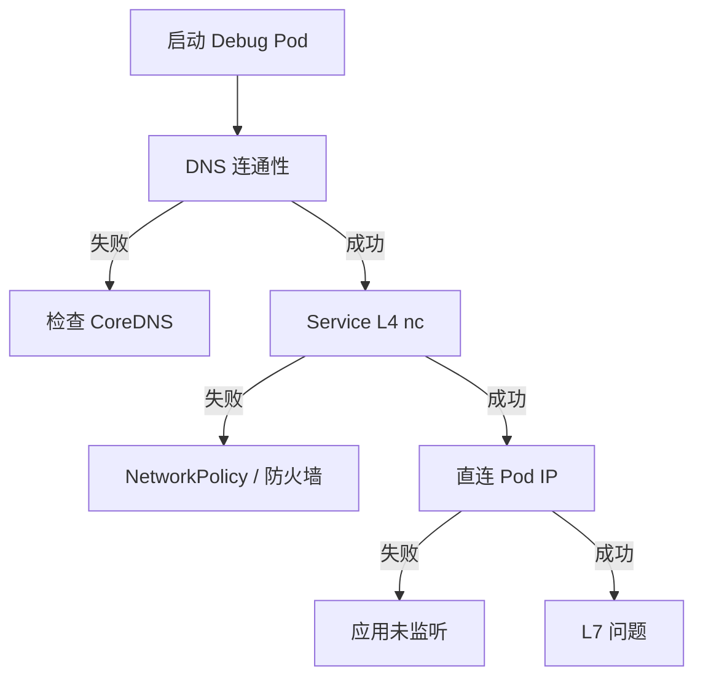

# netcat（nc）使用指南与常见示例

## 1. 问题分析

`netcat（nc）` 是一个**通用网络调试工具**，可用于：

- TCP / UDP 端口连通性测试
- 简单的客户端 / 服务端模拟
- 端口扫描
- 数据传输与调试

在 Linux、容器、GKE Pod 中，`nc` 常被用来**替代 curl / telnet** 做底层网络验证。

---

## 2. 基本语法

```bash
nc [选项] <目标主机> <端口>
```

常见实现：

- **openbsd-netcat**（推荐，现代 Linux 默认）
- **gnu-netcat**（老版本，参数略有不同）

---

## **3. 常用参数速查表**

| **参数**  | **作用**               |
| --------- | ---------------------- |
| -v        | verbose，显示连接过程  |
| -z        | 扫描模式，不发送数据   |
| -w <sec>  | 超时时间               |
| -l        | 监听模式（server）     |
| -p <port> | 指定本地端口           |
| -u        | UDP 模式               |
| -n        | 不进行 DNS 解析        |
| -k        | 允许多次连接（server） |

---

## **4. 常见使用场景与示例**

---

### **4.1 测试 TCP 端口是否可达（最常用）**

```
nc -vz example.com 443
```

输出示例：

```
Connection to example.com 443 port [tcp/https] succeeded!
```

失败示例：

```
nc: connect to example.com port 443 (tcp) failed: Connection refused
```

📌 **GKE / Pod 中验证 Service / Endpoint 连通性首选**

---

### **4.2 指定超时时间，避免卡住**

```
nc -vz -w 3 10.0.0.5 8080
```

---

### **4.3 测试 UDP 端口**

```
nc -vzu 8.8.8.8 53
```

📌 UDP 无连接概念，只能验证“是否可发送”，不保证对端收到。

---

### **4.4 模拟一个 TCP Server（监听端口）**

```
nc -l 8080
```

或（兼容写法）：

```
nc -l -p 8080
```

客户端连接：

```
nc 127.0.0.1 8080
```

输入的内容会被**原样发送**。

---

### **4.5 简单 HTTP 请求（无 curl 场景）**

```
printf "GET /health HTTP/1.1\r\nHost: localhost\r\n\r\n" | nc localhost 8080
```

📌 在 **极简容器 / distroless / debug Pod** 中非常有用。

---

### **4.6 端口扫描（轻量）**

```
nc -zv 10.0.0.10 80 443 8080
```

扫描端口范围：

```
nc -zv 10.0.0.10 8000-8100
```

⚠️ 不适合大规模扫描，替代品：nmap

---

### **4.7 文件传输（调试用）**

接收端：

```
nc -l 9000 > file.txt
```

发送端：

```
nc 10.0.0.2 9000 < file.txt
```

---

### **4.8 用于健康检查（Shell 脚本）**

```
if nc -z -w 2 localhost 8080; then
  echo "service up"
else
  echo "service down"
fi
```

📌 常用于：

- startupProbe / readinessProbe 逻辑验证
- Pod 启动前依赖检测

---

## **5. 在 Kubernetes / GKE 中的典型用途**

```
# Pod 内测试 Service
nc -vz my-service.my-namespace.svc.cluster.local 80

# 测试 NodePort
nc -vz <node-ip> <node-port>

# 测试 Kong / Nginx upstream
nc -vz kong-proxy.kong.svc 8443
```

---

## **6. 常见坑点说明**

| **问题**                 | **说明**                  |
| ------------------------ | ------------------------- |
| -z 不能和 -l 一起用      | 一个是扫描，一个是监听    |
| UDP 成功不代表服务可用   | UDP 无 ACK                |
| 不同发行版参数不完全一致 | 尤其是 -p                 |
| nc ≠ curl                | nc 只负责传输，不解析协议 |

---

## **7. TCP 连通性检查流程图**

```
graph TD
    A[执行 nc -vz host port] --> B{能否建立 TCP 连接}
    B -->|是| C[端口开放 / 服务监听中]
    B -->|否| D[拒绝 / 超时 / 网络不可达]
```

---

## **8. 总结**

- **端口连通性**：nc -vz
- **无 curl HTTP 验证**：printf | nc
- **Pod / GKE 网络排障首选**
- **轻量、无依赖、到处可用**

如果你愿意，我可以进一步整理：

- nc vs curl vs telnet 对比
- 在 **GKE Debug Pod** 中的最佳实践
- 用 nc + bash 写探活脚本模板

# GKE Debug Pod 中使用 netcat（nc）的最佳实践

## 1. 问题分析

在 **GKE Debug Pod** 中，排障目标通常是：

- 验证 **Service / Endpoint / Pod / NodePort** 的网络连通性
- 判断问题是在 **L3/L4（网络）** 还是 **L7（应用）**
- 在 **无 curl / 无 wget / 极简镜像** 的场景下快速定位问题

`netcat (nc)` 非常适合用于 **L4 层排障**，尤其在：

- distroless / scratch 应用容器
- sidecar / runtime container
- 线上 Pod 不允许安装额外工具

---

## 2. 推荐的 Debug Pod 镜像选择

### 2.1 首选镜像（自带 nc）

| 镜像                | 说明                                   |
| ------------------- | -------------------------------------- |
| `nicolaka/netshoot` | 网络排障神器（nc、tcpdump、dig、curl） |
| `busybox`           | 极简，内置 `nc`                        |
| `alpine`            | 可 apk 安装                            |

### 2.2 创建 Debug Pod（netshoot）

```bash
kubectl run net-debug \
  --rm -it \
  --image=nicolaka/netshoot \
  --restart=Never \
  -- bash
```

---

## **3. Debug Pod 标准排障流程（推荐）**

### **Step 1：确认 DNS 是否正常**

```
nc -vz kubernetes.default.svc 443
```

或：

```
getent hosts my-service.my-ns.svc.cluster.local
```

📌 **DNS 不通 → 先查 CoreDNS**

---

### **Step 2：验证 Service L4 连通性**

```
nc -vz my-service.my-ns.svc 80
```

可能结果：

- succeeded → Service / kube-proxy 正常
- timeout → NetworkPolicy / 防火墙
- refused → 后端 Pod 未监听

---

### **Step 3：直连 Pod IP（绕过 Service）**

```
nc -vz 10.12.3.45 8080
```

📌 用于区分：

- Service 问题
- Pod / 应用问题

---

### **Step 4：验证 NodePort（如适用）**

```
nc -vz <node-ip> <node-port>
```

---

### **Step 5：模拟最小 HTTP 请求（无 curl）**

```
printf "GET /health HTTP/1.1\r\nHost: test\r\n\r\n" | nc my-service 8080
```

📌 只关心是否返回 HTTP 状态行

---

## **4. 与 Kubernetes 探针结合的最佳实践**

### **4.1 用 nc 验证 readinessProbe 行为**

```
nc -z -w 2 localhost 8080
```

对比 Deployment 中：

```
readinessProbe:
  tcpSocket:
    port: 8080
```

📌 tcpSocket 本质就是 **L4 nc 检查**

---

### **4.2 验证滚动升级期间的可用性**

```
while true; do
  nc -z -w 1 my-service 8080 && echo OK || echo FAIL
  sleep 1
done
```

📌 常用于验证：

- RollingUpdate
- PDB 是否生效
- Pod replacement 是否产生 502 / refused

---

## **5. NetworkPolicy 排障模板**

### **5.1 判断是否被 NetworkPolicy 拦截**

```
nc -vz -w 3 my-service.my-ns.svc 8080
```

现象判断：

| **现象**  | **含义**               |
| --------- | ---------------------- |
| timeout   | NetworkPolicy / 防火墙 |
| refused   | Pod 存活但未监听       |
| succeeded | 网络放行               |

---

## **6. 与 Kong / Nginx 架构结合（你的常见场景）**

```
Client → Nginx L7 → Nginx L4 → Kong DP → GKE RT
```

### **推荐 nc 排查顺序**

```
# Kong → RT
nc -vz rt-service.rt-ns.svc 8080

# L4 Nginx → Kong
nc -vz kong-proxy.kong.svc 8443

# Debug Pod → L7 Nginx
nc -vz nginx-l7.nginx.svc 443
```

📌 **逐跳验证，快速定位断点**

---

## **7. Debug Pod 的安全与规范建议**

| **建议**          | **说明** |
| ----------------- | -------- |
| 使用 --rm         | 避免残留 |
| 不挂载 SA Token   | 降低权限 |
| 单 Namespace 使用 | 避免越权 |
| 临时使用          | 排障即删 |

示例（禁用 SA）：

```
kubectl run net-debug \
  --rm -it \
  --image=nicolaka/netshoot \
  --overrides='{"spec":{"automountServiceAccountToken":false}}'
```

---

## **8. Debug Pod 排障流程图**



---

## **9. 关键结论**

- nc 是 **GKE Debug Pod 的 L4 排障利器**
- succeeded / refused / timeout 三态非常关键
- 与 **readinessProbe / RollingUpdate / PDB** 强关联
- 逐跳验证是排障最快路径

如果你愿意，我可以下一步帮你整理：

- **“nc + tcpdump” 联合排障套路**
- **GKE 网络问题 → L3/L4/L7 决策树**
- **Debug Pod 标准化 YAML 模板（可复用）**
