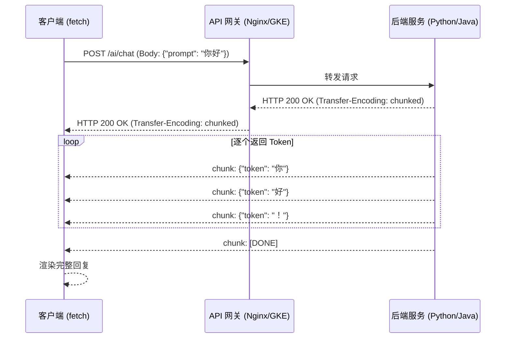
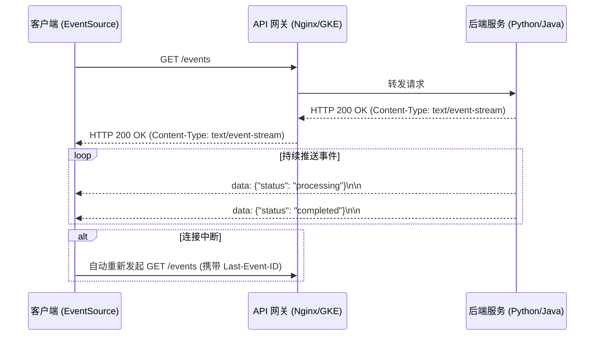
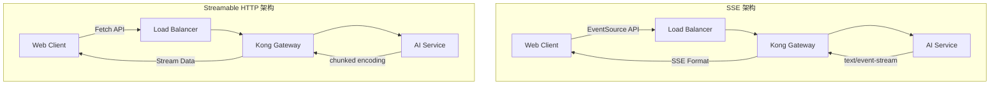
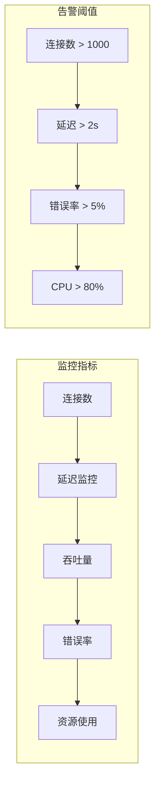
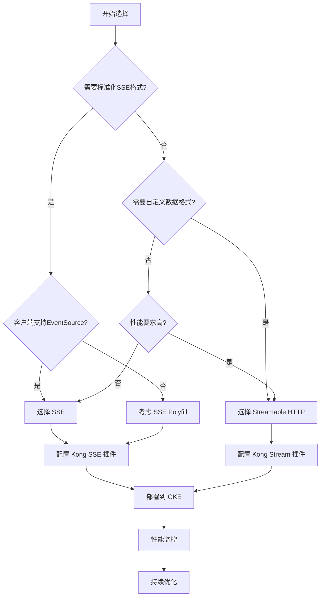
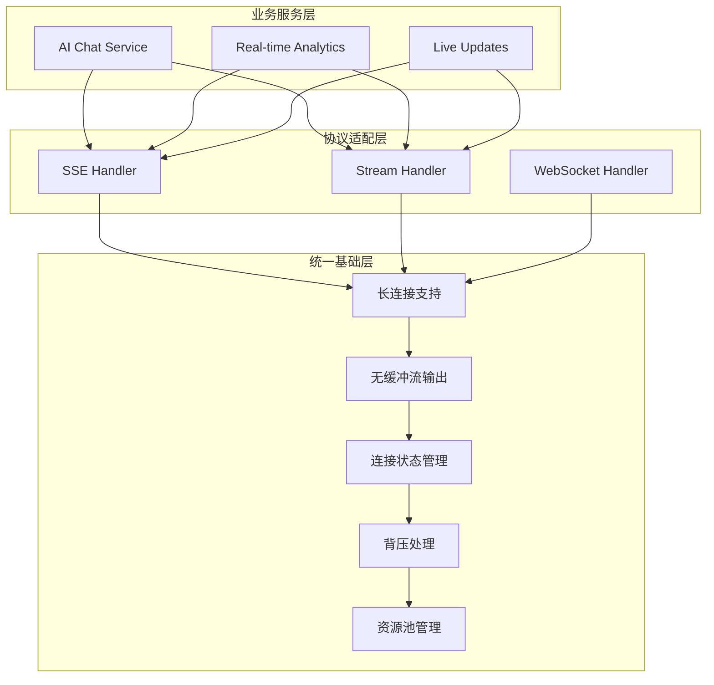
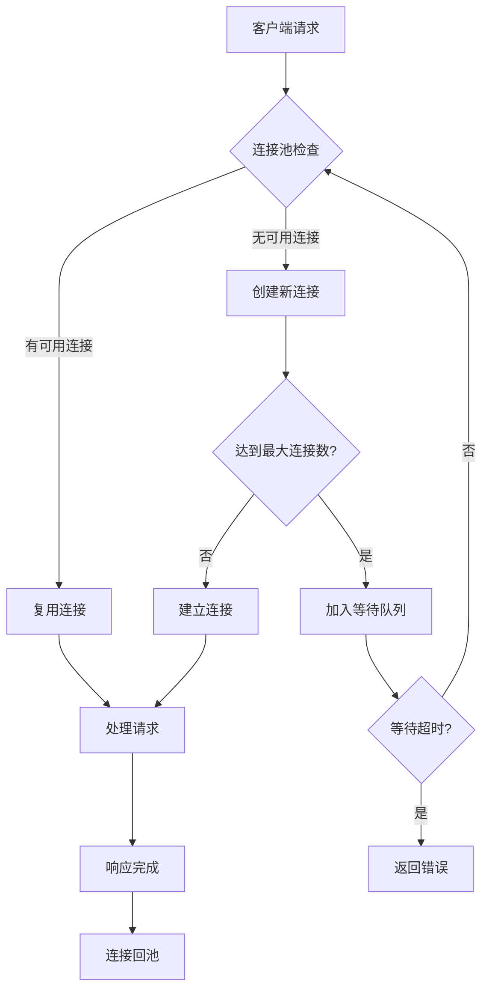

# Grok4

### SSE 与 Streamable HTTP 的探索：AI 实时响应的最佳实践

在现代应用中，尤其是 AI 驱动的实时响应场景（如聊天机器人或生成式 AI 的流式输出），服务器推送技术至关重要。SSE (Server-Sent Events) 和 Streamable HTTP（也称为 HTTP Streaming 或 Chunked HTTP）是两种核心方法，用于实现服务器向客户端的单向数据推送。本文将深入分析它们的工作机制、核心差异，并聚焦于在 Google Kubernetes Engine (GKE)、Kong（API 网关）和 Nginx（Web 服务器）环境下的选择与实施策略。这些技术特别适用于 AI 实时回复，能提升用户体验，避免传统轮询的延迟和资源浪费。

#### SSE 的工作机制

SSE 是一种基于 HTTP 的标准化协议，专为服务器向客户端推送实时事件而设计。它利用浏览器内置的 EventSource API，实现单向数据流。

- **连接建立**：客户端通过标准 HTTP GET 请求连接服务器，指定 Accept: text/event-stream。服务器响应以 MIME 类型 text/event-stream，并保持连接开放。
- **事件格式**：数据以纯文本块发送，每条事件以 "data: " 开头，后跟消息内容，并以双换行符 (\n\n) 结束。支持额外字段如 event:（事件类型）、id:（事件 ID，用于重连）和 retry:（重试间隔）。
- **内置功能**：浏览器自动处理重连（默认每 3 秒重试一次，如果连接中断），并支持 last-event-id 以恢复丢失事件。
- **适用场景**：适合 AI 实时响应，如 LLM（Large Language Model）生成文本时逐字推送，避免客户端等待完整响应。

例如，在 JavaScript 中使用：

```javascript
const eventSource = new EventSource("/api/sse");
eventSource.onmessage = (event) => console.log(event.data);
```

#### Streamable HTTP 的工作机制

Streamable HTTP 是一种更通用的 HTTP 流式传输机制，利用 HTTP/1.1 的 chunked transfer encoding 或 HTTP/2 的多路复用，实现服务器分块发送数据，而不关闭连接。

- **连接建立**：客户端发送标准 HTTP 请求，服务器响应以 Transfer-Encoding: chunked，并逐步发送数据块。每个块以十六进制长度开头，后跟内容和 CRLF（回车换行）。
- **数据格式**：无标准化事件结构，开发者需自定义分隔符（如换行符）。没有内置重连机制，需要客户端手动实现。
- **灵活性**：支持任意数据类型（如 JSON 或二进制），但依赖服务器保持连接开放。
- **适用场景**：适合大文件传输或自定义协议的 AI 数据流，如多模态 AI 输出。但在实时响应中，可能需要额外逻辑处理边界。

SSE 实际上是 Streamable HTTP 的一个特定实现，但前者添加了事件解析层。

#### 核心差异对比

以下表格总结 SSE 和 Streamable HTTP 的关键差异，帮助在 AI 场景中选择：

| 方面           | SSE (Server-Sent Events)                         | Streamable HTTP (HTTP Streaming)           |
| -------------- | ------------------------------------------------ | ------------------------------------------ |
| **通信方向**   | 单向（服务器 → 客户端）                          | 单向（服务器 → 客户端）                    |
| **协议基础**   | 基于 HTTP/1.1 或 HTTP/2，MIME: text/event-stream | 基于 HTTP/1.1 chunked 或 HTTP/2 流         |
| **事件处理**   | 标准化事件格式，支持 event/id/retry              | 无标准化，需要自定义分隔和解析             |
| **重连机制**   | 内置自动重连（浏览器处理）                       | 无内置，需要客户端手动实现                 |
| **浏览器支持** | 原生 EventSource API，简单集成                   | 需要 XMLHttpRequest 或 Fetch API，手动解析 |
| **性能与资源** | 高效，低开销；适合频繁小更新                     | 灵活，但可能更高开销；适合大块数据         |
| **兼容性**     | 良好，支持大多数现代浏览器和代理                 | 更通用，但易受代理/负载均衡器干扰          |
| **安全性**     | 支持 CORS 和 HTTPS                               | 同上，但需注意自定义格式的安全             |
| **AI 适用性**  | 优于实时响应（如 LLM 流式输出），简单且交互性强  | 适合自定义 AI 数据（如多媒体），但实现复杂 |

差异源于 SSE 的标准化 vs. Streamable HTTP 的灵活性：SSE 更易用，尤其在 AI 中减少开发负担；Streamable HTTP 适合非标准场景，但可能增加错误风险。

#### 在实时 AI 回复场景中的选择

对于 AI 实时响应（如 Grok 或类似模型的流式生成），SSE 是首选：

- **优势**：简化客户端渲染（逐字显示），减少延迟；内置重连提升鲁棒性。许多 AI 框架（如 OpenAI SDK）原生支持 SSE。
- **何时用 Streamable HTTP**：如果需要双向互动或非文本数据（如图像流），但 AI 通常单向推送，SSE 更高效。
- **最佳实践**：
    - 确保服务器生成响应时使用异步迭代器，避免阻塞。
    - 处理错误：SSE 支持发送错误事件；Streamable HTTP 需自定义。
    - 监控连接：限制并发连接，防止资源耗尽。
    - 测试：模拟网络中断，验证重连。

在 AI 中，SSE 的采用率更高，如 MCP 项目从 SSE 切换到 Streamable HTTP 以优化自定义需求，但对于标准实时回复，SSE 仍是主流。

#### 在 GKE/Kong/Nginx 环境下的实施与最佳方案

GKE 提供 Kubernetes 集群，Kong 作为 Ingress Controller 处理路由，Nginx 常用于反向代理。这些环境支持 SSE 和 Streamable HTTP，但需配置以处理长连接和无缓冲响应。

- **GKE 配置**：

    - 使用 GKE 的 Ingress（如基于 Kong 或 Nginx）暴露服务。
    - 启用 HTTP/2 以支持多路复用。
    - 负载均衡：使用 Google Cloud Load Balancer (GCLB)，配置为 TCP/SSL 以避免连接超时（默认 30 秒）。对于 SSE，避免 HTTP 负载均衡器的缓冲。

- **Kong 配置**：

    - 创建 Service 和 Route：设置 upstream 服务指向 AI 后端，Route 指定 Accept: text/event-stream。
    - 插件：使用 proxy-cache 或 rate-limiting，但禁用缓冲（stream_mode: true）。
    - SSE 支持：Kong 原生支持，通过配置允许长连接。潜在问题：如果 CLB 关闭连接，使用 TCP LB 前置。
    - 示例 YAML：
        ```yaml
        apiVersion: configuration.konghq.com/v1
        kind: KongIngress
        metadata: { name: sse-ingress }
        proxy: { stream: true }
        ```

- **Nginx 配置**：

    - 作为 Ingress 或独立代理：设置 proxy_buffering off; 和 proxy_http_version 1.1; 以支持 chunked。
    - SSE 特定：添加 Content-Type: text/event-stream; 和 X-Accel-Buffering: no;。
    - 示例 conf：
        ```nginx
        location /sse {
            proxy_pass http://backend;
            proxy_buffering off;
            proxy_set_header Connection '';
            proxy_http_version 1.1;
            chunked_transfer_encoding on;
        }
        ```

- **最佳方案**：
    - **选择 SSE**：在 GKE 中部署 AI 服务（如 FastAPI 或 Node.js），使用 Kong Route 处理 SSE。适用于标准 AI 流式（如 OpenAI 兼容端点）。
    - **选择 Streamable HTTP**：如果自定义需求强，使用 Nginx 的 chunked 配置。监控 GKE 指标，确保 pod 自动缩放。
    - **实施步骤**：1) 在 GKE 创建 Deployment 和 Service；2) 配置 Kong/Nginx Ingress；3) 测试连接持久性；4) 集成 AI 框架（如 PyTorch Serving）。
    - **注意事项**：处理超时（设置 keepalive_timeout 高值）；安全使用 HTTPS；在生产中监控日志，避免连接泄漏。

总之，对于 AI 实时响应，SSE 在简单性和兼容性上胜出，尤其在 GKE/Kong/Nginx 环境中易于部署。如果项目需高度自定义，Streamable HTTP 是备选。通过这些实践，能构建高效、可扩展的系统。

# 探索 SSE 与 Streamable HTTP：AI 实时响应的最佳实践

本文档旨在深入探讨并对比两种核心的服务器推送技术：**SSE (Server-Sent Events)** 和通用的 **Streamable HTTP**。我们将分析它们的工作机制、核心差异，并最终聚焦于如何在 `GKE/Nginx` 环境下，为**实时 AI 回复**等现代应用场景选择和实施最佳方案。
探索 SSE 与 Streamable HTTP：AI 实时响应的最佳实践 再深入探讨并对比两种核心的服务器推送技术：SSE (Server-Sent Events) 和通用的 Streamable HTTP。我们将分析它们的工作机制、核心差异，并最终聚焦于如何在 GKE/Kong/Nginx 环境下，为实时 AI 回复等现代应用场景选择和实施最佳方案。

---

## **一、核心概念对比：SSE vs. Streamable HTTP**

从根本上说，SSE 是 Streamable HTTP 的一种**标准化、有特定格式的实现**。而 Streamable HTTP 是一个更宽泛的概念。

| 特性           | SSE (Server-Sent Events)                         | 通用 Streamable HTTP                                               |
| :------------- | :----------------------------------------------- | :----------------------------------------------------------------- |
| **协议/标准**  | **标准协议**，MIME 类型为 `text/event-stream`    | **一种技术模式**，基于 HTTP 分块传输 (`Chunked Transfer-Encoding`) |
| **HTTP 方法**  | 严格限制为 **`GET`**                             | **支持所有方法** (`GET`, `POST`, `PUT` 等)                         |
| **客户端实现** | 浏览器原生 `EventSource` API                     | 浏览器 `fetch` + `ReadableStream` API                              |
| **数据格式**   | **有严格格式**，必须以 `data:` 开头，`\n\n` 结尾 | **完全自定义**，可以是 JSON、纯文本、Token 流等                    |
| **自动重连**   | **浏览器原生支持** (`EventSource` 会自动重连)    | **需要手动实现**，通过监听 `fetch` 的异常                          |
| **断点续传**   | **标准支持**，通过 `Last-Event-ID` HTTP 头       | **需要自定义实现**                                                 |
| **核心优势**   | 简单、标准化、浏览器原生支持好、自动重连         | **极其灵活**、支持 `POST` 发送复杂请求体、无数据格式限制           |
| **最适用场景** | 状态更新、日志推送、简单通知                     | **AI 实时回复**、大文件流式下载、复杂查询的分块响应                |

**结论**：对于需要客户端发送复杂数据（如 AI 的 `prompt`）的场景，**Streamable HTTP + `POST` 是唯一且最佳的选择**。

---

## **二、工作机制与流程图**

### **1. Streamable HTTP (AI 回复场景)**

客户端通过 `POST` 请求发送一个包含 `prompt` 的 JSON Body。服务器接收后，在一个长连接上，通过 `Chunked Transfer-Encoding` 逐步返回 AI 生成的 Token。



### **2. SSE (通知/日志场景)**

客户端通过 `GET` 请求建立一个长连接。服务器在该连接上，按照 `text/event-stream` 格式持续推送事件。



---

## **三、平台可以同时支持两者吗？**

**答案是肯定的**。一个配置得当的平台完全可以同时为不同场景提供这两种服务。它们底层的技术要求是相同的：**支持长连接和无缓冲的流式输出**。

**策略**：通过不同的 API Endpoint (路径) 来区分服务。

- `/api/ai-stream` (`POST`): 用于 AI 实时回复，使用 **Streamable HTTP**。
- `/api/notifications` (`GET`): 用于状态通知，使用 **SSE**。

---

## **四、平台统一配置清单 (GKE/Nginx)**

要同时支持 SSE 和 Streamable HTTP，你的基础设施需要满足以下配置，核心是**“允许长连接”**和**“禁用响应缓冲”**。

| 组件                  | 配置项                      | 推荐值       | 目的                                                       |
| :-------------------- | :-------------------------- | :----------- | :--------------------------------------------------------- |
| **Nginx Ingress**     | `proxy_buffering`           | `off`        | **[关键]** 禁止 Nginx 缓存响应，实现真正的流式传输。       |
|                       | `proxy_read_timeout`        | `3600s`      | 允许后端连接保持较长时间，防止被 Nginx 中途切断。          |
|                       | `chunked_transfer_encoding` | `on`         | 启用分块传输编码，这是流式响应的基础。                     |
| **GKE BackendConfig** | `timeoutSec`                | `3600`       | 设置 GCP 负载均衡器到后端 Pod 的超时时间，防止被 LB 切断。 |
| **GCP Load Balancer** | `Cloud CDN`                 | **Disabled** | **[关键]** CDN 会缓存响应，完全破坏流式传输，必须禁用。    |
| **应用本身**          | `flush()` / `yield`         | 及时调用     | 在代码中，每生成一小块数据后，应立即将其刷出到响应流。     |

---

## **五、代码示例**

### **1. Python Flask 实现 Streamable HTTP (`POST`)**

```python
from flask import Flask, Response, request
import time

app = Flask(__name__)

@app.route('/ai/chat', methods=['POST'])
def stream_chat():
    prompt = request.json.get('prompt', '')
    def generate():
        # 模拟 AI 根据 prompt 生成回复
        response_words = [f"回复 '{prompt}' 的第一个词", "第二个词", "第三个词"]
        for word in response_words:
            yield f'{{"token": "{word}"}}\n' # 以 JSON Line 格式流式输出
            time.sleep(0.5)
        yield '[DONE]\n'
    return Response(generate(), mimetype='application/x-ndjson')

if __name__ == '__main__':
    app.run(host='0.0.0.0', port=5000, threaded=True)
```

### **2. 客户端 JavaScript 消费 Streamable HTTP**

```javascript
async function consumeStream() {
	const response = await fetch("/ai/chat", {
		method: "POST",
		headers: { "Content-Type": "application/json" },
		body: JSON.stringify({ prompt: "你好" }),
	});

	const reader = response.body.getReader();
	const decoder = new TextDecoder();
	let partialLine = "";

	while (true) {
		const { done, value } = await reader.read();
		if (done) {
			break;
		}
		// 将接收到的数据块解码成字符串
		const chunk = decoder.decode(value, { stream: true });
		// 按换行符分割处理
		const lines = (partialLine + chunk).split("\n");
		partialLine = lines.pop();

		for (const line of lines) {
			if (line === "[DONE]") {
				console.log("Stream finished.");
				return;
			}
			try {
				const jsonData = JSON.parse(line);
				console.log("Received token:", jsonData.token);
				// 在这里更新你的 UI
			} catch (error) {
				console.error("Failed to parse JSON line:", line);
			}
		}
	}
}

consumeStream();
```

---

## **六、最终建议**

- 对于**实时 AI 回复**场景，**强烈建议使用通用的 Streamable HTTP 模式**，因为它能完美结合 `POST` 请求，让你能传递复杂的 `prompt` 和其他参数。
- 对于**状态通知、日志流**等服务端单向推送的简单场景，**SSE** 因其标准化和浏览器自动重连的特性，依然是一个优秀的选择。
- 你的平台架构只要配置正确，**完全可以同时支持这两种模式**，为不同的业务场景提供最适合的解决方案。

# Claude

# SSE 与 Streamable HTTP：AI 实时响应的最佳实践

## 核心技术对比

### SSE (Server-Sent Events)

SSE 是 HTML5 标准的一部分，专门设计用于服务器向客户端推送实时数据。

**技术特征：**

- 基于 HTTP/1.1 长连接
- 单向数据流（服务器 → 客户端）
- 自动重连机制
- 标准化的事件格式

**核心实现机制：**

```http
GET /events HTTP/1.1
Host: example.com
Accept: text/event-stream
Cache-Control: no-cache

HTTP/1.1 200 OK
Content-Type: text/event-stream
Connection: keep-alive
Cache-Control: no-cache

data: {"message": "Hello World"}

data: {"chunk": "AI response part 1"}

data: {"chunk": "AI response part 2"}

event: close
data: {"status": "completed"}
```

### Streamable HTTP (HTTP Streaming)

通用的 HTTP 流式传输，通过 `Transfer-Encoding: chunked` 实现数据分块传输。

**技术特征：**

- 基于 HTTP/1.1 分块编码
- 灵活的数据格式
- 需要手动实现重连
- 更低的协议开销

**核心实现机制：**

```http
GET /stream HTTP/1.1
Host: example.com
Accept: application/json

HTTP/1.1 200 OK
Content-Type: application/json
Transfer-Encoding: chunked
Connection: keep-alive

1a
{"chunk": "AI response part 1"}
1a
{"chunk": "AI response part 2"}
0

```

## 架构对比分析



## 技术特性对比表

| 特性       | SSE                      | Streamable HTTP      |
| ---------- | ------------------------ | -------------------- |
| 标准化程度 | HTML5 标准               | HTTP/1.1 标准        |
| 客户端 API | EventSource (原生支持)   | Fetch API (需自实现) |
| 数据格式   | 固定格式 (data:, event:) | 任意格式             |
| 重连机制   | 自动重连                 | 手动实现             |
| 浏览器支持 | 现代浏览器全支持         | 通用支持             |
| 协议开销   | 较高 (格式要求)          | 较低                 |
| 实现复杂度 | 简单                     | 中等                 |
| 调试友好度 | 高 (浏览器原生支持)      | 中等                 |

## GKE + Kong 环境配置

### Kong 插件配置对比

**SSE 配置：**

```yaml
apiVersion: configuration.konghq.com/v1
kind: KongPlugin
metadata:
  name: sse-proxy
plugin: response-transformer
config:
  add:
    headers:
      - "Content-Type: text/event-stream"
      - "Cache-Control: no-cache"
      - "Connection: keep-alive"
      - "Access-Control-Allow-Origin: *"
---
apiVersion: networking.k8s.io/v1
kind: Ingress
metadata:
  name: ai-sse-service
  annotations:
    konghq.com/plugins: sse-proxy
    nginx.ingress.kubernetes.io/proxy-buffering: "off"
    nginx.ingress.kubernetes.io/proxy-read-timeout: "3600"
spec:
  rules:
  - host: api.example.com
    http:
      paths:
      - path: /ai/stream
        pathType: Prefix
        backend:
          service:
            name: ai-service
            port:
              number: 8080
```

**Streamable HTTP 配置：**

```yaml
apiVersion: configuration.konghq.com/v1
kind: KongPlugin
metadata:
  name: stream-proxy
plugin: response-transformer
config:
  add:
    headers:
      - "Transfer-Encoding: chunked"
      - "Connection: keep-alive"
      - "Access-Control-Allow-Origin: *"
---
apiVersion: networking.k8s.io/v1
kind: Ingress
metadata:
  name: ai-stream-service
  annotations:
    konghq.com/plugins: stream-proxy
    nginx.ingress.kubernetes.io/proxy-buffering: "off"
    nginx.ingress.kubernetes.io/proxy-request-buffering: "off"
spec:
  rules:
  - host: api.example.com
    http:
      paths:
      - path: /ai/chunked
        pathType: Prefix
        backend:
          service:
            name: ai-service
            port:
              number: 8080
```

## 实际应用场景实现

### AI 实时响应 - SSE 实现

**服务端实现 (Go)：**

```go
func handleSSE(w http.ResponseWriter, r *http.Request) {
    w.Header().Set("Content-Type", "text/event-stream")
    w.Header().Set("Cache-Control", "no-cache")
    w.Header().Set("Connection", "keep-alive")
    w.Header().Set("Access-Control-Allow-Origin", "*")

    flusher, ok := w.(http.Flusher)
    if !ok {
        http.Error(w, "Streaming unsupported", http.StatusInternalServerError)
        return
    }

    // AI 响应流
    aiResponse := callAIService(r.URL.Query().Get("prompt"))

    for chunk := range aiResponse {
        fmt.Fprintf(w, "data: %s\n\n", chunk)
        flusher.Flush()

        // 检查客户端断连
        select {
        case <-r.Context().Done():
            return
        default:
        }
    }

    fmt.Fprintf(w, "event: close\ndata: {\"status\": \"completed\"}\n\n")
    flusher.Flush()
}
```

**客户端实现 (JavaScript)：**

```javascript
function startAIChat(prompt) {
	const eventSource = new EventSource(
		`/ai/stream?prompt=${encodeURIComponent(prompt)}`
	);

	eventSource.onmessage = function (event) {
		const data = JSON.parse(event.data);
		appendToChat(data.chunk);
	};

	eventSource.addEventListener("close", function (event) {
		eventSource.close();
		console.log("AI response completed");
	});

	eventSource.onerror = function (event) {
		console.error("SSE connection error:", event);
		eventSource.close();
	};
}
```

### AI 实时响应 - Streamable HTTP 实现

**服务端实现 (Go)：**

```go
func handleStream(w http.ResponseWriter, r *http.Request) {
    w.Header().Set("Content-Type", "application/json")
    w.Header().Set("Transfer-Encoding", "chunked")
    w.Header().Set("Connection", "keep-alive")
    w.Header().Set("Access-Control-Allow-Origin", "*")

    flusher, ok := w.(http.Flusher)
    if !ok {
        http.Error(w, "Streaming unsupported", http.StatusInternalServerError)
        return
    }

    aiResponse := callAIService(r.URL.Query().Get("prompt"))

    for chunk := range aiResponse {
        data, _ := json.Marshal(map[string]string{"chunk": chunk})
        fmt.Fprintf(w, "%s\n", data)
        flusher.Flush()

        select {
        case <-r.Context().Done():
            return
        default:
        }
    }
}
```

**客户端实现 (JavaScript)：**

```javascript
async function startAIChat(prompt) {
	const response = await fetch(
		`/ai/chunked?prompt=${encodeURIComponent(prompt)}`
	);
	const reader = response.body.getReader();
	const decoder = new TextDecoder();

	try {
		while (true) {
			const { done, value } = await reader.read();
			if (done) break;

			const chunk = decoder.decode(value, { stream: true });
			const lines = chunk.split("\n").filter((line) => line.trim());

			for (const line of lines) {
				try {
					const data = JSON.parse(line);
					appendToChat(data.chunk);
				} catch (e) {
					console.warn("Failed to parse chunk:", line);
				}
			}
		}
	} catch (error) {
		console.error("Stream reading error:", error);
	} finally {
		reader.releaseLock();
	}
}
```

## 网络层优化配置

### Nginx 配置优化

```nginx
server {
    listen 80;
    server_name api.example.com;

    # SSE 专用配置
    location /ai/stream {
        proxy_pass http://kong-proxy;
        proxy_buffering off;
        proxy_cache off;
        proxy_read_timeout 3600s;
        proxy_connect_timeout 60s;
        proxy_send_timeout 3600s;

        # SSE 特定头部
        proxy_set_header Connection '';
        proxy_http_version 1.1;
        chunked_transfer_encoding off;
    }

    # Streamable HTTP 配置
    location /ai/chunked {
        proxy_pass http://kong-proxy;
        proxy_buffering off;
        proxy_request_buffering off;
        proxy_read_timeout 3600s;

        # 保持分块编码
        proxy_http_version 1.1;
        proxy_set_header Connection "keep-alive";
    }
}
```

### Kong 流量控制配置

```yaml
apiVersion: configuration.konghq.com/v1
kind: KongPlugin
metadata:
  name: stream-rate-limit
plugin: rate-limiting
config:
  minute: 60
  hour: 1000
  policy: redis
  redis_host: redis-service
  redis_port: 6379
  hide_client_headers: false
---
apiVersion: configuration.konghq.com/v1
kind: KongPlugin
metadata:
  name: stream-timeout
plugin: request-timeout
config:
  http_timeout: 300000  # 5分钟
  https_timeout: 300000
```

## 性能监控与调优

### 关键指标监控



**Prometheus 监控配置：**

```yaml
apiVersion: v1
kind: ConfigMap
metadata:
  name: prometheus-config
data:
  prometheus.yml: |
    global:
      scrape_interval: 15s

    scrape_configs:
    - job_name: 'kong-streaming'
      static_configs:
      - targets: ['kong-admin:8001']
      metrics_path: /metrics
      params:
        format: ['prometheus']

    - job_name: 'ai-service'
      kubernetes_sd_configs:
      - role: endpoints
      relabel_configs:
      - source_labels: [__meta_kubernetes_service_name]
        action: keep
        regex: ai-service
```

## 最佳实践决策流程



## 推荐方案总结

### AI 实时响应场景推荐

**选择 SSE 的场景：**

- 标准 Web 应用
- 需要自动重连
- 团队技术栈偏向前端标准化
- 调试和维护优先级高

**选择 Streamable HTTP 的场景：**

- 移动端或混合应用
- 需要自定义协议格式
- 性能要求极高
- 需要更精细的流控制

### 生产环境配置要点

1. **网络层面**：关闭代理缓冲，设置合适的超时时间
2. **安全层面**：配置 CORS，实施速率限制
3. **监控层面**：重点关注连接数、延迟和错误率
4. **扩展层面**：使用 Redis 集群支持水平扩展

通过以上分析，SSE 在标准化和易用性方面具有优势，而 Streamable HTTP 在性能和灵活性方面更胜一筹。在 AI 实时响应场景中，建议根据具体的技术栈和性能要求进行选择。

一个配置得当的平台确实可以同时提供这两种服务，因为它们的底层技术要求是一致的。让我们设计一个统一的架构方案。

## 统一流式平台架构

### 核心基础设施要求



## 统一平台配置

### Kong 网关统一配置

```yaml
apiVersion: configuration.konghq.com/v1
kind: KongPlugin
metadata:
  name: unified-streaming
plugin: response-transformer
config:
  add:
    headers:
      - "Cache-Control: no-cache"
      - "Connection: keep-alive"
      - "Access-Control-Allow-Origin: *"
      - "Access-Control-Allow-Headers: Content-Type, Authorization"
      - "Access-Control-Allow-Methods: GET, POST, OPTIONS"
---
apiVersion: configuration.konghq.com/v1
kind: KongPlugin
metadata:
  name: streaming-timeout
plugin: request-timeout
config:
  http_timeout: 300000
  https_timeout: 300000
---
apiVersion: configuration.konghq.com/v1
kind: KongPlugin
metadata:
  name: streaming-rate-limit
plugin: rate-limiting
config:
  minute: 100
  hour: 2000
  policy: redis
  redis_host: redis-jiqun
  redis_port: 6379
```

### Nginx 统一代理配置

```nginx
upstream kong-streaming {
    server kong-proxy-1:8000 weight=1 max_fails=3 fail_timeout=30s;
    server kong-proxy-2:8000 weight=1 max_fails=3 fail_timeout=30s;
    server kong-proxy-3:8000 weight=1 max_fails=3 fail_timeout=30s;
    keepalive 64;
}

server {
    listen 80;
    server_name api.example.com;

    # 统一流式配置
    location ~* ^/(sse|stream|ws)/ {
        proxy_pass http://kong-streaming;

        # 核心流式配置
        proxy_buffering off;
        proxy_request_buffering off;
        proxy_cache off;

        # 连接配置
        proxy_http_version 1.1;
        proxy_set_header Upgrade $http_upgrade;
        proxy_set_header Connection $connection_upgrade;
        proxy_set_header Host $host;
        proxy_set_header X-Real-IP $remote_addr;
        proxy_set_header X-Forwarded-For $proxy_add_x_forwarded_for;
        proxy_set_header X-Forwarded-Proto $scheme;

        # 超时配置
        proxy_connect_timeout 60s;
        proxy_send_timeout 3600s;
        proxy_read_timeout 3600s;

        # 分块传输配置
        chunked_transfer_encoding on;
    }
}

map $http_upgrade $connection_upgrade {
    default upgrade;
    '' close;
}
```

## 统一服务实现

### 通用流式基础框架

```go
package streaming

import (
    "context"
    "fmt"
    "net/http"
    "encoding/json"
    "time"
)

type StreamType string

const (
    SSE    StreamType = "sse"
    HTTP   StreamType = "http"
    WebSocket StreamType = "ws"
)

type StreamConfig struct {
    Type            StreamType
    BufferSize      int
    HeartbeatInterval time.Duration
    MaxConnections  int
    Timeout         time.Duration
}

type StreamManager struct {
    config     StreamConfig
    connections map[string]*Connection
    broadcast   chan []byte
    register    chan *Connection
    unregister  chan *Connection
}

type Connection struct {
    ID       string
    Type     StreamType
    Writer   http.ResponseWriter
    Request  *http.Request
    Send     chan []byte
    Done     chan struct{}
}

func NewStreamManager(config StreamConfig) *StreamManager {
    return &StreamManager{
        config:      config,
        connections: make(map[string]*Connection),
        broadcast:   make(chan []byte, config.BufferSize),
        register:    make(chan *Connection),
        unregister:  make(chan *Connection),
    }
}

func (sm *StreamManager) Run() {
    ticker := time.NewTicker(sm.config.HeartbeatInterval)
    defer ticker.Stop()

    for {
        select {
        case conn := <-sm.register:
            sm.connections[conn.ID] = conn
            fmt.Printf("Client %s connected via %s\n", conn.ID, conn.Type)

        case conn := <-sm.unregister:
            if _, ok := sm.connections[conn.ID]; ok {
                delete(sm.connections, conn.ID)
                close(conn.Send)
                fmt.Printf("Client %s disconnected\n", conn.ID)
            }

        case message := <-sm.broadcast:
            for id, conn := range sm.connections {
                select {
                case conn.Send <- message:
                default:
                    delete(sm.connections, id)
                    close(conn.Send)
                }
            }

        case <-ticker.C:
            // 心跳检测
            heartbeat := []byte(`{"type":"heartbeat","timestamp":"` +
                time.Now().Format(time.RFC3339) + `"}`)
            sm.broadcast <- heartbeat
        }
    }
}

// SSE 处理器
func (sm *StreamManager) HandleSSE(w http.ResponseWriter, r *http.Request) {
    w.Header().Set("Content-Type", "text/event-stream")
    w.Header().Set("Cache-Control", "no-cache")
    w.Header().Set("Connection", "keep-alive")
    w.Header().Set("Access-Control-Allow-Origin", "*")

    flusher, ok := w.(http.Flusher)
    if !ok {
        http.Error(w, "Streaming unsupported", http.StatusInternalServerError)
        return
    }

    conn := &Connection{
        ID:      generateID(),
        Type:    SSE,
        Writer:  w,
        Request: r,
        Send:    make(chan []byte, 256),
        Done:    make(chan struct{}),
    }

    sm.register <- conn
    defer func() {
        sm.unregister <- conn
    }()

    // SSE 消息处理
    for {
        select {
        case message := <-conn.Send:
            fmt.Fprintf(w, "data: %s\n\n", message)
            flusher.Flush()

        case <-r.Context().Done():
            return

        case <-conn.Done:
            return
        }
    }
}

// HTTP Stream 处理器
func (sm *StreamManager) HandleHTTPStream(w http.ResponseWriter, r *http.Request) {
    w.Header().Set("Content-Type", "application/json")
    w.Header().Set("Transfer-Encoding", "chunked")
    w.Header().Set("Connection", "keep-alive")
    w.Header().Set("Access-Control-Allow-Origin", "*")

    flusher, ok := w.(http.Flusher)
    if !ok {
        http.Error(w, "Streaming unsupported", http.StatusInternalServerError)
        return
    }

    conn := &Connection{
        ID:      generateID(),
        Type:    HTTP,
        Writer:  w,
        Request: r,
        Send:    make(chan []byte, 256),
        Done:    make(chan struct{}),
    }

    sm.register <- conn
    defer func() {
        sm.unregister <- conn
    }()

    // HTTP Stream 消息处理
    for {
        select {
        case message := <-conn.Send:
            fmt.Fprintf(w, "%s\n", message)
            flusher.Flush()

        case <-r.Context().Done():
            return

        case <-conn.Done:
            return
        }
    }
}

func generateID() string {
    return fmt.Sprintf("%d", time.Now().UnixNano())
}
```

### AI 服务统一适配

```go
package ai

import (
    "context"
    "encoding/json"
    "fmt"
    "strings"
    "time"
    "your-app/streaming"
)

type AIService struct {
    streamManager *streaming.StreamManager
    model         string
}

type AIRequest struct {
    Prompt      string `json:"prompt"`
    Stream      bool   `json:"stream"`
    MaxTokens   int    `json:"max_tokens"`
    Temperature float64 `json:"temperature"`
}

type AIChunk struct {
    ID      string `json:"id"`
    Content string `json:"content"`
    Done    bool   `json:"done"`
    Timestamp int64 `json:"timestamp"`
}

func NewAIService(sm *streaming.StreamManager, model string) *AIService {
    return &AIService{
        streamManager: sm,
        model:        model,
    }
}

func (ai *AIService) ProcessRequest(ctx context.Context, req AIRequest) <-chan AIChunk {
    chunks := make(chan AIChunk, 100)

    go func() {
        defer close(chunks)

        // 模拟 AI 响应生成
        response := ai.callAIModel(ctx, req)
        words := strings.Fields(response)

        for i, word := range words {
            select {
            case <-ctx.Done():
                return
            case chunks <- AIChunk{
                ID:        fmt.Sprintf("chunk_%d", i),
                Content:   word + " ",
                Done:      i == len(words)-1,
                Timestamp: time.Now().Unix(),
            }:
                // 模拟处理延迟
                time.Sleep(50 * time.Millisecond)
            }
        }
    }()

    return chunks
}

func (ai *AIService) StreamResponse(ctx context.Context, req AIRequest) {
    chunks := ai.ProcessRequest(ctx, req)

    for chunk := range chunks {
        data, _ := json.Marshal(chunk)
        ai.streamManager.Broadcast(data)

        if chunk.Done {
            break
        }
    }
}

func (ai *AIService) callAIModel(ctx context.Context, req AIRequest) string {
    // 这里集成实际的 AI 模型调用
    // 例如 OpenAI, Claude, 或本地模型
    return "This is a simulated AI response to: " + req.Prompt
}
```

## Kubernetes 部署配置

### 统一服务部署

```yaml
apiVersion: apps/v1
kind: Deployment
metadata:
  name: unified-streaming-service
  labels:
    app: streaming-service
spec:
  replicas: 3
  selector:
    matchLabels:
      app: streaming-service
  template:
    metadata:
      labels:
        app: streaming-service
    spec:
      containers:
      - name: streaming-service
        image: your-registry/streaming-service:latest
        ports:
        - containerPort: 8080
        env:
        - name: REDIS_HOST
          value: "redis-jiqun"
        - name: REDIS_PORT
          value: "6379"
        - name: MAX_CONNECTIONS
          value: "10000"
        - name: BUFFER_SIZE
          value: "1024"
        resources:
          requests:
            memory: "256Mi"
            cpu: "200m"
          limits:
            memory: "512Mi"
            cpu: "500m"
        livenessProbe:
          httpGet:
            path: /health
            port: 8080
          initialDelaySeconds: 30
          periodSeconds: 10
        readinessProbe:
          httpGet:
            path: /ready
            port: 8080
          initialDelaySeconds: 5
          periodSeconds: 5
---
apiVersion: v1
kind: Service
metadata:
  name: streaming-service
spec:
  selector:
    app: streaming-service
  ports:
  - name: http
    port: 8080
    targetPort: 8080
  type: ClusterIP
---
apiVersion: networking.k8s.io/v1
kind: Ingress
metadata:
  name: streaming-ingress
  annotations:
    konghq.com/plugins: unified-streaming,streaming-timeout,streaming-rate-limit
    nginx.ingress.kubernetes.io/proxy-buffering: "off"
    nginx.ingress.kubernetes.io/proxy-request-buffering: "off"
    nginx.ingress.kubernetes.io/proxy-read-timeout: "3600"
spec:
  rules:
  - host: api.example.com
    http:
      paths:
      - path: /sse
        pathType: Prefix
        backend:
          service:
            name: streaming-service
            port:
              number: 8080
      - path: /stream
        pathType: Prefix
        backend:
          service:
            name: streaming-service
            port:
              number: 8080
      - path: /ai
        pathType: Prefix
        backend:
          service:
            name: streaming-service
            port:
              number: 8080
```

## 客户端统一适配器

### JavaScript 统一客户端

```javascript
class UnifiedStreamingClient {
	constructor(baseUrl, options = {}) {
		this.baseUrl = baseUrl;
		this.options = {
			timeout: 300000,
			retryAttempts: 3,
			retryDelay: 1000,
			...options,
		};
		this.currentConnection = null;
	}

	// SSE 连接
	connectSSE(endpoint, onMessage, onError, onClose) {
		const url = `${this.baseUrl}/sse${endpoint}`;
		const eventSource = new EventSource(url);

		eventSource.onmessage = (event) => {
			try {
				const data = JSON.parse(event.data);
				onMessage(data);
			} catch (e) {
				console.warn("Failed to parse SSE data:", event.data);
			}
		};

		eventSource.onerror = (error) => {
			onError && onError(error);
		};

		eventSource.addEventListener("close", () => {
			eventSource.close();
			onClose && onClose();
		});

		this.currentConnection = eventSource;
		return eventSource;
	}

	// HTTP Stream 连接
	async connectStream(endpoint, onMessage, onError, onClose) {
		const url = `${this.baseUrl}/stream${endpoint}`;

		try {
			const response = await fetch(url, {
				method: "GET",
				headers: {
					Accept: "application/json",
					"Cache-Control": "no-cache",
				},
			});

			if (!response.ok) {
				throw new Error(
					`HTTP ${response.status}: ${response.statusText}`
				);
			}

			const reader = response.body.getReader();
			const decoder = new TextDecoder();

			this.currentConnection = { reader, decoder };

			while (true) {
				const { done, value } = await reader.read();
				if (done) break;

				const chunk = decoder.decode(value, { stream: true });
				const lines = chunk.split("\n").filter((line) => line.trim());

				for (const line of lines) {
					try {
						const data = JSON.parse(line);
						onMessage(data);
					} catch (e) {
						console.warn("Failed to parse stream data:", line);
					}
				}
			}

			onClose && onClose();
		} catch (error) {
			onError && onError(error);
		}
	}

	// AI Chat 统一接口
	startAIChat(prompt, preferSSE = true) {
		const endpoint = `/ai/chat?prompt=${encodeURIComponent(prompt)}`;

		return new Promise((resolve, reject) => {
			let response = "";

			const onMessage = (data) => {
				if (data.content) {
					response += data.content;
					// 实时更新 UI
					this.updateChatUI(data.content);
				}

				if (data.done) {
					resolve(response);
				}
			};

			const onError = (error) => {
				reject(error);
			};

			const onClose = () => {
				console.log("AI chat session closed");
			};

			if (preferSSE && typeof EventSource !== "undefined") {
				this.connectSSE(endpoint, onMessage, onError, onClose);
			} else {
				this.connectStream(endpoint, onMessage, onError, onClose);
			}
		});
	}

	updateChatUI(content) {
		// 实现 UI 更新逻辑
		const chatContainer = document.getElementById("chat-messages");
		if (chatContainer) {
			const lastMessage = chatContainer.lastElementChild;
			if (lastMessage && lastMessage.classList.contains("ai-message")) {
				lastMessage.textContent += content;
			} else {
				const messageDiv = document.createElement("div");
				messageDiv.className = "ai-message";
				messageDiv.textContent = content;
				chatContainer.appendChild(messageDiv);
			}
			chatContainer.scrollTop = chatContainer.scrollHeight;
		}
	}

	disconnect() {
		if (this.currentConnection) {
			if (this.currentConnection.close) {
				this.currentConnection.close();
			} else if (this.currentConnection.reader) {
				this.currentConnection.reader.releaseLock();
			}
			this.currentConnection = null;
		}
	}
}

// 使用示例
const client = new UnifiedStreamingClient("https://api.example.com");

// 启动 AI 对话 (自动选择最佳协议)
client
	.startAIChat("Tell me about machine learning")
	.then((response) => {
		console.log("Complete response:", response);
	})
	.catch((error) => {
		console.error("Chat error:", error);
	});
```

## 监控和运维

### 统一监控指标

```yaml
apiVersion: v1
kind: ConfigMap
metadata:
  name: prometheus-streaming-config
data:
  prometheus.yml: |
    global:
      scrape_interval: 15s

    rule_files:
    - "streaming_rules.yml"

    scrape_configs:
    - job_name: 'streaming-service'
      kubernetes_sd_configs:
      - role: endpoints
      relabel_configs:
      - source_labels: [__meta_kubernetes_service_name]
        action: keep
        regex: streaming-service
      - source_labels: [__meta_kubernetes_endpoint_port_name]
        action: keep
        regex: http

  streaming_rules.yml: |
    groups:
    - name: streaming.rules
      rules:
      - alert: HighConnectionCount
        expr: streaming_active_connections > 8000
        for: 2m
        annotations:
          summary: "High number of active streaming connections"

      - alert: StreamingLatencyHigh
        expr: streaming_response_duration_seconds_p95 > 2
        for: 1m
        annotations:
          summary: "Streaming response latency is high"

      - alert: StreamingErrorRateHigh
        expr: rate(streaming_errors_total[5m]) > 0.05
        for: 1m
        annotations:
          summary: "High error rate in streaming service"
```

## 性能优化建议

### 连接池管理



### 系统资源配置建议

| 组件     | CPU 配置 | 内存配置 | 连接数配置               |
| -------- | -------- | -------- | ------------------------ |
| Nginx    | 4 核     | 2GB      | worker_connections 10240 |
| Kong     | 2 核     | 4GB      | upstream_keepalive 100   |
| 流式服务 | 4 核     | 8GB      | max_connections 10000    |
| Redis    | 2 核     | 4GB      | maxclients 10000         |

您的观点完全正确 - 统一的底层基础设施可以同时支持多种流式协议，关键在于：

1. **统一的长连接管理**
2. **无缓冲的流式输出**
3. **灵活的协议适配层**
4. **统一的监控和运维**

这样的架构既保证了技术的一致性，又为不同场景提供了最适合的接口选择。

# Grok

# 探索 SSE 与 Streamable HTTP：AI 实时响应的最佳实践

在现代 AI 应用场景下，实时响应变得至关重要，尤其是在需要低延迟和高并发支持的场景中，例如聊天机器人、实时数据分析和智能代理等。服务器推送技术是实现实时响应的核心，Server-Sent Events (SSE) 和 Streamable HTTP 是两种常见的技术选择。本文将深入探讨这两种技术的机制、差异，并在 Google Kubernetes Engine (GKE)、Kong 和 Nginx 环境下分析如何为 AI 实时回复场景选择和实施最佳方案。

## 1. SSE (Server-Sent Events) 的工作机制和特点

### 1.1 工作机制

SSE 是一种基于 HTTP 协议的服务器推送技术，允许服务器通过单一的长时间连接向客户端发送事件流。它使用 `text/event-stream` 作为 MIME 类型，服务器通过这种格式向客户端推送更新，客户端则通过浏览器原生的 `EventSource` API 或其他 HTTP 客户端解析这些事件流 [2][3]。

- **连接方式**：客户端通过 建立一个持久的 HTTP GET 连接，服务器通过该连接发送事件数据。
- **单向通信**：SSE 仅支持从服务器到客户端的数据推送，客户端若需发送数据，必须通过单独的 HTTP POST 请求 [1][2]。
- **消息格式**：事件数据通常以 `data:` 开头，每条消息由换行符分隔，例如：
    ```
    data: {"  {"message": "update"}
    ```

### 1.2 优点

- **简单性**：基于标准 HTTP 协议，易于实现，不需要额外的协议或复杂设置 [2]。
- **事件驱动**：支持服务器主动向客户端推送通知或状态更新，适合实时警报或仪表盘更新 [2]。
- **浏览器支持**：通过 `EventSource` API 提供原生支持，并内置自动重连机制 [3][4]。

### 1.3 缺点

- **资源消耗**：需要服务器维持长时间连接，在高并发场景下会导致显著的资源占用 [1][2]。
- **单向限制**：SSE 仅支持服务器到客户端的数据流，客户端发送消息需额外建立 HTTP 请求 [2][3]。
- **基础设施兼容性问题**：某些企业防火墙或代理服务器可能会强制终止超时连接，导致服务不稳定 [1]。

## 2. Streamable HTTP 的工作机制和特点

### 2.1 工作机制

Streamable HTTP 是一种基于纯 HTTP 的流式数据传输技术，旨在支持实时通信而无需依赖长时间连接。它通过标准 HTTP POST 和 GET 请求在一个统一的端点上处理客户端和服务器之间的通信，可选地使用 SSE 来实现流式传输。这种方法特别在 Model Context Protocol (MCP) 等 AI 协议中被广泛采用 [1][2]。

- **统一端点设计**：所有通信通过单一 HTTP 端点进行，简化了架构，减少了连接数量 [1]。
- **灵活传输模式**：服务器可根据请求类型动态选择返回标准 HTTP 响应或启用 SSE 流式传输，优化资源分配 [1]。
- **会话管理**：通过 `Mcp-Session-Id` 头支持状态管理和恢复，确保断线重连后消息不丢失 [1]。

### 2.2 优点

- **稳定性**：在高并发场景下表现更优，TCP 连接数远低于 SSE，整体执行时间较短 [1]。
- **性能**：响应时间更短且稳定，即使在高并发用户条件下也能维持较低的延迟 [1]。
- **兼容性**：与现有网络基础设施（如防火墙、代理服务器）兼容性更好，减少连接中断问题 [1][2]。
- **客户端简单性**：实现代码更简洁，维护和调试成本低，无需复杂连接管理逻辑 [1]。

### 2.3 缺点

- **实现较新**：作为较新的技术，生态系统支持和工具链可能不如 SSE 成熟 [2]。
- **复杂场景依赖 SSE**：在需要持续流式传输的场景中，仍可能回退到 SSE 模式，部分继承其局限性 [2]。

## 3. SSE 与 Streamable HTTP 的核心差异对比

以下表格总结了两者在关键技术维度上的对比，尤其关注 AI 实时响应场景的需求：

| 特性               | SSE (HTTP+SSE)                           | Streamable HTTP                             |
| ------------------ | ---------------------------------------- | ------------------------------------------- |
| **通信类型**       | 单向（服务器 → 客户端）                  | 双向（客户端 ↴라, 通过单一端点支持 GET/POST |
| **HTTP 协议使用**  | GET 用于流式传输，POST 用于客户端消息    | 通过单一端点使用标准 HTTP POST 和 GET       |
| **状态性**         | 有状态，需要维持长时间连接               | 支持无状态服务器，但也可有状态              |
| **需长时间连接**   | 是                                       | 否                                          |
| **高可用性需求**   | 是，需要持续连接可用性                   | 否，支持无状态或临时服务器                  |
| **可扩展性**       | 有限，高并发下连接数激增                 | 高，连接数少且稳定                          |
| **流式支持**       | 是，通过 `text/event-stream`             | 是，可选通过 SSE 增强                       |
| **重连机制**       | 浏览器内置自动重连（通过 `EventSource`） | 需应用程序自行处理                          |
| **客户端复杂性**   | 需要管理连接和重连逻辑                   | 代码更简洁，无需复杂连接管理                |
| **性能（高并发）** | 响应时间波动大，延迟增加                 | 响应时间短且稳定                            |
| **基础设施兼容性** | 可能被防火墙或代理中断                   | 兼容性更好，减少中断问题                    |

## 4. 在 GKE/Kong/Nginx 环境下实施实时 AI 回复的最佳实践

在为 GKE、Kong 和 Nginx 环境选择 SSE 或 Streamable HTTP 时，需要综合考虑 AI 实时回复场景的特性，包括低延迟、高并发、连接稳定性以及基础设施的兼容性。以下是在这些环境下实施的最佳实践和建议。

### 4.1 GKE (Google Kubernetes Engine) 环境

GKE 是一个托管的 Kubernetes 服务，广泛用于部署 AI 应用和微服务。Kubernetes API 本身并不直接使用 SSE，而是依赖 Streaming HTTP（例如 `watch` 和 `logs` 端点）和 WebSocket（例如 `exec` 和 `portforward`）[3][4]。但 SSE 和 Streamable HTTP 可以在 GKE 的应用层实现。

- **技术选择建议**：推荐使用 **Streamable HTTP**，因为 GKE 环境通常涉及高并发连接（例如，多用户同时访问 AI 聊天服务）。Streamable HTTP 能够在高负载下维持较少的 TCP 连接数，降低资源消耗，并与 GKE 的自动扩展能力更好配合 [1]。
- **实施步骤**：
    1. **部署 MCP 服务器**：在 GKE 上部署一个支持 Streamable HTTP 的 MCP 服务器（例如基于 Higress 的实现），确保配置单一端点支持 POST 和 GET 请求 [1]。
    2. **配置 Ingress**：使用 GKE 的 Ingress Controller（如 Google Cloud Load Balancer）配置路由规则，确保所有请求通过单一端点，禁用不必要的长连接维持。
    3. **会话管理**：实现 `Mcp-Session-Id` 头支持，确保用户断线重连后状态恢复，提升 AI 回复的连续性 [1]。
- **监控和扩展**：利用 GKE 的监控工具（如 Cloud Monitoring）跟踪连接数和响应时间，根据负载自动扩展 Pod 数量。
- **Mermaid 流程图**：
    ```mermaid
    graph TD;
        A[客户端发起 AI 回复请求] --> B[GKE Ingress 路由到 MCP 端点];
        B --> C[Streamable HTTP 处理请求];
        C --> D{请求类型判断};
        D -->|简单请求| E[标准 HTTP 响应];
        D -->|复杂或流式请求| F[启用 SSE 流式传输];
        E --> G[返回 AI 回复数据];
        F --> G;
    ```

### 4.2 Kong API 网关环境

Kong 是一个高性能 API 网关，适合管理 AI 服务的流量和路由，支持自定义插件和负载均衡。

- **技术选择建议**：推荐使用 **Streamable HTTP**，因为 Kong 对 HTTP 协议有原生支持，且其插件架构能够轻松集成 Streamable HTTP 的单一端点设计，减少连接管理复杂性 [1]。
- **实施步骤**：
    1. **Kong 服务配置**：在 Kong 中定义一个服务，指向后端的 AI 模型服务器（支持 Streamable HTTP），设置统一的端点路径。
    2. **路由和插件**：配置路由规则，确保所有 AI 回复请求通过单一端点，并启用 Kong 的会话管理插件支持状态一致性。
    3. **负载均衡**：利用 Kong 的上游负载均衡功能，将请求分发到多个后端实例，提升高并发场景下的稳定性。
- **注意事项**：避免使用 SSE 为主的实现，因为 Kong 环境下的长时间连接可能会因代理超时配置而中断，影响用户体验 [1]。

### 4.3 Nginx 环境

Nginx 是一个轻量级且高性能的 Web 服务器和反向代理，广泛用于托管 AI 应用的前端或作为负载均衡器。

- **技术选择建议**：若 AI 回复场景以浏览器客户端为主，且无需复杂后端状态管理，可选择 **SSE**，因为其在浏览器中内置自动重连机制，减少开发成本 [3][4]。若涉及高并发或非浏览器客户端，推荐 **Streamable HTTP** 以提升性能和兼容性 [1]。
- **实施步骤（SSE）**：
    1. **Nginx 配置**：在 Nginx 配置文件中启用 SSE 支持，设置 `proxy_read_timeout` 和 `proxy_connect_timeout` 为较高值，以避免长时间连接被中断。例如：
        ```nginx
        server {
            location /sse {
                proxy_pass http://backend_ai_server;
                proxy_http_version 1.1;
                proxy_set_header Connection "";
                proxy_read_timeout 300s;
                proxy_connect_timeout 300s;
            }
        }
        ```
    2. **后端实现**：确保后端 AI 服务器通过 `text/event-stream` 格式推送流式回复。
- **实施步骤（Streamable HTTP）**：
    1. **单一端点配置**：在 Nginx 中配置单一端点路由到后端 AI 服务器，避免设置长时间连接选项，确保标准 HTTP 请求处理：
        ```nginx
        server {
            location /api/ai {
                proxy_pass http://backend_ai_server;
                proxy_http_version 1.1;
            }
        }
        ```
    2. **优化性能**：启用 Nginx 的 `keepalive` 连接复用，减少 TCP 连接开销，支持高并发。
- **注意事项**：SSE 在 Nginx 环境下可能因防火墙或代理超时而中断，建议对连接稳定性进行充分测试 [1]。

## 5. 总结与最终建议

综合技术对比和环境分析，对于实时 AI 回复场景，**Streamable HTTP** 是大多数情况下的最佳选择，尤其是在 GKE 和 Kong 等支持高并发和复杂路由的环境中。其在稳定性、性能和客户端实现简易性上的优势，使其更适合现代 AI 应用的需求 [1][2]。**SSE** 则适用于以浏览器为中心的场景或低并发需求的环境，尤其是在 Nginx 配置简单的情况下 [3][4]。

- **高并发 AI 服务（如聊天机器人）**：选择 Streamable HTTP，利用单一端点和低连接数的优势，结合 GKE 的自动扩展和 Kong 的负载均衡。
- **浏览器端实时通知（如仪表盘）**：选择 SSE，利用浏览器内置的 `EventSource` 支持和自动重连，减少开发成本。
- **混合场景**：Streamable HTTP 提供可选 SSE 流式传输的支持，可根据具体请求类型动态切换，确保灵活性 [1]。

通过合理的技术选择和环境配置，AI 实时响应系统能够在延迟、稳定性和可扩展性之间取得最佳平衡，为用户提供无缝的交互体验。如果您有进一步的部署问题或需要特定代码示例，请随时提问！
