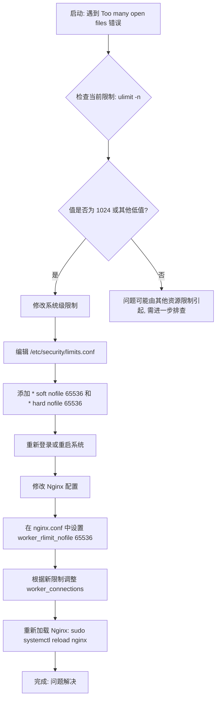

# Linux 文件描述符限制与 Nginx 最佳实践

当在 Linux 系统上遇到 "Too many open files" 错误时，这通常意味着进程尝试打开的文件句柄（包括网络连接、文件、管道等）超出了系统为其分配的限制。对于像 Nginx 这样的高并发 Web 服务器，默认的 `1024` 文件描述符限制是远远不够的。

本文将详细解释如何正确配置 Linux 系统和 Nginx，以避免此类问题，并提供最佳实践。

## 1. 问题分析

用户的核心问题是：在一个双核 CPU 的 Linux 实例上，虽然将 Nginx 的 `worker_processes` 设置为 `2` 是合理的，但 `ulimit -n` 的值为 `1024` 导致了 "Too many open files" 错误。

- **`worker_processes 2`**: 这个设置是合理的起点，它通常与 CPU 核心数匹配，以充分利用多核处理能力。现代 Nginx 版本更推荐使用 `worker_processes auto;`。
- **`ulimit -n 1024`**: 这是每个进程可以打开的最大文件描述符数量（nofile）。Nginx 的每个 `worker_process` 都会受到这个限制。在高并发场景下，每个连接都会消耗一个文件描述符，当连接数超过 1024 时，就会出现 "Too many open files" 错误。

## 2. 核心概念

### 文件描述符 (File Descriptor)

在 Linux 中，一切皆文件。内核通过一个称为“文件描述符”的非负整数来索引所有打开的文件，包括：

- 普通文件
- 目录
- 网络套接字 (Socket)
- 管道 (Pipe)
- 终端设备

Nginx 每接收一个客户端连接，就需要一个文件描述符。如果作为反向代理，它还需要另一个文件描述符来与上游服务器建立连接。因此，一个代理请求至少消耗两个文件描述符。

### `ulimit`

`ulimit` 是一个内建命令，用于控制 shell 及其子进程的可用资源。

- **软限制 (Soft Limit)**: `ulimit -n` 显示的值，是内核为进程强制执行的当前限制。任何进程都可以将自己的软限制降低，或提高到硬限制的上限。
- **硬限制 (Hard Limit)**: `ulimit -Hn` 显示的值，是软限制的上限。只有 root 用户才能提高硬限制。

## 3. 解决方案与最佳实践

解决此问题的关键是**提高文件描述符的限制**。这需要分层进行：在操作系统层面和在 Nginx 应用层面。

### 步骤 1：检查当前限制

```bash
# 检查软限制
ulimit -n

# 检查硬限制
ulimit -Hn
```

### 步骤 2：临时提高限制（仅限当前会话）

你可以为当前的 shell 会话临时提高限制，但这在系统重启或重新登录后会失效，仅适用于测试。

```bash
# 临时将软限制提高到 65536
ulimit -n 65536
```

### 步骤 3：永久提高系统级限制

这是推荐的、一劳永逸的方法。通过修改 `/etc/security/limits.conf` 文件来为所有用户或特定用户提高限制。

1.  **编辑配置文件**：

    ```bash
    sudo vim /etc/security/limits.conf
    ```

2.  **在文件末尾添加以下行**：

    ```plaintext
    # 为所有用户(*)设置软(soft)和硬(hard)的文件描述符(nofile)限制
    *   soft   nofile   65536
    *   hard   nofile   65536
    ```

    - `*`: 表示适用于所有用户。你也可以指定特定用户，如 `nginx`。
    - `soft`: 软限制。
    - `hard`: 硬限制。
    - `nofile`: 表示正在设置的是最大文件描述符数。
    - `65536`: 这是一个常用且推荐的高值。

3.  **重新登录或重启系统**以使配置生效。

### 步骤 4：配置 Nginx

即使在系统层面提高了限制，最佳实践是在 Nginx 配置中也明确指定其工作进程可以使用的文件描述符数量。这可以确保 Nginx 不会受到其他默认值的干扰。

1.  **编辑 Nginx 配置文件**：

    ```bash
    sudo vim /etc/nginx/nginx.conf
    ```

2.  **在主配置区域（`http` 块之外）添加 `worker_rlimit_nofile` 指令**：

    ```nginx
    # 建议设置为系统限制中配置的值
    worker_rlimit_nofile 65536;

    events {
        # 每个 worker 进程可以处理的最大连接数
        # 理论上最大值为 worker_rlimit_nofile / 2 (考虑代理)
        worker_connections 16384;
    }

    http {
        # ...
    }
    ```

    - **`worker_rlimit_nofile`**: 此指令会为 Nginx 的 worker 进程设置 `RLIMIT_NOFILE`，覆盖默认限制。它的值应小于或等于系统硬限制。
    - **`worker_connections`**: 这个值定义了每个 worker 进程可以同时打开的最大连接数。它的值不应超过 `worker_rlimit_nofile`。一个常见的经验法则是 `worker_connections` <= `worker_rlimit_nofile / 2`，为反向代理等场景预留足够的描述符。

## 4. 流程图

下面是诊断和解决 "Too many open files" 问题的流程图。



## 5. 总结

- **`worker_processes`**: 设置为 `auto` 或 CPU 核心数。
- **系统限制 (`/etc/security/limits.conf`)**: 将 `nofile` 的软硬限制提高到一个足够大的值，如 `65536`。
- **Nginx 限制 (`nginx.conf`)**:
  - 使用 `worker_rlimit_nofile` 明确设置 Nginx worker 进程的限制，与系统限制保持一致。
  - 合理设置 `worker_connections`，确保其值远小于 `worker_rlimit_nofile`。

通过以上配置，可以有效解决 "Too many open files" 问题，确保 Linux 服务器在高并发下稳定运行。

## 6. 常见误区澄清：`ulimit` 是针对单个进程的限制

一个常见的问题是：“如果我的系统硬限制很高，为什么 `ulimit -n` 的软限制为 1024 会成为问题？即使我有 2 个 worker 进程，总共也才 2048 个文件描述符，远低于系统上限。”

这是一个非常好的问题，它触及了限制如何工作的核心。关键在于：**`ulimit -n` 设置的是每个独立进程的限制，而不是所有进程共享的总和。**

- **独立限制**: 如果 `worker_processes` 设置为 `2`，Nginx 会启动两个独立的 worker 进程。从启动环境继承的 `1024` 软限制将分别应用于**每一个** worker 进程。
- **瓶颈所在**: 这意味着 Worker 进程 1 最多可以处理 1024 个文件描述符，同时 Worker 进程 2 也可以处理 1024 个。它们之间不共享这个配额。如果 Worker 1 上的并发连接数超过了 1024，即使 Worker 2 非常空闲，Worker 1 依然会触发 “Too many open files” 错误。
- **结论**: 因此，尽管整个系统能够支持远超 2048 个文件描述符，但单个 worker 进程的低限制成为了瓶颈。这就是为什么必须通过修改 `/etc/security/limits.conf` 或使用 Nginx 的 `worker_rlimit_nofile` 指令来提高**每个 worker 进程**的可用文件描述符数量。
