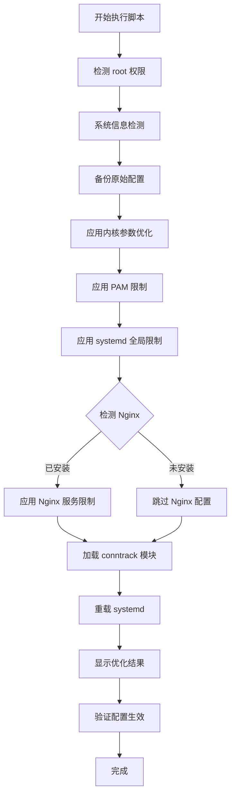

# GCP Linux 实例系统限制优化脚本

## 问题分析

针对 GCP Linux 实例运行 Nginx Web 服务器的场景,需要优化:

1. **文件描述符限制** (file descriptors)
2. **系统资源限制** (ulimit)
3. **内核参数** (sysctl)
4. **systemd 服务限制**

重点关注高并发场景下的系统级优化,不涉及 Nginx 配置文件。

---

## 优化脚本---
```bash
#!/usr/bin/env bash
# GCP-Linux-System-Optimize.sh
# GCP Linux 实例系统资源限制优化脚本
# 适用场景: Nginx Web 服务器高并发优化

set -Eeuo pipefail

ACTION="${1:-apply}"
BACKUP_DIR="/opt/system-optimize-backup/$(date +%Y%m%d_%H%M%S)"

# 配置文件路径
SYSCTL_FILE="/etc/sysctl.d/99-web-optimize.conf"
LIMITS_FILE="/etc/security/limits.d/99-web-optimize.conf"
SYSTEMD_SYSTEM_FILE="/etc/systemd/system.conf.d/99-limits.conf"
SYSTEMD_USER_FILE="/etc/systemd/user.conf.d/99-limits.conf"
NGINX_SERVICE_DIR="/etc/systemd/system/nginx.service.d"
NGINX_SERVICE_FILE="${NGINX_SERVICE_DIR}/override.conf"

#------------- 工具函数 -------------
log_ok()   { printf "\033[32m✓\033[0m %s\n" "$*"; }
log_warn() { printf "\033[33m⚠\033[0m %s\n" "$*"; }
log_err()  { printf "\033[31m✗\033[0m %s\n" "$*"; exit 1; }
log_info() { printf "\033[36mℹ\033[0m %s\n" "$*"; }

# 检查 root 权限
check_root() {
    [[ $EUID -eq 0 ]] || log_err "此脚本需要 root 权限执行"
}

# 备份原文件
backup_file() {
    local file="$1"
    if [[ -f "$file" ]]; then
        mkdir -p "$BACKUP_DIR"
        cp -a "$file" "$BACKUP_DIR/"
        log_info "已备份: $file -> $BACKUP_DIR/$(basename "$file")"
    fi
}

# 系统信息检测
detect_system() {
    echo "=========================================="
    echo "系统信息检测"
    echo "=========================================="
    echo "主机名称: $(hostname)"
    echo "操作系统: $(grep PRETTY_NAME /etc/os-release | cut -d'"' -f2)"
    echo "内核版本: $(uname -r)"
    echo "CPU 核心: $(nproc) cores"
    echo "总内存量: $(free -h | awk '/^Mem:/{print $2}')"
    echo "系统运行: $(uptime -p)"
    echo ""
    
    echo "当前限制状态:"
    echo "  ulimit -n (打开文件数):     $(ulimit -n)"
    echo "  ulimit -u (最大进程数):     $(ulimit -u)"
    echo "  fs.file-max (系统最大文件): $(cat /proc/sys/fs/file-max)"
    echo "  fs.nr_open (进程最大文件):  $(cat /proc/sys/fs/nr_open)"
    echo ""
    
    if command -v nginx &>/dev/null; then
        echo "Nginx 信息:"
        echo "  版本: $(nginx -v 2>&1 | awk '{print $3}')"
        echo "  状态: $(systemctl is-active nginx 2>/dev/null || echo '未运行')"
        if systemctl is-active nginx &>/dev/null; then
            local master_pid=$(pgrep -f 'nginx: master' | head -1)
            [[ -n "$master_pid" ]] && echo "  主进程打开文件数: $(ls /proc/$master_pid/fd 2>/dev/null | wc -l)"
        fi
    else
        log_warn "Nginx 未安装"
    fi
    echo ""
}

#------------- 优化配置应用 -------------

# 1. 内核参数优化
apply_sysctl() {
    log_info "应用内核参数优化..."
    backup_file "$SYSCTL_FILE"
    
    cat > "$SYSCTL_FILE" <<'EOF'
# ========================================
# GCP Linux Web 服务器内核参数优化
# ========================================

# === 文件系统限制 ===
# 系统级别最大文件句柄数
fs.file-max = 2097152
# 单个进程最大文件句柄数
fs.nr_open = 2097152
# inotify 监视文件数量限制
fs.inotify.max_user_watches = 524288
fs.inotify.max_user_instances = 8192

# === 网络核心参数 ===
# 最大监听队列长度
net.core.somaxconn = 65535
# 网络设备接收队列长度
net.core.netdev_max_backlog = 65535
# 接收缓冲区大小
net.core.rmem_default = 262144
net.core.rmem_max = 33554432
# 发送缓冲区大小
net.core.wmem_default = 262144
net.core.wmem_max = 33554432
# 套接字选项内存最大值
net.core.optmem_max = 25165824

# === TCP 协议优化 ===
# TCP SYN 队列长度
net.ipv4.tcp_max_syn_backlog = 65535
# TIME_WAIT 状态的最大数量
net.ipv4.tcp_max_tw_buckets = 2000000
# 开启 TIME_WAIT 快速回收
net.ipv4.tcp_tw_reuse = 1
# FIN_WAIT 超时时间
net.ipv4.tcp_fin_timeout = 10
# TCP keepalive 参数
net.ipv4.tcp_keepalive_time = 600
net.ipv4.tcp_keepalive_probes = 3
net.ipv4.tcp_keepalive_intvl = 15
# TCP 缓冲区大小 (min default max)
net.ipv4.tcp_rmem = 4096 87380 33554432
net.ipv4.tcp_wmem = 4096 65536 33554432
# TCP 拥塞控制算法
net.ipv4.tcp_congestion_control = bbr
# TCP 快速打开
net.ipv4.tcp_fastopen = 3
# 禁用慢启动重启
net.ipv4.tcp_slow_start_after_idle = 0

# === 端口范围 ===
net.ipv4.ip_local_port_range = 1024 65535

# === 虚拟内存管理 ===
# 降低 swap 使用倾向
vm.swappiness = 10
# 脏页比例控制
vm.dirty_ratio = 15
vm.dirty_background_ratio = 5
# 内存分配策略
vm.overcommit_memory = 1
# 最小空闲内存
vm.min_free_kbytes = 65536

# === 进程和线程 ===
# 最大进程 ID
kernel.pid_max = 4194304
# 最大线程数
kernel.threads-max = 4194304

# === 连接跟踪 ===
# conntrack 最大连接数
net.netfilter.nf_conntrack_max = 1048576
# conntrack 超时时间
net.netfilter.nf_conntrack_tcp_timeout_established = 7200
net.netfilter.nf_conntrack_tcp_timeout_time_wait = 60
net.netfilter.nf_conntrack_tcp_timeout_close_wait = 30
net.netfilter.nf_conntrack_tcp_timeout_fin_wait = 60
EOF

    sysctl -p "$SYSCTL_FILE" >/dev/null 2>&1 || sysctl --system >/dev/null 2>&1
    log_ok "内核参数已应用: $SYSCTL_FILE"
}

# 2. PAM 限制配置
apply_pam_limits() {
    log_info "应用 PAM 系统限制..."
    backup_file "$LIMITS_FILE"
    
    cat > "$LIMITS_FILE" <<'EOF'
# ========================================
# GCP Linux Web 服务器系统资源限制
# ========================================

# === 文件描述符限制 ===
*       soft    nofile      1048576
*       hard    nofile      1048576
root    soft    nofile      1048576
root    hard    nofile      1048576

# === 进程数限制 ===
*       soft    nproc       unlimited
*       hard    nproc       unlimited
root    soft    nproc       unlimited
root    hard    nproc       unlimited

# === 内存锁定 ===
*       soft    memlock     unlimited
*       hard    memlock     unlimited

# === 核心转储大小 ===
*       soft    core        unlimited
*       hard    core        unlimited

# === 最大锁定内存 ===
*       soft    locks       unlimited
*       hard    locks       unlimited

# === 栈大小限制 ===
*       soft    stack       unlimited
*       hard    stack       unlimited

# === 消息队列 ===
*       soft    msgqueue    unlimited
*       hard    msgqueue    unlimited
EOF

    log_ok "PAM 限制已应用: $LIMITS_FILE"
}

# 3. systemd 全局限制
apply_systemd_limits() {
    log_info "应用 systemd 全局限制..."
    
    # system.conf.d
    mkdir -p "$(dirname "$SYSTEMD_SYSTEM_FILE")"
    backup_file "$SYSTEMD_SYSTEM_FILE"
    
    cat > "$SYSTEMD_SYSTEM_FILE" <<'EOF'
[Manager]
# 默认文件描述符限制
DefaultLimitNOFILE=1048576:1048576
# 默认进程数限制
DefaultLimitNPROC=infinity:infinity
# 内存锁定限制
DefaultLimitMEMLOCK=infinity:infinity
# 核心转储大小
DefaultLimitCORE=infinity:infinity
# 最大栈大小
DefaultLimitSTACK=infinity:infinity
EOF

    # user.conf.d
    mkdir -p "$(dirname "$SYSTEMD_USER_FILE")"
    backup_file "$SYSTEMD_USER_FILE"
    
    cat > "$SYSTEMD_USER_FILE" <<'EOF'
[Manager]
DefaultLimitNOFILE=1048576:1048576
DefaultLimitNPROC=infinity:infinity
DefaultLimitMEMLOCK=infinity:infinity
DefaultLimitCORE=infinity:infinity
EOF

    systemctl daemon-reload
    log_ok "systemd 全局限制已应用"
}

# 4. Nginx 服务专项限制
apply_nginx_service_limits() {
    if ! command -v nginx &>/dev/null; then
        log_warn "Nginx 未安装,跳过服务限制配置"
        return 0
    fi
    
    log_info "应用 Nginx 服务限制..."
    mkdir -p "$NGINX_SERVICE_DIR"
    backup_file "$NGINX_SERVICE_FILE"
    
    cat > "$NGINX_SERVICE_FILE" <<'EOF'
[Service]
# === 资源限制 ===
LimitNOFILE=1048576
LimitNPROC=infinity
LimitMEMLOCK=infinity
LimitCORE=infinity

# === 安全加固 ===
# 私有临时目录
PrivateTmp=true
# 禁止新权限
NoNewPrivileges=true
# 保护系统目录
ProtectSystem=full
ProtectHome=true

# === 性能优化 ===
# 进程优先级 (-20 到 19, 数值越小优先级越高)
Nice=-5
# IO 调度类别 (0=none, 1=realtime, 2=best-effort, 3=idle)
IOSchedulingClass=1
# IO 调度优先级 (0-7, 数值越小优先级越高)
IOSchedulingPriority=2

# === 重启策略 ===
Restart=always
RestartSec=5s
EOF

    systemctl daemon-reload
    log_ok "Nginx 服务限制已应用: $NGINX_SERVICE_FILE"
    
    if systemctl is-active nginx &>/dev/null; then
        log_warn "Nginx 正在运行,需要重启服务使配置生效: systemctl restart nginx"
    fi
}

# 5. 加载 conntrack 模块
load_conntrack_module() {
    log_info "检查 conntrack 模块..."
    
    if ! lsmod | grep -q nf_conntrack; then
        modprobe nf_conntrack 2>/dev/null || log_warn "无法加载 nf_conntrack 模块"
    fi
    
    # 确保开机自动加载
    if [[ ! -f /etc/modules-load.d/nf_conntrack.conf ]]; then
        echo "nf_conntrack" > /etc/modules-load.d/nf_conntrack.conf
        log_ok "已配置 conntrack 模块开机自动加载"
    fi
}

#------------- 状态检查 -------------

check_current_limits() {
    echo "=========================================="
    echo "当前系统限制状态"
    echo "=========================================="
    
    echo "### 内核参数 ###"
    printf "%-40s: %s\n" "fs.file-max" "$(sysctl -n fs.file-max)"
    printf "%-40s: %s\n" "fs.nr_open" "$(sysctl -n fs.nr_open)"
    printf "%-40s: %s\n" "net.core.somaxconn" "$(sysctl -n net.core.somaxconn)"
    printf "%-40s: %s\n" "net.ipv4.tcp_max_syn_backlog" "$(sysctl -n net.ipv4.tcp_max_syn_backlog)"
    printf "%-40s: %s\n" "net.ipv4.tcp_congestion_control" "$(sysctl -n net.ipv4.tcp_congestion_control)"
    if sysctl -n net.netfilter.nf_conntrack_max &>/dev/null; then
        printf "%-40s: %s\n" "net.netfilter.nf_conntrack_max" "$(sysctl -n net.netfilter.nf_conntrack_max)"
    fi
    echo ""
    
    echo "### ulimit 限制 ###"
    printf "%-40s: %s / %s\n" "打开文件数 (soft/hard)" "$(ulimit -Sn)" "$(ulimit -Hn)"
    printf "%-40s: %s / %s\n" "最大进程数 (soft/hard)" "$(ulimit -Su)" "$(ulimit -Hu)"
    printf "%-40s: %s / %s\n" "最大锁定内存 (soft/hard)" "$(ulimit -Sl)" "$(ulimit -Hl)"
    echo ""
    
    echo "### 配置文件状态 ###"
    [[ -f "$SYSCTL_FILE" ]] && echo "  ✓ $SYSCTL_FILE" || echo "  ✗ $SYSCTL_FILE [未配置]"
    [[ -f "$LIMITS_FILE" ]] && echo "  ✓ $LIMITS_FILE" || echo "  ✗ $LIMITS_FILE [未配置]"
    [[ -f "$SYSTEMD_SYSTEM_FILE" ]] && echo "  ✓ $SYSTEMD_SYSTEM_FILE" || echo "  ✗ $SYSTEMD_SYSTEM_FILE [未配置]"
    [[ -f "$NGINX_SERVICE_FILE" ]] && echo "  ✓ $NGINX_SERVICE_FILE" || echo "  ✗ $NGINX_SERVICE_FILE [未配置]"
    echo ""
    
    if command -v nginx &>/dev/null && systemctl is-active nginx &>/dev/null; then
        echo "### Nginx 进程状态 ###"
        local master_pid=$(pgrep -f 'nginx: master' | head -1)
        if [[ -n "$master_pid" ]]; then
            echo "主进程 PID: $master_pid"
            echo "打开文件数: $(ls /proc/$master_pid/fd 2>/dev/null | wc -l)"
            echo "进程限制:"
            grep "Max open files" /proc/$master_pid/limits 2>/dev/null || true
            grep "Max processes" /proc/$master_pid/limits 2>/dev/null || true
        fi
        echo ""
    fi
    
    echo "### 系统资源使用 ###"
    printf "%-40s: %s\n" "CPU 负载" "$(uptime | awk -F'load average:' '{print $2}')"
    printf "%-40s: %.1f%%\n" "内存使用率" "$(free | awk '/^Mem:/ {printf "%.1f", $3/$2 * 100.0}')"
    printf "%-40s: %s\n" "根分区使用" "$(df -h / | awk 'NR==2 {print $5}')"
}

# 验证优化效果
verify_optimization() {
    echo "=========================================="
    echo "优化效果验证"
    echo "=========================================="
    
    local issues=0
    
    # 检查文件描述符
    local current_nofile=$(ulimit -n)
    if [[ $current_nofile -lt 1048576 ]]; then
        log_warn "文件描述符限制 ($current_nofile) 小于推荐值 1048576"
        ((issues++))
    else
        log_ok "文件描述符限制: $current_nofile"
    fi
    
    # 检查内核参数
    local file_max=$(sysctl -n fs.file-max)
    if [[ $file_max -lt 2097152 ]]; then
        log_warn "fs.file-max ($file_max) 小于推荐值 2097152"
        ((issues++))
    else
        log_ok "fs.file-max: $file_max"
    fi
    
    # 检查 BBR
    local cc=$(sysctl -n net.ipv4.tcp_congestion_control)
    if [[ "$cc" != "bbr" ]]; then
        log_warn "TCP 拥塞控制未使用 BBR (当前: $cc)"
        ((issues++))
    else
        log_ok "TCP 拥塞控制: $cc"
    fi
    
    echo ""
    if [[ $issues -eq 0 ]]; then
        log_ok "所有检查项通过!"
    else
        log_warn "发现 $issues 个问题,建议重启系统或重新登录"
    fi
}

#------------- 主程序 -------------

main() {
    check_root
    
    case "$ACTION" in
        apply)
            echo "=========================================="
            echo "GCP Linux 系统优化脚本"
            echo "=========================================="
            echo ""
            
            detect_system
            apply_sysctl
            apply_pam_limits
            apply_systemd_limits
            apply_nginx_service_limits
            load_conntrack_module
            
            echo ""
            echo "=========================================="
            log_ok "优化配置已应用完成"
            echo "=========================================="
            echo ""
            
            log_info "备份文件保存在: $BACKUP_DIR"
            echo ""
            
            log_warn "重要提示:"
            echo "  1. 建议重新登录或重启系统使所有配置生效"
            echo "  2. 如果 Nginx 正在运行: systemctl restart nginx"
            echo "  3. 查看当前状态: $0 status"
            echo "  4. 验证优化效果: $0 verify"
            ;;
            
        status)
            detect_system
            check_current_limits
            ;;
            
        verify)
            verify_optimization
            ;;
            
        rollback)
            if [[ ! -d "$BACKUP_DIR" ]]; then
                log_err "未找到备份目录,无法回滚"
            fi
            
            log_info "开始回滚配置..."
            
            for file in "$SYSCTL_FILE" "$LIMITS_FILE" "$SYSTEMD_SYSTEM_FILE" "$NGINX_SERVICE_FILE"; do
                local backup="${BACKUP_DIR}/$(basename "$file")"
                if [[ -f "$backup" ]]; then
                    cp -a "$backup" "$file"
                    log_ok "已恢复: $file"
                fi
            done
            
            sysctl --system >/dev/null 2>&1
            systemctl daemon-reload
            log_ok "配置已回滚"
            ;;
            
        *)
            cat <<EOF
用法: $0 [apply|status|verify|rollback]

命令说明:
  apply     应用所有系统优化配置 (需要 root 权限)
  status    显示当前系统限制状态
  verify    验证优化配置是否生效
  rollback  回滚到优化前的配置

示例:
  sudo $0 apply        # 应用优化
  $0 status            # 查看状态
  $0 verify            # 验证优化
  sudo $0 rollback     # 回滚配置

配置文件位置:
  - 内核参数: $SYSCTL_FILE
  - PAM 限制: $LIMITS_FILE
  - systemd:  $SYSTEMD_SYSTEM_FILE
  - Nginx:    $NGINX_SERVICE_FILE
EOF
            exit 1
            ;;
    esac
}

main
```

## 使用说明

### 快速开始

```bash
# 1. 下载脚本并赋予执行权限
chmod +x GCP-Linux-System-Optimize.sh

# 2. 查看当前系统状态
./GCP-Linux-System-Optimize.sh status

# 3. 应用优化配置 (需要 root 权限)
sudo ./GCP-Linux-System-Optimize.sh apply

# 4. 验证优化效果
./GCP-Linux-System-Optimize.sh verify

# 5. 如需回滚配置
sudo ./GCP-Linux-System-Optimize.sh rollback
```

---

## 优化内容说明

### 1. 文件描述符限制优化

|参数|优化值|说明|
|---|---|---|
|`fs.file-max`|2097152|系统级别最大文件句柄数|
|`fs.nr_open`|2097152|单个进程最大文件句柄数|
|`ulimit -n`|1048576|用户级别打开文件数限制|

### 2. 网络连接优化

|参数|优化值|说明|
|---|---|---|
|`net.core.somaxconn`|65535|最大监听队列长度|
|`net.ipv4.tcp_max_syn_backlog`|65535|SYN 队列最大长度|
|`net.ipv4.tcp_max_tw_buckets`|2000000|TIME_WAIT 最大数量|
|`net.ipv4.tcp_congestion_control`|bbr|使用 Google BBR 拥塞控制|

### 3. systemd 服务限制

```conf
[Service]
LimitNOFILE=1048576          # 文件描述符
LimitNPROC=infinity          # 进程数
LimitMEMLOCK=infinity        # 内存锁定
LimitCORE=infinity           # 核心转储
```

---

## 优化流程图



---

## 配置验证流程


---

## 重要注意事项

### 1. 执行前检查

```bash
# 检查当前限制
ulimit -a

# 检查系统内核参数
sysctl -a | grep -E 'file-max|nr_open|somaxconn'

# 检查 Nginx 进程限制
sudo cat /proc/$(pgrep -f 'nginx: master')/limits
```

### 2. 配置生效方式

|配置类型|生效方式|说明|
|---|---|---|
|内核参数|`sysctl -p`|立即生效|
|PAM 限制|重新登录|需要新会话|
|systemd 限制|`daemon-reload`|立即生效|
|Nginx 服务|`systemctl restart nginx`|需重启服务|

### 3. 验证优化效果

```bash
# 验证当前会话限制
ulimit -n

# 验证 Nginx 进程限制
sudo grep "Max open files" /proc/$(pgrep -f 'nginx: master')/limits

# 验证内核参数
sysctl fs.file-max
sysctl net.core.somaxconn
sysctl net.ipv4.tcp_congestion_control
```

### 4. BBR 拥塞控制检查

```bash
# 检查 BBR 模块是否加载
lsmod | grep tcp_bbr

# 如果未加载,手动加载
sudo modprobe tcp_bbr
echo "tcp_bbr" | sudo tee -a /etc/modules-load.d/bbr.conf

# 验证生效
sysctl net.ipv4.tcp_congestion_control
```

---

## 故障排查

### 问题 1: 配置未生效

```bash
# 检查配置文件语法
sudo sysctl --system

# 查看 systemd 日志
sudo journalctl -u nginx -n 50

# 重新加载所有配置
sudo sysctl -p /etc/sysctl.d/99-web-optimize.conf
sudo systemctl daemon-reload
```

### 问题 2: BBR 未启用

```bash
# 检查内核版本 (BBR 需要 4.9+)
uname -r

# 检查是否支持 BBR
modinfo tcp_bbr

# 手动加载模块
sudo modprobe tcp_bbr
```

### 问题 3: Nginx 限制未生效

```bash
# 检查服务配置
sudo systemctl cat nginx | grep -A 10 "Service"

# 重启 Nginx 服务
sudo systemctl restart nginx

# 验证进程限制
sudo cat /proc/$(pgrep -f 'nginx: master')/limits | grep "Max open files"
```

---

## 性能监控命令

```bash
# 监控打开文件数
watch -n 1 'cat /proc/sys/fs/file-nr'

# 监控 TCP 连接状态
watch -n 1 'ss -s'

# 监控 Nginx 进程资源
watch -n 1 'ps aux | grep nginx | grep -v grep'

# 监控系统负载
watch -n 1 'uptime; free -h'
```

---

## 最佳实践建议

1. **测试环境验证**: 在生产环境应用前,先在测试环境验证
2. **备份重要数据**: 脚本会自动备份,建议额外手动备份
3. **分步骤应用**: 可以先应用部分配置,观察效果后再全部应用
4. **监控系统资源**: 优化后持续监控 CPU、内存、网络等资源使用情况
5. **定期审查**: 根据实际业务负载定期调整参数