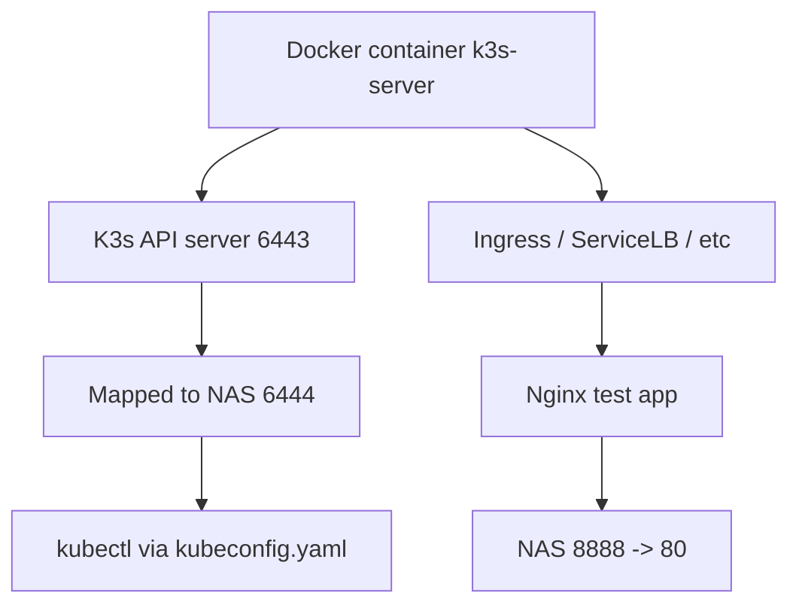

下面给你一个 **在 NAS（QNAP / Synology / 任意 Linux）上让 Docker 走代理拉取镜像的完整可操作方案**。  

方案4 success
```bash
[/share/CACHEDEV3_DATA/git/dashboard/hestia-core] # docker pull nginx:alpine
alpine: Pulling from library/nginx
2d35ebdb57d9: Pull complete
8f6a6833e95d: Pull complete
194fa24e147d: Pull complete
3eaba6cd10a3: Pull complete
df413d6ebdc8: Pull complete
d9a55dab5954: Pull complete
ff8a36d5502a: Pull complete
bdabb0d44271: Pull complete
Digest: sha256:b3c656d55d7ad751196f21b7fd2e8d4da9cb430e32f646adcf92441b72f82b14
Status: Downloaded newer image for nginx:alpine
docker.io/library/nginx:alpine


1 运行k3s reference Docker hub 这里因为端口占用 ，所以我重新启用新的端口。 
docker run -d --name k3s-server \
  --privileged \
  --network host \
  -p 6444:6443 \
  -p 8888:80 \
  -p 4443:443 \
  -v /var/lib/rancher/k3s:/var/lib/rancher/k3s \
  -v /var/lib/kubelet:/var/lib/kubelet \
  -v /var/run:/var/run \
  rancher/k3s:v1.32.10-k3s1 server \
  --tls-san 192.168.31.88

docker run -d --name k3s-server \
  --privileged \
  --network host \
  -p 6444:6443 \
  -p 8888:80 \
  -p 4443:443 \
  -v /var/lib/rancher/k3s:/var/lib/rancher/k3s \
  -v /var/lib/kubelet:/var/lib/kubelet \
  -v /var/run:/var/run \
  rancher/k3s:v1.32.10-k3s1 server 
  
  docker run -d --name k3s-server \
  --privileged \
  --network host \
  -v /var/lib/rancher/k3s:/var/lib/rancher/k3s \
  -v /var/lib/kubelet:/var/lib/kubelet \
  -v /var/run:/var/run \
  rancher/k3s:v1.32.10-k3s1 server \
  --https-listen-port 6443 \
  --disable traefik \
  --tls-san 192.168.31.88


2   
docker ps -a
CONTAINER ID   IMAGE                                           COMMAND                  CREATED          STATUS                       PORTS                                                                    NAMES
40b5eb9cad24   rancher/k3s:v1.32.10-k3s1                       "/bin/k3s server"        33 seconds ago   Up 32 seconds                0.0.0.0:8888->80/tcp, 0.0.0.0:4433->443/tcp, 0.0.0.0:6444->6443/tcp      k3s-server
3 重新导出 kubeconfig：然后修改侦听地址和 忽略证书
docker exec k3s-server cat /etc/rancher/k3s/k3s.yaml > kubeconfig.yaml
docker exec qnap-k3s cat /etc/rancher/k3s/k3s.yaml

clusters:
- cluster:
    insecure-skip-tls-verify: true
    server: https://192.168.31.88:6444
  name: default
4 macOS上 
export KUBECONFIG=$(pwd)/kubeconfig.yaml ==> mac pro
Docker =/Users/lex/nas-k3s.yaml ==> na
5 
➜  ~ kubectl get nodes
NAME           STATUS   ROLES                  AGE   VERSION
40b5eb9cad24   Ready    control-plane,master   13m   v1.32.10+k3s1
➜  ~ kubectl get pod -A
NAMESPACE     NAME                                      READY   STATUS              RESTARTS   AGE
kube-system   coredns-6d668d687-qlxkb                   0/1     ContainerCreating   0          13m
kube-system   helm-install-traefik-crd-ggqq6            0/1     ContainerCreating   0          13m
kube-system   helm-install-traefik-j7nn7                0/1     ContainerCreating   0          13m
kube-system   local-path-provisioner-869c44bfbd-rhd5j   0/1     ContainerCreating   0          13m
kube-system   metrics-server-7bfffcd44-zjq52            0/1     ContainerCreating   0          13m
6 manual pull images 
docker pull rancher/mirrored-coredns-coredns:1.13.1
rancher/local-path-provisioner:v0.0.32
rancher/mirrored-metrics-server:v0.8.0
docker pull docker.io/rancher/mirrored-pause:3.6

```

全部内容均为 **可直接复制使用的 Shell 命令**，并按照你的网络结构（NAS 无法直连 docker.io，Mac 有代理）来设计。

---

# **问题分析**

你的 NAS 上无法直接从 `docker.io/library/nginx:alpine` 拉取镜像。  
常见原因：

- NAS 所在网络无法直连 Docker Hub（被墙 or 网络策略）
    
- NAS 默认 Docker **不会读取 export 的代理变量**
    
- 需要在 Docker daemon 级别配置代理，或者在 Docker CLI 层配置代理
    

---

# **解决方案**

适合所有类型 NAS（QNAP/Synology/自建 Linux）

---

## **方案 1：给 Docker Daemon 配置代理（推荐，最稳定）**

### **步骤 1：创建 Docker daemon 代理配置**

在 NAS 上执行：

```bash
sudo mkdir -p /etc/systemd/system/docker.service.d
```

创建配置文件：

```bash
sudo tee /etc/systemd/system/docker.service.d/http-proxy.conf <<EOF
[Service]
Environment="HTTP_PROXY=http://192.168.31.198:7222"
Environment="HTTPS_PROXY=http://192.168.31.198:7222"
Environment="NO_PROXY=localhost,127.0.0.1"
EOF
```

> 说明：  
> `192.168.31.198:7222` 是你 Mac 上的代理（如 Loon/Clash）。

---

### **步骤 2：重载并重启 Docker**

```bash
sudo systemctl daemon-reload
sudo systemctl restart docker
```

---

### **步骤 3：测试是否生效**

```bash
docker pull nginx:alpine
```

如果成功，那么 Daemon 代理已经启用。

---

## **方案 2：CLI 层使用代理（临时使用）**

如果 NAS 不支持 systemd 或你想快速测试：

```bash
export HTTP_PROXY=http://192.168.31.198:7222
export HTTPS_PROXY=http://192.168.31.198:7222

docker pull nginx:alpine
```

**注意**：  
⚠️ Docker CLI 层的 proxy 通常 **对 build 有效，但是对 pull 不一定生效**  
因为 pull 是 Docker daemon 执行的。

---

## **方案 3：为 Docker Hub 配置镜像加速器（辅助）**

你也可以加一个 registry mirror（不是代理，但能加速/绕路）

### QNAP/Synology 可能需要修改：

```bash
sudo tee /etc/docker/daemon.json <<EOF
{
  "registry-mirrors": [
    "https://docker.1panel.live",
    "https://dockerproxy.com"
  ]
}
EOF
```

然后重启 Docker：

```bash
sudo systemctl restart docker
```

---

# **方案 4：如果 NAS Docker 是 QNAP Container Station（无 systemd）**

QNAP 的 Docker 路径是：

```
/share/CACHEDEV1_DATA/.qpkg/container-station/bin/docker
```

你可以直接写环境变量文件：

### 创建配置目录

```bash
mkdir -p /share/CACHEDEV1_DATA/.qpkg/container-station/etc/systemd/system/docker.service.d/
```

### 创建代理文件

```bash
tee /share/CACHEDEV1_DATA/.qpkg/container-station/etc/systemd/system/docker.service.d/http-proxy.conf <<EOF
[Service]
Environment="HTTP_PROXY=http://192.168.31.198:7222"
Environment="HTTPS_PROXY=http://192.168.31.198:7222"
Environment="NO_PROXY=localhost,127.0.0.1"
EOF
```

然后重启 Container Station（不是 systemctl）：

```bash
/etc/init.d/container-station.sh restart
```

---

# **方案 5：使用 Mac 作为「代理网关」(透明)**

如果 NAS 无法配置 systemd，可以让 NAS 整个网络流量走你 Mac 的代理：

在 Mac 的 Clash / Loon 设置：

```
Allow LAN: true
Mixin 开启 redir / tproxy
```

NAS 上设置：

```
默认网关指向 Mac 的 IP
DNS 也改成 8.8.8.8 或 Cloudflare
```

这样拉镜像不需要设置代理。

---

# **注意事项**

- Docker pull 的代理必须是 Docker daemon 层生效
    
- export 只能解决 **docker build**，不一定解决 **docker pull**
    
- QNAP/Synology 没 systemd，需要使用它们自己的 Docker 服务脚本
    
- 如果 Mac 的代理限制了 LAN，需要开启 **Allow LAN**
    

---

# **如果你告诉我：**

👉 你的 NAS 是 **QNAP / Synology / Linux（什么发行版）**  
👉 Docker 路径（你已经提供：`/share/CACHEDEV1_DATA/.qpkg/container-station/bin/docker`）

我可以帮你生成 **完全匹配你系统的最终版本脚本**。

要不要我直接帮你做 **NAS（QNAP）专用的完整配置文件 + 一键脚本？**


下面我给你 **基于你当前端口映射（8888/4433/6444）** 的完整使用方法。

你现在的 k3s 容器运行情况如下：

```
Host:8888  -> Container:80
Host:4433 -> Container:443
Host:6444 -> Container:6443  ← k3s API server
```

因此 **你的 Kubernetes API 入口地址变成：**

```
https://<NAS-IP>:6444
```

接下来需要 3 个步骤：

---

# 1. 获取 kubeconfig（最关键）

k3s 的 kubeconfig 在容器内 `/etc/rancher/k3s/k3s.yaml`  
直接从容器中取出来：

```bash
docker exec k3s-server cat /etc/rancher/k3s/k3s.yaml > kubeconfig.yaml
```

然后修改其中的 API 地址：

### 打开 kubeconfig.yaml

把里面的：

```
server: https://127.0.0.1:6443
```

改成：

```
server: https://<NAS-IP>:6444
```

例如：

```
server: https://192.168.31.50:6444
```

---

# 2. 使用 kubeconfig 操作 k3s

确保你本地装好了 kubectl（Mac 已有）。  
然后执行：

```bash
export KUBECONFIG=$(pwd)/kubeconfig.yaml
```

验证访问：

```bash
kubectl get nodes
```

你应该看到类似：

```
NAME         STATUS   ROLES                  AGE   VERSION
k3s-server   Ready    control-plane,master   2m    v1.32.10+k3s1
```

---

# 3. 部署一个测试应用验证端口映射

因为你把容器内的 **80 映射到 NAS 的 8888**，所以我们部署一个 nginx：

```bash
kubectl create deployment web --image=nginx
kubectl expose deployment web --port=80
```

然后创建 LoadBalancer（k3s 自带 servicelb）：

```bash
kubectl expose deployment web --type=LoadBalancer --port=80
```

获取端口：

```bash
kubectl get svc web
```

输出示例：

```
NAME   TYPE           CLUSTER-IP     EXTERNAL-IP   PORT(S)
web    LoadBalancer   10.43.120.45   192.168.31.50  80:31136/TCP
```

访问方式：

```
http://<NAS-IP>:31136
```

如果想直接映射到你设置的 8888，请在 k3s 启动命令中：

```
-p 8888:80
```

你已经这么做了，所以访问：

```
http://<NAS-IP>:8888
```

你会看到 nginx 欢迎页。

---

# 4. 检查 k3s 内部组件

查看 pods：

```bash
kubectl get pods -A
```

你会看到：

- traefik（ingress）
    
- coredns
    
- metrics-server
    
- local-path-provisioner
    
- servicelb
    

这些都是 k3s 自带的组件。

---

# 5. 完整图示



---

# 6. 你现在可以做的事

你现在已经具备：

|任务|命令|
|---|---|
|查看集群状态|`kubectl get nodes`|
|查看所有组件|`kubectl get pods -A`|
|部署 app|`kubectl create deployment`|
|对外暴露服务|`kubectl expose`|
|进入 k3s 容器|`docker exec -it k3s-server sh`|

---

# **如果你希望我帮你生成一个自动化脚本：**

- 自动启动 k3s（含端口 8888/4433/6444）
    
- 自动导出 kubeconfig
    
- 自动替换 server 地址
    
- 自动配置 kubectl
    

我可以给你一个 **一键脚本（NAS 专用）**。

需要我帮你生成吗？


你现在遇到的报错非常典型：

```
tls: failed to verify certificate: x509: certificate is valid for 10.0.3.9, 10.43.0.1, 127.0.0.1, ::1, not 192.168.31.88
```

也就是说：  
**你的 kubeconfig 指向了 `https://192.168.31.88:6444`，但是 k3s 内部生成的 APIServer 证书里并没有这个 IP，所以 TLS 校验失败。**

---

# ✅ **解决方案有两种（任选一种）**

---

# **方案 A（推荐）：重新启动 k3s 时加入 --tls-san，让证书信任 192.168.31.88**

k3s 原生支持加入 SAN (Subject Alternative Name)。

你现在启动 k3s 的 docker run 命令应该是类似这样：

```
docker run -d --name k3s-server \
  --privileged \
  -p 6444:6443 \
  -p 8888:80 \
  -p 4433:443 \
  rancher/k3s:v1.32.10-k3s1 server
```

你需要加上以下参数：

```
--tls-san 192.168.31.88
```

---

## 📌 **最终命令（请重新启动 k3s 容器）**

```bash
docker rm -f k3s-server
```

再启动：

```bash
docker run -d --name k3s-server \
  --privileged \
  -p 6444:6443 \
  -p 8888:80 \
  -p 4433:443 \
  -v /var/lib/rancher/k3s:/var/lib/rancher/k3s \
  -v /var/lib/kubelet:/var/lib/kubelet \
  -v /var/run:/var/run \
  rancher/k3s:v1.32.10-k3s1 server \
  --tls-san 192.168.31.88
```

k3s 会重新生成证书，包含你的 NAS IP。

---

# **方案 B：修改 kubeconfig，让其忽略证书校验（不推荐）**

只需要在 kubeconfig.yaml 的 cluster 中加入：

```yaml
insecure-skip-tls-verify: true
```

例如：

```yaml
clusters:
- cluster:
    certificate-authority-data: xxx
    insecure-skip-tls-verify: true
    server: https://192.168.31.88:6444
  name: default
```

缺点：

- 跳过 TLS 校验，不安全
    
- 长期用不推荐
    

---

# 🔍 **为什么 k3s 默认证书不包含 192.168.31.88？**

因为：

- k3s 在容器内运行
    
- APIServer 默认用 container 内的网络 IP，例如 `10.0.3.9`
    
- k3s 不会自动把 Host 的局域网 IP 加进去（除非用 --tls-san）
    

这属于正常设计。

---

# 🧪 **验证修复后的状态**

重新导出 kubeconfig：

```bash
docker exec k3s-server cat /etc/rancher/k3s/k3s.yaml > kubeconfig.yaml
```

修改里面的：

```
server: https://192.168.31.88:6444
```

然后执行：

```bash
export KUBECONFIG=$(pwd)/kubeconfig.yaml
kubectl get nodes
```

你应该看到：

```
NAME         STATUS   ROLES                  AGE   VERSION
k3s-server   Ready    control-plane,master   1m    v1.32.10+k3s1
```

---

# 🚀 **是否需要我帮你生成最终的一键脚本？**

内容包括：

- 自动启动 k3s（可自定义端口）
    
- 自动加入 `--tls-san NAS_IP`
    
- 自动导出并修复 kubeconfig
    
- 自动创建 `alias k=kubectl`
    

你只需要告诉我：

👉 你的 NAS IP（确认）  
👉 你的端口是否固定：8888 / 4433 / 6444

我即可生成完整自动化脚本。