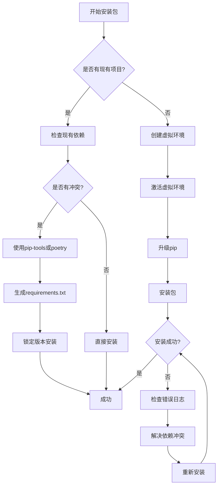

在 Ubuntu 24.04 上使用 Python 安装 cybervault-cve-report 包时，如果你不确定应该安装哪个版本，或者需要从你的本地 PyPI 镜像仓库或私有仓库中查找合适版本，可以按照以下步骤操作。

⸻

✅ 1. 查看当前可用的 Python 版本

首先确认你当前的 Python 和 pip 版本：

python3 --version
python3 -m pip --version

例如输出可能是：

Python 3.12.2
pip 24.0


⸻

✅ 2. 使用 pip 查询可用版本（默认 PyPI）

你可以运行以下命令来列出 cybervault-cve-report 的所有可用版本：

python3 -m pip install cybervault-cve-report==

会返回类似：

ERROR: Could not find a version that satisfies the requirement cybervault-cve-report== (from versions: 0.1.0, 0.1.1, 0.2.0)

这样你就可以看到可用的版本。

⸻

✅ 3. 如果你是使用私有仓库（比如公司内部 PyPI 镜像）

可以加上 --index-url 或 --extra-index-url 指向你的 PyPI 镜像地址：

python3 -m pip install cybervault-cve-report== \
  --index-url https://your.company.repo/simple

或者你想列出版本，使用：

pip index versions cybervault-cve-report \
  --index-url https://your.company.repo/simple

pip index versions 是从 pip 21.2 开始支持的。

⸻

✅ 4. 安装指定版本

假设你想安装 0.2.0 版本：

python3 -m pip install cybervault-cve-report==0.2.0


⸻

✅ 5. 使用 pip search（注意已弃用）

过去的 pip 支持 pip search，但现在已在新版本中移除。如果需要类似功能，你可以访问你的 PyPI 仓库页面或使用 API 查询。

⸻

🧩 小提示：手动查询包元数据（如果 repo 是目录或你托管了 .whl/.tar.gz）

你也可以直接查看 .whl 或 .tar.gz 文件中的 METADATA 文件来获取版本信息，或者：

unzip -l cybervault_cve_report-*.whl | grep METADATA


⸻

✅ 总结表格

操作	命令示例
查看 Python 和 pip 版本	python3 --version
列出 PyPI 上所有版本	pip install 包名==
使用私有 repo 安装	pip install 包名==版本 --index-url ...
使用 pip 查询版本	pip index versions 包名
安装特定版本	pip install 包名==版本


⸻

如你有具体的私有仓库 URL、认证方式或源类型（如 Nexus、Artifactory、DevPi），我可以进一步帮你写个脚本自动化选择版本。是否需要？


# cybervault-cve-report 
比如我用Python3 -m pip install --quiet --disable-pip-version-check cybervault-cve-report 
过程中会检索多个版本.然后报错 不能安装比如
Error cannot install cybervault-cve-report==0.0.1 cybervault-cve-report==0.0.2 cybervault-cve-report==0.0.3 等等
Error: ResolutionImpossible :
那么这种写法看起来不合理,有没有推荐的做法 应该怎么写比较好,1 不硬编码 2 能解决以来冲突 

你的场景是使用如下命令尝试安装：

python3 -m pip install --quiet --disable-pip-version-check cybervault-cve-report

过程中 pip 会尝试解析依赖并失败，报出 ResolutionImpossible，提示多个版本都无法成功安装。这通常发生在：
	•	包有多个版本，但都存在依赖冲突或与当前环境不兼容。
	•	pip 在解析时尝试多个版本，全部失败。

⸻

✅ 问题本质

你希望：
	1.	不硬编码版本；
	2.	解决依赖冲突；
	3.	自动选择最合适的版本（而不是报错）；

但 pip 默认的行为是：如果无法成功解析所有依赖（甚至是尝试多个版本后都失败），就会抛出 ResolutionImpossible。

⸻

✅ 推荐做法（不硬编码 + 自动选择可安装版本）

下面几种方式可以满足你的目标：

⸻

✅ 方法一：用 pip-tools（推荐用于 CI 或生产环境）

通过 pip-tools（pip-compile）提前解析出可安装的依赖版本组合。

步骤：
	1.	安装 pip-tools：

python3 -m pip install pip-tools

	2.	创建一个 requirements.in 文件：

cybervault-cve-report

	3.	生成可安装版本组合：

pip-compile requirements.in --output-file requirements.txt

它会自动解析出一组 不会有冲突的依赖版本组合，并写入 requirements.txt，如：

cybervault-cve-report==0.3.0
some-dependency==1.2.3

	4.	然后安装：

python3 -m pip install -r requirements.txt

这样你 不用手动指定版本，也能保证依赖可用且无冲突。

⸻

✅ 方法二：使用 pip install + --use-deprecated=legacy-resolver （仅调试建议）

你可以尝试旧版解析器来测试某些安装是否可能成功：

python3 -m pip install cybervault-cve-report --use-deprecated=legacy-resolver

不过这个方法不推荐长期使用，仅供测试用途。

⸻

✅ 方法三：用 pip index versions 自动判断兼容版本

你可以先列出所有版本：

pip index versions cybervault-cve-report

然后写个 Python 脚本来：
	•	遍历这些版本；
	•	尝试用 pip install cybervault-cve-report==x.y.z 并用 subprocess.run 捕获是否成功；
	•	成功即退出。

我可以帮你写这个自动化探测脚本（如需，请回复）。

⸻

✅ 方法四：用 pip install 配合 --constraint 文件约束依赖

constraints.txt
--------------------
some-lib==1.2.3

然后：

python3 -m pip install cybervault-cve-report --constraint constraints.txt

可以帮助你提前控制潜在冲突依赖版本，避免依赖爆炸。

⸻

🧩 总结

方法	是否硬编码	是否解决冲突	适合场景
pip-compile（pip-tools）	❌（自动解析）	✅	推荐用于稳定部署、CI/CD
legacy resolver	❌	❌（规避但不解决）	临时调试安装失败问题
自动尝试版本脚本	❌	✅（但较慢）	某些版本安装不确定时
constraints 文件	✅（部分）	✅	你知道冲突点在哪时


⸻

如果你需要，我可以直接帮你写一段 自动尝试多个版本并找出可安装版本的 Python 脚本，是否需要？

下面是一个 自动尝试安装 cybervault-cve-report 各版本 的 Python 脚本。该脚本会从 PyPI 拉取所有可用版本，并逐个尝试安装，直到成功或全部失败。

⸻

✅ 自动查找可安装版本脚本
```python
import subprocess
import requests
from packaging.version import parse as parse_version

PACKAGE = "cybervault-cve-report"

def get_available_versions(package):
    url = f"https://pypi.org/pypi/{package}/json"
    response = requests.get(url)
    response.raise_for_status()
    versions = list(response.json()["releases"].keys())
    return sorted(versions, key=parse_version, reverse=True)  # 尝试最新版优先

def try_install_version(version):
    print(f"Trying {PACKAGE}=={version} ...")
    result = subprocess.run(
        [
            "python3", "-m", "pip", "install", "--no-cache-dir",
            "--quiet", "--disable-pip-version-check",
            f"{PACKAGE}=={version}"
        ],
        stdout=subprocess.PIPE,
        stderr=subprocess.PIPE,
    )
    if result.returncode == 0:
        print(f"✅ Successfully installed {PACKAGE}=={version}")
        return True
    else:
        print(f"❌ Failed to install {PACKAGE}=={version}")
        return False

def main():
    versions = get_available_versions(PACKAGE)
    for version in versions:
        if try_install_version(version):
            break
    else:
        print("❌ No compatible version found.")

if __name__ == "__main__":
    main()
```

⸻

✅ 特点说明
	•	不硬编码版本；
	•	自动解析 PyPI；
	•	优先尝试最新版本；
	•	可在 CI/CD 或开发机中使用；
	•	可配合 virtualenv 避免污染系统环境。

⸻

✅ 使用建议

在使用前，建议创建一个虚拟环境：

python3 -m venv venv
source venv/bin/activate

然后运行脚本测试可安装版本。

⸻

✅ 可选增强（根据需要）
	•	支持限制 Python 版本兼容（如只尝试 Requires-Python: >=3.8 的版本）；
	•	支持输出安装成功的依赖树；
	•	支持缓存已失败版本避免重复测试；
	•	支持写入 requirements.lock.txt 方便下次直接用。

⸻

如你需要我增强脚本、写成 Bash 脚本，或配合 pip-compile 自动化集成，也可以继续告诉我。


# Claude 
这个错误通常是因为依赖解析冲突导致的。以下是几种推荐的解决方案：

## 解决方案

### 1. 使用虚拟环境隔离依赖

```bash
# 创建虚拟环境
python3 -m venv cybervault-env

# 激活虚拟环境
source cybervault-env/bin/activate  # Linux/Mac
# 或 cybervault-env\Scripts\activate  # Windows

# 在虚拟环境中安装
python3 -m pip install --upgrade pip
python3 -m pip install cybervault-cve-report
```

### 2. 使用 pip-tools 管理依赖

```bash
# 安装 pip-tools
pip install pip-tools

# 创建 requirements.in 文件
echo "cybervault-cve-report" > requirements.in

# 生成锁定版本的 requirements.txt
pip-compile requirements.in

# 安装
pip-sync requirements.txt
```

### 3. 使用 Poetry 管理项目依赖

```bash
# 安装 Poetry
curl -sSL https://install.python-poetry.org | python3 -

# 初始化项目
poetry init

# 添加依赖
poetry add cybervault-cve-report

# 安装依赖
poetry install
```

### 4. 指定具体版本或版本范围

```bash
# 方法1: 指定具体版本
python3 -m pip install cybervault-cve-report==0.0.3

# 方法2: 指定版本范围
python3 -m pip install "cybervault-cve-report>=0.0.3,<0.1.0"

# 方法3: 只安装最新版本
python3 -m pip install --upgrade cybervault-cve-report
```

### 5. 使用依赖解析器选项

```bash
# 使用新的依赖解析器
python3 -m pip install --use-feature=2020-resolver cybervault-cve-report

# 忽略依赖冲突（谨慎使用）
python3 -m pip install --force-reinstall --no-deps cybervault-cve-report
```

## 推荐的最佳实践流程



## 依赖冲突诊断表

| 错误类型 | 可能原因 | 解决方案 |
|----------|----------|----------|
| ResolutionImpossible | 版本冲突 | 使用虚拟环境或指定版本范围 |
| DistributionNotFound | 包不存在 | 检查包名拼写和PyPI可用性 |
| RequirementParseError | 语法错误 | 检查requirements文件格式 |
| DependencyConflict | 依赖冲突 | 使用pip-tools或poetry管理 |

## 配置文件示例

### requirements.in (pip-tools)
```text
cybervault-cve-report
# 其他依赖
requests>=2.25.0
```

### pyproject.toml (Poetry)
```toml
[tool.poetry.dependencies]
python = "^3.8"
cybervault-cve-report = "^0.0.3"

[build-system]
requires = ["poetry-core"]
build-backend = "poetry.core.masonry.api"
```

**推荐使用虚拟环境 + pip-tools 的组合**，这样既能隔离依赖又能锁定版本，避免硬编码同时解决依赖冲突。


# Gemini 
Ubuntu 24.04 I want Using Python -m pip install cybervault-cve-report . Which version Should I install ?
How can I search the right version form my repo ?
比如我用Python3 -m pip install --quiet --disable-pip-version-check cybervault-cve-report 
过程中会检索多个版本.然后报错 不能安装比如
Error cannot install cybervault-cve-report==0.0.1 cybervault-cve-report==0.0.2 cybervault-cve-report==0.0.3 等等
Error: ResolutionImpossible :
那么这种写法看起来不合理,有没有推荐的做法 应该怎么写比较好,1 不硬编码 2 能解决以来冲突 


It sounds like you're running into dependency conflicts when trying to install `cybervault-cve-report`. Here's how you can approach this on Ubuntu 24.04 using Python:

**1. Let Pip Find the Best Version (Recommended)**

The simplest and usually best approach is to let pip determine the most recent compatible version. Instead of specifying a version, just run:

Bash

```
python3 -m pip install cybervault-cve-report
```

Or, if you want to keep your command with `--quiet` and `--disable-pip-version-check`:

Bash

```
python3 -m pip install --quiet --disable-pip-version-check cybervault-cve-report
```

**Why this is better:**

- **No Hardcoding:** You're not fixing the version, allowing pip to pick the latest one that works with your other installed packages.
- **Dependency Resolution:** Pip will try to resolve the dependencies of `cybervault-cve-report` with the packages already in your environment.

**2. Searching for Available Versions**

If you want to see which versions are available in your repository (PyPI by default), you can use this command:

Bash

```
python3 -m pip index versions cybervault-cve-report
```

This will list all the versions of `cybervault-cve-report` that pip can find. You can then try installing a specific recent version if the general command fails, but this should be a secondary approach.

**3. Understanding "Error: ResolutionImpossible"**

This error means pip couldn't find a set of package versions that satisfy all the requirements. This usually happens when:

- `cybervault-cve-report` (or one of its dependencies) requires a version of another package that conflicts with a version you already have installed or with another dependency's requirement.
- Older versions of `cybervault-cve-report` might have stricter or conflicting dependencies that can't be met by your current environment.

**4. Recommended Practices and Solutions for "ResolutionImpossible"**

- **Don't specify the version initially:** As mentioned in point 1, try installing without a version number first.
    
    Bash
    
    ```
    python3 -m pip install cybervault-cve-report
    ```
    
- **Use a Virtual Environment:** This is **highly recommended** for any Python project. It isolates your project's dependencies from your global Python installation and from other projects, significantly reducing the chance of conflicts.
    
    Bash
    
    ```
    # Create a virtual environment (e.g., called 'myenv')
    python3 -m venv myenv
    
    # Activate it
    source myenv/bin/activate
    
    # Now install your package
    pip install cybervault-cve-report
    
    # When you're done, deactivate
    # deactivate
    ```
    
- **Check for Dependency Details:** If the installation fails, pip often provides clues about which packages are conflicting. Read the error messages carefully.
- **Try Upgrading Pip:** An older version of pip might have a less sophisticated dependency resolver.
    
    Bash
    
    ```
    python3 -m pip install --upgrade pip
    ```
    
- **Examine `cybervault-cve-report` Dependencies:** You can look up the package on [PyPI](https://pypi.org/) to see its listed dependencies. This might give you a clue about potential conflicts.
- **Install with Dependency Resolver Backtracking (Newer Pip Versions):** Newer versions of pip have an improved dependency resolver. If you're still facing issues after trying the above, you can try:
    
    Bash
    
    ```
    python3 -m pip install --use-feature=resolvelib cybervault-cve-report
    ```
    
    Or, if that feature becomes default or changes, you might explore options like `--use-deprecated=legacy-resolver` as a last resort if the new resolver is struggling, but this is generally not recommended.

**In summary for your specific case:**

The errors you listed (`Error cannot install cybervault-cve-report==0.0.1 cybervault-cve-report==0.0.2 cybervault-cve-report==0.0.3`) suggest that pip tried these very old versions because your command (or a requirement file) might have implicitly or explicitly asked for them, or the newer versions have dependencies that cannot be satisfied in your current environment.

**Your best course of action is:**

1. **Use a virtual environment.**
2. **Run `python3 -m pip install cybervault-cve-report` inside the activated virtual environment.**

This approach avoids hardcoding specific versions and lets pip's dependency resolver do its job to find a compatible set of packages. If it still fails, the error messages in the context of a clean virtual environment will be much more informative for debugging.


## Python Pip 安装与依赖管理指南 (Ubuntu 24.04)

当使用 `pip` 安装 Python 包时，遇到 `ResolutionImpossible` 错误是比较常见的，尤其是在复杂的项目或者有许多已安装包的环境中。以下是推荐的做法，以帮助您避免硬编码版本并解决依赖冲突：

### 1. 强烈推荐：使用虚拟环境 (Virtual Environments)

这是解决 Python 包依赖问题的**首选且最重要的方法**。虚拟环境可以为您的每个项目创建一个隔离的 Python 运行环境，每个环境都有其自己独立的已安装包集合。

**为什么使用虚拟环境？**

- **避免全局污染**：不会影响系统全局的 Python 环境或其他项目。
    
- **依赖隔离**：不同项目可以依赖不同版本的同一个包，而不会产生冲突。
    
- **易于复现**：可以轻松地在其他地方（如服务器或其他开发者机器上）复现相同的环境。
    
- **解决权限问题**：通常不需要 `sudo` 来安装包。
    

**如何在 Ubuntu 24.04 上使用 `venv` (Python 内置的虚拟环境工具):**

```
# 1. 确保 python3-venv 已安装 (Ubuntu 24.04 通常自带，但检查一下无妨)
sudo apt update
sudo apt install python3-venv

# 2. 为您的项目创建一个目录 (如果还没有的话)
mkdir my_cve_project
cd my_cve_project

# 3. 创建虚拟环境 (例如，命名为 .venv)
python3 -m venv .venv

# 4. 激活虚拟环境
source .venv/bin/activate

# 激活后，您的命令行提示符通常会显示虚拟环境的名称，例如：
# (.venv) user@hostname:~/my_cve_project$
```

**重要提示**：后续所有 `pip install` 命令都应在**激活的虚拟环境**中执行。

### 2. 在虚拟环境中安装包 (不指定版本)

激活虚拟环境后，尝试让 `pip` 自动选择最新且兼容的版本：

```
# 在激活的虚拟环境中运行
python3 -m pip install cybervault-cve-report
```

或者，如果您仍想使用之前的参数：

```
python3 -m pip install --quiet --disable-pip-version-check cybervault-cve-report
```

**注意**：`--quiet` 参数会隐藏安装过程中的详细输出，这在调试依赖问题时可能不利。在遇到问题时，建议去掉 `--quiet` 以获取更多信息。`--disable-pip-version-check` 只是禁用了 pip 版本检查的提示，对依赖解析本身影响不大。

这种方式下，`pip` 会：

- 查找 `cybervault-cve-report` 的最新版本。
    
- 检查其依赖项。
    
- 尝试找到一个与虚拟环境中已安装包（初始为空或很少）兼容的版本组合。
    

### 3. 如何查找可用的包版本

如果您想知道 `cybervault-cve-report` 有哪些可用的版本，可以使用以下命令：

```
python3 -m pip index versions cybervault-cve-report
```

这将列出 PyPI (Python Package Index) 上该包的所有已知版本。这可以帮助您了解是否有更新的版本，或者在自动选择失败时，尝试安装一个特定的较新版本（但不建议作为首选）。

### 4. 如果仍然遇到 `ResolutionImpossible`

即使在干净的虚拟环境中，有时也可能因为包本身的依赖定义问题而遇到此错误。以下是一些排查步骤：

- **仔细阅读错误信息**：`pip` 的错误输出通常会指出哪些包之间存在版本冲突。例如，它可能会说“package_A requires package_B>=1.0,<2.0, but you have package_B==2.5 installed”。
    
- **尝试升级 `pip` 和 `setuptools`**：较新版本的 `pip` 可能有改进的依赖解析器。
    
    ```
    python3 -m pip install --upgrade pip setuptools
    ```
    
- 检查 cybervault-cve-report 的依赖：
    
    您可以在 PyPI 网站 (pypi.org) 上搜索 cybervault-cve-report，查看其声明的依赖项。有时，包的维护者可能设置了过于严格或与其他常见包不兼容的依赖范围。
    
- **逐步安装**：如果 `cybervault-cve-report` 有多个主要依赖，您可以尝试先单独安装这些依赖，看看哪个环节出现问题。但这比较繁琐。
    
- **尝试一个稍旧的版本**：如果最新版本的 `cybervault-cve-report` 引入了难以解决的依赖冲突，您可以尝试安装一个之前的稳定版本（通过 `pip index versions` 查找到的版本号）：
    
    ```
    python3 -m pip install cybervault-cve-report==<某个版本号>
    ```
    
    但这违背了“不硬编码”的初衷，应仅作为临时解决方案或最后手段。
    
- **报告问题**：如果问题似乎是 `cybervault-cve-report` 包本身的依赖定义问题，您可以考虑向该包的维护者报告一个 issue。
    

### 5. 关于您提到的错误示例

```
Error cannot install cybervault-cve-report==0.0.1 cybervault-cve-report==0.0.2 cybervault-cve-report==0.0.3 等等
Error: ResolutionImpossible
```

这表明 `pip` 尝试了这些非常早期的版本（0.0.1, 0.0.2, 0.0.3），但它们的依赖项与您当前环境（或它们自身更深层次的依赖）无法兼容。这通常发生在：

1. 您没有指定版本，`pip` 从最新版本开始尝试，一路回溯到旧版本，但都无法满足依赖。
    
2. 您的环境中有其他包固定了某个依赖的版本，导致 `cybervault-cve-report` 的任何版本都无法与之共存。**虚拟环境可以极大地缓解第二种情况。**
    

### 总结推荐的做法

1. **始终使用虚拟环境** (`python3 -m venv .venv` 然后 `source .venv/bin/activate`)。
    
2. 在激活的虚拟环境中，**首先尝试不带版本号安装**：`python3 -m pip install cybervault-cve-report`。
    
3. 如果失败，**仔细阅读错误信息**，它会告诉您冲突的具体原因。
    
4. 可以考虑**升级 `pip`**：`python3 -m pip install --upgrade pip`。
    
5. 作为最后的手段，或者为了测试，可以尝试安装一个**明确的、较新的、但可能不是最新的版本**。
    

通过遵循这些步骤，您可以最大限度地减少依赖冲突，并保持项目环境的清洁和可复现性。