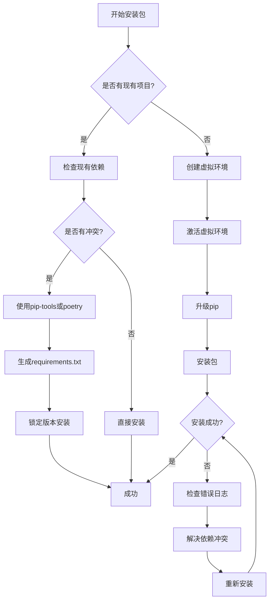

在 Ubuntu 24.04 上使用 Python 安装 cybervault-cve-report 包时，如果你不确定应该安装哪个版本，或者需要从你的本地 PyPI 镜像仓库或私有仓库中查找合适版本，可以按照以下步骤操作。

⸻

✅ 1. 查看当前可用的 Python 版本

首先确认你当前的 Python 和 pip 版本：

python3 --version
python3 -m pip --version

例如输出可能是：

Python 3.12.2
pip 24.0


⸻

✅ 2. 使用 pip 查询可用版本（默认 PyPI）

你可以运行以下命令来列出 cybervault-cve-report 的所有可用版本：

python3 -m pip install cybervault-cve-report==

会返回类似：

ERROR: Could not find a version that satisfies the requirement cybervault-cve-report== (from versions: 0.1.0, 0.1.1, 0.2.0)

这样你就可以看到可用的版本。

⸻

✅ 3. 如果你是使用私有仓库（比如公司内部 PyPI 镜像）

可以加上 --index-url 或 --extra-index-url 指向你的 PyPI 镜像地址：

python3 -m pip install cybervault-cve-report== \
  --index-url https://your.company.repo/simple

或者你想列出版本，使用：

pip index versions cybervault-cve-report \
  --index-url https://your.company.repo/simple

pip index versions 是从 pip 21.2 开始支持的。

⸻

✅ 4. 安装指定版本

假设你想安装 0.2.0 版本：

python3 -m pip install cybervault-cve-report==0.2.0


⸻

✅ 5. 使用 pip search（注意已弃用）

过去的 pip 支持 pip search，但现在已在新版本中移除。如果需要类似功能，你可以访问你的 PyPI 仓库页面或使用 API 查询。

⸻

🧩 小提示：手动查询包元数据（如果 repo 是目录或你托管了 .whl/.tar.gz）

你也可以直接查看 .whl 或 .tar.gz 文件中的 METADATA 文件来获取版本信息，或者：

unzip -l cybervault_cve_report-*.whl | grep METADATA


⸻

✅ 总结表格

操作	命令示例
查看 Python 和 pip 版本	python3 --version
列出 PyPI 上所有版本	pip install 包名==
使用私有 repo 安装	pip install 包名==版本 --index-url ...
使用 pip 查询版本	pip index versions 包名
安装特定版本	pip install 包名==版本


⸻

如你有具体的私有仓库 URL、认证方式或源类型（如 Nexus、Artifactory、DevPi），我可以进一步帮你写个脚本自动化选择版本。是否需要？


# cybervault-cve-report 
比如我用Python3 -m pip install --quiet --disable-pip-version-check cybervault-cve-report 
过程中会检索多个版本.然后报错 不能安装比如
Error cannot install cybervault-cve-report==0.0.1 cybervault-cve-report==0.0.2 cybervault-cve-report==0.0.3 等等
Error: ResolutionImpossible :
那么这种写法看起来不合理,有没有推荐的做法 应该怎么写比较好,1 不硬编码 2 能解决以来冲突 

你的场景是使用如下命令尝试安装：

python3 -m pip install --quiet --disable-pip-version-check cybervault-cve-report

过程中 pip 会尝试解析依赖并失败，报出 ResolutionImpossible，提示多个版本都无法成功安装。这通常发生在：
	•	包有多个版本，但都存在依赖冲突或与当前环境不兼容。
	•	pip 在解析时尝试多个版本，全部失败。

⸻

✅ 问题本质

你希望：
	1.	不硬编码版本；
	2.	解决依赖冲突；
	3.	自动选择最合适的版本（而不是报错）；

但 pip 默认的行为是：如果无法成功解析所有依赖（甚至是尝试多个版本后都失败），就会抛出 ResolutionImpossible。

⸻

✅ 推荐做法（不硬编码 + 自动选择可安装版本）

下面几种方式可以满足你的目标：

⸻

✅ 方法一：用 pip-tools（推荐用于 CI 或生产环境）

通过 pip-tools（pip-compile）提前解析出可安装的依赖版本组合。

步骤：
	1.	安装 pip-tools：

python3 -m pip install pip-tools

	2.	创建一个 requirements.in 文件：

cybervault-cve-report

	3.	生成可安装版本组合：

pip-compile requirements.in --output-file requirements.txt

它会自动解析出一组 不会有冲突的依赖版本组合，并写入 requirements.txt，如：

cybervault-cve-report==0.3.0
some-dependency==1.2.3

	4.	然后安装：

python3 -m pip install -r requirements.txt

这样你 不用手动指定版本，也能保证依赖可用且无冲突。

⸻

✅ 方法二：使用 pip install + --use-deprecated=legacy-resolver （仅调试建议）

你可以尝试旧版解析器来测试某些安装是否可能成功：

python3 -m pip install cybervault-cve-report --use-deprecated=legacy-resolver

不过这个方法不推荐长期使用，仅供测试用途。

⸻

✅ 方法三：用 pip index versions 自动判断兼容版本

你可以先列出所有版本：

pip index versions cybervault-cve-report

然后写个 Python 脚本来：
	•	遍历这些版本；
	•	尝试用 pip install cybervault-cve-report==x.y.z 并用 subprocess.run 捕获是否成功；
	•	成功即退出。

我可以帮你写这个自动化探测脚本（如需，请回复）。

⸻

✅ 方法四：用 pip install 配合 --constraint 文件约束依赖

constraints.txt
--------------------
some-lib==1.2.3

然后：

python3 -m pip install cybervault-cve-report --constraint constraints.txt

可以帮助你提前控制潜在冲突依赖版本，避免依赖爆炸。

⸻

🧩 总结

方法	是否硬编码	是否解决冲突	适合场景
pip-compile（pip-tools）	❌（自动解析）	✅	推荐用于稳定部署、CI/CD
legacy resolver	❌	❌（规避但不解决）	临时调试安装失败问题
自动尝试版本脚本	❌	✅（但较慢）	某些版本安装不确定时
constraints 文件	✅（部分）	✅	你知道冲突点在哪时


⸻

如果你需要，我可以直接帮你写一段 自动尝试多个版本并找出可安装版本的 Python 脚本，是否需要？

下面是一个 自动尝试安装 cybervault-cve-report 各版本 的 Python 脚本。该脚本会从 PyPI 拉取所有可用版本，并逐个尝试安装，直到成功或全部失败。

⸻

✅ 自动查找可安装版本脚本
```python
import subprocess
import requests
from packaging.version import parse as parse_version

PACKAGE = "cybervault-cve-report"

def get_available_versions(package):
    url = f"https://pypi.org/pypi/{package}/json"
    response = requests.get(url)
    response.raise_for_status()
    versions = list(response.json()["releases"].keys())
    return sorted(versions, key=parse_version, reverse=True)  # 尝试最新版优先

def try_install_version(version):
    print(f"Trying {PACKAGE}=={version} ...")
    result = subprocess.run(
        [
            "python3", "-m", "pip", "install", "--no-cache-dir",
            "--quiet", "--disable-pip-version-check",
            f"{PACKAGE}=={version}"
        ],
        stdout=subprocess.PIPE,
        stderr=subprocess.PIPE,
    )
    if result.returncode == 0:
        print(f"✅ Successfully installed {PACKAGE}=={version}")
        return True
    else:
        print(f"❌ Failed to install {PACKAGE}=={version}")
        return False

def main():
    versions = get_available_versions(PACKAGE)
    for version in versions:
        if try_install_version(version):
            break
    else:
        print("❌ No compatible version found.")

if __name__ == "__main__":
    main()
```

⸻

✅ 特点说明
	•	不硬编码版本；
	•	自动解析 PyPI；
	•	优先尝试最新版本；
	•	可在 CI/CD 或开发机中使用；
	•	可配合 virtualenv 避免污染系统环境。

⸻

✅ 使用建议

在使用前，建议创建一个虚拟环境：

python3 -m venv venv
source venv/bin/activate

然后运行脚本测试可安装版本。

⸻

✅ 可选增强（根据需要）
	•	支持限制 Python 版本兼容（如只尝试 Requires-Python: >=3.8 的版本）；
	•	支持输出安装成功的依赖树；
	•	支持缓存已失败版本避免重复测试；
	•	支持写入 requirements.lock.txt 方便下次直接用。

⸻

如你需要我增强脚本、写成 Bash 脚本，或配合 pip-compile 自动化集成，也可以继续告诉我。


# Claude 
这个错误通常是因为依赖解析冲突导致的。以下是几种推荐的解决方案：

## 解决方案

### 1. 使用虚拟环境隔离依赖

```bash
# 创建虚拟环境
python3 -m venv cybervault-env

# 激活虚拟环境
source cybervault-env/bin/activate  # Linux/Mac
# 或 cybervault-env\Scripts\activate  # Windows

# 在虚拟环境中安装
python3 -m pip install --upgrade pip
python3 -m pip install cybervault-cve-report
```

### 2. 使用 pip-tools 管理依赖

```bash
# 安装 pip-tools
pip install pip-tools

# 创建 requirements.in 文件
echo "cybervault-cve-report" > requirements.in

# 生成锁定版本的 requirements.txt
pip-compile requirements.in

# 安装
pip-sync requirements.txt
```

### 3. 使用 Poetry 管理项目依赖

```bash
# 安装 Poetry
curl -sSL https://install.python-poetry.org | python3 -

# 初始化项目
poetry init

# 添加依赖
poetry add cybervault-cve-report

# 安装依赖
poetry install
```

### 4. 指定具体版本或版本范围

```bash
# 方法1: 指定具体版本
python3 -m pip install cybervault-cve-report==0.0.3

# 方法2: 指定版本范围
python3 -m pip install "cybervault-cve-report>=0.0.3,<0.1.0"

# 方法3: 只安装最新版本
python3 -m pip install --upgrade cybervault-cve-report
```

### 5. 使用依赖解析器选项

```bash
# 使用新的依赖解析器
python3 -m pip install --use-feature=2020-resolver cybervault-cve-report

# 忽略依赖冲突（谨慎使用）
python3 -m pip install --force-reinstall --no-deps cybervault-cve-report
```

## 推荐的最佳实践流程



## 依赖冲突诊断表

| 错误类型 | 可能原因 | 解决方案 |
|----------|----------|----------|
| ResolutionImpossible | 版本冲突 | 使用虚拟环境或指定版本范围 |
| DistributionNotFound | 包不存在 | 检查包名拼写和PyPI可用性 |
| RequirementParseError | 语法错误 | 检查requirements文件格式 |
| DependencyConflict | 依赖冲突 | 使用pip-tools或poetry管理 |

## 配置文件示例

### requirements.in (pip-tools)
```text
cybervault-cve-report
# 其他依赖
requests>=2.25.0
```

### pyproject.toml (Poetry)
```toml
[tool.poetry.dependencies]
python = "^3.8"
cybervault-cve-report = "^0.0.3"

[build-system]
requires = ["poetry-core"]
build-backend = "poetry.core.masonry.api"
```

**推荐使用虚拟环境 + pip-tools 的组合**，这样既能隔离依赖又能锁定版本，避免硬编码同时解决依赖冲突。