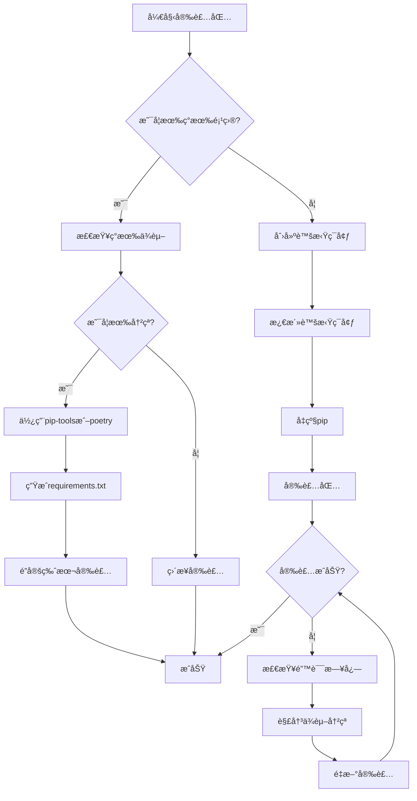

在 Ubuntu 24.04 上使用 Python 安装 cybervault-cve-report 包时，如æœä½ ä¸ç¡®å®šåº”该安装哪个版本，或者需è¦ä»ä½ çš„本地 PyPI é•œåƒä»“库或ç§æœ‰ä»“库中查找åˆé€‚版本，å¯ä»¥æŒ‰ç…§ä»¥ä¸‹æ­¥éª¤æ“作。

⸻

✅ 1. 查看当å‰å¯ç”¨çš„ Python 版本

首先确认你当å‰çš„ Python å’Œ pip 版本：

python3 --version
python3 -m pip --version

例如输出å¯èƒ½æ˜¯ï¼š

Python 3.12.2
pip 24.0


⸻

✅ 2. 使用 pip 查询å¯ç”¨ç‰ˆæœ¬ï¼ˆé»˜è®¤ PyPI）

ä½ å¯ä»¥è¿è¡Œä»¥ä¸‹å‘½ä»¤æ¥åˆ—出 cybervault-cve-report 的所有å¯ç”¨ç‰ˆæœ¬ï¼š

python3 -m pip install cybervault-cve-report==

会返å›ç±»ä¼¼ï¼š

ERROR: Could not find a version that satisfies the requirement cybervault-cve-report== (from versions: 0.1.0, 0.1.1, 0.2.0)

这样你就å¯ä»¥çœ‹åˆ°å¯ç”¨çš„版本。

⸻

✅ 3. 如æœä½ æ˜¯ä½¿ç”¨ç§æœ‰ä»“库（比如公å¸å†…部 PyPI é•œåƒï¼‰

å¯ä»¥åŠ ä¸Š --index-url 或 --extra-index-url 指å‘ä½ çš„ PyPI é•œåƒåœ°å€ï¼š

python3 -m pip install cybervault-cve-report== \
  --index-url https://your.company.repo/simple

或者你想列出版本，使用：

pip index versions cybervault-cve-report \
  --index-url https://your.company.repo/simple

pip index versions æ˜¯ä» pip 21.2 开始支æŒçš„。

⸻

✅ 4. 安装指定版本

å‡è®¾ä½ æƒ³å®‰è£… 0.2.0 版本：

python3 -m pip install cybervault-cve-report==0.2.0


⸻

✅ 5. 使用 pip search（注æ„已弃用）

过å»çš„ pip æ”¯æŒ pip search，但ç°åœ¨å·²åœ¨æ–°ç‰ˆæœ¬ä¸­ç§»é™¤ã€‚如æœéœ€è¦ç±»ä¼¼åŠŸèƒ½ï¼Œä½ å¯ä»¥è®¿é—®ä½ çš„ PyPI 仓库页é¢æˆ–使用 API 查询。

⸻

🧩 å°æ示：手动查询包元数æ®ï¼ˆå¦‚æœ repo 是目录或你托管了 .whl/.tar.gz）

你也å¯ä»¥ç›´æ¥æŸ¥çœ‹ .whl 或 .tar.gz 文件中的 METADATA 文件æ¥è·å–版本信æ¯ï¼Œæˆ–者：

unzip -l cybervault_cve_report-*.whl | grep METADATA


⸻

✅ 总结表格

æ“作	命令示例
查看 Python 和 pip 版本	python3 --version
列出 PyPI 上所有版本	pip install 包å==
使用ç§æœ‰ repo 安装	pip install 包å==版本 --index-url ...
使用 pip 查询版本	pip index versions 包å
安装特定版本	pip install 包å==版本


⸻

如你有具体的ç§æœ‰ä»“库 URLã€è®¤è¯æ–¹å¼æˆ–æºç±»å‹ï¼ˆå¦‚ Nexusã€Artifactoryã€DevPi），我å¯ä»¥è¿›ä¸€æ­¥å¸®ä½ å†™ä¸ªè„šæœ¬è‡ªåŠ¨åŒ–选择版本。是å¦éœ€è¦ï¼Ÿ


# cybervault-cve-report 
比如我用Python3 -m pip install --quiet --disable-pip-version-check cybervault-cve-report 
过程中会检索多个版本.然å报错 ä¸èƒ½å®‰è£…比如
Error cannot install cybervault-cve-report==0.0.1 cybervault-cve-report==0.0.2 cybervault-cve-report==0.0.3 等等
Error: ResolutionImpossible :
那么这ç§å†™æ³•çœ‹èµ·æ¥ä¸åˆç†,有没有æ¨èçš„åšæ³• 应该æ€ä¹ˆå†™æ¯”较好,1 ä¸ç¡¬ç¼–ç  2 能解决以æ¥å†²çª 

你的场景是使用如下命令å°è¯•å®‰è£…：

python3 -m pip install --quiet --disable-pip-version-check cybervault-cve-report

过程中 pip 会å°è¯•è§£æä¾èµ–并失败，报出 ResolutionImpossible，æ示多个版本都无法æˆåŠŸå®‰è£…。这通常å‘生在：
	•	包有多个版本，但都存在ä¾èµ–冲çªæˆ–ä¸å½“å‰ç¯å¢ƒä¸å…¼å®¹ã€‚
	•	pip 在解ææ—¶å°è¯•å¤šä¸ªç‰ˆæœ¬ï¼Œå…¨éƒ¨å¤±è´¥ã€‚

⸻

✅ 问题本质

你希望：
	1.	ä¸ç¡¬ç¼–ç ç‰ˆæœ¬ï¼›
	2.	解决ä¾èµ–冲çªï¼›
	3.	自动选择最åˆé€‚的版本（而ä¸æ˜¯æŠ¥é”™ï¼‰ï¼›

但 pip 默认的行为是：如æœæ— æ³•æˆåŠŸè§£æ所有ä¾èµ–（甚至是å°è¯•å¤šä¸ªç‰ˆæœ¬å都失败），就会抛出 ResolutionImpossible。

⸻

✅ æ¨èåšæ³•ï¼ˆä¸ç¡¬ç¼–ç  + 自动选择å¯å®‰è£…版本）

下é¢å‡ ç§æ–¹å¼å¯ä»¥æ»¡è¶³ä½ çš„目标：

⸻

✅ 方法一：用 pip-tools（æ¨èç”¨äº CI 或生产ç¯å¢ƒï¼‰

通过 pip-tools（pip-compile）æå‰è§£æ出å¯å®‰è£…çš„ä¾èµ–版本组åˆã€‚

步骤：
	1.	安装 pip-tools：

python3 -m pip install pip-tools

	2.	创建一个 requirements.in 文件：

cybervault-cve-report

	3.	生æˆå¯å®‰è£…版本组åˆï¼š

pip-compile requirements.in --output-file requirements.txt

它会自动解æ出一组 ä¸ä¼šæœ‰å†²çªçš„ä¾èµ–版本组åˆï¼Œå¹¶å†™å…¥ requirements.txt，如：

cybervault-cve-report==0.3.0
some-dependency==1.2.3

	4.	然å安装：

python3 -m pip install -r requirements.txt

这样你 ä¸ç”¨æ‰‹åŠ¨æŒ‡å®šç‰ˆæœ¬ï¼Œä¹Ÿèƒ½ä¿è¯ä¾èµ–å¯ç”¨ä¸”无冲çªã€‚

⸻

✅ 方法二：使用 pip install + --use-deprecated=legacy-resolver （仅调试建议）

ä½ å¯ä»¥å°è¯•æ—§ç‰ˆè§£æ器æ¥æµ‹è¯•æŸäº›å®‰è£…是å¦å¯èƒ½æˆåŠŸï¼š

python3 -m pip install cybervault-cve-report --use-deprecated=legacy-resolver

ä¸è¿‡è¿™ä¸ªæ–¹æ³•ä¸æ¨è长期使用，仅供测试用途。

⸻

✅ 方法三：用 pip index versions 自动判断兼容版本

ä½ å¯ä»¥å…ˆåˆ—出所有版本：

pip index versions cybervault-cve-report

然å写个 Python 脚本æ¥ï¼š
	•	éå†è¿™äº›ç‰ˆæœ¬ï¼›
	•	å°è¯•ç”¨ pip install cybervault-cve-report==x.y.z 并用 subprocess.run æ•è·æ˜¯å¦æˆåŠŸï¼›
	•	æˆåŠŸå³é€€å‡ºã€‚

我å¯ä»¥å¸®ä½ å†™è¿™ä¸ªè‡ªåŠ¨åŒ–æ¢æµ‹è„šæœ¬ï¼ˆå¦‚需，请å›å¤ï¼‰ã€‚

⸻

✅ 方法四：用 pip install é…åˆ --constraint 文件约æŸä¾èµ–

constraints.txt
--------------------
some-lib==1.2.3

然å：

python3 -m pip install cybervault-cve-report --constraint constraints.txt

å¯ä»¥å¸®åŠ©ä½ æå‰æ§åˆ¶æ½œåœ¨å†²çªä¾èµ–版本，é¿å…ä¾èµ–爆炸。

⸻

🧩 总结

方法	是å¦ç¡¬ç¼–ç 	是å¦è§£å†³å†²çª	适åˆåœºæ™¯
pip-compile（pip-tools）	âŒï¼ˆè‡ªåŠ¨è§£æ）	✅	æ¨è用äºç¨³å®šéƒ¨ç½²ã€CI/CD
legacy resolver	âŒ	âŒï¼ˆè§„é¿ä½†ä¸è§£å†³ï¼‰	临时调试安装失败问题
自动å°è¯•ç‰ˆæœ¬è„šæœ¬	âŒ	✅（但较慢）	æŸäº›ç‰ˆæœ¬å®‰è£…ä¸ç¡®å®šæ—¶
constraints 文件	✅（部分）	✅	你知é“冲çªç‚¹åœ¨å“ªæ—¶


⸻

如æœä½ éœ€è¦ï¼Œæˆ‘å¯ä»¥ç›´æ¥å¸®ä½ å†™ä¸€æ®µ 自动å°è¯•å¤šä¸ªç‰ˆæœ¬å¹¶æ‰¾å‡ºå¯å®‰è£…版本的 Python 脚本，是å¦éœ€è¦ï¼Ÿ

下é¢æ˜¯ä¸€ä¸ª 自动å°è¯•å®‰è£… cybervault-cve-report å„版本 çš„ Python è„šæœ¬ã€‚è¯¥è„šæœ¬ä¼šä» PyPI 拉å–所有å¯ç”¨ç‰ˆæœ¬ï¼Œå¹¶é€ä¸ªå°è¯•å®‰è£…，直到æˆåŠŸæˆ–全部失败。

⸻

✅ 自动查找å¯å®‰è£…版本脚本
```python
import subprocess
import requests
from packaging.version import parse as parse_version

PACKAGE = "cybervault-cve-report"

def get_available_versions(package):
    url = f"https://pypi.org/pypi/{package}/json"
    response = requests.get(url)
    response.raise_for_status()
    versions = list(response.json()["releases"].keys())
    return sorted(versions, key=parse_version, reverse=True)  # å°è¯•æœ€æ–°ç‰ˆä¼˜å…ˆ

def try_install_version(version):
    print(f"Trying {PACKAGE}=={version} ...")
    result = subprocess.run(
        [
            "python3", "-m", "pip", "install", "--no-cache-dir",
            "--quiet", "--disable-pip-version-check",
            f"{PACKAGE}=={version}"
        ],
        stdout=subprocess.PIPE,
        stderr=subprocess.PIPE,
    )
    if result.returncode == 0:
        print(f"✅ Successfully installed {PACKAGE}=={version}")
        return True
    else:
        print(f"⌠Failed to install {PACKAGE}=={version}")
        return False

def main():
    versions = get_available_versions(PACKAGE)
    for version in versions:
        if try_install_version(version):
            break
    else:
        print("⌠No compatible version found.")

if __name__ == "__main__":
    main()
```

⸻

✅ 特点说æ˜
	•	ä¸ç¡¬ç¼–ç ç‰ˆæœ¬ï¼›
	•	自动解æ PyPIï¼›
	•	优先å°è¯•æœ€æ–°ç‰ˆæœ¬ï¼›
	•	å¯åœ¨ CI/CD 或开å‘机中使用；
	•	å¯é…åˆ virtualenv é¿å…污染系统ç¯å¢ƒã€‚

⸻

✅ 使用建议

在使用å‰ï¼Œå»ºè®®åˆ›å»ºä¸€ä¸ªè™šæ‹Ÿç¯å¢ƒï¼š

python3 -m venv venv
source venv/bin/activate

然åè¿è¡Œè„šæœ¬æµ‹è¯•å¯å®‰è£…版本。

⸻

✅ å¯é€‰å¢å¼ºï¼ˆæ ¹æ®éœ€è¦ï¼‰
	•	支æŒé™åˆ¶ Python 版本兼容（如åªå°è¯• Requires-Python: >=3.8 的版本）；
	•	支æŒè¾“出安装æˆåŠŸçš„ä¾èµ–æ ‘ï¼›
	•	支æŒç¼“存已失败版本é¿å…é‡å¤æµ‹è¯•ï¼›
	•	支æŒå†™å…¥ requirements.lock.txt 方便下次直æ¥ç”¨ã€‚

⸻

如你需è¦æˆ‘å¢å¼ºè„šæœ¬ã€å†™æˆ Bash 脚本，或é…åˆ pip-compile 自动化集æˆï¼Œä¹Ÿå¯ä»¥ç»§ç»­å‘Šè¯‰æˆ‘。


# Claude 
这个错误通常是因为ä¾èµ–解æ冲çªå¯¼è‡´çš„。以下是几ç§æ¨è的解决方案：

## 解决方案

### 1. 使用虚拟ç¯å¢ƒéš”离ä¾èµ–

```bash
# 创建虚拟ç¯å¢ƒ
python3 -m venv cybervault-env

# 激活虚拟ç¯å¢ƒ
source cybervault-env/bin/activate  # Linux/Mac
# 或 cybervault-env\Scripts\activate  # Windows

# 在虚拟ç¯å¢ƒä¸­å®‰è£…
python3 -m pip install --upgrade pip
python3 -m pip install cybervault-cve-report
```

### 2. 使用 pip-tools 管ç†ä¾èµ–

```bash
# 安装 pip-tools
pip install pip-tools

# 创建 requirements.in 文件
echo "cybervault-cve-report" > requirements.in

# 生æˆé”定版本的 requirements.txt
pip-compile requirements.in

# 安装
pip-sync requirements.txt
```

### 3. 使用 Poetry 管ç†é¡¹ç›®ä¾èµ–

```bash
# 安装 Poetry
curl -sSL https://install.python-poetry.org | python3 -

# åˆå§‹åŒ–项目
poetry init

# 添加ä¾èµ–
poetry add cybervault-cve-report

# 安装ä¾èµ–
poetry install
```

### 4. 指定具体版本或版本范围

```bash
# 方法1: 指定具体版本
python3 -m pip install cybervault-cve-report==0.0.3

# 方法2: 指定版本范围
python3 -m pip install "cybervault-cve-report>=0.0.3,<0.1.0"

# 方法3: åªå®‰è£…最新版本
python3 -m pip install --upgrade cybervault-cve-report
```

### 5. 使用ä¾èµ–解æ器选项

```bash
# 使用新的ä¾èµ–解æ器
python3 -m pip install --use-feature=2020-resolver cybervault-cve-report

# 忽略ä¾èµ–冲çªï¼ˆè°¨æ…使用）
python3 -m pip install --force-reinstall --no-deps cybervault-cve-report
```

## æ¨è的最佳å®è·µæµç¨‹



## ä¾èµ–冲çªè¯Šæ–­è¡¨

| é”™è¯¯ç±»å‹ | å¯èƒ½åŸå›  | 解决方案 |
|----------|----------|----------|
| ResolutionImpossible | ç‰ˆæœ¬å†²çª | 使用虚拟ç¯å¢ƒæˆ–指定版本范围 |
| DistributionNotFound | 包ä¸å­˜åœ¨ | 检查包å拼写和PyPIå¯ç”¨æ€§ |
| RequirementParseError | 语法错误 | 检查requirementsæ–‡ä»¶æ ¼å¼ |
| DependencyConflict | ä¾èµ–å†²çª | 使用pip-tools或poetryç®¡ç† |

## é…置文件示例

### requirements.in (pip-tools)
```text
cybervault-cve-report
# 其他ä¾èµ–
requests>=2.25.0
```

### pyproject.toml (Poetry)
```toml
[tool.poetry.dependencies]
python = "^3.8"
cybervault-cve-report = "^0.0.3"

[build-system]
requires = ["poetry-core"]
build-backend = "poetry.core.masonry.api"
```

**æ¨è使用虚拟ç¯å¢ƒ + pip-tools 的组åˆ**，这样既能隔离ä¾èµ–åˆèƒ½é”定版本，é¿å…硬编ç åŒæ—¶è§£å†³ä¾èµ–冲çªã€‚