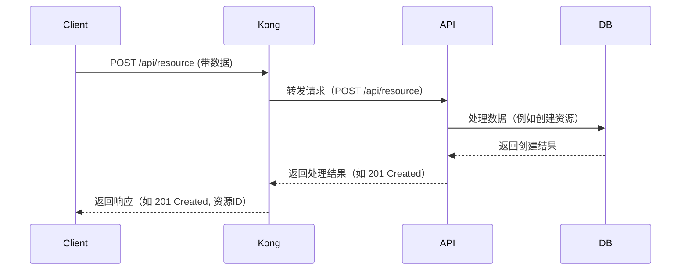
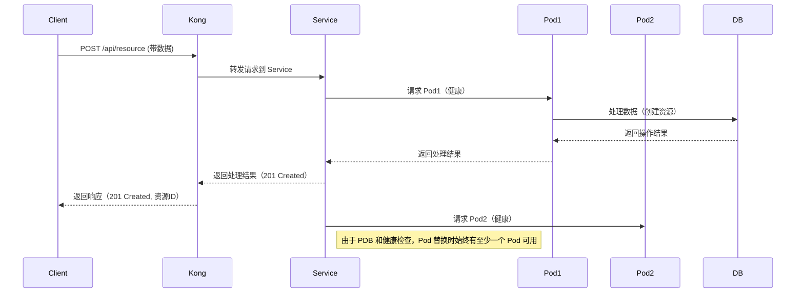

**POST 请求的完成标准**

  

**POST 请求** 和 **GET 请求** 在概念上有些不同，特别是在如何判断请求是否“完成”时。你对 GET 请求的理解是对的：当服务器返回数据时，GET 请求就算完成。但 POST 请求稍微复杂一些，因为它通常涉及到对服务器数据的修改或创建资源的操作。

  

**POST 请求的流程**

1. **客户端发起请求**：客户端向服务器发送一个 POST 请求，通常是发送一些数据（如表单数据、JSON 请求体等），用于创建或修改服务器上的资源。

2. **请求处理**：

• 服务器接收到请求后，通常会对请求数据进行处理，如验证数据的有效性、存储数据、执行某些操作等。

• 服务器在处理 POST 请求时，可能会执行数据修改、数据库写入、资源创建等任务。POST 请求本身的作用通常是触发某个业务逻辑，而不仅仅是获取数据。

1. **响应返回**：

• 一旦服务器处理完请求，返回一个 **响应**。这个响应通常包含操作结果的状态（如 201 Created、200 OK），也可能包含新创建的资源的标识符或一些其他数据。

2. **完成标准**：

• 在 POST 请求中，“完成”的标准通常是：**服务器返回了响应并处理了请求**。这意味着请求体的数据已经被服务器接收并且进行了某种操作（如数据库写入、新资源创建等）。

• 不同的服务会根据操作的类型返回不同的响应状态码（如 201 Created 表示创建成功，200 OK 表示操作成功等）。

  

所以，**POST 请求完成的标准是服务器返回了响应**，而不仅仅是将请求提交给服务器。如果你仅仅是将请求发送给服务，但没有收到服务器的响应，那么这个 POST 请求就没有真正完成。

  

**简单对比 POST 和 GET 的完成标准**

|**请求类型**|**请求发送后完成标准**|
|---|---|
|**GET**|客户端接收到服务器返回的数据即认为完成|
|**POST**|服务器处理完请求并返回响应数据（如成功标识或结果）|

**可视化的 POST 请求流程图（序列图）**

  

以下是一个简单的 **POST 请求的序列图**，它展示了客户端、Kong、API服务以及数据库之间的交互。



**流程描述：**

3. **Client** 向 **Kong** 发送一个 **POST 请求**，包含请求体（例如要创建的资源数据）。

4. **Kong** 作为 API Gateway，将该请求转发给 **API 服务**。

5. **API 服务** 处理请求，可能会对数据进行验证、数据库操作等。

6. **API 服务** 会与 **数据库** 交互来执行数据写入（例如：创建新资源）。

7. **数据库** 返回操作结果，API 服务确认数据已经处理。

8. **API 服务** 将操作结果返回给 **Kong**，通常是一个成功的响应（如 201 Created，或者是其他状态码）。

9. **Kong** 将最终响应返回给 **Client**，标识请求完成。

  

**何时算 POST 请求完成？**

• POST 请求的完成，实际上是指客户端接收到来自服务器（通过 Kong 或其他 API Gateway）最终的响应，表示请求已被处理并且成功。

• 例如，响应状态为 201 Created 表示资源已成功创建，或者是 200 OK 表示某个操作成功完成。

你的顾虑非常重要，尤其是在涉及到 **GKE 升级** 和 **Pod 替换** 的高可用性问题时。在这种情况下，如何确保一个 **POST 请求** 在 **GKE Pod 替换** 或 **Node 升级** 的过程中能够保持高可用性，并且请求能够完整处理是一个关键问题。我们可以从以下几个方面来分析和优化：

  

**1. 请求完成的标准**

  

如你所说，**POST 请求的完整性** 是指 **请求能够在后端服务（RT）完全处理，并且响应能够成功返回给客户端**。对于需要 **写入操作** 的 POST 请求，通常在请求完成时，服务器会返回一个确认的状态（例如 201 Created，200 OK 等），这意味着数据已经成功处理并且操作已完成。

  

在你提到的场景中，POST 请求需要由 **Kong DP** 转发到 **GKE RT**，如果此时 **GKE Pod 正在进行滚动替换**（比如因为 Node 升级），请求的完整性可能受到影响。我们需要确保：

• 请求被正确路由到正在运行的 Pod。

• 请求的处理过程不中断，特别是数据写入或资源创建等操作。

  

**2. 高可用性设计**

  

在面对 GKE Pod 升级时，保证 POST 请求的高可用性通常有以下几种常见的设计模式：

  

**a. Pod Disruption Budget (PDB)**

• **PodDisruptionBudget (PDB)** 可以确保在 **GKE 节点升级** 或 **Pod 被驱逐** 的过程中，至少保持一定数量的 Pod 在工作，这样可以避免服务中断。

• 比如，假设你有两个 Pod，你可以设置 **PDB** 来确保在 Pod 替换时，始终有一个 Pod 可用。这样，Kubernetes 会在升级过程中逐步替换 Pod，并保持至少一个 Pod 接受流量。

  

**PDB 示例：**

```
apiVersion: policy/v1
kind: PodDisruptionBudget
metadata:
  name: my-api-pdb
spec:
  minAvailable: 1  # 确保至少有一个 Pod 可用
  selector:
    matchLabels:
      app: my-api
```

**b. Service 的负载均衡**

• **Kubernetes Service** 会根据 **Pod 的健康检查** 更新其 Endpoints。当某个 Pod 被替换或处于不可用状态时，Kubernetes 会自动将流量路由到仍然健康的 Pod。

• 如果你使用了 **RollingUpdate** 策略，Kubernetes 会确保在替换过程中始终保持某些 Pod 可用。因此，Kong DP 会始终将流量转发到健康的 Pod。

  

**c. Kong的负载均衡与健康检查**

• **Kong DP** 会根据 **Service** 的 Endpoints 来进行负载均衡。如果某个 Pod 被替换或不可用，Kong 会自动选择其他健康的 Pod 进行请求转发。

• **readinessProbe** 的配置很重要，确保新的 Pod 在启动时能成功通过健康检查，只有通过健康检查的 Pod 才会被加入到 Service 的 Endpoint 列表中。

  

**d. Kong 重试机制**

• 如果你的后端服务暂时不可用，Kong 可以配置 **重试策略**，使得它在遇到连接错误时会尝试重新发送请求。虽然 **Kong DP** 默认没有重试机制，但你可以通过 **Kong 插件** 来实现重试。

• 例如，**Kong Circuit Breaker 插件** 可以帮助减少因为 Pod 替换而导致的瞬时请求失败，并允许流量在后端 Pod 恢复可用时继续发送。

  

**3. 确保 POST 请求的完整性**

  

在 **Node 升级** 和 **Pod 替换** 的场景下，确保 **POST 请求的完整性** 可以通过以下方法优化：

  

**a. Pod 启动与健康检查**

• 确保新启动的 Pod 在健康检查通过后才能开始接收流量。这样即使 Pod 在替换过程中，只有在新 Pod 完全就绪时，流量才会被路由到它。

• 设置 **readinessProbe** 确保新 Pod 在完成初始化和准备好接受流量时才会被加入 Service 的 Endpoint 列表。

  

**b. 顺序替换 Pod**

• 在 **RollingUpdate** 策略下，Kubernetes 会逐步替换 Pod，而不会一次性替换所有 Pod。这样就可以确保在替换过程中始终保持至少一个 Pod 可用。

• 配置 **maxUnavailable** 和 **maxSurge** 参数来控制升级时可用 Pod 的数量，从而保证高可用性。

  

**c. 请求的幂等性设计**

• 对于需要创建或修改数据的 POST 请求，可以设计 **幂等性**。这样即使请求重复（例如由于重试机制），也能保证不会导致数据的重复创建或修改，从而减少因 Pod 替换或升级过程中的失败重试带来的问题。

  

**4. 优化后的流程**

  

假设你已经设置了 **PDB** 和 **健康检查**，下面是优化后的完整流程：

1. **客户端发起 POST 请求**：客户端将 POST 请求发送到 Kong DP。

2. **Kong DP 转发请求到 GKE 服务**：Kong 将请求转发到你的 Kubernetes Service（通过负载均衡选择可用的 Pod）。

3. **Kubernetes 服务路由到健康 Pod**：如果正在升级的 Pod 被替换，Kubernetes 会自动更新 Service 的 Endpoints，只将流量路由到健康的 Pod。

4. **GKE Pod 替换**：Kubernetes 会逐步替换 Pod，确保在每次替换过程中，至少一个 Pod 保持可用。

5. **API 服务处理请求**：后端的 API 服务会处理请求，进行必要的数据操作（如创建新资源）。

6. **响应返回客户端**：一旦请求处理完毕，API 服务将响应返回给 Kong DP，Kong DP 会将响应转发给客户端，标志着请求完成。

  

**可视化流程（包括 GKE 升级）**



**总结**

• **POST 请求的完整性** 是由 **请求成功处理并返回响应** 来决定的。在 GKE 升级过程中，确保服务高可用可以通过 **PodDisruptionBudget (PDB)**、**健康检查**、**Kong 的负载均衡机制** 等手段来实现。

• Kubernetes 会在进行 Pod 替换时，自动确保至少有一个健康 Pod 可用，Kong 会根据服务的 Endpoint 列表来路由流量，从而避免请求失败。

• 通过合理的配置，可以确保请求在 Pod 替换或 Node 升级过程中不会丢失或中断。

