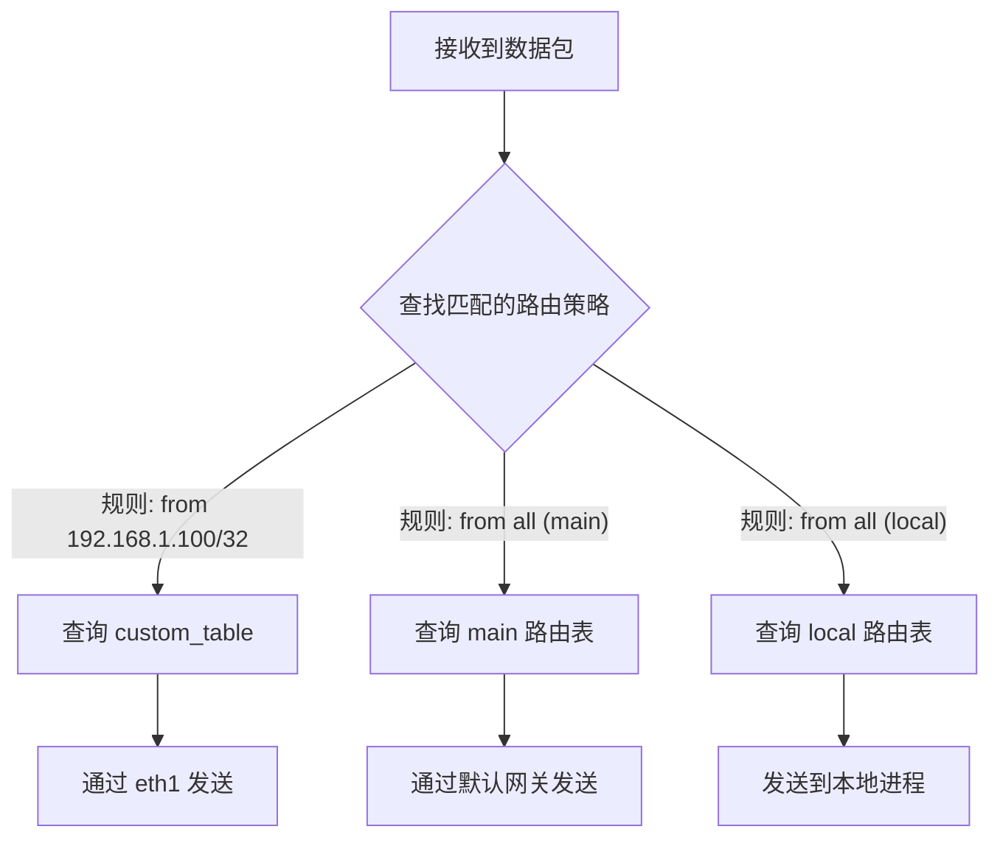

# Linux 路由命令详解

本文将介绍 Linux 中用于管理网络路由的常用命令，包括 `route`、`ip route` 和 `ip rule`。

## 1. `route` 命令 (传统)

`route` 命令是用于查看和操作 IP 路由表的传统工具。虽然现在更推荐使用 `ip route`，但 `route` 命令在许多系统中仍然可用。

### 添加静态路由

您可以使用 `route add` 命令来添加一条静态路由。

**语法:**
```bash
route add -net <目标网络> netmask <子网掩码> gw <网关地址>
```

**示例:**
假设您希望将所有到 `192.168.2.0/24` 网络的流量都通过网关 `192.168.1.1` 发送，可以使用以下命令：

```bash
sudo route add -net 192.168.2.0 netmask 255.255.255.0 gw 192.168.1.1
```

### 查看路由表

使用不带任何参数的 `route` 命令可以查看当前的内核路由表。

```bash
route -n
```
`-n` 选项会以数字形式显示地址，而不是尝试解析主机名，这样速度更快。

## 2. `ip route` 命令 (现代)

`ip route` 是 `iproute2` 工具包的一部分，是目前管理 Linux 路由表的首选工具。它比传统的 `route` 命令功能更强大���更灵活。

### 查看路由

要查看当前主路由表中的所有路由，请使用以下命令：

```bash
ip route show
# 或者简写为
ip route
```

### 获取到特定目标的路由

如果您想知道数据包到特定 IP 地址会经过哪条路由，可以使用 `ip route get`。这对于网络调试非常有用。

**语法:**
```bash
ip route get <目标IP地址>
```

**示例:**
要查看系统如何路由到 `8.8.8.8`：

```bash
ip route get 8.8.8.8
```
输出会显示到达该목표所使用的路由、源 IP 地址以及通过哪个网络接口。

### 添加静态路由

使用 `ip route add` 可以添加新的静态路由。

**语法:**
```bash
ip route add <目标网络/掩码> via <网关地址> [dev <接口>]
```

**示例:**
与前面的 `route` 命令示例等效的命令如下：

```bash
sudo ip route add 192.168.2.0/24 via 192.168.1.1
```
您可以选择性地指定出口设备 `dev eth0`。

## 3. `ip rule` 命令 (策略路由)

Linux 支持基于策略的路由 (Policy-Based Routing)，这允许您根据数据包的源地址、协议或其他属性来选择不同的路由表。`ip rule` 命令用于管理这些路由策略规则。

默认情况下，Linux 有三个路由表：`local`、`main` 和 `default`。

### 查看路由策略

要查看当前的路由策略，请运行：

```bash
ip rule show
# 或者简写为
ip rule
```
您会看到类似下面的输出，数字代表优先级：
```
0:	from all lookup local
32766:	from all lookup main
32767:	from all lookup default
```

### 添加新的路由策略

您可以创建新的路由表，并添加规则，使来自特定源 IP 的流量使用这个新的路由表。

**示例:**
假设您有一个额外的网络连接，并且希望来自 IP `192.168.1.100` 的所有流量都走 `192.168.10.1` 这个网关。

**1. 创建一个新的路由表**
首先，为您的新路由表命名。在 `/etc/iproute2/rt_tables` 文件中添加一行：
```
100 custom_table
```

**2. 在新表中添加路由**
```bash
sudo ip route add default via 192.168.10.1 dev eth1 table custom_table
```

**3. 添加规则**
现在，创建一个规则，让来自 `192.168.1.100` 的流量使用 `custom_table`：
```bash
sudo ip rule add from 192.168.1.100/32 table custom_table priority 1000
```

## 路由决策流程图

下面的流程图展示了 Linux 内核如何根据路由策略和路由表来决定数据包的路径。


