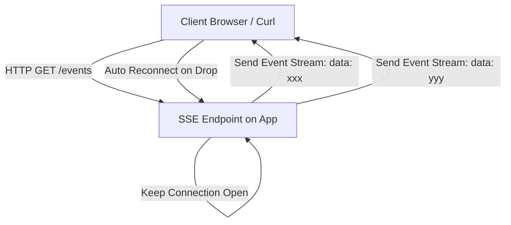
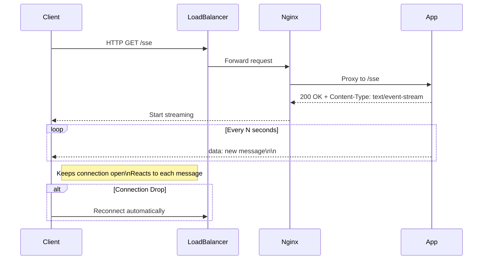
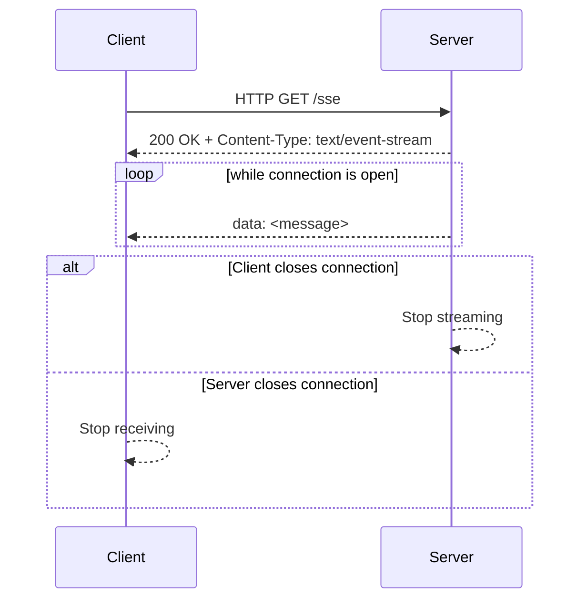

# summary

- proxy_buffering off setting 
- 实时输出 AI 回复**，这个属于 **SSE 的经典应用场景之一

# SSE
Here is a detailed answer in Markdown format to help you understand the concepts of **SSE (Server-Sent Events)** and **streamable HTTP**, and how to verify their support in **GCP**, **Nginx**, and **GKE**:

---

## **🔄 What is SSE (Server-Sent Events)?**

  

**SSE (Server-Sent Events)** is a **unidirectional** communication protocol over HTTP where the **server pushes** updates to the client over a long-lived HTTP connection.

- It uses the text/event-stream MIME type.
    
- Built on top of **standard HTTP** (usually via EventSource in JavaScript).
    
- It’s suitable for scenarios like:
    
    - Notifications
        
    - Real-time feeds (e.g. stock price updates)
        
    - Logs or streaming data
        
    

  

### **Example of an SSE Response:**

```
HTTP/1.1 200 OK
Content-Type: text/event-stream
Cache-Control: no-cache
Connection: keep-alive

data: hello world
```

---


> **SSE 是一种服务端主动向客户端推送的机制，核心是：客户端发起一次 HTTP GET 请求，服务端在该连接上持续地发送数据（而不是一次性响应完成）。**

  

在 GKE 中，你只需确保以下几点：

- **应用本身使用了 Content-Type: text/event-stream 响应**
    
- **中间层（Nginx、Ingress、GCP LB）不做 buffer，并支持长连接**
    
- **连接的 timeout 值足够大**
    
- **客户端不会主动断开**
    

---

下面是你要的两个流程图，一个是 **流程图**，一个是 **时序图**。

---

### **📘 SSE 工作机制（Mermaid 流程图）**



---

### **⏱️ SSE 通信时序图（Mermaid 时序图）**



---

### **✅ Tips for GKE 实践中注意点**

|**层级**|**配置建议**|
|---|---|
|App|设置 Content-Type: text/event-stream，并写入 data:|
|Nginx|proxy_buffering off, proxy_read_timeout 设置大|
|GKE Ingress|timeout 或 backendConfig.timeoutSec 要足够大|
|GCP LB|关闭 CDN，增加 Timeout，启用 HTTP/1.1/2 支持|
|Client|使用 EventSource（浏览器）或 curl -N 测试|

---

如果你有特定的语言需求（Java Spring、Python Flask、FastAPI 等）我可以提供 SSE 示例代码配合测试使用。是否需要？

以下是一个 **最简单的 Python Flask 示例**，用于演示 **SSE (Server-Sent Events)** 的基本流程。

---

### **🐍 Flask SSE 示例**

```Python
from flask import Flask, Response
import time

app = Flask(__name__)

def event_stream():
    while True:
        # 每秒推送一条消息
        time.sleep(1)
        yield f"data: 当前时间是 {time.strftime('%Y-%m-%d %H:%M:%S')}\n\n"

@app.route('/sse')
def sse():
    return Response(event_stream(), mimetype='text/event-stream')

if __name__ == '__main__':
    app.run(host='0.0.0.0', port=5000, threaded=True)
```

---

### **✅ 使用说明**

- 启动后访问 http://<server-ip>:5000/sse
    
- 浏览器会持续显示推送的数据（或使用 curl -N）
    

```bash
curl -N http://localhost:5000/sse
```

输出示例：

```
data: 当前时间是 2025-07-31 08:23:01

data: 当前时间是 2025-07-31 08:23:02

...
```

---

### **🚨 注意事项**

- mimetype='text/event-stream' 是关键
    
- yield 会持续推送数据，每条消息以 \n\n 结尾
    
- 在 GKE 部署时请确保：
    
    - readinessProbe 不阻止连接建立
        
    - Nginx Ingress 配置了 proxy_buffering off
        
    - GCP LB 没开启 CDN
        
    - 长连接的超时时间够长（例如 3600 秒）
        
    

  

是否需要我继续提供 Dockerfile、K8S YAML 或 GKE 部署样例？

## Q
关于上面提到的客户端发起一次 HTTP GET 请求，服务端在该连接上持续地发送数据（而不是一次性响应完成）
关于这个我不是很理解,客户端发起一次 HTTP GET 请求之后 一定要不主动断开,也就是保持长链,才能让后面的服务端在该连接上持续地发送数据?

## A
是的，你理解得非常准确。

---

## **✅ 核心理解：SSE 的本质是一条**

## **持久的、单向的 HTTP 长连接**

  

我们来逐步解释这句：

  

### **🎯 1. 客户端发起** 

### **一次**

###  **HTTP GET 请求**

- 客户端使用标准的 HTTP GET 请求访问服务端的 SSE 路由（如 /sse）
    
- 这个请求不是短暂的，而是**不会立即关闭连接**
    

```
GET /sse HTTP/1.1
Host: example.com
Accept: text/event-stream
```

---

### **🎯 2. 连接**

### **不会立即关闭**

### **（长连接）**

- 一旦连接建立，服务器返回 200 OK，并设置头：
    
    - Content-Type: text/event-stream
        
    - Cache-Control: no-cache
        
    - Connection: keep-alive
        
    
- 然后服务端**不关闭连接**，而是**保持连接**持续发送事件
    

```
HTTP/1.1 200 OK
Content-Type: text/event-stream
Cache-Control: no-cache
Connection: keep-alive

data: Hello
data: World

data: This is another message
```

---

### **🎯 3. 服务端使用该连接** 

### **不断发送数据**

  

只要连接还活着，服务端就可以用类似下面的形式不断发送数据：

```
data: 当前时间 2025-07-31 08:40:01

data: 当前时间 2025-07-31 08:40:02

...
```

---

### **🎯 4. 如果客户端主动关闭连接，服务端自然无法再推送**

  

所以客户端必须：

- 保持连接不关闭
    
- 使用 **浏览器内置的 EventSource**（会自动重连）
    
- 或使用 curl -N，不缓存并保持连接
    

---

## **📌 补充说明：客户端断开后的行为**

|**场景**|**后果**|
|---|---|
|客户端主动关闭连接|服务端 yield 时会抛异常或被终止|
|网络中断|EventSource 会自动尝试重新连接|
|Nginx / Ingress 超时断开连接|SSE 会断流，需配置 proxy_read_timeout 等|
|服务端内部逻辑关闭连接|客户端接收到 EOF，触发重连（如果支持）|

---

### **✅ Mermaid 流程补图：连接与断开机制**



---

是否需要我演示如何在浏览器端使用 JavaScript 的 EventSource 保持这个连接？还是说你想要的是 GKE + Ingress 中如何防止被“中间件”提前断开这个连接的操作建议？

## Scene

业内 **使用 SSE（Server-Sent Events）最典型的一些场景和应用场景分类**，包括为什么这些场景适合用 SSE 而不是 WebSocket 或轮询。


非常好问题，下面是业内 **使用 SSE（Server-Sent Events）最典型的一些场景和应用场景分类**，包括为什么这些场景适合用 SSE 而不是 WebSocket 或轮询。

---

## **✅ SSE 最常用的典型场景**

|**应用场景**|**说明**|
|---|---|
|实时日志流（Live Logs）|显示 CI/CD、服务运行状态、部署过程等实时日志。|
|后端任务进度通知|长耗时任务实时反馈进度（如：视频转码、批处理、大数据导入等）。|
|系统监控 / Dashboard|推送系统状态、服务健康、K8S Pod 状态等实时数据。|
|聊天消息（只读）|对于只读广播类聊天室，可以用 SSE（但双向需 WebSocket）。|
|实时股票/行情数据|SSE 能高效持续推送市场行情、报价变化。|
|AI 流式响应|类似 ChatGPT、Bard、Claude 等流式输出，用 SSE 或 fetch + ReadableStream|
|Web 表单处理进度|表单提交后长时间处理，通过 SSE 返回“处理中 / 完成”等状态。|
|服务器健康心跳|定时推送时间戳保持客户端连接状态。|

---

## **✅ 为什么这些场景适合 SSE？**

|**特性**|**适用场景解释**|
|---|---|
|单向推送（Server ➝ Client）|适合通知/广播|
|基于 HTTP，支持浏览器|无需额外协议封装，浏览器原生支持（如 EventSource）|
|自动重连（EventSource 支持）|异常断开可自动重连|
|支持缓存/断点续传|可以传 Last-Event-ID 实现续传|

---

## **🚫 不适合用 SSE 的场景**

|**场景**|**原因**|
|---|---|
|需要**双向通信**的聊天室|应使用 WebSocket 或 WebRTC|
|对延迟极端敏感|HTTP 有些中间件会有 delay|
|网络中断率很高|重连会导致资源重建代价|
|需要传大量二进制数据|SSE 只支持文本|

---

## **📦 行业真实使用案例举例**

|**公司 / 场景**|**使用方式说明**|
|---|---|
|**GitHub Actions**|构建日志是通过 SSE 实时传给前端的|
|**Google Firebase**|使用 HTTP streaming / SSE 推送数据库更新|
|**Vercel** / **Netlify**|实时部署日志、构建状态|
|**Kibana / ELK Stack**|实时日志流展示（部分版本）|
|**OpenAI/ChatGPT API**|使用 text/event-stream 逐字符推送回复|
|**Grafana / Prometheus**|Dashboard 图表自动刷新可能用 SSE|

---

是否你想对接的是某个具体的用途？比如你平台中是否有 CI/CD、日志分析、AI 接口输出、实时告警等场景，我可以结合你平台结构给出针对性的建议和方案设计（甚至带 YAML + 配置建议）。需要的话请告知场景即可。

## Advise 
如果我们平台要支持SSE.基于比如我目前的一些配置 比如我们超时配置是可以到360S,不是默认的60S,那么非严格意义我们是支持的.那么后续需要核对的是用户的需求.比如其想要的最长超时时间是多少? 或者能接受的时间是多少 这个就比较关键?

是的，你现在思考的已经非常贴近实战落地的核心重点了，简单总结如下：

---

## **✅ 本质理解：SSE 的平台支持 ≠ 100% 端到端有效**

  

> 即使你配置了超时 360 秒，也**不代表你就“完全支持” SSE，而是要结合实际业务需求来判断是否“满足需求”**。

---

## **✅ 平台支持 SSE 的前提（你现在已满足部分）**

|**要素**|**是否满足**|**说明**|
|---|---|---|
|应用能持续输出 event-stream|✅|你的服务端使用 Flask / Java 等支持流式写出|
|Nginx / Ingress 支持长连接|✅|你配置了 proxy_buffering off 等关键项|
|GKE 后端 timeout >= 360s|✅|已调高 timeoutSec，默认是 60s|

---

## **✅ 下一步关键：**

## **对接用户实际“期望行为”**

  

你说得对，**必须明确以下几个问题：**

|**核心问题**|**建议提问方式/举例**|
|---|---|
|用户期望的“连接存活时间”是多少？|是 10 分钟、30 分钟、还是持续不断（如 Web Terminal）？|
|数据的推送频率？是否允许“间歇无数据”？|每秒一次、每10秒、只有状态变化才推？|
|网络断开是否需要自动重连？|如果中断后是否允许客户端自动重新发起连接恢复状态？|
|是否有并发连接的限制？|一人一连，还是一页面多个连接（例如 Dashboard 多模块）？|
|是否对消息可靠性有要求？|比如错过一次消息能接受吗？是否需要事件 ID/断点续传？|

---

## **✅ 示例：不同用户需求影响配置的实际案例**

|**用户需求**|**对应建议**|
|---|---|
|**希望实时输出 AI 回复**|可接受几秒内开始响应，360s 足够，一般无问题|
|**浏览器控制台日志持续输出（无间断）**|建议 timeout 配置为 > 1 小时或使用 WebSocket 替代|
|**批量数据处理进度反馈**|若过程可控且任务 < 6 分钟，当前配置可完全满足|
|**希望连接不掉线地维持1小时以上**|GCP LB 默认最长 backend timeout 是 3600 秒，需要配置更长或改为 WebSocket|

---

## **✅ 推荐你使用的验证流程图（Mermaid）**

```
flowchart TD
    A[用户需求收集] --> B[期望连接时间?]
    B -->|< 5 min| C[当前配置满足]
    B -->|> 5 min 或 无限| D[检查 GKE/Ingress/GCP LB 超时上限]
    D --> E[是否可配置更长 Timeout]
    E -->|Yes| F[提升 timeoutSec、proxy_read_timeout 等]
    E -->|No| G[评估使用 WebSocket 替代方案]
```

---

### **✅ 建议：下一步你可以执行什么**

1. **定义平台支持级别（SSE 等级）**：
    
    - 等级 1：支持最多 5 分钟连接（默认）
        
    - 等级 2：支持最长 60 分钟（需特殊配置）
        
    - 等级 3：无限时长（建议 WebSocket）
        
    
2. **整理支持文档/FAQ**，让接入方清楚：
    
    - 你平台支持什么
        
    - 什么行为会导致连接被断开
        
    - 如何设计应用以适配
        
    
3. **加日志 / 监控 / metrics**
    
    - 比如记录 SSE 的连接建立、断开、重连频率等
        
    

---

是否需要我帮你生成一份“平台支持 SSE 的文档模板”或者 FAQ 模板？方便你对接其他团队时直接使用。

## AI scene 
现在拓展下,刚好我的这个应用场景就是一个实时输出 AI 回复的场景,那么 应该从哪些角度去考虑这些问题?或者其一般能接受的时间是多少?

太好了，你的场景是 **实时输出 AI 回复**，这个属于 **SSE 的经典应用场景之一**（例如 OpenAI ChatGPT API 就是用的 text/event-stream 协议）。

  

我们可以从以下几个核心角度出发去分析，并结合实际产品设计来确定平台的支撑能力。

---

## **✅ AI 实时回复场景的特点**

|**维度**|**说明**|
|---|---|
|单向传输|用户发起一次请求，服务端逐步返回回复（字符、token、句子等）|
|响应时间不固定|有的 prompt 3 秒内返回，有的可能需要 60 秒甚至更久|
|流式返回内容|持续输出：例如 “你”, “好”, “，”, “我”, “是”, “ChatGPT”|
|对体验敏感|用户期待“几秒内”开始看到回复，并且不断更新|
|一问一答|每个请求都是新连接，不需要维持连接“很久”|

---

## **✅ 关键考虑点**

  

### **1. 💡 客户端的“可接受”连接时间是多少？**

  

一般来说：

- 单个 prompt 的 stream 回复，**10~60 秒** 内完成是最常见的情况
    
- 极端复杂请求可能会到 **90~180 秒**
    
- 所以合理设置建议：timeout >= 180s（推荐配置 300s）
    

  

### **2. 💡 是否需要支持“多轮并发请求”？**

- 如果一个页面上可能**同时打开多个 AI 会话**（如 AI 多窗口），就要考虑并发连接数
    
- 建议为每个 session 单独维护 SSE 连接
    

  

### **3. 💡 网络断开/重连容错？**

- 由于 AI 回复是流式且无法重放，**一旦中断无法恢复**（除非服务端缓存）
    
- 建议客户端用 EventSource，或者用 fetch + ReadableStream 并监听异常
    

  

### **4. 💡 浏览器端/移动端的兼容性**

- EventSource 原生支持 Chrome、Firefox、Safari
    
- 如果你打算支持移动端网页或原生 App，需要考虑重连逻辑（推荐使用 SDK 或自实现）
    

---

## **✅ 实战配置建议（你平台 GCP/GKE 相关）**

|**项目**|**建议值**|**说明**|
|---|---|---|
|Nginx proxy_read_timeout|360s|防止连接中途被 proxy 干掉|
|GKE BackendConfig timeoutSec|300 或更高|默认 60s 不够|
|Nginx proxy_buffering|off|防止输出缓存，立即传输|
|应用端 flush() 输出|每写一段内容就 flush|否则缓冲会造成前端卡顿|
|浏览器连接 keepalive|自动（EventSource 支持）|自动心跳保活|

---

## **✅ Mermaid 流程图：AI 回复 SSE 生命周期**

```
sequenceDiagram
    participant Client as 浏览器（EventSource）
    participant API as AI API 网关（Nginx/GKE）
    participant AI as 后端推理服务（Python/Java）

    Client->>API: HTTP GET /ai/stream
    API-->>Client: 200 OK + text/event-stream

    loop 持续推送 token/字符
        AI-->>API: 推送 data: {"text":"你好"}
        API-->>Client: data: 你好
    end

    AI-->>API: [DONE]
    API-->>Client: data: [DONE]

    Client-->>Client: 渲染完整回复
```

---

## **✅ 客户端体验建议**

- 开始输出 < 2 秒：用户才感觉“响应很快”
    
- 输出频率 ≈ 每 50ms~200ms 推送一个 token
    
- 使用 fetch + ReadableStream 体验更灵活（支持更广泛）
    

---

## **✅ 你可以问用户团队的问题**

|**问题**|**目的**|
|---|---|
|单条回复平均时长是否超 2 分钟？|决定是否需要配置 timeoutSec > 180|
|是否允许一次性返回而非流式输出？|如果可以就用普通 HTTP|
|用户并发使用多个 AI 对话会话吗？|是否需要并发连接支持|
|断网后是否需要重连恢复上一次回复？|是否需要状态续传设计|
|是否考虑未来迁移 WebSocket？|SSE 不支持双向交互场景|

---

是否需要我给你补一个客户端 EventSource 的 HTML 或 JS 示例？或者你需要我再整理一份 AI 场景 SSE 配置 checklist 表格？


