# Fluentd 日志处理详解：以 GCP + Nginx 为例

本方案涵盖了 Fluentd 的核心定位、在 GCP 中的流向分析，以及针对 Nginx 日志的具体优化建议。

---

## 第一部分：Fluentd 核心逻辑深度拆解

### 一、问题分析
在 **GCE instance + Nginx** 场景下，日志最终能在 **GCP Logs Explorer** 中以结构化字段展示。

**核心问题：**
1. Fluentd 在链路中扮演什么角色？
2. 日志是由 Fluentd 解析成 JSON 的，还是 Nginx 原生生成的？

### 二、Fluentd 在 GCP 中的定位
**一句话定义：** Fluentd 是一个日志采集 + 转换 + 转发的 Agent（日志管道）。

在 GCP 官方体系中，常见的 Fluentd 实现包括：
- **google-fluentd**（GCE / GKE 旧版）
- **Ops Agent**（新一代代理，底层基于 Fluent Bit / Fluentd）

### 三、GCE + Nginx 日志流向图

```mermaid
graph TD
    A["Nginx 写 access.log / error.log"] --> B["VM 本地文件系统"]
    B --> C["Fluentd Agent"]
    C --> D["Cloud Logging API"]
    D --> E["Logs Explorer（结构化展示）"]
```


### 四、Fluentd 的核心工作流程

#### 1. 采集 (Input)
Fluentd 通过 `tail` 插件实时监控日志文件。
- **监控路径**：`/var/log/nginx/access.log`
- **原始示例**：`GET /api/v1/users 200 123ms`

#### 2. 解析 (Parse)
这是将文本转为 JSON 的关键步骤。

| 情况 | 行为 |
| :--- | :--- |
| 日志是普通文本 | 按正则 / 默认规则解析 |
| 日志是 JSON | 直接识别为 structured log |
| 命中 GCP 内置解析器 | 自动拆分字段 |

**Nginx 解析逻辑：**
Google 内置了 Nginx 解析规则，因此即使 Nginx 输出普通文本，Fluentd 也能提取出 `remote_ip`, `request`, `status`, `latency` 等字段。这也是为什么你在 Logs Explorer 看到 `jsonPayload.status: 200` 的原因。

#### 3. 转换 (Transform)
Fluentd 将采集到的信息包装成 Cloud Logging 模型：
```json
{
  "timestamp": "...",
  "severity": "INFO",
  "resource": {...},
  "jsonPayload": {...}
}
```

#### 4. 转发 (Output)
最终通过 `logging.googleapis.com` API 写入 Cloud Logging 存储后端。

---

### 五、Nginx 日志方案对比

| 方案 | 特点 | 结果 |
| :--- | :--- | :--- |
| **传统方案 (access.log)** | `log_format main '...'` | Fluentd 需运行正则解析，开销略高 |
| **推荐方案 (JSON 输出)** | `log_format json '{...}'` | **最佳实践**：Fluentd 无需解析，直接转发，性能最优 |

---

## 第二部分：ChatGPT 原始解析

下面从 **GCP + VM（Compute Engine）+ Nginx** 的真实场景出发，帮你把 **Fluentd 是什么、在做什么、为什么在 Logs Explorer 里看到结构化字段** 一次性讲清楚。

### 一、问题分析
你现在的现象是：
- **GCE instance 上运行 Nginx**
- 日志最终能在 **GCP Logs Explorer** 里看到
- 并且日志看起来像是 **JSON/结构化字段**，可以按字段筛选

核心问题其实是：
> **Fluentd 在这个链路中扮演了什么角色？**
> **日志是不是 Fluentd “解析成 JSON”的？**

### 二、Fluentd 在 GCP 里的“真实定位”
#### 一句话定义
> **Fluentd 是一个日志采集 + 转换 + 转发的 Agent（日志管道）**

在 **GCP 官方体系里**，你看到的 Fluentd 实际上通常是：
- **google-fluentd**（GCE / GKE 旧版）
- 或 **Ops Agent（新一代，底层仍是 Fluent Bit / Fluentd）**

### 三、GCE + Nginx 的日志完整流向
#### 典型链路


### 四、Fluentd 到底做了哪些事情？

#### 1. 采集（Input）
Fluentd 会 tail 文件，例如：
- `/var/log/nginx/access.log`
- `/var/log/nginx/error.log`

```bash
GET /api/v1/users 200 123ms
```

#### 2. 解析（Parse）
**⭐ 你最关心的部分**
Fluentd **不是强制 JSON**，而是：

| 情况 | 行为 |
| :--- | :--- |
| 日志是普通文本 | 按正则 / 默认规则解析 |
| 日志是 JSON | 直接识别为 structured log |
| 命中 GCP 内置解析器 | 自动拆分字段 |

**Nginx 的特殊点**
Google **内置了 Nginx 的解析规则**（非常关键）：
- remote_ip
- request
- status
- latency
- user_agent

你在 Logs Explorer 里看到：
```json
jsonPayload.status: 200
jsonPayload.request: "/api/v1/users"
```
👉 **并不是 Nginx 写了 JSON**，👉 **而是 Fluentd 帮你拆的**。

#### 3. 转换（Transform）
Fluentd 会把日志统一成结构化格式，让 Cloud Logging 能理解并索引字段。

#### 4. 转发（Output）
最终通过 `logging.googleapis.com API` 写入 Cloud Logging。

### 五、Logs Explorer 里“字段化”的来源
#### 为什么可以点字段筛选？
因为 GCP 的日志模型是 **结构化日志**：
- logEntry
- resource
- severity
- textPayload
- **jsonPayload** 👈 关键

| 日志形式 | Explorer 中表现 |
| :--- | :--- |
| 纯文本 | textPayload |
| JSON / 被解析 | jsonPayload.xxx |

### 六、对比两种 Nginx 日志方式（非常重要）
#### 方式一：传统 access.log（最常见）
```nginx
log_format main '$remote_addr $request $status';
```
- **结果**：Fluentd 用内置 parser 自动拆字段，Logs Explorer 可搜索字段。

#### 方式二：Nginx 直接输出 JSON（推荐）
```nginx
log_format json escape=json '{ "remote_ip":"$remote_addr", "status":$status }';
```
- **结果**：Fluentd 无需解析，GCP 原生结构化，性能更好、字段最准。👉 **这是生产环境最佳实践**。

### 七、Fluentd ≠ 只为 JSON
| Fluentd 能做的 |
| :--- |
| 多源采集（file, syslog, tcp） |
| 多格式解析（regex / json / apache / nginx） |
| 字段重命名 / 增删 |
| 路由不同日志到不同项目 |
| 转发到 GCS / BigQuery / PubSub |

### 八、总结
在 GCE instance 上：
- **Nginx 只是写文件**
- **Fluentd 负责“理解”日志**
- **GCP Cloud Logging 负责“存储 + 索引 + 查询”**

我们在 Logs Explorer 看到的结构化字段，**90% 是 Fluentd + GCP 内置 parser 的功劳**。

---

## 第三部分：GCP 日志系统详解（以 nginx 为例）

在 GCP 项目中，日志从“纯文本”变“结构化 JSON”，就是 **Fluentd**（或其轻量版 Fluent Bit）的功劳。

### 一、什么是 Fluentd？（一句话定义）
> **Fluentd** 是 GCP **Cloud Logging** 的**默认日志收集代理**，负责：
> - 从实例/Pod **tail 日志文件**。
> - **解析纯文本** → **结构化 JSON**。
> - **批量推送** 到 Cloud Logging。

| 环境 | 代理类型 | 默认启用 |
| :--- | :--- | :--- |
| **Compute Engine** | Ops Agent (含 Fluent Bit) | 手动安装 |
| **GKE** | Fluentd DaemonSet | 是（标准集群） |
| **Cloud Run** | 无需（内置） | 是 |

### 二、工作原理
1. **input (tail)**：监视日志文件。
2. **parser (nginx)**：内置 parser 转 JSON。
3. **filter**：加 metadata。
4. **output (google_cloud)**：推到 Logging API。

```mermaid
graph TD
    A[nginx 写日志<br>/var/log/nginx/access.log<br>纯文本] --> B[Fluentd tail 读取]
    B --> C["Parser: nginx 格式<br>解析 IP/time/status 等"]
    C --> D["加 GCP metadata<br>(timestamp, severity)"]
    D --> E["JSON 结构化<br>jsonPayload.httpRequest"]
    E --> F[Cloud Logging<br>Logs Explorer]
```



### 三、nginx 日志：前后对比
#### ❌ 纯文本（无 Fluentd）
- **textPayload**：整行字符串。查询只能用模糊匹配，效率低下。

#### ✅ Fluentd 解析后（JSON）
```json
{
  "timestamp": "2025-12-26T02:30:45Z",
  "severity": "INFO",
  "jsonPayload": {
    "httpRequest": {
      "requestMethod": "GET",
      "requestUrl": "/health",
      "status": 200,
      "remoteIp": "127.0.0.1"
    }
  }
}
```

### 四、配置与自定义
#### 安装 Ops Agent (GCE)
```bash
curl -sSO https://dl.google.com/cloudagents/add-google-cloud-ops-agent-repo.sh
sudo bash add-google-cloud-ops-agent-repo.sh --also-install
sudo systemctl restart google-cloud-ops-agent
```

#### 自定义 Parser 配置
编辑 `/etc/google-cloud-ops-agent/config.yaml`：
```yaml
logging:
  receivers:
    nginx_receiver:
      type: tail
      include_paths: [/var/log/nginx/access.log]
      parser:
        type: nginx
  service:
    pipelines:
      default_pipeline:
        receivers: [nginx_receiver]
        exporters: [logging]
```

### 五、一句话总结
> “Fluentd 是 GCP 的‘日志翻译官’：把 nginx 的纯文本日志解析成 JSON 结构，让你能用 `status=500` 一键查错，而非 grep 全文。”
