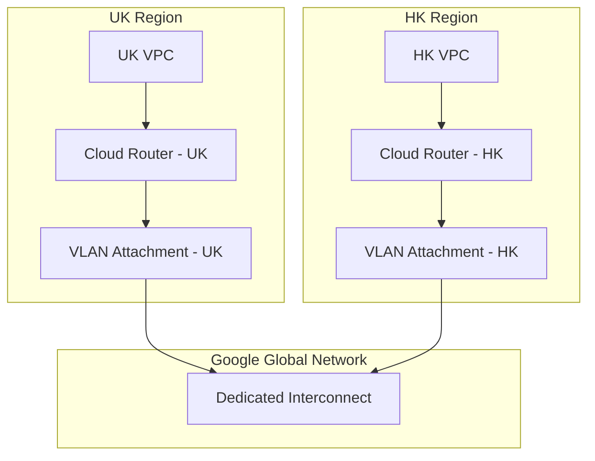

# Interconnect Flow: UK VPC to HK VPC

This document illustrates the network flow of connecting a VPC in the UK region to a VPC in the HK region using Google Cloud Dedicated Interconnect.

## Architecture Diagram

## Explanation

1.  **VPC Networks**: You have two separate VPC networks, one in the UK and one in Hong Kong.
2.  **Cloud Routers**: Each VPC has a Cloud Router to manage dynamic routing using BGP (Border Gateway Protocol).
3.  **VLAN Attachments**: Each Cloud Router is connected to a VLAN Attachment. This acts as a logical connection (VLAN) over the physical Interconnect.
4.  **Dedicated Interconnect**: The VLAN attachments from both regions connect to the same Dedicated Interconnect, which is part of Google's global network. This allows traffic to be routed between the two VPCs over a private, high-bandwidth connection.
