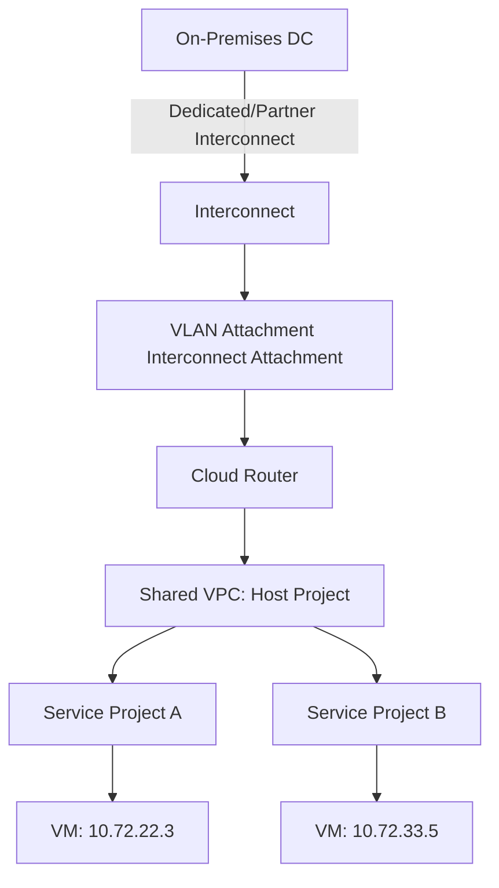
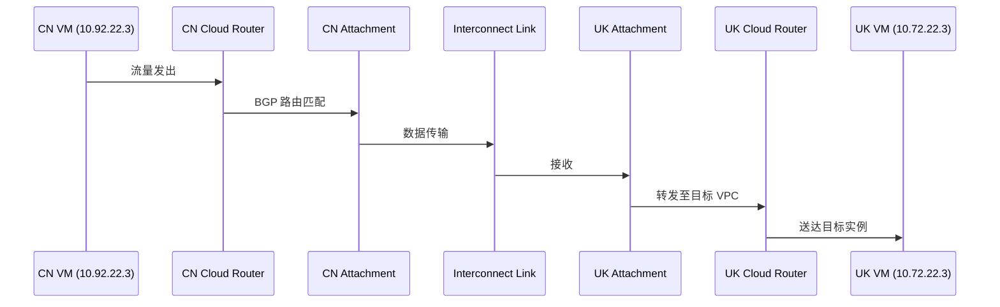
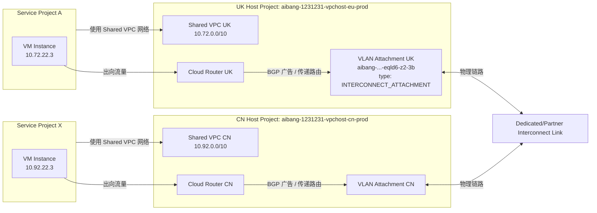
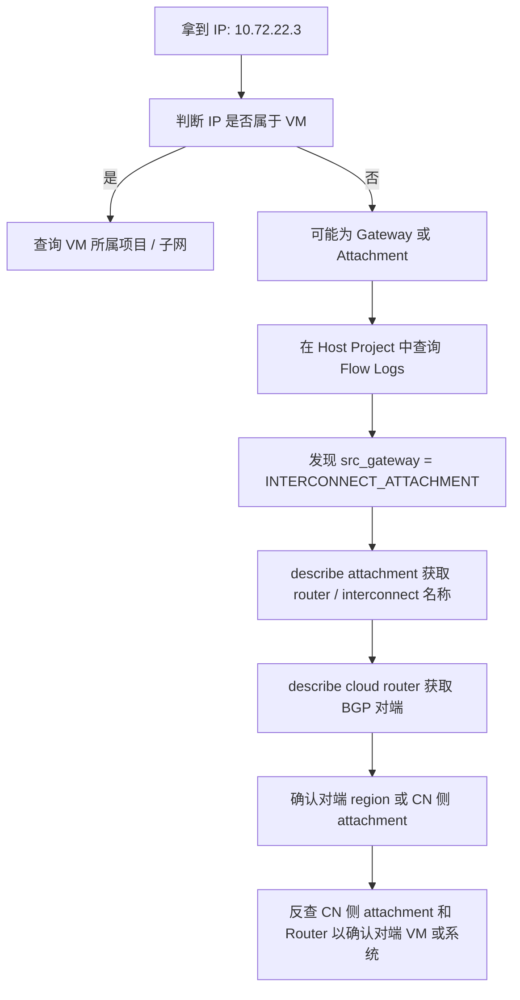
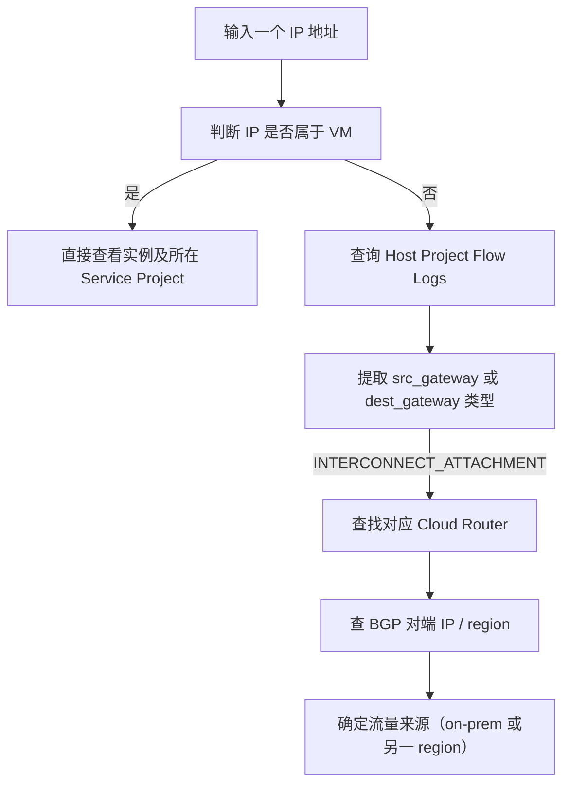

非常好的问题，这正是 **多工程 + Shared VPC + Interconnect** 环境下常见的排查痛点。

你的问题本质是想：**从一个跨工程、跨 Shared VPC 的 IP（如 10.72.22.3）定位它属于哪个资源（VM、Router、Attachment）并查看流量日志**。

我们分两部分来讲解：

1️⃣ **GCP 网络结构与资源关系概念图**

2️⃣ **跨 Project / Shared VPC / Interconnect 的日志定位与分析策略**

---

## **一、GCP 网络结构关系概念**

先理解清楚几类关键资源在 GCP VPC 架构中的关系：



| **组件**                                      | **说明**                                                                            |
| --------------------------------------------- | ----------------------------------------------------------------------------------- |
| **Interconnect**                              | 实体物理链路（专线或 Partner）连接 GCP 与本地数据中心                               |
| **VLAN Attachment (Interconnect Attachment)** | Interconnect 上的逻辑接口，每个 attachment 对应一个 Cloud Router                    |
| **Cloud Router**                              | 控制层资源，负责通过 BGP 交换路由                                                   |
| **Shared VPC Host Project**                   | 定义网络（VPC/Subnet）的宿主工程                                                    |
| **Service Project**                           | 连接到 Shared VPC 的工程，VM 实际存在于这里，但使用 Host Project 的网络             |
| **VM Instance**                               | 最终分配 IP 的计算节点，可属于任意 Service Project，但 IP 属于 Shared VPC 的 subnet |

---

## **二、定位 IP 来源的思路与方法**

### **1️⃣ 先判断 IP 属于哪个 VPC / Subnet**

```
# 查询 IP 属于哪个 subnet
gcloud compute addresses list --filter="address=10.72.22.3"
gcloud compute instances list --filter="networkInterfaces.networkIP=10.72.22.3" --project=<service_project_id>
```

⚠️ 如果返回为空，说明该 IP 不是某个 VM，而是：

- Cloud NAT 的内部地址
- Cloud Router / Interconnect Attachment 的 IP
- 或是 Google 的系统保留地址（如代理、转发规则）

---

### **2️⃣ 分析 VPC Flow Logs**

在 **Shared VPC Host Project** 的网络中开启的 **VPC Flow Logs** 才能看到所有跨 project 的流量。

**查询方式：**

```
# 示例：在 host project 中
gcloud logging read 'resource.type="gce_subnetwork" AND jsonPayload.connection.src_ip="10.72.22.3"' \
  --project=aibang-1231231-vpchost-eu-prod --limit=10 --format=json
```

结果中可以看到：

```
"src_ip": "10.72.22.3",
"src_vpc": {
  "project_id": "aibang-1231231-vpchost-eu-prod",
  "vpc_name": "aibang-1231231-vpchost-eu-prod-cinternal-vpc1"
},
"src_gateway": {
  "type": "INTERCONNECT_ATTACHMENT",
  "name": "aibang-1231231-vpchost-eu-prod-vpc1-eqld6-z2-3b"
}
```

> ✅ 表示此流量来源于一个 VLAN Attachment，不是 VM。

---

### **3️⃣ 反查 Interconnect Attachment 来源**

如果 src_gateway.type="INTERCONNECT_ATTACHMENT"，

你可以通过以下命令查清楚 attachment 与 router 的关系：

```
gcloud compute interconnects attachments describe aibang-1231231-vpchost-eu-prod-vpc1-eqld6-z2-3b \
  --region=europe-west2 --project=aibang-1231231-vpchost-eu-prod
```

重点字段：

- cloudRouter → 对应的 Cloud Router 名称
- interconnect → 所属物理 Interconnect
- routerRegion / vlanTag8021q → VLAN 编号
- ipAddress → attachment 接口的内部 IP（可能就是 10.72.22.3）

---

### **4️⃣ 进一步分析 Cloud Router 的 BGP 邻居**

```
gcloud compute routers describe <cloud-router-name> --region=europe-west2 --project=aibang-1231231-vpchost-eu-prod
```

查看：

- bgpPeers → 本地与 on-prem 或 CN region 的连接关系
- advertisedRoutes / learnedRoutes → 路由传播表
- 结合 attachment 的 ipAddress 可确认对应 region 或 DC。

---

### **5️⃣ 跨 Region 分析 CN ↔ UK**

当 UK 和 CN 的 Shared VPC 通过 Interconnect 互通时，

流量路径可能如下：



---

## **三、推荐的统一日志查询策略**

| **日志类型**                                        | **位置**                       | **用途**                                   |
| --------------------------------------------------- | ------------------------------ | ------------------------------------------ |
| **VPC Flow Logs**                                   | Host Project                   | 追踪任意 IP 在 VPC 中的进出流量            |
| **Interconnect Logs (Network Connectivity Center)** | Host Project                   | 追踪 VLAN Attachments 与 Cloud Router 流量 |
| **Cloud Router BGP Logs**                           | Host Project                   | 分析跨 region 或 on-prem 路由              |
| **Firewall Logs**                                   | Host Project / Service Project | 确认流量是否被拦截                         |

可以使用 BigQuery Sink 收集所有项目的日志：

```
gcloud logging sinks create vpc_logs_sink bigquery.googleapis.com/projects/<central-log-project>/datasets/vpc_flow_dataset \
  --log-filter='resource.type="gce_subnetwork"' \
  --include-children
```

---

## **四、快速判断脚本 (bash)**

```
#!/bin/bash
IP=$1
HOST_PROJECT="aibang-1231231-vpchost-eu-prod"
REGION="europe-west2"

echo "=== 查找 IP $IP ==="
# 查找 VM
gcloud compute instances list --filter="networkInterfaces.networkIP=${IP}" --format="table(name,zone,networkInterfaces.network)" --project=$HOST_PROJECT

# 查找 Attachment
gcloud compute interconnects attachments list --project=$HOST_PROJECT --format="table(name,region,router,ipAddress)" | grep "$IP"
```

---

## **五、注意事项与最佳实践**

- ✅ **所有 Shared VPC 的 Flow Logs 必须在 Host Project 开启** 才能捕捉跨项目流量。
- ✅ 若要分析跨 region / CN ↔ UK 流量，**必须结合 Interconnect Attachment + Router + VPC Logs**。
- ⚠️ 不同工程（Service Project）的 VM 共享网络，但日志归属 Host Project。
- ⚠️ 某些系统 IP（如 src_gateway）不会出现在 instances list 中，只能在 attachment / router 级别找到。

---

是否希望我帮你画出一个「跨工程 Shared VPC + Interconnect 日志溯源」的 **Mermaid 网络拓扑图**（显示从 VM 到 Interconnect 到另一个 Region 的流量路径）？这样你可以直接放入内部 Wiki。

好的，我们继续深入，并给出完整的 **「跨工程 Shared VPC + Interconnect 流量溯源拓扑」**，以帮助你快速定位任意 IP（例如 10.72.22.3）的来源和路径。

---

## **一、跨工程 Shared VPC + Interconnect 网络拓扑图**

下面这张 Mermaid 图展示了 **UK Shared VPC 与 CN Shared VPC 之间的互联关系**，

包括 Host Project、Service Project、Cloud Router、Interconnect Attachments 及流量路径：



---

## **二、日志溯源路径分析**

当你在日志中看到：

```
"src_ip": "10.72.22.3",
"src_gateway": {
  "type": "INTERCONNECT_ATTACHMENT",
  "name": "aibang-1231231-vpchost-eu-prod-vpc1-eqld6-z2-3b"
}
```

表示：

1. **该流量的“源网关”是 VLAN Attachment**（不是 VM）；
2. **流量源自 Interconnect 另一端（例如 CN 侧的 Cloud Router）**；
3. **10.72.22.3 可能是 attachment 的接口 IP**，可在 gcloud compute interconnects attachments describe 中验证；
4. **最终流量经过 Cloud Router 进入 Shared VPC UK，再被转发到具体子网（subnet）中。**

---

## **三、完整溯源流程（操作步骤）**



---

## **四、跨工程日志集中分析（BigQuery Sink）**

建议将 UK 和 CN 两个 Host Project 的 VPC Flow Logs 集中写入一个中央项目（例如 aibang-log-central-prod）：

```bash
# 在 UK Host Project 中创建 sink
gcloud logging sinks create vpc_flow_to_bq \
  bigquery.googleapis.com/projects/aibang-log-central-prod/datasets/vpc_flow_logs \
  --log-filter='resource.type="gce_subnetwork"' \
  --include-children \
  --project=aibang-1231231-vpchost-eu-prod

# 在 CN Host Project 中创建 sink
gcloud logging sinks create vpc_flow_to_bq \
  bigquery.googleapis.com/projects/aibang-log-central-prod/datasets/vpc_flow_logs \
  --log-filter='resource.type="gce_subnetwork"' \
  --include-children \
  --project=aibang-1231231-vpchost-cn-prod
```

然后在 BigQuery 中执行统一查询：

```sql
SELECT
  jsonPayload.connection.src_ip,
  jsonPayload.connection.dest_ip,
  jsonPayload.src_gateway.type AS src_gateway_type,
  jsonPayload.src_vpc.vpc_name,
  resource.labels.subnetwork_name,
  resource.labels.location
FROM
  `aibang-log-central-prod.vpc_flow_logs._TABLE_SUFFIX`
WHERE
  jsonPayload.connection.src_ip = "10.72.22.3"
LIMIT 100;
```

---

## **五、快速溯源命令汇总表**

| **目标**          | **命令示例**                                                                    | **用途**                  |
| ----------------- | ------------------------------------------------------------------------------- | ------------------------- |
| 查 IP 属于哪台 VM | gcloud compute instances list --filter="networkInterfaces.networkIP=10.72.22.3" | 判断是否为 VM             |
| 查 Flow Logs      | gcloud logging read 'jsonPayload.connection.src_ip="10.72.22.3"'                | 找出流量来源              |
| 查 Attachment     | gcloud compute interconnects attachments describe <name>                        | 查看 VLAN Attachment 详情 |
| 查 Cloud Router   | gcloud compute routers describe <router-name>                                   | 查看 BGP 对端与路由信息   |
| 查对端 Region     | gcloud compute interconnects attachments list --project=<cn-host-project>       | 找出对应的对端 attachment |

---

## **六、推荐的日常诊断流程（用于团队内部 SOP）**



---

## **七、实战建议与最佳实践**

- ✅ 在 **Host Project** 层面开启 **VPC Flow Logs + Router Logs**；
- ✅ 使用 **BigQuery** 作为跨项目统一日志分析平台；
- ✅ 定期导出 interconnects attachments list 与 cloud routers list，形成拓扑快照；
- ✅ 建议脚本化（结合 jq）快速解析 attachment ↔ router ↔ region 对应关系；
- ⚠️ 不要只看 Service Project，很多跨域流量都在 Host Project 日志中；
- ⚠️ 部分系统流量（如 Cloud NAT 或 Internal Gateway）不会出现在 instance list 中。

---

是否希望我帮你生成一份 **可直接放入 Wiki 的诊断文档模板（Markdown 格式）**？

内容包括：

- 统一拓扑图
- Flow Log 查询命令
- 常见日志字段解释（src_gateway、src_vpc、connection 等）
- IP 溯源操作指南（脚本 + 查询路径）
