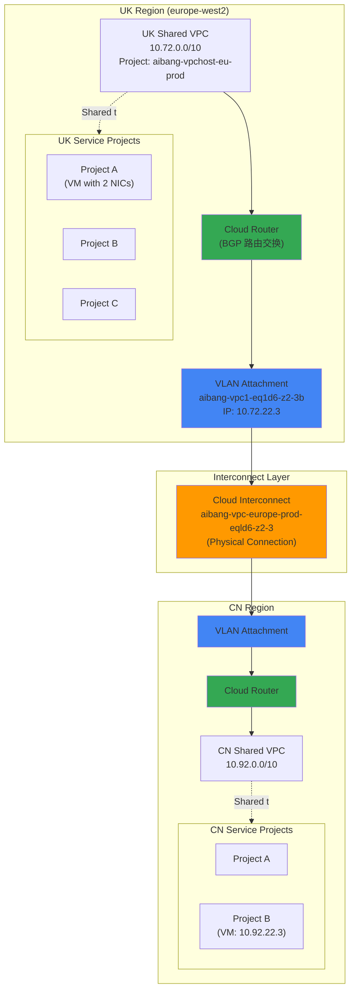
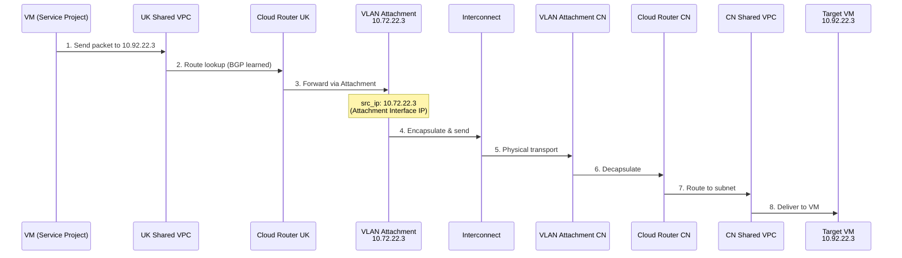
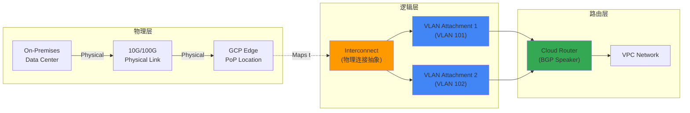

# GCP Shared VPC 跨 Project 日志追踪与 VPC 互联详解

## 问题分析

您的场景涉及：

1. **两个 Shared VPC**：UK (10.72.0.0/10) 和 CN (10.92.0.0/10)
2. **跨 VPC 通信**：通过 Cloud Interconnect 实现
3. **日志追踪目标**：定位源 IP 10.72.22.3（实际是 Interconnect Attachment 而非 VM）
4. **架构理解**：需要理解 Interconnect、Attachment、Cloud Router 的关系

---

## 核心概念：GCP VPC 互联架构

### 1. Interconnect 相关组件关系



### 2. 组件层级关系

|层级|组件|作用|示例|
|---|---|---|---|
|**L1 物理层**|Interconnect|物理专线连接|`aibang-vpc-europe-prod-eqld6-z2-3`|
|**L2 链路层**|VLAN Attachment|虚拟链路，承载流量|`aibang-vpc1-eq1d6-z2-3b`|
|**L3 网络层**|Cloud Router|BGP 路由交换|动态学习/通告路由|
|**L4 网络层**|VPC|逻辑网络空间|`10.72.0.0/10`|

---

## 解决方案：快速定位 IP 来源

### 方案 1：通过 VPC Flow Logs 追踪

#### Step 1: 在 Shared VPC Host Project 启用 Flow Logs

```bash
# 查看当前 Subnet 配置
gcloud compute networks subnets describe cinternal-vpc1-europe-west2 \
  --project=aibang-1231231-vpchost-eu-prod \
  --region=europe-west2

# 启用 Flow Logs (如未启用)
gcloud compute networks subnets update cinternal-vpc1-europe-west2 \
  --project=aibang-1231231-vpchost-eu-prod \
  --region=europe-west2 \
  --enable-flow-logs \
  --logging-aggregation-interval=interval-5-sec \
  --logging-flow-sampling=1.0 \
  --logging-metadata=include-all
```

#### Step 2: 查询 Cloud Logging

```bash
# 方法 A: 使用 gcloud 命令查询
gcloud logging read '
resource.type="gce_subnetwork"
AND resource.labels.subnetwork_name="cinternal-vpc1-europe-west2"
AND (jsonPayload.connection.src_ip="10.72.22.3" OR jsonPayload.connection.dest_ip="10.72.22.3")
' \
  --project=aibang-1231231-vpchost-eu-prod \
  --limit=100 \
  --format=json
```

**Cloud Console 查询语句**：

```sql
resource.type="gce_subnetwork"
resource.labels.project_id="aibang-1231231-vpchost-eu-prod"
resource.labels.subnetwork_name="cinternal-vpc1-europe-west2"
(jsonPayload.connection.src_ip="10.72.22.3" OR 
 jsonPayload.connection.dest_ip="10.72.22.3")
```

### 方案 2：识别 Interconnect Attachment IP

根据您的日志，`10.72.22.3` 是 **VLAN Attachment 的 Cloud Router 接口 IP**，而非 VM。

#### 验证 Attachment 信息

```bash
# 列出所有 VLAN Attachments
gcloud compute interconnects attachments list \
  --project=aibang-1231231-vpchost-eu-prod

# 查看具体 Attachment 详情
gcloud compute interconnects attachments describe aibang-1231231-vpchost-eu-prod-vpc1-eq1d6-z2-3b \
  --project=aibang-1231231-vpchost-eu-prod \
  --region=europe-west2

# 查看关联的 Cloud Router
gcloud compute routers describe <ROUTER_NAME> \
  --project=aibang-1231231-vpchost-eu-prod \
  --region=europe-west2
```

#### 追踪完整路径流程



---

## 实战：定位真实发起者

### Step 1: 确认 IP 类型

```bash
# 检查是否为 VM IP
gcloud compute instances list \
  --project=<SERVICE_PROJECT_ID> \
  --filter="networkInterfaces.networkIP:10.72.22.3" \
  --format="table(name,networkInterfaces[0].networkIP,networkInterfaces[1].networkIP)"

# 检查是否为 Interconnect Attachment
gcloud compute interconnects attachments list \
  --project=aibang-1231231-vpchost-eu-prod \
  --filter="cloudRouterIpAddress:10.72.22.3 OR customerRouterIpAddress:10.72.22.3"
```

### Step 2: 查看 Flow Logs 完整链路

**关键字段解析**：

```json
{
  "src_gateway": {
    "type": "INTERCONNECT_ATTACHMENT",  // 来源网关类型
    "name": "aibang-vpc1-eq1d6-z2-3b",  // Attachment 名称
    "interconnect_name": "aibang-vpc-europe-prod-eqld6-z2-3"  // 物理 Interconnect
  },
  "connection": {
    "src_ip": "10.72.22.3",  // Attachment 的 Cloud Router IP
    "dest_ip": "10.100.17.167",  // 目标 IP (可能是另一个 VPC)
    "protocol": 6  // TCP
  }
}
```

### Step 3: 反向追踪原始流量

```bash
# 查询更早的日志，寻找到 Attachment 之前的流量
gcloud logging read '
resource.type="gce_subnetwork"
AND jsonPayload.connection.dest_ip="10.100.17.167"
AND jsonPayload.src_instance.vm_name!=""
AND timestamp>="2025-10-09T00:00:00Z"
' \
  --project=aibang-1231231-vpchost-eu-prod \
  --limit=50 \
  --format="table(timestamp,jsonPayload.src_instance.vm_name,jsonPayload.connection.src_ip,jsonPayload.connection.dest_ip)"
```

---

## 日志收集最佳实践

### 1. 配置 Log Sink 导出到 BigQuery

```bash
# 创建 BigQuery Dataset
bq --project=aibang-1231231-vpchost-eu-prod mk \
  --dataset \
  --location=europe-west2 \
  vpc_flow_logs

# 创建 Log Sink
gcloud logging sinks create vpc-flow-to-bq \
  bigquery.googleapis.com/projects/aibang-1231231-vpchost-eu-prod/datasets/vpc_flow_logs \
  --project=aibang-1231231-vpchost-eu-prod \
  --log-filter='resource.type="gce_subnetwork" AND jsonPayload.connection.src_ip!=""'
```

### 2. BigQuery 查询示例

```sql
-- 查询特定 IP 的所有连接
SELECT
  timestamp,
  jsonPayload.src_instance.vm_name AS source_vm,
  jsonPayload.connection.src_ip,
  jsonPayload.connection.dest_ip,
  jsonPayload.src_gateway.name AS gateway_name,
  jsonPayload.src_gateway.type AS gateway_type
FROM
  `aibang-1231231-vpchost-eu-prod.vpc_flow_logs.compute_googleapis_com_vpc_flows_*`
WHERE
  jsonPayload.connection.src_ip = '10.72.22.3'
  OR jsonPayload.connection.dest_ip = '10.72.22.3'
ORDER BY
  timestamp DESC
LIMIT 100;
```

---

## Interconnect 架构深入理解

### Interconnect vs Attachment vs Router



### 关键概念对照表

|概念|类比|作用域|IP 地址|
|---|---|---|---|
|**Interconnect**|物理光纤|单条专线|无 (物理层)|
|**VLAN Attachment**|虚拟线路 (VLAN 隔离)|单个 VPC 连接|`/29` 互联网段|
|**Cloud Router**|路由器|单个 Region|BGP Peer IP|
|**VPC**|数据中心网络|全球|RFC 1918 私有段|

### Attachment IP 地址分配

当创建 VLAN Attachment 时，GCP 自动分配 `/29` 网段：

```plaintext
Example: 169.254.0.0/29
├─ 169.254.0.0    → Network Address
├─ 169.254.0.1    → GCP Cloud Router IP  ← 这就是日志中的 src_ip
├─ 169.254.0.2    → Customer Router IP
├─ 169.254.0.3-6  → Usable (通常未用)
└─ 169.254.0.7    → Broadcast Address
```

**您的案例**：

- `10.72.22.3` 是 UK 侧 VLAN Attachment 的 **Cloud Router 接口 IP**
- 真实发起流量的 VM 在 Service Project 中，使用 VPC 内部 IP

---

## 注意事项

### 权限要求

```bash
# 查看 Shared VPC Host Project 需要的角色
# 1. Compute Network Viewer (查看网络配置)
# 2. Logging Viewer (查看日志)
# 3. Monitoring Viewer (查看指标)

gcloud projects add-iam-policy-binding aibang-1231231-vpchost-eu-prod \
  --member="user:your-email@example.com" \
  --role="roles/compute.networkViewer"
```

### Flow Logs 开销

- **存储成本**：约 $0.50/GB (Cloud Logging)
- **性能影响**：< 1% CPU overhead
- **采样建议**：
    - 生产环境：`0.1` ~ `0.5` (10%-50%)
    - 故障排查：`1.0` (100%)

### 跨 VPC 流量路径验证

```bash
# 使用 Connectivity Tests 验证路径
gcloud network-management connectivity-tests create uk-to-cn-test \
  --project=aibang-1231231-vpchost-eu-prod \
  --source-ip-address=10.72.22.3 \
  --destination-ip-address=10.92.22.3 \
  --protocol=TCP \
  --destination-port=443

# 查看测试结果
gcloud network-management connectivity-tests describe uk-to-cn-test \
  --project=aibang-1231231-vpchost-eu-prod
```

---

## 快速定位 Checklist

- [ ] 确认 IP 是 VM 还是 Interconnect Attachment
- [ ] 检查 Shared VPC Host Project 的 Flow Logs 是否启用
- [ ] 使用 Cloud Logging 查询双向流量
- [ ] 查看 `src_gateway` 字段确定网关类型
- [ ] 如需长期分析,导出到 BigQuery
- [ ] 验证 BGP 路由通告状态 (`gcloud compute routers get-status`)
- [ ] 使用 Connectivity Tests 验证路径可达性