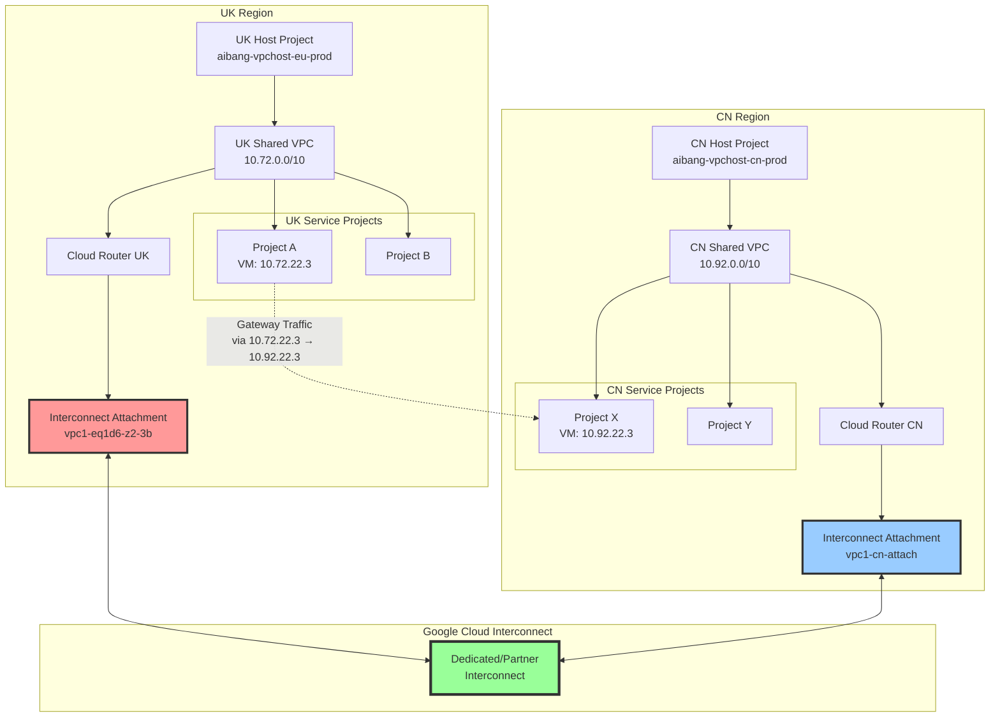

# GCP Shared VPC 跨 Project 日志追踪与 VPC 互联详解

- 

## 📋 概述

本文档详细介绍如何在 Google Cloud Platform (GCP) 中进行跨 Project 的 Shared VPC 日志追踪，以及 VPC 之间通过 Interconnect 进行互联的核心概念和实践方法。

## 🏗️ 架构概念

### Shared VPC 架构模型

```
UK Region (Host Project)
├── Shared VPC UK (10.72.0.0/10)
│   ├── Project A (Service Project)
│   │   └── VM Instance (10.72.22.3)
│   ├── Project B (Service Project)
│   └── Project C (Service Project)
└── Interconnect Attachment

CN Region (Host Project)
├── Shared VPC CN (10.92.0.0/10)
│   ├── Project X (Service Project)
│   │   └── VM Instance (10.92.22.3)
│   ├── Project Y (Service Project)
│   └── Project Z (Service Project)
└── Interconnect Attachment
```

### VPC 互联架构图



## 🔍 日志追踪策略

### 1. Interconnect Gateway IP 分析 (主要场景)

基于你的日志分析，IP `10.72.22.3` 出现在 `src_gateway` 字段中，这表明它是 **Interconnect Attachment 的网关 IP**，而不是 VM 实例的 IP。

#### 分析 Interconnect Gateway 流量

```bash
# 1. 首先确认这是 Interconnect Attachment 的 IP
gcloud compute interconnects attachments list \
    --project=aibang-1231231-vpchost-eu-prod \
    --regions=europe-west2 \
    --format="table(name,cloudRouterIpAddress,customerRouterIpAddress,vlanTag8021q,operationalStatus)"

# 2. 查看具体的 Attachment 详情
gcloud compute interconnects attachments describe \
    aibang-1231231-vpchost-eu-prod-vpc1-eq1d6-z2-3b \
    --region=europe-west2 \
    --project=aibang-1231231-vpchost-eu-prod \
    --format="json" | jq '.cloudRouterIpAddress, .customerRouterIpAddress'

# 3. 检查 Cloud Router 的 BGP 配置
gcloud compute routers describe \
    $(gcloud compute interconnects attachments describe aibang-1231231-vpchost-eu-prod-vpc1-eq1d6-z2-3b \
      --region=europe-west2 \
      --project=aibang-1231231-vpchost-eu-prod \
      --format="value(router.basename())") \
    --region=europe-west2 \
    --project=aibang-1231231-vpchost-eu-prod
```

#### 分析 Interconnect 流量日志

```bash
# 查询 Interconnect Attachment 相关的流量日志
gcloud logging read '
resource.type="gce_interconnect_attachment"
AND resource.labels.attachment_name="aibang-1231231-vpchost-eu-prod-vpc1-eq1d6-z2-3b"
AND (jsonPayload.src_gateway.type="INTERCONNECT_ATTACHMENT" OR jsonPayload.dest_gateway.type="INTERCONNECT_ATTACHMENT")
AND timestamp>="2025-10-09T00:00:00Z"
' \
--project=aibang-1231231-vpchost-eu-prod \
--format="json" \
--limit=100

# 专门查询包含你发现的 IP 的日志
gcloud logging read '
resource.type="gce_subnetwork" OR resource.type="gce_interconnect_attachment"
AND (jsonPayload.src_gateway.connection.src_ip="10.72.22.3" OR jsonPayload.connection.src_ip="10.72.22.3")
AND timestamp>="2025-10-09T00:00:00Z"
' \
--project=aibang-1231231-vpchost-eu-prod \
--format="json"
```

### 2. VM 实例 IP 追踪 (次要场景)

```bash
# 查看 Interconnect Attachment 详情
gcloud compute interconnects attachments describe \
    aibang-vpchost-eu-prod-vpc1-eq1d6-z2-3b \
    --region=europe-west2 \
    --project=aibang-vpchost-eu-prod

# 查看 Cloud Router BGP 状态
gcloud compute routers get-status \
    uk-cloud-router \
    --region=europe-west2 \
    --project=aibang-vpchost-eu-prod \
    --format="json(result.bgpPeerStatus)"
```

### 3. 理解 Interconnect Gateway 日志结构

基于你提供的日志示例，我们可以看到关键字段：

```json
{
  "src_gateway": {
    "type": "INTERCONNECT_ATTACHMENT",
    "project_id": "aibang-1231231-vpchost-eu-prod",
    "vpc": {
      "vpc_name": "aibang-1231231-vpchost-eu-prod-cinternal-vpc1",
      "project_id": "aibang-1231231-vpchost-eu-prod"
    },
    "location": "europe-west2",
    "interconnect_project_number": "538341205868",
    "name": "aibang-1231231-vpchost-eu-prod-vpc1-eq1d6-z2-3b",
    "interconnect_name": "aibang-1231231-vpc-europe-prod-eqld6-z2-3"
  },
  "connection": {
    "protocol": 6,
    "dest_ip": "10.100.17.167",
    "src_ip": "10.72.22.3",
    "src_port": 59304
  }
}
```

这表明 `10.72.22.3` 是通过 Interconnect Attachment 路由的流量，而不是直接的 VM IP。

### 4. 日志收集策略

#### VPC Flow Logs 配置

```bash
# 启用 Shared VPC 的 Flow Logs
gcloud compute networks subnets update cinternal-vpc1-europe-west2 \
    --project=aibang-vpchost-eu-prod \
    --region=europe-west2 \
    --enable-flow-logs \
    --logging-flow-sampling=1.0 \
    --logging-aggregation-interval=interval-1-min \
    --logging-metadata=include-all

# 为 CN 区域启用 Flow Logs
gcloud compute networks subnets update cinternal-vpc1-asia-east1 \
    --project=aibang-vpchost-cn-prod \
    --region=asia-east1 \
    --enable-flow-logs \
    --logging-flow-sampling=1.0 \
    --logging-aggregation-interval=interval-1-min \
    --logging-metadata=include-all
```

#### Cloud Logging 查询

```bash
# 查询特定 IP 的流量日志
gcloud logging read '
resource.type="gce_subnetwork"
AND jsonPayload.src_ip="10.72.22.3"
AND jsonPayload.dest_ip="10.92.22.3"
AND timestamp>="2025-10-09T00:00:00Z"
' \
--project=aibang-vpchost-eu-prod \
--format="json" \
--limit=100

# 查询 Interconnect 相关日志
gcloud logging read '
resource.type="gce_interconnect_attachment"
AND resource.labels.attachment_name="aibang-vpchost-eu-prod-vpc1-eq1d6-z2-3b"
AND timestamp>="2025-10-09T00:00:00Z"
' \
--project=aibang-vpchost-eu-prod \
--format="json"
```

### 3. 跨 Project 日志聚合

#### 创建日志汇聚 Sink

```bash
# 在 UK Host Project 创建 Sink
gcloud logging sinks create uk-vpc-flow-sink \
    bigquery.googleapis.com/projects/logging-project/datasets/vpc_logs \
    --log-filter='
        resource.type="gce_subnetwork"
        AND resource.labels.subnetwork_name="cinternal-vpc1-europe-west2"
    ' \
    --project=aibang-vpchost-eu-prod

# 在 CN Host Project 创建 Sink
gcloud logging sinks create cn-vpc-flow-sink \
    bigquery.googleapis.com/projects/logging-project/datasets/vpc_logs \
    --log-filter='
        resource.type="gce_subnetwork"
        AND resource.labels.subnetwork_name="cinternal-vpc1-asia-east1"
    ' \
    --project=aibang-vpchost-cn-prod
```

## 🔧 实用命令集合

### Interconnect Gateway 分析命令 (优先级最高)

```bash
# 1. 分析特定 Interconnect Attachment 的网关配置
gcloud compute interconnects attachments describe \
    aibang-1231231-vpchost-eu-prod-vpc1-eq1d6-z2-3b \
    --region=europe-west2 \
    --project=aibang-1231231-vpchost-eu-prod \
    --format="json" | jq '{
      name: .name,
      cloudRouterIpAddress: .cloudRouterIpAddress,
      customerRouterIpAddress: .customerRouterIpAddress,
      vlanTag: .vlanTag8021q,
      operationalStatus: .operationalStatus,
      interconnect: .interconnect
    }'

# 2. 查找所有使用特定 IP 范围的 Interconnect Attachments
gcloud compute interconnects attachments list \
    --project=aibang-1231231-vpchost-eu-prod \
    --regions=europe-west2 \
    --format="json" | jq '.[] | select(.cloudRouterIpAddress | startswith("10.72"))'

# 3. 分析 Interconnect 本身的配置
gcloud compute interconnects describe \
    aibang-1231231-vpc-europe-prod-eqld6-z2-3 \
    --project=aibang-1231231-vpchost-eu-prod \
    --format="json" | jq '{
      name: .name,
      location: .location,
      linkType: .linkType,
      operationalStatus: .operationalStatus,
      provisionedLinkCount: .provisionedLinkCount
    }'

# 4. 查看 Cloud Router 的详细 BGP 状态
gcloud compute routers get-status \
    $(gcloud compute interconnects attachments describe aibang-1231231-vpchost-eu-prod-vpc1-eq1d6-z2-3b \
      --region=europe-west2 \
      --project=aibang-1231231-vpchost-eu-prod \
      --format="value(router.basename())") \
    --region=europe-west2 \
    --project=aibang-1231231-vpchost-eu-prod \
    --format="json" | jq '.result.bgpPeerStatus[] | {
      name: .name,
      ipAddress: .ipAddress,
      peerIpAddress: .peerIpAddress,
      state: .state,
      advertisedRoutes: .advertisedRoutes[].destRange
    }'
```

### 网络资源发现命令

```bash
# 列出所有 Shared VPC Host Projects
gcloud compute shared-vpc list-host-projects

# 列出特定 Host Project 的 Service Projects
gcloud compute shared-vpc list-associated-resources \
    aibang-vpchost-eu-prod

# 查看 VPC 网络详情
gcloud compute networks describe \
    aibang-vpchost-eu-prod-cinternal-vpc1 \
    --project=aibang-vpchost-eu-prod

# 列出所有子网
gcloud compute networks subnets list \
    --project=aibang-vpchost-eu-prod \
    --filter="network:aibang-vpchost-eu-prod-cinternal-vpc1"
```

### Interconnect 相关命令

```bash
# 列出所有 Interconnects
gcloud compute interconnects list \
    --project=aibang-vpchost-eu-prod

# 列出所有 Interconnect Attachments
gcloud compute interconnects attachments list \
    --regions=europe-west2 \
    --project=aibang-vpchost-eu-prod

# 查看 Interconnect 状态
gcloud compute interconnects describe \
    aibang-vpc-europe-prod-eqld6-z2-3 \
    --project=aibang-vpchost-eu-prod

# 查看 Cloud Router 配置
gcloud compute routers describe \
    uk-cloud-router \
    --region=europe-west2 \
    --project=aibang-vpchost-eu-prod
```

### 实例和网络接口查询

```bash
# 查找使用特定网络的所有实例
gcloud compute instances list \
    --project=service-project-a \
    --filter="networkInterfaces.network:aibang-vpchost-eu-prod-cinternal-vpc1" \
    --format="table(name,zone,networkInterfaces[].networkIP,networkInterfaces[].network)"

# 查看实例的详细网络配置
gcloud compute instances describe instance-name \
    --zone=europe-west2-a \
    --project=service-project-a \
    --format="json(networkInterfaces)"

# 查找特定 IP 范围内的所有实例
gcloud compute instances list \
    --filter="networkInterfaces.networkIP~'^10\.98\.'" \
    --format="table(name,zone,networkInterfaces[].networkIP)"
```

## 📊 监控和告警

### Cloud Monitoring 指标

```bash
# 创建 Interconnect 带宽监控告警
gcloud alpha monitoring policies create \
    --policy-from-file=interconnect-bandwidth-policy.yaml

# 查看 VPC Flow Logs 指标
gcloud logging metrics list \
    --filter="name:vpc_flow_*"
```

### 自定义监控脚本

```bash
#!/bin/bash
# vpc-monitor.sh - 监控跨 VPC 流量

# 设置项目变量
UK_HOST_PROJECT="aibang-vpchost-eu-prod"
CN_HOST_PROJECT="aibang-vpchost-cn-prod"
TARGET_IP="10.72.22.3"

# 查询最近1小时的流量
echo "Checking traffic for IP: $TARGET_IP"

gcloud logging read "
resource.type=\"gce_subnetwork\"
AND (jsonPayload.src_ip=\"$TARGET_IP\" OR jsonPayload.dest_ip=\"$TARGET_IP\")
AND timestamp>=\"$(date -u -d '1 hour ago' +%Y-%m-%dT%H:%M:%SZ)\"
" \
--project=$UK_HOST_PROJECT \
--format="table(timestamp,jsonPayload.src_ip,jsonPayload.dest_ip,jsonPayload.protocol)" \
--limit=50
```

## 🚨 故障排查流程

### 1. 连接性问题排查

```bash
# 步骤1: 检查 Interconnect Attachment 状态
gcloud compute interconnects attachments describe \
    attachment-name \
    --region=region \
    --project=host-project

# 步骤2: 检查 BGP 会话状态
gcloud compute routers get-status \
    router-name \
    --region=region \
    --project=host-project

# 步骤3: 检查路由表
gcloud compute routes list \
    --project=host-project \
    --filter="network:vpc-name"

# 步骤4: 检查防火墙规则
gcloud compute firewall-rules list \
    --project=host-project \
    --filter="network:vpc-name"
```

### 2. Interconnect Gateway 流量分析脚本

```bash
#!/bin/bash
# analyze-interconnect-gateway-traffic.sh

GATEWAY_IP="10.72.22.3"
DEST_IP="10.100.17.167"
ATTACHMENT_NAME="aibang-1231231-vpchost-eu-prod-vpc1-eq1d6-z2-3b"
HOST_PROJECT="aibang-1231231-vpchost-eu-prod"
TIME_RANGE="1h"

echo "Analyzing Interconnect Gateway traffic for IP: $GATEWAY_IP"

# 1. 查询 Interconnect Attachment 相关日志
echo "=== Interconnect Attachment Logs ==="
gcloud logging read "
resource.type=\"gce_interconnect_attachment\"
AND resource.labels.attachment_name=\"$ATTACHMENT_NAME\"
AND timestamp>=\"$(date -u -d "$TIME_RANGE ago" +%Y-%m-%dT%H:%M:%SZ)\"
" \
--project=$HOST_PROJECT \
--format="json" | jq -r '.[] | "\(.timestamp) Attachment: \(.resource.labels.attachment_name) Status: \(.jsonPayload.status // "N/A")"'

# 2. 查询包含 Gateway IP 的 VPC Flow Logs
echo "=== VPC Flow Logs with Gateway IP ==="
gcloud logging read "
resource.type=\"gce_subnetwork\"
AND (jsonPayload.src_gateway.connection.src_ip=\"$GATEWAY_IP\" OR jsonPayload.connection.src_ip=\"$GATEWAY_IP\")
AND timestamp>=\"$(date -u -d "$TIME_RANGE ago" +%Y-%m-%dT%H:%M:%SZ)\"
" \
--project=$HOST_PROJECT \
--format="json" | jq -r '.[] | "\(.timestamp) \(.jsonPayload.src_gateway.connection.src_ip // .jsonPayload.connection.src_ip) -> \(.jsonPayload.dest_vpc.vpc_name // .jsonPayload.connection.dest_ip) via \(.jsonPayload.src_gateway.name // "Direct")"'

# 3. 分析 Interconnect 路由状态
echo "=== Interconnect Router Status ==="
ROUTER_NAME=$(gcloud compute interconnects attachments describe $ATTACHMENT_NAME \
  --region=europe-west2 \
  --project=$HOST_PROJECT \
  --format="value(router.basename())")

echo "Router: $ROUTER_NAME"
gcloud compute routers get-status $ROUTER_NAME \
  --region=europe-west2 \
  --project=$HOST_PROJECT \
  --format="table(result.bgpPeerStatus[].name,result.bgpPeerStatus[].state,result.bgpPeerStatus[].ipAddress)"

# 4. 检查相关的路由表
echo "=== Related Routes ==="
gcloud compute routes list \
  --project=$HOST_PROJECT \
  --filter="nextHopGateway:$ROUTER_NAME OR description:$ATTACHMENT_NAME" \
  --format="table(name,destRange,nextHopGateway,priority)"
```

## 📈 最佳实践

### 1. Interconnect Gateway 监控策略

- **Gateway IP 追踪**: 重点监控 Interconnect Attachment 的 `cloudRouterIpAddress` 和 `customerRouterIpAddress`
- **BGP 会话监控**: 定期检查 BGP 对等状态，确保路由正常传播
- **Attachment 状态监控**: 监控 `operationalStatus` 字段，及时发现连接问题

### 2. 日志分析重点

- **区分流量类型**:
  - `src_gateway.type="INTERCONNECT_ATTACHMENT"` 表示跨 VPC 的 Interconnect 流量
  - 直接的 VM IP 流量会显示在 `connection.src_ip` 中
- **关注 Gateway 字段**:
  - `src_gateway.name`: Attachment 名称
  - `src_gateway.interconnect_name`: 物理 Interconnect 名称
  - `src_gateway.location`: 物理位置

### 3. 网络设计原则

- **IP 地址规划**:
  - Interconnect Gateway IP 通常使用 /30 子网 (如 169.254.x.x/30)
  - 确保不同区域的 VPC CIDR 不重叠
- **冗余设计**: 每个区域配置多个 Interconnect Attachment 实现高可用
- **路由策略**: 使用 Cloud Router 的 BGP 配置控制路由传播

### 4. Interconnect Gateway 自动化监控

```bash
# 创建 Interconnect Gateway 专用监控脚本
cat > /usr/local/bin/interconnect-gateway-monitor.sh << 'EOF'
#!/bin/bash
# Interconnect Gateway 监控脚本

PROJECTS=("aibang-1231231-vpchost-eu-prod" "aibang-1231231-vpchost-cn-prod")
GATEWAY_IPS=("10.72.22.3" "10.92.22.3")

echo "=== Interconnect Gateway Health Check ==="
echo "Timestamp: $(date)"

for project in "${PROJECTS[@]}"; do
    echo "Checking project: $project"

    # 1. 检查所有 Interconnect Attachments 状态
    echo "--- Interconnect Attachments Status ---"
    gcloud compute interconnects attachments list \
        --project=$project \
        --format="table(name,region,operationalStatus,cloudRouterIpAddress)" \
        --filter="operationalStatus!=OS_ACTIVE"

    # 2. 检查 BGP 会话状态
    echo "--- BGP Sessions Status ---"
    for attachment in $(gcloud compute interconnects attachments list --project=$project --format="value(name,region)"); do
        attachment_name=$(echo $attachment | cut -d' ' -f1)
        region=$(echo $attachment | cut -d' ' -f2)

        router_name=$(gcloud compute interconnects attachments describe $attachment_name \
            --region=$region \
            --project=$project \
            --format="value(router.basename())")

        if [ ! -z "$router_name" ]; then
            echo "Router: $router_name (Attachment: $attachment_name)"
            gcloud compute routers get-status $router_name \
                --region=$region \
                --project=$project \
                --format="table(result.bgpPeerStatus[].name,result.bgpPeerStatus[].state,result.bgpPeerStatus[].ipAddress)" \
                --filter="result.bgpPeerStatus[].state!=Established"
        fi
    done

    # 3. 检查最近的 Gateway 流量
    echo "--- Recent Gateway Traffic ---"
    for gateway_ip in "${GATEWAY_IPS[@]}"; do
        echo "Checking traffic for Gateway IP: $gateway_ip"
        gcloud logging read "
        resource.type=\"gce_subnetwork\" OR resource.type=\"gce_interconnect_attachment\"
        AND (jsonPayload.src_gateway.connection.src_ip=\"$gateway_ip\" OR jsonPayload.connection.src_ip=\"$gateway_ip\")
        AND timestamp>=\"$(date -u -d '10 minutes ago' +%Y-%m-%dT%H:%M:%SZ)\"
        " \
        --project=$project \
        --format="value(timestamp)" \
        --limit=1 | head -1
    done

    echo "----------------------------------------"
done
EOF

chmod +x /usr/local/bin/interconnect-gateway-monitor.sh

# 设置 cron 任务每5分钟检查一次
echo "*/5 * * * * /usr/local/bin/interconnect-gateway-monitor.sh >> /var/log/interconnect-monitor.log 2>&1" | crontab -
```

## 🔗 相关资源

- [GCP Shared VPC 官方文档](https://cloud.google.com/vpc/docs/shared-vpc)
- [Cloud Interconnect 配置指南](https://cloud.google.com/network-connectivity/docs/interconnect)
- [VPC Flow Logs 参考](https://cloud.google.com/vpc/docs/flow-logs)
- [Cloud Logging 查询语法](https://cloud.google.com/logging/docs/view/logging-query-language)

---

_本文档提供了完整的 GCP Shared VPC 跨 Project 日志追踪和 VPC 互联的实践指南，包含了所有必要的命令和最佳实践建议。_


# Claude application 
