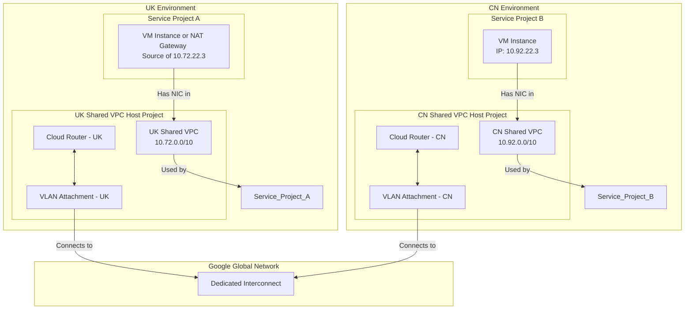

# Cross-Project Shared VPC Log Analysis and Interconnect Concepts

This document provides a comprehensive guide to understanding and tracing network traffic across different GCP projects using Shared VPCs connected via Cloud Interconnect. We will address the challenge of identifying a specific resource (like a VM instance) from its IP address in a complex, multi-project environment.

## 1. Core Concepts

To effectively trace the traffic, it's essential to understand the relationship between these key GCP networking components.

| Component | Description |
| :--- | :--- |
| **Shared VPC** | A centralized networking model where a **Host Project** owns and manages network resources (VPCs, subnets, firewalls), and **Service Projects** can use those resources to create their own instances (VMs, GKE clusters, etc.). This allows for consistent network policy enforcement. |
| **Cloud Interconnect** | A service that provides a private, high-bandwidth, low-latency connection between your on-premises network or another cloud provider to your Google Cloud VPC network. In this case, it's used to connect two separate GCP VPCs. |
| **VLAN Attachment** | A logical (VLAN) connection that runs over a Cloud Interconnect. It links your Interconnect to a Cloud Router in a specific region, allowing traffic from that VPC to traverse the private link. |
| **Cloud Router** | A fully managed GCP service that uses the Border Gateway Protocol (BGP) to exchange routes between your VPC network and a non-Google network (like another VPC via Interconnect). It dynamically learns and advertises IP address ranges. |

---

## 2. Architecture Diagram: UK and CN VPCs via Interconnect

Based on your scenario, here is a diagram illustrating how the UK and CN environments are connected.



---

## 3. Log Analysis and IP Tracing

You correctly identified that the IP `10.72.22.3` is not a simple VM IP based on your log file. The log snippet you found is the key to understanding the traffic flow.

### Analysis of Your Log Snippet

The log you provided was generated from the **destination's perspective** (the CN VPC). Here's what it means:

- **`"reporter": "DEST"` (Implied)**: This log entry was recorded by the destination resource's network interface.
- **`"src_gateway": { "type": "INTERCONNECT_ATTACHMENT", ... }`**: From the CN VPC's point of view, the traffic didn't come from another VM within its own network. It arrived through the Interconnect Attachment. This is why the gateway is listed as the source.
- **`"src_ip": "10.72.22.3"`**: This is the crucial piece of information. It is the source IP address as seen by the destination VPC.

This confirms the traffic is being routed from the UK VPC to the CN VPC via Interconnect. The next step is to take this source IP and find its origin in the UK VPC.

### Step-by-Step Tracing Process

Here is the revised procedure to find the true origin of the IP `10.72.22.3`.

#### Step 1: Go to the Source VPC Host Project

Navigate to the **UK Shared VPC Host Project** in the Google Cloud Console. All relevant source logs will be here.

#### Step 2: Query for the Source-Reported Flow Log

Go to the **Logs Explorer** and use the following precise query. The `reporter = "SRC"` filter is the most important part, as it will isolate the log entry generated by the actual source of the traffic.

```plaintext
log_id("vpc_flows")
jsonPayload.connection.src_ip = "10.72.22.3"
jsonPayload.reporter = "SRC"
```

#### Step 3: Interpret the Source Log Result

The query result will give you the definitive source of the traffic. You will typically see one of two outcomes:

**Outcome A: The source is a VM or GKE Pod**

The log entry will contain an `instance` or `gke_details` object, which directly identifies the resource.

```json
{
  "jsonPayload": {
    "instance": {
      "project_id": "gcp-project-a",  // <-- The Service Project ID!
      "vm_name": "instance-name-123", // <-- The VM Instance Name!
      "zone": "europe-west2-a"
    },
    "reporter": "SRC",
    ...
  }
}
```

**Outcome B: The source IP belongs to a Cloud NAT Gateway**

If the query in Step 2 returns no results, it is highly likely that the IP `10.72.22.3` is an IP address allocated to a **Cloud NAT gateway** in the UK VPC. This means the original source was a private IP that was translated (NAT'd) to `10.72.22.3`.

To trace it further, you would need to:
1.  Check the configuration of your Cloud NAT gateways in the UK Host Project to see if `10.72.22.3` is one of its allocated IPs.
2.  Enable and query **Cloud NAT logging** for that gateway to find the original, internal IP address that initiated the connection.