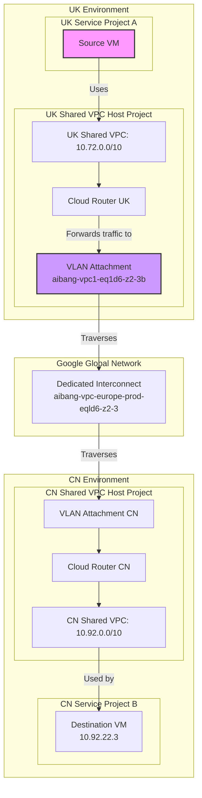

# Cross-Project VPC Log Analysis: A Gemini Synthesis

This guide provides a definitive analysis of your cross-VPC tracing problem. It synthesizes the insights from your problem description and the provided analysis documents into a clear, step-by-step strategy to identify the source of your traffic.

## 1. Problem Deconstruction

- **Scenario**: Traffic originates from the UK Shared VPC (`10.72.0.0/10`) and targets the CN Shared VPC (`10.92.0.0/10`).
- **Challenge**: Identify the specific resource associated with the source IP `10.72.22.3`.
- **Key Insight**: Your log snippet shows the traffic arriving at the destination via an `INTERCONNECT_ATTACHMENT`. This is the crucial clue.

---

## 2. Core Concepts & Architecture

First, let's visualize the architecture. Understanding this is key to knowing where to look for logs.

### Component Relationship

| Component | Role | Analogy |
| :--- | :--- | :--- |
| **Shared VPC** | A central network (Host Project) providing connectivity to other projects (Service Projects). | An apartment building's central plumbing and electrical systems. |
| **Interconnect** | The physical, high-bandwidth link between networks. | The main fiber optic cable connecting two cities. |
| **VLAN Attachment** | A logical channel running over the Interconnect, linking it to one VPC. | A specific, dedicated lane on the highway for your VPC's traffic. |
| **Cloud Router** | The BGP-speaking entity that exchanges routes and directs traffic onto the VLAN Attachment. | The on-ramp and off-ramp manager for the highway lane. |

### Architecture Diagram

This diagram illustrates how a request from a VM in a UK Service Project travels to the CN VPC.



---

## 3. The Definitive Tracing Strategy

Your analysis is correct: the log snippet you found is from the **destination** (the CN VPC). It tells you *how* the traffic arrived. Now, we use that information to find out *where* it truly came from in the UK VPC.

The most direct method is to **pivot to the source VPC's logs** and look for the original record of the traffic leaving its source.

### Step 1: Go to the Source Shared VPC Host Project

All relevant logs for outbound traffic are located in the host project that owns the network.

- **Action**: In the Google Cloud Console, navigate to the **UK Shared VPC Host Project** (`aibang-1231231-vpchost-eu-prod`).

### Step 2: Query for the *Source* Flow Log

This is the most critical step. We will query VPC Flow Logs for the record where the `reporter` is `SRC`. This log entry is generated by the network interface of the true source (e.g., the VM) and contains its identity.

- **Action**: Go to **Logs Explorer** and run the following query:

```sql
-- Find the true source of the traffic
log_id("vpc_flows")
AND jsonPayload.reporter = "SRC"
AND jsonPayload.connection.src_ip = "10.72.22.3"
```

### Step 3: Analyze the Result

The query will have one of two outcomes:

#### Outcome A (Most Likely): The IP Belongs to a VM or GKE Pod

The query will return a log entry containing an `instance` or `gke_details` object. This is your answer.

**Example Log Result:**
```json
{
  "jsonPayload": {
    "connection": {
      "src_ip": "10.72.22.3",
      "dest_ip": "10.92.22.3"
    },
    "instance": {
      "project_id": "service-project-a-id",  // <-- The Service Project!
      "vm_name": "the-source-vm-name",      // <-- The VM Name!
      "zone": "europe-west2-a"
    },
    "reporter": "SRC"
  }
}
```
This result proves that `10.72.22.3` is the IP of the VM named `the-source-vm-name` located in `service-project-a-id`.

#### Outcome B (Fallback): The IP is a Gateway or NAT IP

If the query returns **no results**, it confirms your suspicion that the IP is not a standard VM IP. It is likely an egress IP from another system, such as:
1.  **A Cloud NAT Gateway**: The original source had its IP translated to `10.72.22.3`.
2.  **A custom proxy/firewall VM**: A third-party appliance is routing traffic.

In this scenario, you would proceed to investigate those systems, starting with Cloud NAT.

---

## 4. Practical Commands for Verification

Here is a focused set of commands to execute the strategy above.

### Command 1: Check for a VM with the IP (Quick Test)

Run this against all relevant service projects. If it returns a result, you've found your source.

```bash
# Run this for each service project attached to the UK Shared VPC
gcloud compute instances list \
  --project=<SERVICE_PROJECT_ID> \
  --filter="networkInterfaces.networkIP:10.72.22.3" \
  --format="table(name, zone, networkInterfaces.networkIP)"
```

### Command 2: Verify the Interconnect Attachment IP

If the quick test fails, verify if the IP belongs to the Interconnect Attachment's BGP interface, as the other analyses suggested.

```bash
# Run this in the UK Shared VPC Host Project
gcloud compute interconnects attachments describe aibang-1231231-vpchost-eu-prod-vpc1-eq1d6-z2-3b \
    --region=europe-west2 \
    --project=aibang-1231231-vpchost-eu-prod \
    --format="json(name, cloudRouterIpAddress, customerRouterIpAddress)"
```
This will show you the BGP peer IPs. If `10.72.22.3` is listed here, it confirms the IP is part of the Interconnect infrastructure itself, and you should investigate NAT or custom routing setups.

### Command 3: Enable VPC Flow Logs (If Needed)

Ensure logs are being generated in the UK Host Project.

```bash
# Enable Flow Logs on the UK subnet
gcloud compute networks subnets update [SUBNET_NAME] \
    --project=aibang-1231231-vpchost-eu-prod \
    --region=europe-west2 \
    --enable-flow-logs \
    --logging-metadata=include-all
```

---

## 5. Conclusion and Best Practices

- **Start at the Destination, Pivot to the Source**: Use the destination logs (like the one you found) to get the `src_ip`, then pivot to the source VPC's logs and filter for `reporter = "SRC"` to find the origin.
- **Trust but Verify**: The `src_ip` in a flow log is almost always the original source IP. The `src_gateway` field provides additional context on the path taken.
- **Enable Logging**: Proactively enable VPC Flow Logs on all critical Shared VPC subnets. The overhead is minimal, and the diagnostic power is immense. For long-term analysis, sink the logs to BigQuery.
