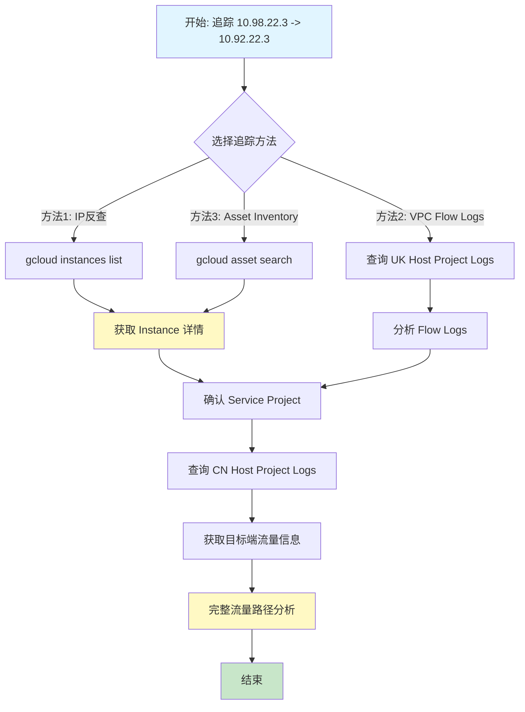

# Summary

```bash
我需要跨2个GCP Project Shared VPC里面抓日志

比如说我们称之为

UK Shared VPC IP Range 10.98.0.0/10

CN Shared VPC IP Range 10.92.0.0/10

比如A工程是UK的里面有Instance主机2块网卡。一个是private的网络，一个是Shared VPC UK的网络。这个工程里面有一个主机的 Shared VPC UK IP地址是10.98.22.3 它连接了或者说请求了另一个Share VPC CN工程里面的主机

比如10.92.22.3

UK VPC 下某个 A工程对应的是shared vpc UK 

CN VPC下某个 B 工程这个下面一个VM的Share VPC CN 这个网络下一个Instance IP 是10.92.22.3

我如何获取完整的日志情况。 


因为每个Shared VPC本身又是多个GCP project 共用的。 比如我们

所有使用UK shared vpc 这边的叫做UK ==> 下面有很多GCP Project 

所有使用CN shared vpc 这班的叫做CN ==> 下面也有很多GCP project

我应该是去Shared VPC所在的Project 去捕获日志。 

能否给我一些思路 或者快速实现，我的目的是快速定位到比如A工程里面的这个IP 10.98.22.3 对应的Instance主机。
```

# Claude

# GCP Shared VPC 跨项目日志追踪方案

## 问题分析

您需要追踪跨两个 Shared VPC 的流量日志：

- **源端**：UK Shared VPC (10.98.0.0/10) 中的 VM (10.98.22.3)
- **目标端**：CN Shared VPC (10.92.0.0/10) 中的 VM (10.92.22.3)
- **核心目标**：快速定位源 IP 10.98.22.3 对应的 Instance 及完整流量路径

## 解决方案

### 方案一：VPC Flow Logs（推荐用于流量分析）

#### 1. 启用 VPC Flow Logs

```bash
# 在 UK Shared VPC Host Project 中启用
gcloud compute networks subnets update SUBNET_NAME \
    --project=UK_HOST_PROJECT_ID \
    --region=REGION \
    --enable-flow-logs \
    --logging-flow-sampling=1.0 \
    --logging-aggregation-interval=interval-5-sec \
    --logging-metadata=include-all

# 在 CN Shared VPC Host Project 中启用
gcloud compute networks subnets update SUBNET_NAME \
    --project=CN_HOST_PROJECT_ID \
    --region=REGION \
    --enable-flow-logs \
    --logging-flow-sampling=1.0 \
    --logging-aggregation-interval=interval-5-sec \
    --logging-metadata=include-all
```

#### 2. 在 Cloud Logging 中查询日志

**在 UK Host Project 的 Logs Explorer 中查询：**

```sql
resource.type="gce_subnetwork"
logName="projects/UK_HOST_PROJECT_ID/logs/compute.googleapis.com%2Fvpc_flows"
jsonPayload.connection.src_ip="10.98.22.3"
jsonPayload.connection.dest_ip="10.92.22.3"
```

**快速定位 Instance：**

```sql
resource.type="gce_subnetwork"
logName="projects/UK_HOST_PROJECT_ID/logs/compute.googleapis.com%2Fvpc_flows"
jsonPayload.connection.src_ip="10.98.22.3"
```

关键字段：

- `jsonPayload.src_instance.vm_name` - VM 名称
- `jsonPayload.src_instance.project_id` - Service Project ID
- `jsonPayload.src_instance.zone` - Zone 信息

#### 3. 使用 gcloud 命令快速查询

```bash
# 查询最近 1 小时的流量日志
gcloud logging read "
resource.type=\"gce_subnetwork\"
logName=\"projects/UK_HOST_PROJECT_ID/logs/compute.googleapis.com%2Fvpc_flows\"
jsonPayload.connection.src_ip=\"10.98.22.3\"
jsonPayload.connection.dest_ip=\"10.92.22.3\"
timestamp>=\"$(date -u -d '1 hour ago' --iso-8601=seconds)\"
" \
--project=UK_HOST_PROJECT_ID \
--limit=50 \
--format=json
```

### 方案二：Firewall Logs（用于连接审计）

#### 1. 启用 Firewall Logging

```bash
# 为特定 Firewall Rule 启用日志
gcloud compute firewall-rules update RULE_NAME \
    --project=UK_HOST_PROJECT_ID \
    --enable-logging \
    --logging-metadata=include-all
```

#### 2. 查询 Firewall 日志

```sql
resource.type="gce_subnetwork"
logName="projects/UK_HOST_PROJECT_ID/logs/compute.googleapis.com%2Ffirewall"
jsonPayload.connection.src_ip="10.98.22.3"
jsonPayload.connection.dest_ip="10.92.22.3"
```

### 方案三：通过 IP 反查 Instance（最快速）

#### 1. 使用 gcloud 命令直接查询

```bash
# 在 UK Host Project 中查找使用该 IP 的所有 Instance
gcloud compute instances list \
    --project=UK_HOST_PROJECT_ID \
    --filter="networkInterfaces.networkIP=10.98.22.3 OR networkInterfaces.aliasIpRanges.ipCidrRange=10.98.22.3/32" \
    --format="table(name,zone,networkInterfaces[0].networkIP,networkInterfaces[1].networkIP,selfLink)"

# 如果跨多个 Service Project，需要逐个查询
for project in $(gcloud projects list --filter="parent.id=FOLDER_ID" --format="value(projectId)"); do
    echo "=== Checking Project: $project ==="
    gcloud compute instances list \
        --project=$project \
        --filter="networkInterfaces.networkIP=10.98.22.3" \
        --format="table(name,zone,networkInterfaces[].networkIP)" 2>/dev/null
done
```

#### 2. 使用 Asset Inventory API（推荐用于大规模环境）

```bash
# 搜索所有使用该 IP 的资源
gcloud asset search-all-resources \
    --scope=organizations/ORG_ID \
    --query="networkInterfaces.networkIP=10.98.22.3" \
    --asset-types=compute.googleapis.com/Instance \
    --format=json
```

## 完整流量追踪流程图



## 快速实现脚本

```bash
#!/bin/bash

# 配置参数
UK_HOST_PROJECT="uk-shared-vpc-host"
CN_HOST_PROJECT="cn-shared-vpc-host"
SOURCE_IP="10.98.22.3"
DEST_IP="10.92.22.3"
TIME_RANGE="1h"  # 1 hour ago

echo "=== Step 1: 快速定位源 Instance ==="
SOURCE_INSTANCE=$(gcloud compute instances list \
    --project=$UK_HOST_PROJECT \
    --filter="networkInterfaces.networkIP=$SOURCE_IP" \
    --format="value(name,zone,selfLink)" \
    --limit=1)

if [ -z "$SOURCE_INSTANCE" ]; then
    echo "未找到 IP $SOURCE_IP 对应的 Instance，尝试跨 Service Projects 搜索..."

    # 使用 Asset Inventory 搜索
    gcloud asset search-all-resources \
        --scope=projects/$UK_HOST_PROJECT \
        --query="networkInterfaces.networkIP=$SOURCE_IP" \
        --asset-types=compute.googleapis.com/Instance \
        --format="table(name,location,project)"
else
    echo "找到源 Instance: $SOURCE_INSTANCE"
fi

echo -e "\n=== Step 2: 查询 UK VPC Flow Logs ==="
gcloud logging read "
resource.type=\"gce_subnetwork\"
logName=\"projects/$UK_HOST_PROJECT/logs/compute.googleapis.com%2Fvpc_flows\"
jsonPayload.connection.src_ip=\"$SOURCE_IP\"
jsonPayload.connection.dest_ip=\"$DEST_IP\"
timestamp>=\"$(date -u -d "$TIME_RANGE ago" --iso-8601=seconds)\"
" \
--project=$UK_HOST_PROJECT \
--limit=10 \
--format="table(timestamp,jsonPayload.connection.src_ip,jsonPayload.connection.dest_ip,jsonPayload.bytes_sent,jsonPayload.reporter)"

echo -e "\n=== Step 3: 查询 CN VPC Flow Logs ==="
gcloud logging read "
resource.type=\"gce_subnetwork\"
logName=\"projects/$CN_HOST_PROJECT/logs/compute.googleapis.com%2Fvpc_flows\"
jsonPayload.connection.src_ip=\"$SOURCE_IP\"
jsonPayload.connection.dest_ip=\"$DEST_IP\"
timestamp>=\"$(date -u -d "$TIME_RANGE ago" --iso-8601=seconds)\"
" \
--project=$CN_HOST_PROJECT \
--limit=10 \
--format="table(timestamp,jsonPayload.connection.src_ip,jsonPayload.connection.dest_ip,jsonPayload.bytes_sent,jsonPayload.reporter)"

echo -e "\n=== Step 4: 查找目标 Instance ==="
gcloud compute instances list \
    --project=$CN_HOST_PROJECT \
    --filter="networkInterfaces.networkIP=$DEST_IP" \
    --format="table(name,zone,networkInterfaces[].networkIP,selfLink)"
```

## 高级查询技巧

### 1. Log Analytics SQL 查询（推荐用于复杂分析）

```sql
SELECT
  timestamp,
  jsonPayload.src_instance.vm_name AS source_vm,
  jsonPayload.src_instance.project_id AS source_project,
  jsonPayload.connection.src_ip AS source_ip,
  jsonPayload.connection.dest_ip AS dest_ip,
  jsonPayload.bytes_sent,
  jsonPayload.packets_sent,
  jsonPayload.reporter
FROM
  `UK_HOST_PROJECT.global._Default._AllLogs`
WHERE
  resource.type = 'gce_subnetwork'
  AND log_name = 'projects/UK_HOST_PROJECT/logs/compute.googleapis.com%2Fvpc_flows'
  AND jsonPayload.connection.src_ip = '10.98.22.3'
  AND jsonPayload.connection.dest_ip = '10.92.22.3'
  AND timestamp >= TIMESTAMP_SUB(CURRENT_TIMESTAMP(), INTERVAL 1 HOUR)
ORDER BY timestamp DESC
LIMIT 100
```

### 2. 创建 Log-based Metrics 实时监控

```bash
gcloud logging metrics create cross_vpc_traffic \
    --project=$UK_HOST_PROJECT \
    --description="Track traffic from UK to CN VPC" \
    --log-filter='
resource.type="gce_subnetwork"
logName="projects/UK_HOST_PROJECT/logs/compute.googleapis.com%2Fvpc_flows"
jsonPayload.connection.src_ip="10.98.22.3"
jsonPayload.connection.dest_ip="10.92.22.3"
'
```

## 注意事项

### 重要提醒

1. **Flow Logs 延迟**：VPC Flow Logs 有 5-10 秒的采集延迟，实时性要求高的场景需注意
2. **日志采样率**：生产环境建议设置 `--logging-flow-sampling=0.5`（50%）以降低成本
3. **日志保留期**：默认 30 天，可通过 Log Bucket 配置延长至 3650 天
4. **成本控制**：Flow Logs 按日志量计费，建议使用 Exclusion Filters 过滤无关日志

### 权限要求

```bash
# 查询 Flow Logs 需要的角色
roles/logging.viewer          # 查看日志
roles/compute.networkViewer   # 查看网络配置

# 启用 Flow Logs 需要的角色
roles/compute.networkAdmin    # 修改 Subnet 配置
```

### 性能优化建议

| 场景              | 推荐方案                        | 查询时间 |
| ----------------- | ------------------------------- | -------- |
| 快速定位 Instance | IP 反查 (gcloud instances list) | < 5 秒   |
| 实时流量分析      | VPC Flow Logs + Log Explorer    | < 30 秒  |
| 历史数据分析      | BigQuery Log Analytics          | 1-3 分钟 |
| 大规模环境        | Asset Inventory API             | 10-30 秒 |

## 最佳实践

1. **提前启用日志**：在问题发生前启用 VPC Flow Logs，避免事后无法追溯
2. **使用 Log Sinks**：将日志导出到 BigQuery 进行长期分析
3. **设置告警**：为关键流量路径创建 Log-based Alerts
4. **标记资源**：为 Instances 添加 Labels 方便快速过滤和识别

```bash
# 为 Instance 添加标签
gcloud compute instances add-labels INSTANCE_NAME \
    --project=SERVICE_PROJECT_ID \
    --zone=ZONE \
    --labels=env=prod,vpc=uk-shared,team=platform
```

# ChatGPT

非常好的问题，这是一个典型的 跨 Project + Shared VPC 环境下的日志溯源场景，在 GCP 大型组织架构里非常常见。我们来一步步拆解。

🧩 问题分析

你现在有两个 Shared VPC：

|      |                 |              |              |                      |
| ---- | --------------- | ------------ | ------------ | -------------------- |
| 区域 | Shared VPC 名称 | IP 段        | Host Project | Service Project 示例 |
| UK   | uk-shared-vpc   | 10.98.0.0/10 | uk-host-prj  | a-service-prj        |
| CN   | cn-shared-vpc   | 10.92.0.0/10 | cn-host-prj  | b-service-prj        |

你要追踪：

A 工程（a-service-prj）的 VM (10.98.22.3)

→ 访问 → B 工程（b-service-prj）的 VM (10.92.22.3)

目标：

1. 确定 10.98.22.3 属于哪个 VM（及其所在 Project）。
2. 查看跨 Shared VPC（UK → CN）通信的流量日志。

🧭 解决方案设计

这里有三种主要的方式可以实现「跨 Shared VPC 追踪日志 + 定位 IP 对应 VM」：

✅

方案 1：启用 VPC Flow Logs（推荐）

1️⃣ 确认 Flow Logs 启用位置

在 Shared VPC 架构中，Flow Logs 必须在 Host Project 的 Subnet 上启用：

gcloud compute networks subnets update <SUBNET_NAME> \

--region=<REGION> \

--enable-flow-logs

⚠️ Service Project 无法直接启用 Flow Logs，但 Host Project 可以收集所有共享子网的流量。

2️⃣ 日志位置

Flow Logs 会写入 Cloud Logging（Logging Explorer），日志名称：

projects/<HOST_PROJECT>/logs/compute.googleapis.com%2Fvpc_flows

3️⃣ 查询方式

在 Logging Explorer 里，你可以使用如下查询来查找 IP：

resource.type="gce_subnetwork"

logName:"compute.googleapis.com/vpc_flows"

(jsonPayload.connection.src_ip="10.98.22.3" OR jsonPayload.connection.dest_ip="10.98.22.3")

如果你要看跨 CN 的连接（UK → CN）：

(jsonPayload.connection.src_ip="10.98.22.3" AND jsonPayload.connection.dest_ip="10.92.22.3")

OR

(jsonPayload.connection.src_ip="10.92.22.3" AND jsonPayload.connection.dest_ip="10.98.22.3")

这能快速显示流量方向、端口、时间、字节数等。

✅

方案 2：使用 Cloud Logging + Cloud Asset Inventory 定位 VM

如果你只想知道 “10.98.22.3 属于哪个实例”：

1️⃣ 使用 Cloud Asset Inventory 查询

gcloud asset search-all-resources \

--scope="projects/<a-service-prj>" \

--query="networkInterfaces.ip='10.98.22.3'"

2️⃣ 或者使用 Compute API

gcloud compute instances list --filter="networkInterfaces.networkIP=10.98.22.3"

如果 IP 是外部的（或 alias IP），也可以这样查：

gcloud compute instances list --filter="networkInterfaces.accessConfigs.natIP=10.98.22.3"

这一步可以快速定位出 VM 名称、zone、project。

✅

方案 3：集中化日志聚合（长期建议）

在大型多 Project 架构中，建议：

- 在组织级别或 Folder 级别配置 Sink，把所有 Flow Logs 导入一个 Central Logging Project。
- 创建 BigQuery Sink，方便 SQL 分析跨 VPC 流量。

gcloud logging sinks create flowlog-bq-sink \

bigquery.googleapis.com/projects/<central-log-prj>/datasets/vpc_flow_logs \

--log-filter='logName:"compute.googleapis.com/vpc_flows"'

然后你就可以通过 SQL 查询方式快速筛选：

SELECT

timestamp,

jsonPayload.connection.src_ip,

jsonPayload.connection.dest_ip,

jsonPayload.connection.src_port,

jsonPayload.connection.dest_port,

jsonPayload.bytes_sent,

jsonPayload.bytes_received

FROM

`central-log-prj.vpc_flow_logs._AllLogs`

WHERE

jsonPayload.connection.src_ip="10.98.22.3"

OR jsonPayload.connection.dest_ip="10.98.22.3"

ORDER BY timestamp DESC

LIMIT 100;

🔍 流程图

graph TD

A[VM A (10.98.22.3)] -->|TCP 请求| B[VM B (10.92.22.3)]

subgraph UK Shared VPC

A --> U1[Flow Logs in uk-host-prj]

end

subgraph CN Shared VPC

B --> C1[Flow Logs in cn-host-prj]

end

U1 --> L[Central Logging / BigQuery Sink]

C1 --> L

L --> Q[查询分析 / IP 定位 / 流量溯源]

⚠️ 注意事项 & 最佳实践

|           |                                                                              |
| --------- | ---------------------------------------------------------------------------- |
| 事项      | 建议                                                                         |
| 权限      | 需要有 roles/logging.viewer 和 roles/compute.networkViewer                   |
| Flow Logs | 只能在 Host Project 层面启用，不在 Service Project                           |
| 保留期    | 默认 30 天，建议导入 BigQuery 做长期保存                                     |
| 网络类型  | Flow Logs 仅捕获 虚拟网络内流量，如果经过 Cloud NAT / LB，需启用对应组件日志 |
| 成本      | Flow Logs 会产生日志费用（按 volume），建议在低采样率（0.5 或 0.1）运行      |

🚀 快速定位命令组合示例

# 1️⃣ 定位 10.98.22.3 所属 VM

gcloud compute instances list --filter="networkInterfaces.networkIP=10.98.22.3"

# 2️⃣ 在 UK Shared VPC Host Project 查询 Flow Logs

gcloud logging read \

'logName="projects/uk-host-prj/logs/compute.googleapis.com%2Fvpc_flows" AND "10.98.22.3"' \

--limit 10 --format json

# 3️⃣ 如果有中央日志项目：

bq query --nouse_legacy_sql '

SELECT \* FROM `central-log-prj.vpc_flow_logs._AllLogs`

WHERE jsonPayload.connection.src_ip="10.98.22.3"

LIMIT 20'

是否希望我帮你画出 「跨两个 Shared VPC 的流量捕获架构图」（包含 Host Project、Service Project、Flow Logs、Central Logging 的对应关系）？

这会更直观地展示日志流向与配置点。
