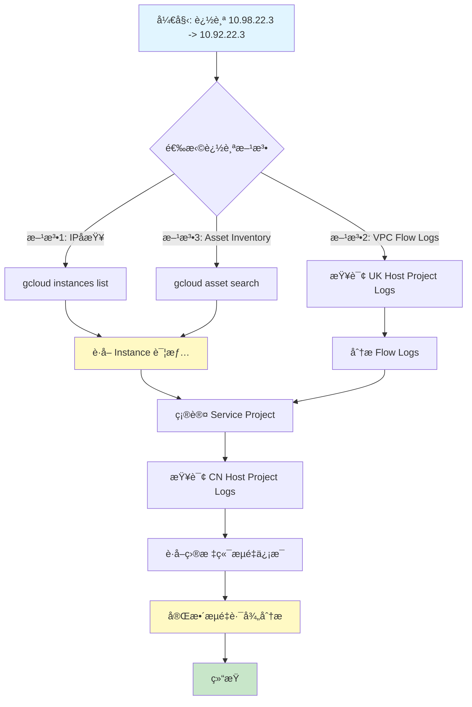

# Summary

```bash
我需è¦è·¨2个GCP Project Shared VPC里é¢æŠ“日志

比如说我们称之为

UK Shared VPC IP Range 10.98.0.0/10

CN Shared VPC IP Range 10.92.0.0/10

比如A工程是UK的里é¢æœ‰Instance主机2å—网å¡ã€‚一个是private的网络，一个是Shared VPC UK的网络。这个工程里é¢æœ‰ä¸€ä¸ªä¸»æœºçš„ Shared VPC UK IP地å€æ˜¯10.98.22.3 它è¿æ¥äº†æˆ–者说请求了å¦ä¸€ä¸ªShare VPC CN工程里é¢çš„主机

比如10.92.22.3

UK VPC 下æŸä¸ª A工程对应的是shared vpc UK 

CN VPC下æŸä¸ª B 工程这个下é¢ä¸€ä¸ªVMçš„Share VPC CN 这个网络下一个Instance IP 是10.92.22.3

我如何è·å–完整的日志情况。 


因为æ¯ä¸ªShared VPC本身åˆæ˜¯å¤šä¸ªGCP project 共用的。 比如我们

所有使用UK shared vpc 这边的å«åšUK ==> 下é¢æœ‰å¾ˆå¤šGCP Project 

所有使用CN shared vpc è¿™ç­çš„å«åšCN ==> 下é¢ä¹Ÿæœ‰å¾ˆå¤šGCP project

我应该是å»Shared VPC所在的Project å»æ•è·æ—¥å¿—。 

能å¦ç»™æˆ‘一些æ€è·¯Â æˆ–者快速å®ç°ï¼Œæˆ‘的目的是快速定ä½åˆ°æ¯”如A工程里é¢çš„这个IP 10.98.22.3 对应的Instance主机。
```

# Claude

# GCP Shared VPC 跨项目日志追踪方案

## 问题分æ

您需è¦è¿½è¸ªè·¨ä¸¤ä¸ª Shared VPC çš„æµé‡æ—¥å¿—：

- **æºç«¯**：UK Shared VPC (10.98.0.0/10) 中的 VM (10.98.22.3)
- **目标端**：CN Shared VPC (10.92.0.0/10) 中的 VM (10.92.22.3)
- **核心目标**：快速定ä½æº IP 10.98.22.3 对应的 Instance åŠå®Œæ•´æµé‡è·¯å¾„

## 解决方案

### 方案一：VPC Flow Logs（æ¨è用äºæµé‡åˆ†æ）

#### 1. å¯ç”¨ VPC Flow Logs

```bash
# 在 UK Shared VPC Host Project 中å¯ç”¨
gcloud compute networks subnets update SUBNET_NAME \
    --project=UK_HOST_PROJECT_ID \
    --region=REGION \
    --enable-flow-logs \
    --logging-flow-sampling=1.0 \
    --logging-aggregation-interval=interval-5-sec \
    --logging-metadata=include-all

# 在 CN Shared VPC Host Project 中å¯ç”¨
gcloud compute networks subnets update SUBNET_NAME \
    --project=CN_HOST_PROJECT_ID \
    --region=REGION \
    --enable-flow-logs \
    --logging-flow-sampling=1.0 \
    --logging-aggregation-interval=interval-5-sec \
    --logging-metadata=include-all
```

#### 2. 在 Cloud Logging 中查询日志

**在 UK Host Project 的 Logs Explorer 中查询：**

```sql
resource.type="gce_subnetwork"
logName="projects/UK_HOST_PROJECT_ID/logs/compute.googleapis.com%2Fvpc_flows"
jsonPayload.connection.src_ip="10.98.22.3"
jsonPayload.connection.dest_ip="10.92.22.3"
```

**å¿«é€Ÿå®šä½ Instance：**

```sql
resource.type="gce_subnetwork"
logName="projects/UK_HOST_PROJECT_ID/logs/compute.googleapis.com%2Fvpc_flows"
jsonPayload.connection.src_ip="10.98.22.3"
```

关键字段：

- `jsonPayload.src_instance.vm_name` - VM å称
- `jsonPayload.src_instance.project_id` - Service Project ID
- `jsonPayload.src_instance.zone` - Zone ä¿¡æ¯

#### 3. 使用 gcloud 命令快速查询

```bash
# 查询最近 1 å°æ—¶çš„æµé‡æ—¥å¿—
gcloud logging read "
resource.type=\"gce_subnetwork\"
logName=\"projects/UK_HOST_PROJECT_ID/logs/compute.googleapis.com%2Fvpc_flows\"
jsonPayload.connection.src_ip=\"10.98.22.3\"
jsonPayload.connection.dest_ip=\"10.92.22.3\"
timestamp>=\"$(date -u -d '1 hour ago' --iso-8601=seconds)\"
" \
--project=UK_HOST_PROJECT_ID \
--limit=50 \
--format=json
```

### 方案二：Firewall Logs（用äºè¿æ¥å®¡è®¡ï¼‰

#### 1. å¯ç”¨ Firewall Logging

```bash
# 为特定 Firewall Rule å¯ç”¨æ—¥å¿—
gcloud compute firewall-rules update RULE_NAME \
    --project=UK_HOST_PROJECT_ID \
    --enable-logging \
    --logging-metadata=include-all
```

#### 2. 查询 Firewall 日志

```sql
resource.type="gce_subnetwork"
logName="projects/UK_HOST_PROJECT_ID/logs/compute.googleapis.com%2Ffirewall"
jsonPayload.connection.src_ip="10.98.22.3"
jsonPayload.connection.dest_ip="10.92.22.3"
```

### 方案三：通过 IP å查 Instance（最快速）

#### 1. 使用 gcloud 命令直æ¥æŸ¥è¯¢

```bash
# 在 UK Host Project 中查找使用该 IP 的所有 Instance
gcloud compute instances list \
    --project=UK_HOST_PROJECT_ID \
    --filter="networkInterfaces.networkIP=10.98.22.3 OR networkInterfaces.aliasIpRanges.ipCidrRange=10.98.22.3/32" \
    --format="table(name,zone,networkInterfaces[0].networkIP,networkInterfaces[1].networkIP,selfLink)"

# 如æœè·¨å¤šä¸ª Service Project，需è¦é€ä¸ªæŸ¥è¯¢
for project in $(gcloud projects list --filter="parent.id=FOLDER_ID" --format="value(projectId)"); do
    echo "=== Checking Project: $project ==="
    gcloud compute instances list \
        --project=$project \
        --filter="networkInterfaces.networkIP=10.98.22.3" \
        --format="table(name,zone,networkInterfaces[].networkIP)" 2>/dev/null
done
```

#### 2. 使用 Asset Inventory API（æ¨è用äºå¤§è§„模ç¯å¢ƒï¼‰

```bash
# æœç´¢æ‰€æœ‰ä½¿ç”¨è¯¥ IP 的资æº
gcloud asset search-all-resources \
    --scope=organizations/ORG_ID \
    --query="networkInterfaces.networkIP=10.98.22.3" \
    --asset-types=compute.googleapis.com/Instance \
    --format=json
```

## 完整æµé‡è¿½è¸ªæµç¨‹å›¾



## 快速å®ç°è„šæœ¬

```bash
#!/bin/bash

# é…ç½®å‚æ•°
UK_HOST_PROJECT="uk-shared-vpc-host"
CN_HOST_PROJECT="cn-shared-vpc-host"
SOURCE_IP="10.98.22.3"
DEST_IP="10.92.22.3"
TIME_RANGE="1h"  # 1 hour ago

echo "=== Step 1: 快速定ä½æº Instance ==="
SOURCE_INSTANCE=$(gcloud compute instances list \
    --project=$UK_HOST_PROJECT \
    --filter="networkInterfaces.networkIP=$SOURCE_IP" \
    --format="value(name,zone,selfLink)" \
    --limit=1)

if [ -z "$SOURCE_INSTANCE" ]; then
    echo "未找到 IP $SOURCE_IP 对应的 Instance，å°è¯•è·¨ Service Projects æœç´¢..."

    # 使用 Asset Inventory æœç´¢
    gcloud asset search-all-resources \
        --scope=projects/$UK_HOST_PROJECT \
        --query="networkInterfaces.networkIP=$SOURCE_IP" \
        --asset-types=compute.googleapis.com/Instance \
        --format="table(name,location,project)"
else
    echo "æ‰¾åˆ°æº Instance: $SOURCE_INSTANCE"
fi

echo -e "\n=== Step 2: 查询 UK VPC Flow Logs ==="
gcloud logging read "
resource.type=\"gce_subnetwork\"
logName=\"projects/$UK_HOST_PROJECT/logs/compute.googleapis.com%2Fvpc_flows\"
jsonPayload.connection.src_ip=\"$SOURCE_IP\"
jsonPayload.connection.dest_ip=\"$DEST_IP\"
timestamp>=\"$(date -u -d "$TIME_RANGE ago" --iso-8601=seconds)\"
" \
--project=$UK_HOST_PROJECT \
--limit=10 \
--format="table(timestamp,jsonPayload.connection.src_ip,jsonPayload.connection.dest_ip,jsonPayload.bytes_sent,jsonPayload.reporter)"

echo -e "\n=== Step 3: 查询 CN VPC Flow Logs ==="
gcloud logging read "
resource.type=\"gce_subnetwork\"
logName=\"projects/$CN_HOST_PROJECT/logs/compute.googleapis.com%2Fvpc_flows\"
jsonPayload.connection.src_ip=\"$SOURCE_IP\"
jsonPayload.connection.dest_ip=\"$DEST_IP\"
timestamp>=\"$(date -u -d "$TIME_RANGE ago" --iso-8601=seconds)\"
" \
--project=$CN_HOST_PROJECT \
--limit=10 \
--format="table(timestamp,jsonPayload.connection.src_ip,jsonPayload.connection.dest_ip,jsonPayload.bytes_sent,jsonPayload.reporter)"

echo -e "\n=== Step 4: 查找目标 Instance ==="
gcloud compute instances list \
    --project=$CN_HOST_PROJECT \
    --filter="networkInterfaces.networkIP=$DEST_IP" \
    --format="table(name,zone,networkInterfaces[].networkIP,selfLink)"
```

## 高级查询技巧

### 1. Log Analytics SQL 查询（æ¨è用äºå¤æ‚分æ）

```sql
SELECT
  timestamp,
  jsonPayload.src_instance.vm_name AS source_vm,
  jsonPayload.src_instance.project_id AS source_project,
  jsonPayload.connection.src_ip AS source_ip,
  jsonPayload.connection.dest_ip AS dest_ip,
  jsonPayload.bytes_sent,
  jsonPayload.packets_sent,
  jsonPayload.reporter
FROM
  `UK_HOST_PROJECT.global._Default._AllLogs`
WHERE
  resource.type = 'gce_subnetwork'
  AND log_name = 'projects/UK_HOST_PROJECT/logs/compute.googleapis.com%2Fvpc_flows'
  AND jsonPayload.connection.src_ip = '10.98.22.3'
  AND jsonPayload.connection.dest_ip = '10.92.22.3'
  AND timestamp >= TIMESTAMP_SUB(CURRENT_TIMESTAMP(), INTERVAL 1 HOUR)
ORDER BY timestamp DESC
LIMIT 100
```

### 2. 创建 Log-based Metrics å®æ—¶ç›‘æ§

```bash
gcloud logging metrics create cross_vpc_traffic \
    --project=$UK_HOST_PROJECT \
    --description="Track traffic from UK to CN VPC" \
    --log-filter='
resource.type="gce_subnetwork"
logName="projects/UK_HOST_PROJECT/logs/compute.googleapis.com%2Fvpc_flows"
jsonPayload.connection.src_ip="10.98.22.3"
jsonPayload.connection.dest_ip="10.92.22.3"
'
```

## 注æ„事项

### é‡è¦æ醒

1. **Flow Logs 延迟**：VPC Flow Logs 有 5-10 秒的采集延迟，å®æ—¶æ€§è¦æ±‚高的场景需注æ„
2. **日志采样ç‡**：生产ç¯å¢ƒå»ºè®®è®¾ç½® `--logging-flow-sampling=0.5`（50%）以é™ä½æˆæœ¬
3. **日志ä¿ç•™æœŸ**：默认 30 天，å¯é€šè¿‡ Log Bucket é…置延长至 3650 天
4. **æˆæœ¬æ§åˆ¶**：Flow Logs 按日志é‡è®¡è´¹ï¼Œå»ºè®®ä½¿ç”¨ Exclusion Filters 过滤无关日志

### æƒé™è¦æ±‚

```bash
# 查询 Flow Logs 需è¦çš„角色
roles/logging.viewer          # 查看日志
roles/compute.networkViewer   # 查看网络é…ç½®

# å¯ç”¨ Flow Logs 需è¦çš„角色
roles/compute.networkAdmin    # 修改 Subnet é…ç½®
```

### 性能优化建议

| 场景              | æ¨è方案                        | 查询时间 |
| ----------------- | ------------------------------- | -------- |
| å¿«é€Ÿå®šä½ Instance | IP å查 (gcloud instances list) | < 5 秒   |
| å®æ—¶æµé‡åˆ†æ      | VPC Flow Logs + Log Explorer    | < 30 秒  |
| å†å²æ•°æ®åˆ†æ      | BigQuery Log Analytics          | 1-3 分钟 |
| 大规模ç¯å¢ƒ        | Asset Inventory API             | 10-30 秒 |

## 最佳å®è·µ

1. **æå‰å¯ç”¨æ—¥å¿—**：在问题å‘生å‰å¯ç”¨ VPC Flow Logs，é¿å…事å无法追溯
2. **使用 Log Sinks**：将日志导出到 BigQuery 进行长期分æ
3. **设置告警**：为关键æµé‡è·¯å¾„创建 Log-based Alerts
4. **标记资æº**：为 Instances 添加 Labels 方便快速过滤和识别

```bash
# 为 Instance 添加标签
gcloud compute instances add-labels INSTANCE_NAME \
    --project=SERVICE_PROJECT_ID \
    --zone=ZONE \
    --labels=env=prod,vpc=uk-shared,team=platform
```

# ChatGPT

é常好的问题，这是一个典å‹çš„ è·¨ Project + Shared VPC ç¯å¢ƒä¸‹çš„日志溯æºåœºæ™¯ï¼Œåœ¨ GCP 大å‹ç»„织æ¶æ„里é常常è§ã€‚我们æ¥ä¸€æ­¥æ­¥æ‹†è§£ã€‚

🧩 问题分æ

ä½ ç°åœ¨æœ‰ä¸¤ä¸ª Shared VPC：

|      |                 |              |              |                      |
| ---- | --------------- | ------------ | ------------ | -------------------- |
| 区域 | Shared VPC å称 | IP 段        | Host Project | Service Project 示例 |
| UK   | uk-shared-vpc   | 10.98.0.0/10 | uk-host-prj  | a-service-prj        |
| CN   | cn-shared-vpc   | 10.92.0.0/10 | cn-host-prj  | b-service-prj        |

ä½ è¦è¿½è¸ªï¼š

A 工程（a-service-prj）的 VM (10.98.22.3)

→ 访问 → B 工程（b-service-prj）的 VM (10.92.22.3)

目标：

1. 确定 10.98.22.3 å±äºå“ªä¸ª VM（åŠå…¶æ‰€åœ¨ Project）。
2. 查看跨 Shared VPC（UK → CN）通信的æµé‡æ—¥å¿—。

🧭 解决方案设计

这里有三ç§ä¸»è¦çš„æ–¹å¼å¯ä»¥å®ç°ã€Œè·¨ Shared VPC 追踪日志 + å®šä½ IP 对应 VMã€ï¼š

✅

方案 1：å¯ç”¨ VPC Flow Logs（æ¨è）

1ï¸âƒ£ 确认 Flow Logs å¯ç”¨ä½ç½®

在 Shared VPC æ¶æ„中，Flow Logs 必须在 Host Project çš„ Subnet 上å¯ç”¨ï¼š

gcloud compute networks subnets update <SUBNET_NAME> \

--region=<REGION> \

--enable-flow-logs

âš ï¸ Service Project 无法直æ¥å¯ç”¨ Flow Logs，但 Host Project å¯ä»¥æ”¶é›†æ‰€æœ‰å…±äº«å­ç½‘çš„æµé‡ã€‚

2ï¸âƒ£ 日志ä½ç½®

Flow Logs 会写入 Cloud Logging（Logging Explorer），日志å称：

projects/<HOST_PROJECT>/logs/compute.googleapis.com%2Fvpc_flows

3ï¸âƒ£ 查询方å¼

在 Logging Explorer 里，你å¯ä»¥ä½¿ç”¨å¦‚下查询æ¥æŸ¥æ‰¾ IP：

resource.type="gce_subnetwork"

logName:"compute.googleapis.com/vpc_flows"

(jsonPayload.connection.src_ip="10.98.22.3" OR jsonPayload.connection.dest_ip="10.98.22.3")

如æœä½ è¦çœ‹è·¨ CN çš„è¿æ¥ï¼ˆUK → CN）：

(jsonPayload.connection.src_ip="10.98.22.3" AND jsonPayload.connection.dest_ip="10.92.22.3")

OR

(jsonPayload.connection.src_ip="10.92.22.3" AND jsonPayload.connection.dest_ip="10.98.22.3")

这能快速显示æµé‡æ–¹å‘ã€ç«¯å£ã€æ—¶é—´ã€å­—节数等。

✅

方案 2：使用 Cloud Logging + Cloud Asset Inventory å®šä½ VM

如æœä½ åªæƒ³çŸ¥é“ “10.98.22.3 å±äºå“ªä¸ªå®ä¾‹â€ï¼š

1ï¸âƒ£ 使用 Cloud Asset Inventory 查询

gcloud asset search-all-resources \

--scope="projects/<a-service-prj>" \

--query="networkInterfaces.ip='10.98.22.3'"

2ï¸âƒ£ 或者使用 Compute API

gcloud compute instances list --filter="networkInterfaces.networkIP=10.98.22.3"

å¦‚æœ IP 是外部的（或 alias IP），也å¯ä»¥è¿™æ ·æŸ¥ï¼š

gcloud compute instances list --filter="networkInterfaces.accessConfigs.natIP=10.98.22.3"

这一步å¯ä»¥å¿«é€Ÿå®šä½å‡º VM å称ã€zoneã€project。

✅

方案 3：集中化日志èšåˆï¼ˆé•¿æœŸå»ºè®®ï¼‰

在大å‹å¤š Project æ¶æ„中，建议：

- 在组织级别或 Folder 级别é…ç½® Sink，把所有 Flow Logs 导入一个 Central Logging Project。
- 创建 BigQuery Sink，方便 SQL 分æè·¨ VPC æµé‡ã€‚

gcloud logging sinks create flowlog-bq-sink \

bigquery.googleapis.com/projects/<central-log-prj>/datasets/vpc_flow_logs \

--log-filter='logName:"compute.googleapis.com/vpc_flows"'

然åä½ å°±å¯ä»¥é€šè¿‡ SQL 查询方å¼å¿«é€Ÿç­›é€‰ï¼š

SELECT

timestamp,

jsonPayload.connection.src_ip,

jsonPayload.connection.dest_ip,

jsonPayload.connection.src_port,

jsonPayload.connection.dest_port,

jsonPayload.bytes_sent,

jsonPayload.bytes_received

FROM

`central-log-prj.vpc_flow_logs._AllLogs`

WHERE

jsonPayload.connection.src_ip="10.98.22.3"

OR jsonPayload.connection.dest_ip="10.98.22.3"

ORDER BY timestamp DESC

LIMIT 100;

🔠æµç¨‹å›¾

graph TD

A[VM A (10.98.22.3)] -->|TCP 请求| B[VM B (10.92.22.3)]

subgraph UK Shared VPC

A --> U1[Flow Logs in uk-host-prj]

end

subgraph CN Shared VPC

B --> C1[Flow Logs in cn-host-prj]

end

U1 --> L[Central Logging / BigQuery Sink]

C1 --> L

L --> Q[查询分æ / IP å®šä½ / æµé‡æº¯æº]

âš ï¸ æ³¨æ„事项 & 最佳å®è·µ

|           |                                                                              |
| --------- | ---------------------------------------------------------------------------- |
| 事项      | 建议                                                                         |
| æƒé™      | 需è¦æœ‰ roles/logging.viewer å’Œ roles/compute.networkViewer                   |
| Flow Logs | åªèƒ½åœ¨ Host Project 层é¢å¯ç”¨ï¼Œä¸åœ¨ Service Project                           |
| ä¿ç•™æœŸ    | 默认 30 天，建议导入 BigQuery åšé•¿æœŸä¿å­˜                                     |
| ç½‘ç»œç±»å‹  | Flow Logs ä»…æ•è· 虚拟网络内æµé‡ï¼Œå¦‚æœç»è¿‡ Cloud NAT / LB，需å¯ç”¨å¯¹åº”组件日志 |
| æˆæœ¬      | Flow Logs 会产生日志费用（按 volume），建议在ä½é‡‡æ ·ç‡ï¼ˆ0.5 或 0.1）è¿è¡Œ      |

🚀 快速定ä½å‘½ä»¤ç»„åˆç¤ºä¾‹

# 1ï¸âƒ£ å®šä½ 10.98.22.3 æ‰€å± VM

gcloud compute instances list --filter="networkInterfaces.networkIP=10.98.22.3"

# 2ï¸âƒ£ 在 UK Shared VPC Host Project 查询 Flow Logs

gcloud logging read \

'logName="projects/uk-host-prj/logs/compute.googleapis.com%2Fvpc_flows" AND "10.98.22.3"' \

--limit 10 --format json

# 3ï¸âƒ£ 如æœæœ‰ä¸­å¤®æ—¥å¿—项目：

bq query --nouse_legacy_sql '

SELECT \* FROM `central-log-prj.vpc_flow_logs._AllLogs`

WHERE jsonPayload.connection.src_ip="10.98.22.3"

LIMIT 20'

是å¦å¸Œæœ›æˆ‘帮你画出 「跨两个 Shared VPC çš„æµé‡æ•è·æ¶æ„图ã€ï¼ˆåŒ…å« Host Projectã€Service Projectã€Flow Logsã€Central Logging 的对应关系）？

这会更直观地展示日志æµå‘ä¸é…置点。
