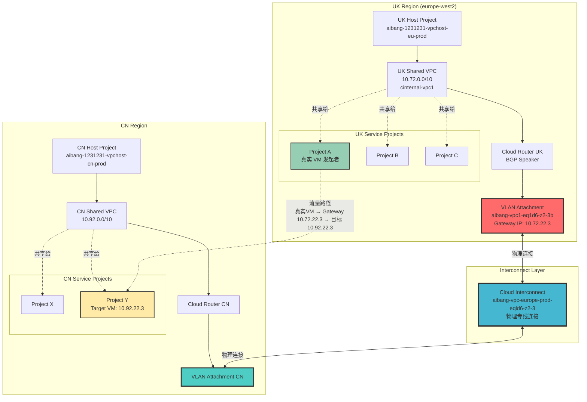
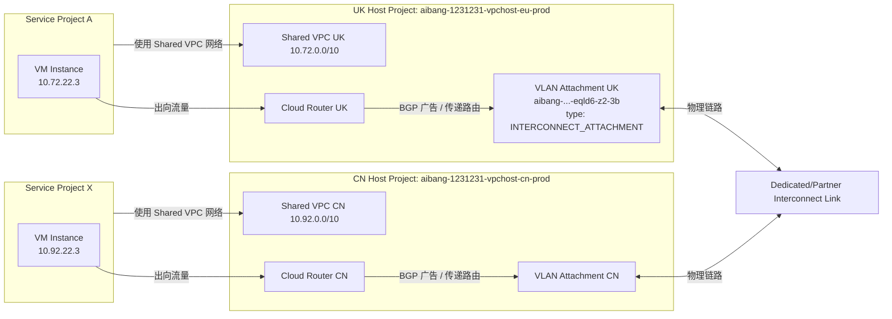

- [summary](#summary)
    - [2. 组件层级关系](#2-组件层级关系)

# summary 
- describe 


```
UK Region (Host Project)
├── Shared VPC UK (10.72.0.0/10)
│   ├── Project A (Service Project)
│   │   └── VM Instance (10.72.22.3) OR it's src_gateway
│   ├── Project B (Service Project)
│   └── Project C (Service Project)
└── Interconnect Attachment

CN Region (Host Project)
├── Shared VPC CN (10.92.0.0/10)
│   ├── Project X (Service Project)
│   │   └── VM Instance (10.92.22.3)
│   ├── Project Y (Service Project)
│   └── Project Z (Service Project)
└── Interconnect Attachment
```

- IP 10.72.22.3 出现在 src_gateway 字段中，这表明它是 Interconnect Attachment 的网关 IP，而不是 VM 实例的 IP
- 分析 Interconnect 流量日志 filter using `resource.type="gce_interconnect_attachment"`
- 分层的一些说明
  
| **组件**                                        | **说明**                                                          |
| --------------------------------------------- | --------------------------------------------------------------- |
| **Interconnect**                              | 实体物理链路（专线或Partner）连接 GCP 与本地数据中心                                |
| **VLAN Attachment (Interconnect Attachment)** | Interconnect 上的逻辑接口，每个 attachment 对应一个 Cloud Router             |
| **Cloud Router**                              | 控制层资源，负责通过 BGP 交换路由                                             |
| **Shared VPC Host Project**                   | 定义网络（VPC/Subnet）的宿主工程                                           |
| **Service Project**                           | 连接到 Shared VPC 的工程，VM 实际存在于这里，但使用 Host Project 的网络              |
| **VM Instance**                               | 最终分配 IP 的计算节点，可属于任意 Service Project，但 IP 属于 Shared VPC 的 subnet |


### 2. 组件层级关系

|层级|组件|作用|示例|
|---|---|---|---|
|**L1 物理层**|Interconnect|物理专线连接|`aibang-vpc-europe-prod-eqld6-z2-3`|
|**L2 链路层**|VLAN Attachment|虚拟链路，承载流量|`aibang-vpc1-eq1d6-z2-3b`|
|**L3 网络层**|Cloud Router|BGP 路由交换|动态学习/通告路由|
|**L4 网络层**|VPC|逻辑网络空间|`10.72.0.0/10`|

- flow 
- [flow](./vpc-claude.md#架构全景图)

- [flow-gpt](./cross-project-vpc-anaylize-ChatGPT.md#一跨工程-shared-vpc--interconnect-网络拓扑图)



