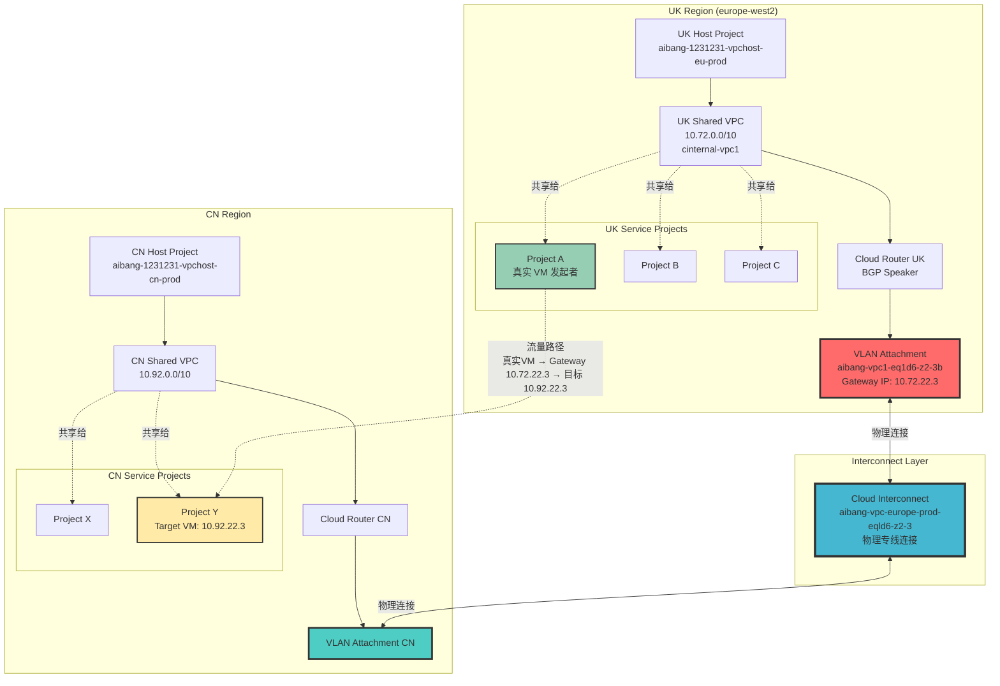

- [GCP Shared VPC 跨 Project 日志追踪完整解决方案](#gcp-shared-vpc-跨-project-日志追踪完整解决方案)
  - [🎯 问题核心分析](#-问题核心分析)
  - [架构全景图](#架构全景图)
  - [🔍 IP 追踪策略 (按优先级排序)](#-ip-追踪策略-按优先级排序)
    - [策略 1: Interconnect Gateway 分析 (最高优先级)](#策略-1-interconnect-gateway-分析-最高优先级)
      - [1.1 确认 Attachment 配置](#11-确认-attachment-配置)
      - [1.2 分析 BGP 路由状态](#12-分析-bgp-路由状态)
    - [策略 2: 反向追踪真实发起者](#策略-2-反向追踪真实发起者)
      - [2.1 查找原始 VM 流量](#21-查找原始-vm-流量)
      - [2.2 时间关联分析](#22-时间关联分析)
    - [策略 3: 跨 Project 完整链路追踪](#策略-3-跨-project-完整链路追踪)
      - [3.1 多 Project 日志聚合查询](#31-多-project-日志聚合查询)
  - [📊 BigQuery 高级分析](#-bigquery-高级分析)
    - [设置日志导出到 BigQuery](#设置日志导出到-bigquery)
    - [BigQuery 关联分析查询](#bigquery-关联分析查询)
  - [🛠️ 实用工具脚本](#️-实用工具脚本)
    - [完整的 IP 追踪工具](#完整的-ip-追踪工具)
  - [📋 快速诊断检查清单](#-快速诊断检查清单)
    - [阶段 1: 基础确认](#阶段-1-基础确认)
    - [阶段 2: 日志分析](#阶段-2-日志分析)
    - [阶段 3: 跨 VPC 验证](#阶段-3-跨-vpc-验证)
    - [阶段 4: 长期监控](#阶段-4-长期监控)
  - [🎯 总结](#-总结)

# GCP Shared VPC 跨 Project 日志追踪完整解决方案

## 🎯 问题核心分析

基于你的日志分析，关键发现是：

**IP `10.72.22.3` 不是 VM 实例 IP，而是 Interconnect Attachment 的 Cloud Router 接口 IP**

这个 IP 出现在日志的 `src_gateway.connection.src_ip` 字段中，表明它是 VPC 间通信的网关地址，而不是发起请求的真实 VM。

## 架构全景图



## 🔍 IP 追踪策略 (按优先级排序)

### 策略 1: Interconnect Gateway 分析 (最高优先级)

既然 `10.72.22.3` 是 Interconnect Attachment 的网关 IP，我们需要：

#### 1.1 确认 Attachment 配置

```bash
# 验证这个 IP 确实是 Attachment 的 Cloud Router IP
gcloud compute interconnects attachments describe \
    aibang-1231231-vpchost-eu-prod-vpc1-eq1d6-z2-3b \
    --region=europe-west2 \
    --project=aibang-1231231-vpchost-eu-prod \
    --format="json" | jq '{
        name: .name,
        cloudRouterIpAddress: .cloudRouterIpAddress,
        customerRouterIpAddress: .customerRouterIpAddress,
        operationalStatus: .operationalStatus,
        router: .router,
        interconnect: .interconnect
    }'
```

#### 1.2 分析 BGP 路由状态

```bash
# 获取 Cloud Router 名称并检查 BGP 状态
ROUTER_NAME=$(gcloud compute interconnects attachments describe \
    aibang-1231231-vpchost-eu-prod-vpc1-eq1d6-z2-3b \
    --region=europe-west2 \
    --project=aibang-1231231-vpchost-eu-prod \
    --format="value(router.basename())")

echo "检查 Cloud Router: $ROUTER_NAME"

# 查看 BGP 会话状态
gcloud compute routers get-status $ROUTER_NAME \
    --region=europe-west2 \
    --project=aibang-1231231-vpchost-eu-prod \
    --format="json" | jq '.result.bgpPeerStatus[] | {
        name: .name,
        state: .state,
        ipAddress: .ipAddress,
        peerIpAddress: .peerIpAddress,
        advertisedRoutes: [.advertisedRoutes[].destRange]
    }'
```

### 策略 2: 反向追踪真实发起者

#### 2.1 查找原始 VM 流量

```bash
# 查询同一时间段内，目标为 10.100.17.167 的 VM 流量
# 这样可以找到真正发起请求的 VM
gcloud logging read '
resource.type="gce_subnetwork"
AND resource.labels.subnetwork_name="cinternal-vpc1-europe-west2"
AND jsonPayload.connection.dest_ip="10.100.17.167"
AND jsonPayload.src_instance.vm_name!=""
AND timestamp>="2025-10-09T00:00:00Z"
AND timestamp<="2025-10-09T23:59:59Z"
' \
--project=aibang-1231231-vpchost-eu-prod \
--limit=100 \
--format="table(
    timestamp,
    jsonPayload.src_instance.vm_name:label=SOURCE_VM,
    jsonPayload.src_instance.project_id:label=SOURCE_PROJECT,
    jsonPayload.connection.src_ip:label=VM_IP,
    jsonPayload.connection.dest_ip:label=DEST_IP,
    jsonPayload.connection.src_port:label=SRC_PORT
)"
```

#### 2.2 时间关联分析

```bash
# 创建时间关联分析脚本
cat > analyze_traffic_correlation.sh << 'EOF'
#!/bin/bash

GATEWAY_IP="10.72.22.3"
DEST_IP="10.100.17.167"
PROJECT="aibang-1231231-vpchost-eu-prod"
TIME_START="2025-10-09T00:00:00Z"
TIME_END="2025-10-09T23:59:59Z"

echo "=== 分析 Gateway 流量和 VM 流量的时间关联 ==="

# 1. 查询 Gateway 流量时间点
echo "1. Gateway 流量时间点:"
gcloud logging read "
resource.type=\"gce_subnetwork\"
AND jsonPayload.src_gateway.connection.src_ip=\"$GATEWAY_IP\"
AND jsonPayload.connection.dest_ip=\"$DEST_IP\"
AND timestamp>=\"$TIME_START\"
AND timestamp<=\"$TIME_END\"
" \
--project=$PROJECT \
--format="csv(timestamp,jsonPayload.connection.src_port)" \
--limit=50 > gateway_traffic.csv

# 2. 查询同时间段的 VM 流量
echo "2. VM 流量 (同目标 IP):"
gcloud logging read "
resource.type=\"gce_subnetwork\"
AND jsonPayload.connection.dest_ip=\"$DEST_IP\"
AND jsonPayload.src_instance.vm_name!=\"\"
AND timestamp>=\"$TIME_START\"
AND timestamp<=\"$TIME_END\"
" \
--project=$PROJECT \
--format="csv(timestamp,jsonPayload.src_instance.vm_name,jsonPayload.connection.src_ip,jsonPayload.connection.src_port)" \
--limit=50 > vm_traffic.csv

echo "3. 分析结果已保存到:"
echo "   - gateway_traffic.csv (Gateway 流量)"
echo "   - vm_traffic.csv (VM 流量)"
echo ""
echo "请比较两个文件中的时间戳和端口号，找到匹配的流量"
EOF

chmod +x analyze_traffic_correlation.sh
./analyze_traffic_correlation.sh
```

### 策略 3: 跨 Project 完整链路追踪

#### 3.1 多 Project 日志聚合查询

```bash
# 创建跨 Project 查询脚本
cat > cross_project_trace.sh << 'EOF'
#!/bin/bash

UK_PROJECT="aibang-1231231-vpchost-eu-prod"
CN_PROJECT="aibang-1231231-vpchost-cn-prod"
GATEWAY_IP="10.72.22.3"
TARGET_IP="10.92.22.3"
INTERMEDIATE_IP="10.100.17.167"

echo "=== 跨 Project VPC 流量完整链路追踪 ==="

# 1. UK 侧：查找真实发起者
echo "1. UK 侧 - 查找真实 VM 发起者:"
gcloud logging read "
resource.type=\"gce_subnetwork\"
AND (jsonPayload.connection.dest_ip=\"$INTERMEDIATE_IP\" OR jsonPayload.connection.dest_ip=\"$TARGET_IP\")
AND jsonPayload.src_instance.vm_name!=\"\"
AND timestamp>=\"$(date -u -d '1 hour ago' +%Y-%m-%dT%H:%M:%SZ)\"
" \
--project=$UK_PROJECT \
--format="table(
    timestamp,
    jsonPayload.src_instance.vm_name:label=VM_NAME,
    jsonPayload.src_instance.project_id:label=PROJECT,
    jsonPayload.connection.src_ip:label=VM_IP,
    jsonPayload.connection.dest_ip:label=DEST_IP
)" \
--limit=20

echo ""
echo "2. UK 侧 - Gateway 转发流量:"
gcloud logging read "
resource.type=\"gce_subnetwork\"
AND jsonPayload.src_gateway.connection.src_ip=\"$GATEWAY_IP\"
AND timestamp>=\"$(date -u -d '1 hour ago' +%Y-%m-%dT%H:%M:%SZ)\"
" \
--project=$UK_PROJECT \
--format="table(
    timestamp,
    jsonPayload.src_gateway.name:label=GATEWAY_NAME,
    jsonPayload.connection.src_ip:label=GATEWAY_IP,
    jsonPayload.connection.dest_ip:label=DEST_IP
)" \
--limit=20

echo ""
echo "3. CN 侧 - 接收流量:"
gcloud logging read "
resource.type=\"gce_subnetwork\"
AND (jsonPayload.connection.src_ip=\"$GATEWAY_IP\" OR jsonPayload.connection.dest_ip=\"$TARGET_IP\")
AND timestamp>=\"$(date -u -d '1 hour ago' +%Y-%m-%dT%H:%M:%SZ)\"
" \
--project=$CN_PROJECT \
--format="table(
    timestamp,
    jsonPayload.connection.src_ip:label=SRC_IP,
    jsonPayload.connection.dest_ip:label=DEST_IP,
    jsonPayload.dest_instance.vm_name:label=TARGET_VM
)" \
--limit=20

EOF

chmod +x cross_project_trace.sh
```

## 📊 BigQuery 高级分析

### 设置日志导出到 BigQuery

```bash
# 1. 创建 BigQuery Dataset
bq --project=aibang-1231231-vpchost-eu-prod mk \
    --dataset \
    --location=europe-west2 \
    --description="VPC Flow Logs for cross-project analysis" \
    vpc_flow_analysis

# 2. 创建 UK 侧 Log Sink
gcloud logging sinks create uk-vpc-flow-sink \
    bigquery.googleapis.com/projects/aibang-1231231-vpchost-eu-prod/datasets/vpc_flow_analysis \
    --project=aibang-1231231-vpchost-eu-prod \
    --log-filter='
        resource.type="gce_subnetwork"
        AND resource.labels.subnetwork_name="cinternal-vpc1-europe-west2"
        AND jsonPayload.connection.src_ip!=""
    '

# 3. 创建 CN 侧 Log Sink (如果有权限)
gcloud logging sinks create cn-vpc-flow-sink \
    bigquery.googleapis.com/projects/aibang-1231231-vpchost-eu-prod/datasets/vpc_flow_analysis \
    --project=aibang-1231231-vpchost-cn-prod \
    --log-filter='
        resource.type="gce_subnetwork"
        AND jsonPayload.connection.src_ip!=""
    '
```

### BigQuery 关联分析查询

```sql
-- 查询 1: 找到通过特定 Gateway 的所有流量及其真实来源
WITH gateway_traffic AS (
  SELECT
    timestamp,
    jsonPayload.src_gateway.connection.src_ip as gateway_ip,
    jsonPayload.connection.dest_ip as dest_ip,
    jsonPayload.connection.src_port as gateway_port,
    jsonPayload.src_gateway.name as gateway_name
  FROM
    `aibang-1231231-vpchost-eu-prod.vpc_flow_analysis.compute_googleapis_com_vpc_flows_*`
  WHERE
    jsonPayload.src_gateway.connection.src_ip = '10.72.22.3'
    AND DATE(timestamp) = CURRENT_DATE()
),
vm_traffic AS (
  SELECT
    timestamp,
    jsonPayload.src_instance.vm_name as vm_name,
    jsonPayload.src_instance.project_id as vm_project,
    jsonPayload.connection.src_ip as vm_ip,
    jsonPayload.connection.dest_ip as dest_ip,
    jsonPayload.connection.src_port as vm_port
  FROM
    `aibang-1231231-vpchost-eu-prod.vpc_flow_analysis.compute_googleapis_com_vpc_flows_*`
  WHERE
    jsonPayload.src_instance.vm_name IS NOT NULL
    AND DATE(timestamp) = CURRENT_DATE()
)
SELECT
  g.timestamp as gateway_time,
  v.timestamp as vm_time,
  TIMESTAMP_DIFF(g.timestamp, v.timestamp, SECOND) as time_diff_seconds,
  v.vm_name,
  v.vm_project,
  v.vm_ip,
  g.gateway_ip,
  g.dest_ip,
  v.vm_port,
  g.gateway_port,
  g.gateway_name
FROM gateway_traffic g
JOIN vm_traffic v ON (
  g.dest_ip = v.dest_ip
  AND ABS(TIMESTAMP_DIFF(g.timestamp, v.timestamp, SECOND)) <= 5  -- 5秒内的关联
  AND g.gateway_port = v.vm_port  -- 端口匹配
)
ORDER BY g.timestamp DESC
LIMIT 100;
```

```sql
-- 查询 2: 分析跨 VPC 流量模式
SELECT
  DATE(timestamp) as date,
  EXTRACT(HOUR FROM timestamp) as hour,
  jsonPayload.src_gateway.name as gateway_name,
  jsonPayload.connection.dest_ip as dest_ip,
  COUNT(*) as connection_count,
  COUNT(DISTINCT jsonPayload.connection.src_port) as unique_ports,
  AVG(jsonPayload.bytes_sent) as avg_bytes_sent
FROM
  `aibang-1231231-vpchost-eu-prod.vpc_flow_analysis.compute_googleapis_com_vpc_flows_*`
WHERE
  jsonPayload.src_gateway.type = 'INTERCONNECT_ATTACHMENT'
  AND DATE(timestamp) >= DATE_SUB(CURRENT_DATE(), INTERVAL 7 DAY)
GROUP BY 1, 2, 3, 4
ORDER BY 1 DESC, 2 DESC, 5 DESC;
```

## 🛠️ 实用工具脚本

### 完整的 IP 追踪工具

```bash
cat > vpc_ip_tracer.sh << 'EOF'
#!/bin/bash

# VPC IP 追踪工具
# 用法: ./vpc_ip_tracer.sh <IP_ADDRESS> [TIME_RANGE_HOURS]

IP_ADDRESS=${1:-"10.72.22.3"}
TIME_RANGE=${2:-1}
UK_PROJECT="aibang-1231231-vpchost-eu-prod"
CN_PROJECT="aibang-1231231-vpchost-cn-prod"

echo "🔍 VPC IP 追踪工具"
echo "目标 IP: $IP_ADDRESS"
echo "时间范围: 最近 $TIME_RANGE 小时"
echo "========================================"

# 1. 判断 IP 类型
echo "1. 🔎 判断 IP 类型..."

# 检查是否为 VM IP
VM_RESULT=$(gcloud compute instances list \
    --filter="networkInterfaces.networkIP:$IP_ADDRESS" \
    --format="csv(name,zone,networkInterfaces[0].networkIP)" \
    --quiet 2>/dev/null)

if [ ! -z "$VM_RESULT" ] && [ "$VM_RESULT" != "name,zone,networkInterfaces[0].networkIP" ]; then
    echo "✅ 这是一个 VM 实例 IP"
    echo "$VM_RESULT"
    exit 0
fi

# 检查是否为 Interconnect Attachment IP
ATTACHMENT_RESULT=$(gcloud compute interconnects attachments list \
    --project=$UK_PROJECT \
    --filter="cloudRouterIpAddress:$IP_ADDRESS OR customerRouterIpAddress:$IP_ADDRESS" \
    --format="csv(name,region,cloudRouterIpAddress,customerRouterIpAddress)" \
    --quiet 2>/dev/null)

if [ ! -z "$ATTACHMENT_RESULT" ] && [ "$ATTACHMENT_RESULT" != "name,region,cloudRouterIpAddress,customerRouterIpAddress" ]; then
    echo "✅ 这是一个 Interconnect Attachment Gateway IP"
    echo "$ATTACHMENT_RESULT"
    
    # 2. 分析 Gateway 流量
    echo ""
    echo "2. 📊 分析 Gateway 流量..."
    
    gcloud logging read "
    resource.type=\"gce_subnetwork\"
    AND jsonPayload.src_gateway.connection.src_ip=\"$IP_ADDRESS\"
    AND timestamp>=\"$(date -u -d "$TIME_RANGE hours ago" +%Y-%m-%dT%H:%M:%SZ)\"
    " \
    --project=$UK_PROJECT \
    --format="table(
        timestamp:label=TIME,
        jsonPayload.src_gateway.name:label=GATEWAY,
        jsonPayload.connection.dest_ip:label=DEST_IP,
        jsonPayload.connection.src_port:label=PORT
    )" \
    --limit=20
    
    # 3. 查找关联的 VM 流量
    echo ""
    echo "3. 🔗 查找关联的 VM 流量..."
    
    # 获取最近的目标 IP
    RECENT_DEST=$(gcloud logging read "
    resource.type=\"gce_subnetwork\"
    AND jsonPayload.src_gateway.connection.src_ip=\"$IP_ADDRESS\"
    AND timestamp>=\"$(date -u -d "$TIME_RANGE hours ago" +%Y-%m-%dT%H:%M:%SZ)\"
    " \
    --project=$UK_PROJECT \
    --format="value(jsonPayload.connection.dest_ip)" \
    --limit=1)
    
    if [ ! -z "$RECENT_DEST" ]; then
        echo "最近的目标 IP: $RECENT_DEST"
        echo "查找发往此目标的 VM 流量:"
        
        gcloud logging read "
        resource.type=\"gce_subnetwork\"
        AND jsonPayload.connection.dest_ip=\"$RECENT_DEST\"
        AND jsonPayload.src_instance.vm_name!=\"\"
        AND timestamp>=\"$(date -u -d "$TIME_RANGE hours ago" +%Y-%m-%dT%H:%M:%SZ)\"
        " \
        --project=$UK_PROJECT \
        --format="table(
            timestamp:label=TIME,
            jsonPayload.src_instance.vm_name:label=SOURCE_VM,
            jsonPayload.src_instance.project_id:label=PROJECT,
            jsonPayload.connection.src_ip:label=VM_IP,
            jsonPayload.connection.src_port:label=PORT
        )" \
        --limit=10
    fi
    
else
    echo "❓ 未知 IP 类型，进行通用搜索..."
    
    # 通用搜索
    gcloud logging read "
    resource.type=\"gce_subnetwork\"
    AND (jsonPayload.connection.src_ip=\"$IP_ADDRESS\" OR jsonPayload.connection.dest_ip=\"$IP_ADDRESS\")
    AND timestamp>=\"$(date -u -d "$TIME_RANGE hours ago" +%Y-%m-%dT%H:%M:%SZ)\"
    " \
    --project=$UK_PROJECT \
    --format="table(
        timestamp,
        jsonPayload.connection.src_ip,
        jsonPayload.connection.dest_ip,
        jsonPayload.src_instance.vm_name,
        jsonPayload.src_gateway.name
    )" \
    --limit=20
fi

echo ""
echo "🎯 追踪完成！"
EOF

chmod +x vpc_ip_tracer.sh

# 使用示例
./vpc_ip_tracer.sh 10.72.22.3 2
```

## 📋 快速诊断检查清单

### 阶段 1: 基础确认
- [ ] 确认 IP `10.72.22.3` 是 Interconnect Attachment 的 Cloud Router IP
- [ ] 验证 Attachment `aibang-1231231-vpchost-eu-prod-vpc1-eq1d6-z2-3b` 状态为 `OS_ACTIVE`
- [ ] 检查关联的 Cloud Router BGP 会话状态为 `Established`

### 阶段 2: 日志分析
- [ ] 在 UK Host Project 中启用 VPC Flow Logs
- [ ] 查询包含 `src_gateway` 字段的日志记录
- [ ] 通过目标 IP 反向查找真实的 VM 发起者
- [ ] 验证时间戳和端口号的关联性

### 阶段 3: 跨 VPC 验证
- [ ] 检查 CN 侧是否有对应的接收日志
- [ ] 验证 Interconnect 物理连接状态
- [ ] 确认路由传播是否正常

### 阶段 4: 长期监控
- [ ] 设置 BigQuery 日志导出
- [ ] 创建自动化监控脚本
- [ ] 配置异常流量告警

## 🎯 总结

你的场景中，`10.72.22.3` 确实是 **Interconnect Attachment 的网关 IP**，而不是 VM IP。要找到真正的发起者，需要：

1. **通过目标 IP 反向追踪** - 查找发往同一目标的 VM 流量
2. **时间关联分析** - 匹配时间戳和端口号
3. **跨 Project 日志聚合** - 在 Shared VPC Host Project 中查看完整链路

使用上面提供的工具和脚本，你可以快速定位到真正发起请求的 VM 实例及其所在的 Service Project。