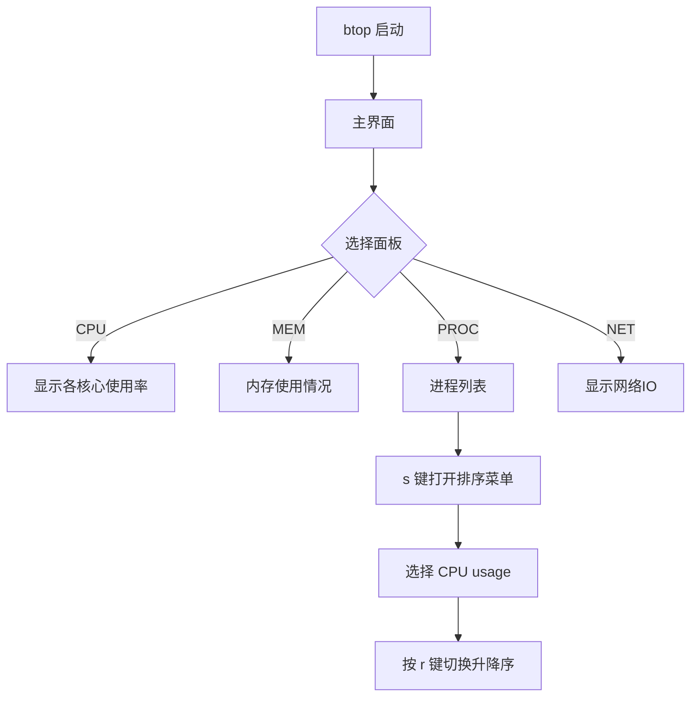

`btop` 是 macOS 上一个极其优秀的终端性能监控工具，比 `htop`、`top` 更直观。以下是它的**完整使用说明与CPU排序方法**。

---

## 🧭 一、启动与基本界面

在终端执行：

```bash
btop
```

会进入主界面，显示四个区域：

|区域|内容|
|---|---|
|CPU|每核使用率、频率、温度、平均负载|
|MEM|内存与Swap占用|
|PROC|进程列表，可排序/过滤|
|NET|网络流量、速率统计|

---

## ⚙️ 二、基本操作快捷键

|快捷键|功能|
|---|---|
|`←` / `→`|切换面板焦点（CPU、MEM、PROC、NET）|
|`↑` / `↓`|上下滚动进程列表|
|`Enter`|显示进程详细信息|
|`Space`|暂停/恢复实时刷新|
|`Esc`|返回上级界面|
|`q`|退出程序|
|`m`|切换内存显示模式（物理/虚拟）|
|`n`|显示网络统计|
|`p`|显示进程列表（默认）|
|`z`|切换压缩进程视图（按命令聚合）|
|`f`|进程过滤（输入关键字）|
|`s`|打开排序菜单 ✅|

---

## 🔍 三、CPU排序操作

1. **在主界面按 `→` 键移动到 Process 面板**  
    你会看到类似下图的进程表：
    
    ```
    PID   USER     CPU%   MEM%  TIME+     COMMAND
    1234  root     50.3   2.1   00:03.21  WindowServer
    ```
    
2. **按 `s` 打开排序菜单**  
    会弹出一个菜单，如：
    
    ```
    Sort processes by:
    [x] CPU usage
    [ ] Memory usage
    [ ] PID
    [ ] Time
    ```
    
3. **使用方向键选择 “CPU usage”**，然后按 `Enter` 确认。
    
    👉 此时进程表会自动按 CPU 使用率降序排列。
    
4. 如果想**升序/降序切换**，按：
    
    ```
    r
    ```
    
    （即 reverse order）
    

---

## 🎛 四、配置文件路径

配置文件在：

```
~/.config/btop/btop.conf
```

你可以手动修改默认排序方式：

```bash
# 将默认排序设为CPU
proc_sorting="cpu"
```

修改后保存，重新打开 btop 即可。

---

## 🧰 五、其他常用技巧

|功能|快捷键|
|---|---|
|搜索进程|`/` 输入名称|
|结束进程|`k`|
|强制杀死进程|`shift + k`|
|调整刷新率|`+` / `-`|
|打开设置菜单|`Esc` → `Options`|
|颜色主题切换|`Esc` → `Options` → `Theme`|
|保存当前配置|自动保存到 `~/.config/btop/btop.conf`|

---

## 📊 六、命令行参数示例

```bash
btop --utf-force        # 强制UTF-8字符显示
btop --low-color        # 降低颜色数量，适合旧终端
btop --version          # 显示版本
btop --help             # 显示帮助
```

---

## 🧠 七、附图结构说明（Mermaid流程）



---

## ✅ 建议

- 若你经常需要以 CPU 排序启动，可以直接使用：
    
    ```bash
    btop --preset cpu
    ```
    
    或者在配置文件中固定 `proc_sorting="cpu"`。
    

---

是否希望我帮你写一个 **自定义启动脚本**，比如执行 `btcpu` 自动打开 btop 并默认按 CPU 排序？

非常好的问题 👍  
你使用的 **btop 1.4.5** 版本是目前主流稳定版本，它的快捷键和早期版本（1.2.x 之前）略有不同。  
我来帮你**准确解释新版 (1.4.5)** 的交互逻辑，特别是如何在 Process 面板中排序和查看 CPU。

---

## 🧭 一、进入进程视图（Process view）

在 btop 主界面中：

1. 按方向键 `→` 或直接按 `p`  
    → 焦点会切换到「Process」区域（右下角）
    
2. 此时你能看到类似：
    
    ```
    PID   USER     CPU%   MEM%   TIME+     COMMAND
    1234  root     45.2   1.3    00:11.04  WindowServer
    ```
    

---

## ⚙️ 二、排序逻辑（v1.4.5 新版说明）

btop v1.4.5 没有旧版本那种 `s` 弹出菜单。  
新版的**排序直接在 Process 面板中通过快捷键控制**👇

|快捷键|功能说明|
|---|---|
|`r`|切换升序 / 降序|
|`c`|按 **CPU%** 排序 ✅|
|`m`|按 **Memory%** 排序|
|`t`|按 **Total Time** 排序|
|`p`|按 **PID** 排序|
|`n`|按 **Process Name** 排序|

---

### ✅ 示例：按 CPU 排序

进入 `Process` 区域后直接按：

```bash
c
```

即可按 **CPU 占用率降序排列**。

若想反转顺序（升序/降序），再按一次：

```bash
r
```

---

## 🌳 三、进程树模式（Tree View）

按：

```bash
e
```

可以切换“Tree View”（树形模式），会按进程父子关系显示：

```
systemd
 ├─ loginwindow
 ├─ WindowServer
 └─ iTerm2
     └─ zsh
         └─ btop
```

再次按 `e` 退出树形模式。

---

## 🔍 四、过滤与查找

|快捷键|说明|
|---|---|
|`f`|启动进程名过滤（输入关键字）|
|`/`|搜索进程名|
|`Esc`|清除过滤|

---

## 🧩 五、配置持久化（修改默认排序）

编辑配置文件：

```bash
vim ~/.config/btop/btop.conf
```

找到：

```bash
proc_sorting="cpu"
proc_reversed=false
```

可修改为：

```bash
proc_sorting="cpu"
proc_reversed=true
```

保存后下次启动 btop 默认按 CPU 使用率降序排列。

---

## 🧠 六、完整交互速查表（v1.4.5）

|快捷键|功能|
|---|---|
|← / →|切换面板|
|↑ / ↓|上下移动光标|
|c|按 CPU 排序|
|m|按内存排序|
|t|按时间排序|
|p|按 PID 排序|
|n|按名称排序|
|r|反转排序|
|e|树形模式切换|
|f|过滤进程|
|k|结束进程|
|Shift + k|强制 kill|
|Space|暂停刷新|
|q|退出|
|Esc|打开设置菜单|

---

## 🧰 七、进阶技巧

1. **默认进入 Process 面板**
    
    ```bash
    btop --proc
    ```
    
2. **自动启动时锁定 CPU 排序**
    
    ```bash
    btop --proc --sort cpu
    ```
    
3. **单独显示特定用户进程**
    
    ```bash
    btop --user $(whoami)
    ```
    

---

是否希望我帮你写一个简单的 **btop 启动脚本**，例如执行 `btcpu` 自动进入进程面板并按 CPU 降序显示？