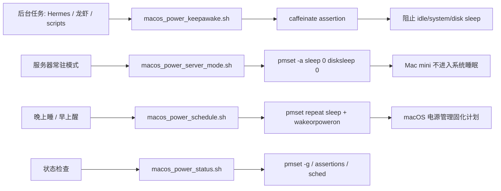

# Mac mini 后台任务电源管理方案

## 1. Goal and Constraints

目标：让 Mac mini 适合作为本地后台任务主机运行 Hermes / 龙虾类服务，同时支持：

- 长时间或永久不进入系统睡眠
- 显示器可以按需关闭，避免无意义耗电
- 按时间段保持唤醒，例如运行任务的 2 小时内不睡眠
- 晚上自动休眠，早上自动唤醒
- 能检查当前电源策略、定时任务和阻止睡眠的进程
- 能回滚到 macOS 默认电源策略

关键约束：

- macOS 睡眠后，普通 `cron` / shell 定时任务不会执行，所以不能依赖 cron 从睡眠中唤醒机器。
- 自动唤醒必须使用 `pmset schedule` 或 `pmset repeat` 写入 macOS 电源管理计划。
- 临时不休眠应该使用 `caffeinate`，它是 macOS 推荐的 sleep assertion 工具。
- Mac mini 长期开机作为服务器时，建议关闭 system sleep，但可以保留 display sleep。

复杂度：`Simple` 到 `Moderate`。不需要第三方工具。

## 2. Recommended Architecture (V1)



推荐 V1：

| 场景 | 推荐方式 | 原因 |
| --- | --- | --- |
| 作为长期服务器 | `macos_power_server_mode.sh enable` | 系统不睡眠，任务不会被中断 |
| 只跑一段时间任务 | `macos_power_keepawake.sh --hours 3 --background` | 到期自动释放，不永久改系统配置 |
| 绑定某个进程不睡眠 | `macos_power_keepawake.sh --pid <PID>` | 进程退出后自动释放 |
| 夜间休眠、早晨唤醒 | `macos_power_schedule.sh repeat --sleep 23:30 --wake 07:30` | 由 macOS 电源管理唤醒，不依赖 cron |
| 排查为什么没睡/没醒 | `macos_power_status.sh --full` | 查看 assertions、pmset、计划任务、最近 sleep/wake 日志 |

## 3. Trade-offs and Alternatives

### 推荐：服务器常驻 + 显示器休眠

适合 Hermes 这类后台服务。

```bash
sudo macos/scripts/macos_power_server_mode.sh enable --display-sleep 10
```

效果：

- system sleep: disabled
- disk sleep: disabled
- display sleep: 10 分钟
- wake for network access: enabled
- auto restart after power loss: enabled

优点：

- 最可靠，服务不会因为系统睡眠被打断。
- 适合 Mac mini 这种长期接电主机。
- 操作和排障简单。

代价：

- 夜间也会保持运行，耗电高于定时休眠。

### 可选：晚上休眠 / 早上自动唤醒

适合夜间不需要跑任务的情况。

```bash
sudo macos/scripts/macos_power_schedule.sh repeat --sleep 23:30 --wake 07:30
```

优点：

- 节能。
- 唤醒由 macOS 电源管理处理，比 cron 可靠。

限制：

- 机器睡眠期间 Hermes 不运行。
- 只能有一组 repeating power on/off 事件。
- 如果任务必须 24 小时可用，不应启用夜间休眠。

### 不推荐：只靠 cron 控制唤醒

cron 适合在机器醒着时触发脚本，例如定时启动服务、运行检查、调用 `caffeinate`。

但 cron 不能可靠地把已经睡眠的 Mac 唤醒。唤醒动作必须使用：

```bash
sudo pmset repeat wakeorpoweron MTWRFSU 07:30:00
sudo pmset schedule wakeorpoweron "05/02/26 07:30:00"
```

## 4. Implementation Steps

### 4.1 查看当前状态

```bash
macos/scripts/macos_power_status.sh
macos/scripts/macos_power_status.sh --full
```

重点看：

- `sleep` 是否为 `0`
- `displaysleep` 是否符合预期
- `pmset -g sched` 是否有 wake/sleep 计划
- `pmset -g assertions` 里是否有 `PreventSystemSleep` / `PreventUserIdleSystemSleep`

### 4.2 启用 Mac mini 服务器模式

```bash
sudo macos/scripts/macos_power_server_mode.sh enable --display-sleep 10
```

验证：

```bash
pmset -g custom
pmset -g
```

预期：

- `sleep 0`
- `disksleep 0`
- `displaysleep 10`
- `womp 1`
- `tcpkeepalive 1`
- `autorestart 1`，如果当前硬件支持

### 4.3 临时保持不休眠

保持 2 小时不休眠，显示器仍允许关闭：

```bash
macos/scripts/macos_power_keepawake.sh --hours 2 --background
```

提前停止这次后台保活：

```bash
macos/scripts/macos_power_keepawake_stop.sh
```

保持到今天或明天的 23:30：

```bash
macos/scripts/macos_power_keepawake.sh --until 23:30 --background
```

绑定到某个 Hermes 进程：

```bash
pgrep -fl Hermes
macos/scripts/macos_power_keepawake.sh --pid <PID>
```

直接包住一个命令：

```bash
macos/scripts/macos_power_keepawake.sh --hours 4 -- ./run-hermes.sh
```

如果希望显示器也保持亮屏：

```bash
macos/scripts/macos_power_keepawake.sh --hours 1 --display --background
```

### 4.4 设置晚上睡 / 早上醒

每天 23:30 睡眠，07:30 唤醒：

```bash
sudo macos/scripts/macos_power_schedule.sh repeat --sleep 23:30 --wake 07:30
```

只在工作日执行：

```bash
sudo macos/scripts/macos_power_schedule.sh repeat --days MTWRF --sleep 23:30 --wake 07:30
```

取消重复计划：

```bash
sudo macos/scripts/macos_power_schedule.sh cancel-repeat
```

安排一次性唤醒：

```bash
sudo macos/scripts/macos_power_schedule.sh one-shot-wake --at "2026-05-02 07:30"
```

安排 8 小时后唤醒并立即进入睡眠：

```bash
sudo macos/scripts/macos_power_schedule.sh sleep-now --wake-after 8h
```

### 4.5 使用 cron 的正确方式

cron 只能用于机器醒着时执行动作。

例如每天 07:35 启动 Hermes：

```cron
35 7 * * * /Users/lex/git/knowledge/macos/scripts/macos_power_keepawake.sh --hours 12 --background --reason hermes-daytime
36 7 * * * /path/to/start-hermes.sh >> /tmp/hermes-start.log 2>&1
```

如果机器 07:30 由 `pmset repeat wakeorpoweron` 唤醒，那么 cron 在 07:35 才有机会执行。

## 5. Validation and Rollback

### 验证脚本语法

```bash
bash -n macos/scripts/macos_power_status.sh
bash -n macos/scripts/macos_power_keepawake.sh
bash -n macos/scripts/macos_power_keepawake_stop.sh
bash -n macos/scripts/macos_power_server_mode.sh
bash -n macos/scripts/macos_power_schedule.sh
bash -n macos/scripts/macos_power_restore_defaults.sh
```

### 验证 dry-run 参数生成

```bash
macos/scripts/macos_power_keepawake.sh --duration 30m --display --dry-run
macos/scripts/macos_power_server_mode.sh enable --display-sleep 10 --dry-run
macos/scripts/macos_power_schedule.sh repeat --sleep 23:30 --wake 07:30 --dry-run
macos/scripts/macos_power_schedule.sh one-shot-wake --at "2026-05-02 07:30" --dry-run
```

### 验证状态

```bash
macos/scripts/macos_power_status.sh --full
```

### 验证临时保活

```bash
macos/scripts/macos_power_keepawake.sh --minutes 5 --background --reason test
pmset -g assertions | grep -E "caffeinate|Prevent"
```

### 回滚系统电源策略

```bash
sudo macos/scripts/macos_power_restore_defaults.sh
```

这会执行：

- `pmset repeat cancel`
- `pmset schedule cancelall`
- `pmset restoredefaults`

注意：`schedule cancelall` 会取消所有一次性电源计划，包括其他应用创建的计划。

## 6. Reliability and Cost Optimizations

- 长期服务优先使用 `server_mode enable`，不要依赖用户会话或 Amphetamine。
- 允许 `displaysleep`，不要为了后台任务长期点亮显示器。
- `autorestart 1` 适合无人值守 Mac mini，断电恢复后自动开机。
- 如果 Hermes 只在白天服务，使用 `pmset repeat` 做夜间休眠更省电。
- 如果服务需要远程访问，保留 `womp 1` 和 `tcpkeepalive 1`。
- 如果无法唤醒，优先检查 `pmset -g sched`、系统日志、外接设备和网络唤醒条件。

## 7. Handoff Checklist

- [ ] 用 `macos_power_status.sh --full` 保存当前状态
- [ ] 明确 Hermes 是否需要 24 小时运行
- [ ] 如果需要 24 小时运行，启用 `macos_power_server_mode.sh enable`
- [ ] 如果夜间可停止，设置 `macos_power_schedule.sh repeat`
- [ ] 用 `caffeinate` 脚本包住临时任务
- [ ] 用 `pmset -g assertions` 检查谁在阻止睡眠
- [ ] 用 `pmset -g sched` 检查唤醒/睡眠计划
- [ ] 记录回滚命令：`sudo macos/scripts/macos_power_restore_defaults.sh`
