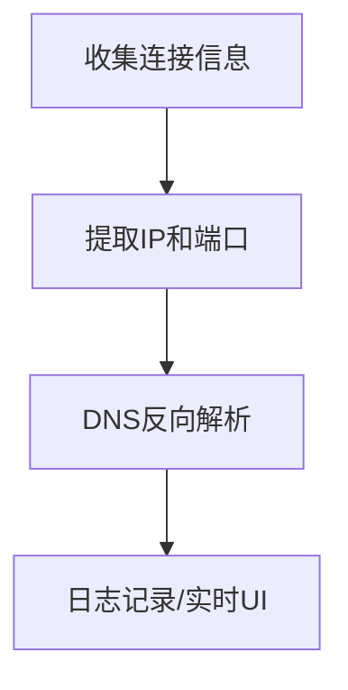
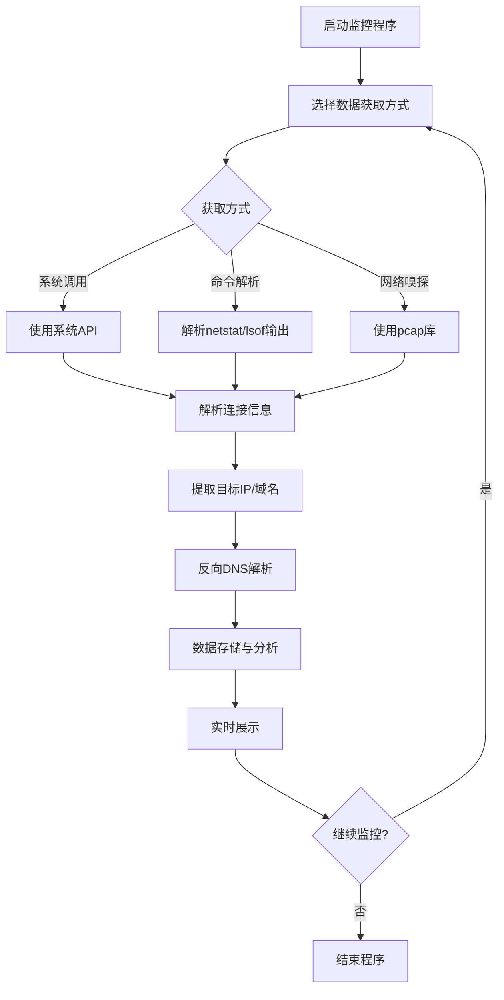

# summary 
- sudo nettop -m tcp
- sudo tcpdump -n -e -ttt -i en1
- sudo tcpdump -n -l -i en1 'udp port 53'
- sudo tcpdump -n -l -i en1 'tcp and (tcp[13] & 2 != 0)'


# ChatGPT  
非常好，macOS 上监控主机对外连接域名/IP 并实时分析，是网络安全和行为观察常见的需求。我们可以从 **现成工具使用** 到 **自行开发实现原理** 分两部分来讲解。

---

## **✅ 第一部分：现成工具与系统命令（快速实现）**

### **🔍 实时查看所有对外连接的 IP 和端口**

```
sudo lsof -i -nP | grep ESTABLISHED
```

- lsof -i：列出网络连接
- -nP：避免 DNS 解析，加快速度
- grep ESTABLISHED：只显示已建立的连接

### **🌐 查看域名对应的 IP（DNS 查询结果）**

```
sudo dscacheutil -cachedump -entries host
```

或：

```
sudo killall -INFO mDNSResponder
```

### **🕸️ 使用** 

### **nettop**

###  **进行实时监控（推荐）**

```
sudo nettop -m tcp
```

这将实时显示每个进程、连接、远程 IP、端口、状态等，非常清晰。

---

## **🧰 第二部分：如何开发一个类似工具（架构思路）**

如果你想自己开发一个工具来：

- 实时抓取网络连接（IP、端口）
- 解析对应域名
- 提供可视化或日志输出

可基于以下思路：

### **🧱 架构模块**



### **模块说明**

| **模块**     | **技术实现方式**                             |
| ------------ | -------------------------------------------- |
| 连接信息收集 | 使用 netstat, lsof, 或 PF socket（低层方式） |
| IP/端口提取  | 解析 lsof 或 nettop 输出                     |
| DNS 反向解析 | socket.gethostbyaddr() / scutil              |
| UI / 输出    | CLI TUI（如 curses）、Web 界面、JSON 日志    |

---

## **🧪 示例：Python 简单版本（每秒输出一次活跃连接 IP）**

```
import subprocess
import time

def get_connections():
    result = subprocess.run(['lsof', '-i', '-nP'], stdout=subprocess.PIPE, stderr=subprocess.DEVNULL)
    lines = result.stdout.decode().split('\n')
    for line in lines:
        if 'ESTABLISHED' in line:
            print(line)

while True:
    print("=== 活跃连接 ===")
    get_connections()
    time.sleep(1)
```

---

## **⚙️ 高级实现（基于 Packet Filter）**

macOS 底层是通过 PF（Packet Filter）进行网络控制的，你可以：

1. 开启 PF log：

```bash
sudo tcpdump -n -e -ttt -i pflog0
sudo tcpdump -n -e -ttt -i en1
```

1.

2.  使用 PF 的 anchor 创建过滤规则（对指定 IP/端口记录）
3.  或者开发基于 [Network Extension](https://developer.apple.com/documentation/networkextension) 的系统代理 App（可以捕获所有流量）

---

## **🧠 建议实现方式对比**

| **方式**         | **优点**                | **缺点**                        |
| ---------------- | ----------------------- | ------------------------------- |
| lsof / netstat   | 简单、快速、不需安装    | 不包含域名，部分输出信息有限    |
| nettop           | 实时、图形、详细        | 只能交互使用，不易采集          |
| PF + tcpdump     | 抓包级别、底层精确      | 成本高，需要权限，开发复杂      |
| 自开发（Python） | 可扩展、日志可控        | 实时性有限，不易兼容所有细节    |
| NE Extension     | 捕获 DNS + IP + TLS SNI | 需要 Apple 签名或特权，开发复杂 |

---

## **✅ 推荐组合方案**

你作为深度用户和开发者，可以考虑：

1. **阶段 1：快速原型**

    - 用 lsof + nettop + Python 脚本提取连接 IP
    - 用 socket.gethostbyaddr() 反查域名（不保证 100%成功）

2. **阶段 2：自开发工具**

    - Python/Go 构建 CLI 工具，定期轮询 lsof 输出 + DNS 缓存
    - 保存为结构化日志（JSON）

3. **阶段 3：系统级监控**

    - 如果未来要做完整流量监控或行为感知：
        - 利用 PF + BPF 抓包
        - 或开发 NetworkExtension（需签名和授权）

---

## **📦 示例输出格式建议**

```json
{
  "timestamp": "2025-07-20T13:00:00",
  "pid": 1234,
  "process": "curl",
  "remote_ip": "142.250.207.142",
  "remote_domain": "google.com",
  "port": 443,
  "protocol": "TCP"
}
```

你可以最终将数据输入到 Elasticsearch、BigQuery、或本地 SQLite 中进行分析。

---

如果你需要我帮助你做一个完整的 **Python 或 Go CLI 工具原型**，也可以继续告诉我。是否希望这个工具以某种形式持续运行并输出 JSON 日志？是否需要 TUI（Terminal UI）界面？我可以继续帮助你拆解开发逻辑。


# macOS network Connection Monitoring tool
在 macOS 上监控主机对外连接的域名和 IP，有多种实现方式。我来为你详细介绍几种方法和开发思路。

## 现有工具监控方法

### 1. 使用 netstat 命令

```bash
# 查看所有TCP连接
netstat -an | grep ESTABLISHED

# 查看特定进程的连接
netstat -anp | grep [PID]

# 持续监控连接状态
watch -n 1 "netstat -an | grep ESTABLISHED"
```

### 2. 使用 lsof 命令

```bash
# 查看所有网络连接
lsof -i

# 查看TCP连接
lsof -iTCP

# 查看特定端口连接
lsof -i:80,443

# 实时监控
watch -n 2 "lsof -iTCP -sTCP:ESTABLISHED"
```

### 3. 使用 ss 命令（如果安装了）

```bash
# 查看established连接
ss -tuln

# 显示进程信息
ss -tulnp
```

## 开发自定义监控工具

### 方案架构流程



### Python 实现方案

#### 1. 基于 psutil 库的实现

```python
import psutil
import socket
import time
from collections import defaultdict

class ConnectionMonitor:
    def __init__(self):
        self.connections_history = defaultdict(list)
    
    def get_active_connections(self):
        """获取当前活跃连接"""
        connections = []
        for conn in psutil.net_connections(kind='inet'):
            if conn.status == 'ESTABLISHED':
                try:
                    # 获取进程信息
                    process = psutil.Process(conn.pid) if conn.pid else None
                    process_name = process.name() if process else "Unknown"
                    
                    # 反向DNS解析
                    try:
                        hostname = socket.gethostbyaddr(conn.raddr.ip)[0]
                    except:
                        hostname = conn.raddr.ip
                    
                    connection_info = {
                        'local_addr': f"{conn.laddr.ip}:{conn.laddr.port}",
                        'remote_addr': f"{conn.raddr.ip}:{conn.raddr.port}",
                        'hostname': hostname,
                        'process': process_name,
                        'pid': conn.pid,
                        'timestamp': time.time()
                    }
                    connections.append(connection_info)
                except (psutil.NoSuchProcess, psutil.AccessDenied):
                    continue
        
        return connections
    
    def monitor_realtime(self, interval=2):
        """实时监控连接"""
        print("Real-time Connection Monitor Started...")
        print("-" * 80)
        
        while True:
            try:
                connections = self.get_active_connections()
                
                # 清屏并显示当前连接
                print(f"\033[2J\033[H")  # 清屏
                print(f"Active Connections ({len(connections)}) - {time.strftime('%Y-%m-%d %H:%M:%S')}")
                print("-" * 80)
                
                for conn in connections:
                    print(f"Process: {conn['process']:15} | "
                          f"Remote: {conn['hostname']:30} | "
                          f"IP: {conn['remote_addr']:20}")
                
                time.sleep(interval)
                
            except KeyboardInterrupt:
                print("\nMonitoring stopped.")
                break

# 使用示例
if __name__ == "__main__":
    monitor = ConnectionMonitor()
    monitor.monitor_realtime()
```

#### 2. 基于 subprocess 解析系统命令

```python
import subprocess
import json
import re
from datetime import datetime

class SystemCommandMonitor:
    def __init__(self):
        self.connections = []
    
    def parse_lsof_output(self):
        """解析 lsof 命令输出"""
        try:
            # 执行 lsof 命令
            result = subprocess.run(
                ['lsof', '-iTCP', '-sTCP:ESTABLISHED', '-n'],
                capture_output=True,
                text=True,
                timeout=10
            )
            
            connections = []
            lines = result.stdout.strip().split('\n')[1:]  # 跳过标题行
            
            for line in lines:
                if line.strip():
                    parts = line.split()
                    if len(parts) >= 9:
                        # 解析连接信息
                        process = parts[0]
                        pid = parts[1]
                        user = parts[2]
                        fd = parts[3]
                        type_info = parts[4]
                        device = parts[5]
                        size = parts[6]
                        node = parts[7]
                        name = parts[8] if len(parts) > 8 else ""
                        
                        # 提取远程地址
                        if '->' in name:
                            local, remote = name.split('->')
                            connections.append({
                                'process': process,
                                'pid': pid,
                                'user': user,
                                'local': local,
                                'remote': remote,
                                'timestamp': datetime.now().isoformat()
                            })
            
            return connections
            
        except subprocess.TimeoutExpired:
            print("Command timeout")
            return []
        except Exception as e:
            print(f"Error executing lsof: {e}")
            return []
    
    def get_unique_domains(self, connections):
        """提取唯一的域名/IP"""
        domains = set()
        for conn in connections:
            remote = conn.get('remote', '')
            if remote:
                # 提取IP或域名
                ip_match = re.search(r'([^:]+)', remote)
                if ip_match:
                    domains.add(ip_match.group(1))
        return sorted(list(domains))
    
    def monitor_and_export(self, output_file=None):
        """监控并导出数据"""
        connections = self.parse_lsof_output()
        domains = self.get_unique_domains(connections)
        
        result = {
            'timestamp': datetime.now().isoformat(),
            'total_connections': len(connections),
            'unique_domains': len(domains),
            'connections': connections,
            'domains': domains
        }
        
        if output_file:
            with open(output_file, 'w') as f:
                json.dump(result, f, indent=2)
            print(f"Data exported to {output_file}")
        
        return result

# 使用示例
monitor = SystemCommandMonitor()
data = monitor.monitor_and_export('connections.json')
```

### 高级监控方案 - 使用 Scapy

```python
from scapy.all import *
import threading
from collections import defaultdict

class PacketMonitor:
    def __init__(self):
        self.connections = defaultdict(set)
        self.dns_cache = {}
    
    def packet_handler(self, packet):
        """处理捕获的数据包"""
        if packet.haslayer(IP):
            src_ip = packet[IP].src
            dst_ip = packet[IP].dst
            
            # 只关注出站连接
            if src_ip.startswith('192.168.') or src_ip.startswith('10.'):
                self.connections['outbound'].add(dst_ip)
                
                # 尝试反向DNS解析
                if dst_ip not in self.dns_cache:
                    try:
                        hostname = socket.gethostbyaddr(dst_ip)[0]
                        self.dns_cache[dst_ip] = hostname
                    except:
                        self.dns_cache[dst_ip] = dst_ip
    
    def start_capture(self, interface=None):
        """开始数据包捕获"""
        print(f"Starting packet capture on interface: {interface or 'all'}")
        sniff(iface=interface, prn=self.packet_handler, store=False)
    
    def get_summary(self):
        """获取连接摘要"""
        summary = []
        for ip in self.connections['outbound']:
            hostname = self.dns_cache.get(ip, ip)
            summary.append({'ip': ip, 'hostname': hostname})
        return summary
```

## 数据分析和可视化

### 连接统计表格示例

|Process|Remote Host|IP Address|Port|Duration|Status|
|---|---|---|---|---|---|
|Safari|www.google.com|172.217.27.4|443|00:02:15|ESTABLISHED|
|Chrome|api.github.com|140.82.113.6|443|00:01:30|ESTABLISHED|
|Mail|imap.gmail.com|64.233.189.109|993|00:05:42|ESTABLISHED|

### 部署监控脚本

```bash
#!/bin/bash
# monitor_connections.sh

# 创建监控脚本
cat > connection_monitor.py << 'EOF'
# 这里放入上面的Python代码
EOF

# 设置执行权限
chmod +x connection_monitor.py

# 创建定时任务
echo "*/5 * * * * /usr/bin/python3 /path/to/connection_monitor.py >> /var/log/connection_monitor.log 2>&1" | crontab -

# 实时监控
python3 connection_monitor.py
```

## 推荐的实现策略

1. **开发阶段**: 使用 `psutil` 库快速原型开发
2. **生产环境**: 结合系统命令解析，确保兼容性
3. **深度分析**: 集成 `scapy` 进行包级别监控
4. **数据存储**: 使用 SQLite 或 JSON 文件存储历史数据
5. **可视化**: 集成 Web 界面或使用 Grafana 展示

这些方案可以根据你的具体需求进行组合使用，既可以实时监控也可以进行历史数据分析。


# TCPDUMP

当然可以，tcpdump 是非常强大的网络抓包工具，支持丰富的**过滤语法（BPF：Berkeley Packet Filter）**，你完全可以基于：

```
sudo tcpdump -n -e -ttt -i en1
```

添加过滤条件，以仅捕获 **对外连接流量、指定端口、指定域名/IP、协议等**。

---

## **✅ 常见 tcpdump 过滤条件组合**

  

### **🎯 只抓取出站 TCP 流量（不是本地回环）**

```
sudo tcpdump -n -e -ttt -i en1 tcp and 'tcp[tcpflags] & tcp-syn != 0' and dst net not 127.0.0.0/8
```

说明：

- tcp：仅抓取 TCP 流量
    
- tcp[tcpflags] & tcp-syn != 0：表示抓 SYN 包，代表新连接建立
    
- dst net not 127.0.0.0/8：排除本地回环（localhost）
    

---

### **🔍 只显示非本机 IP 的通信（出站 + 入站）**

```
sudo tcpdump -n -e -ttt -i en1 'not src net 192.168.0.0/16 and not dst net 192.168.0.0/16'
```

> 替换 192.168.0.0/16 为你实际的内网网段

---

### **🌐 只看访问 80 和 443 的 HTTP/HTTPS 流量**

```
sudo tcpdump -n -e -ttt -i en1 'port 80 or port 443'
```

或者精确：

```
sudo tcpdump -n -e -ttt -i en1 'tcp dst port 80 or tcp dst port 443'
```

---

### **📡 只看发往远程公网的 SYN 包（连接建立的瞬间）**

```
sudo tcpdump -n -e -ttt -i en1 'tcp[tcpflags] & tcp-syn != 0 and dst net not 10.0.0.0/8 and dst net not 192.168.0.0/16 and dst net not 172.16.0.0/12'
```

说明：排除内网地址，只保留发起连接的公网流量

---

### **🧭 按域名 IP 抓取（你已知某些域名解析的 IP）**

  

例如你要监控连接到 github.com（假设其解析为 140.82.114.3）：

```
sudo tcpdump -n -e -ttt -i en1 host 140.82.114.3
```

---

### **🧵 抓取 DNS 查询流量（UDP 53）**

```
sudo tcpdump -n -e -ttt -i en1 port 53 and udp
```

可以观察 macOS 发起的 DNS 请求，进而提取域名行为。

---

## **✅ 示例：抓取所有 SYN（初次连接）的出站公网 TCP 流量并写入文件**

```
sudo tcpdump -n -e -ttt -i en1 'tcp[tcpflags] & tcp-syn != 0 and dst net not 10.0.0.0/8 and dst net not 192.168.0.0/16 and dst net not 172.16.0.0/12' -w outgoing_connections.pcap
```

你可以使用 Wireshark 或 tcpdump -r 来读取分析这个 .pcap 文件。

---

## **📌 附加技巧：显示时加上进程名（不是** 

## **tcpdump**

##  **支持，但可以配合）**

  

tcpdump 本身 **无法显示进程名或 PID**，但你可以并行运行：

```
sudo lsof -i -nP | grep ESTABLISHED
```

或者开发脚本配合 tcpdump 的输出做解析（如利用 Python scapy 包实时分析）。

---

如果你想要，我也可以帮你写一个脚本，将 tcpdump 的实时输出 + DNS 反查 + JSON 日志集成为 CLI 工具，便于你下一步处理分析。需要吗？是否希望导出成结构化数据？