这是带有删除线的文本 ~~删除~~。

这是==高亮显示的文本==。


当然可以！Mermaid是一种用于绘制流程图、时序图、甘特图等的Markdown扩展。下面是一个详细的Mermaid语法示例，以及关于subgraph的用法和注意事项。


https://mermaid.live/
https://support.typora.io/Draw-Diagrams-With-Markdown/
https://fontawesome.com/v4/icons/


- simple flow 
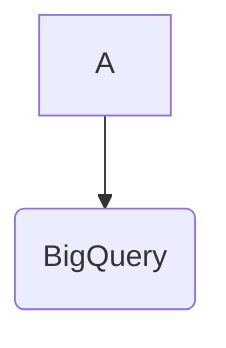
---

- only an example of subgraph
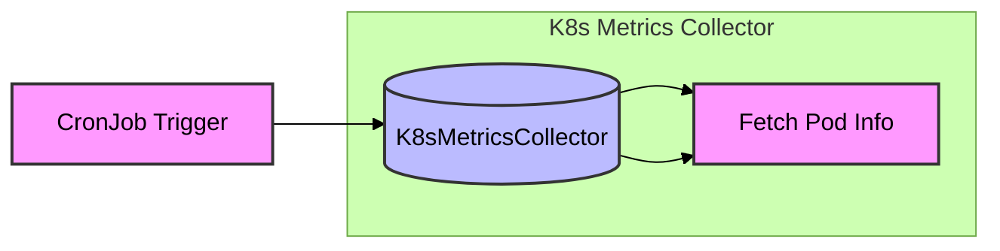
---
add rgb 

是的，你是想给 Mermaid Sequence Diagram 中的 `box` (subgraph) 添加背景色。直接在 Mermaid 语法中给 `box` 添加背景色属性是不直接支持的。但是，你可以通过 **CSS 样式** 来实现这个效果。

Mermaid 图表最终会被渲染成 SVG，所以你可以使用 CSS 选择器来选中 `box` 对应的 SVG 元素并设置背景色。

**以下是如何通过 CSS 样式给 `box` 添加背景色的方法：**

1. **识别 `box` 对应的 SVG 元素：**  在 Mermaid 生成的 SVG 中，`box` 实际上会被渲染成 `<rect>` 元素，并且它通常会包含在 `<g>` 元素中，这个 `<g>` 元素可能具有特定的类名或者 ID。你需要查看 Mermaid 生成的 SVG 代码来确定如何精确地选中这个 `box`。  通常，Mermaid 会为 subgraph 生成带有 `entityBox` 类的 `<rect>` 元素。

2. **使用 CSS 样式来设置背景色：**  你可以使用 CSS 来选择这个 `<rect>` 元素并设置 `fill` 属性来改变背景色。

**Markdown 代码示例 (内联 CSS)：**

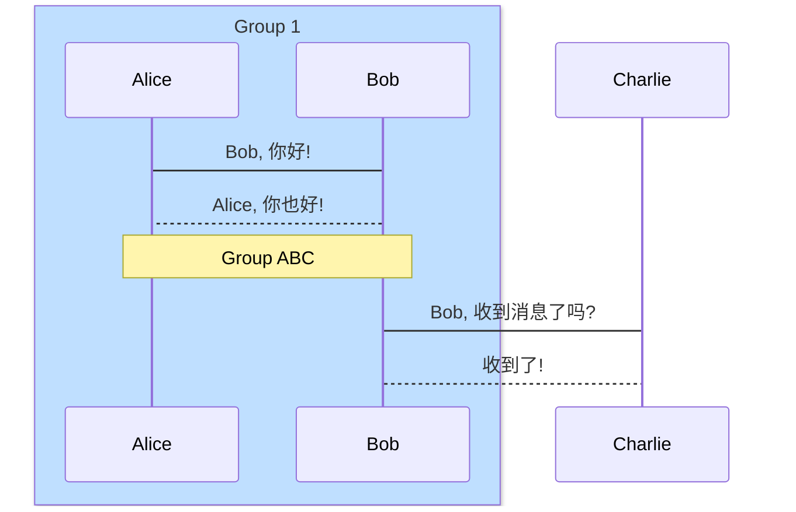


---
- notice: define 
  - style
  - classDef
  - calss 
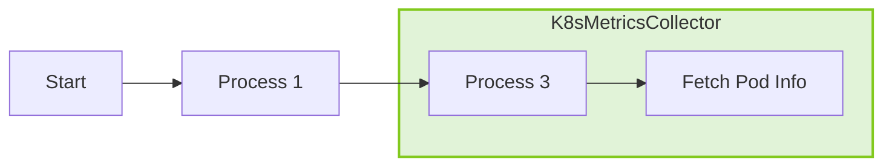
### Mermaid语法示例：

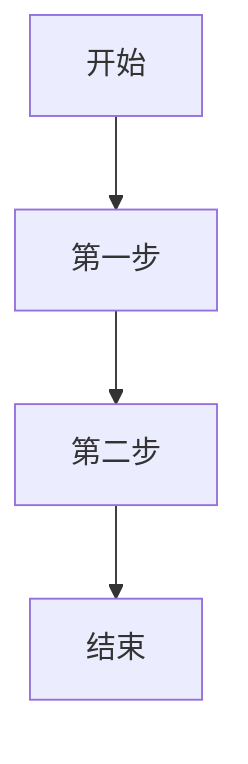


#### 流程图示例：

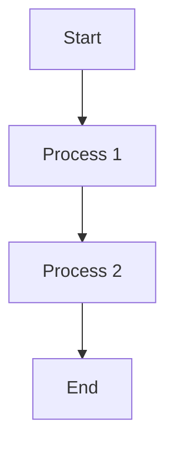


#### 时序图示例：


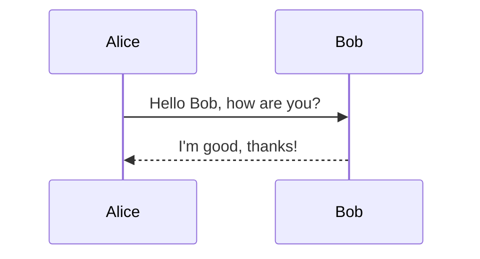

#### 甘特图示例：


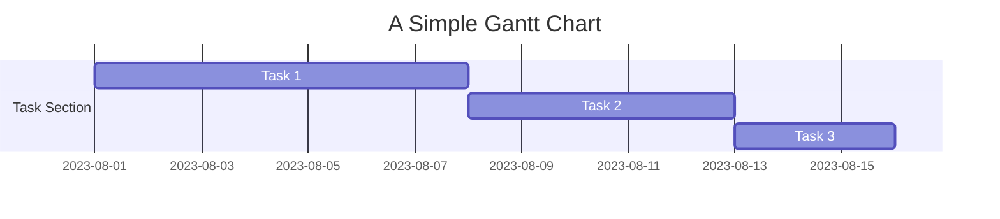

我想搞一个Markdown里面的甘特图的模版, 是一个基于GCP云平台的架构,我们每个功能也就是feture来的时候,基本都是下面这个流程
展示了 GCP 云平台功能开发的典型流程：Design、Develop、Testing 和 Release，并包含每个步骤的 Review 阶段
我关心这些进度的规划,所以帮我生成一个对应的markdown格式可以支持的甘特模版.最好有颜色之类的.可以好看一些


下面是一个基于 Markdown 和 Mermaid 的甘特图模板，展示了 GCP 云平台功能开发的典型流程：Design、Develop、Testing 和 Release，并包含每个步骤的 Review 阶段。这个模板支持颜色和清晰的时间规划。

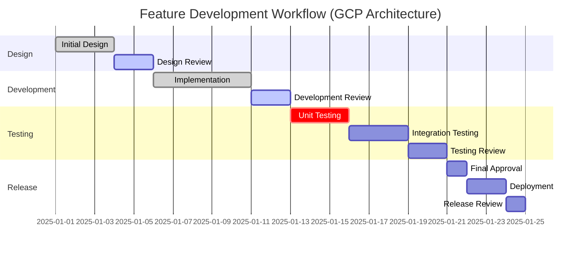
---
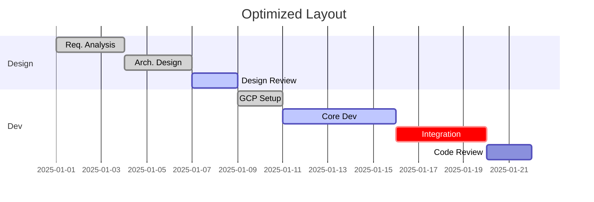
---
- add sub graph
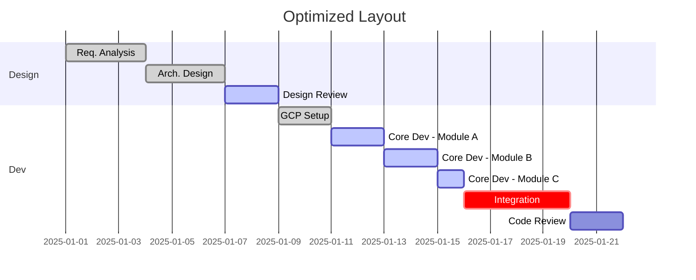
### **解释**
1. **任务类型**
   - `:done`：已完成的任务。
   - `:active`：当前正在进行的任务。
   - `:crit`：关键任务。
 - 任务状态标记：

:done - 已完成任务（通常显示为灰色或带有完成标记）
:active - 当前活动任务（通常显示为蓝色或突出显示）
:crit - 关键任务（通常显示为红色）
无标记 - 普通任务（使用默认颜色）通过这个看出来没行的格式
`    Code Review      :         dev4, after dev3, 2d`
解释上面一行

- `Code Review` 是一个任务名称
- `:         dev4` 是一个状态标记，用于表示任务的状态。后面可以跟,比如done 表示已完成，:active 表示当前进行中，:crit 表示关键任务 
- `after dev3` 表示 `dev4` 任务在 `dev3` 任务完成后开始。 所以这个不用定义单独的日期,而是直接写在前面的任务后面
- `2d` 表示任务持续 2 天。

其实可以总结为如果频繁调整时间,那么使用after 来表示时间,如果固定时间,那么直接写日期就行


1. **任务时间**
   - 使用 `YYYY-MM-DD` 的时间格式。
   - 例如，`Design` 阶段从 `2025-01-01` 开始，持续 3 天。

2. **任务依赖**
   - 使用 `after` 表示任务依赖，比如 `Deployment` 任务在 `Final Approval` 完成后开始：`after rel1`。

3. **分组**
   - `section` 将任务分为模块（如 `Design`、`Development` 等）。

4. **颜色**
   - 不同任务状态使用不同的颜色，自动根据 Mermaid 配置呈现。

---

### **效果预览**
将上述代码保存为 `.md` 文件，在支持 Mermaid 渲染的工具（如 GitHub、Typora 或 VS Code 的 Mermaid 插件）中查看，即可生成一个可视化甘特图。

### **如何扩展**
- **新增步骤**：添加新的任务，使用类似的格式，如 `Documentation`。
- **调整时间**：修改每个任务的时间或持续天数，按需求规划。
- **不同任务状态**：灵活切换任务的状态（`done`、`active`、`crit` 等）。

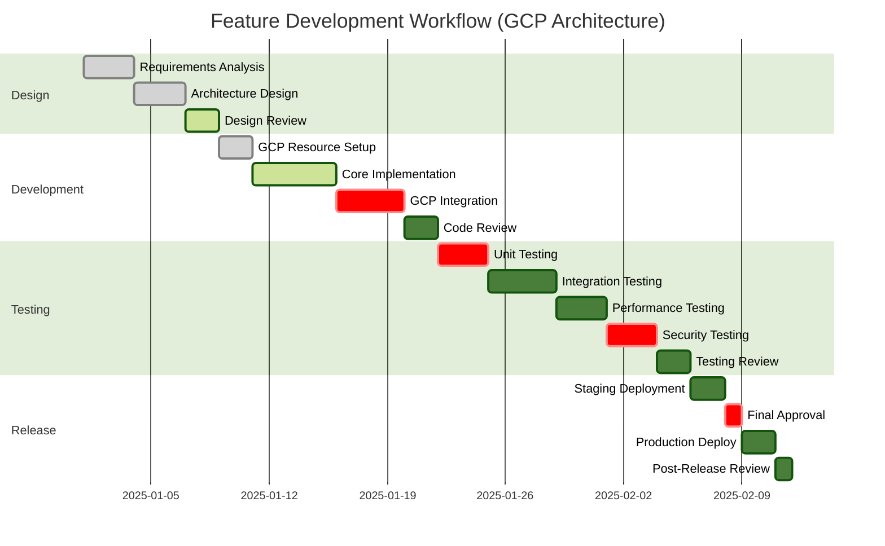
在这个例子中：

default (默认): 这是 Mermaid 的默认主题，提供了一个简洁清晰的风格。
base: 一个非常基础的主题，几乎没有额外的样式。适合作为自定义样式的起点。你之前尝试的就是这个主题。
forest: 一个颜色更丰富的主题，灵感来源于森林，通常包含绿色和更深的色调。你成功应用了这个主题。
dark: 一个深色主题，背景为深色，文字为浅色。适合在暗色环境下查看或作为网站的夜间模式。
neutral: 一个中性主题，使用柔和的颜色，整体感觉比较平静。
simple: 一个非常简约的主题，线条纤细，颜色低调。


Design section 使用浅蓝色背景 (rgba(102, 187, 255, 0.2))
Development section 使用浅绿色背景 (rgba(102, 255, 153, 0.2))
Testing section 使用浅黄色背景 (rgba(255, 204, 102, 0.2))
Release section 使用浅红色背景 (rgba(255, 153, 170, 0.16))


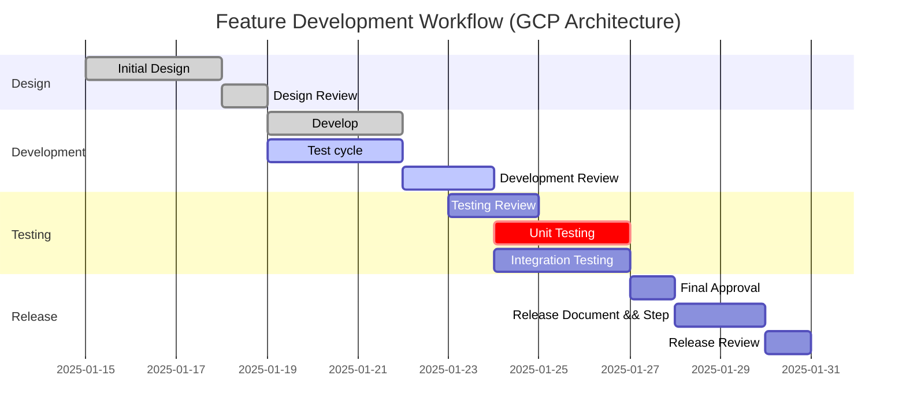
Implementation == develoy
---
在 Mermaid 的甘特图中，des1 是任务的 唯一标识符 (ID)，用于标记和引用该任务。它的作用如下：
甘特图中的 红色竖线 是项目进度的指示器，表示当前的日期（今日日期）。这个红线的默认位置由 Mermaid 根据系统的当前时间自动生成，用于显示任务进度相对于当前日期的位置。


作用
	1.	唯一标识任务：
	•	每个任务都需要一个唯一的 ID，像 des1 这样短小的标识符便于区分不同的任务。
	•	如果任务之间有依赖关系，可以通过 ID 来指定顺序或依赖。
	2.	表示任务依赖：
	•	可以用任务 ID 指定某个任务的开始时间基于另一个任务的完成时间。例如：

Deployment :rel2, after des1, 2d

表示 Deployment 在 Initial Design 完成后延迟 2 天开始。

	3.	没有直接渲染：
	•	这个 ID 不会在最终甘特图中显示，主要是为了 Mermaid 内部处理和开发者使用。

示例解释

以下代码片段说明了如何使用任务 ID 表示依赖关系：

gantt
    title Example Workflow
    dateFormat  YYYY-MM-DD
    Initial Design       :done,  des1, 2025-01-01, 3d
    Design Review        :active, des2, after des1, 2d

	•	des1：表示任务 Initial Design 的 ID。
	•	des2：任务 Design Review 使用 after des1 表示它依赖于 des1，即 Initial Design 完成后才开始。

总结

des1 是一个内部任务 ID，用于：
	•	标记任务的唯一性。
	•	指定任务间的依赖关系。
	•	方便 Mermaid 解析任务时间和顺序。

它不会影响图的外观，但对于复杂项目中的任务管理非常重要。

在Mermaid中，`subgraph`允许您创建一个子图，用于将相关元素分组并以更清晰的方式呈现图表。


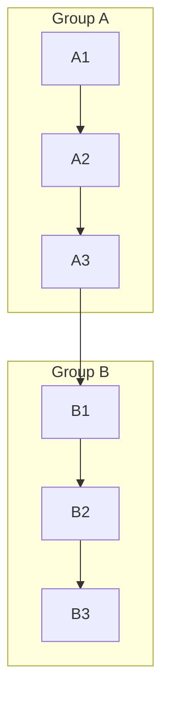


关于`subgraph`内的标签问题，您正确地指出了`[]`不能再使用`()`引用，这是因为Mermaid使用`[]`和`()`进行标签解析，因此在`subgraph`中的标签，您应该避免使用`()`。例如：


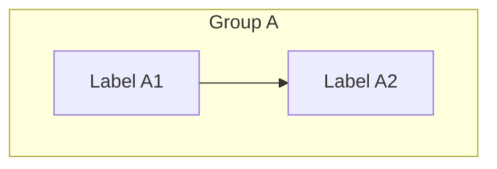


希望这个示例和解释对您有帮助！如果您需要更多关于Mermaid的指导或其他信息，请随时提问。


当然可以！以下是关于Kong的CP和Workspace之间关系的Mermaid示意图：

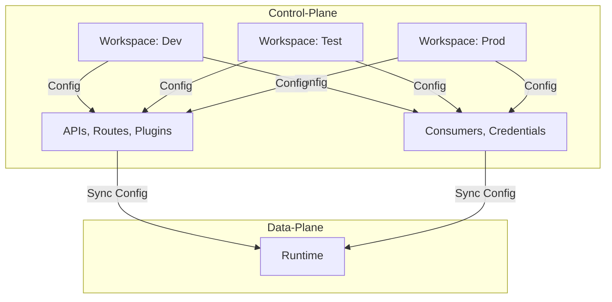

在上述Mermaid示意图中，Control Plane（CP）中有三个工作区（Dev、Test、Prod），每个工作区包含不同的配置（如APIs、Routes、Plugins、Consumers等）。CP负责管理不同工作区的配置状态，并通过同步配置到Data Plane（Runtime）来实现配置的生效。

希望这个Mermaid示意图能够更清楚地展示CP和Workspace之间的关系。如果您有任何进一步的问题，请随时提问。

如果 Markdown 表格中有多行共用一个单元格区域,可以使用 :-- 表示这几行属于同一个单元格。

例如:
| 表头1 | 表头2 |
|:--:|:--:|  
|第一行|第一行|  
|:--|  
|第二行|第二行|
|第三行|第三行|


显示效果:

| 表头1 | 表头2 |  
|:--:|:--:|
|第一行|第一行|
|:--|  
|第二行|第二行|  
|第三行|第三行|

可以看到 "第二行" 和 "第三行" 位于同一个单元格区域中。

这时如果要在这几行中加入多行内容,仍然可以使用 \ 进行换行。例如:

| 表头1 | 表头2 |
|:--:|:--:|  
|第一行|第一行|  
|:--|  
|第二行\   
第三行|第二行\  
       第三行|
|第四行|第四行| 


显示效果:  

| 表头1 | 表头2 |  
|:--:|:--:|
|第一行|第一行|  
|:--|      
|第二行\     
第三行|第二行\  
       第三行|  
|第四行|第四行|

第三行和第四行公用一个单元格,通过 \ 进行换行输入多行内容。

所以,通过 :-- 语法可以实现 Markdown 表格中多行共用一个单元格的效果,并且仍然可以在该单元格中使用 \ 换行符输入多行内容。

这里是 Markdown 帮助文档的中文版:

# Markdown 语法帮助 

## 标题

# 一级标题 
## 二级标题 
### 三级标题 
#### 四级标题
##### 五级标题 
###### 六级标题

## 字体 

斜体文字   

**加粗文字**   

***斜体加粗文字***

## 分割线

***   

* * *

## 列表

### 无序列表

* 第一项 
* 第二项
* 第三项

### 有序列表

1. 第一项 
2. 第二项  
3. 第三项

## 图片


## 链接

[Markdown 语法](https://www.runoob.com/markdown/md-tutorial.html)

## 引用

这是一个引用的内容  


## 行内代码

代码  

## 代码块

代码块


## 表格

|  表头   | 表头  |
|  ----  | ----  |
| 单元格  | 单元格 |
| 单元格  | 单元格 |

## 高级技巧

### 删除线

~~删除线~~

### 注脚

你的工资已经到账[^1] 

[^1]: 您有一笔转账款项已成功完成

### 缩写

Markdown -> MD

### 下划线

H<sub>2</sub>O

## 待办事项 

- [x] 已完成事项 
- [ ] 未完成事项1 
- [ ] 未完成事项2

```
这里是 Markdown 帮助文档的中文版:

# Markdown 语法帮助 

## 标题

# 一级标题 
## 二级标题 
### 三级标题 
#### 四级标题
##### 五级标题 
###### 六级标题

## 字体 

斜体文字   

**加粗文字**   

***斜体加粗文字***

## 分割线

***   

* * *

## 列表

### 无序列表

* 第一项 
* 第二项
* 第三项

### 有序列表

1. 第一项 
2. 第二项  
3. 第三项

## 图片


## 链接

[Markdown 语法](https://www.runoob.com/markdown/md-tutorial.html)

## 引用

这是一个引用的内容  


## 行内代码

代码  

## 代码块

代码块


## 表格

|  表头   | 表头  |
|  ----  | ----  |
| 单元格  | 单元格 |
| 单元格  | 单元格 |

## 高级技巧

### 删除线

~~删除线~~

### 注脚

你的工资已经到账[^1] 

[^1]: 您有一笔转账款项已成功完成

### 缩写

Markdown -> MD

### 下划线

H<sub>2</sub>O

## 待办事项 

- [x] 已完成事项 
- [ ] 未完成事项1 
- [ ] 未完成事项2
```
# add Testing
