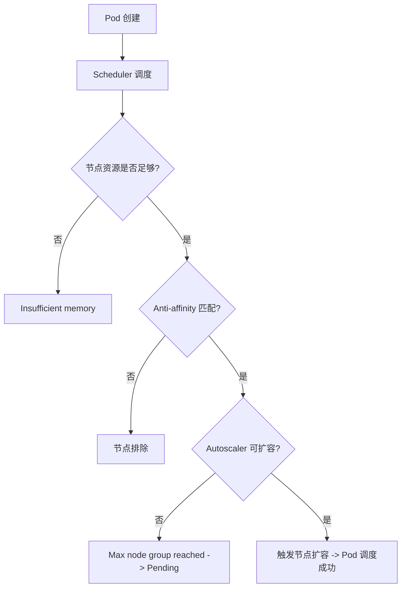
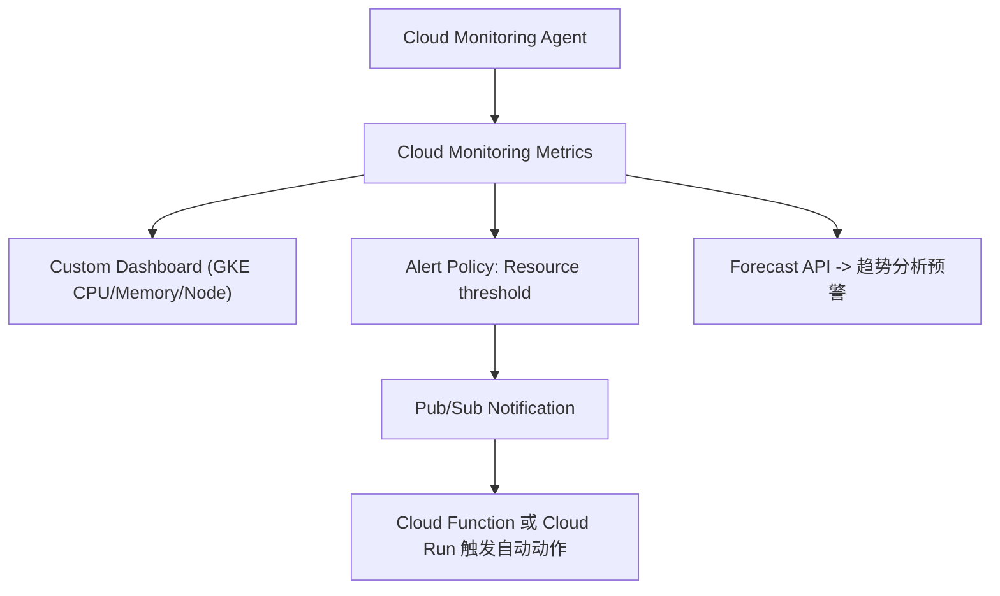

日志涉及 **GKE Pod 调度失败（FailedScheduling）** 的典型场景。下面我帮你系统分析问题的成因与解决方案。

---

## **🧩 一、问题分析**

从日志关键信息来看：

```
Warning  FailedScheduling
default-scheduler 0/60 nodes are available:
54 Insufficient memory,
6 node(s) didn't match pod anti-affinity rules.
preemption: 0/60 nodes are available: 60 No preemption victims found for incoming pod.
Normal NotTriggerScaleUp cluster-autoscaler
Pod didn't trigger scale-up: max node group size reached
```

我们可以拆解出以下几个核心问题：

| **问题点**                         | **描述**                                    | **根因**                                                                  |
| ---------------------------------- | ------------------------------------------- | ------------------------------------------------------------------------- |
| **Insufficient memory (内存不足)** | 54 个节点可用内存不足                       | Pod 请求的资源超出节点可分配资源                                          |
| **Pod anti-affinity 不匹配**       | 6 个节点不符合反亲和性（anti-affinity）规则 | Pod 被限制不能与特定 Pod 同节点运行                                       |
| **No preemption victims found**    | 没有找到可被“驱逐”的低优先级 Pod            | 调度器无法通过抢占解决资源不足                                            |
| **NotTriggerScaleUp**              | 自动扩容未触发                              | GKE Cluster Autoscaler 已达到最大节点数上限 (max node group size reached) |

---

## **⚙️ 二、问题本质**

简化后可以理解为：

> **Pod 想调度上去，但当前集群所有节点要么内存不够，要么被亲和性规则排除了。Autoscaler 也无法再扩容节点，所以 Pod 被卡在 Pending 状态。**

---

## **🧭 三、解决方案**

你可以从以下四个方向排查与解决：

### **1️⃣** 

### **检查并调整 Pod 资源请求**

先查看 Deployment/StatefulSet 的 YAML：

```
kubectl get deploy <your-deploy> -o yaml
```

重点关注：

```yaml
resources:
  requests:
    memory: "2Gi"
    cpu: "1"
```

**优化建议：**

- 确认请求值（requests）是否过高。
- 若应用实际占用较低，可下调 requests.memory。
- 使用 kubectl top pod + kubectl top node 观察真实使用量。

---

### **2️⃣** 

### **检查 Pod 反亲和性规则 (anti-affinity)**

查看调度约束：

```yaml
affinity:
  podAntiAffinity:
    requiredDuringSchedulingIgnoredDuringExecution:
      - labelSelector:
          matchExpressions:
            - key: app
              operator: In
              values:
                - your-app
        topologyKey: "kubernetes.io/hostname"
```

**优化建议：**

- 如果反亲和规则过于严格（requiredDuringSchedulingIgnoredDuringExecution），
    可改为软性约束：

```
preferredDuringSchedulingIgnoredDuringExecution
```

-
- 或者放宽 topologyKey（如 zone 而不是 hostname）。

---

### **3️⃣** 

### **确认 Cluster Autoscaler 配置**

检查自动扩容状态：

```
gcloud container clusters describe <cluster-name> \
  --region <region> \
  --format="value(autoscaling)"
```

日志中提到：

> max node group size reached

说明你已触及自动扩容上限。

**解决方案：**

- 提高上限：

```
gcloud container clusters update <cluster-name> \
  --enable-autoscaling \
  --min-nodes=3 \
  --max-nodes=10 \
  --node-pool=<pool-name>
```

-
- 或手动扩容节点：

```
gcloud container clusters resize <cluster-name> \
  --node-pool <pool-name> \
  --num-nodes <新数量>
```

---

### **4️⃣** 

### **验证调度情况**

你可以使用以下命令检查哪些节点满足调度条件：

```
kubectl describe pod <pending-pod-name>
```

重点关注：

- Events 部分的 0/60 nodes are available
- 每个节点失败的原因（如内存不足、taint、不匹配等）

---

## **🔍 四、流程图示意**



---

## **🧠 五、最佳实践建议**

| **场景**       | **建议**                                             |
| -------------- | ---------------------------------------------------- |
| 资源不足频繁   | 使用 HPA + Cluster Autoscaler 动态伸缩               |
| 亲和性规则复杂 | 合理使用 preferred 而非 required                     |
| 调度等待时间长 | 启用调度日志或使用 kubectl describe pod 进行调度诊断 |
| 容量规划       | 定期分析 kubectl top node 数据，评估 node pool 配额  |

---

是否希望我帮你生成一段示例 YAML，对比 “严格 anti-affinity” 和 “宽松 anti-affinity” 两种写法？这样你可以直观看出差别。


你已经抓到 **GKE 集群运维的核心能力之一：容量预知与资源告警（Capacity Forecasting & Proactive Monitoring）**。

下面我给你一个系统性的方案，让你做到“**问题未发生就能预测到**”，而不是“Pod Pending 之后才去补救”。

---

## **🧩 一、目标**

  

你希望实现的其实是：

  

> ✅ 在资源（CPU、内存、节点数）趋近瓶颈时，自动检测、预警，并能辅助决策是否扩容。

  

这可以分为 **三个层次的能力**：

|**监控层次**|**目标**|**工具建议**|
|---|---|---|
|**实时监控（Reactive）**|发现异常后第一时间报警|Cloud Monitoring（原 Stackdriver）+ Alerting Policy|
|**趋势预测（Predictive）**|在资源逼近上限前预警|Cloud Monitoring + Forecast Metrics|
|**自动响应（Automated）**|资源不足时自动伸缩|Cluster Autoscaler + Node Auto Provisioning (NAP)|

---

## **⚙️ 二、推荐方案架构（基于 GCP 原生能力）**



---

## **🧭 三、关键方案说明**

  

### **1️⃣ Cloud Monitoring 实时指标采集**

  

在 GKE 中，默认安装了 gke-metrics-agent，会上报以下指标：

- 节点资源使用量（CPU、Memory、Disk）
    
- Pod 数量、Pending 状态
    
- Autoscaler 扩容触发历史
    

  

命令查看可用指标：

```
gcloud monitoring metrics list --filter='metric.type:"kubernetes.io"'
```

常用指标包括：

|**指标**|**描述**|
|---|---|
|kubernetes.io/node/cpu/allocatable_cores|节点可分配 CPU|
|kubernetes.io/node/memory/allocatable_bytes|节点可分配内存|
|kubernetes.io/node/memory/used_bytes|当前使用内存|
|kubernetes.io/pod/unschedulable|未能调度的 Pod 数量|

---

### **2️⃣ 配置告警策略（Alert Policy）**

  

创建一个告警策略，例如：**当节点内存使用率 > 80% 持续 5 分钟时告警**

```
gcloud monitoring policies create \
  --notification-channels="projects/<PROJECT_ID>/notificationChannels/<CHANNEL_ID>" \
  --condition-display-name="High Node Memory Usage" \
  --condition-filter='metric.type="kubernetes.io/node/memory/used_bytes" / metric.type="kubernetes.io/node/memory/allocatable_bytes" > 0.8' \
  --condition-duration=300s \
  --policy-display-name="GKE Node Memory High"
```

**通知渠道支持：**

- Email
    
- SMS
    
- Slack（Webhook）
    
- Pub/Sub（结合 Cloud Function 自动执行扩容动作）
    

---

### **3️⃣ 启用 Node Auto Provisioning (NAP)**

  

让 GKE 能自动创建新的节点池（无需人工介入）：

```
gcloud container clusters update <cluster-name> \
  --enable-autoprovisioning \
  --autoprovisioning-config-file nap-config.yaml
```

nap-config.yaml 示例：

```
autoprovisioningNodePoolDefaults:
  minCpuPlatform: "Intel Haswell"
  diskSizeGb: 100
  oauthScopes:
  - https://www.googleapis.com/auth/logging.write
  - https://www.googleapis.com/auth/monitoring
  management:
    autoUpgrade: true
    autoRepair: true
  serviceAccount: "gke-node-sa@project-id.iam.gserviceaccount.com"
  upgradeSettings:
    maxSurge: 1
    maxUnavailable: 0
```

---

### **4️⃣ 使用 Looker Studio + BigQuery 做趋势预测**

  

你可以：

- 定期将 Cloud Monitoring Metrics Export 到 BigQuery；
    
- 在 Looker Studio（原 Data Studio）中建立仪表板；
    
- 通过时间序列（Time Series）预测未来 7 天内 CPU/Memory 趋势。
    

  

**数据导出命令：**

```
gcloud monitoring channels create \
  --type bigquery \
  --display-name "GKE Metrics Export"
```

**Looker 可视化建议：**

|**图表类型**|**内容**|
|---|---|
|折线图|每日平均 CPU/内存使用率|
|热力图|各节点资源使用情况|
|预测曲线|7 天资源趋势线（Forecast）|

---

### **5️⃣ 自动化触发动作（可选）**

  

当告警触发时，可以：

- 通过 **Pub/Sub** 推送事件；
    
- 使用 **Cloud Function** 自动调用 GKE API 扩容；
    
- 或写入 **BigQuery 日志** 进行后续分析。
    

  

示例函数伪代码：

```
def auto_scale_cluster(event, context):
    import googleapiclient.discovery
    gke = googleapiclient.discovery.build('container', 'v1')
    gke.projects().zones().clusters().nodePools().setSize(
        projectId='my-project',
        zone='asia-east1-b',
        clusterId='my-cluster',
        nodePoolId='default-pool',
        body={'nodeCount': 5}
    ).execute()
```

---

## **🧠 四、最佳实践与经验总结**

|**目标**|**最佳实践**|
|---|---|
|**容量可视化**|用 Looker Studio + BigQuery 建立趋势仪表板|
|**及时告警**|使用 Cloud Monitoring + Slack/Webhook 通知|
|**自动伸缩**|开启 Cluster Autoscaler + NAP|
|**资源预测**|启用 Forecast API 或 Looker 的时间序列预测模型|
|**定期审核**|每周导出 node/pod 使用报告，审查 request/limit 的合理性|

---

## **📈 五、总结**

  

> **成熟的集群管理策略是“预测+防御”，不是“故障后修复”。**

  

通过 **Cloud Monitoring（实时） + Looker Studio（趋势） + Autoscaler（响应）**

你可以实现一个真正智能化、自适应的集群管理体系。

---

是否希望我帮你出一份 **GKE 集群资源监控与告警落地方案模板**（包括 Metrics、Alert、Looker Dashboard、自动扩容配置 YAML）？

那份模板可以直接拿去在你现有的项目里部署。