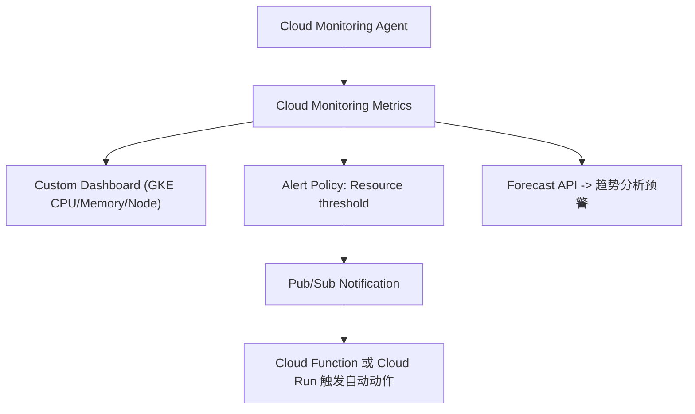

# GKE 容量预测与主动监控 (Capacity Forecasting & Proactive Monitoring)

在 GKE 集群管理中，我们不仅要解决已发生的调度失败问题，更重要的是要能够提前预知资源瓶颈，实现“问题未发生就能预测到”的境界。本方案旨在提供一套系统性的方法，帮助您在资源趋近瓶颈时，自动检测、预警，并辅助决策是否扩容。

---

## **🧩 一、目标与监控层次**

我们的核心目标是在资源（CPU、内存、节点数）趋近瓶颈时，自动检测、预警，并能辅助决策是否扩容。这可以分为以下三个层次的能力：

| **监控层次**      | **目标**                               | **工具建议**                                     |
| :---------------- | :------------------------------------- | :----------------------------------------------- |
| **实时监控 (Reactive)** | 发现异常后第一时间报警                 | Cloud Monitoring（原 Stackdriver）+ Alerting Policy |
| **趋势预测 (Predictive)** | 在资源逼近上限前预警                   | Cloud Monitoring + Forecast Metrics              |
| **自动响应 (Automated)** | 资源不足时自动伸缩                     | Cluster Autoscaler + Node Auto Provisioning (NAP) |

---

## **⚙️ 二、推荐方案架构（基于 GCP 原生能力）**



---

## **🧭 三、关键方案说明**

### **1️⃣ Cloud Monitoring 实时指标采集**

在 GKE 中，默认安装了 `gke-metrics-agent`，会上报以下关键指标：

- 节点资源使用量（CPU、Memory、Disk）
- Pod 数量、Pending 状态
- Autoscaler 扩容触发历史

您可以使用以下命令查看可用的指标：

```bash
gcloud monitoring metrics list --filter='metric.type:"kubernetes.io"'
```

常用指标包括：

| **指标**                                   | **描述**         |
| :----------------------------------------- | :--------------- |
| `kubernetes.io/node/cpu/allocatable_cores` | 节点可分配 CPU   |
| `kubernetes.io/node/memory/allocatable_bytes` | 节点可分配内存   |
| `kubernetes.io/node/memory/used_bytes`     | 当前使用内存     |
| `kubernetes.io/pod/unschedulable`          | 未能调度的 Pod 数量 |

---

### **2️⃣ 配置告警策略 (Alert Policy)**

创建一个告警策略，例如：**当节点内存使用率 > 80% 持续 5 分钟时告警**。

```bash
gcloud monitoring policies create \
  --notification-channels="projects/<PROJECT_ID>/notificationChannels/<CHANNEL_ID>" \
  --condition-display-name="High Node Memory Usage" \
  --condition-filter='metric.type="kubernetes.io/node/memory/used_bytes" / metric.type="kubernetes.io/node/memory/allocatable_bytes" > 0.8' \
  --condition-duration=300s \
  --policy-display-name="GKE Node Memory High"
```

**通知渠道支持：**

- Email
- SMS
- Slack（Webhook）
- Pub/Sub（结合 Cloud Function 自动执行扩容动作）

---

### **3️⃣ 启用 Node Auto Provisioning (NAP)**

通过启用 NAP，GKE 能够自动创建新的节点池，无需人工介入，从而实现更灵活的资源管理。

```bash
gcloud container clusters update <cluster-name> \
  --enable-autoprovisioning \
  --autoprovisioning-config-file nap-config.yaml
```

`nap-config.yaml` 示例：

```yaml
autoprovisioningNodePoolDefaults:
  minCpuPlatform: "Intel Haswell"
  diskSizeGb: 100
  oauthScopes:
  - https://www.googleapis.com/auth/logging.write
  - https://www.googleapis.com/auth/monitoring
  management:
    autoUpgrade: true
    autoRepair: true
  serviceAccount: "gke-node-sa@project-id.iam.gserviceaccount.com"
  upgradeSettings:
    maxSurge: 1
    maxUnavailable: 0
```

---

### **4️⃣ 使用 Looker Studio + BigQuery 做趋势预测**

您可以将 Cloud Monitoring Metrics 定期导出到 BigQuery，并在 Looker Studio（原 Data Studio）中建立仪表板，通过时间序列分析预测未来 7 天内 CPU/Memory 趋势。

**数据导出命令：**

```bash
gcloud monitoring channels create \
  --type bigquery \
  --display-name "GKE Metrics Export"
```

**Looker 可视化建议：**

| **图表类型** | **内容**                       |
| :----------- | :----------------------------- |
| 折线图       | 每日平均 CPU/内存使用率        |
| 热力图       | 各节点资源使用情况             |
| 预测曲线     | 7 天资源趋势线（Forecast）     |

---

### **5️⃣ 自动化触发动作（可选）**

当告警触发时，可以：

- 通过 **Pub/Sub** 推送事件；
- 使用 **Cloud Function** 自动调用 GKE API 扩容；
- 或写入 **BigQuery 日志** 进行后续分析。

示例函数伪代码：

```python
def auto_scale_cluster(event, context):
    import googleapiclient.discovery
    gke = googleapiclient.discovery.build('container', 'v1')
    gke.projects().zones().clusters().nodePools().setSize(
        projectId='my-project',
        zone='asia-east1-b',
        clusterId='my-cluster',
        nodePoolId='default-pool',
        body={'nodeCount': 5}
    ).execute()
```

---

## **🧠 四、最佳实践与经验总结**

| **目标**       | **最佳实践**                                     |
| :------------- | :----------------------------------------------- |
| **容量可视化** | 用 Looker Studio + BigQuery 建立趋势仪表板       |
| **及时告警**   | 使用 Cloud Monitoring + Slack/Webhook 通知       |
| **自动伸缩**   | 开启 Cluster Autoscaler + NAP                    |
| **资源预测**   | 启用 Forecast API 或 Looker 的时间序列预测模型   |
| **定期审核**   | 每周导出 node/pod 使用报告，审查 request/limit 的合理性 |

---

## **📈 五、总结**

> **成熟的集群管理策略是“预测+防御”，不是“故障后修复”。**

通过 **Cloud Monitoring（实时） + Looker Studio（趋势） + Autoscaler（响应）**，您可以实现一个真正智能化、自适应的 GKE 集群管理体系。

