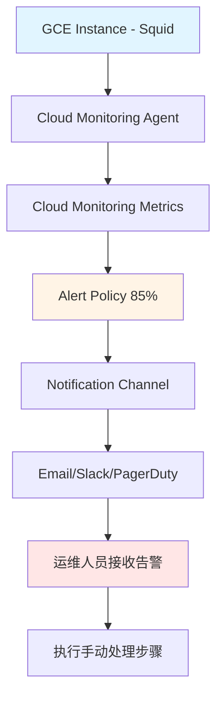
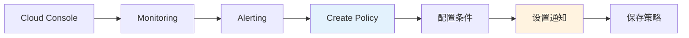
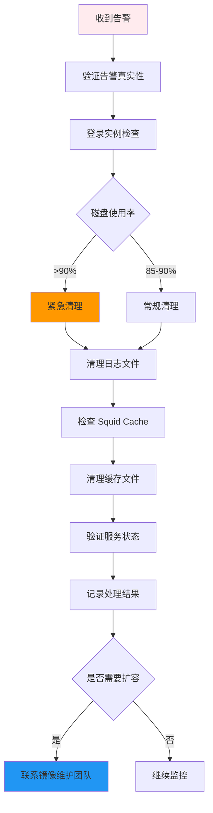
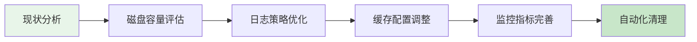

```bash
我们现在有一个监控GCP平台里面 GCE里instances的节点Squid磁盘的一个需求。 我们默认可以 refresh这个资源的Mig. 但是这个资源本身运行的Images不属于我们团队维护。 这个本服务本身是一个代理服务 ，如果磁盘打满的情况下可能会影响一些正常的代理访问,那么我们用户的访问就会有Downtime.所以说我们对这个 MIG应该没有做过多的一些操作的权限。 但是它运营的文平台我们可以监控及磁盘的占用量,那么基于你的角度帮我探索一下如何实现我们的监控需求。比如说监控了磁盘比如85%之后发出告警 ，对于我们平台来说目前都是使用收到告警之后去手中处理然后我需要的是手动处理的一些步骤我并不需要一些更高级的用法。 然后对应的一些操作动作 我们的主机都是不能登录的。 所以ssh登陆主机里面去做对面清理是不现实的。 
```
# ChatGPT  
下面我从 **GCP 平台架构、权限受限场景、最佳实践** 三个角度，为你设计一个**可行、无需修改 MIG/镜像、可对磁盘使用率进行监控并触发告警的完整方案**。

---

# **✅ 目标**

对 **GCE MIG 中的 Squid 实例磁盘占用率（例如 >85%）进行监控**，并在异常时

- 触发告警
- 执行自动动作（可选）
  即使 **你们团队无法修改 MIG 模板或镜像**，也能达成目标。

---

# **🧩 场景挑战**

你提到：

- MIG 使用的是第三方或其他团队维护的 image
- 因此你们无法改镜像加入自定义 metrics agent
- 但可以读取 GCE instance 的磁盘监控指标（通过 Ops Agent / 监控 API）
- 希望达到：磁盘 85% 触发告警 → 后续自动化动作（例如 refresh instance）

⚠️ **关键点**：

Google Cloud **默认所有 GCE 会自动上报磁盘使用率（guest-level metrics）**，前提是 image 中运行的是 Ops Agent 或 legacy agent。

绝大多数 Debian/CentOS/Ubuntu Image 都默认带 **guest agent**，可以直接读取磁盘使用率指标。

---

# **✅ 最终推荐方案（无需动 MIG 和 image）**

## **【方案 A】直接用**

## **Cloud Monitoring → 磁盘使用率指标 → Alert → 自动触发 Cloud Function/Cloud Run**

此方案不改 image、不改 MIG、不改 VM 内部。

---

# **📌 1. 获取磁盘使用率指标（不改镜像）**

在 Cloud Monitoring 中，磁盘使用率对应指标：

```
agent.googleapis.com/disk/percent_used
```

你可以在 Metrics Explorer 看到：

**Dashboard → Metrics Explorer → Resource = gce_instance → Metric = disk/percent_used**

如果该 image 没上报该指标，可以切换为：

- compute.googleapis.com/instance/disk/bytes_used
- compute.googleapis.com/instance/disk/total_bytes

使用 rate / ratio 组合，也可以反推使用率。

---

# **📌 2. 创建 Alert Policy（磁盘使用率 > 85%）**

**Google Cloud Console → Monitoring → Alerting → Create Alert Policy**

条件：

- Resource Type: gce_instance
- Metric: agent.googleapis.com/disk/percent_used
- Condition type: Threshold
- Condition: >= 85% 持续 5 分钟

通知渠道选择：

- Email、Slack、Webhook、PagerDuty
- 或者 Cloud Pub/Sub（用于触发自动动作）

---

# **📌 3. 设置自动动作（可选）**

当 Alert 触发时，可以做几件事：

---

## **🛠️ 自动动作选项 1：刷新 MIG 当中的 instance（推荐）**

如果你的团队 _允许对 MIG 做“重启/replace/refresh”操作_，可以自动执行：

通过 Cloud Function (or Cloud Run) 调用：

```
gcloud compute instance-groups managed recreate-instances
```

示例：

Cloud Function 监听 Pub/Sub alert → 解析 instance ID → 调用：

```
gcloud compute instance-groups managed recreate-instances \
  my-mig \
  --instances=my-instance \
  --zone=us-central1-a
```

⚠️ 优点：

- 不需要对 VM 内部做任何修改
- 彻底解决磁盘满的问题（创建干净的新实例）
- 符合 MIG 设计理念（immutable instance）

---

## **🛠️ 自动动作选项 2：简单地发 Slack / 邮件告警**

最简单版本，让 SRE 人工处理：

- MIG recreate
- 或者通知 image owner 介入

适合初期方案。

---

## **🛠️ 自动动作选项 3：自动清理磁盘（不推荐）**

因为你无法修改 image，所以不做此方案。

---

# **📌 4. 可进一步优化：添加可视化 Dashboard**

在 Monitoring → Dashboard 中展示：

- 每台 Squid instance 磁盘使用率
- MIG instance 状态
- 最近告警记录

这样可以让运营人员一眼看到哪个节点将要被“打满”。

---

# **📌【额外可选】启用 “MIG Auto-Healing” 调用健康检查**

如果：

Squid 磁盘打满后会导致服务端口不可用（例如 3128）

你可以配置：

- Health Check（HTTP/TCP）
- MIG auto-healing = auto recreate instance when unhealthy

这样即使不监控磁盘，只要代理端口异常 → MIG 自动替换实例。

不过这种方案不如磁盘监控精准。

---

# **🧭 最终架构图（文字版）**

```
[Cloud Monitoring Metrics]
        |
        | 85% alert
        v
[Alert Policy]
        |
        +--> Email/Slack
        |
        +--> Pub/Sub ----> [Cloud Function]
                                |
                                v
                         Recreate MIG Instances
```

---

# **🎯 最佳方案总结（符合你的约束）**

| **需求**                  | **解决方式**                                 |
| ------------------------- | -------------------------------------------- |
| 不修改 MIG / 不修改 image | 直接使用 Cloud Monitoring 现有 guest metrics |
| 磁盘 85% 触发告警         | Alerting Policy                              |
| 自动操作                  | Cloud Function 触发 MIG recreate             |
| 可视化                    | Dashboard                                    |

---

如果你愿意，我可以帮你：

✅ 写出监控告警的 JSON / Terraform 配置

✅ 写自动化 Cloud Function (Python/Go) 用于 recreate MIG 实例

✅ 给出完整 Monitoring Dashboard 模板（可直接导入）

✅ 检查当前 MIG 和 metrics 是否已收集到必要指标

你要继续深入哪部分？


# Claude
# GCE Squid 代理磁盘监控方案

## 问题分析

您的场景核心问题：

- **资源归属**：MIG 及 Image 由其他团队维护，操作权限受限
- **业务影响**：Squid 代理磁盘满载会导致用户访问中断
- **监控需求**：磁盘使用率达到 85% 时触发告警
- **处理方式**：手动介入处理，需要明确的操作步骤

---

## 解决方案架构



---

## 监控配置步骤

### 1. 确认 Monitoring Agent 状态

首先确认 GCE 实例已安装 Cloud Monitoring Agent（ops-agent 或旧版 monitoring agent）

```bash
# SSH 登录到 Squid 实例
gcloud compute ssh INSTANCE_NAME --zone=ZONE

# 检查 ops-agent 状态
sudo systemctl status google-cloud-ops-agent

# 如果使用旧版 agent
sudo systemctl status stackdriver-agent
```

**如果未安装**，需要联系镜像维护团队安装，或者申请临时权限安装：

```bash
# 安装 ops-agent (推荐)
curl -sSO https://dl.google.com/cloudagents/add-google-cloud-ops-agent-repo.sh
sudo bash add-google-cloud-ops-agent-repo.sh --also-install
```

---

### 2. 创建磁盘监控告警策略

#### 方式一：通过 GCP Console 创建（推荐）

**步骤流程：**



**详细配置：**

1. 导航到 **Monitoring > Alerting > Create Policy**
2. 点击 **Add Condition**

**条件配置：**

|配置项|值|
|---|---|
|**Target**|VM Instance|
|**Metric**|`agent.googleapis.com/disk/percent_used`|
|**Filter**|`resource.instance_id="YOUR_INSTANCE_ID"` <br> `metric.device="/dev/sda1"` (根据实际磁盘设备)|
|**Threshold**|85|
|**Duration**|5 minutes (避免瞬时波动)|
|**Condition**|Any time series violates|

3. 配置通知渠道（Email/Slack/PagerDuty）
4. 设置告警名称：`Squid Proxy Disk Usage > 85%`

---

#### 方式二：通过 gcloud CLI 创建

```bash
# 创建告警策略配置文件
cat > disk-alert-policy.yaml <<'EOF'
displayName: "Squid Proxy Disk Usage Alert"
conditions:
  - displayName: "Disk usage above 85%"
    conditionThreshold:
      filter: |
        resource.type = "gce_instance"
        AND resource.labels.instance_id = "YOUR_INSTANCE_ID"
        AND metric.type = "agent.googleapis.com/disk/percent_used"
        AND metric.labels.device = "/dev/sda1"
      comparison: COMPARISON_GT
      thresholdValue: 85
      duration: 300s
      aggregations:
        - alignmentPeriod: 60s
          perSeriesAligner: ALIGN_MEAN
notificationChannels:
  - projects/YOUR_PROJECT/notificationChannels/YOUR_CHANNEL_ID
alertStrategy:
  autoClose: 604800s
EOF

# 应用告警策略
gcloud alpha monitoring policies create --policy-from-file=disk-alert-policy.yaml
```

---

### 3. 配置通知渠道

```bash
# 列出现有通知渠道
gcloud alpha monitoring channels list

# 创建 Email 通知渠道
gcloud alpha monitoring channels create \
  --display-name="Ops Team Email" \
  --type=email \
  --channel-labels=email_address=ops-team@example.com

# 创建 Slack 通知渠道（需要先配置 Slack Webhook）
gcloud alpha monitoring channels create \
  --display-name="Ops Slack Channel" \
  --type=slack \
  --channel-labels=url=https://hooks.slack.com/services/YOUR/WEBHOOK/URL
```

---

## 告警触发后的手动处理步骤

### 应急响应流程



---

### 步骤 1：验证告警并登录实例

```bash
# 通过 gcloud SSH 登录
gcloud compute ssh INSTANCE_NAME --zone=ZONE --project=PROJECT_ID

# 或使用 IAP 隧道（如果启用）
gcloud compute ssh INSTANCE_NAME --zone=ZONE --tunnel-through-iap
```

---

### 步骤 2：检查磁盘使用情况

```bash
# 查看整体磁盘使用率
df -h

# 查找占用空间最大的目录（前 20 个）
du -h / --max-depth=2 2>/dev/null | sort -rh | head -20

# 定位具体大文件（大于 100MB）
find / -type f -size +100M -exec ls -lh {} \; 2>/dev/null | awk '{print $9, $5}'

# 检查 inode 使用情况
df -i
```

**预期输出示例：**

```
Filesystem      Size  Used Avail Use% Mounted on
/dev/sda1        50G   43G  7.0G  86% /
```

---

### 步骤 3：清理日志文件（优先操作）

```bash
# 检查系统日志大小
du -sh /var/log

# 清理旧日志（保留最近 7 天）
find /var/log -type f -name "*.log" -mtime +7 -exec rm -f {} \;
find /var/log -type f -name "*.gz" -mtime +7 -exec rm -f {} \;

# 清理 journal 日志
sudo journalctl --vacuum-time=7d
sudo journalctl --vacuum-size=500M

# 清理 Squid 访问日志（根据实际路径）
# 注意：清理前确认日志轮转配置
find /var/log/squid -type f -name "access.log.*" -mtime +3 -delete
find /var/log/squid -type f -name "cache.log.*" -mtime +3 -delete
```

---

### 步骤 4：清理 Squid 缓存

```bash
# 检查 Squid 缓存目录大小
du -sh /var/spool/squid

# 方式一：清理部分过期缓存（不影响服务）
squidclient -h localhost mgr:offline_toggle
sleep 5
squidclient -h localhost mgr:offline_toggle

# 方式二：完全清理缓存（需要短暂中断）
# 警告：此操作会清空所有缓存，可能短暂影响代理性能
sudo systemctl stop squid
sudo rm -rf /var/spool/squid/*
sudo squid -z  # 重建缓存目录结构
sudo systemctl start squid

# 验证 Squid 状态
sudo systemctl status squid
squidclient -h localhost mgr:info | grep "UP Time"
```

---

### 步骤 5：清理临时文件和包缓存

```bash
# 清理 apt 缓存（Debian/Ubuntu）
sudo apt-get clean
sudo apt-get autoclean

# 清理 yum 缓存（CentOS/RHEL）
sudo yum clean all

# 清理临时文件
sudo rm -rf /tmp/*
sudo rm -rf /var/tmp/*

# 清理旧的内核版本（Ubuntu）
sudo apt-get autoremove --purge
```

---

### 步骤 6：验证清理效果

```bash
# 再次检查磁盘使用率
df -h | grep sda1

# 验证 Squid 服务正常运行
curl -x localhost:3128 http://www.google.com -I

# 检查错误日志
tail -50 /var/log/squid/cache.log
```

---

### 步骤 7：记录处理结果

**建议记录内容模板：**

```markdown
## 磁盘清理记录

- **告警时间**: 2025-11-16 10:30:00
- **实例名称**: squid-proxy-01
- **清理前使用率**: 87%
- **清理后使用率**: 62%
- **执行操作**:
  - 清理 7 天前日志：释放 8GB
  - 清理 Squid 缓存：释放 12GB
  - 清理系统临时文件：释放 2GB
- **服务状态**: 正常
- **Downtime**: 无（或 2 分钟）
- **后续建议**: 考虑增加磁盘容量或缩短日志保留周期
```

---

## 预防性措施建议

### 1. 建立日志轮转策略

与镜像维护团队协调配置 logrotate：

```bash
# /etc/logrotate.d/squid 示例配置
/var/log/squid/*.log {
    daily
    rotate 7
    compress
    delaycompress
    notifempty
    missingok
    postrotate
        /usr/sbin/squid -k rotate
    endscript
}
```

---

### 2. 设置多级告警阈值

|告警级别|磁盘使用率|通知对象|响应时间|
|---|---|---|---|
|**Warning**|75%|运维团队|24 小时内|
|**Critical**|85%|运维团队 + 值班|4 小时内|
|**Emergency**|95%|全员|立即响应|

---

### 3. 定期检查脚本

```bash
#!/bin/bash
# disk-check.sh - 定期检查磁盘使用情况

THRESHOLD=80
DISK_USAGE=$(df -h / | awk 'NR==2 {print $5}' | sed 's/%//')

if [ "$DISK_USAGE" -gt "$THRESHOLD" ]; then
    echo "警告: 磁盘使用率 ${DISK_USAGE}% 超过阈值 ${THRESHOLD}%"
    
    # 自动清理操作
    find /var/log -type f -name "*.log" -mtime +7 -delete
    find /tmp -type f -mtime +7 -delete
    
    # 发送通知（需要配置 gcloud SDK）
    gcloud logging write disk-alert "Disk usage: ${DISK_USAGE}%" --severity=WARNING
fi
```

**配置 cron 定时任务：**

```bash
# 每天凌晨 2 点执行检查
0 2 * * * /usr/local/bin/disk-check.sh >> /var/log/disk-check.log 2>&1
```

---

## 注意事项

### ⚠️ 操作风险提醒

1. **清理 Squid 缓存前**：
    
    - 确认当前业务流量不在高峰期
    - 通知相关业务团队可能的性能影响
    - 优先使用 offline_toggle 方式
2. **删除文件前**：
    
    - 确认不是应用程序正在写入的文件
    - 避免删除 Squid 配置文件（通常在 `/etc/squid/`）
    - 使用 `lsof` 检查文件占用情况
3. **权限限制**：
    
    - 如果无 sudo 权限，及时上报需要协调
    - 不要尝试修改 MIG 模板或实例组配置

---

## 长期优化建议

### 与镜像维护团队协调事项



**协调清单：**

- [ ] 评估增加磁盘容量（50GB → 100GB）
- [ ] 配置自动日志轮转和清理
- [ ] 调整 Squid 缓存大小限制
- [ ] 添加磁盘清理 cron 任务到镜像
- [ ] 设置缓存对象过期策略

---

## 快速参考命令

```bash
# 1. 紧急磁盘检查
df -h && du -sh /var/log /var/spool/squid /tmp

# 2. 快速清理（一键执行）
sudo find /var/log -name "*.log" -mtime +7 -delete && \
sudo journalctl --vacuum-time=7d && \
sudo rm -rf /tmp/*

# 3. Squid 状态检查
sudo systemctl status squid && squidclient -h localhost mgr:info

# 4. 查看实时磁盘 I/O
iostat -x 1 5

# 5. 查看占用磁盘的进程
lsof +L1 | grep deleted
```

---

## 总结

基于您的需求，该方案的核心优势：

✅ **无需自动化权限**：所有操作可手动执行  
✅ **最小化风险**：不触及 MIG 和镜像配置  
✅ **清晰流程**：明确的告警响应步骤  
✅ **可追溯性**：完整的操作记录模板  
✅ **渐进式改进**：通过协调逐步优化

建议先实施监控和告警，验证有效性后再与镜像团队协调自动化清理策略。


# Gemini 


这是一个非常典型且棘手的运维场景。你描述的约束条件（无法SSH、对MIG权限有限、镜像是黑盒）使得传统的 "登录清理" 方案不可行。

基于你的情况，**核心思路**是：**利用Cloud Monitoring来检测问题，利用MIG的"实例重建 (Recreate)"能力来解决问题。**

这个方案之所以可行，是因为MIG中的实例被设计为“易失的”(ephemeral)。当一个实例被“重建”时，GCP会终止旧实例（连同它那个被打满的磁盘），然后根据实例模板创建一个全新的、干净的实例来替换它。这就变相地“清空”了磁盘。

下面是实现你需求的完整步骤，分为“监控告警”和“手动处理”两部分。

---

### 准备工作：一个关键假设

这个方案依赖一个**关键假设**：Squid的缓存磁盘（无论是根磁盘还是附加磁盘）在实例模板中的设置是 **“随实例删除而删除” (Delete disk on instance deletion)**。

- **如果** Squid缓存在**启动盘 (Boot disk)** 上，那么这通常是默认设置。
    
- **如果** Squid缓存在一个**单独的数据盘**上，你_必须_去检查该MIG的**实例模板 (Instance Template)**，确保这个数据盘的设置是“随实例删除而删除”。
    

> **警告：** 如果磁盘被设置为“保留”(Keep disk)，那么“重建”实例后，GCP会把那个**仍然是满的旧磁盘**挂载到新实例上，告警会立刻再次触发，问题**永远无法解决**。

---

### 第一部分：设置磁盘监控和告警 (85%)

你需要使用 Google Cloud Monitoring (曾用名 Stackdriver) 来实现。这不需要登录主机，只需要GCE实例上运行着Ops Agent（或旧版的Monitoring Agent）。

1. **前提确认**：
    
    - 由于你不能登录主机，你需要确认这些实例是否在Cloud Monitoring中有数据。
        
    - 进入GCP控制台 -> **Monitoring** -> **Metrics Explorer**。
        
    - 在 "Select a metric" 中，寻找 `agent.googleapis.com/disk/percent_used` 这个指标。
        
    - 如果你能看到这个指标，并且能用 `resource.labels.instance_group` 来过滤到你的MIG，那么恭喜你，监控可以继续。
        
    - (如果_没有_这个指标，说明镜像里没装Ops Agent，你需要联系镜像的维护团队，要求他们必须在镜像中内置Ops Agent，否则无法实现平台级监控。)
        
2. **创建告警策略 (Alerting Policy)**：
    
    - 在GCP控制台，导航到 **Monitoring** -> **Alerting**。
        
    - 点击 **"Create Policy" (创建策略)**。
        
3. **配置指标 (Configure Metric)**：
    
    - 点击 "Select a Metric"。
        
    - **Resource type:** `GCE VM Instance`
        
    - **Metric:** `agent.googleapis.com/disk/percent_used` (在搜索框里输入 `percent_used` 就能找到)
        
    - **Filter (过滤)**: 这是**最关键**的一步。
        
        - 添加一个
            
            resource.labels.instance_group = [你的MIG名称]
            
        - （可选）如果你的Squid缓存在特定分区（比如 /dev/sdb1），你还需要添加一个
            
            metric.labels.device = [设备名，如 sdb1]
            
            如果缓存在根目录，你可能需要选择 device 类似 sda1 或 nvme0n1p1 的分区。
            
    - **Aggregation (聚合)**: 保持默认 (e.g., `mean`, `5 min`) 即可。
        
4. **配置触发器 (Configure Trigger)**：
    
    - **Condition type (条件类型):** `Threshold` (阈值)
        
    - **Alert trigger (告警触发器):** `Any time series violates` (任何时间序列违反)
        
    - **Threshold position (阈值位置):** `Above threshold` (高于阈值)
        
    - **Threshold value (阈值):** `85` (单位是 %，Metric那里选了percent_used，这里就直接填85)
        
    - **For (持续时间):** `5 minutes` (或根据你的容忍度调整，例如5分钟内持续高于85%才告警)。
        
5. **配置通知 (Configure Notifications)**：
    
    - 选择一个你团队能收到的 **Notification Channel (通知渠道)** (例如 Email, PagerDuty, Slack等)。
        
    - 给这个告警策略起一个清晰的名字，例如 "Squid MIG Disk > 85%"。
        
    - 保存策略。
        

---

### 第二部分：收到告警后的手动处理步骤

当你团队的On-call人员收到上述告警邮件（或消息）时，请按照以下步骤**手动处理**。

1. [收到告警]
    
    你收到一封来自Cloud Monitoring的告警邮件。
    
2. [识别主机]
    
    打开告警邮件或进入Monitoring的Alerts页面。告警内容会明确告诉你哪一个实例 (Instance Name) 的磁盘满了。
    
    - _例如：告警实例为 `squid-proxy-mig-abcd`_。
        
3. [进入MIG控制台]
    
    在GCP控制台中，导航到 Compute Engine -> Instance groups (实例组)。
    
4. [定位MIG]
    
    在列表中找到你的Squid代理服务的MIG，点击它的名字进入详情页面。
    
5. [定位问题实例]
    
    在MIG详情页的 "Instances" (实例) 标签页下，找到那台告警的实例 (例如 squid-proxy-mig-abcd)。
    
6. **[执行"重建"操作]**
    
    - **选中**那台问题实例前面的复选框。
        
    - 点击页面顶部的 **"RECREATE" (重建)** 按钮。
        
    - 系统会弹出一个确认框，确认即可。
        
7. **[等待MIG自愈]**
    
    - 此时，MIG的"重建"操作会开始。
        
    - GCP会先**终止 (Terminating)** `squid-proxy-mig-abcd` 这个实例。如果MIG配置了负载均衡(LB)，LB会停止向它转发流量（这对你的用户访问是透明的）。
        
    - 然后，GCP会根据实例模板**创建一个全新的实例** (例如 `squid-proxy-mig-wxyz`) 来替换它，以保持MIG设定的实例总数。
        
    - 这个新实例的磁盘是全新的、空的。
        
8. [问题解决]
    
    几分钟后，新实例启动并加入到MIG和服务中。磁盘空间问题被解决。Cloud Monitoring中的告警会自动清除 (auto-resolve)。
    

---

### 总结

这个方案完美规避了“不能SSH”和“权限受限”的问题。你不需要关心实例内部发生了什么，你只是利用了Cloud Monitoring来“观察”状态，并利用MIG的“重建”功能来“重置”状态。这是一种符合GCP云原生设计思路的运维方式。

我建议你下一步先去 **Cloud Monitoring的Metrics Explorer** 确认一下 `agent.googleapis.com/disk/percent_used` 指标是否可用。

你需要我帮你详细说明如何去Metrics Explorer里查找这个指标吗？