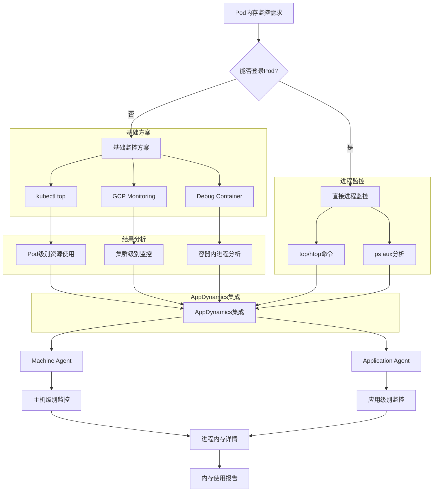

# GKE Pod 内存监控指南

在GKE中，即使无法直接登录到Pod内部，也有多种方法可以有效监控其内存使用情况。本文将详细介绍这些方法。

## 一、 基础监控方法

### 1. `kubectl top` 命令

通过 `kubectl top` 可以快速查看Pod和容器的总体资源使用情况。

- **查看Pod总体资源使用:**
  ```bash
  kubectl top pods -n <namespace>
  ```

- **查看Pod中容器的资源使用:**
  ```bash
  kubectl top pods <pod-name> -n <namespace> --containers
  ```

### 2. `kubectl describe` 查看资源限制和请求

此命令可以帮助了解Pod的资源配置和事件。

```bash
kubectl describe pod <pod-name> -n <namespace>
```

## 二、 高级监控解决方案

### 3. 使用 Kubernetes Metrics Server + Custom Queries

对于更精细化的监控，可以直接查询Metrics Server。

```bash
# 通过 kubectl 获取详细指标
kubectl get --raw "/api/v1/nodes/<node-name>/proxy/metrics/cadvisor" | grep container_memory
```

### 4. Google Cloud Monitoring 集成

启用GKE与Google Cloud Monitoring的集成，可以实现更全面的集群监控。

```bash
# 启用GKE监控
gcloud container jiquns update <jiqun-name> \
    --enable-cloud-monitoring \
    --zone=<zone>
```

## 三、 进程级别监控方案

### 5. 使用 Debug Container (Kubernetes 1.20+)

当需要深入Pod内部进行调试时，可以使用`kubectl debug`。

```bash
# 创建调试容器
kubectl debug <pod-name> -it --image=busybox --target=<container-name>

# 在调试容器中查看进程
ps aux
top -p <pid>
```

### 6. 部署 Node Exporter + Prometheus

通过部署`node-exporter`，可以收集节点级别的详细指标。

```yaml
# node-exporter-daemonset.yaml
apiVersion: apps/v1
kind: DaemonSet
metadata:
  name: node-exporter
spec:
  selector:
    matchLabels:
      app: node-exporter
  template:
    metadata:
      labels:
        app: node-exporter
    spec:
      hostPID: true
      hostNetwork: true
      containers:
      - name: node-exporter
        image: prom/node-exporter:latest
        args:
        - '--path.procfs=/host/proc'
        - '--path.sysfs=/host/sys'
        - '--collector.filesystem.ignored-mount-points=^/(sys|proc|dev|host|etc)($|/)'
        volumeMounts:
        - name: proc
          mountPath: /host/proc
          readOnly: true
        - name: sys
          mountPath: /host/sys
          readOnly: true
      volumes:
      - name: proc
        hostPath:
          path: /proc
      - name: sys
        hostPath:
          path: /sys
```

## 四、 AppDynamics (APPD) 集成方案

### 7. AppDynamics Machine Agent 部署

部署Machine Agent可以实现主机级别的监控。

```yaml
# appd-machine-agent.yaml
apiVersion: apps/v1
kind: DaemonSet
metadata:
  name: appd-machine-agent
spec:
  selector:
    matchLabels:
      app: appd-machine-agent
  template:
    metadata:
      labels:
        app: appd-machine-agent
    spec:
      containers:
      - name: machine-agent
        image: appdynamics/machine-agent-analytics:latest
        env:
        - name: APPDYNAMICS_CONTROLLER_HOST_NAME
          value: "<controller-host>"
        - name: APPDYNAMICS_CONTROLLER_PORT
          value: "443"
        - name: APPDYNAMICS_CONTROLLER_SSL_ENABLED
          value: "true"
        - name: APPDYNAMICS_AGENT_ACCOUNT_NAME
          value: "<account-name>"
        - name: APPDYNAMICS_AGENT_ACCOUNT_ACCESS_KEY
          valueFrom:
            secretKeyRef:
              name: appd-secret
              key: access-key
        - name: APPDYNAMICS_MACHINE_HIERARCHY_PATH
          value: "GKE|<jiqun-name>|<node-name>"
        volumeMounts:
        - name: proc
          mountPath: /hostroot/proc
          readOnly: true
        - name: sys
          mountPath: /hostroot/sys
          readOnly: true
        - name: docker-sock
          mountPath: /var/run/docker.sock
          readOnly: true
      volumes:
      - name: proc
        hostPath:
          path: /proc
      - name: sys
        hostPath:
          path: /sys
      - name: docker-sock
        hostPath:
          path: /var/run/docker.sock
```

### 8. AppDynamics 应用级监控配置

通过注入Java Agent，可以实现应用内部的深度监控。

```yaml
# 在应用Pod中注入AppD Java Agent
apiVersion: apps/v1
kind: Deployment
metadata:
  name: your-app
spec:
  template:
    spec:
      initContainers:
      - name: appd-agent
        image: appdynamics/java-agent:latest
        command: ['cp', '-r', '/opt/appdynamics/.', '/shared-vol/']
        volumeMounts:
        - name: appd-agent-vol
          mountPath: /shared-vol
      containers:
      - name: your-app
        image: your-app:latest
        env:
        - name: JAVA_OPTS
          value: "-javaagent:/opt/appdynamics/javaagent.jar"
        - name: APPDYNAMICS_CONTROLLER_HOST_NAME
          value: "<controller-host>"
        - name: APPDYNAMICS_AGENT_APPLICATION_NAME
          value: "<app-name>"
        - name: APPDYNAMICS_AGENT_TIER_NAME
          value: "<tier-name>"
        volumeMounts:
        - name: appd-agent-vol
          mountPath: /opt/appdynamics
      volumes:
      - name: appd-agent-vol
        emptyDir: {}
```

## 五、 内存监控流程图



## 六、 AppDynamics内存监控配置表

| 监控类型        | Agent类型 | 部署方式     | 监控粒度   | 数据保留 |
|-----------------|-----------|--------------|------------|----------|
| Machine Agent   | 机器代理  | DaemonSet    | 主机/容器级| 90天     |
| Java Agent      | 应用代理  | Sidecar/Init | 方法/线程级| 30天     |
| Analytics Agent | 分析代理  | 独立部署     | 事务级     | 1年      |
| Network Agent   | 网络代理  | DaemonSet    | 网络流量   | 30天     |

## 七、 推荐监控策略

### 短期解决方案

1.  **立即查看资源使用:**
    ```bash
    kubectl top pods --all-namespaces --sort-by=memory
    ```
2.  **创建调试容器查看进程:**
    ```bash
    kubectl debug <pod-name> -it --image=busybox
    ```

### 长期监控方案

1.  **部署AppDynamics Machine Agent** 用于主机级监控。
2.  **集成Application Agent** 用于应用级深度监控。
3.  **配置GCP Monitoring** 用于集群整体监控。
4.  **设置告警规则** 用于异常检测。

通过这种分层监控策略，你可以获得从集群到进程级别的完整内存使用视图，即使无法直接登录到Pod内部。

## 八、 详细调研报告

### 背景与问题分析

用户需要在GKE上监控Pod内部的内存占用情况（具体到进程或线程级），但在无法直接登录Pod的情况下，传统的Linux命令（如`top`、`ps aux`）无法使用。

### Kubernetes 和 GKE 的监控能力

- **`kubectl top pod`**: 提供Pod级别的CPU和内存使用。
- **`kubectl describe pod`**: 显示容器的资源请求和限制。
- **Google Cloud Monitoring**: 集成GKE，提供节点和容器级别的内存使用指标（如`node/memory/allocatable_utilization` 和 `container/memory/usage_bytes`），但同样不包含进程级数据。

### AppDynamics 的扩展能力

- **Cluster Agent**: 监控Kubernetes集群的健康状态、调度问题和容器行为。
- **应用层监控**: 如果应用已通过AppDynamics代理（如Java Agent）进行检测，可以获取应用内存使用情况（如堆内存、垃圾回收），但这是应用整体的表现，不涉及具体进程。
- **Process Monitoring Extension**: 此扩展适用于主机级别，而非Kubernetes容器内的进程。

### 替代方案与限制

1.  **`kubectl exec` 非交互式运行命令**:
    如果权限允许，这是最直接的方法。
    ```bash
    kubectl exec <pod-name> -- ps aux
    ```
    但如果无法登录，此命令也可能受限。

2.  **部署侧车容器监控**:
    在Pod中添加一个侧车容器（如Prometheus Node Exporter），用于收集进程级指标。这需要修改Pod的部署配置。
    ```yaml
    # 示例: 在Pod中添加一个监控容器
    apiVersion: v1
    kind: Pod
    metadata:
      name: my-pod
    spec:
      containers:
      - name: main-app
        image: my-app-image
      - name: monitor
        image: prom/node-exporter
        command: ["sh", "-c", "while true; do ps aux > /proc/1/fd/1; sleep 60; done"]
    ```

3.  **检查Kubernetes事件和日志**:
    通过`kubectl logs`或`kubectl describe pod`检查OOM (Out of Memory)事件，可以间接推断内存问题。

### 总结与建议

- **当前限制**: 无法登录Pod，且现有工具（Kubernetes, GKE, AppDynamics）主要聚焦于容器级监控。
- **建议**:
    - **首选**: 尝试获取`kubectl exec`权限。
    - **其次**: 增强AppDynamics的应用层监控。
    - **长期方案**: 考虑部署侧车容器进行监控。

### 监控方法适用性总结

| 方法                     | 适用场景         | 进程级支持 | 权限/变更需求        |
|--------------------------|------------------|------------|----------------------|
| AppDynamics 应用监控     | 已仪表化应用     | 否         | 无需额外权限         |
| Kubernetes/GKE 监控      | 容器级资源使用   | 否         | 无需额外权限         |
| `kubectl exec ps aux`    | 有执行权限       | 是         | 需要 `kubectl exec`  |
| 侧车容器 (如 Prometheus) | 可修改Pod配置    | 是         | 需要部署变更         |
| 检查日志和事件           | 诊断OOM问题      | 间接       | 无需额外权限         |
