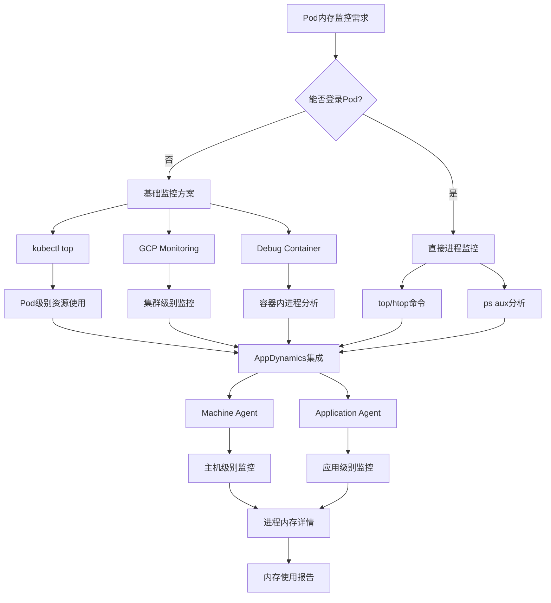

在GKE中监控Pod内存使用情况，即使无法登录到Pod内部，有多种方法可以实现。我来为你详细介绍：

## 基础监控方法

### 1. kubectl top 命令

```bash
# 查看Pod总体资源使用
kubectl top pods -n <namespace>

# 查看Pod中容器的资源使用
kubectl top pods <pod-name> -n <namespace> --containers
```

### 2. kubectl describe 查看资源限制和请求

```bash
kubectl describe pod <pod-name> -n <namespace>
```

## 高级监控解决方案

### 3. 使用 Kubernetes Metrics Server + Custom Queries

```bash
# 通过 kubectl 获取详细指标
kubectl get --raw "/api/v1/nodes/<node-name>/proxy/metrics/cadvisor" | grep container_memory
```

### 4. Google Cloud Monitoring集成

```bash
# 启用GKE监控
gcloud container clusters update <cluster-name> \
    --enable-cloud-monitoring \
    --zone=<zone>
```

## 进程级别监控方案

### 5. 使用 Debug Container (Kubernetes 1.20+)

```bash
# 创建调试容器
kubectl debug <pod-name> -it --image=busybox --target=<container-name>

# 在调试容器中查看进程
ps aux
top -p <pid>
```

### 6. 部署 Node Exporter + Prometheus

```yaml
# node-exporter-daemonset.yaml
apiVersion: apps/v1
kind: DaemonSet
metadata:
  name: node-exporter
spec:
  selector:
    matchLabels:
      app: node-exporter
  template:
    metadata:
      labels:
        app: node-exporter
    spec:
      hostPID: true
      hostNetwork: true
      containers:
      - name: node-exporter
        image: prom/node-exporter:latest
        args:
        - '--path.procfs=/host/proc'
        - '--path.sysfs=/host/sys'
        - '--collector.filesystem.ignored-mount-points=^/(sys|proc|dev|host|etc)($|/)'
        volumeMounts:
        - name: proc
          mountPath: /host/proc
          readOnly: true
        - name: sys
          mountPath: /host/sys
          readOnly: true
      volumes:
      - name: proc
        hostPath:
          path: /proc
      - name: sys
        hostPath:
          path: /sys
```

## AppDynamics (APPD) 集成方案

### 7. AppDynamics Machine Agent部署

```yaml
# appd-machine-agent.yaml
apiVersion: apps/v1
kind: DaemonSet
metadata:
  name: appd-machine-agent
spec:
  selector:
    matchLabels:
      app: appd-machine-agent
  template:
    metadata:
      labels:
        app: appd-machine-agent
    spec:
      containers:
      - name: machine-agent
        image: appdynamics/machine-agent-analytics:latest
        env:
        - name: APPDYNAMICS_CONTROLLER_HOST_NAME
          value: "<controller-host>"
        - name: APPDYNAMICS_CONTROLLER_PORT
          value: "443"
        - name: APPDYNAMICS_CONTROLLER_SSL_ENABLED
          value: "true"
        - name: APPDYNAMICS_AGENT_ACCOUNT_NAME
          value: "<account-name>"
        - name: APPDYNAMICS_AGENT_ACCOUNT_ACCESS_KEY
          valueFrom:
            secretKeyRef:
              name: appd-secret
              key: access-key
        - name: APPDYNAMICS_MACHINE_HIERARCHY_PATH
          value: "GKE|<cluster-name>|<node-name>"
        volumeMounts:
        - name: proc
          mountPath: /hostroot/proc
          readOnly: true
        - name: sys
          mountPath: /hostroot/sys
          readOnly: true
        - name: docker-sock
          mountPath: /var/run/docker.sock
          readOnly: true
      volumes:
      - name: proc
        hostPath:
          path: /proc
      - name: sys
        hostPath:
          path: /sys
      - name: docker-sock
        hostPath:
          path: /var/run/docker.sock
```

### 8. AppDynamics应用级监控配置

```yaml
# 在应用Pod中注入AppD Java Agent
apiVersion: apps/v1
kind: Deployment
metadata:
  name: your-app
spec:
  template:
    spec:
      initContainers:
      - name: appd-agent
        image: appdynamics/java-agent:latest
        command: ['cp', '-r', '/opt/appdynamics/.', '/shared-vol/']
        volumeMounts:
        - name: appd-agent-vol
          mountPath: /shared-vol
      containers:
      - name: your-app
        image: your-app:latest
        env:
        - name: JAVA_OPTS
          value: "-javaagent:/opt/appdynamics/javaagent.jar"
        - name: APPDYNAMICS_CONTROLLER_HOST_NAME
          value: "<controller-host>"
        - name: APPDYNAMICS_AGENT_APPLICATION_NAME
          value: "<app-name>"
        - name: APPDYNAMICS_AGENT_TIER_NAME
          value: "<tier-name>"
        volumeMounts:
        - name: appd-agent-vol
          mountPath: /opt/appdynamics
      volumes:
      - name: appd-agent-vol
        emptyDir: {}
```

## 内存监控流程图



## AppDynamics内存监控配置表

|监控类型           |Agent类型|部署方式        |监控粒度  |数据保留|
|---------------|-------|------------|------|----|
|Machine Agent  |机器代理   |DaemonSet   |主机/容器级|90天 |
|Java Agent     |应用代理   |Sidecar/Init|方法/线程级|30天 |
|Analytics Agent|分析代理   |独立部署        |事务级   |1年  |
|Network Agent  |网络代理   |DaemonSet   |网络流量  |30天 |

## 推荐监控策略

### 短期解决方案

```bash
# 1. 立即查看资源使用
kubectl top pods --all-namespaces --sort-by=memory

# 2. 创建调试容器查看进程
kubectl debug <pod-name> -it --image=busybox
```

### 长期监控方案

1. **部署AppDynamics Machine Agent**用于主机级监控
1. **集成Application Agent**用于应用级深度监控
1. **配置GCP Monitoring**用于集群整体监控
1. **设置告警规则**用于异常检测

通过这种分层监控策略，你可以获得从集群到进程级别的完整内存使用视图，即使无法直接登录到Pod内部。​​​​​​​​​​​​​​​​

关键要点

- 无法直接从外部查看 Pod 内部的进程或线程级内存占用，需登录 Pod 或运行命令。
- AppDynamics 可监控应用层内存使用，但不直接提供进程或线程级细节。
- Kubernetes 和 GKE 提供容器级内存监控，但不涉及进程级。
- 建议检查是否能通过 kubectl exec 非交互式运行命令，或调整监控配置。

内存监控方法

由于无法登录 Pod，传统的进程级监控（如 ps aux 或 top）不可用。以下是可行的替代方法：

使用 AppDynamics 监控

- 如果应用已通过 AppDynamics 代理（如 Java 或 .NET 应用）进行仪表化，AppDynamics 可提供应用层内存使用情况，但不直接显示具体进程或线程的内存占用。
- 可通过 AppDynamics 的“开发级监控”获取更详细的事务级数据，但仍限于应用性能层面。

Kubernetes 和 GKE 内置监控

- 使用 kubectl top pod 查看 Pod 的容器级内存使用，命令如下：kubectl top pod  --namespace=
-   
    
- GKE 集成 Google Cloud Monitoring，可查看容器内存使用，但同样不涉及进程级。

限制与建议

- 如果允许，尝试使用 kubectl exec 非交互式运行命令，例如：kubectl exec  -- ps aux
-   
    查看进程内存使用，但需确保有权限。
- 若无法运行命令，建议调整 Pod 配置，添加侧车容器（如 Prometheus Node Exporter）收集进程级指标，但需修改部署。

  

详细调研报告

以下是关于在 GKE 中监控 Pod 内部内存占用情况的详细分析，特别是在无法登录 Pod 的情况下，结合 AppDynamics（APPD）等工具的扩展。

背景与问题分析

用户运行 Pod 于 Google Kubernetes Engine (GKE) 上，需查看 Pod 内部的内存占用情况，具体到进程或线程级。由于无法登录 Pod，传统的 Linux 命令（如 top、ps aux）无法直接使用。用户提到有 AppDynamics（APPD），希望结合此工具扩展监控能力。

GKE 作为托管的 Kubernetes 服务，提供了丰富的监控功能，但默认聚焦于集群、节点、Pod 和容器级别的资源使用，而非进程或线程级。AppDynamics 则是一个应用性能监控（APM）工具，擅长监控应用层性能，但其 Kubernetes 监控能力需进一步分析。

Kubernetes 和 GKE 的监控能力

Kubernetes 本身通过 Metrics Server 提供资源使用指标，主要包括：

- Pod 级别的 CPU 和内存使用（通过 kubectl top pod 查看）。
- 容器级别的资源请求和限制（通过 kubectl describe pod 查看）。

GKE 集成了 Google Cloud Monitoring（原 Stackdriver），可通过 Cloud Operations for GKE 套件监控集群健康，包括：

- 节点内存使用（如 node/memory/allocatable_utilization）。
- 容器内存使用（如 container/memory/usage_bytes）。

但这些指标均限于容器级，无法直接获取 Pod 内部进程或线程的内存占用。例如：

- kubectl top pod 输出如下格式：NAME          CPU(cores)   MEMORY(bytes)
- my-pod        100m         200Mi
-   
    仅显示总内存使用，不涉及进程级。

Google Cloud Monitoring 的文档（如 [Cloud Monitoring API Metrics](https://cloud.google.com/monitoring/api/metrics_kubernetes)）明确指出，GKE 系统指标不包括进程级监控，重点在 Pod 和容器层面。

AppDynamics 的扩展能力

AppDynamics 通过 Cluster Agent 监控 Kubernetes 集群，可收集集群、节点、命名空间到容器级的指标（如 [AppDynamics Kubernetes Monitoring](https://docs.appdynamics.com/appd/24.x/latest/en/infrastructure-visibility/monitor-kubernetes-with-the-cluster-agent)）。其功能包括：

- 监控 Pod 健康状态、调度问题和容器行为。
- 如果应用已通过 AppDynamics 代理（如 Java Agent）仪表化，可获取应用层性能数据，包括内存使用、事务响应时间等。

但从文档和相关资料（如 [Kubernetes Monitoring with AppDynamics](https://www.appdynamics.com/appd-campaigns/kubernetes-monitoring)）来看，AppDynamics 的标准监控不直接提供进程或线程级内存使用。以下是关键点：

- 应用层监控：若应用已仪表化，AppDynamics 可显示应用内存使用（如堆内存、垃圾回收情况），但这是应用整体表现，不涉及具体进程或线程。
- 开发级监控：AppDynamics 提供“Development Level Monitoring”，可增强事务级数据的保留（如调用图、SQL 语句捕获），但仍聚焦于应用性能，而非操作系统级进程监控。
- Process Monitoring Extension：AppDynamics 有 Process Monitoring Extension（见 [GitHub: AppDynamics Process Monitoring Extension](https://github.com/Appdynamics/process-monitoring-extension)），但该扩展适用于主机级（Linux/Windows），监控整个机器的进程，而非 Kubernetes 容器内的进程。

因此，AppDynamics 在当前配置下，难以直接满足用户需求，即查看 Pod 内部具体进程或线程的内存占用。

替代方案与限制

由于无法登录 Pod，传统的 Linux 进程监控工具（如 ps aux、top）不可用。以下是可能的替代方案及其限制：

1. 使用 kubectl exec 非交互式运行命令：

- 如果用户有权限，可以通过 kubectl exec 运行命令，例如：kubectl exec  -- ps aux
-   
    输出进程列表及其内存使用（如 RSS、VSZ）。但用户明确表示无法登录 Pod，可能意味着权限限制，kubectl exec 也受限。
- 示例输出：  
    USER       PID %CPU %MEM    VSZ   RSS TTY      STAT START   TIME COMMAND
- root         1  0.0  0.1  12345  6789 ?        Ss   12:00   0:00 /bin/bash
- root        10  0.0  0.2  23456  8901 ?        R    12:01   0:01 my-app
-   
    此方法直接，但需权限支持。

3. 部署侧车容器监控：

- 可在 Pod 中添加侧车容器（如 Prometheus Node Exporter 或 Sysdig），收集进程级指标并导出到外部监控系统。
- 示例 Pod 配置（YAML 片段）：  
    apiVersion: v1
- kind: Pod
- metadata:
-   name: my-pod
- spec:
-   containers:
-   - name: main-app
-     image: my-app-image
-   - name: monitor
-     image: prom/node-exporter
-     command: ["sh", "-c", "while true; do ps aux > /proc/1/fd/1; sleep 60; done"]
-   
    
- 此方法需修改 Pod 部署，可能不适合现有环境。

5. 检查 Kubernetes 事件和日志：

- 使用 kubectl logs 或 kubectl describe pod 检查是否有 OOM（内存溢出）事件，间接推测内存问题。
- 示例日志：  
    Warning: OOMKilling Memory cgroup out of memory: Kill process 12345 (my-process) score 1000
-   
    
- 此方法不提供实时进程级数据，仅用于问题诊断。

流程图（Mermaid）

以下是监控流程的流程图，帮助理解各步骤：

flowchart TD

    A[开始：需监控 Pod 内存] --> B{能使用 kubectl exec 吗?}

    B -->|是| C[运行 ps aux 或 top，查看进程内存]

    B -->|否| D[检查 AppDynamics 配置]

    D --> E{应用已仪表化吗?}

    E -->|是| F[查看应用层内存使用，分析性能]

    E -->|否| G[使用 Kubernetes/GKE 监控，查看容器级内存]

    G --> H[检查日志和事件，寻找 OOM 提示]

    H --> I[结束：无法直接获取进程级数据]

总结与建议

- 当前限制：无法登录 Pod 且 AppDynamics 不直接提供进程或线程级内存监控，现有工具（Kubernetes、GKE、AppDynamics）均聚焦容器级。
- 建议：

- 若可能，尝试获取 kubectl exec 权限，运行 ps aux 查看进程内存。
- 若应用支持，增强 AppDynamics 仪表化，获取应用层内存数据。
- 考虑长期方案，调整 Pod 配置添加侧车容器监控，但需权衡部署变更成本。

- 参考文档：

- [AppDynamics Kubernetes Monitoring](https://docs.appdynamics.com/appd/24.x/latest/en/infrastructure-visibility/monitor-kubernetes-with-the-cluster-agent)
- [Kubernetes Resource Management](https://kubernetes.io/docs/concepts/configuration/manage-resources-containers/)
- [Google Cloud Monitoring for GKE](https://cloud.google.com/monitoring/api/metrics_kubernetes)

以下表格总结各监控方法及其适用性：

|   |   |   |   |
|---|---|---|---|
|方法|适用场景|进程级支持|需权限/变更|
|AppDynamics 应用监控|已仪表化应用|否|无需额外权限|
|Kubernetes/GKE 监控|容器级资源使用|否|无需额外权限|
|kubectl exec ps aux|有执行权限|是|需要 kubectl exec|
|侧车容器（如 Prometheus）|可修改 Pod 配置|是|需要部署变更|
|检查日志和事件|诊断 OOM 问题|间接|无需额外权限|

希望以上信息对您有所帮助，若有进一步需求，请随时告知。